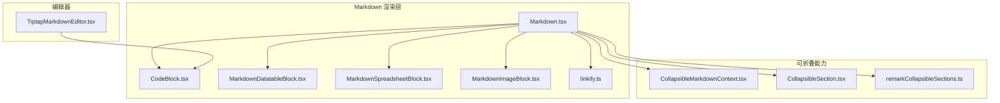
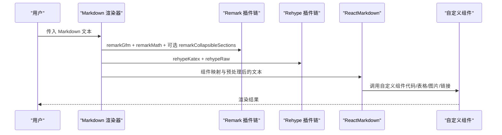
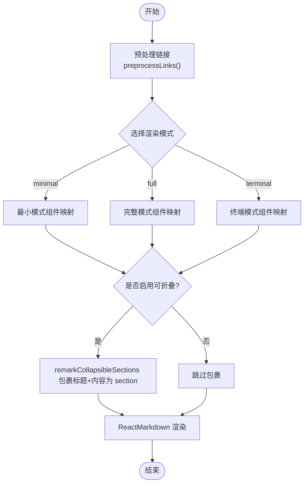
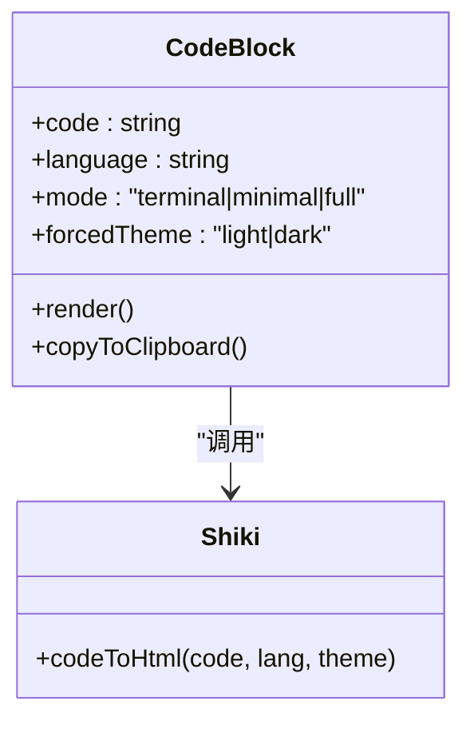
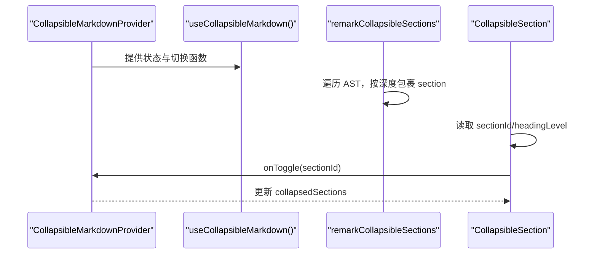
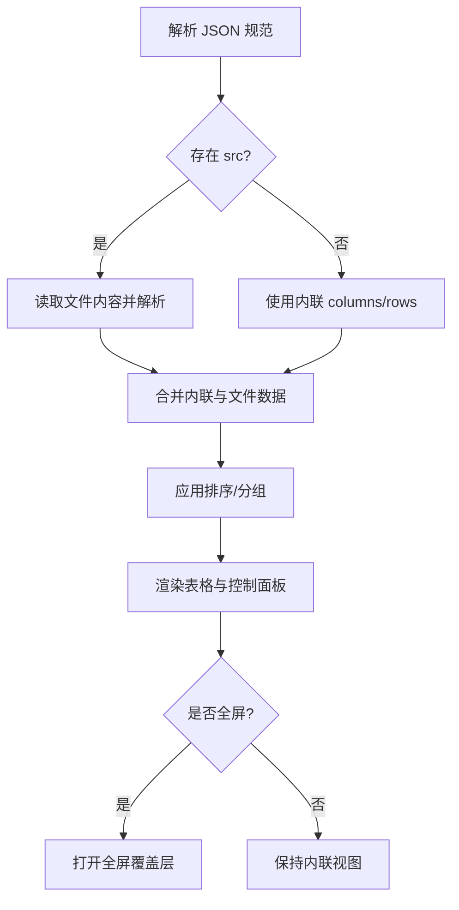
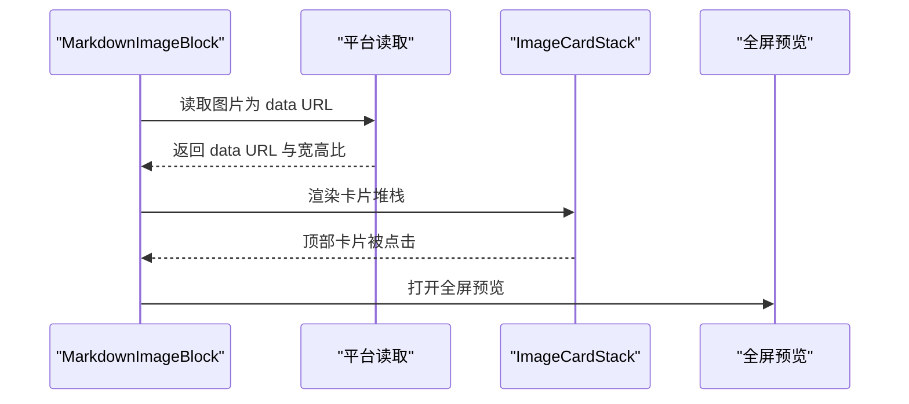
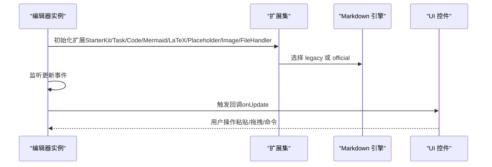
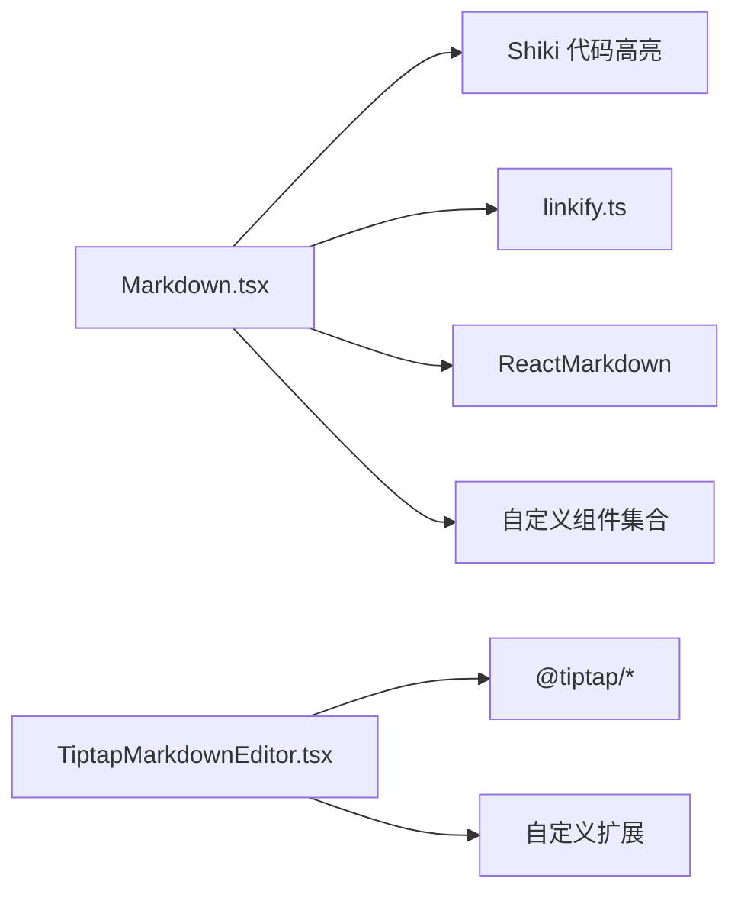

# Markdown 组件

<cite>
**本文引用的文件**
- [Markdown.tsx](file://packages/ui/src/components/markdown/Markdown.tsx)
- [index.ts](file://packages/ui/src/components/markdown/index.ts)
- [CollapsibleMarkdownContext.tsx](file://packages/ui/src/components/markdown/CollapsibleMarkdownContext.tsx)
- [CollapsibleSection.tsx](file://packages/ui/src/components/markdown/CollapsibleSection.tsx)
- [CodeBlock.tsx](file://packages/ui/src/components/markdown/CodeBlock.tsx)
- [MarkdownDatatableBlock.tsx](file://packages/ui/src/components/markdown/MarkdownDatatableBlock.tsx)
- [MarkdownSpreadsheetBlock.tsx](file://packages/ui/src/components/markdown/MarkdownSpreadsheetBlock.tsx)
- [MarkdownImageBlock.tsx](file://packages/ui/src/components/markdown/MarkdownImageBlock.tsx)
- [ImageCardStack.tsx](file://packages/ui/src/components/markdown/ImageCardStack.tsx)
- [linkify.ts](file://packages/ui/src/components/markdown/linkify.ts)
- [remarkCollapsibleSections.ts](file://packages/ui/src/components/markdown/remarkCollapsibleSections.ts)
- [TiptapMarkdownEditor.tsx](file://packages/ui/src/components/markdown/TiptapMarkdownEditor.tsx)
</cite>

## 目录
1. [简介](#简介)
2. [项目结构](#项目结构)
3. [核心组件](#核心组件)
4. [架构总览](#架构总览)
5. [详细组件分析](#详细组件分析)
6. [依赖关系分析](#依赖关系分析)
7. [性能考量](#性能考量)
8. [故障排查指南](#故障排查指南)
9. [结论](#结论)
10. [附录](#附录)

## 简介
本文件为前端开发者提供一套“Markdown 组件”的系统化开发文档，覆盖以下主题：
- 自定义 Markdown 渲染器的实现原理：语法高亮、表格渲染、图片处理、链接与文件路径解析、数学公式与 Mermaid 图表支持。
- 可折叠 Markdown 提供者（CollapsibleMarkdownProvider）与折叠节（CollapsibleSection）的工作机制。
- 记忆化渲染（MemoizedMarkdown）在流式渲染场景下的性能优化策略。
- Markdown 编辑器（TiptapMarkdownEditor）的集成方式、工具栏配置与扩展机制。
- 数据表块（MarkdownDatatableBlock）、电子表格块（MarkdownSpreadsheetBlock）、图片卡片堆栈（ImageCardStack）等特殊组件的使用方法与最佳实践。
- Markdown 渲染配置、样式定制与编辑器扩展的开发指南。

## 项目结构
Markdown 组件位于 @craft-agent/ui 包中，采用按功能模块划分的组织方式：
- 核心渲染器：Markdown.tsx
- 可折叠能力：CollapsibleMarkdownContext.tsx、CollapsibleSection.tsx、remarkCollapsibleSections.ts
- 语法高亮与代码块：CodeBlock.tsx
- 特殊块：MarkdownDatatableBlock.tsx、MarkdownSpreadsheetBlock.tsx、MarkdownImageBlock.tsx、ImageCardStack.tsx
- 链接预处理：linkify.ts
- 编辑器：TiptapMarkdownEditor.tsx
- 导出入口：index.ts



图表来源
- [Markdown.tsx:1-599](file://packages/ui/src/components/markdown/Markdown.tsx#L1-L599)
- [CodeBlock.tsx:1-235](file://packages/ui/src/components/markdown/CodeBlock.tsx#L1-L235)
- [MarkdownDatatableBlock.tsx:1-721](file://packages/ui/src/components/markdown/MarkdownDatatableBlock.tsx#L1-L721)
- [MarkdownSpreadsheetBlock.tsx:1-320](file://packages/ui/src/components/markdown/MarkdownSpreadsheetBlock.tsx#L1-L320)
- [MarkdownImageBlock.tsx:1-284](file://packages/ui/src/components/markdown/MarkdownImageBlock.tsx#L1-L284)
- [linkify.ts:1-285](file://packages/ui/src/components/markdown/linkify.ts#L1-L285)
- [CollapsibleMarkdownContext.tsx:1-62](file://packages/ui/src/components/markdown/CollapsibleMarkdownContext.tsx#L1-L62)
- [CollapsibleSection.tsx:1-104](file://packages/ui/src/components/markdown/CollapsibleSection.tsx#L1-L104)
- [remarkCollapsibleSections.ts:1-130](file://packages/ui/src/components/markdown/remarkCollapsibleSections.ts#L1-L130)
- [TiptapMarkdownEditor.tsx:1-406](file://packages/ui/src/components/markdown/TiptapMarkdownEditor.tsx#L1-L406)

章节来源
- [index.ts:1-15](file://packages/ui/src/components/markdown/index.ts#L1-L15)

## 核心组件
- Markdown 渲染器：支持三种渲染模式（terminal/minimal/full），内置 GFM、数学公式、可折叠标题、链接点击回调、可选的首段 Mermaid 展开按钮隐藏。
- 语法高亮：基于 Shiki 的代码块高亮，带语言别名映射、缓存与主题检测。
- 特殊块：数据表、电子表格、图片预览与卡片堆栈，均支持内联 JSON 或外部文件加载。
- 可折叠：通过 remark 插件与上下文提供者，将标题与其内容包裹为可折叠节。
- 编辑器：基于 TipTap，支持任务列表、Mermaid/LaTeX、拖放/粘贴图片、官方/遗留两种 Markdown 引擎切换。

章节来源
- [Markdown.tsx:27-74](file://packages/ui/src/components/markdown/Markdown.tsx#L27-L74)
- [Markdown.tsx:494-568](file://packages/ui/src/components/markdown/Markdown.tsx#L494-L568)
- [CodeBlock.tsx:6-21](file://packages/ui/src/components/markdown/CodeBlock.tsx#L6-L21)
- [TiptapMarkdownEditor.tsx:196-212](file://packages/ui/src/components/markdown/TiptapMarkdownEditor.tsx#L196-L212)

## 架构总览
下图展示 Markdown 渲染链路与关键插件/扩展的关系：



图表来源
- [Markdown.tsx:544-567](file://packages/ui/src/components/markdown/Markdown.tsx#L544-L567)

## 详细组件分析

### Markdown 渲染器（Markdown）
- 功能要点
  - 三档渲染模式：terminal（最小格式）、minimal（干净高亮）、full（丰富排版）。
  - 语法高亮：通过 CodeBlock 使用 Shiki；对 diff/json/datatable/spreadsheet/html/pdf/image-preview/latex/mermaid 等进行专用组件替换。
  - 链接与文件路径：预处理 raw URL 与本地路径为 Markdown 链接；点击时区分 URL 与文件路径回调。
  - 可折叠标题：当启用 collapsible 时，remark 插件将标题与其内容包裹为 section，并由 CollapsibleSection 渲染为可折叠节。
  - 首段 Mermaid 展开按钮：当消息以 ```mermaid
开头时，隐藏该块的展开按钮，避免与上层 UI 按钮重叠。
- 性能：通过 React.useMemo 缓存组件映射与预处理文本；MemoizedMarkdown 进一步按 id/mode/children 做浅比较以减少重渲染。


图表来源
- [Markdown.tsx:530-567](file://packages/ui/src/components/markdown/Markdown.tsx#L530-L567)
- [linkify.ts:228-268](file://packages/ui/src/components/markdown/linkify.ts#L228-L268)
- [remarkCollapsibleSections.ts:43-54](file://packages/ui/src/components/markdown/remarkCollapsibleSections.ts#L43-L54)

章节来源
- [Markdown.tsx:103-492](file://packages/ui/src/components/markdown/Markdown.tsx#L103-L492)
- [Markdown.tsx:576-594](file://packages/ui/src/components/markdown/Markdown.tsx#L576-L594)

### 语法高亮（CodeBlock）
- 功能要点
  - 支持多种渲染模式：terminal/minimal/full。
  - 语言别名映射与预加载常见语言，提升首次渲染性能。
  - LRU 缓存高亮结果，限制最大容量，避免内存膨胀。
  - 主题检测：优先从上下文获取，其次强制主题，最后回退到 DOM 检测。
  - 复制按钮：支持复制纯文本代码。
- 性能优化
  - 异步高亮与取消机制，避免竞态。
  - 缓存命中直接渲染，未命中再触发异步计算。



图表来源
- [CodeBlock.tsx:64-219](file://packages/ui/src/components/markdown/CodeBlock.tsx#L64-L219)

章节来源
- [CodeBlock.tsx:45-56](file://packages/ui/src/components/markdown/CodeBlock.tsx#L45-L56)
- [CodeBlock.tsx:77-140](file://packages/ui/src/components/markdown/CodeBlock.tsx#L77-L140)

### 可折叠 Markdown（CollapsibleMarkdownProvider 与 CollapsibleSection）
- CollapsibleMarkdownProvider
  - 维护一个已折叠节的集合，提供切换与全部展开能力。
  - 默认所有节初始展开（空集合）。
- CollapsibleSection
  - 将第一个子元素作为标题，其余作为内容，支持 H1-H4 折叠。
  - 使用动画库实现展开/收起的平滑过渡。
- remarkCollapsibleSections
  - AST 层面将标题与其后直到下一个同级或更高等级标题之间的内容包裹为 section 节点，便于后续渲染。



图表来源
- [CollapsibleMarkdownContext.tsx:32-61](file://packages/ui/src/components/markdown/CollapsibleMarkdownContext.tsx#L32-L61)
- [CollapsibleSection.tsx:44-103](file://packages/ui/src/components/markdown/CollapsibleSection.tsx#L44-L103)
- [remarkCollapsibleSections.ts:43-127](file://packages/ui/src/components/markdown/remarkCollapsibleSections.ts#L43-L127)

章节来源
- [CollapsibleMarkdownContext.tsx:1-62](file://packages/ui/src/components/markdown/CollapsibleMarkdownContext.tsx#L1-L62)
- [CollapsibleSection.tsx:1-104](file://packages/ui/src/components/markdown/CollapsibleSection.tsx#L1-L104)
- [remarkCollapsibleSections.ts:1-130](file://packages/ui/src/components/markdown/remarkCollapsibleSections.ts#L1-L130)

### 数据表块（MarkdownDatatableBlock）
- 功能要点
  - 支持内联 JSON 与外部文件（src）两种数据源；内联字段优先级更高。
  - 列类型：text/number/currency/percent/boolean/date/badge；自动格式化显示。
  - 排序与分组：支持列排序与按列分组，分组粒度根据数值/日期范围智能生成。
  - 全屏查看：支持弹窗全屏展示，含导出菜单。
- 错误边界：渲染失败时回退为 CodeBlock。
- 性能：使用 React.useMemo 与滚动渐隐遮罩，优化大数据量表格体验。



图表来源
- [MarkdownDatatableBlock.tsx:296-470](file://packages/ui/src/components/markdown/MarkdownDatatableBlock.tsx#L296-L470)

章节来源
- [MarkdownDatatableBlock.tsx:1-721](file://packages/ui/src/components/markdown/MarkdownDatatableBlock.tsx#L1-L721)

### 电子表格块（MarkdownSpreadsheetBlock）
- 功能要点
  - 类似 Excel 的网格视图：列字母头、行号、列标签。
  - 数值/货币/百分比/公式列的格式化与对齐。
  - 全屏查看与导出。
- 错误边界：渲染失败时回退为 CodeBlock。

章节来源
- [MarkdownSpreadsheetBlock.tsx:1-320](file://packages/ui/src/components/markdown/MarkdownSpreadsheetBlock.tsx#L1-L320)

### 图片预览块（MarkdownImageBlock）与卡片堆栈（ImageCardStack）
- MarkdownImageBlock
  - 支持单张图片与多张图片（items）预览；多图时使用卡片堆栈。
  - 通过平台接口读取文件为 data URL，并探测宽高比用于布局。
  - 错误边界：渲染失败时回退为 CodeBlock。
- ImageCardStack
  - 卡片堆叠与滑动切换，支持旋转、缩放、深度层级与拖拽阈值配置。
  - 顶部卡片被点击时触发全屏预览。



图表来源
- [MarkdownImageBlock.tsx:81-283](file://packages/ui/src/components/markdown/MarkdownImageBlock.tsx#L81-L283)
- [ImageCardStack.tsx:37-220](file://packages/ui/src/components/markdown/ImageCardStack.tsx#L37-L220)

章节来源
- [MarkdownImageBlock.tsx:1-284](file://packages/ui/src/components/markdown/MarkdownImageBlock.tsx#L1-L284)
- [ImageCardStack.tsx:1-220](file://packages/ui/src/components/markdown/ImageCardStack.tsx#L1-L220)

### 链接预处理（linkify）
- 功能要点
  - 使用 linkify-it 检测 URL/邮箱；结合自定义正则检测本地文件路径。
  - 忽略代码块与已有 Markdown 链接中的内容，避免重复包裹。
  - 支持去除 AI 生成的占位链接（如包含 /.../ 的 URL），回退为纯文本。
  - 提供检测/判断/是否存在链接的辅助函数，便于性能优化（仅在有链接时进行预处理）。

章节来源
- [linkify.ts:123-268](file://packages/ui/src/components/markdown/linkify.ts#L123-L268)

### 编辑器（TiptapMarkdownEditor）
- 功能要点
  - 两种 Markdown 引擎：legacy（tiptap-markdown）与 official（@tiptap/markdown + mathematics）。
  - 官方引擎下对行内 $$...$$ 与货币符号做安全转换，避免误识别为数学节点。
  - 任务列表、Mermaid/LaTeX、图片插入、拖放/粘贴文件处理、富块交互扩展。
  - 泡泡菜单与斜杠菜单（可选）。
- 性能与兼容性
  - 内容同步时避免焦点状态下重置导致的瞬态状态丢失。
  - 切换引擎时规范化/反规范化 Markdown 文本。



图表来源
- [TiptapMarkdownEditor.tsx:231-357](file://packages/ui/src/components/markdown/TiptapMarkdownEditor.tsx#L231-L357)

章节来源
- [TiptapMarkdownEditor.tsx:196-406](file://packages/ui/src/components/markdown/TiptapMarkdownEditor.tsx#L196-L406)

## 依赖关系分析
- 渲染器依赖
  - remarkGfm、remarkMath、可选 remarkCollapsibleSections
  - rehypeKatex、rehypeRaw
  - 自定义组件：CodeBlock、MarkdownDiffBlock、MarkdownJsonBlock、MarkdownMermaidBlock、MarkdownDatatableBlock、MarkdownSpreadsheetBlock、MarkdownHtmlBlock、MarkdownImageBlock、MarkdownLatexBlock、MarkdownPdfBlock
- 编辑器依赖
  - @tiptap/react、@tiptap/starter-kit、@tiptap/extension-placeholder、@tiptap/extension-task-list、@tiptap/extension-mathematics、@tiptap/extension-image、@tiptap/markdown（官方引擎）
  - 自定义扩展：AnimatedTaskItem、MermaidBlock、LatexBlock、RichBlockInteractions、TiptapBubbleMenus、TiptapSlashMenu



图表来源
- [Markdown.tsx:1-50](file://packages/ui/src/components/markdown/Markdown.tsx#L1-L50)
- [TiptapMarkdownEditor.tsx:1-22](file://packages/ui/src/components/markdown/TiptapMarkdownEditor.tsx#L1-L22)

章节来源
- [Markdown.tsx:1-50](file://packages/ui/src/components/markdown/Markdown.tsx#L1-L50)
- [TiptapMarkdownEditor.tsx:1-22](file://packages/ui/src/components/markdown/TiptapMarkdownEditor.tsx#L1-L22)

## 性能考量
- 渲染器
  - React.useMemo 缓存组件映射与预处理文本，避免每次渲染都重建。
  - MemoizedMarkdown 对 props 进行浅比较，结合 id 实现跨流式更新的记忆化。
- 代码高亮
  - LRU 缓存高亮结果，限制容量，命中即返回；语言别名与预加载减少首次渲染成本。
- 表格/电子表格
  - 使用 useMemo 与滚动渐隐遮罩，避免大数据量时的频繁重排。
- 编辑器
  - 切换引擎时进行文本规范化/反规范化，避免不必要的重绘。
  - 内容同步时检测焦点状态，避免重置导致的状态丢失。

章节来源
- [Markdown.tsx:530-594](file://packages/ui/src/components/markdown/Markdown.tsx#L530-L594)
- [CodeBlock.tsx:45-56](file://packages/ui/src/components/markdown/CodeBlock.tsx#L45-L56)
- [MarkdownDatatableBlock.tsx:381-439](file://packages/ui/src/components/markdown/MarkdownDatatableBlock.tsx#L381-L439)
- [MarkdownSpreadsheetBlock.tsx:188-215](file://packages/ui/src/components/markdown/MarkdownSpreadsheetBlock.tsx#L188-L215)
- [TiptapMarkdownEditor.tsx:360-397](file://packages/ui/src/components/markdown/TiptapMarkdownEditor.tsx#L360-L397)

## 故障排查指南
- 链接未正确识别
  - 检查是否处于代码块或已有 Markdown 链接范围内；确认 linkify 预处理逻辑。
  - 参考：[linkify.ts:228-268](file://packages/ui/src/components/markdown/linkify.ts#L228-L268)
- 文件路径点击无效
  - 确认点击处理器是否正确区分文件路径与 URL；检查目标是否匹配文件路径正则。
  - 参考：[Markdown.tsx:160-192](file://packages/ui/src/components/markdown/Markdown.tsx#L160-L192)、[linkify.ts:282-284](file://packages/ui/src/components/markdown/linkify.ts#L282-L284)
- 代码高亮异常
  - 检查语言别名映射与缓存键；确认主题检测顺序与 DOM 类名。
  - 参考：[CodeBlock.tsx:77-140](file://packages/ui/src/components/markdown/CodeBlock.tsx#L77-L140)
- 可折叠节不生效
  - 确认是否启用 collapsible；检查 remark 插件是否加入；确认标题级别与包裹逻辑。
  - 参考：[Markdown.tsx:544-555](file://packages/ui/src/components/markdown/Markdown.tsx#L544-L555)、[remarkCollapsibleSections.ts:43-127](file://packages/ui/src/components/markdown/remarkCollapsibleSections.ts#L43-L127)
- 编辑器内容不同步
  - 检查 editable 状态与内容同步逻辑；避免焦点状态下重置。
  - 参考：[TiptapMarkdownEditor.tsx:360-397](file://packages/ui/src/components/markdown/TiptapMarkdownEditor.tsx#L360-L397)

## 结论
本套 Markdown 组件在渲染质量、交互体验与性能之间取得良好平衡：通过可折叠标题、丰富的特殊块组件、完善的链接与文件路径处理、以及 TipTap 编辑器的扩展能力，满足从富文本展示到编辑创作的全场景需求。建议在实际项目中：
- 合理选择渲染模式与可折叠开关，平衡信息密度与可读性。
- 对于大量数据表格，优先使用 Datatable/Spreadsheet 组件并开启分组/排序。
- 在编辑器中谨慎选择引擎版本，并统一处理数学公式与货币符号的兼容问题。
- 利用 MemoizedMarkdown 与 CodeBlock 缓存策略，降低流式渲染的抖动与重排成本。

## 附录
- 导出入口一览
  - Markdown、MemoizedMarkdown、CodeBlock、InlineCode、CollapsibleSection、CollapsibleMarkdownProvider、useCollapsibleMarkdown、MarkdownDatatableBlock、MarkdownSpreadsheetBlock、MarkdownImageBlock、ImageCardStack、TiptapMarkdownEditor
  - 参考：[index.ts:5-14](file://packages/ui/src/components/markdown/index.ts#L5-L14)