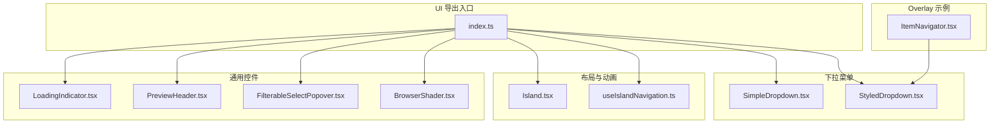
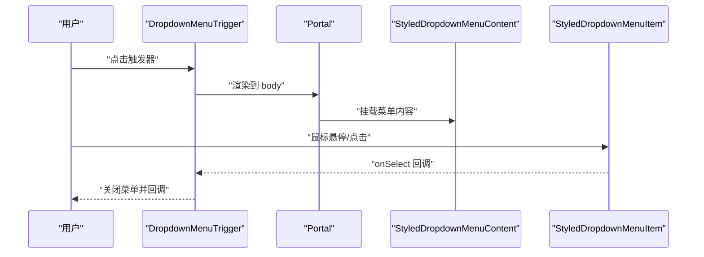
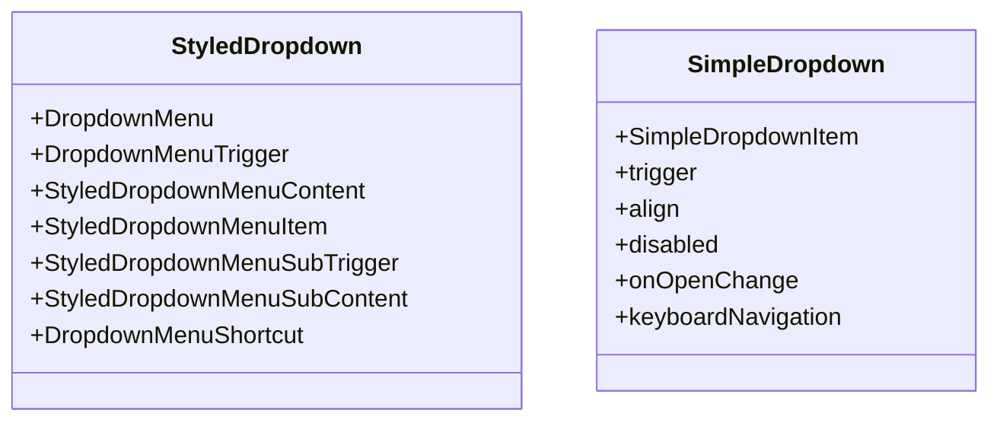
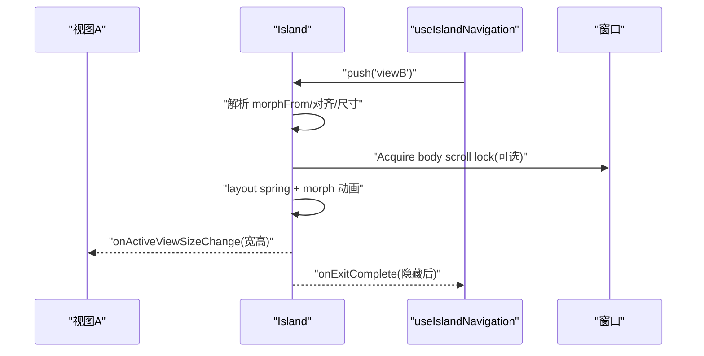
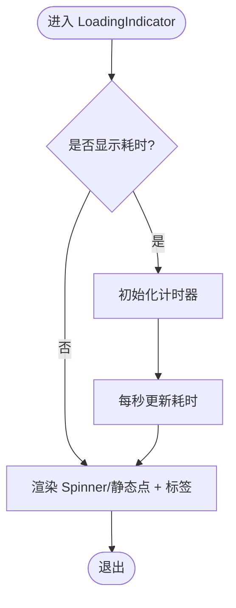
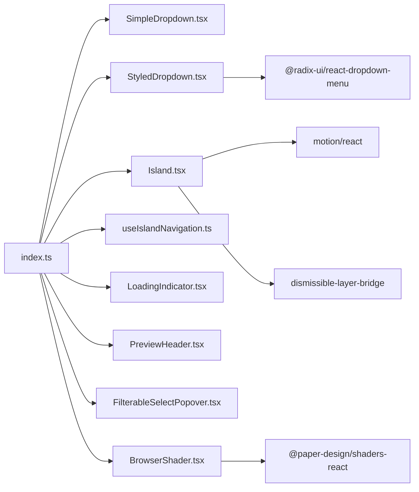

# UI 基础组件

<cite>
**本文引用的文件**
- [packages/ui/src/components/ui/index.ts](file://packages/ui/src/components/ui/index.ts)
- [packages/ui/src/components/ui/StyledDropdown.tsx](file://packages/ui/src/components/ui/StyledDropdown.tsx)
- [packages/ui/src/components/ui/SimpleDropdown.tsx](file://packages/ui/src/components/ui/SimpleDropdown.tsx)
- [packages/ui/src/components/ui/Island.tsx](file://packages/ui/src/components/ui/Island.tsx)
- [packages/ui/src/components/ui/useIslandNavigation.ts](file://packages/ui/src/components/ui/useIslandNavigation.ts)
- [packages/ui/src/components/ui/LoadingIndicator.tsx](file://packages/ui/src/components/ui/LoadingIndicator.tsx)
- [packages/ui/src/components/ui/PreviewHeader.tsx](file://packages/ui/src/components/ui/PreviewHeader.tsx)
- [packages/ui/src/components/ui/FilterableSelectPopover.tsx](file://packages/ui/src/components/ui/FilterableSelectPopover.tsx)
- [packages/ui/src/components/ui/BrowserShader.tsx](file://packages/ui/src/components/ui/BrowserShader.tsx)
- [packages/ui/src/components/overlay/ItemNavigator.tsx](file://packages/ui/src/components/overlay/ItemNavigator.tsx)
</cite>

## 目录
1. [简介](#简介)
2. [项目结构](#项目结构)
3. [核心组件](#核心组件)
4. [架构总览](#架构总览)
5. [详细组件分析](#详细组件分析)
6. [依赖关系分析](#依赖关系分析)
7. [性能考量](#性能考量)
8. [故障排查指南](#故障排查指南)
9. [结论](#结论)
10. [附录](#附录)

## 简介
本文件为 UI 基础组件的开发与使用指南，覆盖以下主题：
- 下拉菜单：StyledDropdown 系列组件（DropdownMenu、StyledDropdownMenuItem 等）与 SimpleDropdown 的设计与用法
- 岛屿布局：Island 多视图容器、导航系统、过渡动画与尺寸管理
- 加载指示器：LoadingIndicator 与 Spinner 的功能与定制
- 预览头部：PreviewHeader 及其徽章系统
- 过滤选择弹出框：FilterableSelectPopover 的交互与键盘导航
- 浏览器着色器：BrowserShader 的参数化视觉效果
- 典型组合：Overlay 中的 ItemNavigator 如何使用 StyledDropdown

本指南兼顾初学者与高级开发者，既提供属性与样式配置说明，也给出交互行为与性能优化建议。

## 项目结构
UI 组件集中于 packages/ui/src/components/ui，按“语义功能”组织，导出入口在 index.ts。下拉菜单分为轻量版 SimpleDropdown 与风格化 StyledDropdown；Island 提供多视图动画容器；LoadingIndicator 提供统一加载体验；PreviewHeader、FilterableSelectPopover、BrowserShader 分别覆盖头部、过滤选择与着色器场景。

图表来源
- [packages/ui/src/components/ui/index.ts:1-63](file://packages/ui/src/components/ui/index.ts#L1-L63)
- [packages/ui/src/components/ui/SimpleDropdown.tsx:1-335](file://packages/ui/src/components/ui/SimpleDropdown.tsx#L1-L335)
- [packages/ui/src/components/ui/StyledDropdown.tsx:1-244](file://packages/ui/src/components/ui/StyledDropdown.tsx#L1-L244)
- [packages/ui/src/components/ui/Island.tsx:1-814](file://packages/ui/src/components/ui/Island.tsx#L1-L814)
- [packages/ui/src/components/ui/useIslandNavigation.ts:1-62](file://packages/ui/src/components/ui/useIslandNavigation.ts#L1-L62)
- [packages/ui/src/components/ui/LoadingIndicator.tsx:1-139](file://packages/ui/src/components/ui/LoadingIndicator.tsx#L1-L139)
- [packages/ui/src/components/ui/PreviewHeader.tsx:1-170](file://packages/ui/src/components/ui/PreviewHeader.tsx#L1-L170)
- [packages/ui/src/components/ui/FilterableSelectPopover.tsx:1-226](file://packages/ui/src/components/ui/FilterableSelectPopover.tsx#L1-L226)
- [packages/ui/src/components/ui/BrowserShader.tsx:1-97](file://packages/ui/src/components/ui/BrowserShader.tsx#L1-L97)
- [packages/ui/src/components/overlay/ItemNavigator.tsx:73-109](file://packages/ui/src/components/overlay/ItemNavigator.tsx#L73-L109)

章节来源
- [packages/ui/src/components/ui/index.ts:1-63](file://packages/ui/src/components/ui/index.ts#L1-L63)

## 核心组件
- 下拉菜单
  - StyledDropdown：基于 Radix 的风格化封装，提供触发器、内容、项、分隔符、子菜单、快捷键等组件，统一了应用的外观与动效。
  - SimpleDropdown：轻量无依赖版本，支持点击外部关闭、键盘导航、位置计算与 Portal 渲染。
- 岛屿布局（Island）
  - 多视图容器，支持视图间 morph 动画、方向偏移、模糊交叉淡入淡出、尺寸监听、滚动锁定、对话模式 ESC 行为。
  - useIslandNavigation：提供栈式导航能力（push/replace/pop/reset）与 ESC 回退或关闭。
- 加载指示器（LoadingIndicator）
  - 内置 3×3 网格旋转器（Spinner），可选标签与耗时显示，纯 CSS 动画，继承父级文本颜色与字号。
- 预览头部（PreviewHeader）
  - 支持徽章行居中、右侧关闭按钮、左右动作区，兼容 Electron 窗口与 Viewer 覆盖层两种布局。
- 过滤选择弹出框（FilterableSelectPopover）
  - 文本过滤、键盘导航（上下、回车、Esc）、点击外部关闭、锚点定位、Portal 定位。
- 浏览器着色器（BrowserShader）
  - 基于 @paper-design/shaders-react 的 dithering 效果，自动解析主题强调色，支持多种形状与类型参数。

章节来源
- [packages/ui/src/components/ui/StyledDropdown.tsx:1-244](file://packages/ui/src/components/ui/StyledDropdown.tsx#L1-L244)
- [packages/ui/src/components/ui/SimpleDropdown.tsx:1-335](file://packages/ui/src/components/ui/SimpleDropdown.tsx#L1-L335)
- [packages/ui/src/components/ui/Island.tsx:1-814](file://packages/ui/src/components/ui/Island.tsx#L1-L814)
- [packages/ui/src/components/ui/useIslandNavigation.ts:1-62](file://packages/ui/src/components/ui/useIslandNavigation.ts#L1-L62)
- [packages/ui/src/components/ui/LoadingIndicator.tsx:1-139](file://packages/ui/src/components/ui/LoadingIndicator.tsx#L1-L139)
- [packages/ui/src/components/ui/PreviewHeader.tsx:1-170](file://packages/ui/src/components/ui/PreviewHeader.tsx#L1-L170)
- [packages/ui/src/components/ui/FilterableSelectPopover.tsx:1-226](file://packages/ui/src/components/ui/FilterableSelectPopover.tsx#L1-L226)
- [packages/ui/src/components/ui/BrowserShader.tsx:1-97](file://packages/ui/src/components/ui/BrowserShader.tsx#L1-L97)

## 架构总览
下述序列图展示 StyledDropdown 的典型交互流程：触发器点击打开菜单，Portal 渲染到 body，支持键盘高亮与选择，子菜单通过 SubTrigger/SubContent 实现。

图表来源
- [packages/ui/src/components/ui/StyledDropdown.tsx:54-95](file://packages/ui/src/components/ui/StyledDropdown.tsx#L54-L95)
- [packages/ui/src/components/ui/StyledDropdown.tsx:106-133](file://packages/ui/src/components/ui/StyledDropdown.tsx#L106-L133)
- [packages/ui/src/components/ui/StyledDropdown.tsx:142-162](file://packages/ui/src/components/ui/StyledDropdown.tsx#L142-L162)

章节来源
- [packages/ui/src/components/ui/StyledDropdown.tsx:1-244](file://packages/ui/src/components/ui/StyledDropdown.tsx#L1-L244)

## 详细组件分析

### 下拉菜单：StyledDropdown 与 SimpleDropdown
- 设计目标
  - StyledDropdown：统一应用风格，提供 hover/open 状态镜像、动效、图标尺寸标准化、子菜单与快捷键。
  - SimpleDropdown：最小依赖，提供点击外部关闭、键盘导航、位置计算、Portal 渲染。
- 关键属性与行为
  - StyledDropdown
    - 触发器：DropdownMenuTrigger，支持 autoMirrorHoverToOpen 自动镜像 hover 到 open 状态类名。
    - 内容：StyledDropdownMenuContent，支持最小宽度、明暗模式切换、动效与最大高度。
    - 项：StyledDropdownMenuItem，支持 destructive 变体与图标尺寸。
    - 子菜单：StyledDropdownMenuSubTrigger/SubContent。
    - 快捷键：DropdownMenuShortcut。
  - SimpleDropdown
    - 触发器：trigger（任意节点）
    - 属性：align、className、disabled、onOpenChange、keyboardNavigation
    - 项：SimpleDropdownItem，支持 icon、variant、destructive
    - 行为：点击外部关闭、Esc 关闭、上下键高亮、Enter 选择、位置自适应。
- 使用建议
  - 优先使用 StyledDropdown 以获得一致的外观与动效。
  - 在需要极简依赖或自定义布局时使用 SimpleDropdown。
  - 为可破坏性操作使用 destructive 变体，提升可感知性。

图表来源
- [packages/ui/src/components/ui/StyledDropdown.tsx:50-95](file://packages/ui/src/components/ui/StyledDropdown.tsx#L50-L95)
- [packages/ui/src/components/ui/StyledDropdown.tsx:97-244](file://packages/ui/src/components/ui/StyledDropdown.tsx#L97-L244)
- [packages/ui/src/components/ui/SimpleDropdown.tsx:99-114](file://packages/ui/src/components/ui/SimpleDropdown.tsx#L99-L114)
- [packages/ui/src/components/ui/SimpleDropdown.tsx:25-40](file://packages/ui/src/components/ui/SimpleDropdown.tsx#L25-L40)

章节来源
- [packages/ui/src/components/ui/StyledDropdown.tsx:1-244](file://packages/ui/src/components/ui/StyledDropdown.tsx#L1-L244)
- [packages/ui/src/components/ui/SimpleDropdown.tsx:1-335](file://packages/ui/src/components/ui/SimpleDropdown.tsx#L1-L335)

### 岛屿布局：Island 与 useIslandNavigation
- 设计目标
  - 多视图容器，支持 morph 动画（从目标矩形平滑过渡）、内容交叉淡入淡出与模糊、尺寸监听、滚动锁定、对话模式 ESC 行为。
- 核心概念
  - IslandContentView：标记子视图，支持对齐（AnchorX/AnchorY）、morphFrom（目标矩形）、锁屏与阻断外部交互。
  - useIslandNavigation：提供栈式导航（push/replace/pop/reset）与 ESC 回退或关闭。
- 关键属性与行为
  - Island
    - activeViewId：当前视图 ID
    - transitionConfig：动画时长、弹性、模糊半径、进入角度/距离、起始缩放
    - onActiveViewSizeChange：输出当前视图宽高
    - isVisible/onExitComplete：可见性与退出完成回调
    - dismissOnPointerDownOutside/onRequestClose/onRequestBack：外部点击关闭与回退
    - dialogBehavior：none/close/back-or-close
    - lockScrollWhileVisible：整体滚动锁定
    - replayEntryKey/replayOnVisible：入口动画重播控制
    - overlayZIndex：阻断层 z-index
  - useIslandNavigation
    - current/canPop/stack：当前、是否可回退、导航栈
    - push/replace/pop/reset：导航操作
    - handleEscapeBackOrClose：ESC 统一处理
- 尺寸管理与过渡
  - 通过 ResizeObserver 感知视图尺寸变化并上报
  - morphDelta 基于目标矩形与当前壳尺寸计算位移与缩放
  - 内容层与壳层分别采用不同缓动与动效，保证视觉连贯

图表来源
- [packages/ui/src/components/ui/Island.tsx:271-814](file://packages/ui/src/components/ui/Island.tsx#L271-L814)
- [packages/ui/src/components/ui/useIslandNavigation.ts:17-62](file://packages/ui/src/components/ui/useIslandNavigation.ts#L17-L62)

章节来源
- [packages/ui/src/components/ui/Island.tsx:1-814](file://packages/ui/src/components/ui/Island.tsx#L1-L814)
- [packages/ui/src/components/ui/useIslandNavigation.ts:1-62](file://packages/ui/src/components/ui/useIslandNavigation.ts#L1-L62)

### 加载指示器：LoadingIndicator 与 Spinner
- 设计目标
  - 提供统一的加载反馈，支持标签与耗时显示，纯 CSS 动画，继承父级文本颜色与字号。
- 关键属性
  - label：右侧标签
  - animated：是否启用动画
  - showElapsed：是否显示耗时（传入时间戳或 true 自动跟踪）
  - spinnerClassName：微调旋转器大小
- 交互与样式
  - Spinner：3×3 网格立方体，使用 em 缩放与 currentColor
  - LoadingIndicator：水平排列，可选标签与耗时（秒或分:秒）

图表来源
- [packages/ui/src/components/ui/LoadingIndicator.tsx:85-139](file://packages/ui/src/components/ui/LoadingIndicator.tsx#L85-L139)

章节来源
- [packages/ui/src/components/ui/LoadingIndicator.tsx:1-139](file://packages/ui/src/components/ui/LoadingIndicator.tsx#L1-L139)

### 预览头部：PreviewHeader 与徽章
- 设计目标
  - 统一预览窗口与覆盖层的头部布局，支持徽章居中、右侧关闭按钮与动作区。
- 关键属性
  - PreviewHeader
    - children：徽章行
    - onClose：显示右侧关闭按钮
    - rightActions：右侧动作区
    - height：头部高度（窗口/覆盖层默认值不同）
  - PreviewHeaderBadge
    - icon/label/variant/onClick/title/shrinkable
- 适配场景
  - Electron：左侧留出交通灯空间，徽章居中
  - Viewer：徽章居中，右侧关闭按钮

章节来源
- [packages/ui/src/components/ui/PreviewHeader.tsx:1-170](file://packages/ui/src/components/ui/PreviewHeader.tsx#L1-L170)

### 过滤选择弹出框：FilterableSelectPopover
- 设计目标
  - 提供带过滤的扁平列表选择，支持键盘导航、点击外部关闭、锚点定位与 Portal 定位。
- 关键属性
  - open/onOpenChange/anchorRef/items/getKey/getLabel/isSelected/onToggle
  - filterPlaceholder/emptyState/noResultsState/closeOnSelect/minWidth/maxWidth
- 交互行为
  - 打开时聚焦输入框，根据锚点计算位置，支持上下键循环高亮、回车选择、Esc 关闭
  - 滚动/窗口变化时重新定位

章节来源
- [packages/ui/src/components/ui/FilterableSelectPopover.tsx:1-226](file://packages/ui/src/components/ui/FilterableSelectPopover.tsx#L1-L226)

### 浏览器着色器：BrowserShader
- 设计目标
  - 为浏览器/卡片等元素添加 dithering 着色器效果，自动解析主题强调色，支持多种形状与类型。
- 关键属性
  - maskImage/opacity/borderRadius/rounded
  - colorBack/colorFront（未指定则使用主题强调色）
  - shape/type/size/speed/scale/maxPixelCount/minPixelRatio
- 用法要点
  - 通过 CSS 变量 --accent-rgb 获取强调色，若灰度则回退蓝色
  - 支持圆角裁剪与遮罩图像

章节来源
- [packages/ui/src/components/ui/BrowserShader.tsx:1-97](file://packages/ui/src/components/ui/BrowserShader.tsx#L1-L97)

### Overlay 中的 ItemNavigator 与 StyledDropdown
- 场景说明
  - ItemNavigator 使用 StyledDropdownMenuContent 与 StyledDropdownMenuItem 构建“选择条目”弹出框，支持键盘导航与高亮指示。
- 关键点
  - 使用 DropdownMenuTrigger 作为触发器
  - 通过 onSelect 切换活动项
  - 使用 Check 图标高亮当前项

章节来源
- [packages/ui/src/components/overlay/ItemNavigator.tsx:73-109](file://packages/ui/src/components/overlay/ItemNavigator.tsx#L73-L109)
- [packages/ui/src/components/ui/StyledDropdown.tsx:106-133](file://packages/ui/src/components/ui/StyledDropdown.tsx#L106-L133)
- [packages/ui/src/components/ui/StyledDropdown.tsx:142-162](file://packages/ui/src/components/ui/StyledDropdown.tsx#L142-L162)

## 依赖关系分析
- 组件导出
  - index.ts 统一导出各组件与类型，便于上层按需引入。
- 组件间耦合
  - StyledDropdown 依赖 Radix UI primitives，提供风格化包装。
  - SimpleDropdown 为独立实现，不依赖第三方 UI 库。
  - Island 依赖 motion/react 与 dismissible-layer-bridge，负责全局 ESC 注册与滚动锁定。
  - useIslandNavigation 为 Island 导航提供纯函数式栈管理。
- 外部依赖
  - @paper-design/shaders-react：BrowserShader 的渲染后端
  - lucide-react：图标库（PreviewHeader、ItemNavigator 等）
  - react-i18next：国际化文案（PreviewHeader、FilterableSelectPopover）

图表来源
- [packages/ui/src/components/ui/index.ts:1-63](file://packages/ui/src/components/ui/index.ts#L1-L63)
- [packages/ui/src/components/ui/StyledDropdown.tsx:14-17](file://packages/ui/src/components/ui/StyledDropdown.tsx#L14-L17)
- [packages/ui/src/components/ui/Island.tsx:1-6](file://packages/ui/src/components/ui/Island.tsx#L1-L6)
- [packages/ui/src/components/ui/BrowserShader.tsx:1-2](file://packages/ui/src/components/ui/BrowserShader.tsx#L1-L2)

章节来源
- [packages/ui/src/components/ui/index.ts:1-63](file://packages/ui/src/components/ui/index.ts#L1-L63)

## 性能考量
- 动画与布局
  - Island 的 morph 动画与内容交叉淡入淡出使用 CSS 动画与 motion，建议避免频繁变更 transitionConfig，减少重排。
  - 使用 replayOnVisible='always' 时注意仅在必要时开启，避免不必要的 RAF 预热。
- 滚动与焦点
  - 滚动锁定会阻止页面滚动，仅在 dialog 模式或需要阻断外部交互时启用。
  - ESC 注册由 dismissible-layer-bridge 管理，确保多层叠加时顺序正确。
- 下拉菜单
  - SimpleDropdown 使用 Portal 渲染，避免被父级 overflow 遮挡；键盘导航时仅在菜单内生效，降低全局事件开销。
  - StyledDropdown 的 hover/open 类镜像在大量样式时可能增加计算，建议精简类名。
- 加载指示器
  - Spinner 为纯 CSS，不引入额外状态；showElapsed 会启动定时器，建议在不需要时关闭。
- 过滤选择弹出框
  - 过滤逻辑为 O(n) 遍历，建议控制 items 数量或使用虚拟化方案。
- 浏览器着色器
  - maxPixelCount 与 minPixelRatio 控制渲染质量与性能，大尺寸元素建议适当降低像素密度。

## 故障排查指南
- 下拉菜单无法关闭
  - 检查 SimpleDropdown 的 disabled 与 onOpenChange 是否正确传递；确认点击外部检测逻辑未被父级阻止。
  - StyledDropdown 的 Portal 是否成功挂载到 body。
- 键盘导航无效
  - SimpleDropdown 的 keyboardNavigation 默认开启，确认菜单处于打开状态且焦点在菜单内。
  - ESC 行为受 dialogBehavior 控制，确认 onRequestBack/onRequestClose 是否实现。
- Island 不显示或动画异常
  - 检查 activeViewId 是否匹配；morphFrom 是否提供有效矩形；isVisible 与 replayOnVisible 配置是否冲突。
  - 确认尺寸监听是否正常（ResizeObserver），必要时手动触发重算。
- 滚动锁定导致页面不可滚动
  - 确认 lockScrollWhileVisible 或视图级 lockScroll/blockOutsideInteraction 的使用场景；在关闭时释放锁定。
- 过滤选择弹出框定位错误
  - 检查 anchorRef 是否存在；minWidth/maxWidth 与窗口尺寸的约束；滚动/窗口变化事件是否正确绑定。
- 浏览器着色器颜色异常
  - 确认 --accent-rgb 是否存在；灰度强调色会回退为蓝色；maskImage 与圆角设置是否正确。

章节来源
- [packages/ui/src/components/ui/SimpleDropdown.tsx:241-296](file://packages/ui/src/components/ui/SimpleDropdown.tsx#L241-L296)
- [packages/ui/src/components/ui/Island.tsx:507-570](file://packages/ui/src/components/ui/Island.tsx#L507-L570)
- [packages/ui/src/components/ui/FilterableSelectPopover.tsx:67-105](file://packages/ui/src/components/ui/FilterableSelectPopover.tsx#L67-L105)
- [packages/ui/src/components/ui/BrowserShader.tsx:14-31](file://packages/ui/src/components/ui/BrowserShader.tsx#L14-L31)

## 结论
本指南系统梳理了 UI 基础组件的设计理念、实现细节与最佳实践。通过 StyledDropdown 与 SimpleDropdown 的对比，开发者可在一致性与灵活性之间权衡；Island 的多视图动画与尺寸管理为复杂交互提供了稳定基座；LoadingIndicator、PreviewHeader、FilterableSelectPopover、BrowserShader 则覆盖了常见场景的 UI 诉求。建议在实际项目中结合业务需求，合理选择组件并遵循性能与可访问性原则。

## 附录
- 组件导出清单（节选）
  - 下拉菜单：DropdownMenu、DropdownMenuTrigger、StyledDropdownMenuContent、StyledDropdownMenuItem、StyledDropdownMenuSubTrigger、StyledDropdownMenuSubContent、DropdownMenuShortcut、SimpleDropdown、SimpleDropdownItem
  - 岛屿布局：Island、IslandContentView、useIslandNavigation
  - 通用控件：LoadingIndicator、Spinner、PreviewHeader、PreviewHeaderBadge、FilterableSelectPopover、BrowserShader
- 使用建议
  - 样式定制：优先使用 className 与 CSS 变量；避免在组件内部硬编码颜色与尺寸。
  - 无障碍：为按钮与菜单提供 aria-* 属性；确保键盘可达性。
  - 主题适配：利用 CSS 变量与组件内置的明暗模式开关，确保在深浅主题下均可用。

章节来源
- [packages/ui/src/components/ui/index.ts:1-63](file://packages/ui/src/components/ui/index.ts#L1-L63)