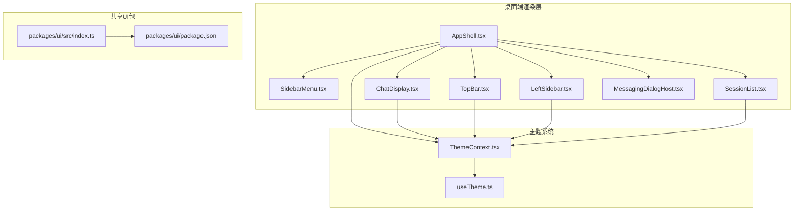
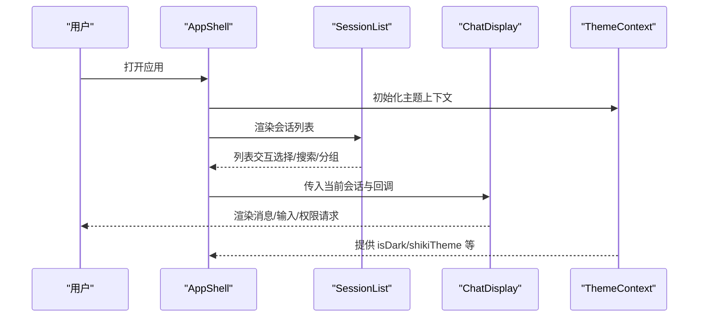
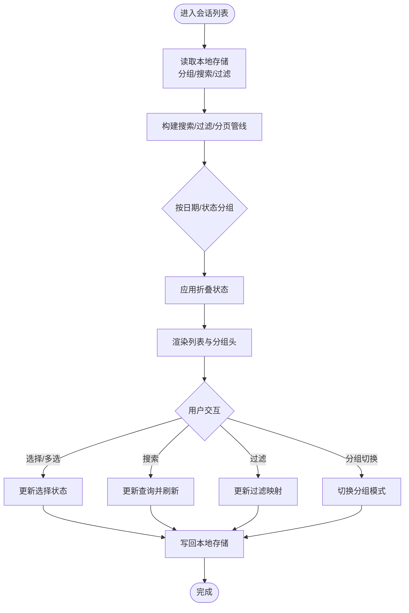
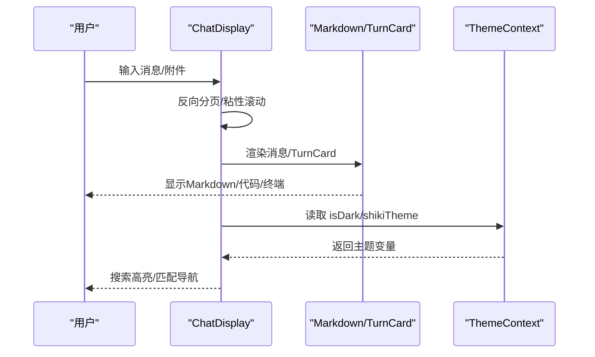
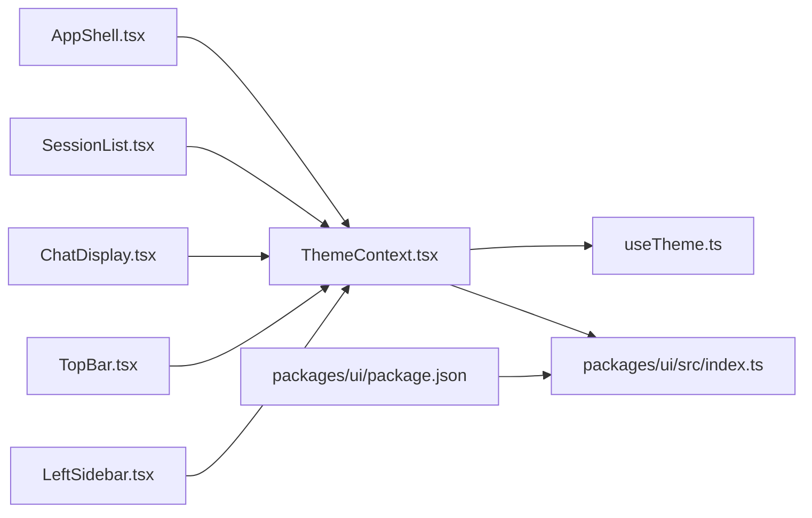

# UI 组件库

<cite>
**本文引用的文件**
- [AppShell.tsx](file://apps/electron/src/renderer/components/app-shell/AppShell.tsx)
- [ChatDisplay.tsx](file://apps/electron/src/renderer/components/app-shell/ChatDisplay.tsx)
- [SessionList.tsx](file://apps/electron/src/renderer/components/app-shell/SessionList.tsx)
- [TopBar.tsx](file://apps/electron/src/renderer/components/app-shell/TopBar.tsx)
- [LeftSidebar.tsx](file://apps/electron/src/renderer/components/app-shell/LeftSidebar.tsx)
- [MessagingDialogHost.tsx](file://apps/electron/src/renderer/components/messaging/MessagingDialogHost.tsx)
- [settings/index.ts](file://apps/electron/src/renderer/components/settings/index.ts)
- [ThemeContext.tsx](file://apps/electron/src/renderer/context/ThemeContext.tsx)
- [useTheme.ts](file://apps/electron/src/renderer/hooks/useTheme.ts)
- [utils.ts](file://apps/electron/src/renderer/lib/utils.ts)
- [packages/ui/package.json](file://packages/ui/package.json)
- [packages/ui/src/index.ts](file://packages/ui/src/index.ts)
</cite>

## 目录
1. [简介](#简介)
2. [项目结构](#项目结构)
3. [核心组件](#核心组件)
4. [架构总览](#架构总览)
5. [组件详解](#组件详解)
6. [依赖关系分析](#依赖关系分析)
7. [性能考量](#性能考量)
8. [故障排查指南](#故障排查指南)
9. [结论](#结论)
10. [附录](#附录)

## 简介
本文件为基于 shadcn/ui 与 Tailwind CSS 的设计系统与 UI 组件库的开发文档，聚焦于桌面端应用中的会话、消息、设置、工具栏等专用组件的设计与实现。文档从架构、主题系统、组件设计规范入手，深入讲解组件的状态管理、事件处理与样式定制方法，并覆盖组件组合模式、响应式设计与无障碍支持，最后提供组件开发指南、样式扩展方法与性能优化建议，帮助前端开发者快速定制界面与开发新组件。

## 项目结构
该仓库采用多包（monorepo）结构，UI 组件库位于 packages/ui，桌面端渲染层位于 apps/electron/src/renderer。核心应用壳（AppShell）组织三大区域：左侧边栏、导航器（会话列表）、主内容区（聊天显示），并通过上下文与钩子实现统一的主题、导航、键盘焦点与状态管理。

**图表来源**
- [AppShell.tsx:1-800](file://apps/electron/src/renderer/components/app-shell/AppShell.tsx#L1-L800)
- [SessionList.tsx:1-737](file://apps/electron/src/renderer/components/app-shell/SessionList.tsx#L1-L737)
- [ChatDisplay.tsx:1-800](file://apps/electron/src/renderer/components/app-shell/ChatDisplay.tsx#L1-L800)
- [TopBar.tsx:1-484](file://apps/electron/src/renderer/components/app-shell/TopBar.tsx#L1-L484)
- [LeftSidebar.tsx:1-591](file://apps/electron/src/renderer/components/app-shell/LeftSidebar.tsx#L1-L591)
- [MessagingDialogHost.tsx:1-86](file://apps/electron/src/renderer/components/messaging/MessagingDialogHost.tsx#L1-L86)
- [ThemeContext.tsx:1-536](file://apps/electron/src/renderer/context/ThemeContext.tsx#L1-L536)
- [useTheme.ts:1-77](file://apps/electron/src/renderer/hooks/useTheme.ts#L1-L77)
- [packages/ui/package.json:1-72](file://packages/ui/package.json#L1-L72)
- [packages/ui/src/index.ts:1-288](file://packages/ui/src/index.ts#L1-L288)

**章节来源**
- [AppShell.tsx:1-800](file://apps/electron/src/renderer/components/app-shell/AppShell.tsx#L1-L800)
- [packages/ui/src/index.ts:1-288](file://packages/ui/src/index.ts#L1-L288)

## 核心组件
- 应用壳（AppShell）：负责布局与全局状态协调，承载侧边栏、导航器、主内容区与对话框宿主。
- 会话列表（SessionList）：可搜索、分组、折叠、多选的会话卡片列表，支持按日期或状态分组。
- 聊天显示（ChatDisplay）：消息流渲染、搜索高亮、权限/凭据请求处理、输入区与工具结果预览。
- 工具栏（TopBar）：顶部菜单、工作区切换、浏览器标签条、快捷操作入口。
- 左侧边栏（LeftSidebar）：导航项、可展开子项、右键菜单、拖拽排序。
- 消息对话框宿主（MessagingDialogHost）：全局持有配对码与连接对话框，确保上下文关闭后仍可用。
- 设置组件（settings/index.ts）：统一导出设置页面的结构化组件集合。

**章节来源**
- [AppShell.tsx:470-800](file://apps/electron/src/renderer/components/app-shell/AppShell.tsx#L470-L800)
- [SessionList.tsx:106-737](file://apps/electron/src/renderer/components/app-shell/SessionList.tsx#L106-L737)
- [ChatDisplay.tsx:415-800](file://apps/electron/src/renderer/components/app-shell/ChatDisplay.tsx#L415-L800)
- [TopBar.tsx:139-484](file://apps/electron/src/renderer/components/app-shell/TopBar.tsx#L139-L484)
- [LeftSidebar.tsx:144-591](file://apps/electron/src/renderer/components/app-shell/LeftSidebar.tsx#L144-L591)
- [MessagingDialogHost.tsx:1-86](file://apps/electron/src/renderer/components/messaging/MessagingDialogHost.tsx#L1-L86)
- [settings/index.ts:1-95](file://apps/electron/src/renderer/components/settings/index.ts#L1-L95)

## 架构总览
整体采用“上下文 + 钩子 + 共享状态”的架构：
- 主题系统通过 ThemeProvider 提供全局主题解析与 DOM 注入，useTheme 钩子读取已解析值。
- AppShell 将导航、焦点、会话状态等聚合为上下文，子组件通过 useAppShellContext 获取。
- UI 组件库（@craft-agent/ui）以平台无关方式提供聊天、Markdown、代码查看器等组件，统一导出入口在 packages/ui/src/index.ts。

**图表来源**
- [AppShell.tsx:480-800](file://apps/electron/src/renderer/components/app-shell/AppShell.tsx#L480-L800)
- [SessionList.tsx:106-737](file://apps/electron/src/renderer/components/app-shell/SessionList.tsx#L106-L737)
- [ChatDisplay.tsx:415-800](file://apps/electron/src/renderer/components/app-shell/ChatDisplay.tsx#L415-L800)
- [ThemeContext.tsx:115-536](file://apps/electron/src/renderer/context/ThemeContext.tsx#L115-L536)

## 组件详解

### 会话组件（SessionList）
- 功能特性
  - 支持按日期或状态分组，可折叠分组头部，持久化折叠状态。
  - 搜索与过滤：支持内容搜索、状态/标签过滤、三态过滤模式（包含/排除/移除）。
  - 多选与键盘导航：支持多选、范围选择、Home/End、方向键在面板间跳转。
  - 空状态与加载：归档视图空状态、新建会话引导、分页加载指示器。
- 状态管理
  - 使用本地存储键保存分组折叠状态、搜索查询、过滤映射。
  - 通过 useSessionSelection 与 useSessionSearch 管理选择与搜索管线。
- 事件处理
  - 选择/切换/范围选择回调；重命名对话框；打开到新窗口；发送至工作区。
- 样式定制
  - 基于 Tailwind 类名与 cn 合并策略，支持紧凑模式与自定义容器类名。

**图表来源**
- [SessionList.tsx:106-737](file://apps/electron/src/renderer/components/app-shell/SessionList.tsx#L106-L737)

**章节来源**
- [SessionList.tsx:106-737](file://apps/electron/src/renderer/components/app-shell/SessionList.tsx#L106-L737)

### 消息组件（ChatDisplay）
- 功能特性
  - 消息流渲染、TurnCard 展示、Markdown 渲染与语法高亮、终端输出、多文件差异预览。
  - 搜索高亮：使用 CSS Custom Highlight API 对匹配文本进行非破坏性高亮，支持单/多匹配导航。
  - 权限与凭据请求：支持弹窗响应、模式切换（ask/allow/ask-never）。
  - 输入区：富文本输入、附件、技能提及、工作目录与源选择。
- 状态管理
  - 反向分页加载最近 N 轮，滚动到顶部时加载更多；粘性底部自动滚动策略。
  - 通过 useTurnCardExpansion 持久化 Turn 展开状态。
- 事件处理
  - 发送消息、打开文件/链接、模型/连接变更、思考级别与权限模式变更。
  - 搜索匹配导航（上一条/下一条）与滚动到匹配位置。
- 样式定制
  - 通过 useTheme 获取 isDark/shikiTheme，结合 CSS 变量注入实现主题一致性。

**图表来源**
- [ChatDisplay.tsx:415-800](file://apps/electron/src/renderer/components/app-shell/ChatDisplay.tsx#L415-L800)
- [ThemeContext.tsx:284-381](file://apps/electron/src/renderer/context/ThemeContext.tsx#L284-L381)

**章节来源**
- [ChatDisplay.tsx:415-800](file://apps/electron/src/renderer/components/app-shell/ChatDisplay.tsx#L415-L800)
- [ThemeContext.tsx:284-381](file://apps/electron/src/renderer/context/ThemeContext.tsx#L284-L381)

### 设置组件（settings/index.ts）
- 设计规范
  - 结构化组件：SettingsSection/SettingsCard/SettingsRow 等，统一间距、边框与阴影。
  - 行级控件：SettingsToggle、SettingsRadioGroup、SettingsSelect、SettingsInput 等。
  - 语义化导出：集中导出，便于在设置页面复用。
- 组合模式
  - 卡片式分组与分割线，支持在 SettingsSection 内嵌套 SettingsCard/SettingsGroup。

**章节来源**
- [settings/index.ts:1-95](file://apps/electron/src/renderer/components/settings/index.ts#L1-L95)

### 工具栏组件（TopBar）
- 功能特性
  - 左侧：侧边栏开关、应用菜单（含编辑/视图/窗口/设置/帮助）、后退/前进、工作区切换。
  - 右侧：浏览器标签条、新增面板菜单、帮助文档入口。
  - 自适应：根据右侧槽位宽度动态调整徽章密度。
- 事件处理
  - 菜单项点击、快捷键提示、调试模式入口、外部链接打开。
- 样式定制
  - 固定高度与标题栏拖拽区域，macOS 下菜单左内边距适配。

**章节来源**
- [TopBar.tsx:139-484](file://apps/electron/src/renderer/components/app-shell/TopBar.tsx#L139-L484)

### 左侧边栏组件（LeftSidebar）
- 功能特性
  - 导航项、可展开子项、右键上下文菜单、拖拽排序（SortableList）。
  - 两类变体：default（高亮）与 ghost（次级），支持紧凑模式。
  - 嵌套渲染与垂直连线，支持拖拽覆盖层与两阶段落位动画。
- 事件处理
  - 展开/收起、点击导航、右键菜单动作（配置状态/标签/视图、添加/删除）。
- 样式定制
  - 图标颜色继承、悬停显隐切换、标签徽章与类型指示图标。

**章节来源**
- [LeftSidebar.tsx:144-591](file://apps/electron/src/renderer/components/app-shell/LeftSidebar.tsx#L144-L591)

### 消息对话框宿主（MessagingDialogHost）
- 功能特性
  - 全局持有配对码与 WhatsApp 连接对话框，避免因上下文菜单关闭导致对话框消失。
  - 生成配对码、错误分类与提示。
- 事件处理
  - 打开/关闭对话框、连接成功回调、继续配对流程。

**章节来源**
- [MessagingDialogHost.tsx:1-86](file://apps/electron/src/renderer/components/messaging/MessagingDialogHost.tsx#L1-L86)

## 依赖关系分析
- 主题系统
  - ThemeProvider 在根部注入主题 CSS 变量、数据属性与模式类名；useTheme 钩子读取已解析值。
  - @craft-agent/ui 包导出平台无关组件，依赖 peerDependencies 中的 UI 生态（Radix、Tailwind、Motion 等）。
- 组件导出
  - packages/ui/src/index.ts 统一导出聊天、Markdown、UI 原语、代码查看器、终端、覆盖层等组件。
  - apps/electron/src/renderer/components/settings/index.ts 导出设置页面通用组件。

**图表来源**
- [ThemeContext.tsx:115-536](file://apps/electron/src/renderer/context/ThemeContext.tsx#L115-L536)
- [useTheme.ts:1-77](file://apps/electron/src/renderer/hooks/useTheme.ts#L1-L77)
- [packages/ui/src/index.ts:1-288](file://packages/ui/src/index.ts#L1-L288)
- [packages/ui/package.json:1-72](file://packages/ui/package.json#L1-L72)
- [AppShell.tsx:480-800](file://apps/electron/src/renderer/components/app-shell/AppShell.tsx#L480-L800)
- [SessionList.tsx:106-737](file://apps/electron/src/renderer/components/app-shell/SessionList.tsx#L106-L737)
- [ChatDisplay.tsx:415-800](file://apps/electron/src/renderer/components/app-shell/ChatDisplay.tsx#L415-L800)
- [TopBar.tsx:139-484](file://apps/electron/src/renderer/components/app-shell/TopBar.tsx#L139-L484)
- [LeftSidebar.tsx:144-591](file://apps/electron/src/renderer/components/app-shell/LeftSidebar.tsx#L144-L591)

**章节来源**
- [packages/ui/package.json:1-72](file://packages/ui/package.json#L1-L72)
- [packages/ui/src/index.ts:1-288](file://packages/ui/src/index.ts#L1-L288)

## 性能考量
- 懒加载与分页
  - ChatDisplay 使用反向分页（每页 N 轮），滚动到顶部时加载更多，减少初始渲染压力。
- 选择与搜索管线
  - SessionList 将搜索、过滤、分组与分页解耦，仅在必要时重建行数据，避免全量重算。
- DOM 操作最小化
  - ChatDisplay 使用 CSS Custom Highlight API 实现文本高亮，避免 DOM 重构；使用 requestAnimationFrame 与节流策略更新高亮范围。
- 样式合并
  - 使用 cn 与 tailwind-merge 合并类名，减少重复与冲突，提升样式计算效率。
- 主题注入
  - ThemeProvider 仅在主题变化时注入 CSS 变量，避免频繁重排。

[本节为通用指导，无需特定文件引用]

## 故障排查指南
- 主题不生效或闪烁
  - 检查 ThemeProvider 是否包裹根节点；确认 presetTheme 加载成功且未触发 fallback；核对 isDark 与 scenic 模式判断。
- 搜索高亮异常
  - 确认 CSS Custom Highlight API 可用；检查 searchQuery 长度阈值（≥2）；验证匹配出现次数与 turnRefs 映射。
- 会话列表折叠状态丢失
  - 检查本地存储键是否正确写入/读取；确认分组作用域（workspace/filter/groupingMode）一致。
- 对话框消失
  - MessagingDialogHost 必须作为全局宿主存在，确保在触发上下文菜单关闭后仍可访问。

**章节来源**
- [ThemeContext.tsx:185-381](file://apps/electron/src/renderer/context/ThemeContext.tsx#L185-L381)
- [ChatDisplay.tsx:555-762](file://apps/electron/src/renderer/components/app-shell/ChatDisplay.tsx#L555-L762)
- [SessionList.tsx:174-221](file://apps/electron/src/renderer/components/app-shell/SessionList.tsx#L174-L221)
- [MessagingDialogHost.tsx:13-74](file://apps/electron/src/renderer/components/messaging/MessagingDialogHost.tsx#L13-L74)

## 结论
本 UI 组件库以 AppShell 为核心，围绕会话与消息两大场景构建了高内聚、低耦合的组件体系。通过主题系统与共享 UI 包，实现了跨平台的一致体验与可扩展性。组件在状态管理、事件处理与样式定制方面提供了清晰的模式与最佳实践，适合进一步定制界面与开发新组件。

[本节为总结，无需特定文件引用]

## 附录

### 组件开发指南
- 基于 shadcn/ui 与 Tailwind CSS
  - 使用 cn 合并类名，遵循组件层级结构与语义化命名。
- 状态与副作用
  - 将状态集中在上下文或原子中，避免在组件内部持有大对象快照。
- 无障碍支持
  - 为交互元素提供 aria-label 与 role；确保键盘可达与焦点顺序合理。
- 响应式设计
  - 使用容器查询与断点类名，配合 ResizeObserver 动态调整 UI 密度。

**章节来源**
- [utils.ts:1-7](file://apps/electron/src/renderer/lib/utils.ts#L1-L7)
- [TopBar.tsx:204-238](file://apps/electron/src/renderer/components/app-shell/TopBar.tsx#L204-L238)

### 样式扩展方法
- 主题扩展
  - 通过 ThemeProvider 的 appTheme 参数合并覆盖，或设置 workspaceColorTheme 实现工作区级覆盖。
- 组件样式
  - 使用 Tailwind 工具类与 CSS 变量；在 @craft-agent/ui 中通过 cn 与 className 扩展。

**章节来源**
- [ThemeContext.tsx:436-487](file://apps/electron/src/renderer/context/ThemeContext.tsx#L436-L487)
- [packages/ui/src/index.ts:91-139](file://packages/ui/src/index.ts#L91-L139)

### 性能优化技巧
- 虚拟化与懒加载：对长列表与复杂渲染使用虚拟化或分页。
- 计算缓存：使用 useMemo/useCallback 缓存昂贵计算与回调。
- DOM 最小化：优先使用 CSS 变量与伪元素，避免频繁 DOM 修改。
- 主题注入：仅在主题变化时注入 CSS，避免重复计算。

**章节来源**
- [ChatDisplay.tsx:693-712](file://apps/electron/src/renderer/components/app-shell/ChatDisplay.tsx#L693-L712)
- [SessionList.tsx:231-259](file://apps/electron/src/renderer/components/app-shell/SessionList.tsx#L231-L259)
- [ThemeContext.tsx:349-381](file://apps/electron/src/renderer/context/ThemeContext.tsx#L349-L381)