# 代码查看组件

<cite>
**本文引用的文件**
- [packages/ui/src/components/code-viewer/index.ts](file://packages/ui/src/components/code-viewer/index.ts)
- [packages/ui/src/components/code-viewer/ShikiCodeViewer.tsx](file://packages/ui/src/components/code-viewer/ShikiCodeViewer.tsx)
- [packages/ui/src/components/code-viewer/ShikiDiffViewer.tsx](file://packages/ui/src/components/code-viewer/ShikiDiffViewer.tsx)
- [packages/ui/src/components/code-viewer/UnifiedDiffViewer.tsx](file://packages/ui/src/components/code-viewer/UnifiedDiffViewer.tsx)
- [packages/ui/src/components/code-viewer/language-map.ts](file://packages/ui/src/components/code-viewer/language-map.ts)
- [packages/ui/src/components/code-viewer/DiffViewerControls.tsx](file://packages/ui/src/components/code-viewer/DiffViewerControls.tsx)
- [packages/ui/src/components/code-viewer/DiffIcons.tsx](file://packages/ui/src/components/code-viewer/DiffIcons.tsx)
- [packages/ui/src/components/code-viewer/registerShikiThemes.ts](file://packages/ui/src/components/code-viewer/registerShikiThemes.ts)
- [packages/ui/src/components/markdown/diff-normalize.ts](file://packages/ui/src/components/markdown/diff-normalize.ts)
- [packages/ui/src/components/markdown/MarkdownDiffBlock.tsx](file://packages/ui/src/components/markdown/MarkdownDiffBlock.tsx)
- [packages/ui/src/components/overlay/MultiDiffPreviewOverlay.tsx](file://packages/ui/src/components/overlay/MultiDiffPreviewOverlay.tsx)
- [packages/ui/src/components/overlay/CodePreviewOverlay.tsx](file://packages/ui/src/components/overlay/CodePreviewOverlay.tsx)
- [apps/electron/src/renderer/components/shiki/ShikiCodeViewer.tsx](file://apps/electron/src/renderer/components/shiki/ShikiCodeViewer.tsx)
- [apps/electron/src/renderer/components/shiki/ShikiDiffViewer.tsx](file://apps/electron/src/renderer/components/shiki/ShikiDiffViewer.tsx)
</cite>

## 目录
1. [简介](#简介)
2. [项目结构](#项目结构)
3. [核心组件](#核心组件)
4. [架构总览](#架构总览)
5. [详细组件分析](#详细组件分析)
6. [依赖关系分析](#依赖关系分析)
7. [性能考量](#性能考量)
8. [故障排查指南](#故障排查指南)
9. [结论](#结论)
10. [附录](#附录)

## 简介
本文件为“代码查看组件”的详细开发文档，聚焦于基于 Shiki 的语法高亮渲染器与差异查看器实现。内容涵盖：
- 语言检测与文件类型映射
- 主题适配与自定义主题注册
- 差异查看器（ShikiDiffViewer）与统一差异查看器（UnifiedDiffViewer）的对比功能、统计信息与控制面板
- 文件路径处理、语言映射、文件类型检测机制
- 差异查看器设置、背景模式、分割视图等高级功能
- 使用指南：代码高亮配置、主题定制、差异比较

本指南面向需要在前端处理代码文件展示与差异比对的开发者。

## 项目结构
代码查看组件位于 packages/ui 的 code-viewer 子模块，并配套有 Electron 包装层与 Markdown 渲染集成、多文件差异预览覆盖层等。

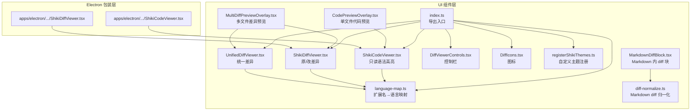

图表来源
- [packages/ui/src/components/code-viewer/index.ts:1-10](file://packages/ui/src/components/code-viewer/index.ts#L1-L10)
- [packages/ui/src/components/code-viewer/ShikiCodeViewer.tsx:1-188](file://packages/ui/src/components/code-viewer/ShikiCodeViewer.tsx#L1-L188)
- [packages/ui/src/components/code-viewer/ShikiDiffViewer.tsx:1-222](file://packages/ui/src/components/code-viewer/ShikiDiffViewer.tsx#L1-L222)
- [packages/ui/src/components/code-viewer/UnifiedDiffViewer.tsx:1-247](file://packages/ui/src/components/code-viewer/UnifiedDiffViewer.tsx#L1-L247)
- [packages/ui/src/components/code-viewer/language-map.ts:1-120](file://packages/ui/src/components/code-viewer/language-map.ts#L1-L120)
- [packages/ui/src/components/code-viewer/DiffViewerControls.tsx:1-90](file://packages/ui/src/components/code-viewer/DiffViewerControls.tsx#L1-L90)
- [packages/ui/src/components/code-viewer/DiffIcons.tsx:1-95](file://packages/ui/src/components/code-viewer/DiffIcons.tsx#L1-L95)
- [packages/ui/src/components/code-viewer/registerShikiThemes.ts:1-25](file://packages/ui/src/components/code-viewer/registerShikiThemes.ts#L1-L25)
- [packages/ui/src/components/markdown/diff-normalize.ts:1-129](file://packages/ui/src/components/markdown/diff-normalize.ts#L1-L129)
- [packages/ui/src/components/markdown/MarkdownDiffBlock.tsx:1-67](file://packages/ui/src/components/markdown/MarkdownDiffBlock.tsx#L1-L67)
- [packages/ui/src/components/overlay/MultiDiffPreviewOverlay.tsx:25-395](file://packages/ui/src/components/overlay/MultiDiffPreviewOverlay.tsx#L25-L395)
- [packages/ui/src/components/overlay/CodePreviewOverlay.tsx:1-111](file://packages/ui/src/components/overlay/CodePreviewOverlay.tsx#L1-L111)
- [apps/electron/src/renderer/components/shiki/ShikiCodeViewer.tsx:1-23](file://apps/electron/src/renderer/components/shiki/ShikiCodeViewer.tsx#L1-L23)
- [apps/electron/src/renderer/components/shiki/ShikiDiffViewer.tsx:1-26](file://apps/electron/src/renderer/components/shiki/ShikiDiffViewer.tsx#L1-L26)

章节来源
- [packages/ui/src/components/code-viewer/index.ts:1-10](file://packages/ui/src/components/code-viewer/index.ts#L1-L10)

## 核心组件
- ShikiCodeViewer：只读代码查看器，支持行号、语法高亮、浅色/深色主题、可定制滚动条样式。
- ShikiDiffViewer：基于 Shiki 的差异查看器，支持统一/分屏视图、行级差异高亮、可选背景高亮、文件头点击回调。
- UnifiedDiffViewer：接收预计算的统一差异字符串，解析后渲染，支持统一/分屏视图、背景开关、文件头点击回调。
- DiffViewerControls：差异查看器控制栏，显示增删统计、切换统一/分屏、开启/关闭背景高亮。
- language-map：文件扩展名到语言标识的映射，提供路径语言检测与文件路径格式化/截断工具。
- registerShikiThemes：注册透明背景的 craft-dark/craft-light 自定义主题，避免与应用主题冲突。
- MarkdownDiffBlock 与 diff-normalize：在 Markdown 中渲染 diff 代码块，自动归一化不规范的 diff 输入。
- Electron 包装层：将通用组件连接到 Electron 主题上下文，传递应用预设的 Shiki 主题名称。

章节来源
- [packages/ui/src/components/code-viewer/ShikiCodeViewer.tsx:17-34](file://packages/ui/src/components/code-viewer/ShikiCodeViewer.tsx#L17-L34)
- [packages/ui/src/components/code-viewer/ShikiDiffViewer.tsx:35-62](file://packages/ui/src/components/code-viewer/ShikiDiffViewer.tsx#L35-L62)
- [packages/ui/src/components/code-viewer/UnifiedDiffViewer.tsx:33-56](file://packages/ui/src/components/code-viewer/UnifiedDiffViewer.tsx#L33-L56)
- [packages/ui/src/components/code-viewer/DiffViewerControls.tsx:17-35](file://packages/ui/src/components/code-viewer/DiffViewerControls.tsx#L17-L35)
- [packages/ui/src/components/code-viewer/language-map.ts:9-52](file://packages/ui/src/components/code-viewer/language-map.ts#L9-L52)
- [packages/ui/src/components/code-viewer/registerShikiThemes.ts:9-24](file://packages/ui/src/components/code-viewer/registerShikiThemes.ts#L9-L24)
- [packages/ui/src/components/markdown/MarkdownDiffBlock.tsx:17-24](file://packages/ui/src/components/markdown/MarkdownDiffBlock.tsx#L17-L24)
- [packages/ui/src/components/markdown/diff-normalize.ts:63-129](file://packages/ui/src/components/markdown/diff-normalize.ts#L63-L129)
- [apps/electron/src/renderer/components/shiki/ShikiCodeViewer.tsx:18-22](file://apps/electron/src/renderer/components/shiki/ShikiCodeViewer.tsx#L18-L22)
- [apps/electron/src/renderer/components/shiki/ShikiDiffViewer.tsx:21-25](file://apps/electron/src/renderer/components/shiki/ShikiDiffViewer.tsx#L21-L25)

## 架构总览
整体架构围绕“平台无关的通用组件 + 平台包装层 + Markdown 集成 + 多文件覆盖层”展开。通用组件通过 @pierre/diffs 提供的 FileDiff 渲染统一差异，Shiki 负责语法高亮；Electron 包装层注入主题与预设主题名称；MarkdownDiffBlock 在消息流中渲染 diff 代码块；MultiDiffPreviewOverlay 将多个文件变更以统一/分屏方式呈现。

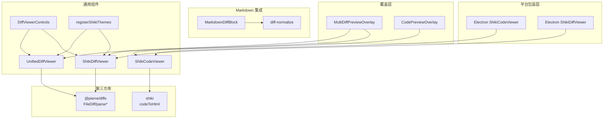

图表来源
- [packages/ui/src/components/code-viewer/ShikiCodeViewer.tsx:13](file://packages/ui/src/components/code-viewer/ShikiCodeViewer.tsx#L13)
- [packages/ui/src/components/code-viewer/ShikiDiffViewer.tsx:13](file://packages/ui/src/components/code-viewer/ShikiDiffViewer.tsx#L13)
- [packages/ui/src/components/code-viewer/UnifiedDiffViewer.tsx:13](file://packages/ui/src/components/code-viewer/UnifiedDiffViewer.tsx#L13)
- [packages/ui/src/components/code-viewer/registerShikiThemes.ts:1](file://packages/ui/src/components/code-viewer/registerShikiThemes.ts#L1)
- [packages/ui/src/components/markdown/MarkdownDiffBlock.tsx:18](file://packages/ui/src/components/markdown/MarkdownDiffBlock.tsx#L18)
- [packages/ui/src/components/markdown/diff-normalize.ts:3](file://packages/ui/src/components/markdown/diff-normalize.ts#L3)
- [packages/ui/src/components/overlay/MultiDiffPreviewOverlay.tsx:360-385](file://packages/ui/src/components/overlay/MultiDiffPreviewOverlay.tsx#L360-L385)
- [packages/ui/src/components/overlay/CodePreviewOverlay.tsx:100-107](file://packages/ui/src/components/overlay/CodePreviewOverlay.tsx#L100-L107)
- [apps/electron/src/renderer/components/shiki/ShikiCodeViewer.tsx:9](file://apps/electron/src/renderer/components/shiki/ShikiCodeViewer.tsx#L9)
- [apps/electron/src/renderer/components/shiki/ShikiDiffViewer.tsx:11](file://apps/electron/src/renderer/components/shiki/ShikiDiffViewer.tsx#L11)

## 详细组件分析

### ShikiCodeViewer（只读语法高亮）
- 功能要点
  - 支持从 filePath 推断语言或显式指定语言
  - 使用 shiki 的 codeToHtml 进行高亮，生成 HTML 片段
  - 提供行号列与可定制滚动条样式
  - 支持浅/深色主题，若未指定则按模式选择默认主题
  - 提供 onReady 回调，确保高亮完成后触发
- 性能与错误处理
  - 异步高亮，失败时回退到原始文本
  - 使用 requestAnimationFrame 触发 onReady，避免阻塞
  - 语言别名映射减少无效高亮尝试
- 使用建议
  - 对大文件建议分页或懒加载
  - 若已知语言，优先传入 language 以减少路径解析

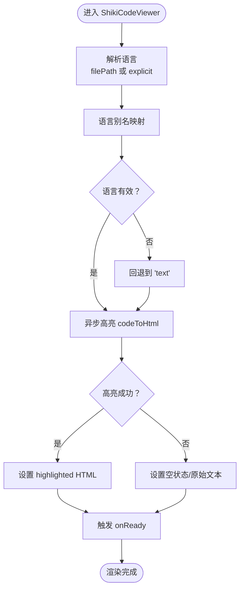

图表来源
- [packages/ui/src/components/code-viewer/ShikiCodeViewer.tsx:56-84](file://packages/ui/src/components/code-viewer/ShikiCodeViewer.tsx#L56-L84)
- [packages/ui/src/components/code-viewer/ShikiCodeViewer.tsx:93-133](file://packages/ui/src/components/code-viewer/ShikiCodeViewer.tsx#L93-L133)

章节来源
- [packages/ui/src/components/code-viewer/ShikiCodeViewer.tsx:17-34](file://packages/ui/src/components/code-viewer/ShikiCodeViewer.tsx#L17-L34)
- [packages/ui/src/components/code-viewer/ShikiCodeViewer.tsx:56-84](file://packages/ui/src/components/code-viewer/ShikiCodeViewer.tsx#L56-L84)
- [packages/ui/src/components/code-viewer/ShikiCodeViewer.tsx:93-133](file://packages/ui/src/components/code-viewer/ShikiCodeViewer.tsx#L93-L133)

### ShikiDiffViewer（原/改差异）
- 功能要点
  - 基于 @pierre/diffs 的 FileDiff 渲染统一/分屏差异
  - 通过 parseDiffFromFile 计算差异元数据
  - 支持自定义主题（优先 shikiTheme，否则 craft-dark/craft-light）
  - 可禁用背景高亮、隐藏文件头、文件头点击回调
  - 提供 getDiffStats 计算增删统计
- 控制栏联动
  - 与 DiffViewerControls 协作，切换 diffStyle、背景开关
- 文件头点击
  - 通过 shadow DOM 查询 data-diffs-header，注入点击事件回调

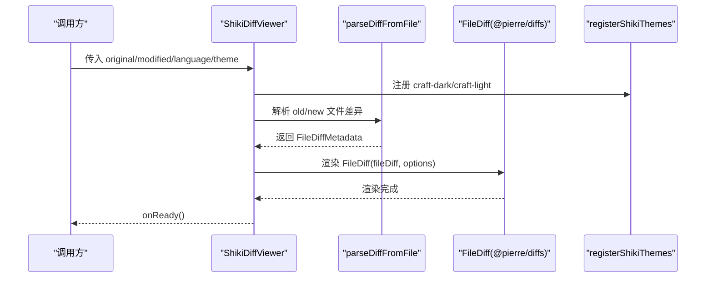

图表来源
- [packages/ui/src/components/code-viewer/ShikiDiffViewer.tsx:104-125](file://packages/ui/src/components/code-viewer/ShikiDiffViewer.tsx#L104-L125)
- [packages/ui/src/components/code-viewer/ShikiDiffViewer.tsx:135-145](file://packages/ui/src/components/code-viewer/ShikiDiffViewer.tsx#L135-L145)
- [packages/ui/src/components/code-viewer/ShikiDiffViewer.tsx:148-161](file://packages/ui/src/components/code-viewer/ShikiDiffViewer.tsx#L148-L161)
- [packages/ui/src/components/code-viewer/registerShikiThemes.ts:9-24](file://packages/ui/src/components/code-viewer/registerShikiThemes.ts#L9-L24)

章节来源
- [packages/ui/src/components/code-viewer/ShikiDiffViewer.tsx:35-62](file://packages/ui/src/components/code-viewer/ShikiDiffViewer.tsx#L35-L62)
- [packages/ui/src/components/code-viewer/ShikiDiffViewer.tsx:104-125](file://packages/ui/src/components/code-viewer/ShikiDiffViewer.tsx#L104-L125)
- [packages/ui/src/components/code-viewer/ShikiDiffViewer.tsx:135-145](file://packages/ui/src/components/code-viewer/ShikiDiffViewer.tsx#L135-L145)
- [packages/ui/src/components/code-viewer/ShikiDiffViewer.tsx:148-161](file://packages/ui/src/components/code-viewer/ShikiDiffViewer.tsx#L148-L161)

### UnifiedDiffViewer（统一差异）
- 功能要点
  - 接收预计算的统一差异字符串，内部解析为 FileDiffMetadata
  - 自动补全缺失的文件头（如仅含 hunk），保证 @pierre/diffs 可解析
  - 支持统一/分屏视图、背景开关、文件头点击回调
  - 提供 getUnifiedDiffStats 计算增删统计（无需完整渲染）
- 容错与回退
  - 解析失败时回退为纯文本显示

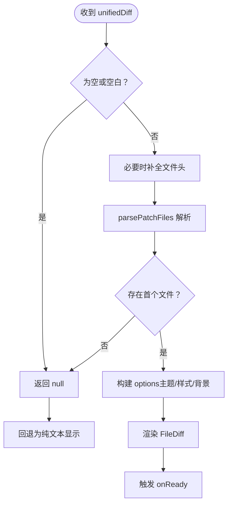

图表来源
- [packages/ui/src/components/code-viewer/UnifiedDiffViewer.tsx:62-90](file://packages/ui/src/components/code-viewer/UnifiedDiffViewer.tsx#L62-L90)
- [packages/ui/src/components/code-viewer/UnifiedDiffViewer.tsx:124-134](file://packages/ui/src/components/code-viewer/UnifiedDiffViewer.tsx#L124-L134)
- [packages/ui/src/components/code-viewer/UnifiedDiffViewer.tsx:137-150](file://packages/ui/src/components/code-viewer/UnifiedDiffViewer.tsx#L137-L150)

章节来源
- [packages/ui/src/components/code-viewer/UnifiedDiffViewer.tsx:33-56](file://packages/ui/src/components/code-viewer/UnifiedDiffViewer.tsx#L33-L56)
- [packages/ui/src/components/code-viewer/UnifiedDiffViewer.tsx:62-90](file://packages/ui/src/components/code-viewer/UnifiedDiffViewer.tsx#L62-L90)
- [packages/ui/src/components/code-viewer/UnifiedDiffViewer.tsx:124-134](file://packages/ui/src/components/code-viewer/UnifiedDiffViewer.tsx#L124-L134)
- [packages/ui/src/components/code-viewer/UnifiedDiffViewer.tsx:235-246](file://packages/ui/src/components/code-viewer/UnifiedDiffViewer.tsx#L235-L246)

### DiffViewerControls（控制栏）
- 功能要点
  - 显示增删统计（-X +Y，彩色）
  - 切换统一/分屏视图
  - 开启/关闭背景高亮
  - 与父组件同步状态，保持 UI 一致性

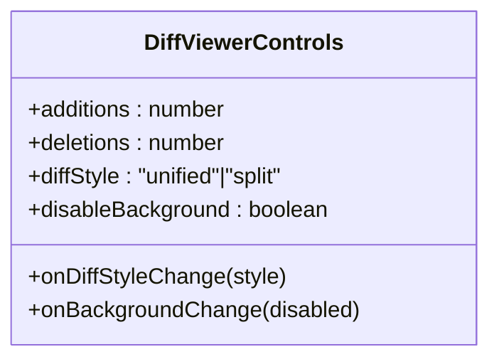

图表来源
- [packages/ui/src/components/code-viewer/DiffViewerControls.tsx:17-35](file://packages/ui/src/components/code-viewer/DiffViewerControls.tsx#L17-L35)

章节来源
- [packages/ui/src/components/code-viewer/DiffViewerControls.tsx:42-89](file://packages/ui/src/components/code-viewer/DiffViewerControls.tsx#L42-L89)

### 语言映射与文件路径处理
- 扩展名到语言映射
  - 提供 LANGUAGE_MAP，覆盖主流语言与脚本类型
  - getLanguageFromPath 从文件路径推断语言，支持显式覆盖
- 文件路径处理
  - formatFilePath 将用户主目录替换为 ~
  - truncateFilePath 按优先级进行中间截断，保留文件名可见性

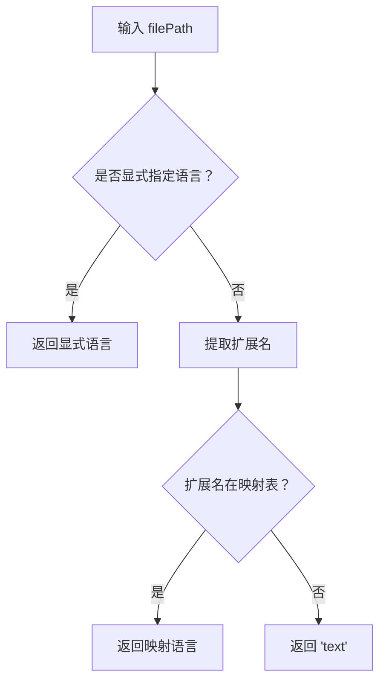

图表来源
- [packages/ui/src/components/code-viewer/language-map.ts:48-52](file://packages/ui/src/components/code-viewer/language-map.ts#L48-L52)
- [packages/ui/src/components/code-viewer/language-map.ts:9-40](file://packages/ui/src/components/code-viewer/language-map.ts#L9-L40)

章节来源
- [packages/ui/src/components/code-viewer/language-map.ts:9-52](file://packages/ui/src/components/code-viewer/language-map.ts#L9-L52)
- [packages/ui/src/components/code-viewer/language-map.ts:59-119](file://packages/ui/src/components/code-viewer/language-map.ts#L59-L119)

### 主题适配与自定义主题
- 自定义主题注册
  - registerCraftShikiThemes 一次性注册 craft-dark/craft-light，背景透明，适配 CSS 变量主题
- 应用层集成
  - Electron 包装层从 useTheme 获取 isDark 与 shikiTheme，传递给通用组件
  - 通用组件优先使用传入的 shikiTheme，否则使用 craft-dark/craft-light

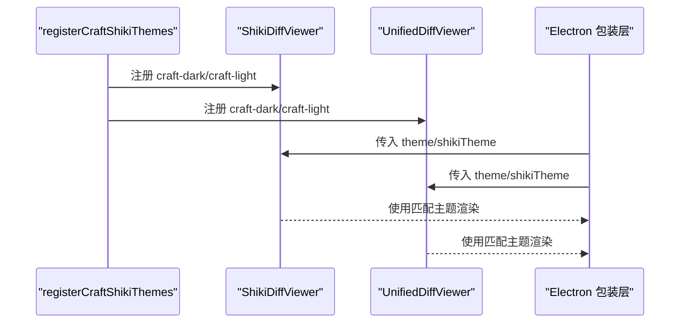

图表来源
- [packages/ui/src/components/code-viewer/registerShikiThemes.ts:9-24](file://packages/ui/src/components/code-viewer/registerShikiThemes.ts#L9-L24)
- [packages/ui/src/components/code-viewer/ShikiDiffViewer.tsx:129](file://packages/ui/src/components/code-viewer/ShikiDiffViewer.tsx#L129)
- [packages/ui/src/components/code-viewer/UnifiedDiffViewer.tsx:117](file://packages/ui/src/components/code-viewer/UnifiedDiffViewer.tsx#L117)
- [apps/electron/src/renderer/components/shiki/ShikiCodeViewer.tsx:19-22](file://apps/electron/src/renderer/components/shiki/ShikiCodeViewer.tsx#L19-L22)
- [apps/electron/src/renderer/components/shiki/ShikiDiffViewer.tsx:22-25](file://apps/electron/src/renderer/components/shiki/ShikiDiffViewer.tsx#L22-L25)

章节来源
- [packages/ui/src/components/code-viewer/registerShikiThemes.ts:9-24](file://packages/ui/src/components/code-viewer/registerShikiThemes.ts#L9-L24)
- [apps/electron/src/renderer/components/shiki/ShikiCodeViewer.tsx:19-22](file://apps/electron/src/renderer/components/shiki/ShikiCodeViewer.tsx#L19-L22)
- [apps/electron/src/renderer/components/shiki/ShikiDiffViewer.tsx:22-25](file://apps/electron/src/renderer/components/shiki/ShikiDiffViewer.tsx#L22-L25)

### Markdown 中的差异渲染
- MarkdownDiffBlock
  - 在消息流中遇到 ```diff 代码块时，使用 @pierre/diffs 的 PatchDiff 渲染，而非纯 Shiki 高亮
  - 自动注册自定义元素与主题，确保与全屏差异一致
  - 出错时降级为普通 CodeBlock
- diff-normalize
  - 将不规范的 diff 文本归一化为统一差异格式，支持：
    - 缺失文件头的编号 hunk
    - 纯正文无头部
    - 裸 @@ 标记
  - 保持多文件补丁不变，交由错误边界降级

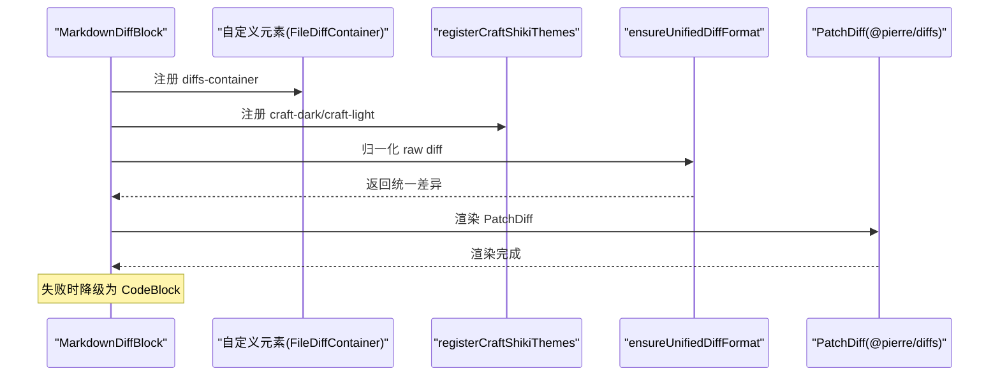

图表来源
- [packages/ui/src/components/markdown/MarkdownDiffBlock.tsx:28-40](file://packages/ui/src/components/markdown/MarkdownDiffBlock.tsx#L28-L40)
- [packages/ui/src/components/markdown/diff-normalize.ts:63-129](file://packages/ui/src/components/markdown/diff-normalize.ts#L63-L129)

章节来源
- [packages/ui/src/components/markdown/MarkdownDiffBlock.tsx:17-67](file://packages/ui/src/components/markdown/MarkdownDiffBlock.tsx#L17-L67)
- [packages/ui/src/components/markdown/diff-normalize.ts:63-129](file://packages/ui/src/components/markdown/diff-normalize.ts#L63-L129)

### 多文件差异预览与单文件代码预览
- MultiDiffPreviewOverlay
  - 支持两种变更格式：Claude Code（original/modified）与 Codex（unifiedDiff）
  - 根据格式选择 ShikiDiffViewer 或 UnifiedDiffViewer 渲染
  - 统一控制 diffStyle 与背景开关，支持文件头点击打开外部编辑器
- CodePreviewOverlay
  - 使用 ShikiCodeViewer 展示单文件内容，支持命令行展示与错误提示

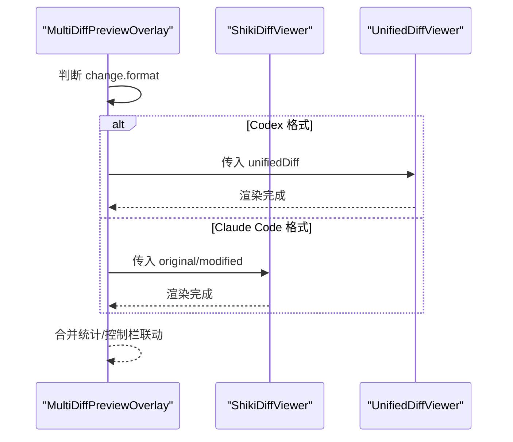

图表来源
- [packages/ui/src/components/overlay/MultiDiffPreviewOverlay.tsx:360-385](file://packages/ui/src/components/overlay/MultiDiffPreviewOverlay.tsx#L360-L385)
- [packages/ui/src/components/overlay/CodePreviewOverlay.tsx:100-107](file://packages/ui/src/components/overlay/CodePreviewOverlay.tsx#L100-L107)

章节来源
- [packages/ui/src/components/overlay/MultiDiffPreviewOverlay.tsx:25-395](file://packages/ui/src/components/overlay/MultiDiffPreviewOverlay.tsx#L25-L395)
- [packages/ui/src/components/overlay/CodePreviewOverlay.tsx:15-111](file://packages/ui/src/components/overlay/CodePreviewOverlay.tsx#L15-L111)

## 依赖关系分析
- 组件耦合
  - ShikiCodeViewer 依赖 shiki 与语言映射
  - ShikiDiffViewer/UnifiedDiffViewer 依赖 @pierre/diffs 与自定义主题注册
  - 控制栏与差异组件通过 props 交互，低耦合
- 外部依赖
  - shiki：语法高亮
  - @pierre/diffs：统一差异渲染与解析
  - react：组件生命周期与状态管理

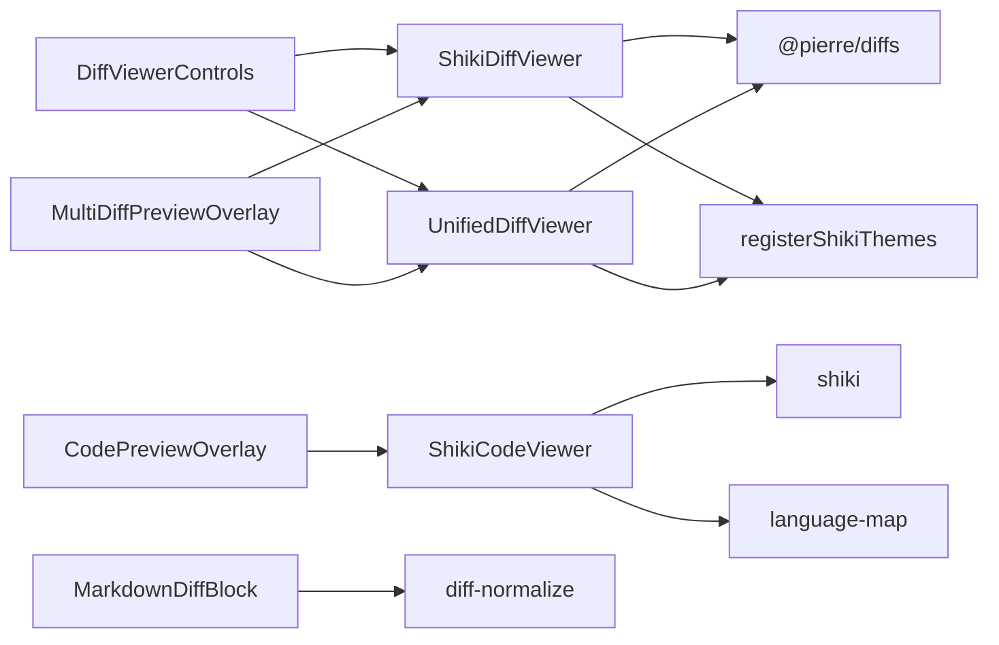

图表来源
- [packages/ui/src/components/code-viewer/ShikiCodeViewer.tsx:13](file://packages/ui/src/components/code-viewer/ShikiCodeViewer.tsx#L13)
- [packages/ui/src/components/code-viewer/ShikiDiffViewer.tsx:13](file://packages/ui/src/components/code-viewer/ShikiDiffViewer.tsx#L13)
- [packages/ui/src/components/code-viewer/UnifiedDiffViewer.tsx:13](file://packages/ui/src/components/code-viewer/UnifiedDiffViewer.tsx#L13)
- [packages/ui/src/components/code-viewer/registerShikiThemes.ts:1](file://packages/ui/src/components/code-viewer/registerShikiThemes.ts#L1)
- [packages/ui/src/components/markdown/MarkdownDiffBlock.tsx:18](file://packages/ui/src/components/markdown/MarkdownDiffBlock.tsx#L18)
- [packages/ui/src/components/markdown/diff-normalize.ts:3](file://packages/ui/src/components/markdown/diff-normalize.ts#L3)
- [packages/ui/src/components/overlay/MultiDiffPreviewOverlay.tsx:360-385](file://packages/ui/src/components/overlay/MultiDiffPreviewOverlay.tsx#L360-L385)
- [packages/ui/src/components/overlay/CodePreviewOverlay.tsx:100-107](file://packages/ui/src/components/overlay/CodePreviewOverlay.tsx#L100-L107)

## 性能考量
- 异步高亮与延迟触发
  - ShikiCodeViewer 使用异步高亮并在高亮完成后触发 onReady，避免主线程阻塞
  - ShikiDiffViewer/UnifiedDiffViewer 在首次渲染后延时触发 onReady，确保 Shiki 完成高亮
- 语言与主题缓存
  - 通过 useMemo 缓存语言解析与 options，减少重复计算
  - registerCraftShikiThemes 仅注册一次，避免重复注册警告
- DOM 与 Shadow DOM 查询
  - 文件头点击监听在容器内查询 shadowRoot 中的 header，避免全局监听带来的性能问题
- Markdown 归一化
  - diff-normalize 仅在 Markdown diff 块场景使用，避免对常规文本造成额外开销

章节来源
- [packages/ui/src/components/code-viewer/ShikiCodeViewer.tsx:93-133](file://packages/ui/src/components/code-viewer/ShikiCodeViewer.tsx#L93-L133)
- [packages/ui/src/components/code-viewer/ShikiDiffViewer.tsx:148-161](file://packages/ui/src/components/code-viewer/ShikiDiffViewer.tsx#L148-L161)
- [packages/ui/src/components/code-viewer/UnifiedDiffViewer.tsx:137-150](file://packages/ui/src/components/code-viewer/UnifiedDiffViewer.tsx#L137-L150)
- [packages/ui/src/components/code-viewer/registerShikiThemes.ts:9-13](file://packages/ui/src/components/code-viewer/registerShikiThemes.ts#L9-L13)

## 故障排查指南
- 无法高亮或显示空白
  - 检查语言是否有效，必要时显式传入 language
  - 确认 shikiTheme 是否可用，或改为内置 craft-dark/craft-light
- 差异解析失败
  - 对于 UnifiedDiffViewer，确认 unifiedDiff 是否符合统一差异格式；必要时使用 diff-normalize 归一化
  - 对于 ShikiDiffViewer，确认 original/modified 是否为完整文件内容
- 文件头不可点击
  - 确保未禁用文件头（disableFileHeader=false）
  - 等待渲染完成后，检查 shadow DOM 中是否存在 [data-diffs-header]
- 主题背景异常
  - 确认是否使用了透明背景的主题（craft-dark/craft-light），或传入了有效的 shikiTheme
- Electron 主题不生效
  - 确认 useTheme 返回的 isDark 与 shikiTheme 正确传递至组件

章节来源
- [packages/ui/src/components/code-viewer/ShikiCodeViewer.tsx:114-125](file://packages/ui/src/components/code-viewer/ShikiCodeViewer.tsx#L114-L125)
- [packages/ui/src/components/code-viewer/UnifiedDiffViewer.tsx:62-90](file://packages/ui/src/components/code-viewer/UnifiedDiffViewer.tsx#L62-L90)
- [packages/ui/src/components/code-viewer/ShikiDiffViewer.tsx:163-195](file://packages/ui/src/components/code-viewer/ShikiDiffViewer.tsx#L163-L195)
- [packages/ui/src/components/code-viewer/registerShikiThemes.ts:9-24](file://packages/ui/src/components/code-viewer/registerShikiThemes.ts#L9-L24)
- [apps/electron/src/renderer/components/shiki/ShikiCodeViewer.tsx:19-22](file://apps/electron/src/renderer/components/shiki/ShikiCodeViewer.tsx#L19-L22)

## 结论
该代码查看组件体系以 Shiki 为核心，结合 @pierre/diffs 实现了高性能、可定制的语法高亮与差异渲染。通过语言映射、主题注册与控制栏，开发者可以快速集成统一/分屏视图、背景高亮、文件头点击等高级能力。Markdown 集成与多文件覆盖层进一步提升了在消息流与批量变更场景下的可用性。

## 附录

### 使用指南：代码高亮配置
- 传入 language 以强制指定语言，避免路径解析误差
- theme='dark'/'light' 与 shikiTheme 共同决定最终主题
- onReady 用于高亮完成后执行后续逻辑（如滚动定位）

章节来源
- [packages/ui/src/components/code-viewer/ShikiCodeViewer.tsx:65-74](file://packages/ui/src/components/code-viewer/ShikiCodeViewer.tsx#L65-L74)
- [packages/ui/src/components/code-viewer/ShikiCodeViewer.tsx:95-96](file://packages/ui/src/components/code-viewer/ShikiCodeViewer.tsx#L95-L96)

### 使用指南：主题定制
- 使用 registerCraftShikiThemes 注册 craft-dark/craft-light，背景透明
- 在 Electron 包装层通过 useTheme 获取 shikiTheme，使差异与代码高亮主题一致

章节来源
- [packages/ui/src/components/code-viewer/registerShikiThemes.ts:9-24](file://packages/ui/src/components/code-viewer/registerShikiThemes.ts#L9-L24)
- [apps/electron/src/renderer/components/shiki/ShikiCodeViewer.tsx:19-22](file://apps/electron/src/renderer/components/shiki/ShikiCodeViewer.tsx#L19-L22)

### 使用指南：差异比较
- Claude Code 场景：使用 ShikiDiffViewer，传入 original/modified
- Codex 场景：使用 UnifiedDiffViewer，传入 unifiedDiff
- 控制栏：通过 DiffViewerControls 切换视图与背景高亮

章节来源
- [packages/ui/src/components/code-viewer/ShikiDiffViewer.tsx:87-100](file://packages/ui/src/components/code-viewer/ShikiDiffViewer.tsx#L87-L100)
- [packages/ui/src/components/code-viewer/UnifiedDiffViewer.tsx:95-106](file://packages/ui/src/components/code-viewer/UnifiedDiffViewer.tsx#L95-L106)
- [packages/ui/src/components/code-viewer/DiffViewerControls.tsx:42-89](file://packages/ui/src/components/code-viewer/DiffViewerControls.tsx#L42-L89)