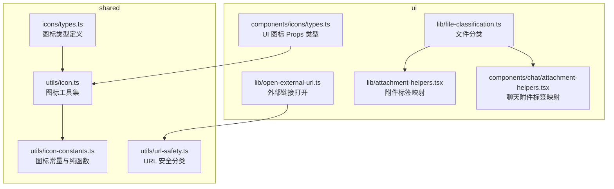
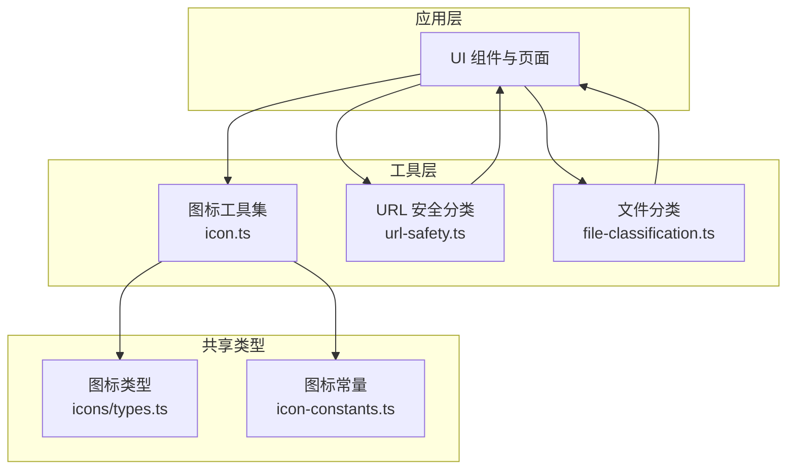
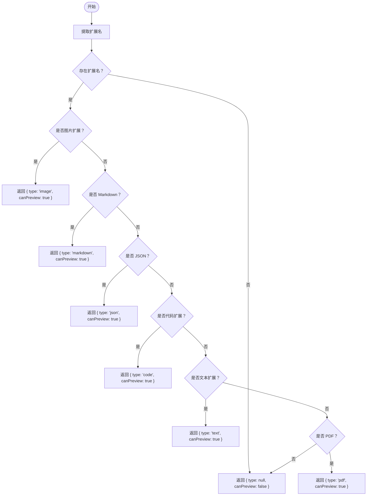
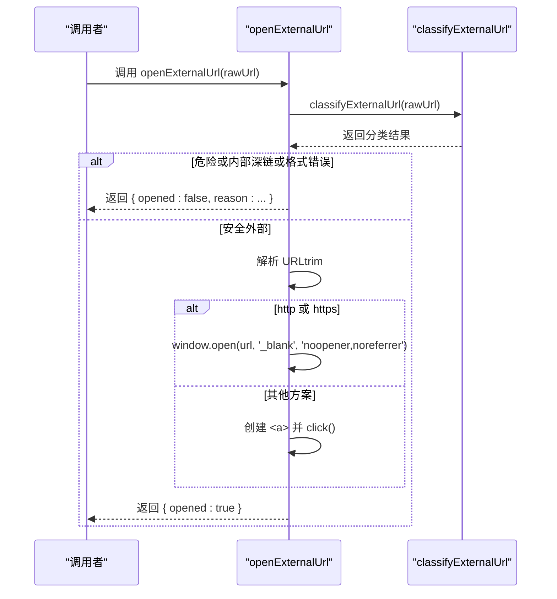
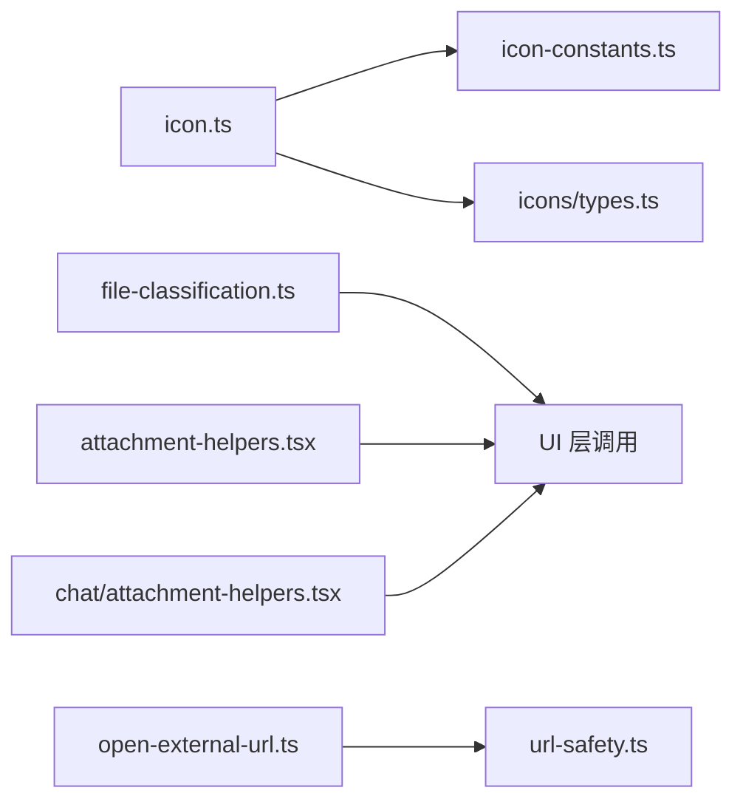

# 工具组件

<cite>
**本文引用的文件**
- [packages/shared/src/icons/types.ts](file://packages/shared/src/icons/types.ts)
- [packages/shared/src/utils/icon.ts](file://packages/shared/src/utils/icon.ts)
- [packages/shared/src/utils/icon-constants.ts](file://packages/shared/src/utils/icon-constants.ts)
- [packages/shared/src/utils/url-safety.ts](file://packages/shared/src/utils/url-safety.ts)
- [packages/ui/src/lib/file-classification.ts](file://packages/ui/src/lib/file-classification.ts)
- [packages/ui/src/lib/open-external-url.ts](file://packages/ui/src/lib/open-external-url.ts)
- [packages/ui/src/lib/attachment-helpers.tsx](file://packages/ui/src/lib/attachment-helpers.tsx)
- [packages/ui/src/components/icons/types.ts](file://packages/ui/src/components/icons/types.ts)
- [packages/ui/src/components/chat/attachment-helpers.tsx](file://packages/ui/src/components/chat/attachment-helpers.tsx)
</cite>

## 目录
1. [简介](#简介)
2. [项目结构](#项目结构)
3. [核心组件](#核心组件)
4. [架构总览](#架构总览)
5. [详细组件分析](#详细组件分析)
6. [依赖关系分析](#依赖关系分析)
7. [性能考量](#性能考量)
8. [故障排查指南](#故障排查指南)
9. [结论](#结论)
10. [附录](#附录)

## 简介
本文件为通用工具组件的开发与使用指南，覆盖以下主题：
- 图标组件系统：SVG 图标的导入、尺寸控制、颜色适配；统一的图标配置与解析流程。
- 文件分类系统：classifyFile 的实现原理、文件类型检测、预览类型识别、分类规则。
- 外部链接打开工具：openExternalUrl 的安全机制、平台适配、返回值处理。
- 数据结构定义：文件预览类型、文件分类结果、URL 打开结果。
- 最佳实践：图标使用指南、文件分类配置、外部链接处理。

## 项目结构
本仓库中与“工具组件”直接相关的模块主要分布在两个包：
- shared：提供跨应用共享的图标类型与安全策略等基础能力。
- ui：提供浏览器端的文件分类、外部链接打开、附件辅助等工具函数与类型。

**图表来源**
- [packages/shared/src/icons/types.ts:1-77](file://packages/shared/src/icons/types.ts#L1-L77)
- [packages/shared/src/utils/icon.ts:1-241](file://packages/shared/src/utils/icon.ts#L1-L241)
- [packages/shared/src/utils/icon-constants.ts:1-59](file://packages/shared/src/utils/icon-constants.ts#L1-L59)
- [packages/shared/src/utils/url-safety.ts:1-53](file://packages/shared/src/utils/url-safety.ts#L1-L53)
- [packages/ui/src/lib/file-classification.ts:1-128](file://packages/ui/src/lib/file-classification.ts#L1-L128)
- [packages/ui/src/lib/open-external-url.ts:1-61](file://packages/ui/src/lib/open-external-url.ts#L1-L61)
- [packages/ui/src/lib/attachment-helpers.tsx:1-152](file://packages/ui/src/lib/attachment-helpers.tsx#L1-L152)
- [packages/ui/src/components/icons/types.ts:1-9](file://packages/ui/src/components/icons/types.ts#L1-L9)
- [packages/ui/src/components/chat/attachment-helpers.tsx:1-152](file://packages/ui/src/components/chat/attachment-helpers.tsx#L1-L152)

**章节来源**
- [packages/shared/src/icons/types.ts:1-77](file://packages/shared/src/icons/types.ts#L1-L77)
- [packages/shared/src/utils/icon.ts:1-241](file://packages/shared/src/utils/icon.ts#L1-L241)
- [packages/shared/src/utils/icon-constants.ts:1-59](file://packages/shared/src/utils/icon-constants.ts#L1-L59)
- [packages/shared/src/utils/url-safety.ts:1-53](file://packages/shared/src/utils/url-safety.ts#L1-L53)
- [packages/ui/src/lib/file-classification.ts:1-128](file://packages/ui/src/lib/file-classification.ts#L1-L128)
- [packages/ui/src/lib/open-external-url.ts:1-61](file://packages/ui/src/lib/open-external-url.ts#L1-L61)
- [packages/ui/src/lib/attachment-helpers.tsx:1-152](file://packages/ui/src/lib/attachment-helpers.tsx#L1-L152)
- [packages/ui/src/components/icons/types.ts:1-9](file://packages/ui/src/components/icons/types.ts#L1-L9)
- [packages/ui/src/components/chat/attachment-helpers.tsx:1-152](file://packages/ui/src/components/chat/attachment-helpers.tsx#L1-L152)

## 核心组件
- 图标系统（shared）
  - 统一的图标类型与尺寸规范，支持表情符号、远程 URL、本地文件三种形态。
  - 提供图标验证、下载、发现与解析函数，确保渲染前的图标来源可控且可复用。
- 文件分类（ui）
  - 基于扩展名的文件类型判定，决定是否在应用内预览以及采用何种预览器。
- 外部链接打开（ui + shared）
  - 对 URL 进行安全分类，区分危险、内部深链与安全外部链接，并给出一致的打开策略。
- 附件标签映射（ui）
  - 将 MIME 类型与常见扩展名映射为人类可读的文件类型标签，用于 UI 展示。

**章节来源**
- [packages/shared/src/icons/types.ts:15-77](file://packages/shared/src/icons/types.ts#L15-L77)
- [packages/shared/src/utils/icon.ts:54-241](file://packages/shared/src/utils/icon.ts#L54-L241)
- [packages/ui/src/lib/file-classification.ts:9-112](file://packages/ui/src/lib/file-classification.ts#L9-L112)
- [packages/ui/src/lib/open-external-url.ts:21-61](file://packages/ui/src/lib/open-external-url.ts#L21-L61)
- [packages/ui/src/lib/attachment-helpers.tsx:12-152](file://packages/ui/src/lib/attachment-helpers.tsx#L12-L152)

## 架构总览
下图展示了“图标系统”“文件分类”“外部链接打开”三部分在应用中的协作关系与数据流。

**图表来源**
- [packages/shared/src/utils/icon.ts:1-241](file://packages/shared/src/utils/icon.ts#L1-L241)
- [packages/shared/src/icons/types.ts:1-77](file://packages/shared/src/icons/types.ts#L1-L77)
- [packages/shared/src/utils/icon-constants.ts:1-59](file://packages/shared/src/utils/icon-constants.ts#L1-L59)
- [packages/shared/src/utils/url-safety.ts:1-53](file://packages/shared/src/utils/url-safety.ts#L1-L53)
- [packages/ui/src/lib/file-classification.ts:1-128](file://packages/ui/src/lib/file-classification.ts#L1-L128)

## 详细组件分析

### 图标组件系统（Icon_Folder、Icon_Home 等）
- 设计目标
  - 统一图标来源与渲染方式，支持表情符号、远程图片与本地文件自动发现。
  - 通过类型系统约束图标配置与解析结果，保证渲染一致性与可维护性。
- 关键类型
  - IconConfig：实体配置中的图标字段，允许为空（表示启用自动发现）。
  - ResolvedEntityIcon：渲染前的图标解析结果，包含类型、可着色性与可选的原始 SVG。
  - IconSize 与尺寸映射：提供标准尺寸到 Tailwind 类的映射，便于统一风格。
- 解析流程
  - 配置优先：若配置为表情或 URL，则按配置渲染；否则回退到本地文件。
  - 下载与发现：当配置为 URL 时，可调用下载函数保存至本地；本地文件通过扩展名集合自动发现。
- 使用建议
  - 优先使用配置中的表情或 URL，避免相对路径与内联 SVG。
  - 对于需要跟随主题色的 SVG，确保使用 currentColor 并在父级设置颜色类。
  - 在 UI 中通过尺寸类控制大小，必要时传入 size 属性微调。

**图表来源**
- [packages/shared/src/utils/icon.ts:222-241](file://packages/shared/src/utils/icon.ts#L222-L241)
- [packages/shared/src/utils/icon-constants.ts:34-58](file://packages/shared/src/utils/icon-constants.ts#L34-L58)
- [packages/shared/src/icons/types.ts:20-51](file://packages/shared/src/icons/types.ts#L20-L51)

**章节来源**
- [packages/shared/src/icons/types.ts:15-77](file://packages/shared/src/icons/types.ts#L15-L77)
- [packages/shared/src/utils/icon.ts:54-241](file://packages/shared/src/utils/icon.ts#L54-L241)
- [packages/shared/src/utils/icon-constants.ts:15-59](file://packages/shared/src/utils/icon-constants.ts#L15-L59)
- [packages/ui/src/components/icons/types.ts:3-9](file://packages/ui/src/components/icons/types.ts#L3-L9)

### 文件分类系统（classifyFile）
- 功能概述
  - 基于文件扩展名判断是否可在应用内预览，以及采用何种预览器（图片、代码、Markdown、JSON、文本、PDF）。
- 分类规则
  - 按优先级匹配扩展名集合：image > code > markdown > json > text > pdf。
  - 不在任何集合中的扩展名不可预览。
  - 特定扩展名（如 Excel、Word、PPT、压缩包、安装包、音视频、HEIC/HEIF/TIFF）被归类为“外部打开”，不进行应用内预览。
- 数据结构
  - FilePreviewType：预览类型枚举。
  - FileClassification：包含 type 与 canPreview 字段的结果对象。
  - FILE_EXTENSIONS_PATTERN：所有已知扩展名的正则模式，用于链接识别同步。

**图表来源**
- [packages/ui/src/lib/file-classification.ts:100-112](file://packages/ui/src/lib/file-classification.ts#L100-L112)

**章节来源**
- [packages/ui/src/lib/file-classification.ts:9-128](file://packages/ui/src/lib/file-classification.ts#L9-L128)

### 外部链接打开工具（openExternalUrl）
- 安全机制
  - 使用 URL 分类函数对输入进行分类：危险、内部深链、安全外部。
  - 危险方案（如 javascript:、data:、file: 等）直接拒绝。
  - 内部深链（如 craftagents://）不通过系统打开，避免误触发外部协议。
- 平台适配
  - http/https：使用 window.open 保持新标签页体验一致。
  - 其他方案：通过创建真实 <a> 元素并模拟点击，走浏览器链接导航路径，从而正确触发系统协议处理器。
- 返回值处理
  - 成功打开：opened: true。
  - 失败场景：dangerous（含原因）、internal-deeplink、malformed（格式错误）。

**图表来源**
- [packages/ui/src/lib/open-external-url.ts:27-61](file://packages/ui/src/lib/open-external-url.ts#L27-L61)
- [packages/shared/src/utils/url-safety.ts:26-49](file://packages/shared/src/utils/url-safety.ts#L26-L49)

**章节来源**
- [packages/ui/src/lib/open-external-url.ts:1-61](file://packages/ui/src/lib/open-external-url.ts#L1-L61)
- [packages/shared/src/utils/url-safety.ts:1-53](file://packages/shared/src/utils/url-safety.ts#L1-L53)

### 附件类型标签映射
- 用途
  - 将 MIME 类型与常见扩展名映射为人类可读的文件类型标签，用于消息附件展示。
- 规则
  - 优先精确匹配 MIME 类型；其次从文件名提取扩展名；最后按类型类别回退。
- 适用范围
  - 文档（PDF、Word、Excel、PowerPoint、RTF）、文本与标记（纯文本、Markdown、HTML、CSS、CSV、XML、JSON、YAML）、编程语言（JS/TS、Python、Go、Java、Rust、C/C++、C#、PHP、Shell 等）、配置文件（JSON、YAML、TOML、XML、INI、.env 系列）等。

**章节来源**
- [packages/ui/src/lib/attachment-helpers.tsx:12-152](file://packages/ui/src/lib/attachment-helpers.tsx#L12-L152)
- [packages/ui/src/components/chat/attachment-helpers.tsx:12-152](file://packages/ui/src/components/chat/attachment-helpers.tsx#L12-L152)

## 依赖关系分析
- 图标系统
  - icon.ts 依赖 icon-constants.ts（纯函数与常量），输出 ResolvedIcon 与图标解析函数。
  - icons/types.ts 提供共享类型，供 UI 组件消费。
- 文件分类
  - file-classification.ts 仅依赖扩展名集合与字符串处理，无副作用，适合在渲染层直接调用。
- 外部链接打开
  - open-external-url.ts 依赖 shared 的 url-safety.ts，负责最终打开行为。
- 附件标签映射
  - attachment-helpers.tsx 与 chat/attachment-helpers.tsx 提供不同场景下的标签映射，服务于 UI 展示。

**图表来源**
- [packages/shared/src/utils/icon.ts:1-241](file://packages/shared/src/utils/icon.ts#L1-L241)
- [packages/shared/src/utils/icon-constants.ts:1-59](file://packages/shared/src/utils/icon-constants.ts#L1-L59)
- [packages/shared/src/icons/types.ts:1-77](file://packages/shared/src/icons/types.ts#L1-L77)
- [packages/ui/src/lib/file-classification.ts:1-128](file://packages/ui/src/lib/file-classification.ts#L1-L128)
- [packages/ui/src/lib/open-external-url.ts:1-61](file://packages/ui/src/lib/open-external-url.ts#L1-L61)
- [packages/shared/src/utils/url-safety.ts:1-53](file://packages/shared/src/utils/url-safety.ts#L1-L53)
- [packages/ui/src/lib/attachment-helpers.tsx:1-152](file://packages/ui/src/lib/attachment-helpers.tsx#L1-L152)
- [packages/ui/src/components/chat/attachment-helpers.tsx:1-152](file://packages/ui/src/components/chat/attachment-helpers.tsx#L1-L152)

**章节来源**
- [packages/shared/src/utils/icon.ts:1-241](file://packages/shared/src/utils/icon.ts#L1-L241)
- [packages/shared/src/utils/icon-constants.ts:1-59](file://packages/shared/src/utils/icon-constants.ts#L1-L59)
- [packages/shared/src/icons/types.ts:1-77](file://packages/shared/src/icons/types.ts#L1-L77)
- [packages/ui/src/lib/file-classification.ts:1-128](file://packages/ui/src/lib/file-classification.ts#L1-L128)
- [packages/ui/src/lib/open-external-url.ts:1-61](file://packages/ui/src/lib/open-external-url.ts#L1-L61)
- [packages/ui/src/lib/attachment-helpers.tsx:1-152](file://packages/ui/src/lib/attachment-helpers.tsx#L1-L152)
- [packages/ui/src/components/chat/attachment-helpers.tsx:1-152](file://packages/ui/src/components/chat/attachment-helpers.tsx#L1-L152)

## 性能考量
- 图标下载
  - 仅在配置为 URL 且本地不存在时触发下载，避免重复 IO。
  - 下载后写入磁盘，后续可直接以 file 方式渲染，减少网络请求。
- 文件分类
  - 使用 Set 查询，时间复杂度 O(1)，扩展名数量有限，整体开销极低。
- 外部链接打开
  - 分类阶段即排除危险与内部深链，减少无效尝试。
  - http/https 使用 window.open，其他方案通过 DOM 触发，避免不必要的跨域问题。

[本节为通用指导，无需具体文件分析]

## 故障排查指南
- 图标无法显示
  - 检查配置值是否为表情或 http(s) URL；相对路径与内联 SVG 将被拒绝。
  - 若为 URL，请确认已执行下载并生成本地文件；确认扩展名在支持列表中。
- 颜色不随主题变化
  - 确认 SVG 使用 currentColor；在父级设置颜色类（如 text-success）以继承颜色。
- 文件无法预览
  - 检查扩展名是否在分类集合中；不在集合内的扩展名将不可预览。
  - 特殊扩展名（如 HEIC/HEIF/TIFF、Excel/Word/PPT、压缩包、安装包、音视频）会被强制外部打开。
- 外部链接打不开或报错
  - 危险方案（javascript:、data:、file: 等）会被拒绝；请修正 URL。
  - 内部深链（craftagents://）不会外部打开；请在应用内路由处理。
  - 非 http/https 的自定义协议需通过 DOM 点击方式触发，确保 URL 格式正确。

**章节来源**
- [packages/shared/src/utils/icon.ts:61-82](file://packages/shared/src/utils/icon.ts#L61-L82)
- [packages/shared/src/utils/icon.ts:184-194](file://packages/shared/src/utils/icon.ts#L184-L194)
- [packages/ui/src/lib/file-classification.ts:72-81](file://packages/ui/src/lib/file-classification.ts#L72-L81)
- [packages/ui/src/lib/open-external-url.ts:30-36](file://packages/ui/src/lib/open-external-url.ts#L30-L36)
- [packages/shared/src/utils/url-safety.ts:16-22](file://packages/shared/src/utils/url-safety.ts#L16-L22)

## 结论
本工具组件体系通过统一的类型与解析流程，实现了图标、文件分类与外部链接打开的标准化与可维护性。开发者应遵循配置优先、安全分类与尺寸/颜色规范，以获得一致的用户体验与更高的安全性。

[本节为总结，无需具体文件分析]

## 附录

### 数据结构速查
- 图标
  - IconConfig：实体配置中的图标字段。
  - ResolvedEntityIcon：渲染前的图标解析结果，包含 kind、value、colorable、rawSvg。
  - IconSize 与尺寸映射：xs/sm/md/lg/xl 到 Tailwind 类的映射。
- 文件分类
  - FilePreviewType：'image' | 'code' | 'markdown' | 'json' | 'text' | 'pdf'
  - FileClassification：{ type: FilePreviewType | null, canPreview: boolean }
  - FILE_EXTENSIONS_PATTERN：所有扩展名的正则模式。
- 外部链接
  - UrlClassification：'dangerous' | 'internal-deeplink' | 'safe-external'
  - OpenExternalUrlResult：{ opened: true } | { opened: false, reason: string, detail?: string }

**章节来源**
- [packages/shared/src/icons/types.ts:15-77](file://packages/shared/src/icons/types.ts#L15-L77)
- [packages/ui/src/lib/file-classification.ts:9-17](file://packages/ui/src/lib/file-classification.ts#L9-L17)
- [packages/ui/src/lib/open-external-url.ts:21-26](file://packages/ui/src/lib/open-external-url.ts#L21-L26)
- [packages/shared/src/utils/url-safety.ts:11-14](file://packages/shared/src/utils/url-safety.ts#L11-L14)