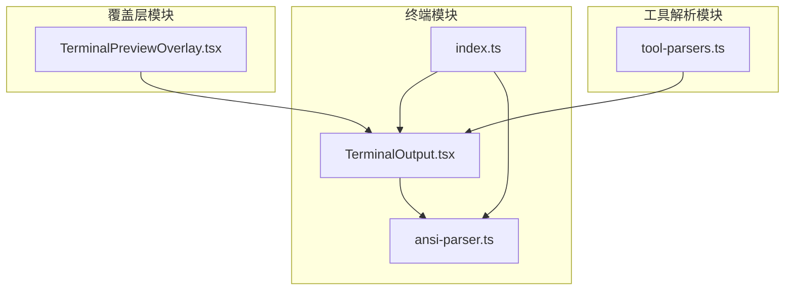
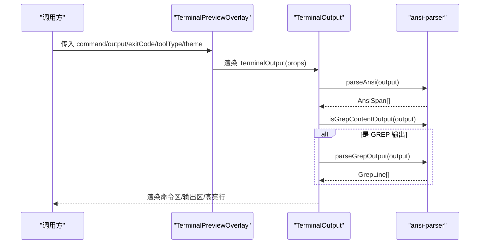
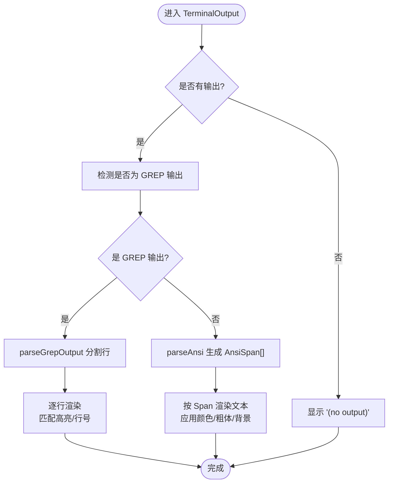
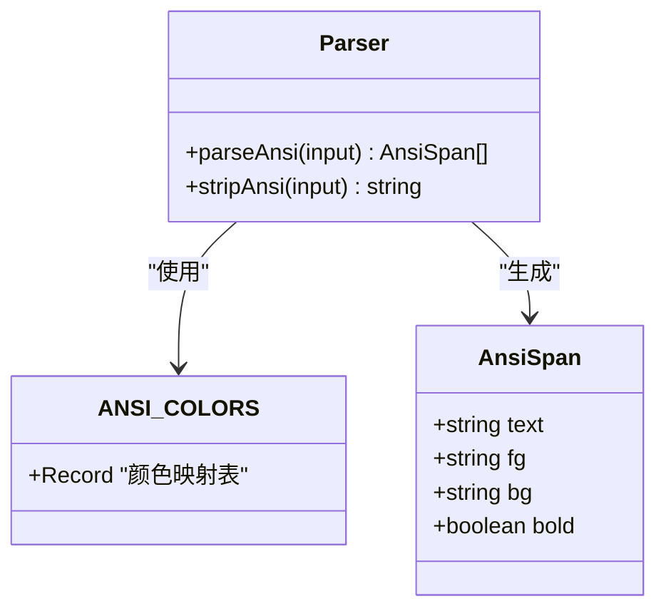
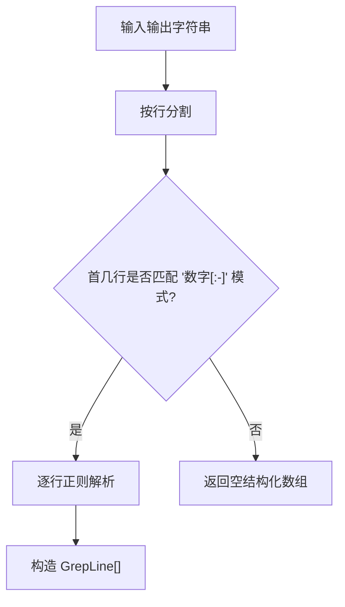
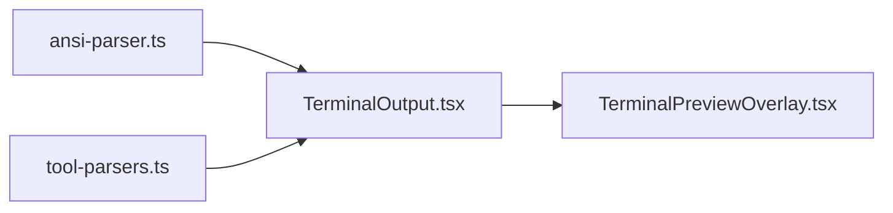

# 终端组件

<cite>
**本文引用的文件**
- [TerminalOutput.tsx](file://packages/ui/src/components/terminal/TerminalOutput.tsx)
- [ansi-parser.ts](file://packages/ui/src/components/terminal/ansi-parser.ts)
- [index.ts](file://packages/ui/src/components/terminal/index.ts)
- [TerminalPreviewOverlay.tsx](file://packages/ui/src/components/overlay/TerminalPreviewOverlay.tsx)
- [tool-parsers.ts](file://packages/ui/src/lib/tool-parsers.ts)
- [marked-terminal.d.ts](file://packages/shared/src/types/marked-terminal.d.ts)
</cite>

## 目录
1. [简介](#简介)
2. [项目结构](#项目结构)
3. [核心组件](#核心组件)
4. [架构总览](#架构总览)
5. [详细组件分析](#详细组件分析)
6. [依赖关系分析](#依赖关系分析)
7. [性能考量](#性能考量)
8. [故障排查指南](#故障排查指南)
9. [结论](#结论)
10. [附录](#附录)

## 简介
本文件为终端输出组件（TerminalOutput）的详细开发文档，面向需要在前端实现命令行界面或终端模拟的开发者。文档涵盖以下主题：
- ANSI 颜色解析与文本格式化机制
- GREP 输出解析与高亮显示
- 命令行模拟展示（命令区、输出区、退出码状态）
- 工具类型定义与样式定制
- 组件配置与使用指南

## 项目结构
终端组件位于 UI 包中，采用“功能域”组织方式：TerminalOutput 作为展示组件，ansi-parser 提供 ANSI/GREP 解析能力，index.ts 暴露公共 API；TerminalPreviewOverlay 将其包装为可嵌入的预览面板。

图表来源
- [TerminalOutput.tsx:1-223](file://packages/ui/src/components/terminal/TerminalOutput.tsx#L1-L223)
- [ansi-parser.ts:1-154](file://packages/ui/src/components/terminal/ansi-parser.ts#L1-L154)
- [index.ts:1-15](file://packages/ui/src/components/terminal/index.ts#L1-L15)
- [TerminalPreviewOverlay.tsx:1-96](file://packages/ui/src/components/overlay/TerminalPreviewOverlay.tsx#L1-L96)
- [tool-parsers.ts:48-93](file://packages/ui/src/lib/tool-parsers.ts#L48-L93)

章节来源
- [TerminalOutput.tsx:1-223](file://packages/ui/src/components/terminal/TerminalOutput.tsx#L1-L223)
- [ansi-parser.ts:1-154](file://packages/ui/src/components/terminal/ansi-parser.ts#L1-L154)
- [index.ts:1-15](file://packages/ui/src/components/terminal/index.ts#L1-L15)
- [TerminalPreviewOverlay.tsx:1-96](file://packages/ui/src/components/overlay/TerminalPreviewOverlay.tsx#L1-L96)
- [tool-parsers.ts:48-93](file://packages/ui/src/lib/tool-parsers.ts#L48-L93)

## 核心组件
- TerminalOutput：终端风格输出展示组件，支持 ANSI 颜色、GREP 行号高亮、复制到剪贴板、浅色/深色主题等。
- ansi-parser：ANSI 转义序列解析器与 GREP 输出解析器，提供颜色映射、文本段落拆分、行结构化等能力。
- TerminalPreviewOverlay：终端输出的预览覆盖层容器，用于在对话框或内嵌场景中展示 TerminalOutput。

章节来源
- [TerminalOutput.tsx:1-223](file://packages/ui/src/components/terminal/TerminalOutput.tsx#L1-L223)
- [ansi-parser.ts:1-154](file://packages/ui/src/components/terminal/ansi-parser.ts#L1-L154)
- [TerminalPreviewOverlay.tsx:1-96](file://packages/ui/src/components/overlay/TerminalPreviewOverlay.tsx#L1-L96)

## 架构总览
TerminalOutput 通过组合 ansi-parser 的解析函数，将原始输出转换为带样式的文本片段或结构化行，再渲染为终端风格的 UI。TerminalPreviewOverlay 则负责承载 TerminalOutput 并提供工具类型徽章与错误提示。

图表来源
- [TerminalOutput.tsx:40-89](file://packages/ui/src/components/terminal/TerminalOutput.tsx#L40-L89)
- [ansi-parser.ts:58-153](file://packages/ui/src/components/terminal/ansi-parser.ts#L58-L153)
- [TerminalPreviewOverlay.tsx:52-96](file://packages/ui/src/components/overlay/TerminalPreviewOverlay.tsx#L52-L96)

## 详细组件分析

### TerminalOutput 组件
- 功能要点
  - 命令区：展示执行命令，支持一键复制（去除 ANSI 转义）。
  - 输出区：根据是否为 GREP 输出分别渲染；否则按 ANSI 文本片段渲染。
  - 退出码状态：当提供时以彩色徽章显示成功/失败。
  - 主题适配：浅色/深色模式下颜色与背景差异化呈现。
  - 性能优化：对 ANSI 解析结果进行 memo 缓存，避免重复计算。
- 关键流程
  - 复制逻辑：调用 stripAnsi 去除转义后写入剪贴板。
  - ANSI 渲染：遍历 AnsiSpan，按 fg/bg/bold 应用内联样式。
  - GREP 渲染：按行渲染，匹配行高亮背景，行号与内容分离显示。

图表来源
- [TerminalOutput.tsx:74-89](file://packages/ui/src/components/terminal/TerminalOutput.tsx#L74-L89)
- [ansi-parser.ts:58-153](file://packages/ui/src/components/terminal/ansi-parser.ts#L58-L153)

章节来源
- [TerminalOutput.tsx:1-223](file://packages/ui/src/components/terminal/TerminalOutput.tsx#L1-L223)

### ANSI 解析与颜色映射
- ANSI_COLORS：提供标准与明亮前景/背景色的 CSS 颜色映射，覆盖 SGR 30-37/90-97（前景）与 40-47/100-107（背景）。
- AnsiSpan：表示一段带样式的文本，包含文本内容与可选的前景色、背景色、粗体标记。
- parseAnsi：扫描输入中的 ESC[...m 序列，解析 SGR 码，维护当前前景/背景/粗体状态，将文本切分为多个 AnsiSpan。
- stripAnsi：移除所有 ANSI 转义序列，用于复制纯文本。

图表来源
- [ansi-parser.ts:9-53](file://packages/ui/src/components/terminal/ansi-parser.ts#L9-L53)
- [ansi-parser.ts:58-122](file://packages/ui/src/components/terminal/ansi-parser.ts#L58-L122)

章节来源
- [ansi-parser.ts:1-154](file://packages/ui/src/components/terminal/ansi-parser.ts#L1-L154)

### GREP 输出解析与高亮
- isGrepContentOutput：检查输出前若干行是否符合“行号+分隔符+内容”的模式，判断是否为 GREP 输出。
- GrepLine：结构化一行内容，包含行号、是否匹配、实际内容。
- parseGrepOutput：将输出按行解析为 GrepLine 数组，区分匹配行（冒号）与上下文行（连字符）。

图表来源
- [ansi-parser.ts:128-153](file://packages/ui/src/components/terminal/ansi-parser.ts#L128-L153)

章节来源
- [ansi-parser.ts:124-153](file://packages/ui/src/components/terminal/ansi-parser.ts#L124-L153)

### 工具类型与样式定制
- ToolType：支持 bash、grep、glob 三种工具类型，TerminalPreviewOverlay 使用该类型决定图标与徽章变体。
- TerminalOutput 支持 theme（light/dark）、className 扩展样式；内部根据主题动态选择文本色、背景色与高亮色。
- 组件提供复制命令与复制输出的功能，复制时会移除 ANSI 转义序列。

章节来源
- [TerminalOutput.tsx:18-35](file://packages/ui/src/components/terminal/TerminalOutput.tsx#L18-L35)
- [TerminalOutput.tsx:40-90](file://packages/ui/src/components/terminal/TerminalOutput.tsx#L40-L90)
- [TerminalPreviewOverlay.tsx:14-50](file://packages/ui/src/components/overlay/TerminalPreviewOverlay.tsx#L14-L50)

### 与工具解析的集成
- tool-parsers.ts 提供 Bash 与 Grep 结果解析，提取输出与退出码，便于 TerminalOutput 接收统一的 props。
- marked-terminal.d.ts 定义了 marked-terminal 扩展的类型签名，便于 Markdown 转终端文本的扩展使用。

章节来源
- [tool-parsers.ts:48-93](file://packages/ui/src/lib/tool-parsers.ts#L48-L93)
- [marked-terminal.d.ts:1-31](file://packages/shared/src/types/marked-terminal.d.ts#L1-L31)

## 依赖关系分析
- TerminalOutput 依赖 ansi-parser 的解析函数与颜色映射。
- TerminalPreviewOverlay 依赖 TerminalOutput，并根据 ToolType 设置徽章与图标。
- 组件之间通过 props 传递数据，无循环依赖。

图表来源
- [TerminalOutput.tsx](file://packages/ui/src/components/terminal/TerminalOutput.tsx#L16)
- [ansi-parser.ts:1-154](file://packages/ui/src/components/terminal/ansi-parser.ts#L1-L154)
- [TerminalPreviewOverlay.tsx](file://packages/ui/src/components/overlay/TerminalPreviewOverlay.tsx#L12)
- [tool-parsers.ts:48-93](file://packages/ui/src/lib/tool-parsers.ts#L48-L93)

章节来源
- [TerminalOutput.tsx:1-223](file://packages/ui/src/components/terminal/TerminalOutput.tsx#L1-L223)
- [ansi-parser.ts:1-154](file://packages/ui/src/components/terminal/ansi-parser.ts#L1-L154)
- [TerminalPreviewOverlay.tsx:1-96](file://packages/ui/src/components/overlay/TerminalPreviewOverlay.tsx#L1-L96)
- [tool-parsers.ts:48-93](file://packages/ui/src/lib/tool-parsers.ts#L48-L93)

## 性能考量
- ANSI 解析缓存：使用 useMemo 对 parseAnsi 的结果进行缓存，避免在 props 未变化时重复解析。
- 条件渲染：仅在检测到 GREP 输出时才进行结构化解析，减少不必要的计算。
- 文本渲染：按段落（AnsiSpan 或 GrepLine）渲染，避免整块 HTML 字符串拼接带来的重排。

章节来源
- [TerminalOutput.tsx:74-89](file://packages/ui/src/components/terminal/TerminalOutput.tsx#L74-L89)

## 故障排查指南
- 复制粘贴异常
  - 现象：复制后仍包含颜色代码。
  - 排查：确认调用的是 stripAnsi，且在复制前已对文本进行清理。
  - 参考路径：[TerminalOutput.tsx:63-71](file://packages/ui/src/components/terminal/TerminalOutput.tsx#L63-L71)，[ansi-parser.ts:120-122](file://packages/ui/src/components/terminal/ansi-parser.ts#L120-L122)
- 输出不显示或空白
  - 现象：输出区显示“(no output)”。
  - 排查：确认 output 参数非空；若为 ANSI 输出，检查是否存在未闭合的转义序列。
  - 参考路径：[TerminalOutput.tsx:215-217](file://packages/ui/src/components/terminal/TerminalOutput.tsx#L215-L217)
- GREP 高亮未生效
  - 现象：行号与冒号/连字符不符合预期。
  - 排查：确认输出格式是否为“行号+分隔符+内容”，并检查 isGrepContentOutput 的前 N 行判定。
  - 参考路径：[ansi-parser.ts:128-131](file://packages/ui/src/components/terminal/ansi-parser.ts#L128-L131)，[ansi-parser.ts:142-153](file://packages/ui/src/components/terminal/ansi-parser.ts#L142-L153)
- 主题颜色不正确
  - 现象：深色模式下文字不可读。
  - 排查：确认 theme 参数与主题变量一致；检查组件内颜色常量是否被外部样式覆盖。
  - 参考路径：[TerminalOutput.tsx:52-60](file://packages/ui/src/components/terminal/TerminalOutput.tsx#L52-L60)

章节来源
- [TerminalOutput.tsx:63-71](file://packages/ui/src/components/terminal/TerminalOutput.tsx#L63-L71)
- [TerminalOutput.tsx:215-217](file://packages/ui/src/components/terminal/TerminalOutput.tsx#L215-L217)
- [ansi-parser.ts:128-153](file://packages/ui/src/components/terminal/ansi-parser.ts#L128-L153)

## 结论
TerminalOutput 通过清晰的职责划分与高效的解析策略，实现了 ANSI 颜色渲染、GREP 输出高亮与命令行风格的 UI 展示。结合 TerminalPreviewOverlay，可在多种场景中复用该组件。建议在集成时关注输出格式一致性、主题变量与性能缓存策略，以获得最佳体验。

## 附录

### 公共 API 一览
- 组件导出
  - TerminalOutput：终端输出展示组件
  - ToolType：工具类型枚举
- 工具函数导出
  - parseAnsi：ANSI 文本解析
  - stripAnsi：去除 ANSI 转义
  - isGrepContentOutput：判断是否为 GREP 输出
  - parseGrepOutput：结构化 GREP 行
- 数据结构导出
  - AnsiSpan：ANSI 文本段
  - GrepLine：GREP 行对象

章节来源
- [index.ts:5-14](file://packages/ui/src/components/terminal/index.ts#L5-L14)