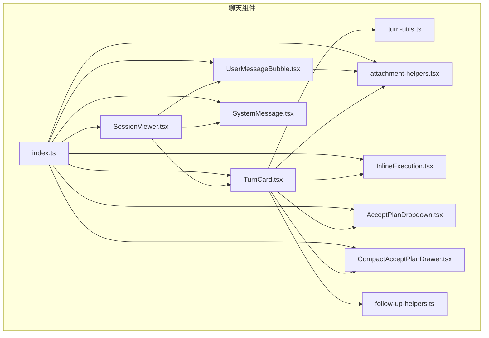
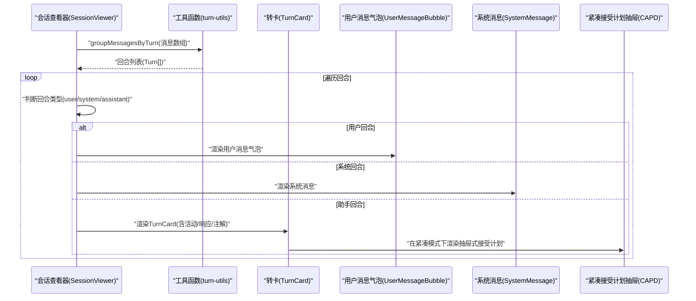
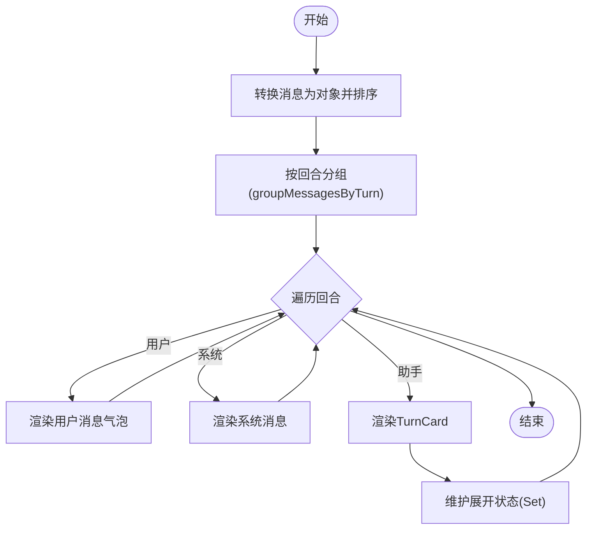
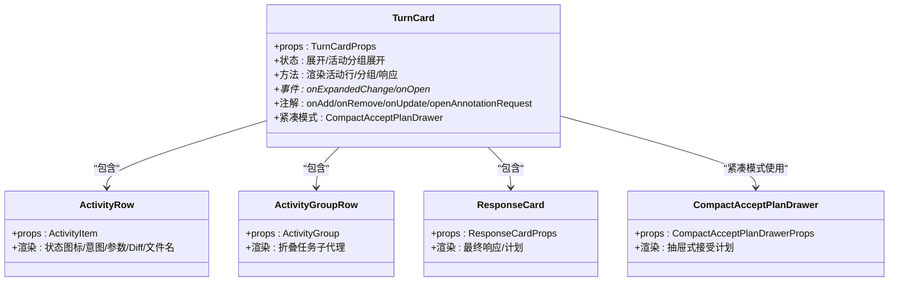
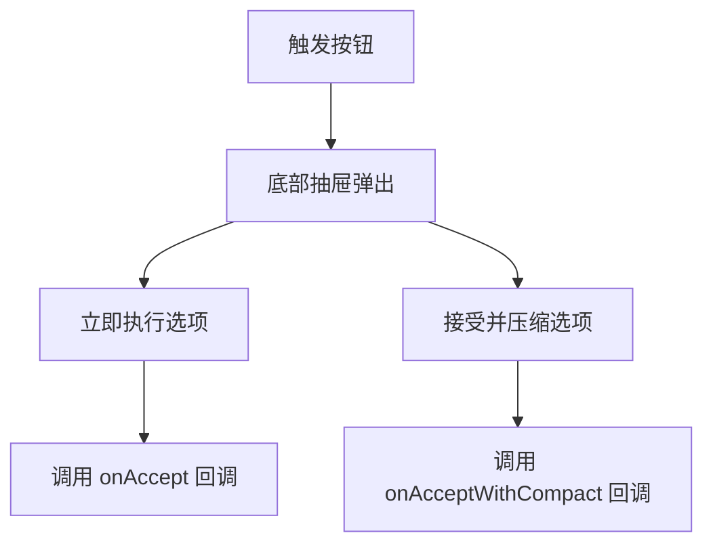
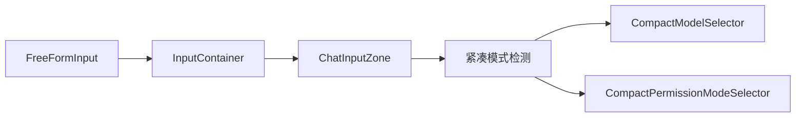
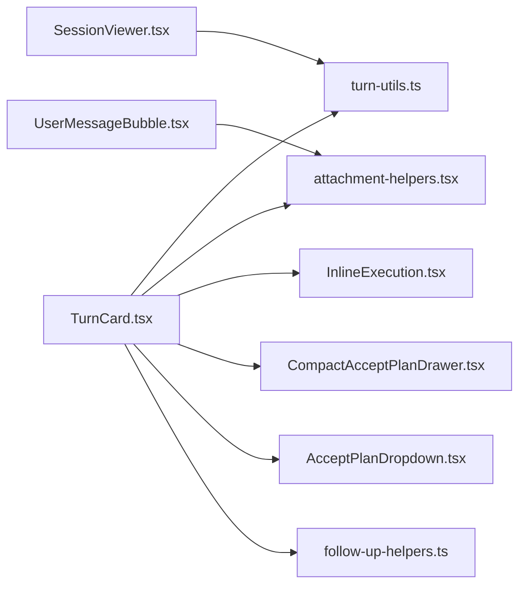

# 聊天组件

<cite>
**本文档引用的文件**
- [SessionViewer.tsx](file://packages/ui/src/components/chat/SessionViewer.tsx)
- [TurnCard.tsx](file://packages/ui/src/components/chat/TurnCard.tsx)
- [UserMessageBubble.tsx](file://packages/ui/src/components/chat/UserMessageBubble.tsx)
- [SystemMessage.tsx](file://packages/ui/src/components/chat/SystemMessage.tsx)
- [attachment-helpers.tsx](file://packages/ui/src/components/chat/attachment-helpers.tsx)
- [InlineExecution.tsx](file://packages/ui/src/components/chat/InlineExecution.tsx)
- [turn-utils.ts](file://packages/ui/src/components/chat/turn-utils.ts)
- [follow-up-helpers.ts](file://packages/ui/src/components/chat/follow-up-helpers.ts)
- [index.ts](file://packages/ui/src/components/chat/index.ts)
- [CompactAcceptPlanDrawer.tsx](file://packages/ui/src/components/chat/CompactAcceptPlanDrawer.tsx)
- [AcceptPlanDropdown.tsx](file://packages/ui/src/components/chat/AcceptPlanDropdown.tsx)
- [FreeFormInput.tsx](file://apps/electron/src/renderer/components/app-shell/input/FreeFormInput.tsx)
- [ChatDisplay.tsx](file://apps/electron/src/renderer/components/app-shell/ChatDisplay.tsx)
- [ChatInputZone.tsx](file://apps/electron/src/renderer/components/app-shell/input/ChatInputZone.tsx)
- [CompactModelSelector.tsx](file://apps/electron/src/renderer/components/app-shell/input/CompactModelSelector.tsx)
- [CompactPermissionModeSelector.tsx](file://apps/electron/src/renderer/components/app-shell/input/CompactPermissionModeSelector.tsx)
- [slash-command-menu.tsx](file://apps/electron/src/renderer/components/ui/slash-command-menu.tsx)
</cite>

## 更新摘要
**所做更改**
- 新增紧凑模式下的聊天输入改进说明
- 添加紧凑接受计划抽屉组件的详细文档
- 更新整体聊天体验优化相关内容
- 扩展紧凑模式下组件交互和布局说明

## 目录
1. [简介](#简介)
2. [项目结构](#项目结构)
3. [核心组件](#核心组件)
4. [架构总览](#架构总览)
5. [组件详解](#组件详解)
6. [紧凑模式优化](#紧凑模式优化)
7. [依赖关系分析](#依赖关系分析)
8. [性能考量](#性能考量)
9. [故障排查指南](#故障排查指南)
10. [结论](#结论)
11. [附录](#附录)

## 简介
本文件为"聊天组件"的详细开发文档，聚焦于会话查看器（SessionViewer）、转卡（TurnCard）、响应卡片（ResponseCard）等核心聊天组件的设计理念与实现方式。文档还涵盖消息气泡、系统消息、文件类型图标等子组件的功能特性；解释组件状态管理、事件处理机制、注解处理系统；并介绍跟随操作（follow-ups）、活动状态图标、内联执行等能力的实现细节。

**更新** 本次更新重点反映了紧凑模式下的聊天输入改进、新增的紧凑接受计划抽屉组件，以及整体聊天体验的优化。这些改进特别针对移动设备和窄屏环境，提供了更加直观和高效的交互体验。

## 项目结构
聊天组件位于 @craft-agent/ui 包的 chat 目录下，采用按功能分层的组织方式：
- 会话查看器：SessionViewer
- 转卡与响应：TurnCard、ResponseCard（在 TurnCard 中实现）
- 用户消息气泡：UserMessageBubble
- 系统消息：SystemMessage
- 文件类型图标与标签：attachment-helpers
- 内联执行：InlineExecution
- 接受计划组件：AcceptPlanDropdown、CompactAcceptPlanDrawer
- 工具函数：turn-utils、follow-up-helpers
- 统一导出：index.ts

**图表来源**
- [SessionViewer.tsx:141-242](file://packages/ui/src/components/chat/SessionViewer.tsx#L141-L242)
- [TurnCard.tsx:1-120](file://packages/ui/src/components/chat/TurnCard.tsx#L1-L120)
- [UserMessageBubble.tsx:1-60](file://packages/ui/src/components/chat/UserMessageBubble.tsx#L1-L60)
- [SystemMessage.tsx:1-40](file://packages/ui/src/components/chat/SystemMessage.tsx#L1-L40)
- [attachment-helpers.tsx:1-40](file://packages/ui/src/components/chat/attachment-helpers.tsx#L1-L40)
- [InlineExecution.tsx:1-40](file://packages/ui/src/components/chat/InlineExecution.tsx#L1-L40)
- [AcceptPlanDropdown.tsx:1-63](file://packages/ui/src/components/chat/AcceptPlanDropdown.tsx#L1-L63)
- [CompactAcceptPlanDrawer.tsx:1-110](file://packages/ui/src/components/chat/CompactAcceptPlanDrawer.tsx#L1-L110)
- [turn-utils.ts:1-40](file://packages/ui/src/components/chat/turn-utils.ts#L1-L40)
- [follow-up-helpers.ts:1-20](file://packages/ui/src/components/chat/follow-up-helpers.ts#L1-L20)
- [index.ts:1-21](file://packages/ui/src/components/chat/index.ts#L1-L21)

**章节来源**
- [index.ts:1-21](file://packages/ui/src/components/chat/index.ts#L1-L21)

## 核心组件
- 会话查看器（SessionViewer）：只读会话转录查看器，负责将消息按回合（turn）分组并渲染为 TurnCard 或用户消息气泡、系统消息。
- 转卡（TurnCard）：展示一次助手回复的完整生命周期，包括工具调用、中间文本、计划、响应内容、注解与交互等。**新增紧凑模式支持**。
- 响应卡片（ResponseCard）：在 TurnCard 内部用于展示最终响应文本，支持计划变体与注解交互。
- 用户消息气泡（UserMessageBubble）：渲染用户输入，支持附件缩略图、内容徽章、编辑请求徽章、文件内联徽章等。
- 系统消息（SystemMessage）：渲染错误、警告、信息、系统提示等非对话类消息。
- 文件类型图标（FileTypeIcon）：根据附件类型与 MIME 显示合适的图标与颜色。
- 内联执行（InlineExecution）：在弹出层中紧凑显示工具执行进度与结果。
- **紧凑接受计划抽屉（CompactAcceptPlanDrawer）**：专为紧凑模式设计的抽屉式接受计划组件，提供移动端友好的交互体验。

**章节来源**
- [SessionViewer.tsx:75-242](file://packages/ui/src/components/chat/SessionViewer.tsx#L75-L242)
- [TurnCard.tsx:290-365](file://packages/ui/src/components/chat/TurnCard.tsx#L290-L365)
- [UserMessageBubble.tsx:305-324](file://packages/ui/src/components/chat/UserMessageBubble.tsx#L305-L324)
- [SystemMessage.tsx:18-25](file://packages/ui/src/components/chat/SystemMessage.tsx#L18-L25)
- [attachment-helpers.tsx:153-173](file://packages/ui/src/components/chat/attachment-helpers.tsx#L153-L173)
- [InlineExecution.tsx:29-46](file://packages/ui/src/components/chat/InlineExecution.tsx#L29-L46)
- [CompactAcceptPlanDrawer.tsx:14-25](file://packages/ui/src/components/chat/CompactAcceptPlanDrawer.tsx#L14-L25)

## 架构总览
会话查看器负责将存储的消息转换为回合（turn），再根据类型渲染为用户消息气泡、系统消息或 TurnCard。TurnCard 内部通过工具函数对消息进行分组与状态推断，并以树形视图展示工具调用与中间文本，同时支持注解、分支、接受计划等高级交互。

**图表来源**
- [SessionViewer.tsx:87-221](file://packages/ui/src/components/chat/SessionViewer.tsx#L87-L221)
- [turn-utils.ts:346-640](file://packages/ui/src/components/chat/turn-utils.ts#L346-L640)
- [TurnCard.tsx:2552-2571](file://packages/ui/src/components/chat/TurnCard.tsx#L2552-L2571)

## 组件详解

### 会话查看器（SessionViewer）
- 职责
  - 将存储的会话消息转换为消息对象并按回合分组。
  - 维护展开状态（turn 展开、活动分组展开）。
  - 根据消息类型渲染用户消息气泡、系统消息或 TurnCard。
  - 提供平台动作回调（打开文件、URL、活动详情、多文件差异等）。
- 关键点
  - 使用渐变遮罩实现顶部/底部柔和滚动遮罩。
  - 支持只读模式与交互模式（通过 annotationInteractionMode 控制注解岛交互）。
  - 默认展开策略由 defaultExpanded 决定。
- 事件与回调
  - onTurnClick、onActivityClick：点击回合或活动时触发。
  - onOpenFile/onOpenUrl/onOpenMarkdownPreview：平台动作。
  - onOpenMultiFileDiff：多文件差异视图。
- 注解交互
  - 通过 annotationInteractionMode 切换 tooltip-only 或交互式注解岛。

**图表来源**
- [SessionViewer.tsx:87-221](file://packages/ui/src/components/chat/SessionViewer.tsx#L87-L221)
- [turn-utils.ts:346-640](file://packages/ui/src/components/chat/turn-utils.ts#L346-L640)

**章节来源**
- [SessionViewer.tsx:28-86](file://packages/ui/src/components/chat/SessionViewer.tsx#L28-L86)
- [SessionViewer.tsx:93-139](file://packages/ui/src/components/chat/SessionViewer.tsx#L93-L139)
- [SessionViewer.tsx:151-221](file://packages/ui/src/components/chat/SessionViewer.tsx#L151-L221)

### 转卡（TurnCard）
- 职责
  - 展示一次助手回复的完整生命周期：工具调用、中间文本、计划、最终响应。
  - 支持活动分组（Task 子代理）、背景任务、Diff 统计、文件名徽章、错误提示等。
  - 提供注解交互（添加/移除/更新注解）、分支会话、接受计划等能力。
  - **新增紧凑模式支持**：在紧凑模式下使用 CompactAcceptPlanDrawer 替代 AcceptPlanDropdown。
- 关键设计
  - 活动行（ActivityRow）：区分中间文本、状态活动、工具调用，显示状态图标、意图/描述、参数摘要、Diff 统计、文件名徽章、错误徽章。
  - 活动分组（ActivityGroupRow）：可折叠的任务子代理，显示持续时间与令牌统计。
  - 响应卡片（ResponseCardProps）：最终响应文本，支持计划变体、注解交互、分支、接受计划。
  - 缓冲策略（shouldShowContent）：避免过早显示短内容，提升阅读体验。
  - 工具显示（formatToolDisplay）：优先使用嵌入的工具显示元数据（名称、图标、描述），兼容 MCP/Skill/Bash 等。
  - 路径清理（stripSessionFolderPath）：从文件路径中去除工作区/会话前缀，提升可读性。
  - **紧凑模式接受计划**：在紧凑模式下使用 CompactAcceptPlanDrawer 提供抽屉式交互。
- 事件与回调
  - onExpandedChange：控制 TurnCard 展开/收起。
  - onOpenFile/onOpenUrl/onPopOut/onOpenDetails/onOpenActivityDetails：平台与详情动作。
  - onOpenMultiFileDiff：多文件差异视图。
  - onAcceptPlan/onAcceptPlanWithCompact：接受计划（含压缩）。
  - onBranch：从该响应分支会话。
  - 注解相关：onAddAnnotation/onRemoveAnnotation/onUpdateAnnotation/openAnnotationRequest。
- 注解处理
  - 支持注解选择、预览、高亮、索引徽章、注解岛菜单等。
  - 可通过 annotationInteractionMode 控制交互强度（tooltip-only 用于只读查看器）。

**图表来源**
- [TurnCard.tsx:290-365](file://packages/ui/src/components/chat/TurnCard.tsx#L290-L365)
- [TurnCard.tsx:894-1198](file://packages/ui/src/components/chat/TurnCard.tsx#L894-L1198)
- [TurnCard.tsx:1224-1373](file://packages/ui/src/components/chat/TurnCard.tsx#L1224-L1373)
- [TurnCard.tsx:1379-1428](file://packages/ui/src/components/chat/TurnCard.tsx#L1379-L1428)
- [CompactAcceptPlanDrawer.tsx:14-25](file://packages/ui/src/components/chat/CompactAcceptPlanDrawer.tsx#L14-L25)

**章节来源**
- [TurnCard.tsx:217-263](file://packages/ui/src/components/chat/TurnCard.tsx#L217-L263)
- [TurnCard.tsx:447-504](file://packages/ui/src/components/chat/TurnCard.tsx#L447-L504)
- [TurnCard.tsx:521-703](file://packages/ui/src/components/chat/TurnCard.tsx#L521-L703)
- [TurnCard.tsx:894-1198](file://packages/ui/src/components/chat/TurnCard.tsx#L894-L1198)
- [TurnCard.tsx:1224-1373](file://packages/ui/src/components/chat/TurnCard.tsx#L1224-L1373)
- [TurnCard.tsx:1379-1428](file://packages/ui/src/components/chat/TurnCard.tsx#L1379-L1428)
- [TurnCard.tsx:2552-2571](file://packages/ui/src/components/chat/TurnCard.tsx#L2552-L2571)

### 响应卡片（ResponseCard）
- 职责
  - 在 TurnCard 内渲染最终响应文本，支持计划变体。
  - 提供注解交互入口（添加/移除/更新注解）。
  - 支持分支会话、接受计划（含压缩）。
- 关键点
  - 文本流式渲染与缓冲策略（与 TurnCard 共享）。
  - 计划变体：显示接受计划按钮（仅在最后响应且允许时）。
  - 注解交互：tooltip-only 或交互式注解岛。

**章节来源**
- [TurnCard.tsx:1379-1428](file://packages/ui/src/components/chat/TurnCard.tsx#L1379-L1428)

### 用户消息气泡（UserMessageBubble）
- 职责
  - 渲染用户消息文本与附件，支持 Markdown、链接、代码块。
  - 渲染内容徽章（技能、来源、上下文、命令、文件夹、文件）。
  - 处理"排队"状态的最小可见时长，确保用户感知。
  - 支持编辑请求徽章（隐藏对应内容范围）。
- 关键点
  - 图标与标签：FileTypeIcon 与 getFileTypeLabel。
  - 文件内联徽章：带 Tooltip 的可点击文件徽章。
  - 编辑请求内容剥离：在显示文本中移除 edit_request 标记的内容范围。

**章节来源**
- [UserMessageBubble.tsx:305-324](file://packages/ui/src/components/chat/UserMessageBubble.tsx#L305-L324)
- [UserMessageBubble.tsx:414-471](file://packages/ui/src/components/chat/UserMessageBubble.tsx#L414-L471)
- [UserMessageBubble.tsx:487-518](file://packages/ui/src/components/chat/UserMessageBubble.tsx#L487-L518)
- [attachment-helpers.tsx:153-173](file://packages/ui/src/components/chat/attachment-helpers.tsx#L153-L173)

### 系统消息（SystemMessage）
- 职责
  - 渲染错误、警告、信息、系统提示等非对话类消息。
  - 不同类型使用不同视觉风格（阴影着色、边框背景等）。
- 关键点
  - 类型映射：error/warning/info/system 对应不同样式。
  - Markdown 渲染最小化模式。

**章节来源**
- [SystemMessage.tsx:18-25](file://packages/ui/src/components/chat/SystemMessage.tsx#L18-L25)
- [SystemMessage.tsx:29-57](file://packages/ui/src/components/chat/SystemMessage.tsx#L29-L57)
- [SystemMessage.tsx:62-84](file://packages/ui/src/components/chat/SystemMessage.tsx#L62-L84)

### 文件类型图标（FileTypeIcon）
- 职责
  - 根据附件类型与 MIME 显示合适的图标（图片专用图标，其他文件通用文件图标）。
  - 代码文件使用成功色，其他类型按类型分配颜色。
- 关键点
  - MIME 映射与扩展名识别。
  - 颜色分类：pdf 使用破坏色，office 使用强调色，text 使用次级色。

**章节来源**
- [attachment-helpers.tsx:13-35](file://packages/ui/src/components/chat/attachment-helpers.tsx#L13-L35)
- [attachment-helpers.tsx:153-173](file://packages/ui/src/components/chat/attachment-helpers.tsx#L153-L173)
- [attachment-helpers.tsx:175-191](file://packages/ui/src/components/chat/attachment-helpers.tsx#L175-L191)
- [attachment-helpers.tsx:193-209](file://packages/ui/src/components/chat/attachment-helpers.tsx#L193-L209)

### 内联执行（InlineExecution）
- 职责
  - 在弹出层中紧凑显示工具执行进度，支持取消、重试、关闭。
  - 仅显示最近若干活动，便于快速概览。
- 关键点
  - 状态机：executing/success/error。
  - 活动行：名称、描述、状态图标。

**章节来源**
- [InlineExecution.tsx:20-46](file://packages/ui/src/components/chat/InlineExecution.tsx#L20-L46)
- [InlineExecution.tsx:52-70](file://packages/ui/src/components/chat/InlineExecution.tsx#L52-L70)
- [InlineExecution.tsx:76-124](file://packages/ui/src/components/chat/InlineExecution.tsx#L76-L124)

### 注解处理系统
- 职责
  - 支持注解选择、预览、高亮、索引徽章、注解岛菜单。
  - 支持外部请求打开特定注解。
  - 只读查看器使用 tooltip-only 模式抑制注解岛。
- 关键点
  - 选择范围解析：text-quote 与 text-position。
  - 高亮与徽章：applyTextHighlightRange/createAnnotationIndexBadge。
  - Follow-up 文本提取：extractAnnotationSelectedText。

**章节来源**
- [TurnCard.tsx:1430-1470](file://packages/ui/src/components/chat/TurnCard.tsx#L1430-L1470)
- [TurnCard.tsx:1474-1599](file://packages/ui/src/components/chat/TurnCard.tsx#L1474-L1599)
- [follow-up-helpers.ts:12-30](file://packages/ui/src/components/chat/follow-up-helpers.ts#L12-L30)

### 紧凑接受计划抽屉（CompactAcceptPlanDrawer）
- 职责
  - 专为紧凑模式设计的抽屉式接受计划组件，替代桌面端的 AcceptPlanDropdown。
  - 提供移动端友好的全屏抽屉交互，两个主要选项作为完整的触摸目标。
- 关键设计
  - 基于 vaul 抽屉系统，使用底部弹出式抽屉。
  - 触发按钮采用纤细设计，包含接受计划标签和向下箭头。
  - 抽屉内容包含两个选项：立即执行和接受并压缩。
  - 与 CompactPermissionModeSelector 和 CompactModelSelector 保持一致的 UX 形状。
- 事件与回调
  - onAccept：用户选择"接受"（立即执行）时触发。
  - onAcceptWithCompact：用户选择"接受并压缩"（先压缩后执行）时触发。
- 国际化支持
  - 使用 t('plan.acceptPlan')、t('plan.accept')、t('plan.executeImmediately')、t('plan.acceptAndCompact')、t('plan.worksForComplex') 等翻译键。

**图表来源**
- [CompactAcceptPlanDrawer.tsx:54-109](file://packages/ui/src/components/chat/CompactAcceptPlanDrawer.tsx#L54-L109)

**章节来源**
- [CompactAcceptPlanDrawer.tsx:14-25](file://packages/ui/src/components/chat/CompactAcceptPlanDrawer.tsx#L14-L25)
- [CompactAcceptPlanDrawer.tsx:27-38](file://packages/ui/src/components/chat/CompactAcceptPlanDrawer.tsx#L27-L38)
- [CompactAcceptPlanDrawer.tsx:40-110](file://packages/ui/src/components/chat/CompactAcceptPlanDrawer.tsx#L40-L110)

## 紧凑模式优化

### 紧凑模式概述
紧凑模式是专门为移动设备和窄屏环境设计的聊天界面优化方案，通过重新设计组件布局和交互方式，提供更加直观和高效的用户体验。

### 紧凑模式组件改进

#### 聊天输入改进
- **FreeFormInput 优化**：在紧凑模式下提供专门的输入体验，包括折叠状态管理和自动展开机制。
- **ChatInputZone 适配**：调整输入区域的间距和布局，适应移动设备屏幕尺寸。
- **模型选择器集成**：提供紧凑版的模型选择器（CompactModelSelector）和权限模式选择器（CompactPermissionModeSelector）。

#### 接受计划交互优化
- **抽屉式设计**：使用 CompactAcceptPlanDrawer 替代传统的下拉菜单，提供更好的移动端触摸体验。
- **全屏抽屉**：采用底部弹出式抽屉，两个主要选项作为完整的触摸目标，减少误触风险。
- **一致性 UX**：与 CompactPermissionModeSelector 和 CompactModelSelector 保持相同的 UX 设计语言。

#### 聊天显示优化
- **ChatDisplay 紧凑模式支持**：在 ChatDisplay 中实现紧凑模式的动画和过渡效果。
- **响应式布局**：根据屏幕宽度动态调整组件间距和元素大小。
- **性能优化**：在紧凑模式下减少不必要的动画和过渡，提升流畅度。

### 紧凑模式实现细节

#### 输入容器集成

**图表来源**
- [FreeFormInput.tsx:266-289](file://apps/electron/src/renderer/components/app-shell/input/FreeFormInput.tsx#L266-L289)
- [ChatInputZone.tsx:35-80](file://apps/electron/src/renderer/components/app-shell/input/ChatInputZone.tsx#L35-L80)

#### 聊天显示响应式
- **动画同步**：在紧凑模式下使用 `AnimatePresence mode="sync"` 确保动画同步。
- **过渡优化**：紧凑模式下过渡时间为 0，提供即时响应。
- **布局调整**：根据紧凑模式调整消息间距和内边距。

**章节来源**
- [FreeFormInput.tsx:242-289](file://apps/electron/src/renderer/components/app-shell/input/FreeFormInput.tsx#L242-L289)
- [ChatInputZone.tsx:50-78](file://apps/electron/src/renderer/components/app-shell/input/ChatInputZone.tsx#L50-L78)
- [ChatDisplay.tsx:1495-1526](file://apps/electron/src/renderer/components/app-shell/ChatDisplay.tsx#L1495-L1526)
- [ChatDisplay.tsx:1555-1577](file://apps/electron/src/renderer/components/app-shell/ChatDisplay.tsx#L1555-L1577)

### 紧凑模式下的上下文管理
- **上下文使用警告徽章**：当接近自动压缩阈值时显示警告，提醒用户进行上下文压缩。
- **紧凑命令菜单**：提供专门的紧凑上下文命令，支持快速压缩对话历史。
- **模型选择器状态**：在紧凑模式下显示上下文状态信息，帮助用户理解当前使用情况。

**章节来源**
- [FreeFormInput.tsx:2382-2401](file://apps/electron/src/renderer/components/app-shell/input/FreeFormInput.tsx#L2382-L2401)
- [slash-command-menu.tsx:93-103](file://apps/electron/src/renderer/components/ui/slash-command-menu.tsx#L93-L103)
- [CompactModelSelector.tsx:56-73](file://apps/electron/src/renderer/components/app-shell/input/CompactModelSelector.tsx#L56-L73)

## 依赖关系分析
- SessionViewer 依赖 turn-utils 进行消息分组与回合标识生成。
- TurnCard 依赖 turn-utils 进行回合阶段推断、活动深度计算、工具显示格式化、Diff 统计等。
- UserMessageBubble 依赖 attachment-helpers 进行文件图标与标签渲染。
- TurnCard 与 InlineExecution 共享 SIZE_CONFIG 与 ActivityStatusIcon。
- Follow-up 辅助模块提供注解选中文本提取。
- **新增依赖**：TurnCard 依赖 CompactAcceptPlanDrawer 在紧凑模式下提供接受计划交互。

**图表来源**
- [SessionViewer.tsx:19-24](file://packages/ui/src/components/chat/SessionViewer.tsx#L19-L24)
- [TurnCard.tsx:40-45](file://packages/ui/src/components/chat/TurnCard.tsx#L40-L45)
- [UserMessageBubble.tsx:18-21](file://packages/ui/src/components/chat/UserMessageBubble.tsx#L18-L21)
- [InlineExecution.tsx:12-14](file://packages/ui/src/components/chat/InlineExecution.tsx#L12-L14)
- [follow-up-helpers.ts:1-10](file://packages/ui/src/components/chat/follow-up-helpers.ts#L1-L10)
- [TurnCard.tsx:84-85](file://packages/ui/src/components/chat/TurnCard.tsx#L84-L85)

**章节来源**
- [turn-utils.ts:1-17](file://packages/ui/src/components/chat/turn-utils.ts#L1-L17)
- [TurnCard.tsx:1-40](file://packages/ui/src/components/chat/TurnCard.tsx#L1-L40)

## 性能考量
- 流式渲染与缓冲
  - 响应文本采用缓冲策略，避免过早显示短内容，减少不必要的重排与闪烁。
  - 内容节流（CONTENT_THROTTLE_MS）优化流式更新性能。
- 视觉层次与动画
  - 使用 AnimatePresence 与 motion 实现状态切换与展开/折叠动画，注意控制动画数量与延迟。
  - **紧凑模式优化**：在紧凑模式下禁用动画，提供即时响应。
- DOM 操作
  - 注解高亮与标记涉及 DOM 分割与替换，建议限制高亮范围与批量更新。
- 活动列表
  - 通过最大可见项（maxVisibleActivities）与分组折叠控制渲染量，避免超长列表导致的性能问题。
- **紧凑模式性能**：抽屉式交互相比下拉菜单具有更好的性能表现，特别是在移动设备上。

## 故障排查指南
- 响应未显示
  - 检查 isStreaming 与缓冲决策（shouldShowContent），确认是否处于缓冲状态。
  - 查看 TURN 阶段（deriveTurnPhase）是否为 pending/awaiting/streaming 且 isBuffering。
- 工具调用未正确显示
  - 确认工具状态映射（getToolStatus）与消息字段（toolStatus/toolResult）。
  - 检查工具显示格式化（formatToolDisplay）与嵌入元数据（toolDisplayMeta）。
- 注解无法交互
  - 确认 annotationInteractionMode 设置（tooltip-only 仅显示提示）。
  - 检查注解选择器（text-quote/text-position）与内容边界。
- 文件路径显示不清晰
  - 使用 stripSessionFolderPath 去除工作区/会话前缀。
- 多文件差异视图不可用
  - 确认 hasEditOrWriteActivities 与 onOpenMultiFileDiff 回调已设置。
- **紧凑模式问题**
  - 检查 compactMode 属性是否正确传递给相关组件。
  - 确认 CompactAcceptPlanDrawer 是否在紧凑模式下正确渲染。
  - 验证抽屉式接受计划的回调函数是否正常触发。

**章节来源**
- [turn-utils.ts:142-189](file://packages/ui/src/components/chat/turn-utils.ts#L142-L189)
- [turn-utils.ts:195-209](file://packages/ui/src/components/chat/turn-utils.ts#L195-L209)
- [TurnCard.tsx:521-703](file://packages/ui/src/components/chat/TurnCard.tsx#L521-L703)
- [TurnCard.tsx:542-560](file://packages/ui/src/components/chat/TurnCard.tsx#L542-L560)
- [TurnCard.tsx:1029-1077](file://packages/ui/src/components/chat/TurnCard.tsx#L1029-L1077)
- [TurnCard.tsx:2552-2571](file://packages/ui/src/components/chat/TurnCard.tsx#L2552-L2571)

## 结论
本聊天组件体系以回合（turn）为核心，围绕 TurnCard 构建了从工具调用到最终响应的完整生命周期展示，并通过注解系统、文件类型图标、内联执行等能力提升了可读性与交互性。SessionViewer 作为只读查看器，承担了消息分组与渲染职责；UserMessageBubble 与 SystemMessage 则分别处理用户输入与系统提示。

**更新** 本次更新显著增强了紧凑模式下的用户体验，通过 CompactAcceptPlanDrawer 提供了移动端友好的接受计划交互，配合优化的聊天输入组件和响应式布局，使得在移动设备上也能获得流畅高效的聊天体验。这些改进体现了现代聊天界面设计向移动端优化的趋势，为不同设备和屏幕尺寸提供了最佳的用户体验。

## 附录

### 组件属性配置与使用指南
- 会话查看器（SessionViewer）
  - props
    - session：StoredSession
    - mode：'readonly' | 'interactive'
    - platformActions：平台动作回调（onOpenFile/onOpenUrl/onOpenActivityDetails 等）
    - defaultExpanded：默认展开所有助手回合
    - header/footer：自定义头部与底部
    - sessionFolderPath：用于清理文件路径前缀
  - 事件
    - onTurnClick/onActivityClick：点击回合或活动
- 转卡（TurnCard）
  - props
    - turnId/activities/response/intent/isStreaming/isComplete
    - isExpanded/onExpandedChange：受控展开
    - expandedActivityGroups/onExpandedActivityGroupsChange：活动分组展开
    - onOpenFile/onOpenUrl/onPopOut/onOpenDetails/onOpenActivityDetails/onOpenMultiFileDiff
    - hasEditOrWriteActivities：是否包含 Edit/Write 活动
    - todos：TodoWrite 任务列表
    - displayMode：'informative' | 'detailed'
    - compactMode：是否启用紧凑模式
    - animateResponse/showAcceptPlan/isLastResponse
    - onAcceptPlan/onAcceptPlanWithCompact/onBranch/onAddAnnotation/onRemoveAnnotation/onUpdateAnnotation
    - openAnnotationRequest/annotationInteractionMode
- 响应卡片（ResponseCard）
  - props
    - text/isStreaming/streamStartTime
    - onOpenFile/onOpenUrl/onPopOut
    - variant：'response' | 'plan'
    - messageId/annotations
    - onAccept/onAcceptWithCompact/isLastResponse/showAcceptPlan
    - compactMode/onBranch/onAddAnnotation/onRemoveAnnotation/onUpdateAnnotation
    - sendMessageKey/onSaveAndSendFollowUp/hasActiveFollowUpAnnotations/openAnnotationRequest/annotationInteractionMode
- 用户消息气泡（UserMessageBubble）
  - props
    - content/badges/attachments
    - onUrlClick/onFileClick
    - isQueued/compactMode
- 系统消息（SystemMessage）
  - props
    - content/type：'error' | 'warning' | 'info' | 'system'
- 文件类型图标（FileTypeIcon）
  - props
    - type/mimeType/className
- 内联执行（InlineExecution）
  - props
    - status：'executing' | 'success' | 'error'
    - activities：InlineActivityItem[]
    - result/error
    - onCancel/onDismiss/onRetry
    - className
- **紧凑接受计划抽屉（CompactAcceptPlanDrawer）**
  - props
    - onAccept：立即执行回调
    - onAcceptWithCompact：接受并压缩回调
    - acceptLabel：触发按钮标签
    - acceptOptionLabel：主要选项标签
    - className：额外的 CSS 类名

### 紧凑模式组件属性
- **紧凑模型选择器（CompactModelSelector）**
  - currentModel：当前模型
  - currentConnection：当前连接
  - onModelChange：模型变更回调
  - onConnectionChange：连接变更回调
  - thinkingLevel：思考级别
  - onThinkingLevelChange：思考级别变更回调
  - contextStatus：上下文状态（isCompacting/inputTokens/contextWindow）
- **紧凑权限模式选择器（CompactPermissionModeSelector）**
  - currentMode：当前权限模式
  - onChange：模式变更回调
  - isEmptySession：会话是否为空
  - connectionUnavailable：连接是否不可用
- **聊天输入区域（ChatInputZone）**
  - compactMode：紧凑模式标志
  - showOptionBadges：是否显示选项徽章
  - sessionId：会话ID
  - sessionLabels：会话标签
  - labels：可用标签
  - onLabelsChange：标签变更回调

**章节来源**
- [SessionViewer.tsx:28-49](file://packages/ui/src/components/chat/SessionViewer.tsx#L28-L49)
- [TurnCard.tsx:290-365](file://packages/ui/src/components/chat/TurnCard.tsx#L290-L365)
- [TurnCard.tsx:1379-1428](file://packages/ui/src/components/chat/TurnCard.tsx#L1379-L1428)
- [UserMessageBubble.tsx:305-324](file://packages/ui/src/components/chat/UserMessageBubble.tsx#L305-L324)
- [SystemMessage.tsx:18-25](file://packages/ui/src/components/chat/SystemMessage.tsx#L18-L25)
- [attachment-helpers.tsx:153-173](file://packages/ui/src/components/chat/attachment-helpers.tsx#L153-L173)
- [InlineExecution.tsx:29-46](file://packages/ui/src/components/chat/InlineExecution.tsx#L29-L46)
- [CompactAcceptPlanDrawer.tsx:27-38](file://packages/ui/src/components/chat/CompactAcceptPlanDrawer.tsx#L27-L38)
- [CompactModelSelector.tsx:47-73](file://apps/electron/src/renderer/components/app-shell/input/CompactModelSelector.tsx#L47-L73)
- [ChatInputZone.tsx:12-50](file://apps/electron/src/renderer/components/app-shell/input/ChatInputZone.tsx#L12-L50)