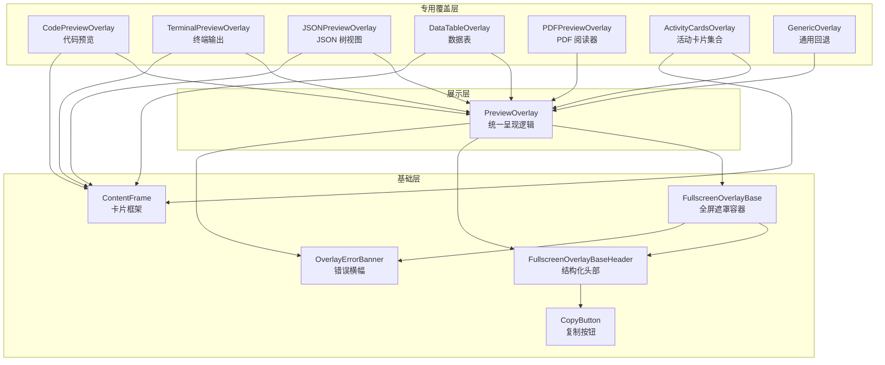
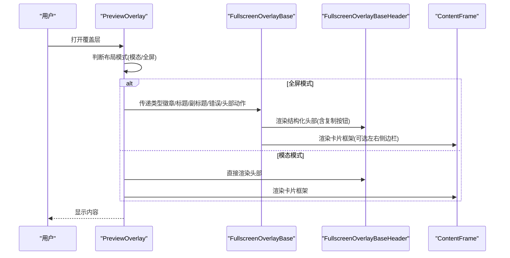
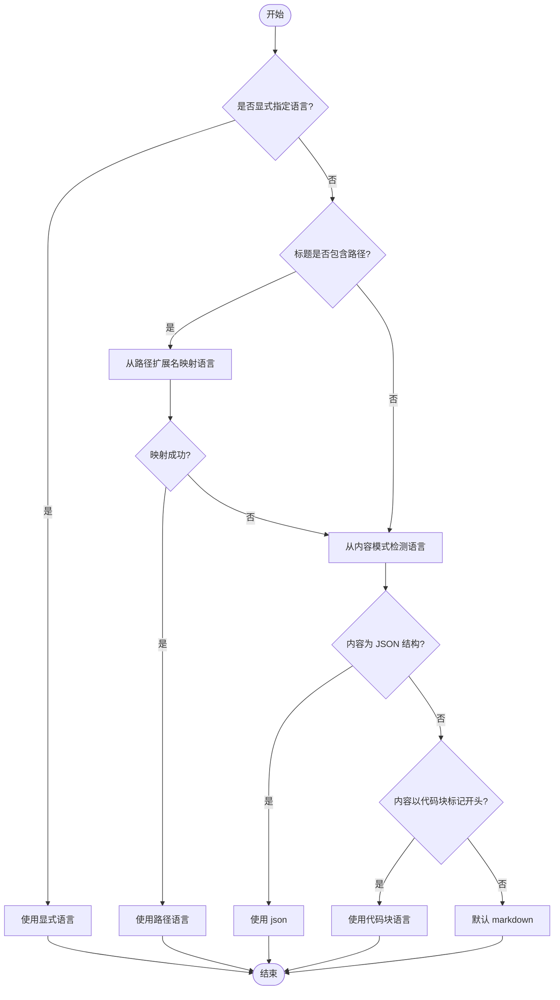

# 覆盖层组件

<cite>
**本文引用的文件**
- [FullscreenOverlayBase.tsx](file://packages/ui/src/components/overlay/FullscreenOverlayBase.tsx)
- [FullscreenOverlayBaseHeader.tsx](file://packages/ui/src/components/overlay/FullscreenOverlayBaseHeader.tsx)
- [ContentFrame.tsx](file://packages/ui/src/components/overlay/ContentFrame.tsx)
- [CopyButton.tsx](file://packages/ui/src/components/overlay/CopyButton.tsx)
- [PreviewOverlay.tsx](file://packages/ui/src/components/overlay/PreviewOverlay.tsx)
- [CodePreviewOverlay.tsx](file://packages/ui/src/components/overlay/CodePreviewOverlay.tsx)
- [TerminalPreviewOverlay.tsx](file://packages/ui/src/components/overlay/TerminalPreviewOverlay.tsx)
- [JSONPreviewOverlay.tsx](file://packages/ui/src/components/overlay/JSONPreviewOverlay.tsx)
- [DataTableOverlay.tsx](file://packages/ui/src/components/overlay/DataTableOverlay.tsx)
- [PDFPreviewOverlay.tsx](file://packages/ui/src/components/overlay/PDFPreviewOverlay.tsx)
- [ActivityCardsOverlay.tsx](file://packages/ui/src/components/overlay/ActivityCardsOverlay.tsx)
- [GenericOverlay.tsx](file://packages/ui/src/components/overlay/GenericOverlay.tsx)
- [OverlayErrorBanner.tsx](file://packages/ui/src/components/overlay/OverlayErrorBanner.tsx)
- [App.tsx](file://apps/electron/src/renderer/App.tsx)
</cite>

## 目录
1. [简介](#简介)
2. [项目结构](#项目结构)
3. [核心组件](#核心组件)
4. [架构总览](#架构总览)
5. [组件详解](#组件详解)
6. [依赖关系分析](#依赖关系分析)
7. [性能与可用性](#性能与可用性)
8. [故障排查](#故障排查)
9. [结论](#结论)
10. [附录](#附录)

## 简介
本文件为“覆盖层组件”的系统化开发文档，聚焦于全屏覆盖层基础组件（FullscreenOverlayBase）及其衍生的专用覆盖层（代码预览、终端预览、JSON 预览、数据表预览、PDF 预览、活动卡片覆盖层等），并解释覆盖层类型徽章、内容帧、活动卡片覆盖层的实现原理。文档同时涵盖文件类型检测、语言识别、预览数据提取的处理机制，并提供覆盖层配置、样式定制、数据绑定的使用指南，帮助前端开发者快速实现文件预览与内容展示。

## 项目结构
覆盖层相关代码集中于 packages/ui 的 overlay 目录，采用“基础组件 + 专用覆盖层”的分层设计：
- 基础层：FullscreenOverlayBase、FullscreenOverlayBaseHeader、ContentFrame、OverlayErrorBanner、CopyButton
- 展示层：PreviewOverlay（统一响应式布局与模式切换）
- 专用覆盖层：CodePreviewOverlay、TerminalPreviewOverlay、JSONPreviewOverlay、DataTableOverlay、PDFPreviewOverlay、ActivityCardsOverlay、GenericOverlay



图表来源
- [FullscreenOverlayBase.tsx:1-211](file://packages/ui/src/components/overlay/FullscreenOverlayBase.tsx#L1-L211)
- [FullscreenOverlayBaseHeader.tsx:1-257](file://packages/ui/src/components/overlay/FullscreenOverlayBaseHeader.tsx#L1-L257)
- [ContentFrame.tsx:1-116](file://packages/ui/src/components/overlay/ContentFrame.tsx#L1-L116)
- [OverlayErrorBanner.tsx:1-34](file://packages/ui/src/components/overlay/OverlayErrorBanner.tsx#L1-L34)
- [CopyButton.tsx:1-57](file://packages/ui/src/components/overlay/CopyButton.tsx#L1-L57)
- [PreviewOverlay.tsx:1-211](file://packages/ui/src/components/overlay/PreviewOverlay.tsx#L1-L211)
- [CodePreviewOverlay.tsx:1-112](file://packages/ui/src/components/overlay/CodePreviewOverlay.tsx#L1-L112)
- [TerminalPreviewOverlay.tsx:1-97](file://packages/ui/src/components/overlay/TerminalPreviewOverlay.tsx#L1-L97)
- [JSONPreviewOverlay.tsx:1-178](file://packages/ui/src/components/overlay/JSONPreviewOverlay.tsx#L1-L178)
- [DataTableOverlay.tsx:1-64](file://packages/ui/src/components/overlay/DataTableOverlay.tsx#L1-L64)
- [PDFPreviewOverlay.tsx:1-165](file://packages/ui/src/components/overlay/PDFPreviewOverlay.tsx#L1-L165)
- [ActivityCardsOverlay.tsx:1-200](file://packages/ui/src/components/overlay/ActivityCardsOverlay.tsx#L1-L200)
- [GenericOverlay.tsx:1-186](file://packages/ui/src/components/overlay/GenericOverlay.tsx#L1-L186)

章节来源
- [FullscreenOverlayBase.tsx:1-211](file://packages/ui/src/components/overlay/FullscreenOverlayBase.tsx#L1-L211)
- [PreviewOverlay.tsx:1-211](file://packages/ui/src/components/overlay/PreviewOverlay.tsx#L1-L211)

## 核心组件
- 全屏遮罩容器（FullscreenOverlayBase）
  - 使用 Radix Dialog 提供焦点管理、ESC 处理、可访问性角色与模态协调
  - 自动隐藏 macOS traffic lights，恢复时再显示
  - 提供结构化头部（类型徽章、文件路径、标题、副标题、右侧操作）、内置复制按钮
  - 全视口滚动区域，顶部/底部渐隐遮罩，浮动头部覆盖滚动内容
- 结构化头部（FullscreenOverlayBaseHeader）
  - 组合类型徽章、文件路径徽章（双触发菜单：左键下拉 + 右键上下文菜单）、标题徽章、副标题徽章、右侧操作区（含内置复制）
  - 文件路径徽章通过 PlatformContext 提供“打开/在资源管理器中定位”
- 卡片框架（ContentFrame）
  - 提供“应用窗口”外观：圆角背景、居中标题栏、可选左右侧边栏
  - 支持两种宽度模式：默认最大宽度约束；fitContent 模式按内容宽度自适应（适合宽表格/差异视图）
  - 内容自然增长，父级滚动容器负责整体滚动（“纸张滚动”）
- 错误横幅（OverlayErrorBanner）
  - 统一的破坏色背景与阴影样式，居中对齐，最大宽度与卡片一致
- 复制按钮（CopyButton）
  - 点击复制到剪贴板，短暂反馈（复制成功提示）

章节来源
- [FullscreenOverlayBase.tsx:1-211](file://packages/ui/src/components/overlay/FullscreenOverlayBase.tsx#L1-L211)
- [FullscreenOverlayBaseHeader.tsx:1-257](file://packages/ui/src/components/overlay/FullscreenOverlayBaseHeader.tsx#L1-L257)
- [ContentFrame.tsx:1-116](file://packages/ui/src/components/overlay/ContentFrame.tsx#L1-L116)
- [OverlayErrorBanner.tsx:1-34](file://packages/ui/src/components/overlay/OverlayErrorBanner.tsx#L1-L34)
- [CopyButton.tsx:1-57](file://packages/ui/src/components/overlay/CopyButton.tsx#L1-L57)

## 架构总览
覆盖层体系以“基础容器 + 统一呈现 + 专用视图”三层组织，确保一致性与扩展性：
- 基础容器：FullscreenOverlayBase 负责全屏遮罩、滚动与渐隐遮罩、头部渲染与复制按钮
- 统一呈现：PreviewOverlay 负责响应式布局（模态 vs 全屏）、错误横幅、头部渲染（模态时直接渲染，全屏时委托基础容器）
- 专用视图：各覆盖层基于 ContentFrame 或直接渲染子内容，注入类型徽章、标题、副标题、错误状态与主题



图表来源
- [PreviewOverlay.tsx:76-211](file://packages/ui/src/components/overlay/PreviewOverlay.tsx#L76-L211)
- [FullscreenOverlayBase.tsx:94-211](file://packages/ui/src/components/overlay/FullscreenOverlayBase.tsx#L94-L211)
- [FullscreenOverlayBaseHeader.tsx:195-257](file://packages/ui/src/components/overlay/FullscreenOverlayBaseHeader.tsx#L195-L257)
- [ContentFrame.tsx:60-116](file://packages/ui/src/components/overlay/ContentFrame.tsx#L60-L116)

## 组件详解

### 全屏覆盖层基础组件（FullscreenOverlayBase）
- 关键能力
  - Radix Dialog 集成：焦点管理、ESC 处理、无障碍属性
  - 平台适配：macOS traffic lights 隐藏/恢复
  - 视觉与交互：全视口滚动、顶部/底部渐隐遮罩、浮动头部覆盖滚动内容
  - 结构化头部：类型徽章、文件路径徽章、标题徽章、副标题徽章、右侧操作（含内置复制）
- 布局要点
  - Dialog.Content 固定全视口，相对定位
  - 渐隐遮罩覆盖整个内容区域，提供边缘柔和过渡
  - 浮动头部位于视口顶部，始终覆盖滚动内容
  - 内容区根据是否存在头部设置顶部内边距，保证不被头部遮挡

章节来源
- [FullscreenOverlayBase.tsx:1-211](file://packages/ui/src/components/overlay/FullscreenOverlayBase.tsx#L1-L211)

### 结构化头部（FullscreenOverlayBaseHeader）
- 类型徽章 OverlayTypeBadge：图标 + 文本 + 变体（颜色）
- 文件路径徽章 FilePathBadge：支持双触发菜单（左键下拉 + 右键上下文菜单），调用 PlatformContext 的外部打开与资源管理器定位
- 标题徽章与副标题徽章：可点击标题徽章回调
- 右侧操作：内置复制按钮 + 自定义操作

章节来源
- [FullscreenOverlayBaseHeader.tsx:1-257](file://packages/ui/src/components/overlay/FullscreenOverlayBaseHeader.tsx#L1-L257)

### 卡片框架（ContentFrame）
- 容器特性：卡片圆角、阴影、背景模糊；标题栏居中显示；可选左右侧边栏绝对定位
- 宽度模式：默认最大宽度约束；fitContent 模式按内容宽度自适应，适合宽表格/差异视图
- 滚动策略：卡片内部不滚动，父级滚动容器进行整体滚动（“纸张滚动”）

章节来源
- [ContentFrame.tsx:1-116](file://packages/ui/src/components/overlay/ContentFrame.tsx#L1-L116)

### 错误横幅（OverlayErrorBanner）
- 统一的破坏色背景与阴影样式，文本等宽字体，自动换行
- 在模态与全屏模式下均居中对齐，最大宽度与卡片一致

章节来源
- [OverlayErrorBanner.tsx:1-34](file://packages/ui/src/components/overlay/OverlayErrorBanner.tsx#L1-L34)

### 复制按钮（CopyButton）
- 点击复制内容到剪贴板，短暂反馈（复制成功提示），支持自定义标题与类名

章节来源
- [CopyButton.tsx:1-57](file://packages/ui/src/components/overlay/CopyButton.tsx#L1-L57)

### 专用覆盖层

#### 代码预览（CodePreviewOverlay）
- 功能特性
  - 语法高亮：基于 ShikiCodeViewer
  - 语言识别：从文件路径或显式传入
  - 行号范围：起始行、总行数、显示行数用于生成副标题
  - 可选命令展示：用于工具执行场景
  - 主题：支持明/暗主题
- 数据绑定
  - 输入：isOpen、onClose、content、filePath、language、mode、startLine、totalLines、numLines、theme、error、embedded、command
  - 输出：关闭回调

章节来源
- [CodePreviewOverlay.tsx:1-112](file://packages/ui/src/components/overlay/CodePreviewOverlay.tsx#L1-L112)

#### 终端预览（TerminalPreviewOverlay）
- 功能特性
  - 工具类型：bash/grep/glob，对应不同徽章与变体
  - 输出展示：TerminalOutput 组件
  - 主题：支持明/暗主题
- 数据绑定
  - 输入：isOpen、onClose、command、output、exitCode、toolType、description、theme、error、embedded
  - 输出：关闭回调

章节来源
- [TerminalPreviewOverlay.tsx:1-97](file://packages/ui/src/components/overlay/TerminalPreviewOverlay.tsx#L1-L97)

#### JSON 预览（JSONPreviewOverlay）
- 功能特性
  - 递归解析字符串化的 JSON，使其成为可展开的树节点
  - 自定义主题适配应用 CSS 变量
  - 支持复制节点或整段 JSON
- 数据绑定
  - 输入：isOpen、onClose、data（已解析对象）、filePath、title、theme、error、embedded
  - 输出：关闭回调

章节来源
- [JSONPreviewOverlay.tsx:1-178](file://packages/ui/src/components/overlay/JSONPreviewOverlay.tsx#L1-L178)

#### 数据表预览（DataTableOverlay）
- 功能特性
  - 无内部滚动限制，完整展示表格
  - 支持徽章变体、副标题、右侧操作（如复制菜单）
- 数据绑定
  - 输入：isOpen、onClose、title、subtitle、theme、badgeVariant、headerActions、children
  - 输出：关闭回调

章节来源
- [DataTableOverlay.tsx:1-64](file://packages/ui/src/components/overlay/DataTableOverlay.tsx#L1-L64)

#### PDF 预览（PDFPreviewOverlay）
- 功能特性
  - 基于 react-pdf + pdf.js，支持多项目导航与复制路径
  - 异步加载 PDF 数据（Uint8Array），逐页渲染
  - 加载中/失败状态提示
- 数据绑定
  - 输入：isOpen、onClose、filePath、items、initialIndex、loadPdfData、theme
  - 输出：关闭回调

章节来源
- [PDFPreviewOverlay.tsx:1-165](file://packages/ui/src/components/overlay/PDFPreviewOverlay.tsx#L1-L165)

#### 活动卡片覆盖层（ActivityCardsOverlay）
- 功能特性
  - 支持多种卡片类型：JSON、代码、终端、文档（Markdown）
  - JSON：递归解析字符串化 JSON，支持复制
  - 代码：ShikiCodeViewer
  - 终端：TerminalOutput
  - 文档：Markdown 渲染，支持链接与文件点击回调
  - 未知类型：自动语言检测后使用 CodeBlock
- 数据绑定
  - 输入：isOpen、onClose、cards（OverlayCard[]）、title、theme、onOpenUrl、onOpenFile
  - 输出：关闭回调

章节来源
- [ActivityCardsOverlay.tsx:1-200](file://packages/ui/src/components/overlay/ActivityCardsOverlay.tsx#L1-L200)

#### 通用覆盖层（GenericOverlay）
- 功能特性
  - 回退覆盖层：未知内容类型时使用
  - 语言自动检测：优先从标题路径推断，其次从内容模式判断（JSON/代码块/默认 markdown）
  - 支持差异模式（左右对比）
- 数据绑定
  - 输入：content、language、isOpen、onClose、title、theme、diffMode、originalContent、modifiedContent、embedded、error
  - 输出：关闭回调

章节来源
- [GenericOverlay.tsx:1-186](file://packages/ui/src/components/overlay/GenericOverlay.tsx#L1-L186)

### 统一呈现（PreviewOverlay）
- 响应式布局：≥1200px 为模态，<1200px 为全屏
- ESC 关闭：模态模式监听键盘事件；全屏模式由基础容器处理
- 头部渲染：模态时直接渲染；全屏时委托基础容器
- 错误横幅：统一样式，居中与内容一起垂直居中
- 渐隐遮罩：与基础容器一致的滚动区域与遮罩结构

章节来源
- [PreviewOverlay.tsx:1-211](file://packages/ui/src/components/overlay/PreviewOverlay.tsx#L1-L211)

## 依赖关系分析

```mermaid
classDiagram
class FullscreenOverlayBase {
+isOpen : boolean
+onClose() : void
+children : ReactNode
+className? : string
+accessibleTitle? : string
+typeBadge? : OverlayTypeBadge
+filePath? : string
+title? : string
+onTitleClick?() : void
+subtitle? : string
+headerActions? : ReactNode
+copyContent? : string
+error? : OverlayErrorBannerProps
}
class FullscreenOverlayBaseHeader {
+onClose() : void
+typeBadge? : OverlayTypeBadge
+filePath? : string
+title? : string
+onTitleClick?() : void
+subtitle? : string
+headerActions? : ReactNode
+copyContent? : string
}
class ContentFrame {
+title : string
+maxWidth? : number
+minWidth? : number
+fitContent? : boolean
+leftSidebar? : ReactNode
+rightSidebar? : ReactNode
+children : ReactNode
}
class OverlayErrorBanner {
+label : string
+message : string
}
class CopyButton {
+content : string
+title? : string
+className? : string
}
class PreviewOverlay {
+isOpen : boolean
+onClose() : void
+theme? : 'light'|'dark'
+typeBadge : {icon,label,variant}
+filePath? : string
+title? : string
+onTitleClick?() : void
+subtitle? : string
+error? : {label,message}
+headerActions? : ReactNode
+children : ReactNode
+embedded? : boolean
+className? : string
}
FullscreenOverlayBase --> FullscreenOverlayBaseHeader : "渲染结构化头部"
FullscreenOverlayBase --> OverlayErrorBanner : "渲染错误横幅"
FullscreenOverlayBaseHeader --> CopyButton : "内置复制按钮"
PreviewOverlay --> FullscreenOverlayBase : "全屏模式"
PreviewOverlay --> FullscreenOverlayBaseHeader : "模态模式"
PreviewOverlay --> OverlayErrorBanner : "错误横幅"
CodePreviewOverlay --> PreviewOverlay : "继承"
TerminalPreviewOverlay --> PreviewOverlay : "继承"
JSONPreviewOverlay --> PreviewOverlay : "继承"
DataTableOverlay --> PreviewOverlay : "继承"
PDFPreviewOverlay --> PreviewOverlay : "继承"
ActivityCardsOverlay --> PreviewOverlay : "继承"
GenericOverlay --> PreviewOverlay : "继承"
CodePreviewOverlay --> ContentFrame : "使用"
TerminalPreviewOverlay --> ContentFrame : "使用"
JSONPreviewOverlay --> ContentFrame : "使用"
DataTableOverlay --> ContentFrame : "使用"
```

图表来源
- [FullscreenOverlayBase.tsx:54-86](file://packages/ui/src/components/overlay/FullscreenOverlayBase.tsx#L54-L86)
- [FullscreenOverlayBaseHeader.tsx:34-51](file://packages/ui/src/components/overlay/FullscreenOverlayBaseHeader.tsx#L34-L51)
- [ContentFrame.tsx:39-58](file://packages/ui/src/components/overlay/ContentFrame.tsx#L39-L58)
- [OverlayErrorBanner.tsx:14-19](file://packages/ui/src/components/overlay/OverlayErrorBanner.tsx#L14-L19)
- [CopyButton.tsx:14-23](file://packages/ui/src/components/overlay/CopyButton.tsx#L14-L23)
- [PreviewOverlay.tsx:33-74](file://packages/ui/src/components/overlay/PreviewOverlay.tsx#L33-L74)
- [CodePreviewOverlay.tsx:15-42](file://packages/ui/src/components/overlay/CodePreviewOverlay.tsx#L15-L42)
- [TerminalPreviewOverlay.tsx:14-35](file://packages/ui/src/components/overlay/TerminalPreviewOverlay.tsx#L14-L35)
- [JSONPreviewOverlay.tsx:63-80](file://packages/ui/src/components/overlay/JSONPreviewOverlay.tsx#L63-L80)
- [DataTableOverlay.tsx:14-31](file://packages/ui/src/components/overlay/DataTableOverlay.tsx#L14-L31)
- [PDFPreviewOverlay.tsx:30-42](file://packages/ui/src/components/overlay/PDFPreviewOverlay.tsx#L30-L42)
- [ActivityCardsOverlay.tsx:16-24](file://packages/ui/src/components/overlay/ActivityCardsOverlay.tsx#L16-L24)
- [GenericOverlay.tsx:17-40](file://packages/ui/src/components/overlay/GenericOverlay.tsx#L17-L40)

## 性能与可用性
- 滚动与遮罩
  - 全屏与模态均采用渐隐遮罩与滚动容器，避免内容裁剪，提升阅读体验
- 语言识别与主题
  - 代码与 JSON 预览分别采用 Shiki 与 @uiw/react-json-view，主题适配应用 CSS 变量，减少重绘
- PDF 加载
  - 使用 pdf.js Worker 异步加载与渲染，避免阻塞主线程；提供加载中/失败状态提示
- 可访问性
  - 使用 Radix Dialog 提供 ESC 处理、焦点管理与无障碍属性；隐藏标题仅用于屏幕阅读器
- 响应式布局
  - PreviewOverlay 根据视口宽度自动切换模态/全屏，兼顾桌面与移动场景

[本节为通用指导，无需特定文件引用]

## 故障排查
- ESC 无法关闭
  - 全屏模式由基础容器处理 ESC；确认 isOpen 与 onClose 正确传递
- 复制功能无效
  - 确认浏览器支持 Clipboard API；检查权限与 HTTPS 环境
- JSON 预览崩溃
  - 确保传入已解析对象；若为原始字符串，先经 deepParseJson 处理
- PDF 加载失败
  - 检查 loadPdfData 返回的 Uint8Array 是否有效；查看错误横幅消息
- 语言识别不准确
  - 通用覆盖层支持从标题路径与内容模式自动识别；必要时显式传入 language

章节来源
- [FullscreenOverlayBase.tsx:154-160](file://packages/ui/src/components/overlay/FullscreenOverlayBase.tsx#L154-L160)
- [JSONPreviewOverlay.tsx:114-122](file://packages/ui/src/components/overlay/JSONPreviewOverlay.tsx#L114-L122)
- [PDFPreviewOverlay.tsx:76-101](file://packages/ui/src/components/overlay/PDFPreviewOverlay.tsx#L76-L101)
- [GenericOverlay.tsx:131-140](file://packages/ui/src/components/overlay/GenericOverlay.tsx#L131-L140)

## 结论
覆盖层组件体系以“基础容器 + 统一呈现 + 专用视图”为核心，实现了跨类型内容的一致化预览体验。通过结构化头部、卡片框架、渐隐遮罩与统一错误横幅，开发者可以快速集成代码、终端、JSON、数据表与 PDF 等多种类型的预览能力；同时，完善的语言识别与主题适配机制，确保了在不同场景下的可用性与可维护性。

[本节为总结，无需特定文件引用]

## 附录

### 文件类型检测与语言识别流程


图表来源
- [GenericOverlay.tsx:46-113](file://packages/ui/src/components/overlay/GenericOverlay.tsx#L46-L113)

### 覆盖层配置与样式定制指南
- 基础容器
  - isOpen/onClose：控制显示与关闭
  - typeBadge：类型徽章（图标、标签、变体）
  - filePath/title/subtitle：文件路径徽章、标题徽章、副标题徽章
  - headerActions：右侧操作区（含内置复制按钮）
  - error：错误横幅配置
- 统一呈现
  - theme：明/暗主题
  - embedded：嵌入模式（设计系统演示）
  - className：覆盖背景色等
- 专用覆盖层
  - 代码预览：language、mode、startLine/totalLines/numLines、command
  - 终端预览：toolType、exitCode、description
  - JSON 预览：data（已解析对象）、filePath、title
  - 数据表预览：badgeVariant、headerActions、children
  - PDF 预览：items/initialIndex、loadPdfData
  - 活动卡片：cards、onOpenUrl、onOpenFile
  - 通用覆盖层：diffMode、originalContent/modifiedContent

章节来源
- [FullscreenOverlayBase.tsx:54-86](file://packages/ui/src/components/overlay/FullscreenOverlayBase.tsx#L54-L86)
- [PreviewOverlay.tsx:33-74](file://packages/ui/src/components/overlay/PreviewOverlay.tsx#L33-L74)
- [CodePreviewOverlay.tsx:15-42](file://packages/ui/src/components/overlay/CodePreviewOverlay.tsx#L15-L42)
- [TerminalPreviewOverlay.tsx:14-35](file://packages/ui/src/components/overlay/TerminalPreviewOverlay.tsx#L14-L35)
- [JSONPreviewOverlay.tsx:63-80](file://packages/ui/src/components/overlay/JSONPreviewOverlay.tsx#L63-L80)
- [DataTableOverlay.tsx:14-31](file://packages/ui/src/components/overlay/DataTableOverlay.tsx#L14-L31)
- [PDFPreviewOverlay.tsx:30-42](file://packages/ui/src/components/overlay/PDFPreviewOverlay.tsx#L30-L42)
- [ActivityCardsOverlay.tsx:16-24](file://packages/ui/src/components/overlay/ActivityCardsOverlay.tsx#L16-L24)
- [GenericOverlay.tsx:17-40](file://packages/ui/src/components/overlay/GenericOverlay.tsx#L17-L40)

### 应用集成参考
- Electron 渲染进程中的覆盖层使用示例（图像、PDF、代码、Markdown、JSON）
  - 图像：ImagePreviewOverlay（二进制，通过 data URL 加载）
  - PDF：PDFPreviewOverlay（二进制，Chromium 查看器内嵌）
  - 代码/文本：CodePreviewOverlay（语法高亮）
  - Markdown：DocumentFormattedMarkdownOverlay
  - JSON：JSONPreviewOverlay（期望已解析数据）

章节来源
- [App.tsx:2073-2188](file://apps/electron/src/renderer/App.tsx#L2073-L2188)