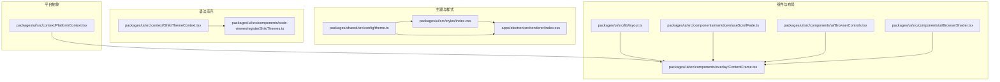
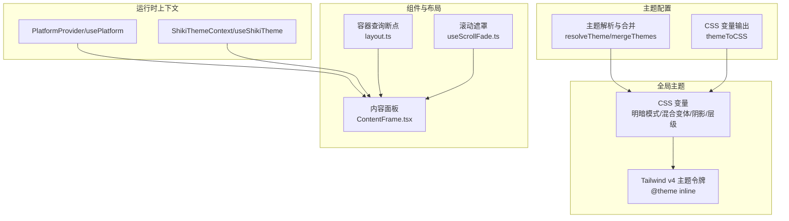
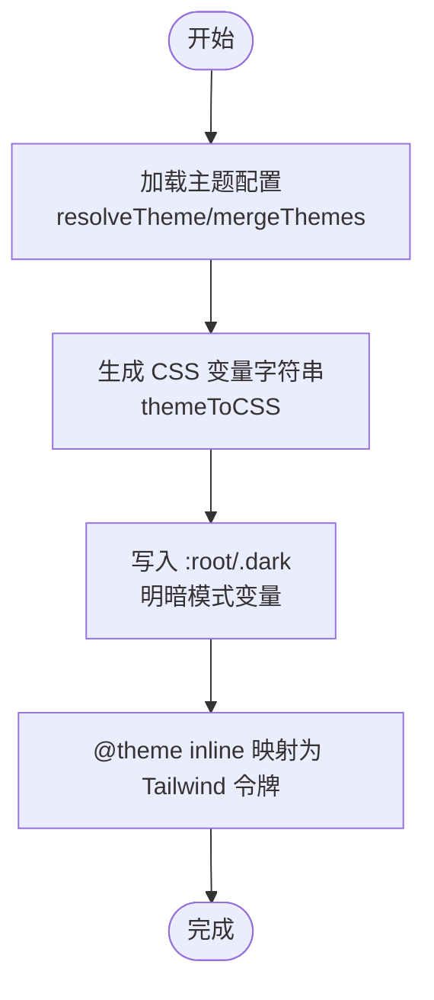
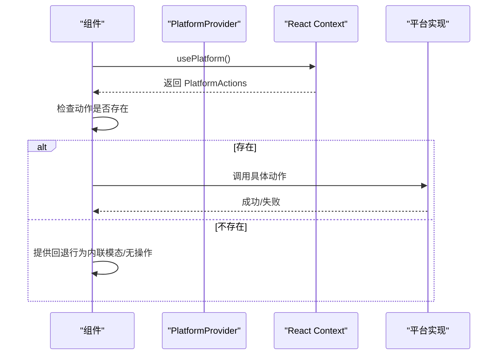
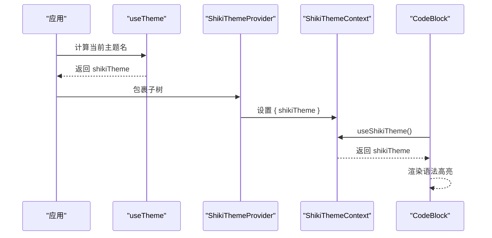
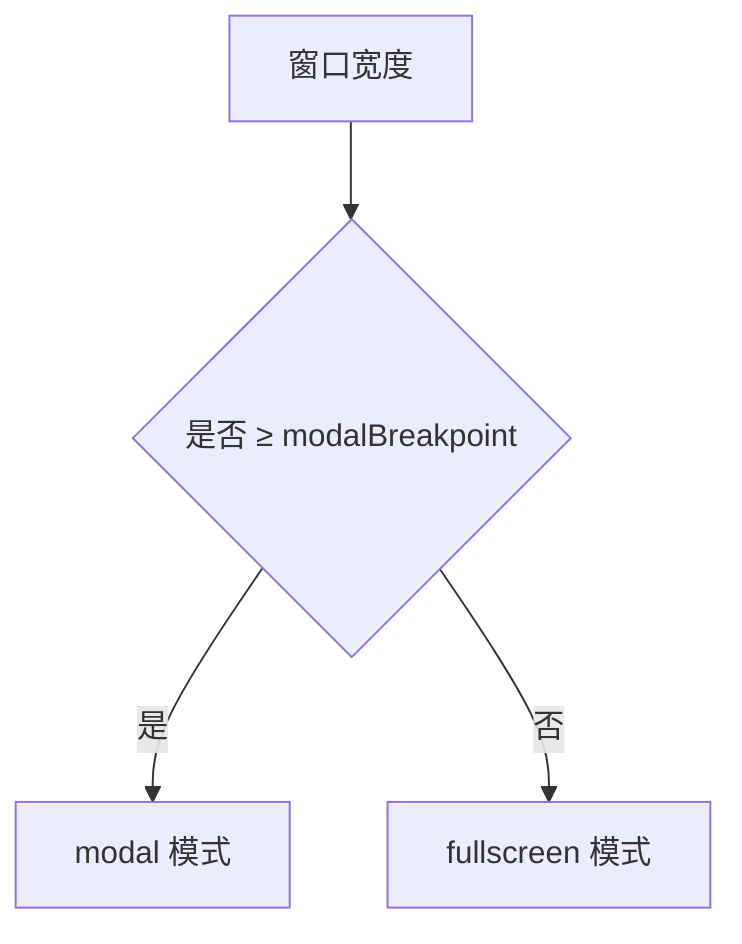
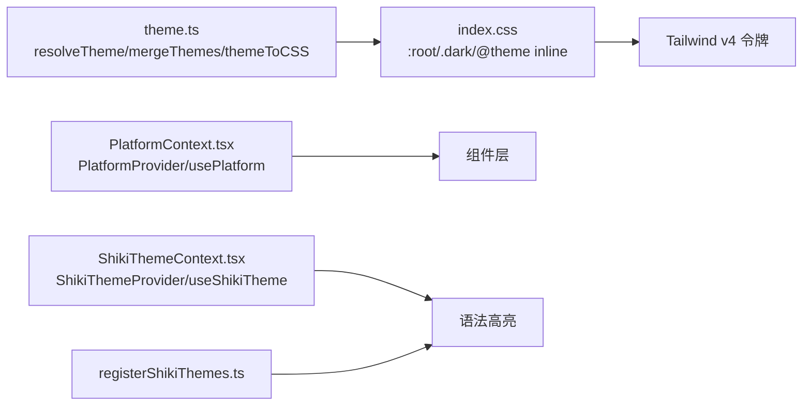

# 设计系统

<cite>
**本文引用的文件**
- [packages/ui/src/styles/index.css](file://packages/ui/src/styles/index.css)
- [packages/shared/src/config/theme.ts](file://packages/shared/src/config/theme.ts)
- [packages/ui/src/context/PlatformContext.tsx](file://packages/ui/src/context/PlatformContext.tsx)
- [packages/ui/src/context/ShikiThemeContext.tsx](file://packages/ui/src/context/ShikiThemeContext.tsx)
- [packages/ui/src/components/code-viewer/registerShikiThemes.ts](file://packages/ui/src/components/code-viewer/registerShikiThemes.ts)
- [apps/electron/src/renderer/index.css](file://apps/electron/src/renderer/index.css)
- [packages/ui/src/lib/layout.ts](file://packages/ui/src/lib/layout.ts)
- [packages/ui/src/components/markdown/useScrollFade.ts](file://packages/ui/src/components/markdown/useScrollFade.ts)
- [packages/ui/src/components/overlay/ContentFrame.tsx](file://packages/ui/src/components/overlay/ContentFrame.tsx)
- [packages/ui/src/components/ui/BrowserControls.tsx](file://packages/ui/src/components/ui/BrowserControls.tsx)
- [packages/ui/src/components/ui/BrowserShader.tsx](file://packages/ui/src/components/ui/BrowserShader.tsx)
</cite>

## 目录
1. [简介](#简介)
2. [项目结构](#项目结构)
3. [核心组件](#核心组件)
4. [架构总览](#架构总览)
5. [详细组件分析](#详细组件分析)
6. [依赖关系分析](#依赖关系分析)
7. [性能考量](#性能考量)
8. [故障排查指南](#故障排查指南)
9. [结论](#结论)
10. [附录](#附录)

## 简介
本设计系统以 shadcn/ui 与 Tailwind CSS v4 为基础，结合自定义的 CSS 变量主题系统、OKLCH 颜色空间与可动画变量，构建了统一的视觉语言与交互体验。系统覆盖主题系统（6 色语义体系、表面色彩、明暗模式）、字体与排版、阴影与层级、容器查询断点、语法高亮主题注入、平台抽象（跨 Electron/Web 环境一致行为），并提供暗色模式、可访问性与无障碍支持的最佳实践。

## 项目结构
设计系统主要由以下模块构成：
- 主题与样式：全局 CSS 变量、Tailwind v4 主题集成、明暗模式、z-index 规范、阴影工具类
- 平台抽象：PlatformProvider/usePlatform 提供跨环境能力
- 语法高亮：ShikiThemeContext + 主题注册，确保在系统自动模式下也能正确选择主题
- 组件与布局：内容面板、滚动遮罩、浏览器控件、着色器等
- 响应式与布局：容器查询断点、窗口尺寸驱动的布局切换

图表来源
- [packages/ui/src/styles/index.css:1-550](file://packages/ui/src/styles/index.css#L1-L550)
- [apps/electron/src/renderer/index.css:1-800](file://apps/electron/src/renderer/index.css#L1-L800)
- [packages/shared/src/config/theme.ts:1-318](file://packages/shared/src/config/theme.ts#L1-L318)
- [packages/ui/src/context/PlatformContext.tsx:1-184](file://packages/ui/src/context/PlatformContext.tsx#L1-L184)
- [packages/ui/src/context/ShikiThemeContext.tsx:1-69](file://packages/ui/src/context/ShikiThemeContext.tsx#L1-L69)
- [packages/ui/src/components/code-viewer/registerShikiThemes.ts:1-24](file://packages/ui/src/components/code-viewer/registerShikiThemes.ts#L1-L24)
- [packages/ui/src/lib/layout.ts:81-97](file://packages/ui/src/lib/layout.ts#L81-L97)
- [packages/ui/src/components/markdown/useScrollFade.ts:1-50](file://packages/ui/src/components/markdown/useScrollFade.ts#L1-L50)
- [packages/ui/src/components/overlay/ContentFrame.tsx:80-115](file://packages/ui/src/components/overlay/ContentFrame.tsx#L80-L115)
- [packages/ui/src/components/ui/BrowserControls.tsx:1-37](file://packages/ui/src/components/ui/BrowserControls.tsx#L1-L37)
- [packages/ui/src/components/ui/BrowserShader.tsx:41-96](file://packages/ui/src/components/ui/BrowserShader.tsx#L41-L96)

章节来源
- [packages/ui/src/styles/index.css:1-550](file://packages/ui/src/styles/index.css#L1-L550)
- [apps/electron/src/renderer/index.css:1-800](file://apps/electron/src/renderer/index.css#L1-L800)

## 核心组件
- 主题系统与颜色体系
  - 6 色语义系统：背景、前景、强调色（品牌紫）、信息色（琥珀）、成功色（绿色）、破坏色（红色）
  - 混合变体：透明度变体（/50）与实体混合变体（-50），用于边框、悬停、分隔线与 Explore 模式
  - 明暗模式：根级变量与 .dark 类下的差异值，阴影不透明度与文本对比度优化
  - Tailwind v4 集成：通过 @theme inline 将 CSS 变量映射为 Tailwind v4 主题令牌
- 字体与排版
  - UI 使用系统字体，代码块使用 JetBrains Mono；可选 Inter 字体（通过 data-font="inter" 切换）
  - 字号基准、行高、字距等通过 CSS 变量控制
- 阴影与层级
  - 统一的阴影变量与工具类，支持“边框层 + 模糊层”的组合
  - z-index 分层：基础、局部、标题栏、面板、下拉、提示、模态、遮罩、全屏、浮动菜单等
- 容器查询断点
  - 自定义断点：panel-compact（约 448px）、panel-medium（640px）、mobile（768px）
  - 生成 @panel-compact:/@panel-medium:/@mobile: 前缀，用于响应式布局
- 语法高亮主题
  - ShikiThemeContext 提供当前主题名，解决“系统自动模式 + 暗色专属主题”场景
  - registerShikiThemes 注册 craft-dark/craft-light 自定义主题，避免重复注册警告
- 平台抽象
  - PlatformProvider/usePlatform 抽象文件打开、URL 打开、剪贴板、预览等动作，Web 与 Electron 实现差异通过可选动作处理

章节来源
- [packages/ui/src/styles/index.css:13-276](file://packages/ui/src/styles/index.css#L13-L276)
- [apps/electron/src/renderer/index.css:382-468](file://apps/electron/src/renderer/index.css#L382-L468)
- [packages/shared/src/config/theme.ts:248-263](file://packages/shared/src/config/theme.ts#L248-L263)
- [packages/ui/src/context/ShikiThemeContext.tsx:1-69](file://packages/ui/src/context/ShikiThemeContext.tsx#L1-L69)
- [packages/ui/src/components/code-viewer/registerShikiThemes.ts:1-24](file://packages/ui/src/components/code-viewer/registerShikiThemes.ts#L1-L24)
- [packages/ui/src/context/PlatformContext.tsx:1-184](file://packages/ui/src/context/PlatformContext.tsx#L1-L184)

## 架构总览
设计系统采用“CSS 变量 + Tailwind v4 + React Context”的分层架构：
- 顶层：全局 CSS 变量与 Tailwind v4 主题令牌
- 中层：主题配置与解析（含深浅色覆盖、模式与背景图）
- 底层：平台抽象与语法高亮上下文
- 组件层：复用统一的阴影、层级、断点与工具类

图表来源
- [packages/ui/src/styles/index.css:223-276](file://packages/ui/src/styles/index.css#L223-L276)
- [packages/shared/src/config/theme.ts:97-139](file://packages/shared/src/config/theme.ts#L97-L139)
- [packages/ui/src/context/PlatformContext.tsx:120-181](file://packages/ui/src/context/PlatformContext.tsx#L120-L181)
- [packages/ui/src/context/ShikiThemeContext.tsx:29-66](file://packages/ui/src/context/ShikiThemeContext.tsx#L29-L66)
- [packages/ui/src/lib/layout.ts:81-97](file://packages/ui/src/lib/layout.ts#L81-L97)
- [packages/ui/src/components/markdown/useScrollFade.ts:1-50](file://packages/ui/src/components/markdown/useScrollFade.ts#L1-L50)
- [packages/ui/src/components/overlay/ContentFrame.tsx:80-115](file://packages/ui/src/components/overlay/ContentFrame.tsx#L80-L115)

## 详细组件分析

### 主题系统与颜色体系
- 6 色语义与混合变体
  - 背景/前景为主基调，强调色用于高亮与执行模式，信息/成功/破坏色分别对应警告、连接、错误状态
  - 混合变体通过 color-mix 实现“向背景混合”的实体色，用于 Explore 模式与分隔线
- 明暗模式差异
  - 阴影不透明度在暗色模式更强，提升可见性
  - 文本对比度通过“向前景混合”策略优化
- Tailwind v4 集成
  - 将 CSS 变量映射为 --color-* 与 --font-*、--shadow-*、--z-index-* 等主题令牌
  - 支持 legacy 兼容变量，便于与 shadcn/ui 组件协同
- 动画变量
  - 使用 @property 将主题色声明为可动画变量，实现主题切换时的平滑过渡

图表来源
- [packages/shared/src/config/theme.ts:97-139](file://packages/shared/src/config/theme.ts#L97-L139)
- [packages/shared/src/config/theme.ts:178-225](file://packages/shared/src/config/theme.ts#L178-L225)
- [packages/ui/src/styles/index.css:223-276](file://packages/ui/src/styles/index.css#L223-L276)

章节来源
- [packages/ui/src/styles/index.css:33-208](file://packages/ui/src/styles/index.css#L33-L208)
- [packages/ui/src/styles/index.css:223-276](file://packages/ui/src/styles/index.css#L223-L276)
- [packages/shared/src/config/theme.ts:178-225](file://packages/shared/src/config/theme.ts#L178-L225)

### 平台抽象机制（PlatformProvider/usePlatform）
- 设计目标
  - 在 Electron 与 Web 环境中提供一致的 UI 行为，必要时降级为内联模态或无操作
- 关键点
  - PlatformActions 接口中的所有方法均为可选，平台仅实现支持的能力
  - 组件调用前需检查是否存在对应动作，否则提供回退逻辑
  - 提供 fileManagerName、traffic light 控制等平台特性
- 使用示例
  - Electron 注入真实 IPC 动作；Web 注入 window.open、navigator.clipboard 等替代方案

图表来源
- [packages/ui/src/context/PlatformContext.tsx:120-181](file://packages/ui/src/context/PlatformContext.tsx#L120-L181)

章节来源
- [packages/ui/src/context/PlatformContext.tsx:1-184](file://packages/ui/src/context/PlatformContext.tsx#L1-L184)

### 主题提供者（ShikiThemeContext）与语法高亮
- 场景问题
  - 当使用“仅暗色”主题且系统模式为“自动”，OS 处于亮色模式时，DOM 为 .light，但代码块应使用暗色 Shiki 主题
- 解决方案
  - ShikiThemeContext 提供当前主题名，优先于 DOM 类名判断
  - registerShikiThemes 注册 craft-dark/craft-light 自定义主题，避免重复注册
- 流程
  - useTheme 获取主题配置，计算当前 Shiki 主题名
  - ShikiThemeProvider 将主题名注入上下文
  - CodeBlock 等组件读取上下文决定使用哪个 Shiki 主题

图表来源
- [packages/ui/src/context/ShikiThemeContext.tsx:29-66](file://packages/ui/src/context/ShikiThemeContext.tsx#L29-L66)
- [packages/ui/src/components/code-viewer/registerShikiThemes.ts:9-24](file://packages/ui/src/components/code-viewer/registerShikiThemes.ts#L9-L24)
- [packages/shared/src/config/theme.ts:311-317](file://packages/shared/src/config/theme.ts#L311-L317)

章节来源
- [packages/ui/src/context/ShikiThemeContext.tsx:1-69](file://packages/ui/src/context/ShikiThemeContext.tsx#L1-L69)
- [packages/ui/src/components/code-viewer/registerShikiThemes.ts:1-24](file://packages/ui/src/components/code-viewer/registerShikiThemes.ts#L1-L24)
- [packages/shared/src/config/theme.ts:279-317](file://packages/shared/src/config/theme.ts#L279-L317)

### 组件样式约定与 CSS 类命名规范
- 通用约定
  - 使用语义化类名：如 .popover-styled、.scrollbar-hide、.shadow-* 系列
  - 阴影与层级：优先使用 CSS 变量与工具类，避免硬编码
  - 表面色彩：通过 --paper/--navigator/--input/--popover 等变量控制区域背景
- 内容面板（ContentFrame）
  - 使用 .bg-background、.text-foreground、.shadow-strong 构建卡片
  - 标题区使用 .border-foreground/7 作为分隔线
- 浏览器控件（BrowserControls）
  - 按钮尺寸与悬停态遵循 .h-7/.w-7 与 .hover:bg-foreground/5
- 着色器（BrowserShader）
  - 通过 useAccentColor 获取强调色，支持形状、类型、速度、缩放等参数化

章节来源
- [packages/ui/src/components/overlay/ContentFrame.tsx:80-115](file://packages/ui/src/components/overlay/ContentFrame.tsx#L80-L115)
- [packages/ui/src/components/ui/BrowserControls.tsx:16-34](file://packages/ui/src/components/ui/BrowserControls.tsx#L16-L34)
- [packages/ui/src/components/ui/BrowserShader.tsx:52-96](file://packages/ui/src/components/ui/BrowserShader.tsx#L52-L96)

### 响应式设计断点
- 容器查询断点
  - --container-3xs: 16rem（256px）
  - --container-panel-compact: 28rem（448px）
  - --container-panel-medium: 40rem（640px）
  - --container-mobile: 48rem（768px）
- 断点前缀
  - @panel-compact: 适配紧凑面板
  - @panel-medium: 适配中等面板
  - @mobile: 移动端最小宽度
- 布局切换
  - 通过 OVERLAY_LAYOUT.modalBreakpoint 判断 modal/fullscreen 模式

图表来源
- [packages/ui/src/lib/layout.ts:81-97](file://packages/ui/src/lib/layout.ts#L81-L97)

章节来源
- [apps/electron/src/renderer/index.css:461-468](file://apps/electron/src/renderer/index.css#L461-L468)
- [packages/ui/src/lib/layout.ts:81-97](file://packages/ui/src/lib/layout.ts#L81-L97)

### 设计令牌系统、暗色模式支持与可访问性
- 设计令牌
  - 通过 CSS 变量与 @theme inline 输出统一的主题令牌，覆盖颜色、字体、阴影、z-index
- 暗色模式
  - .dark 类切换变量值，增强阴影不透明度，优化文本对比度
- 可访问性
  - 统一焦点环样式，使用 --ring-width/--ring-color/--ring-offset
  - 滚动条与悬停态具备清晰对比度
  - 为不可用状态提供禁用样式与提示

章节来源
- [packages/ui/src/styles/index.css:151-208](file://packages/ui/src/styles/index.css#L151-L208)
- [apps/electron/src/renderer/index.css:513-520](file://apps/electron/src/renderer/index.css#L513-L520)

## 依赖关系分析
- 主题配置对样式的影响
  - theme.ts 负责解析与合并主题，输出 CSS 变量字符串，最终写入 :root/.dark
  - index.css 通过 @theme inline 将变量映射为 Tailwind 令牌
- 平台抽象对组件的影响
  - PlatformProvider 将平台动作注入上下文，组件按需调用
- 语法高亮对主题的影响
  - ShikiThemeContext 与 registerShikiThemes 确保在系统自动模式下仍能正确选择主题

图表来源
- [packages/shared/src/config/theme.ts:97-139](file://packages/shared/src/config/theme.ts#L97-L139)
- [packages/ui/src/styles/index.css:223-276](file://packages/ui/src/styles/index.css#L223-L276)
- [packages/ui/src/context/PlatformContext.tsx:120-181](file://packages/ui/src/context/PlatformContext.tsx#L120-L181)
- [packages/ui/src/context/ShikiThemeContext.tsx:29-66](file://packages/ui/src/context/ShikiThemeContext.tsx#L29-L66)
- [packages/ui/src/components/code-viewer/registerShikiThemes.ts:9-24](file://packages/ui/src/components/code-viewer/registerShikiThemes.ts#L9-L24)

章节来源
- [packages/shared/src/config/theme.ts:97-225](file://packages/shared/src/config/theme.ts#L97-L225)
- [packages/ui/src/styles/index.css:223-276](file://packages/ui/src/styles/index.css#L223-L276)

## 性能考量
- CSS 变量与 @property 动画
  - 使用 @property 将颜色声明为可动画变量，减少重绘与布局抖动
- 阴影与模糊
  - 在 scenic 模式下对面板启用 backdrop-filter，注意性能影响，建议限制模糊半径与层级数量
- 语法高亮
  - 通过上下文注入主题名，避免 DOM 查询带来的额外开销
- 响应式
  - 容器查询断点减少不必要的媒体查询匹配，提高渲染效率

## 故障排查指南
- 主题不生效或闪烁
  - 检查 themeToCSS 是否正确输出变量，确认 :root/.dark 是否被写入
  - 确认 @theme inline 是否包含所需令牌
- 暗色模式对比度不足
  - 检查 .dark 下的变量值与阴影不透明度
  - 确认文本混合策略（向前景混合）是否符合预期
- 语法高亮主题错误
  - 确认 ShikiThemeProvider 是否包裹相关组件
  - 检查 registerShikiThemes 是否已执行一次
- 平台动作无效
  - 确认 PlatformProvider 注入的动作是否可用
  - 组件调用前检查动作是否存在，提供回退逻辑

章节来源
- [packages/shared/src/config/theme.ts:178-225](file://packages/shared/src/config/theme.ts#L178-L225)
- [packages/ui/src/context/ShikiThemeContext.tsx:29-66](file://packages/ui/src/context/ShikiThemeContext.tsx#L29-L66)
- [packages/ui/src/context/PlatformContext.tsx:150-181](file://packages/ui/src/context/PlatformContext.tsx#L150-L181)

## 结论
该设计系统以 CSS 变量为核心，结合 Tailwind v4 与 React Context，实现了跨平台、可定制、可扩展的视觉与交互体系。通过明确的颜色语义、混合变体、明暗模式、容器查询断点与语法高亮上下文，既满足复杂场景的视觉一致性，也为二次开发提供了清晰的扩展路径。

## 附录
- 设计系统定制指南
  - 颜色：在 theme.ts 中定义 ThemeOverrides，通过 themeToCSS 输出到 CSS 变量
  - 字体：通过 data-font="inter" 切换 Inter，或修改 --font-sans/--font-mono
  - 阴影与层级：直接使用 CSS 变量或工具类，避免硬编码
  - 断点：根据业务需求调整容器查询断点，生成新的前缀
- 样式扩展方法
  - 新增组件样式时，优先使用现有工具类与变量
  - 需要新功能时，先在 index.css 中定义变量与 @theme 令牌，再在组件中使用
- 最佳实践
  - 保持语义化命名，避免与 Tailwind 默认类冲突
  - 在组件中始终检查平台动作是否存在，提供回退行为
  - 在系统自动模式下，优先使用 ShikiThemeContext 提供的主题名