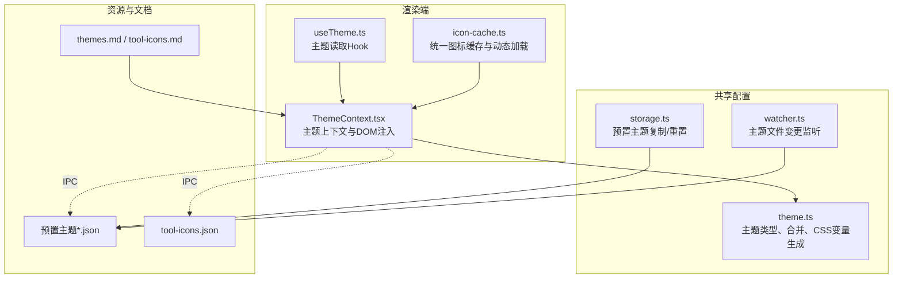
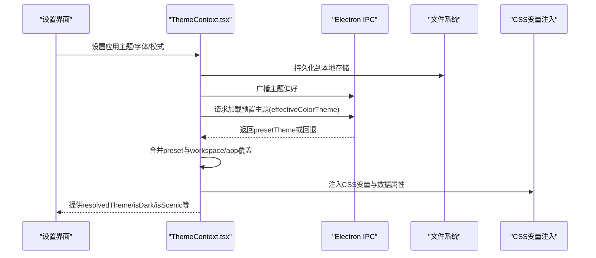
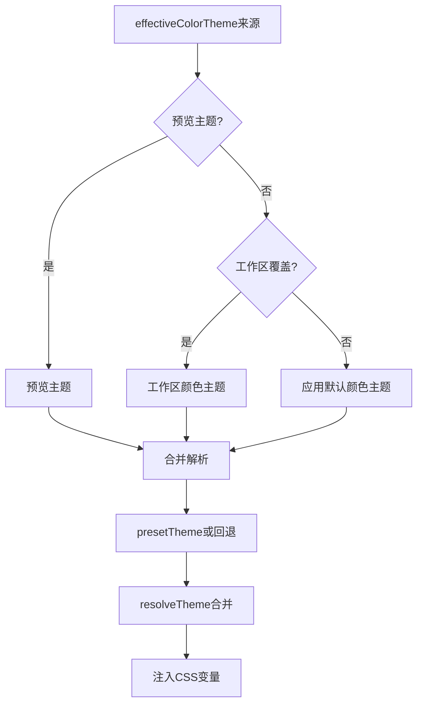
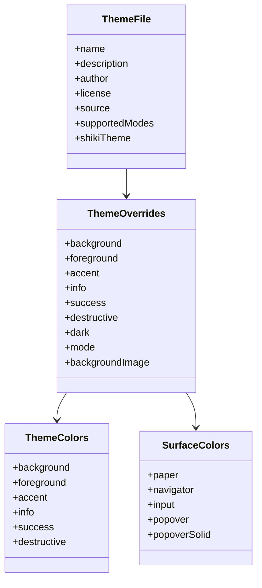
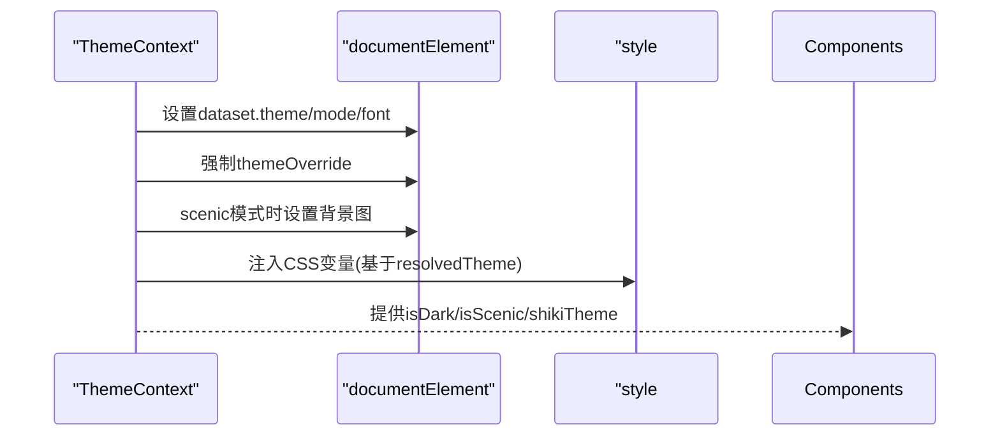
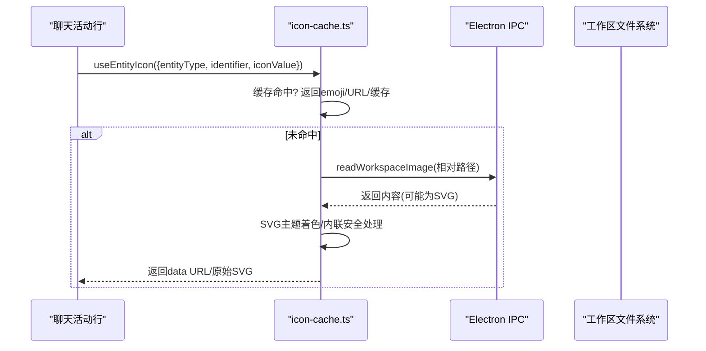
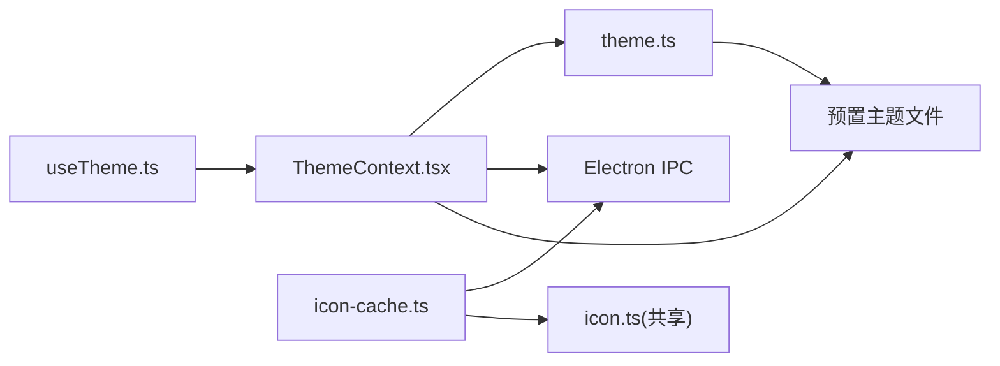

# 主题和外观

<cite>
**本文引用的文件**
- [apps/electron/resources/themes/default.json](file://apps/electron/resources/themes/default.json)
- [apps/electron/resources/themes/catppuccin.json](file://apps/electron/resources/themes/catppuccin.json)
- [apps/electron/resources/themes/dracula.json](file://apps/electron/resources/themes/dracula.json)
- [apps/electron/resources/themes/nord.json](file://apps/electron/resources/themes/nord.json)
- [apps/electron/resources/themes/solarized.json](file://apps/electron/resources/themes/solarized.json)
- [apps/electron/resources/tool-icons/tool-icons.json](file://apps/electron/resources/tool-icons/tool-icons.json)
- [apps/electron/src/renderer/context/ThemeContext.tsx](file://apps/electron/src/renderer/context/ThemeContext.tsx)
- [apps/electron/src/renderer/hooks/useTheme.ts](file://apps/electron/src/renderer/hooks/useTheme.ts)
- [apps/electron/src/renderer/lib/icon-cache.ts](file://apps/electron/src/renderer/lib/icon-cache.ts)
- [packages/shared/src/config/theme.ts](file://packages/shared/src/config/theme.ts)
- [apps/electron/resources/docs/themes.md](file://apps/electron/resources/docs/themes.md)
- [apps/electron/resources/docs/tool-icons.md](file://apps/electron/resources/docs/tool-icons.md)
- [packages/shared/src/config/storage.ts](file://packages/shared/src/config/storage.ts)
- [packages/shared/src/config/watcher.ts](file://packages/shared/src/config/watcher.ts)
- [packages/shared/src/utils/icon.ts](file://packages/shared/src/utils/icon.ts)
- [packages/shared/src/icons/types.ts](file://packages/shared/src/icons/types.ts)
</cite>

## 目录
1. [简介](#简介)
2. [项目结构](#项目结构)
3. [核心组件](#核心组件)
4. [架构总览](#架构总览)
5. [详细组件分析](#详细组件分析)
6. [依赖关系分析](#依赖关系分析)
7. [性能考量](#性能考量)
8. [故障排查指南](#故障排查指南)
9. [结论](#结论)
10. [附录](#附录)

## 简介
本文件面向需要定制应用外观或开发企业品牌的设计师与开发者，系统性阐述 Craft Agent 的主题与外观系统：包括主题架构与动态切换机制、自定义主题开发流程、工具图标管理与动态加载、Cascading 主题系统（应用级与工作区级）、主题文件格式与图标配置规范、颜色系统设计与最佳实践。文档同时提供主题开发指南、图标制作教程与品牌定制方案。

## 项目结构
主题与外观系统由“渲染端主题上下文”“共享主题配置”“预置主题与覆盖层”“图标缓存与动态加载”四部分组成，贯穿 Electron 渲染进程与共享包，形成可扩展、可热更新的外观体系。

图表来源
- [apps/electron/src/renderer/context/ThemeContext.tsx:115-527](file://apps/electron/src/renderer/context/ThemeContext.tsx#L115-L527)
- [apps/electron/src/renderer/hooks/useTheme.ts:49-77](file://apps/electron/src/renderer/hooks/useTheme.ts#L49-L77)
- [apps/electron/src/renderer/lib/icon-cache.ts:1-746](file://apps/electron/src/renderer/lib/icon-cache.ts#L1-L746)
- [packages/shared/src/config/theme.ts:1-318](file://packages/shared/src/config/theme.ts#L1-L318)
- [packages/shared/src/config/storage.ts:1233-1419](file://packages/shared/src/config/storage.ts#L1233-L1419)
- [packages/shared/src/config/watcher.ts:1066-1129](file://packages/shared/src/config/watcher.ts#L1066-L1129)
- [apps/electron/resources/docs/themes.md:1-275](file://apps/electron/resources/docs/themes.md#L1-L275)
- [apps/electron/resources/docs/tool-icons.md:1-94](file://apps/electron/resources/docs/tool-icons.md#L1-L94)

章节来源
- [apps/electron/src/renderer/context/ThemeContext.tsx:115-527](file://apps/electron/src/renderer/context/ThemeContext.tsx#L115-L527)
- [packages/shared/src/config/theme.ts:1-318](file://packages/shared/src/config/theme.ts#L1-L318)
- [apps/electron/resources/docs/themes.md:1-275](file://apps/electron/resources/docs/themes.md#L1-L275)

## 核心组件
- 主题上下文与DOM注入：负责主题偏好持久化、预置主题加载、模式与场景切换、Shiki语法高亮主题选择、CSS变量注入与跨窗口同步。
- 主题Hook：在不触发异步加载的前提下，读取已解析的主题状态，支持应用级覆盖合并。
- 主题配置与合并：定义主题类型、深合并策略、CSS变量生成、默认主题与背景色映射。
- 图标缓存与动态加载：统一缓存源/技能/状态图标，支持Emoji、本地文件、远程URL与自动发现；对SVG进行主题着色与内联安全处理。
- 预置主题与文件监听：自动复制/重置预置主题，监听主题文件变更以热更新。
- 文档与规范：主题与工具图标配置指南，涵盖Schema、安装与故障排查。

章节来源
- [apps/electron/src/renderer/context/ThemeContext.tsx:1-536](file://apps/electron/src/renderer/context/ThemeContext.tsx#L1-L536)
- [apps/electron/src/renderer/hooks/useTheme.ts:1-77](file://apps/electron/src/renderer/hooks/useTheme.ts#L1-L77)
- [packages/shared/src/config/theme.ts:1-318](file://packages/shared/src/config/theme.ts#L1-L318)
- [apps/electron/src/renderer/lib/icon-cache.ts:1-746](file://apps/electron/src/renderer/lib/icon-cache.ts#L1-L746)
- [packages/shared/src/config/storage.ts:1233-1419](file://packages/shared/src/config/storage.ts#L1233-L1419)
- [packages/shared/src/config/watcher.ts:1066-1129](file://packages/shared/src/config/watcher.ts#L1066-L1129)
- [apps/electron/resources/docs/themes.md:1-275](file://apps/electron/resources/docs/themes.md#L1-L275)
- [apps/electron/resources/docs/tool-icons.md:1-94](file://apps/electron/resources/docs/tool-icons.md#L1-L94)

## 架构总览
主题系统采用“应用级默认 + 工作区级覆盖”的Cascading模型，结合预置主题与用户覆盖层，实现灵活而一致的外观体验。渲染端通过上下文一次性完成主题解析与DOM注入，确保无闪烁与高性能。

图表来源
- [apps/electron/src/renderer/context/ThemeContext.tsx:143-246](file://apps/electron/src/renderer/context/ThemeContext.tsx#L143-L246)
- [apps/electron/src/renderer/context/ThemeContext.tsx:284-380](file://apps/electron/src/renderer/context/ThemeContext.tsx#L284-L380)
- [apps/electron/src/renderer/hooks/useTheme.ts:49-77](file://apps/electron/src/renderer/hooks/useTheme.ts#L49-L77)

章节来源
- [apps/electron/src/renderer/context/ThemeContext.tsx:115-527](file://apps/electron/src/renderer/context/ThemeContext.tsx#L115-L527)
- [apps/electron/src/renderer/hooks/useTheme.ts:1-77](file://apps/electron/src/renderer/hooks/useTheme.ts#L1-L77)

## 详细组件分析

### 主题系统与Cascading（应用级与工作区级）
- 应用级默认：来自设置中的“默认主题”，可被用户覆盖为具体主题ID或保持默认。
- 工作区级覆盖：每个工作区可独立设置颜色主题，未设置时继承应用默认。
- 预置主题：位于用户目录下的主题包，支持多模式（light/dark）与Shiki主题映射。
- 用户覆盖：应用级的 theme.json 可覆盖特定颜色字段，仅影响应用级渲染。
- 解析顺序：预置主题 → 工作区覆盖 → 应用级覆盖 → 默认值。

图表来源
- [apps/electron/src/renderer/context/ThemeContext.tsx:164-168](file://apps/electron/src/renderer/context/ThemeContext.tsx#L164-L168)
- [apps/electron/src/renderer/context/ThemeContext.tsx:185-246](file://apps/electron/src/renderer/context/ThemeContext.tsx#L185-L246)
- [packages/shared/src/config/theme.ts:97-139](file://packages/shared/src/config/theme.ts#L97-L139)

章节来源
- [apps/electron/src/renderer/context/ThemeContext.tsx:163-246](file://apps/electron/src/renderer/context/ThemeContext.tsx#L163-L246)
- [apps/electron/resources/docs/themes.md:9-16](file://apps/electron/resources/docs/themes.md#L9-L16)

### 主题文件格式与颜色系统
- 颜色系统：6种语义色 + 多种表面色（纸张、导航栏、输入框、弹出层等），支持明暗模式差异。
- 模式：solid（传统纯色）与 scenic（全窗背景图+玻璃面板）。
- Shiki主题：可为light/dark分别指定语法高亮主题。
- 支持模式：预置主题可声明支持light/dark，若当前模式不受支持，则按主题支持模式回退。
- 默认主题：使用OKLCH色彩空间，兼顾可访问性与一致性。

图表来源
- [packages/shared/src/config/theme.ts:25-72](file://packages/shared/src/config/theme.ts#L25-L72)
- [packages/shared/src/config/theme.ts:281-289](file://packages/shared/src/config/theme.ts#L281-L289)

章节来源
- [packages/shared/src/config/theme.ts:1-318](file://packages/shared/src/config/theme.ts#L1-L318)
- [apps/electron/resources/docs/themes.md:45-130](file://apps/electron/resources/docs/themes.md#L45-L130)

### 动态切换机制与DOM注入
- 偏好持久化：模式、字体、颜色主题写入本地存储；跨窗口通过IPC广播同步。
- 预置主题加载：通过IPC请求预置主题，失败则回退到内置主题包。
- DOM注入：仅在ThemeContext中执行一次DOM操作，注入根节点类名、数据属性与CSS变量，避免重复渲染抖动。
- 场景模式：scenic模式强制暗色并注入背景图，确保对比度与沉浸感。

图表来源
- [apps/electron/src/renderer/context/ThemeContext.tsx:284-380](file://apps/electron/src/renderer/context/ThemeContext.tsx#L284-L380)

章节来源
- [apps/electron/src/renderer/context/ThemeContext.tsx:284-380](file://apps/electron/src/renderer/context/ThemeContext.tsx#L284-L380)

### 自定义主题开发指南
- 覆盖层：在应用级 theme.json 中仅覆盖需要的颜色字段，无需全量。
- 预置主题：在用户目录 themes 下新增 {name}.json，包含元数据与颜色字段，支持 supportedModes 与 shikiTheme。
- 快速开始：从默认主题出发，仅修改 accent 即可快速个性化。
- 测试建议：在明/暗模式下验证对比度与可读性，必要时添加 dark 覆盖。
- 热更新：编辑后即时生效，无需重启。

章节来源
- [apps/electron/resources/docs/themes.md:67-228](file://apps/electron/resources/docs/themes.md#L67-L228)
- [packages/shared/src/config/theme.ts:178-225](file://packages/shared/src/config/theme.ts#L178-L225)

### 工具图标管理与动态加载
- 配置文件：tool-icons.json 定义命令到图标映射，图标文件与JSON同目录。
- 加载优先级：配置中的 emoji 或 URL > 本地文件自动发现。
- 统一缓存：icon-cache.ts 提供统一缓存与加载入口，支持SVG主题着色与内联渲染。
- 远程图标：支持从URL下载并保存为本地图标文件，自动推断扩展名。
- 性能优化：并发探测多种扩展名，减少IPC往返；SVG注入前景色以适配背景图。

图表来源
- [apps/electron/src/renderer/lib/icon-cache.ts:530-645](file://apps/electron/src/renderer/lib/icon-cache.ts#L530-L645)
- [apps/electron/src/renderer/lib/icon-cache.ts:670-702](file://apps/electron/src/renderer/lib/icon-cache.ts#L670-L702)

章节来源
- [apps/electron/src/renderer/lib/icon-cache.ts:1-746](file://apps/electron/src/renderer/lib/icon-cache.ts#L1-L746)
- [apps/electron/resources/docs/tool-icons.md:1-94](file://apps/electron/resources/docs/tool-icons.md#L1-L94)
- [packages/shared/src/utils/icon.ts:132-168](file://packages/shared/src/utils/icon.ts#L132-L168)

### 预置主题与文件监听
- 自动复制：首次运行或缺失时，从内置主题包复制到用户目录，保留用户自定义。
- 文件监听：监控主题文件增删改，实时回调通知渲染端重新解析。
- 重置功能：将用户版本替换为内置默认版本，便于恢复出厂设置。

章节来源
- [packages/shared/src/config/storage.ts:1233-1419](file://packages/shared/src/config/storage.ts#L1233-L1419)
- [packages/shared/src/config/watcher.ts:1066-1129](file://packages/shared/src/config/watcher.ts#L1066-L1129)

## 依赖关系分析
- 渲染端依赖共享主题配置模块进行类型定义、合并逻辑与CSS变量生成。
- 主题上下文通过IPC与主进程交互，加载预置主题与监听系统主题变化。
- 图标系统依赖共享工具函数进行URL下载与扩展名推断，渲染端通过IPC读取工作区图标文件。

图表来源
- [apps/electron/src/renderer/hooks/useTheme.ts:1-77](file://apps/electron/src/renderer/hooks/useTheme.ts#L1-L77)
- [apps/electron/src/renderer/context/ThemeContext.tsx:1-536](file://apps/electron/src/renderer/context/ThemeContext.tsx#L1-L536)
- [apps/electron/src/renderer/lib/icon-cache.ts:1-746](file://apps/electron/src/renderer/lib/icon-cache.ts#L1-L746)
- [packages/shared/src/config/theme.ts:1-318](file://packages/shared/src/config/theme.ts#L1-L318)
- [packages/shared/src/utils/icon.ts:1-168](file://packages/shared/src/utils/icon.ts#L1-L168)

章节来源
- [apps/electron/src/renderer/hooks/useTheme.ts:1-77](file://apps/electron/src/renderer/hooks/useTheme.ts#L1-L77)
- [apps/electron/src/renderer/context/ThemeContext.tsx:1-536](file://apps/electron/src/renderer/context/ThemeContext.tsx#L1-L536)
- [apps/electron/src/renderer/lib/icon-cache.ts:1-746](file://apps/electron/src/renderer/lib/icon-cache.ts#L1-L746)
- [packages/shared/src/config/theme.ts:1-318](file://packages/shared/src/config/theme.ts#L1-L318)
- [packages/shared/src/utils/icon.ts:1-168](file://packages/shared/src/utils/icon.ts#L1-L168)

## 性能考量
- 主题解析与DOM注入集中在ThemeContext，避免组件内部重复计算与副作用。
- 图标加载采用统一缓存与并发探测，降低IPC调用次数。
- SVG主题着色与内联渲染仅在需要时进行，避免不必要的DOM操作。
- 预置主题回退与错误提示减少异常路径对主线程的影响。

## 故障排查指南
- 主题未生效
  - 检查JSON语法与路径是否正确（覆盖层：用户目录下的 theme.json；预置主题：themes 目录）。
  - 确认颜色值为有效CSS颜色。
- 明/暗模式显示异常
  - 添加显式 dark 覆盖；若预置主题仅支持单一模式，需确认当前模式是否受支持。
- 背景图不显示
  - 确保 scenic 模式开启且背景图路径有效（相对或URL）。
- 图标不显示或样式异常
  - 检查 tool-icons.json 映射与图标文件存在性；确认SVG使用 currentColor 并已主题着色。
  - 对于内联渲染的SVG，确保未包含脚本或事件处理器。

章节来源
- [apps/electron/resources/docs/themes.md:242-275](file://apps/electron/resources/docs/themes.md#L242-L275)
- [apps/electron/resources/docs/tool-icons.md:1-94](file://apps/electron/resources/docs/tool-icons.md#L1-L94)

## 结论
该主题与外观系统以“预置主题 + 用户覆盖 + Cascading”为核心，结合渲染端单例上下文与共享配置模块，实现了高可扩展、低耦合、强一致的外观体验。通过统一图标缓存与动态加载，系统在保证性能的同时提供了丰富的定制能力。建议在企业品牌定制中，优先使用OKLCH色彩空间与明确的明暗覆盖，确保跨平台一致性与可维护性。

## 附录

### 主题文件示例与字段说明
- 示例文件位置
  - [apps/electron/resources/themes/default.json:1-26](file://apps/electron/resources/themes/default.json#L1-L26)
  - [apps/electron/resources/themes/catppuccin.json:1-27](file://apps/electron/resources/themes/catppuccin.json#L1-L27)
  - [apps/electron/resources/themes/dracula.json:1-27](file://apps/electron/resources/themes/dracula.json#L1-L27)
  - [apps/electron/resources/themes/nord.json:1-27](file://apps/electron/resources/themes/nord.json#L1-L27)
  - [apps/electron/resources/themes/solarized.json:1-27](file://apps/electron/resources/themes/solarized.json#L1-L27)
- 字段说明参考
  - [apps/electron/resources/docs/themes.md:94-130](file://apps/electron/resources/docs/themes.md#L94-L130)

### 工具图标配置规范
- 配置文件位置
  - [apps/electron/resources/tool-icons/tool-icons.json:1-61](file://apps/electron/resources/tool-icons/tool-icons.json#L1-L61)
- Schema与字段说明
  - [apps/electron/resources/docs/tool-icons.md:15-41](file://apps/electron/resources/docs/tool-icons.md#L15-L41)