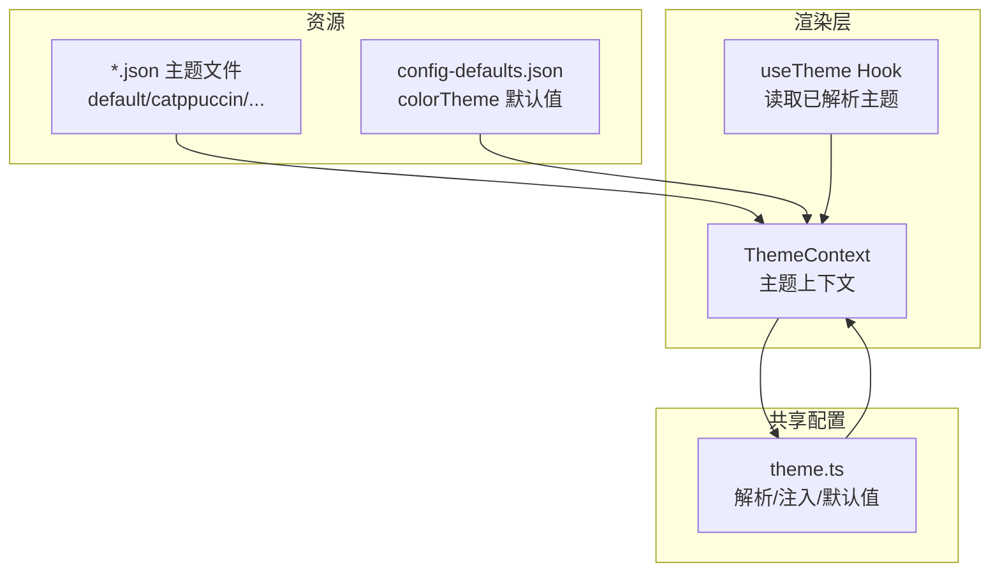
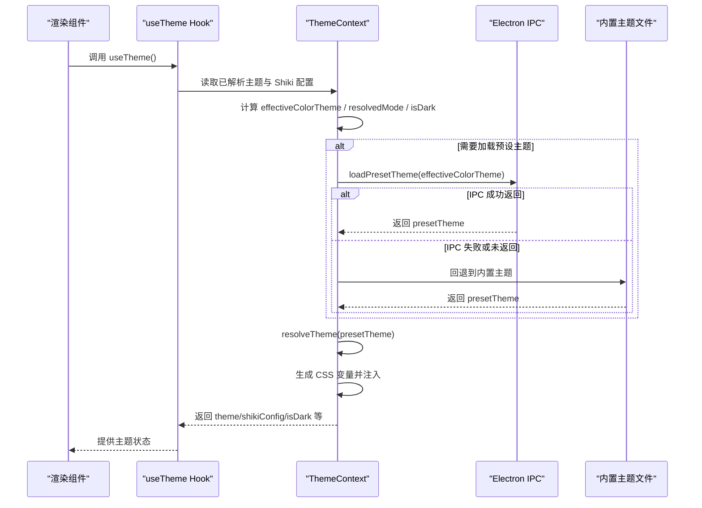
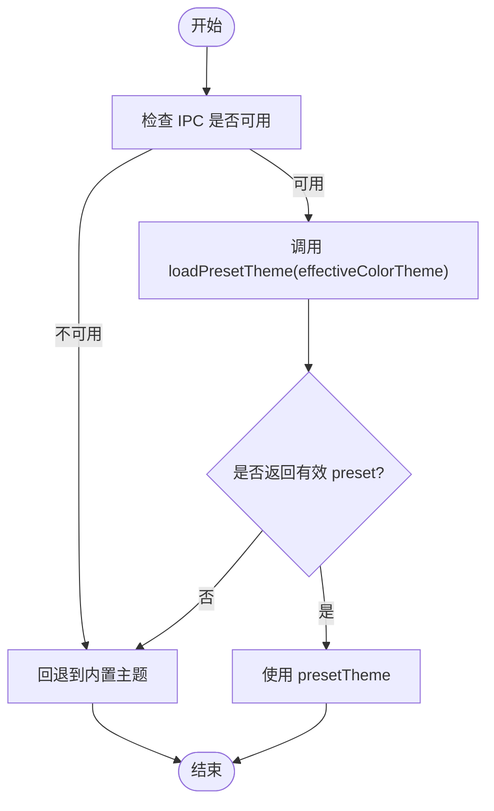
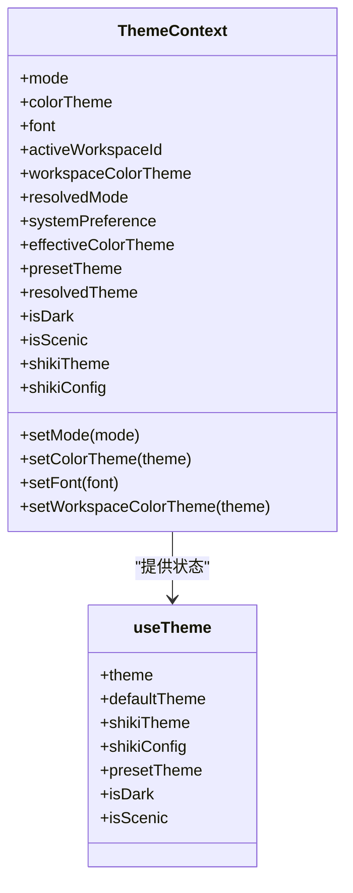
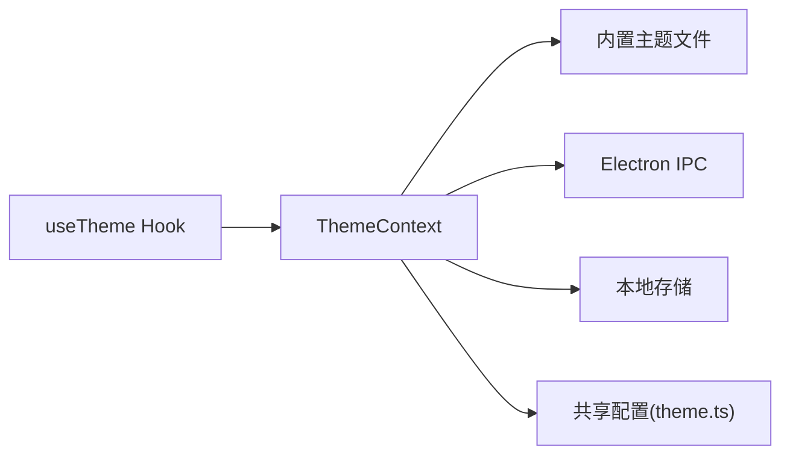

# 主题系统

<cite>
**本文引用的文件**
- [apps/electron/resources/themes/default.json](file://apps/electron/resources/themes/default.json)
- [apps/electron/resources/themes/catppuccin.json](file://apps/electron/resources/themes/catppuccin.json)
- [apps/electron/resources/themes/dracula.json](file://apps/electron/resources/themes/dracula.json)
- [apps/electron/resources/themes/nord.json](file://apps/electron/resources/themes/nord.json)
- [apps/electron/resources/themes/ghostty.json](file://apps/electron/resources/themes/ghostty.json)
- [apps/electron/resources/themes/github.json](file://apps/electron/resources/themes/github.json)
- [apps/electron/resources/themes/gruvbox.json](file://apps/electron/resources/themes/gruvbox.json)
- [apps/electron/resources/themes/solarized.json](file://apps/electron/resources/themes/solarized.json)
- [apps/electron/resources/themes/rose-pine.json](file://apps/electron/resources/themes/rose-pine.json)
- [apps/electron/resources/themes/tokyo-night.json](file://apps/electron/resources/themes/tokyo-night.json)
- [apps/electron/src/renderer/context/ThemeContext.tsx](file://apps/electron/src/renderer/context/ThemeContext.tsx)
- [apps/electron/src/renderer/hooks/useTheme.ts](file://apps/electron/src/renderer/hooks/useTheme.ts)
- [apps/electron/resources/config-defaults.json](file://apps/electron/resources/config-defaults.json)
- [packages/shared/src/config/theme.ts](file://packages/shared/src/config/theme.ts)
</cite>

## 目录
1. [简介](#简介)
2. [项目结构](#项目结构)
3. [核心组件](#核心组件)
4. [架构总览](#架构总览)
5. [详细组件分析](#详细组件分析)
6. [依赖关系分析](#依赖关系分析)
7. [性能考量](#性能考量)
8. [故障排查指南](#故障排查指南)
9. [结论](#结论)
10. [附录](#附录)

## 简介
本文件为应用主题系统的开发与使用指南，覆盖以下方面：
- 主题文件的 JSON 结构规范与字段语义
- 颜色系统设计原理（主色、信息色、破坏性动作色、背景/前景）
- 明暗模式支持机制与 Shiki 语法高亮主题映射
- 内置主题的设计特色与适用场景
- 自定义主题开发指南（颜色搭配、可访问性、品牌一致性）
- 动态切换技术实现、缓存与回退机制、性能优化策略
- 主题验证规则、错误处理与回退流程

## 项目结构
主题系统由“主题文件（JSON）+ 渲染层上下文 + 解析与注入逻辑”三部分组成：
- 主题文件：位于资源目录，定义名称、描述、作者、许可证、支持模式、Shiki 映射及颜色值
- 渲染层上下文：负责加载、解析、合并、注入主题，管理明暗模式与 Shiki 主题选择
- 共享配置：提供主题解析、CSS 注入、默认值与 Shiki 配置

图表来源
- [apps/electron/src/renderer/context/ThemeContext.tsx](file://apps/electron/src/renderer/context/ThemeContext.tsx)
- [apps/electron/src/renderer/hooks/useTheme.ts](file://apps/electron/src/renderer/hooks/useTheme.ts)
- [packages/shared/src/config/theme.ts](file://packages/shared/src/config/theme.ts)
- [apps/electron/resources/config-defaults.json](file://apps/electron/resources/config-defaults.json)

章节来源
- [apps/electron/src/renderer/context/ThemeContext.tsx](file://apps/electron/src/renderer/context/ThemeContext.tsx)
- [apps/electron/src/renderer/hooks/useTheme.ts](file://apps/electron/src/renderer/hooks/useTheme.ts)
- [packages/shared/src/config/theme.ts](file://packages/shared/src/config/theme.ts)
- [apps/electron/resources/config-defaults.json](file://apps/electron/resources/config-defaults.json)

## 核心组件
- 主题文件（JSON）：定义主题元数据、支持模式、Shiki 映射与颜色值
- ThemeContext：主题状态管理、IPC 加载、DOM 注入、跨窗口同步、回退机制
- useTheme Hook：在渲染层读取已解析主题与 Shiki 配置
- 共享配置（theme.ts）：主题解析、CSS 变量生成、默认 Shiki 配置

章节来源
- [apps/electron/src/renderer/context/ThemeContext.tsx](file://apps/electron/src/renderer/context/ThemeContext.tsx)
- [apps/electron/src/renderer/hooks/useTheme.ts](file://apps/electron/src/renderer/hooks/useTheme.ts)
- [packages/shared/src/config/theme.ts](file://packages/shared/src/config/theme.ts)

## 架构总览
主题系统采用“预设主题加载 + 用户覆盖 + 运行时解析 + DOM 注入”的架构。核心流程如下：
- 从资源目录加载内置主题清单
- 通过 IPC 请求预设主题；失败则回退到内置主题
- 合并用户级与工作区级覆盖
- 计算当前明暗模式与 Shiki 主题
- 注入 CSS 变量与数据属性，驱动样式渲染

图表来源
- [apps/electron/src/renderer/context/ThemeContext.tsx](file://apps/electron/src/renderer/context/ThemeContext.tsx)
- [apps/electron/src/renderer/hooks/useTheme.ts](file://apps/electron/src/renderer/hooks/useTheme.ts)

## 详细组件分析

### 主题文件 JSON 结构规范
- 必填字段
  - name：主题名称
  - description：简短描述
  - author：作者
  - license：许可证
  - supportedModes：支持的模式数组，如 ["light","dark"] 或 ["dark"]
  - shikiTheme：对象，包含 light/dark 对应的 Shiki 主题名
- 基础颜色
  - background：背景色
  - foreground：前景色
  - accent：强调色（用于链接、选中、按钮等）
  - info：信息提示色（通知、警告等）
  - success：成功/确认类操作
  - destructive：危险/删除/错误类操作
- 深色变体（可选）
  - dark.background / foreground / accent / info / success / destructive：深色模式下的覆盖

示例参考
- [apps/electron/resources/themes/default.json](file://apps/electron/resources/themes/default.json)
- [apps/electron/resources/themes/catppuccin.json](file://apps/electron/resources/themes/catppuccin.json)
- [apps/electron/resources/themes/dracula.json](file://apps/electron/resources/themes/dracula.json)
- [apps/electron/resources/themes/nord.json](file://apps/electron/resources/themes/nord.json)
- [apps/electron/resources/themes/ghostty.json](file://apps/electron/resources/themes/ghostty.json)
- [apps/electron/resources/themes/github.json](file://apps/electron/resources/themes/github.json)
- [apps/electron/resources/themes/gruvbox.json](file://apps/electron/resources/themes/gruvbox.json)
- [apps/electron/resources/themes/solarized.json](file://apps/electron/resources/themes/solarized.json)
- [apps/electron/resources/themes/rose-pine.json](file://apps/electron/resources/themes/rose-pine.json)
- [apps/electron/resources/themes/tokyo-night.json](file://apps/electron/resources/themes/tokyo-night.json)

章节来源
- [apps/electron/resources/themes/default.json](file://apps/electron/resources/themes/default.json)
- [apps/electron/resources/themes/catppuccin.json](file://apps/electron/resources/themes/catppuccin.json)
- [apps/electron/resources/themes/dracula.json](file://apps/electron/resources/themes/dracula.json)
- [apps/electron/resources/themes/nord.json](file://apps/electron/resources/themes/nord.json)
- [apps/electron/resources/themes/ghostty.json](file://apps/electron/resources/themes/ghostty.json)
- [apps/electron/resources/themes/github.json](file://apps/electron/resources/themes/github.json)
- [apps/electron/resources/themes/gruvbox.json](file://apps/electron/resources/themes/gruvbox.json)
- [apps/electron/resources/themes/solarized.json](file://apps/electron/resources/themes/solarized.json)
- [apps/electron/resources/themes/rose-pine.json](file://apps/electron/resources/themes/rose-pine.json)
- [apps/electron/resources/themes/tokyo-night.json](file://apps/electron/resources/themes/tokyo-night.json)

### 颜色系统设计原理
- 主色体系：以 accent 作为主要强调色，info/success/destructive 用于语义化提示
- 背景/前景：提供浅色与深色两套基础配色，确保对比度与可读性
- 深色变体：在 dark 子对象中覆盖关键颜色，保证深色模式下的一致体验
- 场景适配：支持 scenic 模式（带背景图与磨砂面板），强制进入深色模式

章节来源
- [apps/electron/src/renderer/context/ThemeContext.tsx](file://apps/electron/src/renderer/context/ThemeContext.tsx)

### 明暗模式支持机制
- 支持模式：light、dark、system
- Shiki 主题映射：根据当前模式选择对应主题名
- 强制深色主题：当主题仅支持 dark 时，忽略系统偏好，强制深色
- 景观模式：当主题标记为 scenic 且存在背景图时启用深色与背景图

章节来源
- [apps/electron/src/renderer/context/ThemeContext.tsx](file://apps/electron/src/renderer/context/ThemeContext.tsx)

### 主题加载与回退流程
- 优先通过 IPC 请求预设主题
- 若失败或未返回，回退到内置主题清单中的同名主题
- 若仍失败，记录错误并保持默认状态

图表来源
- [apps/electron/src/renderer/context/ThemeContext.tsx](file://apps/electron/src/renderer/context/ThemeContext.tsx)

### 渲染层上下文与 Hook
- ThemeContext 负责：
  - 状态持久化与跨窗口同步
  - 预设主题加载与回退
  - 明暗模式计算与 Shiki 主题选择
  - CSS 变量注入与 DOM 属性设置
- useTheme Hook 负责：
  - 将 app 级覆盖与预设主题合并
  - 提供 isDark、shikiTheme、resolvedTheme 等只读状态

图表来源
- [apps/electron/src/renderer/context/ThemeContext.tsx](file://apps/electron/src/renderer/context/ThemeContext.tsx)
- [apps/electron/src/renderer/hooks/useTheme.ts](file://apps/electron/src/renderer/hooks/useTheme.ts)

章节来源
- [apps/electron/src/renderer/context/ThemeContext.tsx](file://apps/electron/src/renderer/context/ThemeContext.tsx)
- [apps/electron/src/renderer/hooks/useTheme.ts](file://apps/electron/src/renderer/hooks/useTheme.ts)

### 内置主题设计特色与适用场景
- Default：干净的紫调中性风格，适合通用场景
- Catppuccin：柔和的拿铁/摩卡配色，适合长时间编码
- Dracula：深色主题，强调高对比度与科技感，仅支持深色
- Nord：北极蓝调，冷静专业，适合多任务与专注场景
- Ghostty：终端风格深色，适合终端重度用户
- GitHub：专业简洁，适合企业与团队协作
- Gruvbox：复古地色调，适合老派美学爱好者
- Solarized：科学设计的对比色谱，适合长时间阅读
- Rosé Pine：暖色优雅，适合创意与个人空间
- Tokyo Night：夜幕都市风，适合夜间工作

章节来源
- [apps/electron/resources/themes/default.json](file://apps/electron/resources/themes/default.json)
- [apps/electron/resources/themes/catppuccin.json](file://apps/electron/resources/themes/catppuccin.json)
- [apps/electron/resources/themes/dracula.json](file://apps/electron/resources/themes/dracula.json)
- [apps/electron/resources/themes/nord.json](file://apps/electron/resources/themes/nord.json)
- [apps/electron/resources/themes/ghostty.json](file://apps/electron/resources/themes/ghostty.json)
- [apps/electron/resources/themes/github.json](file://apps/electron/resources/themes/github.json)
- [apps/electron/resources/themes/gruvbox.json](file://apps/electron/resources/themes/gruvbox.json)
- [apps/electron/resources/themes/solarized.json](file://apps/electron/resources/themes/solarized.json)
- [apps/electron/resources/themes/rose-pine.json](file://apps/electron/resources/themes/rose-pine.json)
- [apps/electron/resources/themes/tokyo-night.json](file://apps/electron/resources/themes/tokyo-night.json)

### 自定义主题开发指南
- 字段填写要点
  - name/description/author/license：确保合规与可追溯
  - supportedModes：如实声明支持模式，避免运行时不匹配
  - shikiTheme：为 light/dark 分别提供合适的 Shiki 主题名
  - colors：遵循主色、信息色、成功/危险色的语义划分；深色变体需保证对比度
- 颜色搭配原则
  - 使用 WCAG 对比度建议，确保文本与背景对比度满足可读性
  - 强调色与背景保持足够对比，避免眩光
- 可访问性考虑
  - 避免仅依赖色彩传达信息
  - 提供高对比度选项（深色变体）
- 品牌一致性
  - 与产品品牌色系保持一致
  - 控制强调色数量，避免视觉混乱
- 文件命名与放置
  - 新主题文件命名为小写英文，置于主题资源目录
  - 与现有主题结构保持一致

章节来源
- [apps/electron/resources/themes/default.json](file://apps/electron/resources/themes/default.json)
- [apps/electron/resources/themes/catppuccin.json](file://apps/electron/resources/themes/catppuccin.json)
- [apps/electron/resources/themes/dracula.json](file://apps/electron/resources/themes/dracula.json)
- [apps/electron/resources/themes/nord.json](file://apps/electron/resources/themes/nord.json)
- [apps/electron/resources/themes/ghostty.json](file://apps/electron/resources/themes/ghostty.json)
- [apps/electron/resources/themes/github.json](file://apps/electron/resources/themes/github.json)
- [apps/electron/resources/themes/gruvbox.json](file://apps/electron/resources/themes/gruvbox.json)
- [apps/electron/resources/themes/solarized.json](file://apps/electron/resources/themes/solarized.json)
- [apps/electron/resources/themes/rose-pine.json](file://apps/electron/resources/themes/rose-pine.json)
- [apps/electron/resources/themes/tokyo-night.json](file://apps/electron/resources/themes/tokyo-night.json)

### 动态切换、缓存与性能优化
- 动态切换
  - 通过 ThemeContext 的 setter 更新模式与主题，自动持久化并广播到其他窗口
  - 支持预览模式（临时覆盖），便于快速比较
- 缓存机制
  - 本地存储保存用户偏好的主题、字体与是否为用户显式覆盖
  - 预设主题加载后进行回退与错误记录，避免重复请求
- 性能优化
  - 预设主题加载仅在必要时触发，避免频繁 IPC
  - CSS 变量注入在预设加载完成后一次性完成，减少重排
  - 景观模式与深色主题强制深色，减少不必要的模式切换

章节来源
- [apps/electron/src/renderer/context/ThemeContext.tsx](file://apps/electron/src/renderer/context/ThemeContext.tsx)

### 主题验证规则、错误处理与回退
- 验证规则
  - supportedModes 必须包含当前模式；若不包含，使用主题支持的第一个模式
  - shikiTheme 必须提供 light/dark 键；若缺失，使用默认 Shiki 配置
  - colors 字段建议完整，缺失时使用默认值
- 错误处理
  - IPC 失败或未返回预设时，记录错误并回退到内置主题
  - 无内置回退时，清空预设并输出错误日志
- 回退机制
  - 优先使用内置主题清单中的同名主题
  - 若仍失败，保持默认主题状态

章节来源
- [apps/electron/src/renderer/context/ThemeContext.tsx](file://apps/electron/src/renderer/context/ThemeContext.tsx)

## 依赖关系分析
- ThemeContext 依赖：
  - 资源主题文件（内置主题清单）
  - Electron IPC（预设主题加载、系统主题监听、跨窗口同步）
  - 本地存储（偏好持久化）
  - 共享配置（主题解析与 CSS 注入）
- useTheme 依赖 ThemeContext 提供的状态

图表来源
- [apps/electron/src/renderer/context/ThemeContext.tsx](file://apps/electron/src/renderer/context/ThemeContext.tsx)
- [apps/electron/src/renderer/hooks/useTheme.ts](file://apps/electron/src/renderer/hooks/useTheme.ts)
- [packages/shared/src/config/theme.ts](file://packages/shared/src/config/theme.ts)

章节来源
- [apps/electron/src/renderer/context/ThemeContext.tsx](file://apps/electron/src/renderer/context/ThemeContext.tsx)
- [apps/electron/src/renderer/hooks/useTheme.ts](file://apps/electron/src/renderer/hooks/useTheme.ts)
- [packages/shared/src/config/theme.ts](file://packages/shared/src/config/theme.ts)

## 性能考量
- 减少 IPC 调用频率：仅在 effectiveColorTheme 或模式变化时触发
- 避免闪烁：在预设加载期间保留现有 CSS，加载完成后统一注入
- 降低 DOM 操作：通过数据属性与 CSS 变量驱动样式，避免频繁 class 切换
- 模式计算前置：在上下文中一次性计算 resolvedMode 与 isDark，避免重复计算

## 故障排查指南
- 预设主题未生效
  - 检查 IPC 是否可用与返回值
  - 查看是否有内置回退主题
  - 关注控制台错误日志
- Shiki 主题不匹配
  - 确认主题 supportedModes 与当前模式一致
  - 检查 shikiTheme 配置是否正确
- 景观模式背景未显示
  - 确认主题是否标记为 scenic 且提供 backgroundImage
- 深色主题在浅色系统中显示异常
  - 深色主题会强制深色模式，避免与系统偏好冲突

章节来源
- [apps/electron/src/renderer/context/ThemeContext.tsx](file://apps/electron/src/renderer/context/ThemeContext.tsx)

## 结论
主题系统通过“预设主题 + 用户覆盖 + 运行时解析 + DOM 注入”的方式，实现了灵活、可扩展且高性能的主题体验。内置主题覆盖多种风格与场景，自定义主题开发遵循统一规范即可快速集成。通过完善的回退与错误处理机制，系统在复杂环境下仍能稳定运行。

## 附录
- 默认主题键位与用途
  - colorTheme：应用默认颜色主题（来自配置与用户选择）
  - mode：主题模式（light/dark/system）
  - font：字体族（inter/system）

章节来源
- [apps/electron/resources/config-defaults.json](file://apps/electron/resources/config-defaults.json)