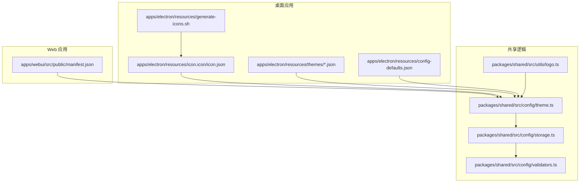
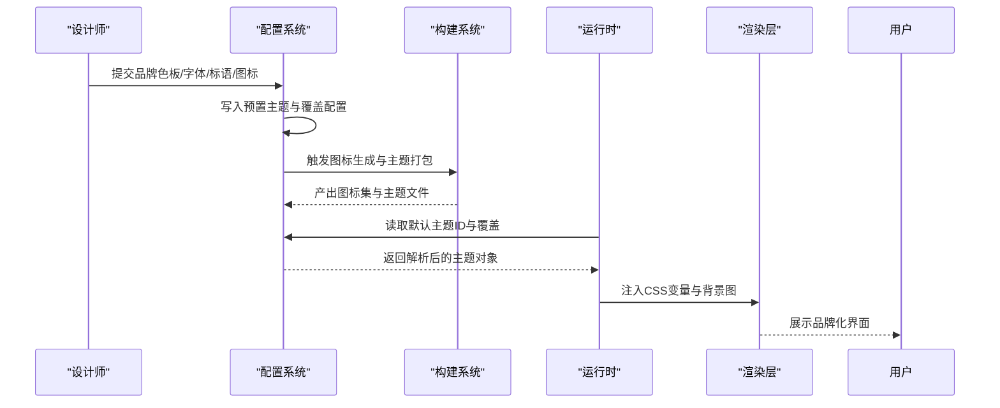
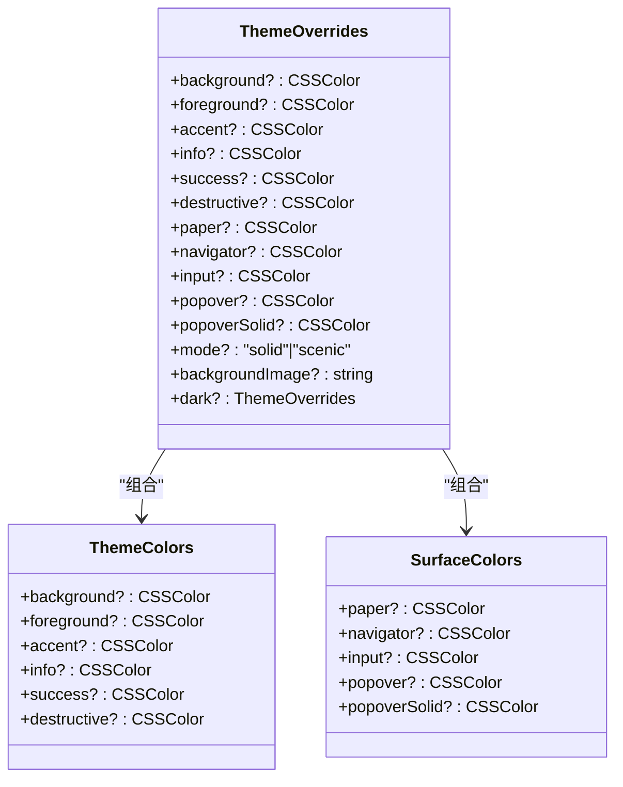
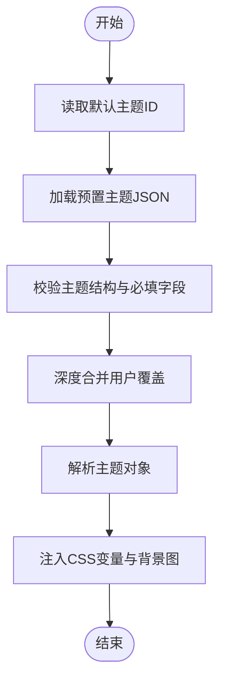
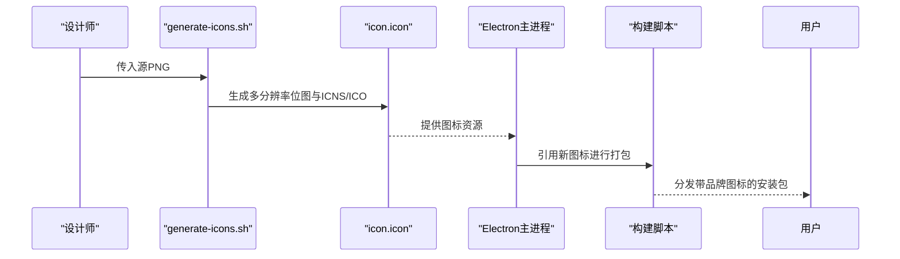
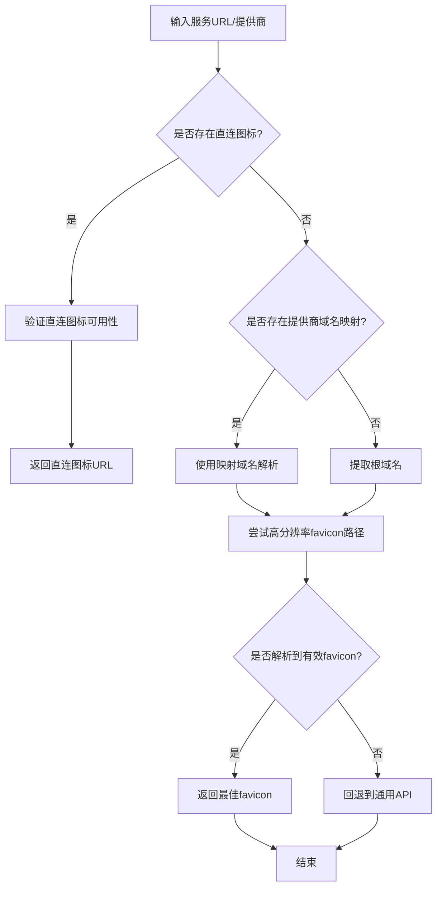
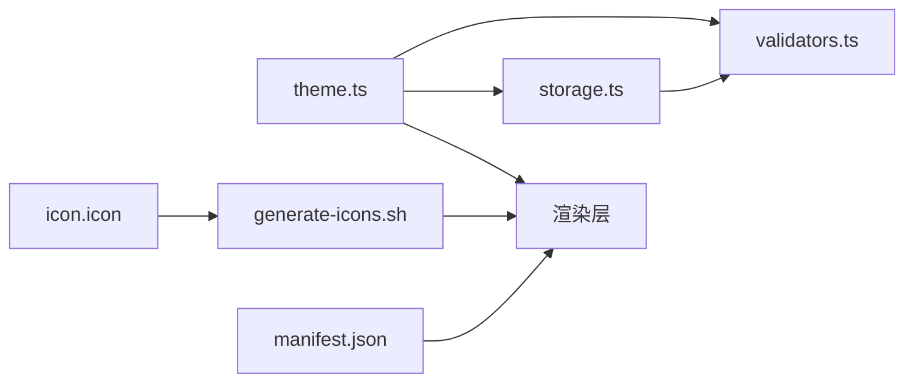

# 品牌定制

<cite>
**本文引用的文件**
- [apps/webui/src/public/manifest.json](file://apps/webui/src/public/manifest.json)
- [apps/electron/resources/icon.icon/icon.json](file://apps/electron/resources/icon.icon/icon.json)
- [apps/electron/resources/generate-icons.sh](file://apps/electron/resources/generate-icons.sh)
- [apps/electron/resources/themes/default.json](file://apps/electron/resources/themes/default.json)
- [apps/electron/resources/themes/catppuccin.json](file://apps/electron/resources/themes/catppuccin.json)
- [apps/electron/resources/themes/dracula.json](file://apps/electron/resources/themes/dracula.json)
- [apps/electron/resources/config-defaults.json](file://apps/electron/resources/config-defaults.json)
- [packages/shared/src/config/theme.ts](file://packages/shared/src/config/theme.ts)
- [packages/shared/src/config/storage.ts](file://packages/shared/src/config/storage.ts)
- [packages/shared/src/config/validators.ts](file://packages/shared/src/config/validators.ts)
- [packages/shared/src/utils/logo.ts](file://packages/shared/src/utils/logo.ts)
</cite>

## 目录
1. [简介](#简介)
2. [项目结构](#项目结构)
3. [核心组件](#核心组件)
4. [架构总览](#架构总览)
5. [详细组件分析](#详细组件分析)
6. [依赖关系分析](#依赖关系分析)
7. [性能考量](#性能考量)
8. [故障排查指南](#故障排查指南)
9. [结论](#结论)
10. [附录](#附录)

## 简介
本文件面向为企业客户定制应用外观的解决方案提供商与企业内部团队，系统化阐述品牌定制功能的设计与实现。内容覆盖品牌元素（Logo、Favicon、应用图标）的设计规范与落地方式；品牌色彩体系的建立与深浅色模式支持；品牌字体与标语的展示位置建议；品牌定制的配置项、动态替换机制与多品牌主题策略；从设计到实现的完整工作流程；以及响应式适配、跨平台差异与高分屏优化要点。同时提供合规性检查与版权注意事项，帮助在满足企业品牌一致性的同时规避法律风险。

## 项目结构
围绕品牌定制的关键文件主要分布在以下位置：
- Web 应用清单与图标：apps/webui/src/public/manifest.json
- 桌面端图标资源与生成脚本：apps/electron/resources/icon.icon/icon.json、apps/electron/resources/generate-icons.sh
- 预置主题与默认配置：apps/electron/resources/themes/*.json、apps/electron/resources/config-defaults.json
- 主题解析与存储：packages/shared/src/config/theme.ts、packages/shared/src/config/storage.ts、packages/shared/src/config/validators.ts
- Logo/Favicon 解析工具：packages/shared/src/utils/logo.ts

图表来源
- [apps/webui/src/public/manifest.json:1-14](file://apps/webui/src/public/manifest.json#L1-L14)
- [apps/electron/resources/icon.icon/icon.json:1-37](file://apps/electron/resources/icon.icon/icon.json#L1-L37)
- [apps/electron/resources/generate-icons.sh:1-77](file://apps/electron/resources/generate-icons.sh#L1-L77)
- [apps/electron/resources/themes/default.json:1-26](file://apps/electron/resources/themes/default.json#L1-L26)
- [apps/electron/resources/config-defaults.json:1-24](file://apps/electron/resources/config-defaults.json#L1-L24)
- [packages/shared/src/config/theme.ts:1-318](file://packages/shared/src/config/theme.ts#L1-L318)
- [packages/shared/src/config/storage.ts:1380-1470](file://packages/shared/src/config/storage.ts#L1380-L1470)
- [packages/shared/src/config/validators.ts:1537-1610](file://packages/shared/src/config/validators.ts#L1537-L1610)
- [packages/shared/src/utils/logo.ts:260-408](file://packages/shared/src/utils/logo.ts#L260-L408)

章节来源
- [apps/webui/src/public/manifest.json:1-14](file://apps/webui/src/public/manifest.json#L1-L14)
- [apps/electron/resources/icon.icon/icon.json:1-37](file://apps/electron/resources/icon.icon/icon.json#L1-L37)
- [apps/electron/resources/generate-icons.sh:1-77](file://apps/electron/resources/generate-icons.sh#L1-L77)
- [apps/electron/resources/themes/default.json:1-26](file://apps/electron/resources/themes/default.json#L1-L26)
- [apps/electron/resources/config-defaults.json:1-24](file://apps/electron/resources/config-defaults.json#L1-L24)
- [packages/shared/src/config/theme.ts:1-318](file://packages/shared/src/config/theme.ts#L1-L318)
- [packages/shared/src/config/storage.ts:1380-1470](file://packages/shared/src/config/storage.ts#L1380-L1470)
- [packages/shared/src/config/validators.ts:1537-1610](file://packages/shared/src/config/validators.ts#L1537-L1610)
- [packages/shared/src/utils/logo.ts:260-408](file://packages/shared/src/utils/logo.ts#L260-L408)

## 核心组件
- 主题系统与颜色模型
  - 支持语义色与表面色两层体系，覆盖背景、前景、强调色、信息/成功/破坏等语义色，以及纸张、导航栏、输入区、弹出层等区域色。
  - 提供深浅模式切换与深色模式覆盖，支持“纯色”与“风景”两种主题模式，其中风景模式可叠加背景图并保证弹出层不透明。
  - 默认主题采用现代 OKLCH 色彩空间，便于跨设备一致呈现。
- 预置主题与用户覆盖
  - 预置主题以 JSON 文件形式存放于应用主题目录，包含名称、描述、作者、许可证、支持模式、着色器主题映射等元数据。
  - 用户可通过应用级覆盖文件对预置主题进行局部覆盖，支持校验与深度合并。
- 图标与清单
  - Web 应用通过 Web App Manifest 定义应用名称、短名、启动路径、展示模式、背景色、主题色与图标集。
  - 桌面应用图标通过 icon.icon 资源定义矢量图层、阴影、高光等属性，并提供批量生成脚本以产出各平台所需尺寸。
- Logo/Favicon 解析
  - 提供高质量 Logo 获取能力，优先直连服务图标或解析页面头信息，最终回退至通用 API；同步版本直接返回通用 API 地址。
- 配置与选择
  - 默认主题 ID 存储于全局配置中，运行时根据当前模式解析主题并注入 CSS 变量，主进程使用十六进制背景色以兼容 CSS 不可用场景。

章节来源
- [packages/shared/src/config/theme.ts:12-318](file://packages/shared/src/config/theme.ts#L12-L318)
- [packages/shared/src/config/storage.ts:1380-1470](file://packages/shared/src/config/storage.ts#L1380-L1470)
- [packages/shared/src/config/validators.ts:1537-1610](file://packages/shared/src/config/validators.ts#L1537-L1610)
- [apps/webui/src/public/manifest.json:1-14](file://apps/webui/src/public/manifest.json#L1-L14)
- [apps/electron/resources/icon.icon/icon.json:1-37](file://apps/electron/resources/icon.icon/icon.json#L1-L37)
- [packages/shared/src/utils/logo.ts:260-408](file://packages/shared/src/utils/logo.ts#L260-L408)
- [apps/electron/resources/config-defaults.json:1-24](file://apps/electron/resources/config-defaults.json#L1-L24)

## 架构总览
品牌定制的端到端流程由“设计—配置—构建—运行—展示”构成。设计阶段完成品牌色板、字体与标语策略；配置阶段将品牌资产映射为主题与图标；构建阶段生成多分辨率图标与主题文件；运行阶段按当前模式解析主题并注入 CSS 变量；展示阶段在 Web 与桌面端分别通过清单与窗口设置呈现品牌元素。

图表来源
- [packages/shared/src/config/theme.ts:135-225](file://packages/shared/src/config/theme.ts#L135-L225)
- [packages/shared/src/config/storage.ts:1380-1470](file://packages/shared/src/config/storage.ts#L1380-L1470)
- [apps/electron/resources/generate-icons.sh:1-77](file://apps/electron/resources/generate-icons.sh#L1-L77)
- [apps/webui/src/public/manifest.json:1-14](file://apps/webui/src/public/manifest.json#L1-L14)

## 详细组件分析

### 组件一：主题系统与色彩体系
- 设计要点
  - 语义色用于传达交互状态与意图（如信息、成功、破坏），表面色用于控制特定 UI 区域的视觉层级。
  - 深浅模式通过深色覆盖实现差异化，确保对比度与可读性。
  - 风景模式启用全窗背景图，配合半透明玻璃面板，需保证弹出层不透明色。
- 数据结构与合并
  - 合并函数对顶层颜色键与深色覆盖进行深度合并，确保用户覆盖优先。
  - CSS 变量生成函数将主题映射为 --brand 变量，主进程使用十六进制背景色以兼容环境限制。
- 复杂度与性能
  - 合并与变量生成均为 O(k)（k 为颜色键数量），开销极低。
  - 风景模式仅在需要时加载背景图，避免不必要的渲染负担。

图表来源
- [packages/shared/src/config/theme.ts:25-72](file://packages/shared/src/config/theme.ts#L25-L72)

章节来源
- [packages/shared/src/config/theme.ts:74-225](file://packages/shared/src/config/theme.ts#L74-L225)
- [packages/shared/src/config/storage.ts:1380-1403](file://packages/shared/src/config/storage.ts#L1380-L1403)

### 组件二：预置主题与多品牌支持
- 预置主题
  - 以 JSON 文件形式提供，包含名称、描述、作者、许可证、支持模式、着色器主题映射等元数据。
  - 支持重置为内置默认版本，便于统一管理与回滚。
- 多品牌策略
  - 通过主题 ID 切换不同品牌预置主题；用户覆盖文件可对任一预置主题进行局部调整。
  - 默认主题 ID 保存在全局配置中，启动时读取并解析。

图表来源
- [apps/electron/resources/themes/default.json:1-26](file://apps/electron/resources/themes/default.json#L1-L26)
- [apps/electron/resources/themes/catppuccin.json:1-27](file://apps/electron/resources/themes/catppuccin.json#L1-L27)
- [apps/electron/resources/themes/dracula.json:1-27](file://apps/electron/resources/themes/dracula.json#L1-L27)
- [packages/shared/src/config/storage.ts:1380-1443](file://packages/shared/src/config/storage.ts#L1380-L1443)
- [packages/shared/src/config/validators.ts:1582-1610](file://packages/shared/src/config/validators.ts#L1582-L1610)

章节来源
- [apps/electron/resources/themes/default.json:1-26](file://apps/electron/resources/themes/default.json#L1-L26)
- [apps/electron/resources/themes/catppuccin.json:1-27](file://apps/electron/resources/themes/catppuccin.json#L1-L27)
- [apps/electron/resources/themes/dracula.json:1-27](file://apps/electron/resources/themes/dracula.json#L1-L27)
- [packages/shared/src/config/storage.ts:1412-1443](file://packages/shared/src/config/storage.ts#L1412-L1443)
- [packages/shared/src/config/validators.ts:1582-1610](file://packages/shared/src/config/validators.ts#L1582-L1610)

### 组件三：图标与清单（Web/桌面）
- Web 应用清单
  - 定义应用名称、短名、描述、启动路径、展示模式、背景色、主题色与图标数组，确保 PWA 在不同设备上正确呈现。
- 桌面应用图标
  - icon.icon 资源定义矢量图层、阴影、高光与支持平台；generate-icons.sh 脚本自动生成 macOS、Linux、Windows 所需尺寸。
  - 生成后需更新主进程入口以使用新图标，并重新打包资源。

图表来源
- [apps/webui/src/public/manifest.json:1-14](file://apps/webui/src/public/manifest.json#L1-L14)
- [apps/electron/resources/icon.icon/icon.json:1-37](file://apps/electron/resources/icon.icon/icon.json#L1-L37)
- [apps/electron/resources/generate-icons.sh:1-77](file://apps/electron/resources/generate-icons.sh#L1-L77)

章节来源
- [apps/webui/src/public/manifest.json:1-14](file://apps/webui/src/public/manifest.json#L1-L14)
- [apps/electron/resources/icon.icon/icon.json:1-37](file://apps/electron/resources/icon.icon/icon.json#L1-L37)
- [apps/electron/resources/generate-icons.sh:1-77](file://apps/electron/resources/generate-icons.sh#L1-L77)

### 组件四：Logo/Favicon 动态解析
- 优先级策略
  - 先尝试直连服务图标（最高优先级），再解析页面 head 中的 favicon 链接，最后回退到通用 API。
  - 对于已知提供商，可使用域名映射提升命中率。
- 缓存与稳定性
  - 推荐将解析结果缓存在源配置中，避免重复请求与网络波动影响。
- 使用建议
  - 高质量场景优先调用异步解析函数；同步场景使用通用 API 返回地址。

图表来源
- [packages/shared/src/utils/logo.ts:292-408](file://packages/shared/src/utils/logo.ts#L292-L408)

章节来源
- [packages/shared/src/utils/logo.ts:260-408](file://packages/shared/src/utils/logo.ts#L260-L408)

## 依赖关系分析
- 主题解析依赖存储与校验模块，确保主题文件合法且可合并。
- 运行时将主题解析结果注入 CSS 变量，渲染层据此绘制界面。
- 图标生成脚本依赖系统工具链（macOS sips、iconutil、ImageMagick），生成后由主进程消费。
- Web 清单与桌面图标共同决定应用在不同平台的呈现形态。

图表来源
- [packages/shared/src/config/theme.ts:135-225](file://packages/shared/src/config/theme.ts#L135-L225)
- [packages/shared/src/config/validators.ts:1537-1610](file://packages/shared/src/config/validators.ts#L1537-L1610)
- [packages/shared/src/config/storage.ts:1380-1470](file://packages/shared/src/config/storage.ts#L1380-L1470)
- [apps/electron/resources/icon.icon/icon.json:1-37](file://apps/electron/resources/icon.icon/icon.json#L1-L37)
- [apps/electron/resources/generate-icons.sh:1-77](file://apps/electron/resources/generate-icons.sh#L1-L77)
- [apps/webui/src/public/manifest.json:1-14](file://apps/webui/src/public/manifest.json#L1-L14)

章节来源
- [packages/shared/src/config/theme.ts:1-318](file://packages/shared/src/config/theme.ts#L1-L318)
- [packages/shared/src/config/storage.ts:1380-1470](file://packages/shared/src/config/storage.ts#L1380-L1470)
- [packages/shared/src/config/validators.ts:1537-1610](file://packages/shared/src/config/validators.ts#L1537-L1610)
- [apps/electron/resources/icon.icon/icon.json:1-37](file://apps/electron/resources/icon.icon/icon.json#L1-L37)
- [apps/electron/resources/generate-icons.sh:1-77](file://apps/electron/resources/generate-icons.sh#L1-L77)
- [apps/webui/src/public/manifest.json:1-14](file://apps/webui/src/public/manifest.json#L1-L14)

## 性能考量
- 主题解析与变量注入为常数时间操作，对启动时延影响可忽略。
- 风景模式背景图应采用压缩格式与合适尺寸，避免过大导致首屏卡顿。
- 图标生成脚本在 CI 中执行一次即可，避免在运行时重复生成。
- Logo/Favicon 解析建议开启缓存，减少网络请求与解析成本。

## 故障排查指南
- 主题未生效
  - 检查默认主题 ID 是否正确写入配置；确认预置主题文件存在且结构合法；核对用户覆盖是否触发校验失败。
- 风景模式背景图不显示
  - 确认主题 mode 设置为 scenic 且提供了有效的背景图 URL；检查 URL 可达性与格式。
- 图标缺失或模糊
  - 确认 generate-icons.sh 已执行并生成目标平台所需尺寸；检查主进程入口是否引用了新图标；在 Windows 上若无 ImageMagick，需手动转换或在线转换。
- Logo/Favicon 解析失败
  - 检查网络可达性与缓存；确认提供商映射是否仍有效；必要时回退到通用 API 并记录错误日志。

章节来源
- [packages/shared/src/config/storage.ts:1380-1470](file://packages/shared/src/config/storage.ts#L1380-L1470)
- [packages/shared/src/config/validators.ts:1570-1580](file://packages/shared/src/config/validators.ts#L1570-L1580)
- [apps/electron/resources/generate-icons.sh:43-64](file://apps/electron/resources/generate-icons.sh#L43-L64)
- [packages/shared/src/utils/logo.ts:292-367](file://packages/shared/src/utils/logo.ts#L292-L367)

## 结论
本方案以“主题 JSON + 覆盖配置 + 多分辨率图标 + 清单定义”的组合，实现了从设计到运行的闭环品牌定制。通过语义色与表面色的双层体系、深浅模式与风景模式的灵活切换，以及严格的校验与合并策略，既保证了品牌一致性，又兼顾了可维护性与性能。结合图标生成脚本与 Logo/Favicon 解析工具，可在多平台稳定呈现企业品牌。

## 附录

### 品牌定制工作流程（设计到实现）
- 设计阶段
  - 确定品牌色板（主色、辅助色、语义色）、品牌字体与标语策略。
  - 准备多分辨率品牌图标（PNG/SVG）与 Web App Manifest 所需图标集。
- 配置阶段
  - 将品牌色板映射为主题 JSON，编写预置主题文件；在应用默认配置中设置默认主题 ID。
  - 如需微调，编写应用级覆盖文件，仅覆盖必要字段并通过校验。
- 构建阶段
  - 使用图标生成脚本产出各平台所需尺寸；更新主进程入口引用新图标；打包资源。
- 运行阶段
  - 启动时读取默认主题 ID，加载预置主题与用户覆盖，解析为主题对象并注入 CSS 变量；在 Web 端通过清单呈现品牌图标与颜色。
- 验收与迭代
  - 在多设备与多分辨率下验证品牌元素一致性；根据反馈迭代主题与图标。

章节来源
- [apps/electron/resources/config-defaults.json:1-24](file://apps/electron/resources/config-defaults.json#L1-L24)
- [apps/electron/resources/themes/default.json:1-26](file://apps/electron/resources/themes/default.json#L1-L26)
- [apps/electron/resources/generate-icons.sh:1-77](file://apps/electron/resources/generate-icons.sh#L1-L77)
- [apps/webui/src/public/manifest.json:1-14](file://apps/webui/src/public/manifest.json#L1-L14)
- [packages/shared/src/config/theme.ts:135-225](file://packages/shared/src/config/theme.ts#L135-L225)

### 响应式适配与跨平台差异
- Web 端
  - 使用 Web App Manifest 的 icons 数组提供多尺寸图标；通过 display、background_color、theme_color 控制 PWA 行为与外观。
- 桌面端
  - macOS 使用 ICNS；Linux 使用 PNG；Windows 使用 ICO 或多尺寸 PNG；生成脚本自动处理尺寸与格式。
- 高分辨率显示
  - 生成脚本包含@2x尺寸；图标资源与主题背景图均应提供高分辨率版本以适配 Retina 显示。

章节来源
- [apps/webui/src/public/manifest.json:1-14](file://apps/webui/src/public/manifest.json#L1-L14)
- [apps/electron/resources/generate-icons.sh:22-64](file://apps/electron/resources/generate-icons.sh#L22-L64)

### 品牌合规性与版权注意事项
- 字体与图标
  - 使用自有版权字体或具备商用授权的开源字体；图标应遵循来源许可，避免侵权。
- Logo/Favicon
  - 优先使用自有品牌素材；若使用第三方 API 获取，需遵守服务条款与缓存策略，避免滥用。
- 主题与样式
  - 严格遵守主题校验规则，避免引入不受支持的颜色格式或非法字段；确保深浅模式对比度符合可访问性标准。
- 商标保护
  - 在应用名称、短名与描述中谨慎使用第三方商标；若涉及商标使用，应获得授权并在显著位置标注。

章节来源
- [packages/shared/src/config/validators.ts:1537-1610](file://packages/shared/src/config/validators.ts#L1537-L1610)
- [packages/shared/src/utils/logo.ts:292-367](file://packages/shared/src/utils/logo.ts#L292-L367)