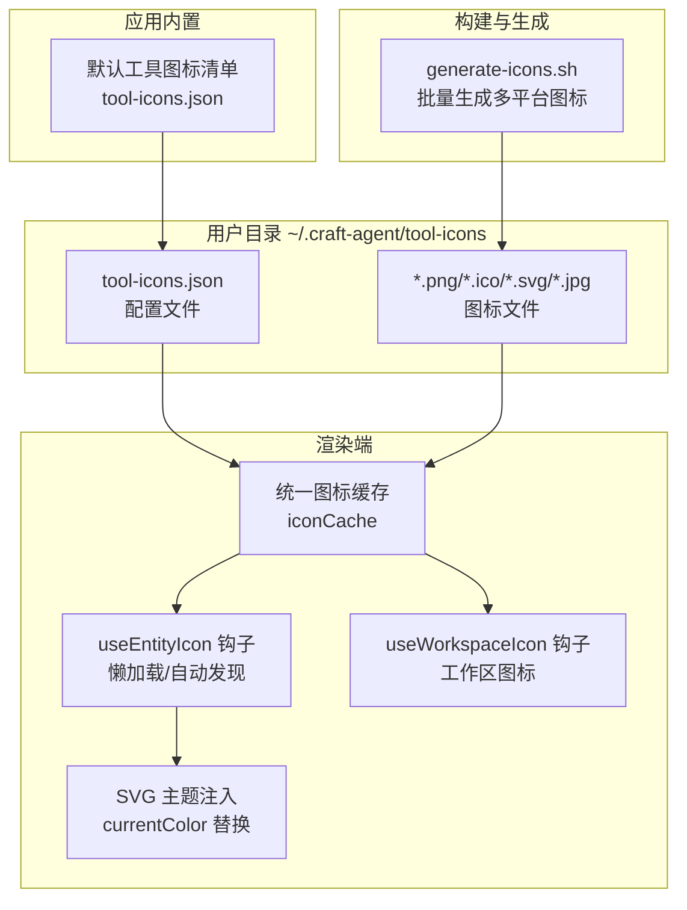
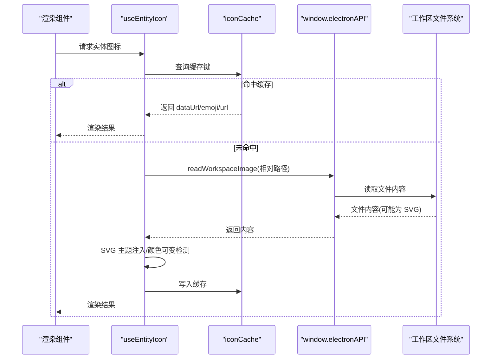
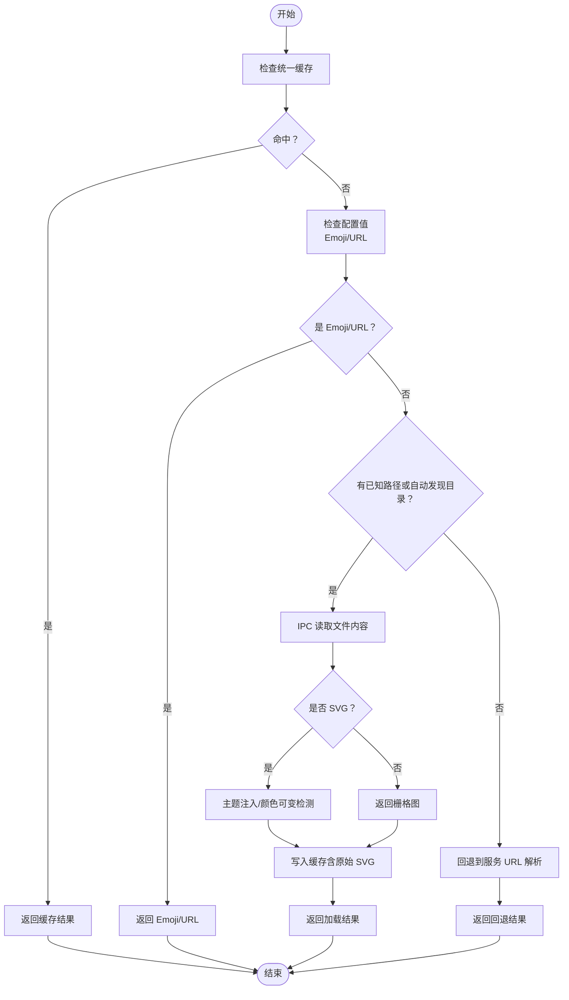
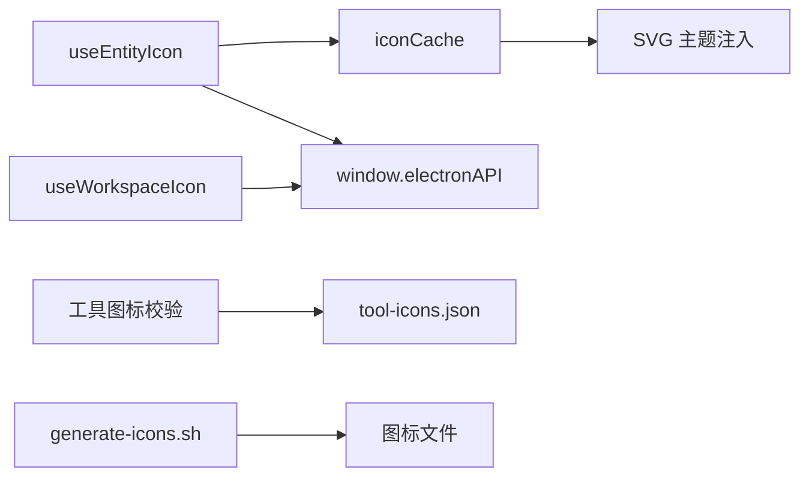

# 工具图标

<cite>
**本文引用的文件**
- [工具图标配置说明](file://apps/electron/resources/docs/tool-icons.md)
- [工具图标默认配置](file://apps/electron/resources/tool-icons/tool-icons.json)
- [图标生成脚本](file://apps/electron/resources/generate-icons.sh)
- [统一图标缓存与实体图标钩子](file://apps/electron/src/renderer/lib/icon-cache.ts)
- [工作区图标加载钩子](file://apps/electron/src/renderer/hooks/useWorkspaceIcon.ts)
- [提供商图标映射](file://apps/electron/src/renderer/lib/provider-icons.ts)
- [工具图标配置校验（共享包）](file://packages/shared/src/config/validators.ts)
</cite>

## 目录
1. [简介](#简介)
2. [项目结构](#项目结构)
3. [核心组件](#核心组件)
4. [架构总览](#架构总览)
5. [详细组件分析](#详细组件分析)
6. [依赖关系分析](#依赖关系分析)
7. [性能考量](#性能考量)
8. [故障排查指南](#故障排查指南)
9. [结论](#结论)
10. [附录](#附录)

## 简介
本文件面向需要定制工具图标或开发企业图标的设计师与开发者，系统化阐述工具图标系统的配置结构、图标映射机制、动态加载策略、文件格式与尺寸规范、生成脚本与自动化流程、缓存与懒加载机制、主题适配与颜色变体、状态图标处理、验证规则与兼容性检查、错误恢复机制，并提供自定义开发指南与最佳实践。

## 项目结构
工具图标系统主要由以下部分组成：
- 用户可编辑的工具图标配置：位于用户目录下的工具图标配置文件与图标资源文件。
- 默认内置工具图标清单：随应用分发，首次运行时写入用户目录并保留不被覆盖。
- 图标生成脚本：用于从源图像批量生成多平台图标资源。
- 渲染端图标缓存与加载：统一缓存、懒加载、SVG 主题注入、颜色可变检测与内联渲染。
- 配置校验：对 JSON 结构、重复项、命令冲突、文件存在性进行校验与告警。

图表来源
- [工具图标配置说明:1-94](file://apps/electron/resources/docs/tool-icons.md#L1-L94)
- [工具图标默认配置:1-61](file://apps/electron/resources/tool-icons/tool-icons.json#L1-L61)
- [图标生成脚本:1-77](file://apps/electron/resources/generate-icons.sh#L1-L77)
- [统一图标缓存与实体图标钩子:1-746](file://apps/electron/src/renderer/lib/icon-cache.ts#L1-L746)
- [工作区图标加载钩子:1-212](file://apps/electron/src/renderer/hooks/useWorkspaceIcon.ts#L1-L212)

章节来源
- [工具图标配置说明:1-94](file://apps/electron/resources/docs/tool-icons.md#L1-L94)
- [工具图标默认配置:1-61](file://apps/electron/resources/tool-icons/tool-icons.json#L1-L61)
- [图标生成脚本:1-77](file://apps/electron/resources/generate-icons.sh#L1-L77)
- [统一图标缓存与实体图标钩子:1-746](file://apps/electron/src/renderer/lib/icon-cache.ts#L1-L746)
- [工作区图标加载钩子:1-212](file://apps/electron/src/renderer/hooks/useWorkspaceIcon.ts#L1-L212)

## 核心组件
- 工具图标配置与映射
  - 配置文件位置与结构：版本号、工具条目数组，每个条目包含唯一标识、显示名、图标文件名、命令列表。
  - 命令匹配策略：解析复杂 Bash 字符串，优先识别首个已知命令以决定图标。
  - 内置默认集：约 57 个常用 CLI 工具图标，首次运行写入用户目录且不被覆盖。
- 图标文件格式与尺寸
  - 支持格式：PNG（首选）、ICO、SVG、JPG。
  - 推荐尺寸：64x64 或 128x128 像素；UI 中通常以 20x20 显示，建议保持简洁易辨识。
- 动态加载与缓存
  - 统一缓存：按类型前缀区分键空间，避免冲突；支持同步查询与异步加载。
  - 懒加载：通过钩子在需要时才发起 IPC 读取与 SVG 主题注入。
  - 颜色可变性：检测 SVG 是否使用当前颜色，若可变则缓存原始 SVG 以便内联渲染时继承主题色。
- 主题适配与颜色变体
  - 当前前景色获取：从 CSS 自定义属性读取，回退到深色主题默认值。
  - SVG 注入：将 currentColor 替换为主题色，必要时为根元素添加 fill 属性。
- 错误恢复与兼容性
  - 文件缺失静默回退：IPC 返回空表示不存在，上层逻辑返回空或降级图标。
  - 多格式自动发现：按扩展名并行探测，优先返回 SVG/PNG/JPG/JPEG。
  - URL 与 Emoji 优先：配置中直接给出 URL 或 Emoji 时跳过本地文件加载。

章节来源
- [工具图标配置说明:15-94](file://apps/electron/resources/docs/tool-icons.md#L15-L94)
- [工具图标默认配置:1-61](file://apps/electron/resources/tool-icons/tool-icons.json#L1-L61)
- [统一图标缓存与实体图标钩子:1-746](file://apps/electron/src/renderer/lib/icon-cache.ts#L1-L746)
- [工作区图标加载钩子:1-212](file://apps/electron/src/renderer/hooks/useWorkspaceIcon.ts#L1-L212)

## 架构总览
工具图标系统采用“配置驱动 + 统一缓存 + 懒加载 + 主题注入”的架构。渲染端通过钩子与缓存模块实现跨实体类型的图标加载，IPC 负责安全地从工作区读取文件并转换为数据 URL，SVG 在注入主题色后可用于 img 标签或内联渲染。

图表来源
- [统一图标缓存与实体图标钩子:530-645](file://apps/electron/src/renderer/lib/icon-cache.ts#L530-L645)
- [工作区图标加载钩子:86-117](file://apps/electron/src/renderer/hooks/useWorkspaceIcon.ts#L86-L117)

章节来源
- [统一图标缓存与实体图标钩子:530-645](file://apps/electron/src/renderer/lib/icon-cache.ts#L530-L645)
- [工作区图标加载钩子:86-117](file://apps/electron/src/renderer/hooks/useWorkspaceIcon.ts#L86-L117)

## 详细组件分析

### 工具图标配置与映射
- 配置结构要点
  - 版本号：用于未来升级兼容性。
  - 工具条目字段：唯一标识、显示名、图标文件名、命令数组。
- 命令匹配规则
  - 支持简单命令、链式命令（&&、||）、环境变量前缀、sudo/time 前缀、路径前缀、管道等复杂 Bash 场景，取第一个识别出的命令作为匹配依据。
- 内置默认集
  - 包含常见 CLI 工具（如 git、npm、docker、python、rust、aws、gcloud、azure、vercel、netlify、flyio、cloudflare、heroku、stripe、firebase、supabase、sentry、1password、ngrok、gnumake、cmake、turborepo、nx、jest、vitest、pytest、eslint、prettier、webpack、vite、esbuild、postgresql、mysql、redis、sqlite、mongodb、jq、curl、openssh、xcode、cocoapods 等），首次运行写入用户目录，更新不会覆盖用户自定义。
- 文件组织与格式
  - 图标文件与配置文件同目录，支持 PNG、ICO、SVG、JPG；推荐 PNG 并透明背景，尺寸 64x64 或 128x128，UI 以 20x20 显示。

章节来源
- [工具图标配置说明:15-94](file://apps/electron/resources/docs/tool-icons.md#L15-L94)
- [工具图标默认配置:1-61](file://apps/electron/resources/tool-icons/tool-icons.json#L1-L61)

### 图标生成脚本与自动化
- 脚本功能
  - 从单张源图生成多平台所需图标：macOS（.icns）、Linux（512x512 PNG）、Windows（.ico，若安装 ImageMagick）。
  - 使用系统工具生成不同尺寸，清理临时文件，输出生成结果与后续步骤提示。
- 使用方式
  - 提供源文件路径参数；若未提供则使用默认文件名。
  - 生成完成后提示更新主进程代码中的图标引用与重新打包资源。

章节来源
- [图标生成脚本:1-77](file://apps/electron/resources/generate-icons.sh#L1-L77)

### 统一图标缓存与实体图标钩子
- 缓存设计
  - 单一 Map 作为统一缓存，键格式包含类型前缀与工作区 ID，避免实体类型间冲突。
  - 分离 logoUrlCache 用于服务 URL 到图标 URL 的解析缓存。
  - 提供向后兼容的代理对象，逐步迁移至统一缓存。
- 加载流程
  - 优先级：Emoji、显式本地路径、URL、自动发现、回退到服务 URL 解析。
  - 对 SVG 进行主题注入与颜色可变性检测，必要时缓存原始 SVG 以便内联渲染。
  - useEntityIcon 作为统一入口，支持传入已知相对路径、自动发现目录、覆盖文件名等选项。
- 性能特性
  - 并行探测多种扩展名，减少 IPC 往返次数。
  - 同步查询缓存，异步加载时避免重复请求。
  - 对 SVG 使用数据 URL，便于 img 标签直接渲染；对可变 SVG 同时保存原始内容以支持内联渲染。

图表来源
- [统一图标缓存与实体图标钩子:172-277](file://apps/electron/src/renderer/lib/icon-cache.ts#L172-L277)
- [统一图标缓存与实体图标钩子:303-357](file://apps/electron/src/renderer/lib/icon-cache.ts#L303-L357)
- [统一图标缓存与实体图标钩子:670-702](file://apps/electron/src/renderer/lib/icon-cache.ts#L670-L702)
- [统一图标缓存与实体图标钩子:726-745](file://apps/electron/src/renderer/lib/icon-cache.ts#L726-L745)

章节来源
- [统一图标缓存与实体图标钩子:54-148](file://apps/electron/src/renderer/lib/icon-cache.ts#L54-L148)
- [统一图标缓存与实体图标钩子:172-277](file://apps/electron/src/renderer/lib/icon-cache.ts#L172-L277)
- [统一图标缓存与实体图标钩子:303-357](file://apps/electron/src/renderer/lib/icon-cache.ts#L303-L357)
- [统一图标缓存与实体图标钩子:402-437](file://apps/electron/src/renderer/lib/icon-cache.ts#L402-L437)
- [统一图标缓存与实体图标钩子:670-702](file://apps/electron/src/renderer/lib/icon-cache.ts#L670-L702)
- [统一图标缓存与实体图标钩子:726-745](file://apps/electron/src/renderer/lib/icon-cache.ts#L726-L745)

### 工作区图标加载钩子
- 设计目标
  - 将工作区图标（可能为 file://）转换为可在渲染端使用的数据 URL，绕过 CSP 限制。
- 关键点
  - 缓存同一工作区的图标，避免重复 IPC。
  - 对 SVG 自动转为数据 URL，对非 SVG 直接使用返回值。
  - 批量加载接口一次发起多个请求，提升效率。

章节来源
- [工作区图标加载钩子:14-120](file://apps/electron/src/renderer/hooks/useWorkspaceIcon.ts#L14-L120)
- [工作区图标加载钩子:129-211](file://apps/electron/src/renderer/hooks/useWorkspaceIcon.ts#L129-L211)

### 主题适配与颜色变体
- 前景色获取
  - 从 CSS 自定义属性读取当前主题前景色，无可用值时回退到深色主题默认值。
- SVG 注入
  - 将所有 currentColor 替换为主题色，必要时为根 SVG 元素添加 fill 属性，确保在背景图场景下正确显示。
- 可变性检测
  - 若 SVG 使用 currentColor，则视为可变，同时缓存原始 SVG 以便内联渲染时继承 CSS 颜色类。

章节来源
- [统一图标缓存与实体图标钩子:376-437](file://apps/electron/src/renderer/lib/icon-cache.ts#L376-L437)
- [统一图标缓存与实体图标钩子:681-694](file://apps/electron/src/renderer/lib/icon-cache.ts#L681-L694)

### 配置校验与兼容性检查
- 内容校验
  - JSON 语法、Zod 模式校验、重复 ID、命令重复（警告）。
- 文件存在性检查
  - 遍历配置中引用的图标文件，若不存在则发出警告并建议放置到用户目录。
- 兼容性与错误恢复
  - 配置缺失视为警告并使用默认行为；文件不存在静默回退；URL 与 Emoji 优先于本地文件。

章节来源
- [工具图标配置校验（共享包）:1736-1900](file://packages/shared/src/config/validators.ts#L1736-L1900)

### 自定义图标开发指南
- 设计规范
  - 简洁易辨识，适合 20x20 显示；推荐透明背景 PNG。
  - 尺寸建议 64x64 或 128x128，矢量 SVG 更佳。
- 命名约定
  - 工具 ID 使用短横线分隔的 slug；图标文件名与配置中 icon 字段一致。
- 文件组织
  - 将图标文件与 tool-icons.json 放在同一目录（用户目录 ~/.craft-agent/tool-icons）。
- 添加新工具
  - 在配置中新增条目，包含唯一 ID、显示名、图标文件名、命令数组。
  - 重启应用或开启新会话使变更生效。
- 多命令映射
  - 一个工具可映射多个命令，但建议避免命令重复以减少歧义。

章节来源
- [工具图标配置说明:42-94](file://apps/electron/resources/docs/tool-icons.md#L42-L94)
- [工具图标默认配置:1-61](file://apps/electron/resources/tool-icons/tool-icons.json#L1-L61)

### 状态图标处理
- 状态图标通常使用标识性文件名（如以状态 ID 命名），通过 useEntityIcon 的文件名覆盖选项进行自动发现。
- 与实体图标一致的缓存与主题注入流程。

章节来源
- [统一图标缓存与实体图标钩子:472-509](file://apps/electron/src/renderer/lib/icon-cache.ts#L472-L509)
- [统一图标缓存与实体图标钩子:726-745](file://apps/electron/src/renderer/lib/icon-cache.ts#L726-L745)

## 依赖关系分析
- 渲染端依赖
  - useEntityIcon 依赖 iconCache 与 IPC；对 SVG 进行主题注入与颜色可变性检测。
  - useWorkspaceIcon 依赖 IPC 与模块级缓存，负责工作区图标的数据 URL 转换。
- 配置与校验
  - 共享包 validators 提供工具图标配置的 JSON 结构与语义校验，确保重复 ID、命令冲突、文件存在性等问题被提前发现。
- 构建与生成
  - generate-icons.sh 依赖系统工具（sips、iconutil、convert/ImageMagick）生成多平台图标资源。

图表来源
- [统一图标缓存与实体图标钩子:530-645](file://apps/electron/src/renderer/lib/icon-cache.ts#L530-L645)
- [工作区图标加载钩子:86-117](file://apps/electron/src/renderer/hooks/useWorkspaceIcon.ts#L86-L117)
- [工具图标配置校验（共享包）:1736-1900](file://packages/shared/src/config/validators.ts#L1736-L1900)
- [图标生成脚本:1-77](file://apps/electron/resources/generate-icons.sh#L1-L77)

章节来源
- [统一图标缓存与实体图标钩子:530-645](file://apps/electron/src/renderer/lib/icon-cache.ts#L530-L645)
- [工作区图标加载钩子:86-117](file://apps/electron/src/renderer/hooks/useWorkspaceIcon.ts#L86-L117)
- [工具图标配置校验（共享包）:1736-1900](file://packages/shared/src/config/validators.ts#L1736-L1900)
- [图标生成脚本:1-77](file://apps/electron/resources/generate-icons.sh#L1-L77)

## 性能考量
- 缓存策略
  - 统一缓存键带类型前缀，避免冲突；模块级缓存用于工作区图标批量加载。
  - 对 SVG 的颜色可变性与原始内容进行分离缓存，兼顾渲染性能与主题一致性。
- 懒加载与并发
  - useEntityIcon 在未命中缓存时才发起 IPC；自动发现阶段并行探测多种扩展名，减少往返。
- 资源体积
  - SVG 注入主题色后以数据 URL 形式传输，避免额外网络请求；对非 SVG 直接复用 IPC 返回值。
- 渲染优化
  - 可变 SVG 仅在需要内联渲染时使用原始内容，否则使用数据 URL，降低 DOM 复杂度。

章节来源
- [统一图标缓存与实体图标钩子:113-148](file://apps/electron/src/renderer/lib/icon-cache.ts#L113-L148)
- [统一图标缓存与实体图标钩子:734-745](file://apps/electron/src/renderer/lib/icon-cache.ts#L734-L745)
- [工作区图标加载钩子:129-211](file://apps/electron/src/renderer/hooks/useWorkspaceIcon.ts#L129-L211)

## 故障排查指南
- 配置问题
  - JSON 语法错误：校验器会报告具体路径与信息；修正后重试。
  - 重复 ID 或命令冲突：根据告警修改唯一性约束。
  - 引用图标文件不存在：将对应图标文件放入用户目录对应路径。
- 图标不显示
  - 检查配置中 icon 字段与实际文件扩展名是否一致；确认文件存在于用户目录。
  - 若使用 URL 或 Emoji，确认配置值格式正确。
- 主题色异常
  - 确认 CSS 自定义属性中存在前景色定义；若为空，将使用默认深色主题色。
- 生成脚本失败
  - 确认系统工具（sips、iconutil、convert）可用；按脚本提示安装依赖或手动转换 ICO。

章节来源
- [工具图标配置校验（共享包）:1748-1900](file://packages/shared/src/config/validators.ts#L1748-L1900)
- [统一图标缓存与实体图标钩子:376-437](file://apps/electron/src/renderer/lib/icon-cache.ts#L376-L437)
- [图标生成脚本:43-64](file://apps/electron/resources/generate-icons.sh#L43-L64)

## 结论
工具图标系统通过“配置驱动 + 统一缓存 + 懒加载 + 主题注入”实现了高可维护性与高性能的图标体验。开发者与设计师可基于本文档快速完成自定义图标开发、批量生成与集成，同时借助校验与错误恢复机制保障稳定性与兼容性。

## 附录
- 相关资产与图标映射
  - 提供商图标映射：集中管理主流 LLM 提供商的 SVG 资源，支持从 URL 或上游提供商推断图标。
- 常见问题速查
  - 命令匹配优先级与复杂 Bash 场景处理。
  - 内置默认工具图标集合与首次运行写入机制。

章节来源
- [提供商图标映射:1-211](file://apps/electron/src/renderer/lib/provider-icons.ts#L1-L211)
- [工具图标配置说明:58-94](file://apps/electron/resources/docs/tool-icons.md#L58-L94)
- [工具图标默认配置:1-61](file://apps/electron/resources/tool-icons/tool-icons.json#L1-L61)