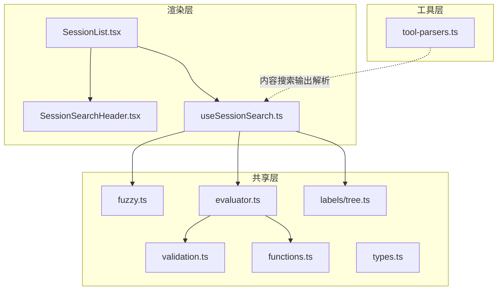
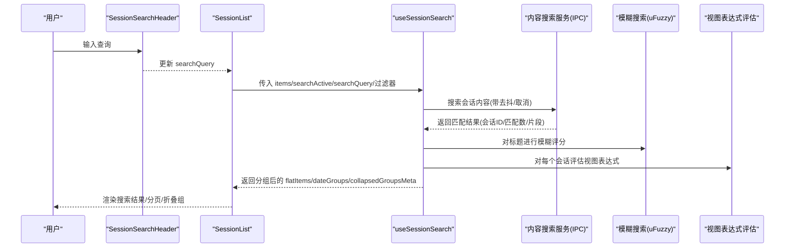
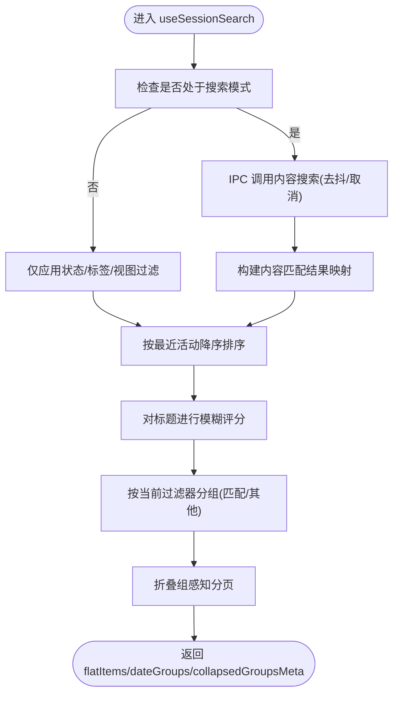
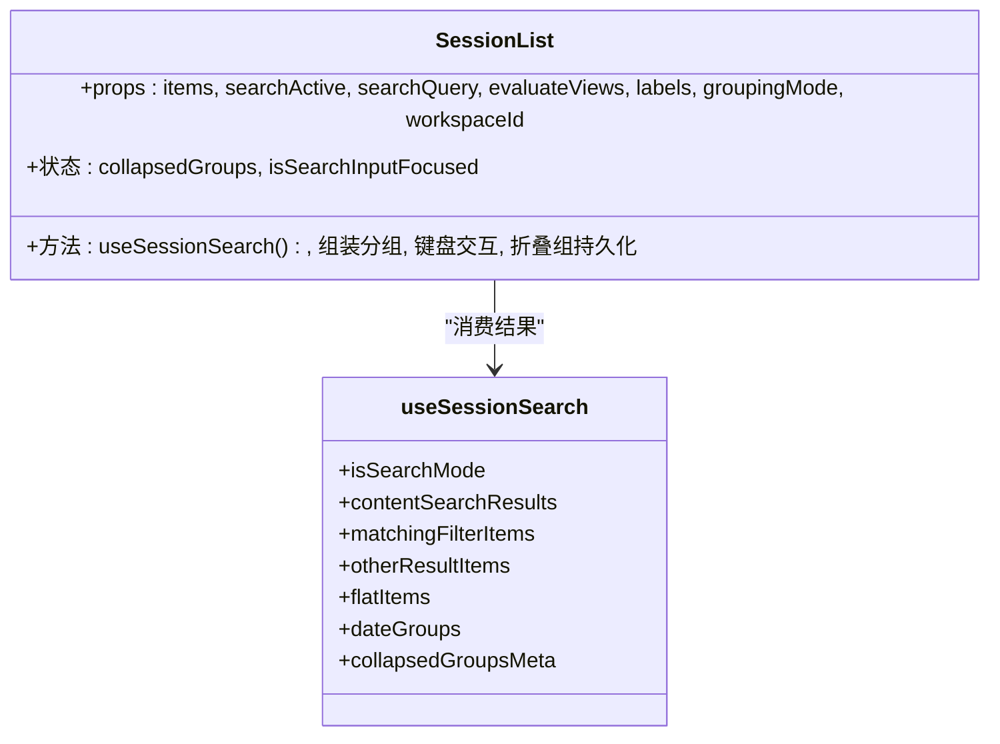
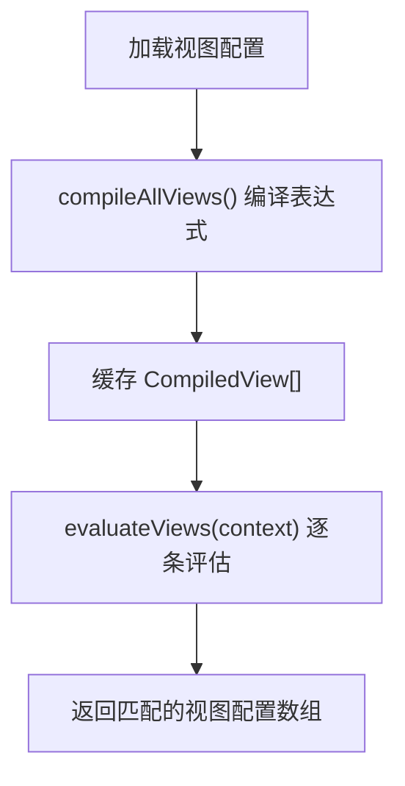
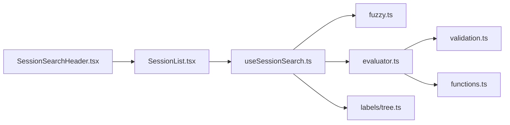

# 会话搜索和过滤

<cite>
**本文引用的文件**
- [apps/electron/src/renderer/hooks/useSessionSearch.ts](file://apps/electron/src/renderer/hooks/useSessionSearch.ts)
- [apps/electron/src/renderer/components/app-shell/SessionList.tsx](file://apps/electron/src/renderer/components/app-shell/SessionList.tsx)
- [apps/electron/src/renderer/components/app-shell/SessionSearchHeader.tsx](file://apps/electron/src/renderer/components/app-shell/SessionSearchHeader.tsx)
- [apps/electron/src/renderer/utils/session.ts](file://apps/electron/src/renderer/utils/session.ts)
- [packages/shared/src/search/fuzzy.ts](file://packages/shared/src/search/fuzzy.ts)
- [packages/shared/src/search/index.ts](file://packages/shared/src/search/index.ts)
- [packages/shared/src/views/validation.ts](file://packages/shared/src/views/validation.ts)
- [packages/shared/src/views/evaluator.ts](file://packages/shared/src/views/evaluator.ts)
- [packages/shared/src/views/functions.ts](file://packages/shared/src/views/functions.ts)
- [packages/shared/src/views/types.ts](file://packages/shared/src/views/types.ts)
- [packages/shared/src/labels/tree.ts](file://packages/shared/src/labels/tree.ts)
- [packages/ui/src/lib/tool-parsers.ts](file://packages/ui/src/lib/tool-parsers.ts)
</cite>

## 目录
1. [简介](#简介)
2. [项目结构](#项目结构)
3. [核心组件](#核心组件)
4. [架构总览](#架构总览)
5. [详细组件分析](#详细组件分析)
6. [依赖关系分析](#依赖关系分析)
7. [性能考量](#性能考量)
8. [故障排查指南](#故障排查指南)
9. [结论](#结论)
10. [附录](#附录)

## 简介
本技术文档聚焦于会话搜索与过滤功能，系统性阐述以下能力：
- 会话列表的搜索算法与排序规则（全文搜索、关键词匹配、模糊搜索）
- 高级过滤机制（标签过滤、状态过滤、视图表达式过滤、时间范围过滤）
- 实时搜索优化（去抖、取消、分页、折叠组感知）
- 搜索索引与缓存策略（内容搜索结果缓存、视图表达式编译缓存）
- 增强功能（搜索历史、搜索建议、搜索统计）的实现指引
- 面向需要优化会话查找体验的开发者

## 项目结构
围绕“会话搜索与过滤”的关键模块分布如下：
- 渲染层：会话列表组件、搜索头部、搜索逻辑钩子
- 共享层：模糊搜索工具、视图表达式编译与校验、标签树工具
- 工具层：内容搜索输出解析（用于终端/工具展示）

**图表来源**
- [apps/electron/src/renderer/components/app-shell/SessionList.tsx:115-788](file://apps/electron/src/renderer/components/app-shell/SessionList.tsx#L115-L788)
- [apps/electron/src/renderer/components/app-shell/SessionSearchHeader.tsx:1-108](file://apps/electron/src/renderer/components/app-shell/SessionSearchHeader.tsx#L1-L108)
- [apps/electron/src/renderer/hooks/useSessionSearch.ts:1-540](file://apps/electron/src/renderer/hooks/useSessionSearch.ts#L1-L540)
- [packages/shared/src/search/fuzzy.ts:1-107](file://packages/shared/src/search/fuzzy.ts#L1-L107)
- [packages/shared/src/views/validation.ts:1-100](file://packages/shared/src/views/validation.ts#L1-L100)
- [packages/shared/src/views/evaluator.ts:1-72](file://packages/shared/src/views/evaluator.ts#L1-L72)
- [packages/shared/src/views/functions.ts:38-100](file://packages/shared/src/views/functions.ts#L38-L100)
- [packages/shared/src/labels/tree.ts:1-155](file://packages/shared/src/labels/tree.ts#L1-L155)
- [packages/ui/src/lib/tool-parsers.ts:134-153](file://packages/ui/src/lib/tool-parsers.ts#L134-L153)

**章节来源**
- [apps/electron/src/renderer/components/app-shell/SessionList.tsx:115-788](file://apps/electron/src/renderer/components/app-shell/SessionList.tsx#L115-L788)
- [apps/electron/src/renderer/hooks/useSessionSearch.ts:1-540](file://apps/electron/src/renderer/hooks/useSessionSearch.ts#L1-L540)

## 核心组件
- 搜索与过滤钩子：负责全文搜索、关键词匹配、模糊评分、视图表达式过滤、标签/状态过滤、分页与折叠组感知
- 会话列表组件：将搜索结果分组、渲染、支持键盘导航与折叠
- 搜索头部组件：提供输入框、加载状态、结果计数、不可用提示
- 模糊搜索工具：基于 uFuzzy 的词边界感知、Unicode 支持、匹配范围
- 视图表达式系统：编译期校验、运行期评估、函数扩展
- 标签树工具：层级标签展开、后代 ID 获取、父子关系查询
- 工具输出解析：将内容搜索输出解析为结构化行

**章节来源**
- [apps/electron/src/renderer/hooks/useSessionSearch.ts:284-540](file://apps/electron/src/renderer/hooks/useSessionSearch.ts#L284-L540)
- [apps/electron/src/renderer/components/app-shell/SessionList.tsx:231-435](file://apps/electron/src/renderer/components/app-shell/SessionList.tsx#L231-L435)
- [apps/electron/src/renderer/components/app-shell/SessionSearchHeader.tsx:1-108](file://apps/electron/src/renderer/components/app-shell/SessionSearchHeader.tsx#L1-L108)
- [packages/shared/src/search/fuzzy.ts:1-107](file://packages/shared/src/search/fuzzy.ts#L1-L107)
- [packages/shared/src/views/validation.ts:1-100](file://packages/shared/src/views/validation.ts#L1-L100)
- [packages/shared/src/views/evaluator.ts:1-72](file://packages/shared/src/views/evaluator.ts#L1-L72)
- [packages/shared/src/labels/tree.ts:118-155](file://packages/shared/src/labels/tree.ts#L118-L155)
- [packages/ui/src/lib/tool-parsers.ts:134-153](file://packages/ui/src/lib/tool-parsers.ts#L134-L153)

## 架构总览
整体流程从用户输入触发，到内容搜索、过滤与排序，再到分页与渲染。

**图表来源**
- [apps/electron/src/renderer/components/app-shell/SessionSearchHeader.tsx:45-108](file://apps/electron/src/renderer/components/app-shell/SessionSearchHeader.tsx#L45-L108)
- [apps/electron/src/renderer/components/app-shell/SessionList.tsx:231-435](file://apps/electron/src/renderer/components/app-shell/SessionList.tsx#L231-L435)
- [apps/electron/src/renderer/hooks/useSessionSearch.ts:284-540](file://apps/electron/src/renderer/hooks/useSessionSearch.ts#L284-L540)
- [packages/shared/src/search/fuzzy.ts:42-106](file://packages/shared/src/search/fuzzy.ts#L42-L106)
- [packages/shared/src/views/evaluator.ts:24-72](file://packages/shared/src/views/evaluator.ts#L24-L72)

## 详细组件分析

### 搜索与过滤钩子 useSessionSearch
职责与流程要点：
- 搜索模式判定：当搜索激活且查询长度≥2时进入搜索模式
- 内容搜索：通过 IPC 调用会话内容搜索，带去抖与取消；错误时区分“搜索不可用”与瞬时错误
- 标题模糊评分：对标题使用 uFuzzy 进行匹配与打分，用于排序
- 结果分组：在搜索模式下将结果分为“符合当前过滤器”和“不符合当前过滤器”两部分
- 分页与折叠组感知：支持折叠组元数据，计算展开后可见项并分页
- 排序规则：优先按标题模糊分数降序，其次按内容匹配数量降序

**图表来源**
- [apps/electron/src/renderer/hooks/useSessionSearch.ts:284-540](file://apps/electron/src/renderer/hooks/useSessionSearch.ts#L284-L540)

**章节来源**
- [apps/electron/src/renderer/hooks/useSessionSearch.ts:284-540](file://apps/electron/src/renderer/hooks/useSessionSearch.ts#L284-L540)

### 会话列表组件 SessionList
职责与流程要点：
- 组合 useSessionSearch 的结果，支持三种分组模式：日期、状态、未读
- 折叠组持久化：基于工作区/过滤器/分组模式生成作用域后缀，持久化折叠状态
- 键盘导航：支持箭头键在列表内移动、左右切换区域、回车聚焦聊天输入
- 空态处理：根据当前过滤器与搜索状态渲染不同空态文案与引导按钮
- 头部搜索状态：显示加载、不可用、结果计数或“100+”上限提示

**图表来源**
- [apps/electron/src/renderer/components/app-shell/SessionList.tsx:115-788](file://apps/electron/src/renderer/components/app-shell/SessionList.tsx#L115-L788)
- [apps/electron/src/renderer/hooks/useSessionSearch.ts:284-540](file://apps/electron/src/renderer/hooks/useSessionSearch.ts#L284-L540)

**章节来源**
- [apps/electron/src/renderer/components/app-shell/SessionList.tsx:115-788](file://apps/electron/src/renderer/components/app-shell/SessionList.tsx#L115-L788)

### 搜索头部组件 SessionSearchHeader
职责与流程要点：
- 渲染搜索输入框与关闭按钮
- 显示状态行：加载中、不可用、结果计数或“100+”
- 提供只读模式与焦点管理

**章节来源**
- [apps/electron/src/renderer/components/app-shell/SessionSearchHeader.tsx:1-108](file://apps/electron/src/renderer/components/app-shell/SessionSearchHeader.tsx#L1-L108)

### 模糊搜索工具 fuzzy
能力与特性：
- 词边界感知匹配（如“proj”可匹配“My Project”）
- Unicode 模式支持 CJK（中文/日文/韩文），ASCII 模式较慢但小列表影响可忽略
- 提供过滤、评分、布尔匹配与匹配范围（用于高亮）
- 评分与排序：基于 uFuzzy 的排序顺序，将位置作为分数

**章节来源**
- [packages/shared/src/search/fuzzy.ts:1-107](file://packages/shared/src/search/fuzzy.ts#L1-L107)
- [packages/shared/src/search/index.ts:1-2](file://packages/shared/src/search/index.ts#L1-L2)

### 视图表达式系统
能力与特性：
- 编译期校验：使用 Filtrex 编译表达式，提供可用字段与函数清单
- 运行期评估：将表达式编译为原生函数，按会话上下文评估，支持点号访问与可选链
- 函数扩展：提供 daysSince、hoursSince、contains、length、startsWith、lower 等
- 类型与上下文：定义视图配置、编译视图、评估上下文类型

**图表来源**
- [packages/shared/src/views/evaluator.ts:24-72](file://packages/shared/src/views/evaluator.ts#L24-L72)
- [packages/shared/src/views/validation.ts:76-99](file://packages/shared/src/views/validation.ts#L76-L99)
- [packages/shared/src/views/functions.ts:38-100](file://packages/shared/src/views/functions.ts#L38-L100)
- [packages/shared/src/views/types.ts:16-46](file://packages/shared/src/views/types.ts#L16-L46)

**章节来源**
- [packages/shared/src/views/validation.ts:1-100](file://packages/shared/src/views/validation.ts#L1-L100)
- [packages/shared/src/views/evaluator.ts:1-72](file://packages/shared/src/views/evaluator.ts#L1-L72)
- [packages/shared/src/views/functions.ts:38-100](file://packages/shared/src/views/functions.ts#L38-L100)
- [packages/shared/src/views/types.ts:1-46](file://packages/shared/src/views/types.ts#L1-L46)

### 标签树工具
能力与特性：
- 展平标签树、按父路径展平、按名称比较排序
- 查找标签、获取后代 ID（用于层级过滤）、查找父节点

**章节来源**
- [packages/shared/src/labels/tree.ts:1-155](file://packages/shared/src/labels/tree.ts#L1-L155)

### 工具输出解析（内容搜索）
能力与特性：
- 将 grep 输出解析为结构化行，区分匹配行与上下文行
- 用于终端/工具展示，便于后续高亮与定位

**章节来源**
- [packages/ui/src/lib/tool-parsers.ts:134-153](file://packages/ui/src/lib/tool-parsers.ts#L134-L153)

## 依赖关系分析
- useSessionSearch 依赖：
  - 模糊搜索工具：标题模糊评分
  - 视图表达式评估：动态视图过滤
  - 标签树工具：层级标签过滤
  - 会话工具：标题提取与预览文本
- SessionList 依赖 useSessionSearch 的输出，负责分组、折叠与渲染
- 视图表达式系统内部依赖 Filtrex 与自定义函数

**图表来源**
- [apps/electron/src/renderer/hooks/useSessionSearch.ts:1-540](file://apps/electron/src/renderer/hooks/useSessionSearch.ts#L1-L540)
- [packages/shared/src/search/fuzzy.ts:1-107](file://packages/shared/src/search/fuzzy.ts#L1-L107)
- [packages/shared/src/views/evaluator.ts:1-72](file://packages/shared/src/views/evaluator.ts#L1-L72)
- [packages/shared/src/views/validation.ts:1-100](file://packages/shared/src/views/validation.ts#L1-L100)
- [packages/shared/src/views/functions.ts:38-100](file://packages/shared/src/views/functions.ts#L38-L100)
- [packages/shared/src/labels/tree.ts:1-155](file://packages/shared/src/labels/tree.ts#L1-L155)
- [apps/electron/src/renderer/components/app-shell/SessionList.tsx:115-788](file://apps/electron/src/renderer/components/app-shell/SessionList.tsx#L115-L788)
- [apps/electron/src/renderer/components/app-shell/SessionSearchHeader.tsx:1-108](file://apps/electron/src/renderer/components/app-shell/SessionSearchHeader.tsx#L1-L108)

**章节来源**
- [apps/electron/src/renderer/hooks/useSessionSearch.ts:1-540](file://apps/electron/src/renderer/hooks/useSessionSearch.ts#L1-L540)
- [apps/electron/src/renderer/components/app-shell/SessionList.tsx:115-788](file://apps/electron/src/renderer/components/app-shell/SessionList.tsx#L115-L788)

## 性能考量
- 模糊搜索
  - 使用 uFuzzy，Unicode 模式支持 CJK，ASCII 模式更快；小列表（<1000）开销可忽略
  - 评分与排序基于 uFuzzy 的排序顺序，避免重复计算
- 内容搜索
  - 去抖与取消：输入变化时延迟调用，及时取消上一次请求，降低 IPC 压力
  - 结果缓存：将内容匹配结果映射为 Map，避免重复解析
- 分页与折叠组
  - 折叠组元数据用于渲染占位组，展开后才计入分页，减少 DOM 与键盘导航负担
  - 初始显示限制与批量加载，控制首屏渲染成本
- 视图表达式
  - 编译期一次性编译，运行期直接调用原生函数，避免重复解析
  - 逐条评估，单次评估开销极低

[本节为通用性能讨论，不直接分析具体文件]

## 故障排查指南
- 搜索不可用
  - 现象：状态行显示“搜索不可用”
  - 原因：服务端未安装 ripgrep 或未就绪
  - 处理：安装 ripgrep 并重启服务；或禁用内容搜索
- 搜索无结果
  - 现象：搜索模式下显示“未找到会话”
  - 原因：内容搜索无匹配；或标题模糊匹配失败
  - 处理：缩短查询；检查标签/状态/视图过滤是否过严
- 结果过多被截断
  - 现象：显示“100+”结果
  - 原因：超过最大搜索结果限制
  - 处理：增加过滤条件；使用更精确关键词
- 折叠组异常
  - 现象：折叠状态丢失或错乱
  - 原因：作用域后缀变更导致旧存储失效
  - 处理：清理旧存储；确认工作区/过滤器/分组模式组合一致

**章节来源**
- [apps/electron/src/renderer/hooks/useSessionSearch.ts:308-373](file://apps/electron/src/renderer/hooks/useSessionSearch.ts#L308-L373)
- [apps/electron/src/renderer/components/app-shell/SessionList.tsx:174-220](file://apps/electron/src/renderer/components/app-shell/SessionList.tsx#L174-L220)

## 结论
该实现以“标题模糊评分 + 内容搜索 + 动态视图表达式 + 标签/状态过滤”为核心，结合去抖、取消、分页与折叠组感知，提供了高效、直观的会话查找体验。通过编译期表达式缓存与 uFuzzy 的高性能匹配，系统在复杂过滤场景下仍能保持流畅响应。

[本节为总结，不直接分析具体文件]

## 附录

### 搜索算法与排序规则
- 搜索模式判定：查询长度≥2
- 内容搜索：IPC 调用，返回匹配数与片段
- 标题模糊评分：基于 uFuzzy，优先匹配度高者
- 排序规则：标题模糊分数降序 > 内容匹配数降序 > 最近活动降序
- 结果分组：搜索模式下分为“符合当前过滤器”和“不符合当前过滤器”

**章节来源**
- [apps/electron/src/renderer/hooks/useSessionSearch.ts:304-416](file://apps/electron/src/renderer/hooks/useSessionSearch.ts#L304-L416)

### 高级过滤功能
- 标签过滤：支持 include/exclude，支持层级标签（点击父标签包含所有后代）
- 状态过滤：include/exclude 状态 ID
- 视图表达式过滤：动态视图由 Filtrex 表达式驱动，编译后快速评估
- 时间范围过滤：通过视图函数 daysSince/hoursSince 实现

**章节来源**
- [apps/electron/src/renderer/hooks/useSessionSearch.ts:203-278](file://apps/electron/src/renderer/hooks/useSessionSearch.ts#L203-L278)
- [packages/shared/src/labels/tree.ts:118-155](file://packages/shared/src/labels/tree.ts#L118-L155)
- [packages/shared/src/views/functions.ts:38-100](file://packages/shared/src/views/functions.ts#L38-L100)

### 实时搜索优化
- 去抖与取消：输入变化后延迟执行，及时取消上一次请求
- 结果缓存：内容搜索结果映射缓存，避免重复解析
- 分页与滚动：初始显示有限条目，滚动触底自动加载更多
- 折叠组感知：折叠组不参与分页，仅提供元数据用于占位渲染

**章节来源**
- [apps/electron/src/renderer/hooks/useSessionSearch.ts:308-373](file://apps/electron/src/renderer/hooks/useSessionSearch.ts#L308-L373)
- [apps/electron/src/renderer/hooks/useSessionSearch.ts:479-504](file://apps/electron/src/renderer/hooks/useSessionSearch.ts#L479-L504)

### 搜索历史、建议与统计
- 搜索历史：当前实现未内置历史记录；可在应用层维护本地历史列表
- 搜索建议：可基于常用标签、状态、模型、时间范围生成建议
- 搜索统计：可统计查询频率、命中率、热门标签/状态分布，用于建议与优化

[本节为实现指引，不直接分析具体文件]