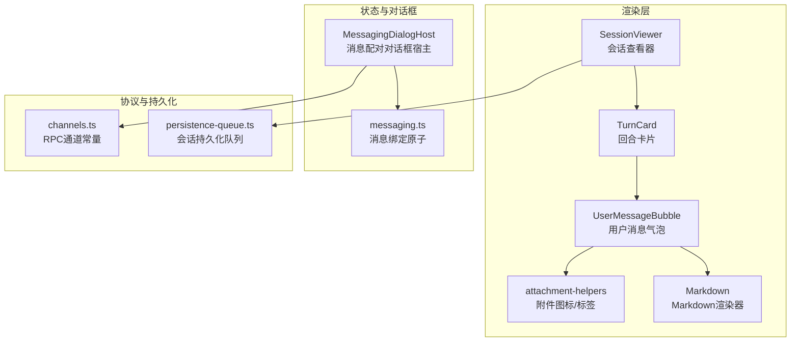
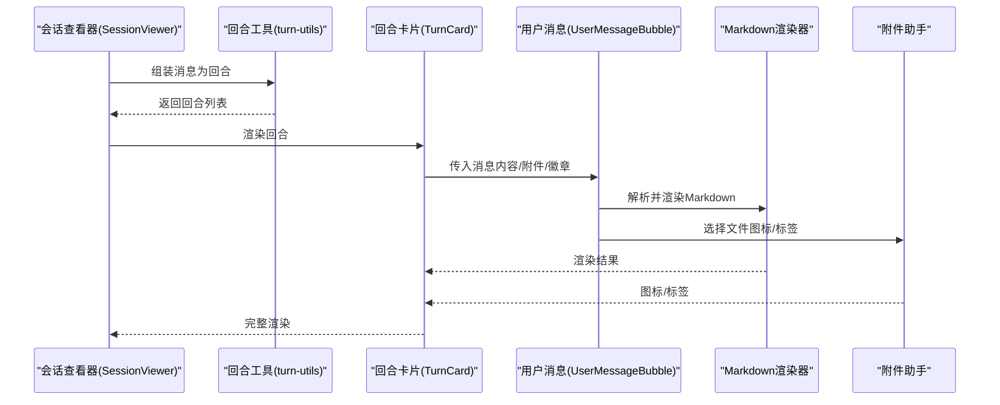
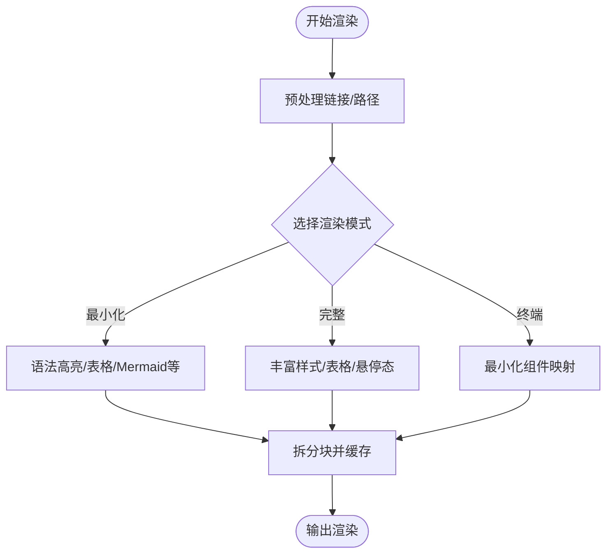
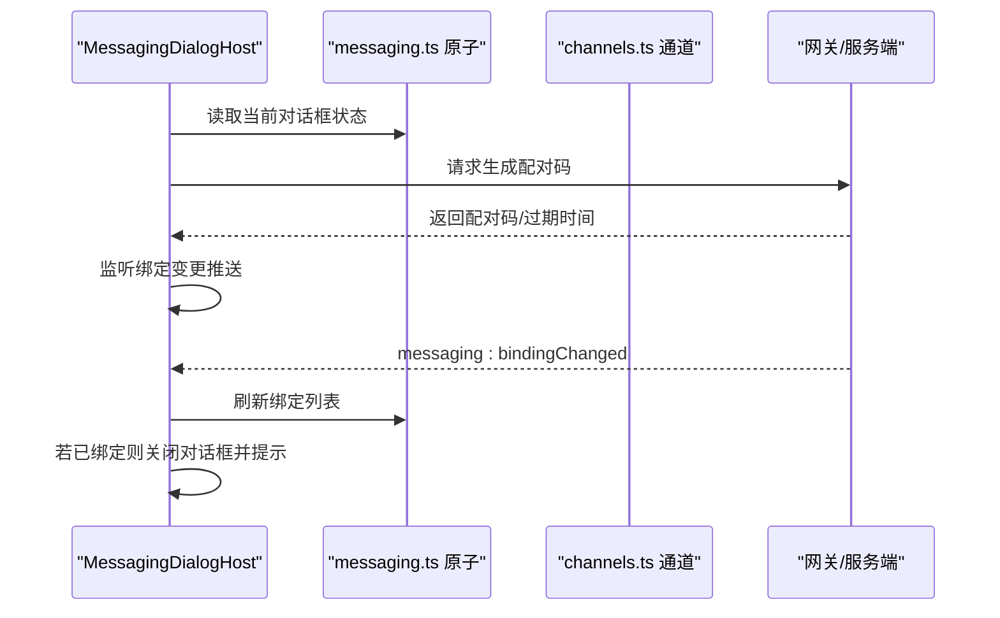
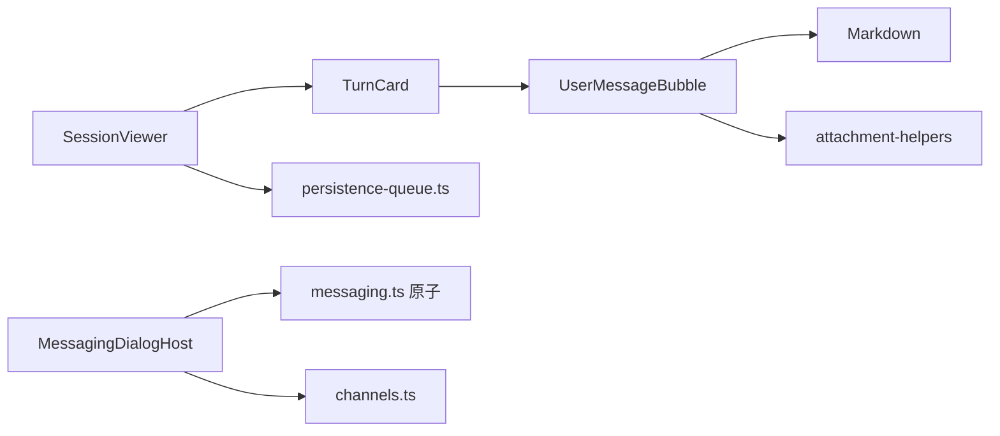

# 会话消息处理

<cite>
**本文引用的文件**
- [packages/ui/src/components/chat/UserMessageBubble.tsx](file://packages/ui/src/components/chat/UserMessageBubble.tsx)
- [packages/ui/src/components/chat/attachment-helpers.tsx](file://packages/ui/src/components/chat/attachment-helpers.tsx)
- [packages/ui/src/components/markdown/Markdown.tsx](file://packages/ui/src/components/markdown/Markdown.tsx)
- [packages/ui/src/components/markdown/index.ts](file://packages/ui/src/components/markdown/index.ts)
- [apps/electron/src/renderer/atoms/messaging.ts](file://apps/electron/src/renderer/atoms/messaging.ts)
- [apps/electron/src/renderer/components/messaging/MessagingDialogHost.tsx](file://apps/electron/src/renderer/components/messaging/MessagingDialogHost.tsx)
- [packages/shared/src/protocol/channels.ts](file://packages/shared/src/protocol/channels.ts)
- [packages/shared/src/sessions/persistence-queue.ts](file://packages/shared/src/sessions/persistence-queue.ts)
- [packages/ui/src/components/chat/TurnCard.tsx](file://packages/ui/src/components/chat/TurnCard.tsx)
- [packages/ui/src/components/chat/turn-utils.ts](file://packages/ui/src/components/chat/turn-utils.ts)
- [packages/ui/src/components/chat/SessionViewer.tsx](file://packages/ui/src/components/chat/SessionViewer.tsx)
</cite>

## 目录
1. [简介](#简介)
2. [项目结构](#项目结构)
3. [核心组件](#核心组件)
4. [架构总览](#架构总览)
5. [详细组件分析](#详细组件分析)
6. [依赖关系分析](#依赖关系分析)
7. [性能考量](#性能考量)
8. [故障排查指南](#故障排查指南)
9. [结论](#结论)
10. [附录](#附录)

## 简介
本技术文档围绕“会话消息处理”主题，系统性阐述消息从接收、解析、渲染、存储到展示的完整链路，覆盖消息类型与格式、序列化机制、实时流式渲染、附件与富文本（含 Markdown、LaTeX、Mermaid、代码高亮）、消息去重与排序、分页策略、以及搜索、标记与导出等高级能力。文档同时给出面向自定义消息处理逻辑的扩展建议与最佳实践。

## 项目结构
消息处理涉及前端渲染层、Markdown 渲染引擎、附件与文件类型辅助、状态原子与对话框宿主、以及跨进程通道与持久化队列等模块。下图概览了与消息处理直接相关的模块关系：

图表来源
- [packages/ui/src/components/chat/UserMessageBubble.tsx:1-520](file://packages/ui/src/components/chat/UserMessageBubble.tsx#L1-L520)
- [packages/ui/src/components/chat/attachment-helpers.tsx:1-210](file://packages/ui/src/components/chat/attachment-helpers.tsx#L1-L210)
- [packages/ui/src/components/markdown/Markdown.tsx:1-599](file://packages/ui/src/components/markdown/Markdown.tsx#L1-L599)
- [apps/electron/src/renderer/atoms/messaging.ts:1-76](file://apps/electron/src/renderer/atoms/messaging.ts#L1-L76)
- [apps/electron/src/renderer/components/messaging/MessagingDialogHost.tsx:1-127](file://apps/electron/src/renderer/components/messaging/MessagingDialogHost.tsx#L1-L127)
- [packages/shared/src/protocol/channels.ts:412-448](file://packages/shared/src/protocol/channels.ts#L412-L448)
- [packages/shared/src/sessions/persistence-queue.ts:59-78](file://packages/shared/src/sessions/persistence-queue.ts#L59-L78)

章节来源
- [packages/ui/src/components/chat/UserMessageBubble.tsx:1-520](file://packages/ui/src/components/chat/UserMessageBubble.tsx#L1-L520)
- [packages/ui/src/components/chat/attachment-helpers.tsx:1-210](file://packages/ui/src/components/chat/attachment-helpers.tsx#L1-L210)
- [packages/ui/src/components/markdown/Markdown.tsx:1-599](file://packages/ui/src/components/markdown/Markdown.tsx#L1-L599)
- [apps/electron/src/renderer/atoms/messaging.ts:1-76](file://apps/electron/src/renderer/atoms/messaging.ts#L1-L76)
- [apps/electron/src/renderer/components/messaging/MessagingDialogHost.tsx:1-127](file://apps/electron/src/renderer/components/messaging/MessagingDialogHost.tsx#L1-L127)
- [packages/shared/src/protocol/channels.ts:412-448](file://packages/shared/src/protocol/channels.ts#L412-L448)
- [packages/shared/src/sessions/persistence-queue.ts:59-78](file://packages/shared/src/sessions/persistence-queue.ts#L59-L78)

## 核心组件
- 用户消息气泡：负责渲染用户输入内容、内联徽章、附件缩略图、Markdown 解析与点击回调。
- Markdown 渲染器：支持多种渲染模式（终端、最小化、完整），内置语法高亮、数学公式、Mermaid 图表、表格、可折叠段落等。
- 附件助手：提供文件类型标签、颜色与图标映射，支持代码文件识别与着色。
- 消息绑定原子与对话框宿主：管理消息平台绑定状态，提供配对码生成与自动关闭逻辑。
- 回合卡片与会话查看器：将消息组织为回合（Turn），支持流式状态、标注、分支与注释交互。
- 协议通道与持久化队列：统一消息通道命名，保障会话头与消息持久化的串行与防抖。

章节来源
- [packages/ui/src/components/chat/UserMessageBubble.tsx:305-324](file://packages/ui/src/components/chat/UserMessageBubble.tsx#L305-L324)
- [packages/ui/src/components/markdown/Markdown.tsx:27-39](file://packages/ui/src/components/markdown/Markdown.tsx#L27-L39)
- [packages/ui/src/components/chat/attachment-helpers.tsx:129-151](file://packages/ui/src/components/chat/attachment-helpers.tsx#L129-L151)
- [apps/electron/src/renderer/atoms/messaging.ts:10-28](file://apps/electron/src/renderer/atoms/messaging.ts#L10-L28)
- [apps/electron/src/renderer/components/messaging/MessagingDialogHost.tsx:22-57](file://apps/electron/src/renderer/components/messaging/MessagingDialogHost.tsx#L22-L57)
- [packages/ui/src/components/chat/TurnCard.tsx:3126-3152](file://packages/ui/src/components/chat/TurnCard.tsx#L3126-L3152)
- [packages/ui/src/components/chat/SessionViewer.tsx:111-178](file://packages/ui/src/components/chat/SessionViewer.tsx#L111-L178)
- [packages/shared/src/protocol/channels.ts:412-448](file://packages/shared/src/protocol/channels.ts#L412-L448)
- [packages/shared/src/sessions/persistence-queue.ts:59-78](file://packages/shared/src/sessions/persistence-queue.ts#L59-L78)

## 架构总览
消息处理在渲染层以“消息→回合→会话”的层级组织，结合 Markdown 引擎与附件助手完成富文本与多媒体渲染；状态层通过 Jotai 原子维护消息绑定信息，并由对话框宿主统一管理配对流程；底层通过 RPC 通道与持久化队列确保消息一致性与性能。

图表来源
- [packages/ui/src/components/chat/SessionViewer.tsx:160-178](file://packages/ui/src/components/chat/SessionViewer.tsx#L160-L178)
- [packages/ui/src/components/chat/turn-utils.ts:594-635](file://packages/ui/src/components/chat/turn-utils.ts#L594-L635)
- [packages/ui/src/components/chat/TurnCard.tsx:3126-3152](file://packages/ui/src/components/chat/TurnCard.tsx#L3126-L3152)
- [packages/ui/src/components/chat/UserMessageBubble.tsx:332-520](file://packages/ui/src/components/chat/UserMessageBubble.tsx#L332-L520)
- [packages/ui/src/components/markdown/Markdown.tsx:504-599](file://packages/ui/src/components/markdown/Markdown.tsx#L504-L599)
- [packages/ui/src/components/chat/attachment-helpers.tsx:129-151](file://packages/ui/src/components/chat/attachment-helpers.tsx#L129-L151)

## 详细组件分析

### 消息类型与格式规范
- 消息内容：字符串，支持 Markdown 语法；可通过徽章嵌入上下文、技能、源或命令信息。
- 附件：图片与文档两类，支持缩略图与文件类型标签；文件路径用于点击打开。
- 徽章：用于内联显示来源/技能/上下文/命令等元信息，支持折叠隐藏与点击回调。
- 回合：由用户消息与助手响应组成，支持流式状态与最终态切换。

章节来源
- [packages/ui/src/components/chat/UserMessageBubble.tsx:305-324](file://packages/ui/src/components/chat/UserMessageBubble.tsx#L305-L324)
- [packages/ui/src/components/chat/attachment-helpers.tsx:129-151](file://packages/ui/src/components/chat/attachment-helpers.tsx#L129-L151)
- [packages/ui/src/components/chat/turn-utils.ts:602-635](file://packages/ui/src/components/chat/turn-utils.ts#L602-L635)

### 序列化机制与通道约定
- RPC 通道：集中定义消息相关通道名称，便于路由与测试覆盖。
- 通道值提取：提供扁平化函数以校验所有通道是否被正确分类。

章节来源
- [packages/shared/src/protocol/channels.ts:412-448](file://packages/shared/src/protocol/channels.ts#L412-L448)

### 实时消息流处理与渲染
- 流式状态：根据消息的流式标志更新回合状态，首块 Mermaid 的展开按钮可按需隐藏以避免与卡片按钮冲突。
- 内容预处理：对纯文本中的链接与文件路径进行预处理，统一转为可点击链接。
- 渲染模式：三种模式分别适用于调试、聊天与长文档场景，支持语法高亮、数学公式、Mermaid、表格等增强能力。

图表来源
- [packages/ui/src/components/markdown/Markdown.tsx:535-568](file://packages/ui/src/components/markdown/Markdown.tsx#L535-L568)
- [packages/ui/src/components/markdown/Markdown.tsx:103-492](file://packages/ui/src/components/markdown/Markdown.tsx#L103-L492)
- [packages/ui/src/components/markdown/index.ts:1-15](file://packages/ui/src/components/markdown/index.ts#L1-L15)

章节来源
- [packages/ui/src/components/markdown/Markdown.tsx:27-39](file://packages/ui/src/components/markdown/Markdown.tsx#L27-L39)
- [packages/ui/src/components/markdown/Markdown.tsx:504-599](file://packages/ui/src/components/markdown/Markdown.tsx#L504-L599)

### 消息去重、排序与分页
- 去重：基于消息唯一标识与回合标识进行合并，避免重复渲染。
- 排序：依据时间戳与中间态/最终态切换顺序组织回合。
- 分页：通过回合集合与滚动遮罩实现无限滚动与渐隐遮罩，提升长会话可读性。

章节来源
- [packages/ui/src/components/chat/turn-utils.ts:594-635](file://packages/ui/src/components/chat/turn-utils.ts#L594-L635)
- [packages/ui/src/components/chat/SessionViewer.tsx:151-178](file://packages/ui/src/components/chat/SessionViewer.tsx#L151-L178)

### 附件处理与富文本渲染
- 附件类型：图片与文档，支持缩略图与文件类型标签；代码文件以特定颜色与图标标识。
- 富文本：Markdown 支持表格、任务列表、删除线、内联代码、代码块高亮、Mermaid 图表、LaTeX 数学公式等。
- 点击行为：链接与文件路径统一走解析目标，分别触发外部浏览器或本地文件打开。

章节来源
- [packages/ui/src/components/chat/attachment-helpers.tsx:129-151](file://packages/ui/src/components/chat/attachment-helpers.tsx#L129-L151)
- [packages/ui/src/components/chat/UserMessageBubble.tsx:118-159](file://packages/ui/src/components/chat/UserMessageBubble.tsx#L118-L159)
- [packages/ui/src/components/markdown/Markdown.tsx:160-192](file://packages/ui/src/components/markdown/Markdown.tsx#L160-L192)

### 标记、搜索与导出（高级功能）
- 标记：通过徽章与注释系统实现消息级标注与后续跟进。
- 搜索：可在会话中利用 Markdown 链接解析与文件路径定位快速跳转。
- 导出：会话持久化队列保证写入串行与去抖，适合在导出前批量刷新。

章节来源
- [packages/ui/src/components/chat/UserMessageBubble.tsx:393-411](file://packages/ui/src/components/chat/UserMessageBubble.tsx#L393-L411)
- [packages/shared/src/sessions/persistence-queue.ts:59-78](file://packages/shared/src/sessions/persistence-queue.ts#L59-L78)

### 消息绑定与配对流程
- 绑定状态：Jotai 原子维护启用的绑定列表，按会话聚合。
- 对话框宿主：全局托管配对对话框，监听绑定变更事件并在满足条件时自动关闭并提示成功。

图表来源
- [apps/electron/src/renderer/components/messaging/MessagingDialogHost.tsx:34-57](file://apps/electron/src/renderer/components/messaging/MessagingDialogHost.tsx#L34-L57)
- [apps/electron/src/renderer/atoms/messaging.ts:32-51](file://apps/electron/src/renderer/atoms/messaging.ts#L32-L51)
- [packages/shared/src/protocol/channels.ts:412-448](file://packages/shared/src/protocol/channels.ts#L412-L448)

章节来源
- [apps/electron/src/renderer/components/messaging/MessagingDialogHost.tsx:22-127](file://apps/electron/src/renderer/components/messaging/MessagingDialogHost.tsx#L22-L127)
- [apps/electron/src/renderer/atoms/messaging.ts:1-76](file://apps/electron/src/renderer/atoms/messaging.ts#L1-L76)

## 依赖关系分析
- 渲染层内部依赖：UserMessageBubble 依赖 Markdown 与附件助手；TurnCard/SessionViewer 负责回合与会话组织。
- 状态层：MessagingDialogHost 依赖 messaging.ts 原子与 channels.ts 通道；通过窗口 API 与后端交互。
- 持久化：persistence-queue.ts 提供会话持久化的串行与去抖策略，避免并发写入冲突。

图表来源
- [packages/ui/src/components/chat/UserMessageBubble.tsx:1-520](file://packages/ui/src/components/chat/UserMessageBubble.tsx#L1-L520)
- [packages/ui/src/components/markdown/Markdown.tsx:1-599](file://packages/ui/src/components/markdown/Markdown.tsx#L1-L599)
- [packages/ui/src/components/chat/attachment-helpers.tsx:1-210](file://packages/ui/src/components/chat/attachment-helpers.tsx#L1-L210)
- [packages/ui/src/components/chat/TurnCard.tsx:3126-3152](file://packages/ui/src/components/chat/TurnCard.tsx#L3126-L3152)
- [packages/ui/src/components/chat/SessionViewer.tsx:111-178](file://packages/ui/src/components/chat/SessionViewer.tsx#L111-L178)
- [apps/electron/src/renderer/components/messaging/MessagingDialogHost.tsx:1-127](file://apps/electron/src/renderer/components/messaging/MessagingDialogHost.tsx#L1-L127)
- [apps/electron/src/renderer/atoms/messaging.ts:1-76](file://apps/electron/src/renderer/atoms/messaging.ts#L1-L76)
- [packages/shared/src/protocol/channels.ts:412-448](file://packages/shared/src/protocol/channels.ts#L412-L448)
- [packages/shared/src/sessions/persistence-queue.ts:59-78](file://packages/shared/src/sessions/persistence-queue.ts#L59-L78)

章节来源
- [packages/ui/src/components/chat/UserMessageBubble.tsx:1-520](file://packages/ui/src/components/chat/UserMessageBubble.tsx#L1-L520)
- [packages/ui/src/components/markdown/Markdown.tsx:1-599](file://packages/ui/src/components/markdown/Markdown.tsx#L1-L599)
- [packages/ui/src/components/chat/attachment-helpers.tsx:1-210](file://packages/ui/src/components/chat/attachment-helpers.tsx#L1-L210)
- [packages/ui/src/components/chat/TurnCard.tsx:3126-3152](file://packages/ui/src/components/chat/TurnCard.tsx#L3126-L3152)
- [packages/ui/src/components/chat/SessionViewer.tsx:111-178](file://packages/ui/src/components/chat/SessionViewer.tsx#L111-L178)
- [apps/electron/src/renderer/components/messaging/MessagingDialogHost.tsx:1-127](file://apps/electron/src/renderer/components/messaging/MessagingDialogHost.tsx#L1-L127)
- [apps/electron/src/renderer/atoms/messaging.ts:1-76](file://apps/electron/src/renderer/atoms/messaging.ts#L1-L76)
- [packages/shared/src/protocol/channels.ts:412-448](file://packages/shared/src/protocol/channels.ts#L412-L448)
- [packages/shared/src/sessions/persistence-queue.ts:59-78](file://packages/shared/src/sessions/persistence-queue.ts#L59-L78)

## 性能考量
- 渲染优化：MemoizedMarkdown 通过块级缓存减少流式渲染时的重绘成本。
- 附件加载：缩略图优先，避免大图直接渲染导致的卡顿。
- 持久化串行：会话持久化队列串行化写入，降低磁盘竞争与竞态风险。
- UI 稳定性：用户消息气泡在排队状态下保持视觉稳定，避免闪烁。

章节来源
- [packages/ui/src/components/markdown/Markdown.tsx:575-599](file://packages/ui/src/components/markdown/Markdown.tsx#L575-L599)
- [packages/ui/src/components/chat/UserMessageBubble.tsx:326-391](file://packages/ui/src/components/chat/UserMessageBubble.tsx#L326-L391)
- [packages/shared/src/sessions/persistence-queue.ts:59-78](file://packages/shared/src/sessions/persistence-queue.ts#L59-L78)

## 故障排查指南
- 配对码未生效：确认 messaging:bindingChanged 推送是否到达，检查对话框状态与绑定列表刷新逻辑。
- 链接/文件点击无效：检查 Markdown 链接解析与目标解析逻辑，确保回调参数正确传递。
- 流式渲染异常：确认回合工具对流式状态的判定与回合完成条件，避免提前 flush 导致内容截断。
- 附件图标缺失：检查文件类型映射与扩展名解析，确保 fallback 标签可用。

章节来源
- [apps/electron/src/renderer/components/messaging/MessagingDialogHost.tsx:34-57](file://apps/electron/src/renderer/components/messaging/MessagingDialogHost.tsx#L34-L57)
- [packages/ui/src/components/markdown/Markdown.tsx:160-192](file://packages/ui/src/components/markdown/Markdown.tsx#L160-L192)
- [packages/ui/src/components/chat/turn-utils.ts:594-635](file://packages/ui/src/components/chat/turn-utils.ts#L594-L635)
- [packages/ui/src/components/chat/attachment-helpers.tsx:129-151](file://packages/ui/src/components/chat/attachment-helpers.tsx#L129-L151)

## 结论
该消息处理体系以清晰的层级划分与模块职责实现了从接收、解析、渲染到存储与展示的全链路闭环。通过渲染模式、附件与富文本增强、流式渲染优化与持久化串行化，既保证了用户体验，也兼顾了性能与一致性。对于需要自定义处理逻辑的开发者，建议从渲染模式扩展、通道命名规范、回合状态机与持久化策略四个维度入手，确保改动与现有机制兼容。

## 附录
- 开发者扩展建议
  - 自定义渲染模式：在 Markdown 渲染器中新增组件映射，遵循现有模式接口。
  - 新增消息类型：在回合工具中扩展消息到回合的映射规则，确保流式与最终态切换一致。
  - 扩展通道：在 channels.ts 中添加新通道常量并通过 getAllChannelValues 进行校验。
  - 自定义持久化：在 persistence-queue.ts 基础上增加业务字段的签名与去抖策略。

章节来源
- [packages/ui/src/components/markdown/Markdown.tsx:103-492](file://packages/ui/src/components/markdown/Markdown.tsx#L103-L492)
- [packages/ui/src/components/chat/turn-utils.ts:602-635](file://packages/ui/src/components/chat/turn-utils.ts#L602-L635)
- [packages/shared/src/protocol/channels.ts:440-448](file://packages/shared/src/protocol/channels.ts#L440-L448)
- [packages/shared/src/sessions/persistence-queue.ts:59-78](file://packages/shared/src/sessions/persistence-queue.ts#L59-L78)