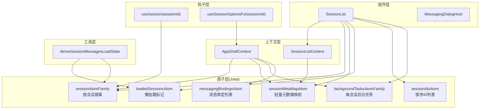
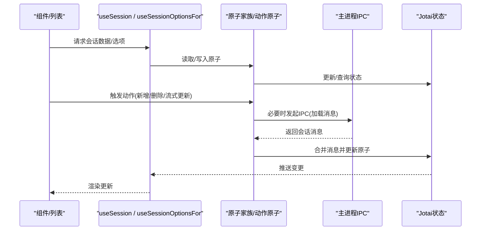
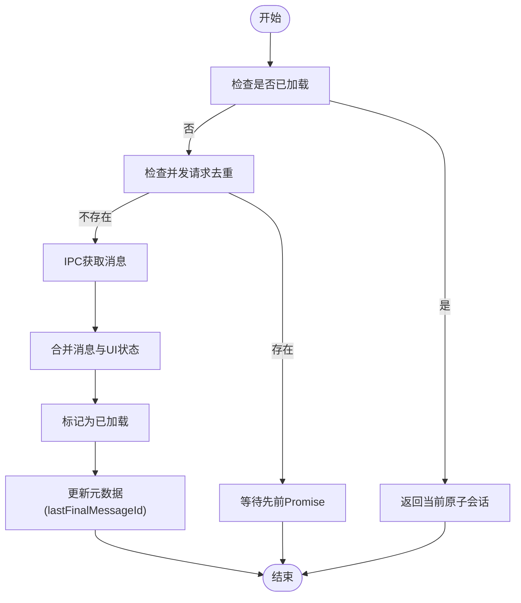
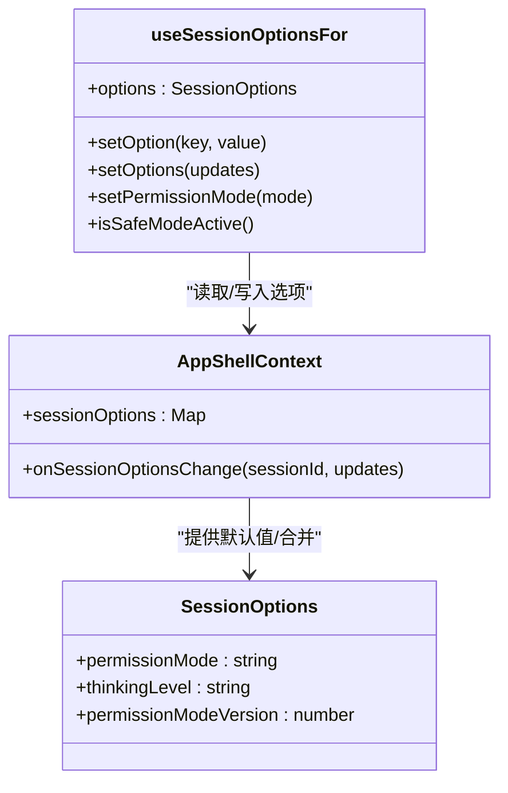
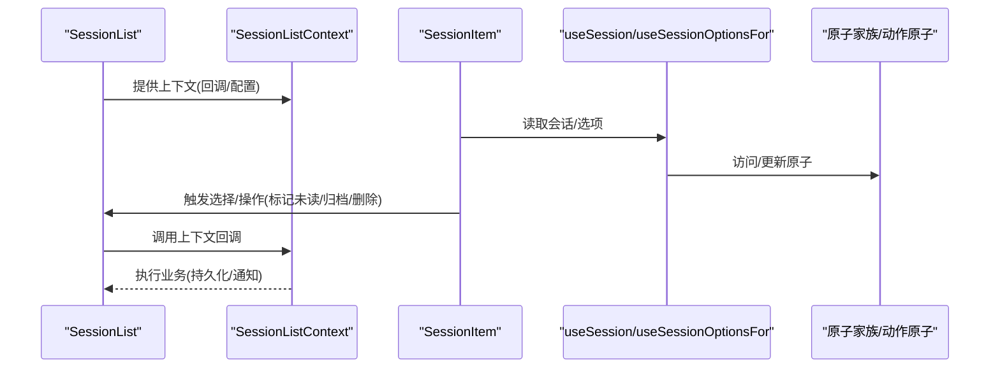
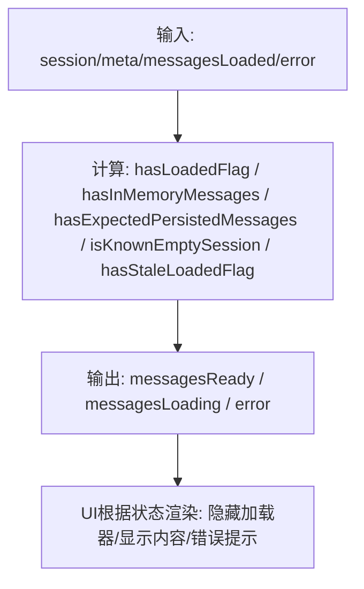
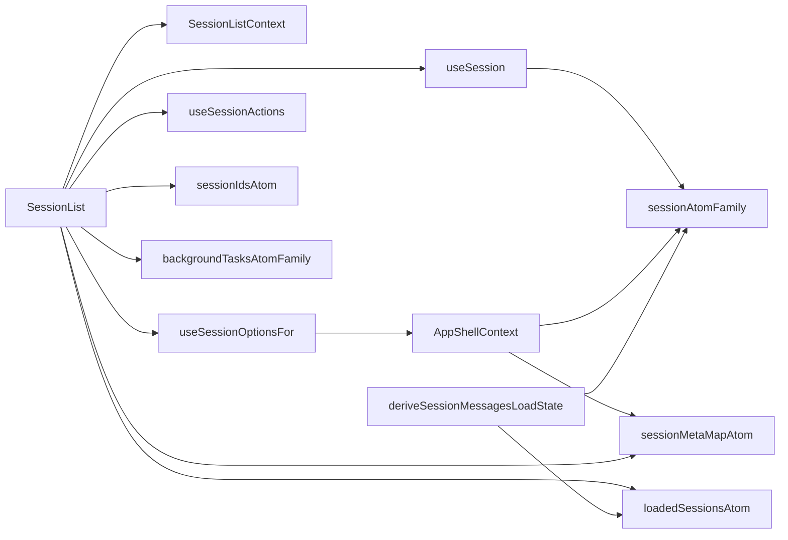

# 会话状态系统

<cite>
**本文引用的文件**
- [apps/electron/src/renderer/atoms/sessions.ts](file://apps/electron/src/renderer/atoms/sessions.ts)
- [apps/electron/src/renderer/hooks/useSession.ts](file://apps/electron/src/renderer/hooks/useSession.ts)
- [apps/electron/src/renderer/hooks/useSessionOptions.ts](file://apps/electron/src/renderer/hooks/useSessionOptions.ts)
- [apps/electron/src/renderer/atoms/messaging.ts](file://apps/electron/src/renderer/atoms/messaging.ts)
- [apps/electron/src/renderer/hooks/useSessionActions.ts](file://apps/electron/src/renderer/hooks/useSessionActions.ts)
- [apps/electron/src/renderer/context/AppShellContext.tsx](file://apps/electron/src/renderer/context/AppShellContext.tsx)
- [apps/electron/src/renderer/context/SessionListContext.tsx](file://apps/electron/src/renderer/context/SessionListContext.tsx)
- [apps/electron/src/renderer/components/app-shell/SessionList.tsx](file://apps/electron/src/renderer/components/app-shell/SessionList.tsx)
- [apps/electron/src/renderer/lib/session-load.ts](file://apps/electron/src/renderer/lib/session-load.ts)
</cite>

## 目录
1. [简介](#简介)
2. [项目结构](#项目结构)
3. [核心组件](#核心组件)
4. [架构总览](#架构总览)
5. [详细组件分析](#详细组件分析)
6. [依赖关系分析](#依赖关系分析)
7. [性能考量](#性能考量)
8. [故障排查指南](#故障排查指南)
9. [结论](#结论)
10. [附录](#附录)

## 简介
本文件面向需要扩展或自定义会话状态行为的开发者，系统性阐述会话状态系统的原子状态管理机制、Jotai 状态库的使用方式、状态订阅与更新流程、数据结构与类型约束、状态钩子实现原理、性能优化策略、缓存机制、会话选项管理、权限状态与消息状态的协调机制，并提供状态调试工具、状态快照与状态同步的实用指南。

## 项目结构
会话状态系统主要由以下层次构成：
- 原子层（Jotai）：以 atomFamily 为核心，按会话隔离状态；同时提供元数据映射、加载状态、背景任务等派生与动作原子。
- 钩子层（React Hooks）：提供 useSession、useSessionOptionsFor 等钩子，封装对原子的访问与更新。
- 上下文层（Context）：AppShellContext 提供统一的会话操作回调与会话选项映射；SessionListContext 为列表渲染提供共享上下文。
- 组件层（UI）：SessionList 负责会话列表渲染、分组、搜索与交互；Messaging 原子负责消息绑定等全局工作区级状态。
- 工具层（Lib）：session-load 提供消息加载状态推导逻辑，辅助 UI 正确显示加载、空会话、错误等状态。

图表来源
- [apps/electron/src/renderer/atoms/sessions.ts:122-131](file://apps/electron/src/renderer/atoms/sessions.ts#L122-L131)
- [apps/electron/src/renderer/hooks/useSession.ts:206-209](file://apps/electron/src/renderer/hooks/useSession.ts#L206-L209)
- [apps/electron/src/renderer/context/AppShellContext.tsx:244-281](file://apps/electron/src/renderer/context/AppShellContext.tsx#L244-L281)
- [apps/electron/src/renderer/context/SessionListContext.tsx:8-40](file://apps/electron/src/renderer/context/SessionListContext.tsx#L8-L40)
- [apps/electron/src/renderer/components/app-shell/SessionList.tsx:144-146](file://apps/electron/src/renderer/components/app-shell/SessionList.tsx#L144-L146)
- [apps/electron/src/renderer/lib/session-load.ts:35-65](file://apps/electron/src/renderer/lib/session-load.ts#L35-L65)

章节来源
- [apps/electron/src/renderer/atoms/sessions.ts:122-131](file://apps/electron/src/renderer/atoms/sessions.ts#L122-L131)
- [apps/electron/src/renderer/context/AppShellContext.tsx:244-281](file://apps/electron/src/renderer/context/AppShellContext.tsx#L244-L281)
- [apps/electron/src/renderer/context/SessionListContext.tsx:8-40](file://apps/electron/src/renderer/context/SessionListContext.tsx#L8-L40)
- [apps/electron/src/renderer/components/app-shell/SessionList.tsx:144-146](file://apps/electron/src/renderer/components/app-shell/SessionList.tsx#L144-L146)
- [apps/electron/src/renderer/lib/session-load.ts:35-65](file://apps/electron/src/renderer/lib/session-load.ts#L35-L65)

## 核心组件
- 会话原子家族：按会话 ID 隔离存储完整会话对象，避免跨会话重渲染。
- 元数据映射：仅包含列表展示所需轻量字段，避免携带消息数组。
- 懒加载跟踪：loadedSessionsAtom 记录已加载会话，配合 ensureSessionMessagesLoadedAtom 实现按需加载。
- 动作原子：updateSessionAtom、replaceLoadedSessionAtom、appendMessageAtom、updateStreamingContentAtom、initializeSessionsAtom、refreshSessionsMetadataAtom、addSessionAtom、removeSessionAtom、syncSessionsToAtomsAtom、ensureSessionMessagesLoadedAtom、forceSessionMessagesReloadAtom 等，覆盖增删改查、流式更新、批量初始化与刷新。
- 背景任务：backgroundTasksAtomFamily 按会话维护后台任务列表。
- 会话选项：SessionOptions 接口与默认值，通过 AppShellContext 的 sessionOptions 映射与 onSessionOptionsChange 回调进行统一管理。
- 权限与消息绑定：MessagingBinding 原子与对话状态，支持平台绑定与配对流程。
- 加载状态推导：deriveSessionMessagesLoadState 将“已标记加载”与“内存中消息”状态合并，正确处理懒加载恢复场景。

章节来源
- [apps/electron/src/renderer/atoms/sessions.ts:122-131](file://apps/electron/src/renderer/atoms/sessions.ts#L122-L131)
- [apps/electron/src/renderer/atoms/sessions.ts:170-230](file://apps/electron/src/renderer/atoms/sessions.ts#L170-L230)
- [apps/electron/src/renderer/atoms/sessions.ts:479-534](file://apps/electron/src/renderer/atoms/sessions.ts#L479-L534)
- [apps/electron/src/renderer/atoms/sessions.ts:699-702](file://apps/electron/src/renderer/atoms/sessions.ts#L699-L702)
- [apps/electron/src/renderer/hooks/useSessionOptions.ts:20-33](file://apps/electron/src/renderer/hooks/useSessionOptions.ts#L20-L33)
- [apps/electron/src/renderer/atoms/messaging.ts:10-30](file://apps/electron/src/renderer/atoms/messaging.ts#L10-L30)
- [apps/electron/src/renderer/lib/session-load.ts:35-65](file://apps/electron/src/renderer/lib/session-load.ts#L35-L65)

## 架构总览
会话状态系统采用“原子家族 + 钩子 + 上下文 + 组件”的分层设计：
- 原子家族：sessionAtomFamily 与 backgroundTasksAtomFamily 提供按会话隔离的状态。
- 元数据与排序：sessionMetaMapAtom 与 sessionIdsAtom 支持列表渲染与排序。
- 懒加载与流式更新：loadedSessionsAtom 与 ensureSessionMessagesLoadedAtom 控制消息加载；appendMessageAtom 与 updateStreamingContentAtom 处理流式增量更新。
- 同步与一致性：syncSessionsToAtomsAtom 在 React 状态与原子之间建立单向同步，避免流式过程中的数据丢失。
- 选项与权限：AppShellContext 统一暴露会话选项映射与变更回调；Messaging 原子承载消息绑定状态。

图表来源
- [apps/electron/src/renderer/hooks/useSession.ts:206-209](file://apps/electron/src/renderer/hooks/useSession.ts#L206-L209)
- [apps/electron/src/renderer/context/AppShellContext.tsx:244-281](file://apps/electron/src/renderer/context/AppShellContext.tsx#L244-L281)
- [apps/electron/src/renderer/atoms/sessions.ts:550-656](file://apps/electron/src/renderer/atoms/sessions.ts#L550-L656)

章节来源
- [apps/electron/src/renderer/hooks/useSession.ts:206-209](file://apps/electron/src/renderer/hooks/useSession.ts#L206-L209)
- [apps/electron/src/renderer/context/AppShellContext.tsx:244-281](file://apps/electron/src/renderer/context/AppShellContext.tsx#L244-L281)
- [apps/electron/src/renderer/atoms/sessions.ts:550-656](file://apps/electron/src/renderer/atoms/sessions.ts#L550-L656)

## 详细组件分析

### 会话原子家族与动作原子
- 会话原子家族：每个会话拥有独立原子，确保更新隔离，避免跨会话重渲染。
- 元数据提取：extractSessionMeta 将完整会话转换为轻量元数据，用于列表渲染。
- 动作原子：
  - updateSessionAtom：更新指定会话并同步元数据。
  - replaceLoadedSessionAtom：权威替换完整会话，适用于已知完整消息的历史加载。
  - appendMessageAtom：追加新消息，不更新时间戳，避免中间/工具消息导致列表跳动。
  - updateStreamingContentAtom：在最后一条流式助手消息上增量拼接内容。
  - initializeSessionsAtom：批量初始化会话，清理旧原子，构建元数据映射与排序 ID 列表。
  - refreshSessionsMetadataAtom：权威刷新元数据，保留已加载会话的消息，必要时移除缺失项。
  - addSessionAtom/removeSessionAtom：新增/删除会话，同步元数据与排序列表。
  - syncSessionsToAtomsAtom：在 React 状态与原子之间进行安全同步，保护流式过程中的原子优先。
  - ensureSessionMessagesLoadedAtom/forceSessionMessagesReloadAtom：懒加载与强制刷新消息，带去重与竞态保护。

图表来源
- [apps/electron/src/renderer/atoms/sessions.ts:550-656](file://apps/electron/src/renderer/atoms/sessions.ts#L550-L656)

章节来源
- [apps/electron/src/renderer/atoms/sessions.ts:122-131](file://apps/electron/src/renderer/atoms/sessions.ts#L122-L131)
- [apps/electron/src/renderer/atoms/sessions.ts:170-230](file://apps/electron/src/renderer/atoms/sessions.ts#L170-L230)
- [apps/electron/src/renderer/atoms/sessions.ts:282-322](file://apps/electron/src/renderer/atoms/sessions.ts#L282-L322)
- [apps/electron/src/renderer/atoms/sessions.ts:334-401](file://apps/electron/src/renderer/atoms/sessions.ts#L334-L401)
- [apps/electron/src/renderer/atoms/sessions.ts:406-461](file://apps/electron/src/renderer/atoms/sessions.ts#L406-L461)
- [apps/electron/src/renderer/atoms/sessions.ts:479-534](file://apps/electron/src/renderer/atoms/sessions.ts#L479-L534)
- [apps/electron/src/renderer/atoms/sessions.ts:550-656](file://apps/electron/src/renderer/atoms/sessions.ts#L550-L656)

### 会话选项与权限状态
- 会话选项接口：包含权限模式、思考层级等，提供默认值与部分更新合并工具。
- 选项钩子：useSessionOptionsFor 提供读取与设置权限模式、整体更新等能力，通过 AppShellContext 的统一回调传播到后端或持久化层。
- 权限模式：支持 safe/ask/allow-all，结合 pendingPermissions/pendingCredentials 在 UI 中弹出确认或凭据输入。

图表来源
- [apps/electron/src/renderer/hooks/useSessionOptions.ts:20-48](file://apps/electron/src/renderer/hooks/useSessionOptions.ts#L20-L48)
- [apps/electron/src/renderer/context/AppShellContext.tsx:244-281](file://apps/electron/src/renderer/context/AppShellContext.tsx#L244-L281)

章节来源
- [apps/electron/src/renderer/hooks/useSessionOptions.ts:20-48](file://apps/electron/src/renderer/hooks/useSessionOptions.ts#L20-L48)
- [apps/electron/src/renderer/context/AppShellContext.tsx:244-281](file://apps/electron/src/renderer/context/AppShellContext.tsx#L244-L281)

### 消息绑定与全局对话状态
- MessagingBinding：描述工作区内会话与外部平台的绑定关系，支持启用/禁用、访问策略等。
- messagingBindingsAtom：全局绑定列表，派生按会话分组的映射。
- messagingDialogAtom：全局消息配对对话框状态，提升跨组件状态复用与生命周期管理。

章节来源
- [apps/electron/src/renderer/atoms/messaging.ts:10-30](file://apps/electron/src/renderer/atoms/messaging.ts#L10-L30)
- [apps/electron/src/renderer/atoms/messaging.ts:32-51](file://apps/electron/src/renderer/atoms/messaging.ts#L32-L51)
- [apps/electron/src/renderer/atoms/messaging.ts:59-75](file://apps/electron/src/renderer/atoms/messaging.ts#L59-L75)

### 会话列表与上下文协作
- SessionList：负责会话列表渲染、分组（日期/状态/未读）、搜索、键盘导航与多选；通过 SessionListContext 向子组件提供共享回调与配置。
- AppShellContext：为聊天面板与相关组件提供会话数据、工作区信息、权限/凭据队列、会话选项映射与统一回调。
- useSession：兼容旧版选择逻辑，重新导出工厂生成的会话选择钩子，支持多选与状态管理。

图表来源
- [apps/electron/src/renderer/components/app-shell/SessionList.tsx:616-650](file://apps/electron/src/renderer/components/app-shell/SessionList.tsx#L616-L650)
- [apps/electron/src/renderer/context/SessionListContext.tsx:8-40](file://apps/electron/src/renderer/context/SessionListContext.tsx#L8-L40)
- [apps/electron/src/renderer/context/AppShellContext.tsx:244-281](file://apps/electron/src/renderer/context/AppShellContext.tsx#L244-L281)
- [apps/electron/src/renderer/hooks/useSession.ts:206-209](file://apps/electron/src/renderer/hooks/useSession.ts#L206-L209)

章节来源
- [apps/electron/src/renderer/components/app-shell/SessionList.tsx:144-146](file://apps/electron/src/renderer/components/app-shell/SessionList.tsx#L144-L146)
- [apps/electron/src/renderer/context/SessionListContext.tsx:8-40](file://apps/electron/src/renderer/context/SessionListContext.tsx#L8-L40)
- [apps/electron/src/renderer/context/AppShellContext.tsx:244-281](file://apps/electron/src/renderer/context/AppShellContext.tsx#L244-L281)
- [apps/electron/src/renderer/hooks/useSession.ts:206-209](file://apps/electron/src/renderer/hooks/useSession.ts#L206-L209)

### 消息加载状态推导
deriveSessionMessagesLoadState 将“已标记加载”与“内存中消息”状态合并，正确处理懒加载恢复场景，避免 UI 在加载标志与实际数据不一致时出现闪烁或隐藏。

图表来源
- [apps/electron/src/renderer/lib/session-load.ts:35-65](file://apps/electron/src/renderer/lib/session-load.ts#L35-L65)

章节来源
- [apps/electron/src/renderer/lib/session-load.ts:35-65](file://apps/electron/src/renderer/lib/session-load.ts#L35-L65)

## 依赖关系分析
- 组件依赖：SessionList 依赖 SessionListContext、useSession、useSessionOptionsFor、useSessionActions 等；通过 useAtomValue 访问 sessionAtomFamily。
- 上下文依赖：AppShellContext 暴露 sessionOptions 映射与 onSessionOptionsChange，供 useSessionOptionsFor 使用。
- 原子依赖：各动作原子依赖 sessionAtomFamily、sessionMetaMapAtom、loadedSessionsAtom、sessionIdsAtom、backgroundTasksAtomFamily 等。
- 工具依赖：session-load 的推导函数被 UI 层用于决定渲染状态。

图表来源
- [apps/electron/src/renderer/components/app-shell/SessionList.tsx:144-146](file://apps/electron/src/renderer/components/app-shell/SessionList.tsx#L144-L146)
- [apps/electron/src/renderer/context/SessionListContext.tsx:8-40](file://apps/electron/src/renderer/context/SessionListContext.tsx#L8-L40)
- [apps/electron/src/renderer/context/AppShellContext.tsx:244-281](file://apps/electron/src/renderer/context/AppShellContext.tsx#L244-L281)
- [apps/electron/src/renderer/hooks/useSession.ts:206-209](file://apps/electron/src/renderer/hooks/useSession.ts#L206-L209)
- [apps/electron/src/renderer/lib/session-load.ts:35-65](file://apps/electron/src/renderer/lib/session-load.ts#L35-L65)

章节来源
- [apps/electron/src/renderer/components/app-shell/SessionList.tsx:144-146](file://apps/electron/src/renderer/components/app-shell/SessionList.tsx#L144-L146)
- [apps/electron/src/renderer/context/SessionListContext.tsx:8-40](file://apps/electron/src/renderer/context/SessionListContext.tsx#L8-L40)
- [apps/electron/src/renderer/context/AppShellContext.tsx:244-281](file://apps/electron/src/renderer/context/AppShellContext.tsx#L244-L281)
- [apps/electron/src/renderer/hooks/useSession.ts:206-209](file://apps/electron/src/renderer/hooks/useSession.ts#L206-L209)
- [apps/electron/src/renderer/lib/session-load.ts:35-65](file://apps/electron/src/renderer/lib/session-load.ts#L35-L65)

## 性能考量
- 原子家族隔离：sessionAtomFamily 与 backgroundTasksAtomFamily 按会话隔离，避免跨会话重渲染。
- 懒加载与去重：loadedSessionsAtom 与模块级 sessionLoadingPromises 防止重复请求与竞态。
- 流式更新保护：appendMessageAtom 与 updateStreamingContentAtom 不更新时间戳；syncSessionsToAtomsAtom 在流式过程中保护原子优先，避免覆盖最新流式数据。
- 列表渲染优化：sessionMetaMapAtom 仅包含轻量字段；SessionList 分组与折叠状态持久化，减少不必要的重排。
- 参照相等：Jotai 的参照相等避免无变化的重渲染。

章节来源
- [apps/electron/src/renderer/atoms/sessions.ts:122-131](file://apps/electron/src/renderer/atoms/sessions.ts#L122-L131)
- [apps/electron/src/renderer/atoms/sessions.ts:238-251](file://apps/electron/src/renderer/atoms/sessions.ts#L238-L251)
- [apps/electron/src/renderer/atoms/sessions.ts:479-534](file://apps/electron/src/renderer/atoms/sessions.ts#L479-L534)
- [apps/electron/src/renderer/components/app-shell/SessionList.tsx:174-221](file://apps/electron/src/renderer/components/app-shell/SessionList.tsx#L174-L221)

## 故障排查指南
- 流式数据丢失：若发现流式过程中消息被覆盖，检查 syncSessionsToAtomsAtom 的保护逻辑，确保在 isProcessing 期间不覆盖原子。
- 懒加载卡住：若消息加载标志与实际数据不一致，使用 deriveSessionMessagesLoadState 校验状态；必要时调用 forceSessionMessagesReloadAtom 强制刷新。
- 并发加载冲突：观察 sessionLoadingPromises 缓存，确保同一会话不会重复发起请求。
- 内存泄漏：removeSessionAtom 会从原子家族移除对应键并清理额外原子家族，防止残留。
- 权限/凭据弹窗：通过 AppShellContext 的 pendingPermissions/pendingCredentials 获取首个待处理请求，按需响应。

章节来源
- [apps/electron/src/renderer/atoms/sessions.ts:479-534](file://apps/electron/src/renderer/atoms/sessions.ts#L479-L534)
- [apps/electron/src/renderer/atoms/sessions.ts:550-656](file://apps/electron/src/renderer/atoms/sessions.ts#L550-L656)
- [apps/electron/src/renderer/atoms/sessions.ts:433-461](file://apps/electron/src/renderer/atoms/sessions.ts#L433-L461)
- [apps/electron/src/renderer/context/AppShellContext.tsx:220-234](file://apps/electron/src/renderer/context/AppShellContext.tsx#L220-L234)

## 结论
该会话状态系统通过 Jotai 的原子家族实现了高隔离度与高性能的状态管理，结合懒加载、流式更新保护与统一的动作原子，有效解决了多会话并发场景下的渲染抖动与数据丢失问题。会话选项与权限状态通过上下文集中管理，配合消息绑定与加载状态推导，提供了完整的会话生命周期支持。建议在扩展时遵循现有原子与钩子的使用模式，保持状态更新的一致性与可预测性。

## 附录
- 状态调试工具
  - 使用 Jotai Devtools 或日志记录关键动作（如 appendMessageAtom、updateStreamingContentAtom、replaceLoadedSessionAtom）的触发与结果。
  - 在 deriveSessionMessagesLoadState 处打点，验证“已加载标志”与“内存消息”状态的合并逻辑。
- 状态快照
  - 导出 sessionMetaMapAtom、sessionAtomFamily(sessionId)、loadedSessionsAtom、backgroundTasksAtomFamily(sessionId) 的当前值，用于问题定位。
- 状态同步
  - 在网络/重连恢复路径调用 refreshSessionsMetadataAtom，确保权威刷新与懒加载状态一致。
  - 对于流式过程，避免在 isProcessing 期间覆盖原子，待“手把手事件”完成后由 syncSessionsToAtomsAtom 进行一次性同步。

章节来源
- [apps/electron/src/renderer/lib/session-load.ts:35-65](file://apps/electron/src/renderer/lib/session-load.ts#L35-L65)
- [apps/electron/src/renderer/atoms/sessions.ts:334-401](file://apps/electron/src/renderer/atoms/sessions.ts#L334-L401)
- [apps/electron/src/renderer/atoms/sessions.ts:479-534](file://apps/electron/src/renderer/atoms/sessions.ts#L479-L534)