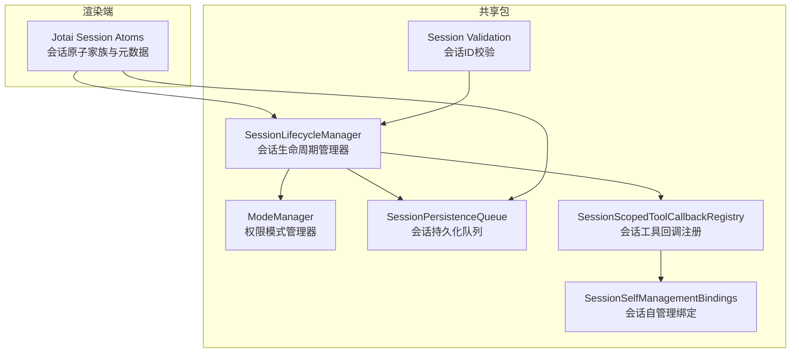
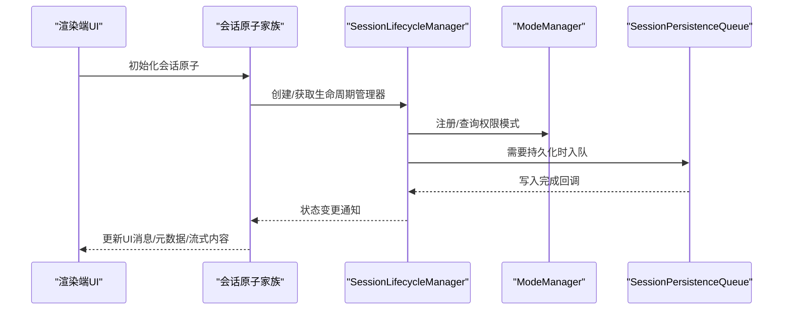
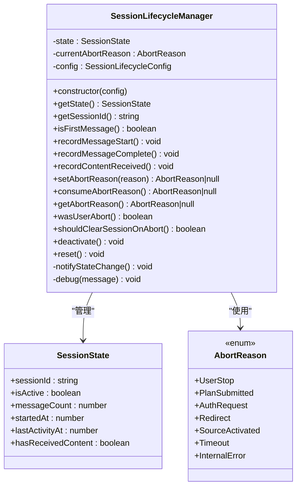
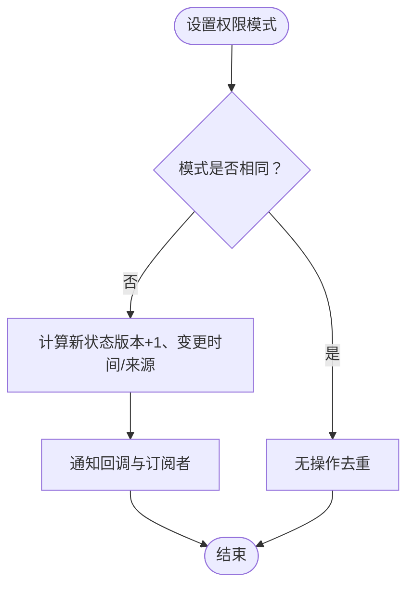
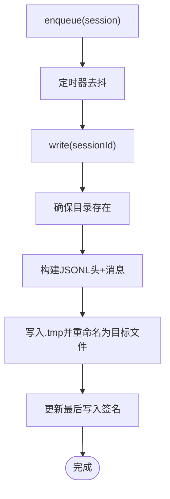
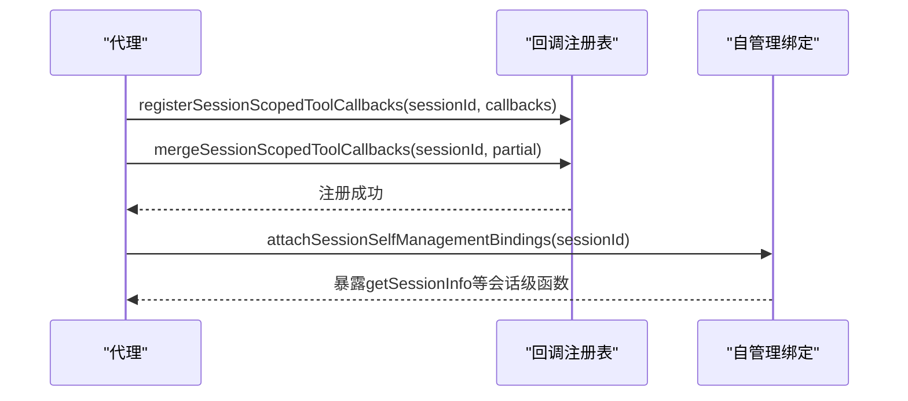
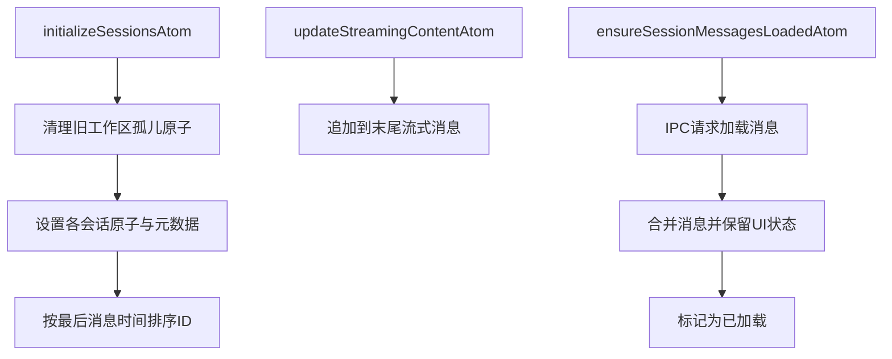
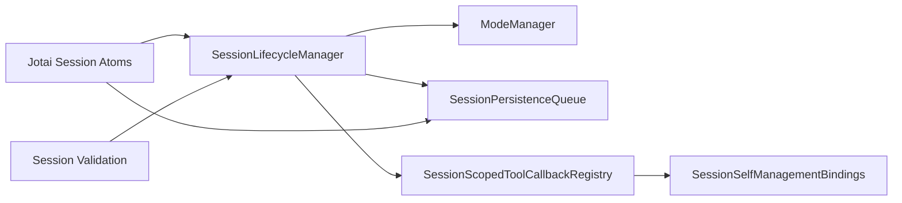

# 会话生命周期管理

<cite>
**本文引用的文件**
- [session-lifecycle.ts](file://packages/shared/src/agent/core/session-lifecycle.ts)
- [session-lifecycle.test.ts](file://packages/shared/src/agent/core/__tests__/session-lifecycle.test.ts)
- [mode-manager.ts](file://packages/shared/src/agent/mode-manager.ts)
- [session-scoped-tool-callback-registry.ts](file://packages/shared/src/agent/session-scoped-tool-callback-registry.ts)
- [session-self-management-bindings.ts](file://packages/shared/src/agent/session-self-management-bindings.ts)
- [persistence-queue.ts](file://packages/shared/src/sessions/persistence-queue.ts)
- [sessions.ts](file://apps/electron/src/renderer/atoms/sessions.ts)
- [validation.ts](file://packages/shared/src/sessions/validation.ts)
- [session-validation.test.ts](file://packages/shared/tests/session-validation.test.ts)
- [pi-agent.ts](file://packages/shared/src/agent/pi-agent.ts)
- [browser-tool-runtime.ts](file://packages/shared/src/agent/browser-tool-runtime.ts)
- [browser-tools.ts](file://packages/shared/src/agent/browser-tools.ts)
- [claude-agent.ts](file://packages/shared/src/agent/claude-agent.ts)
</cite>

## 目录
1. [引言](#引言)
2. [项目结构](#项目结构)
3. [核心组件](#核心组件)
4. [架构总览](#架构总览)
5. [详细组件分析](#详细组件分析)
6. [依赖关系分析](#依赖关系分析)
7. [性能考量](#性能考量)
8. [故障排查指南](#故障排查指南)
9. [结论](#结论)
10. [附录](#附录)

## 引言
本文件系统性阐述会话生命周期管理的设计与实现，覆盖会话创建、初始化、运行、暂停、恢复、销毁等阶段的状态转换机制；详述初始化过程中的资源分配、配置加载、依赖注入等关键步骤；明确状态转换的触发条件、验证规则与回滚策略；并提供会话超时处理、异常恢复、优雅关闭等容错机制。同时给出会话生命周期钩子函数的使用方法与最佳实践，帮助开发者深入理解并正确使用会话状态管理。

## 项目结构
围绕会话生命周期的关键模块分布于共享包与渲染端应用中：
- 共享包（packages/shared）：会话生命周期管理器、权限模式管理、会话持久化队列、会话工具回调注册与绑定、会话ID校验等。
- 渲染端（apps/electron/src/renderer）：基于 Jotai 的会话原子家族与元数据管理，负责 UI 状态隔离与懒加载。

图表来源
- [session-lifecycle.ts:94-244](file://packages/shared/src/agent/core/session-lifecycle.ts#L94-L244)
- [mode-manager.ts:230-376](file://packages/shared/src/agent/mode-manager.ts#L230-L376)
- [persistence-queue.ts:59-241](file://packages/shared/src/sessions/persistence-queue.ts#L59-L241)
- [session-scoped-tool-callback-registry.ts:84-125](file://packages/shared/src/agent/session-scoped-tool-callback-registry.ts#L84-L125)
- [session-self-management-bindings.ts:112-127](file://packages/shared/src/agent/session-self-management-bindings.ts#L112-L127)
- [sessions.ts:122-498](file://apps/electron/src/renderer/atoms/sessions.ts#L122-L498)
- [validation.ts:24-41](file://packages/shared/src/sessions/validation.ts#L24-L41)

章节来源
- [session-lifecycle.ts:1-254](file://packages/shared/src/agent/core/session-lifecycle.ts#L1-L254)
- [sessions.ts:1-679](file://apps/electron/src/renderer/atoms/sessions.ts#L1-L679)

## 核心组件
- 会话生命周期管理器（SessionLifecycleManager）
  - 负责记录会话状态（活跃、消息计数、时间戳）、记录消息开始/完成、内容接收、设置/消费中断原因、判断是否用户中断、是否应清空会话状态、停用与重置等。
  - 提供工厂函数创建实例，并通过配置回调通知状态变化。
- 权限模式管理器（ModeManager）
  - 维护每个会话的权限模式（安全/询问/允许全部），支持模式切换、版本号递增、变更来源追踪、订阅回调等。
- 会话持久化队列（SessionPersistenceQueue）
  - 延迟异步写入，合并频繁写入，序列化同一会话的并发写入，采用原子写法（临时文件+重命名）保证崩溃安全。
- 会话工具回调注册与绑定
  - 为特定会话注册/合并/注销工具回调，并在上下文中暴露会话级工具接口。
- 渲染端会话原子家族（Jotai）
  - 按会话隔离状态，避免跨会话渲染风暴；支持懒加载、消息追加、流式更新、元数据同步等。

章节来源
- [session-lifecycle.ts:94-244](file://packages/shared/src/agent/core/session-lifecycle.ts#L94-L244)
- [mode-manager.ts:230-376](file://packages/shared/src/agent/mode-manager.ts#L230-L376)
- [persistence-queue.ts:59-241](file://packages/shared/src/sessions/persistence-queue.ts#L59-L241)
- [session-scoped-tool-callback-registry.ts:84-125](file://packages/shared/src/agent/session-scoped-tool-callback-registry.ts#L84-L125)
- [sessions.ts:122-498](file://apps/electron/src/renderer/atoms/sessions.ts#L122-L498)

## 架构总览
会话生命周期贯穿“创建—运行—暂停/恢复—销毁”全流程，由生命周期管理器统一调度，配合权限模式、持久化与 UI 原子家族协同工作。

图表来源
- [sessions.ts:122-498](file://apps/electron/src/renderer/atoms/sessions.ts#L122-L498)
- [session-lifecycle.ts:94-244](file://packages/shared/src/agent/core/session-lifecycle.ts#L94-L244)
- [mode-manager.ts:230-376](file://packages/shared/src/agent/mode-manager.ts#L230-L376)
- [persistence-queue.ts:59-241](file://packages/shared/src/sessions/persistence-queue.ts#L59-L241)

## 详细组件分析

### 会话生命周期管理器（SessionLifecycleManager）
- 关键职责
  - 记录消息开始/完成、首次消息判定、内容接收首帧标记、最后活动时间维护。
  - 中断原因管理：设置/消费/查询中断原因，区分用户中断；根据“是否已收到内容且为第一条消息”决定是否清空会话状态以避免恢复到不一致状态。
  - 生命周期操作：停用（deactivate）、重置（reset）。
  - 状态变更通知：通过配置回调对外广播状态变化。
- 触发条件与验证
  - 消息完成与内容接收分别触发状态变更回调，且内容接收仅在首次生效。
  - 中断原因用于区分内部错误与用户操作，指导后续清理策略。
- 回滚机制
  - 当满足“未收到内容且为第一条消息”的中断条件时，调用重置以清除会话状态，防止恢复到半成品状态。
- 工厂函数
  - 通过工厂函数创建实例，便于集中配置与测试。

图表来源
- [session-lifecycle.ts:48-244](file://packages/shared/src/agent/core/session-lifecycle.ts#L48-L244)

章节来源
- [session-lifecycle.ts:94-244](file://packages/shared/src/agent/core/session-lifecycle.ts#L94-L244)
- [session-lifecycle.test.ts:144-185](file://packages/shared/src/agent/core/__tests__/session-lifecycle.test.ts#L144-L185)

### 权限模式管理器（ModeManager）
- 关键职责
  - 维护每个会话的权限模式（安全/询问/允许全部），支持模式切换、版本号递增、变更来源追踪（用户/系统/自动化/恢复）。
  - 支持订阅回调与 React useSyncExternalStore 订阅，确保 UI 与状态一致。
  - 初始化与清理：按会话注册回调、设置初始模式、清理会话状态。
- 触发条件与验证
  - 模式变更时生成过渡信息（上一模式、当前模式、版本号），仅在模式实际变化时触发回调。
  - 变更来源用于区分用户一次性信号，避免重复提示。
- 回滚机制
  - 通过“上次用户信号消耗版本”字段，确保一次用户模式变更只触发一次提示或交互。

图表来源
- [mode-manager.ts:274-312](file://packages/shared/src/agent/mode-manager.ts#L274-L312)

章节来源
- [mode-manager.ts:230-376](file://packages/shared/src/agent/mode-manager.ts#L230-L376)

### 会话持久化队列（SessionPersistenceQueue）
- 关键职责
  - 延迟写入：对同一会话的多次写入进行去抖合并，减少磁盘压力。
  - 并发控制：同一会话的写入串行化，避免竞态（尤其是快速连续 flush 导致的 .tmp 文件冲突）。
  - 原子写入：先写临时文件再重命名，崩溃时保留原文件，保证一致性。
  - 元数据一致性：检测磁盘与本地头签名差异，必要时保留外部变更（如 watcher 编辑、直接头编辑）。
- 触发条件与验证
  - 入队后定时触发写入；flush/flushAll 显式触发；cancel 取消待写。
  - 写入前确保目录存在，路径跨平台兼容。
- 回滚机制
  - 通过签名比对与“最后写入签名”跟踪，抑制自身写入引发的配置监听误触发。

图表来源
- [persistence-queue.ts:73-166](file://packages/shared/src/sessions/persistence-queue.ts#L73-L166)

章节来源
- [persistence-queue.ts:59-241](file://packages/shared/src/sessions/persistence-queue.ts#L59-L241)

### 会话工具回调注册与绑定
- 会话工具回调注册
  - 为指定会话注册/合并/注销工具回调，支持在代理注册核心回调后再追加浏览器面板等功能。
- 会话自管理绑定
  - 在上下文中暴露会话级工具接口（如获取会话信息），默认将 sid 参数映射到当前会话 ID。

图表来源
- [session-scoped-tool-callback-registry.ts:84-125](file://packages/shared/src/agent/session-scoped-tool-callback-registry.ts#L84-L125)
- [session-self-management-bindings.ts:112-127](file://packages/shared/src/agent/session-self-management-bindings.ts#L112-L127)

章节来源
- [session-scoped-tool-callback-registry.ts:84-125](file://packages/shared/src/agent/session-scoped-tool-callback-registry.ts#L84-L125)
- [session-self-management-bindings.ts:112-127](file://packages/shared/src/agent/session-self-management-bindings.ts#L112-L127)

### 渲染端会话原子家族（Jotai）
- 关键职责
  - 使用 atomFamily 为每个会话创建独立原子，避免跨会话渲染风暴。
  - 支持懒加载：会话列表仅含轻量元数据，消息按需加载；提供 promise 去重缓存。
  - 流式更新：支持文本增量、工具调用事件等实时更新，避免覆盖正在处理的会话。
  - 同步策略：在流式期间以原子为源，避免覆盖 UI 乐观更新；手头事件后与 React 状态对齐。
- 触发条件与验证
  - 新增/移除会话、刷新元数据、强制重新加载消息等均受严格条件约束，防止数据丢失。
- 回滚机制
  - 在懒加载恢复场景下，若后端返回空消息（子进程尚未完成懒加载），优先保留内存中的消息，避免丢失流式数据。

图表来源
- [sessions.ts:255-294](file://apps/electron/src/renderer/atoms/sessions.ts#L255-L294)
- [sessions.ts:514-620](file://apps/electron/src/renderer/atoms/sessions.ts#L514-L620)

章节来源
- [sessions.ts:122-498](file://apps/electron/src/renderer/atoms/sessions.ts#L122-L498)

### 会话ID安全校验
- 目标
  - 防止路径穿越攻击，确保会话 ID 仅包含字母数字、连字符与下划线。
- 行为
  - 对空值/非法格式抛出安全错误；
  - 使用 basename 校验是否包含目录分隔符；
  - 单次校验仅触发一次，避免重复日志。
- 测试
  - 包含多种边界与恶意输入的测试用例，覆盖绝对路径、Windows 路径、特殊字符等。

章节来源
- [validation.ts:24-41](file://packages/shared/src/sessions/validation.ts#L24-L41)
- [session-validation.test.ts:67-98](file://packages/shared/tests/session-validation.test.ts#L67-L98)

### 会话超时与异常恢复
- 会话超时
  - 生命周期管理器定义了超时中断原因枚举，可在长时间无活动时触发中断。
- 异常恢复
  - 代理层对“会话过期”“分支截断缺失”等错误进行抑制与回退处理，避免重复完成事件与恢复失败。
- 优雅关闭
  - 退出时 flushAll 所有待写入，确保所有会话持久化完成。

章节来源
- [session-lifecycle.ts:22-43](file://packages/shared/src/agent/core/session-lifecycle.ts#L22-L43)
- [claude-agent.ts:1534-1561](file://packages/shared/src/agent/claude-agent.ts#L1534-L1561)
- [persistence-queue.ts:212-215](file://packages/shared/src/sessions/persistence-queue.ts#L212-L215)

## 依赖关系分析
- 组件耦合
  - SessionLifecycleManager 与 ModeManager 解耦，通过配置回调与订阅机制交互。
  - SessionPersistenceQueue 与存储层解耦，仅依赖会话头与消息序列化工具。
  - 渲染端 Jotai 与生命周期管理器通过状态变更回调解耦，避免直接依赖。
- 外部依赖
  - 文件系统写入（fs/promises）、路径工具、调试输出等。
- 循环依赖
  - 未发现循环依赖迹象；模块职责清晰，接口边界明确。

图表来源
- [session-lifecycle.ts:94-244](file://packages/shared/src/agent/core/session-lifecycle.ts#L94-L244)
- [mode-manager.ts:230-376](file://packages/shared/src/agent/mode-manager.ts#L230-L376)
- [persistence-queue.ts:59-241](file://packages/shared/src/sessions/persistence-queue.ts#L59-L241)
- [session-scoped-tool-callback-registry.ts:84-125](file://packages/shared/src/agent/session-scoped-tool-callback-registry.ts#L84-L125)
- [session-self-management-bindings.ts:112-127](file://packages/shared/src/agent/session-self-management-bindings.ts#L112-L127)
- [sessions.ts:122-498](file://apps/electron/src/renderer/atoms/sessions.ts#L122-L498)
- [validation.ts:24-41](file://packages/shared/src/sessions/validation.ts#L24-L41)

## 性能考量
- 去抖与合并写入
  - SessionPersistenceQueue 对频繁写入进行去抖与合并，降低磁盘 IO 峰值。
- 并发串行化
  - 同一会话写入串行化，避免竞态与临时文件冲突。
- 原子写入
  - 采用 .tmp + 重命名，崩溃安全且避免部分写入。
- UI 渲染隔离
  - Jotai atomFamily 隔离会话状态，避免跨会话渲染风暴。
- 懒加载与去重
  - 会话消息懒加载与 promise 去重，减少 IPC 压力与内存占用。
- 流式更新保护
  - 在流式期间以原子为源，避免覆盖 UI 乐观更新与中间状态丢失。

## 故障排查指南
- 会话无法恢复或状态异常
  - 检查中断原因与“是否收到内容且为第一条消息”的组合，确认是否触发了重置逻辑。
  - 查看生命周期管理器的状态变更回调是否被正确订阅。
- 持久化失败或文件损坏
  - 确认写入流程是否走原子写法（.tmp + 重命名）；检查目录权限与磁盘空间。
  - 若出现竞态，确认是否使用 flush/flushAll 或等待 in-progress 写入完成。
- UI 渲染卡顿或焦点丢失
  - 检查是否存在跨会话状态变更导致的全局重渲染；确认使用 atomFamily 与懒加载策略。
- 会话ID安全告警
  - 校验会话 ID 是否包含路径穿越字符或非法格式；参考安全校验工具与测试用例。

章节来源
- [session-lifecycle.ts:167-208](file://packages/shared/src/agent/core/session-lifecycle.ts#L167-L208)
- [persistence-queue.ts:146-166](file://packages/shared/src/sessions/persistence-queue.ts#L146-L166)
- [sessions.ts:443-498](file://apps/electron/src/renderer/atoms/sessions.ts#L443-L498)
- [validation.ts:24-41](file://packages/shared/src/sessions/validation.ts#L24-L41)

## 结论
该会话生命周期管理体系通过“生命周期管理器 + 权限模式管理 + 持久化队列 + 渲染端原子家族”的协作，实现了从创建到销毁的全链路状态管理与容错保障。其设计强调：
- 状态隔离与最小化通知，降低 UI 压力；
- 原子写入与并发串行化，确保数据一致性；
- 安全校验与异常抑制，提升系统鲁棒性；
- 工厂化与钩子回调，便于扩展与集成。

## 附录
- 会话生命周期钩子函数使用建议
  - 在创建 SessionLifecycleManager 时提供 onStateChange 与 onDebug 回调，以便统一观测与调试。
  - 在代理层结合中断原因与 shouldClearSessionOnAbort 判定，决定是否清理会话状态。
  - 在退出流程调用 flushAll，确保所有会话持久化完成。
- 最佳实践
  - 使用工厂函数集中配置生命周期管理器，避免分散初始化。
  - 在 UI 层通过 atomFamily 与懒加载策略，避免一次性加载大量会话造成内存峰值。
  - 对会话 ID 进行严格校验，杜绝路径穿越风险。
  - 对工具回调注册采用“先核心、后合并”的顺序，确保上下文可用性。