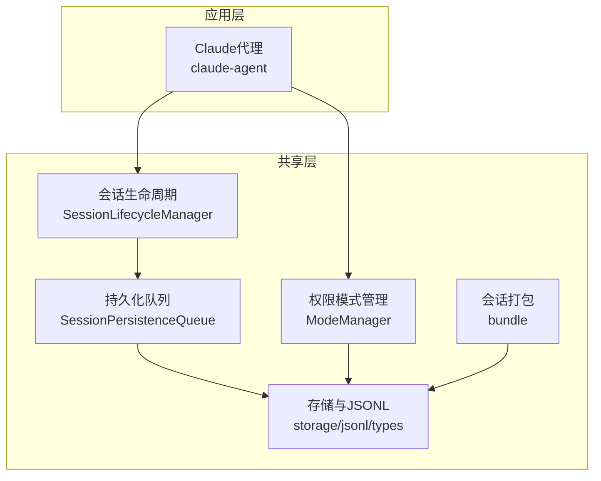
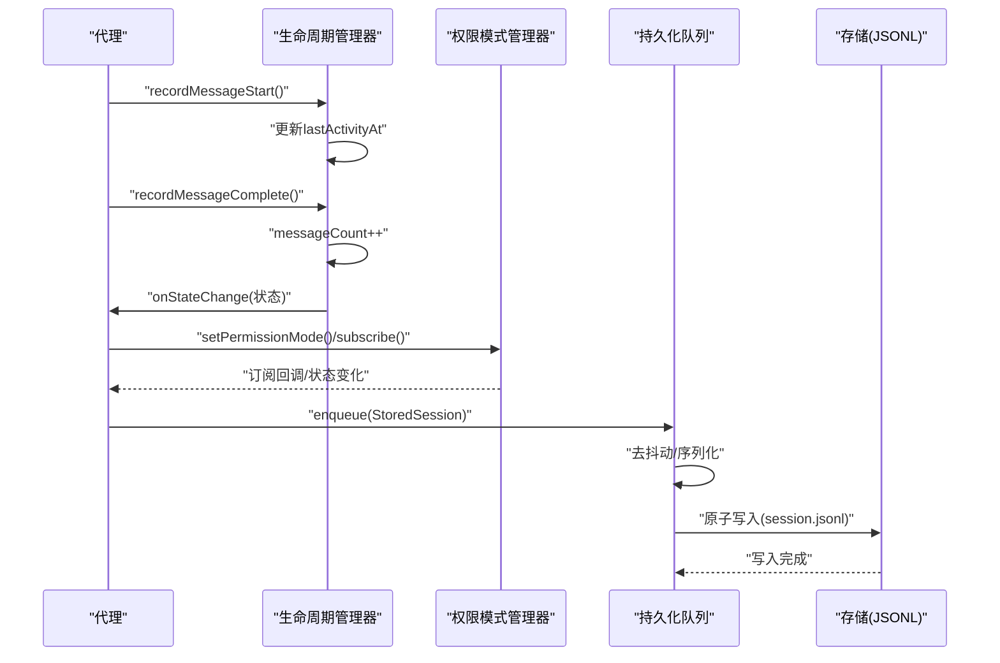
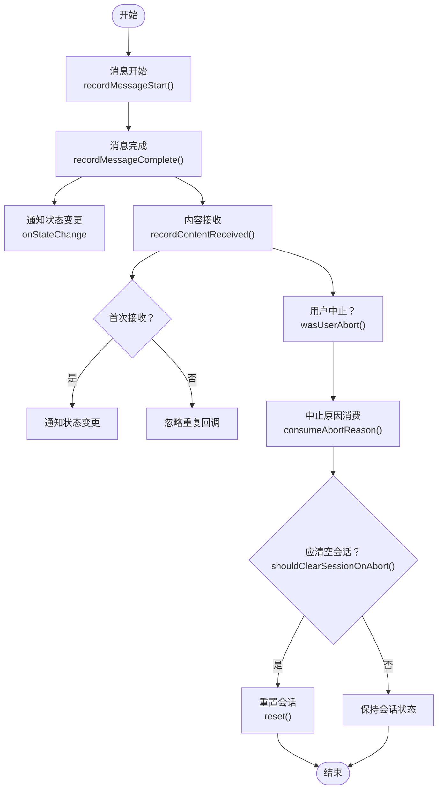
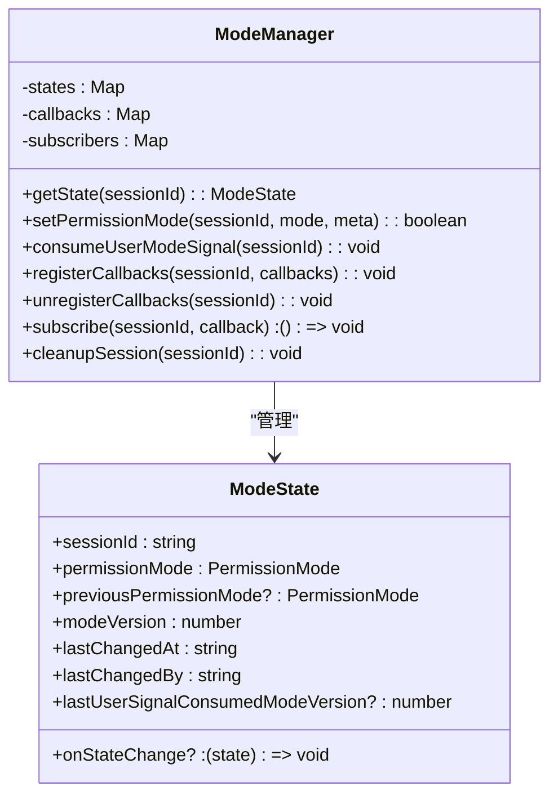
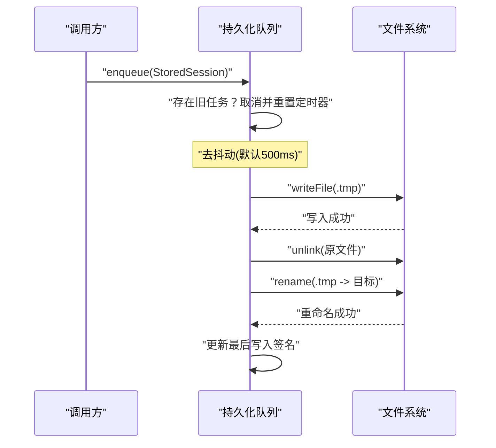
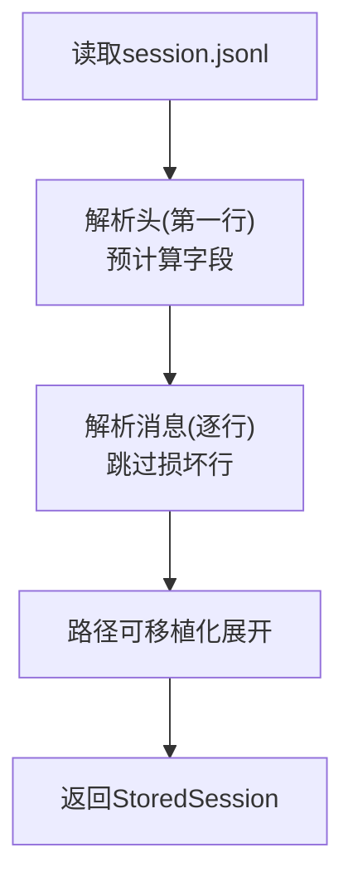
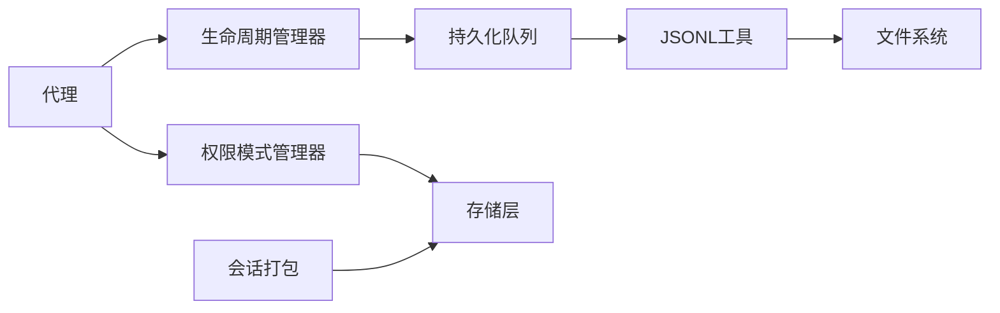

# 会话管理系统

<cite>
**本文档引用的文件**
- [packages/shared/src/agent/core/session-lifecycle.ts](file://packages/shared/src/agent/core/session-lifecycle.ts)
- [packages/shared/src/sessions/persistence-queue.ts](file://packages/shared/src/sessions/persistence-queue.ts)
- [packages/shared/src/sessions/storage.ts](file://packages/shared/src/sessions/storage.ts)
- [packages/shared/src/sessions/jsonl.ts](file://packages/shared/src/sessions/jsonl.ts)
- [packages/shared/src/sessions/types.ts](file://packages/shared/src/sessions/types.ts)
- [packages/shared/src/agent/mode-manager.ts](file://packages/shared/src/agent/mode-manager.ts)
- [packages/shared/src/sessions/bundle.ts](file://packages/shared/src/sessions/bundle.ts)
- [packages/shared/src/agent/core/__tests__/session-lifecycle.test.ts](file://packages/shared/src/agent/core/__tests__/session-lifecycle.test.ts)
- [packages/shared/tests/persistence-queue.test.ts](file://packages/shared/tests/persistence-queue.test.ts)
- [packages/shared/src/agent/claude-agent.ts](file://packages/shared/src/agent/claude-agent.ts)
</cite>

## 目录
1. [简介](#简介)
2. [项目结构](#项目结构)
3. [核心组件](#核心组件)
4. [架构总览](#架构总览)
5. [详细组件分析](#详细组件分析)
6. [依赖关系分析](#依赖关系分析)
7. [性能考量](#性能考量)
8. [故障排查指南](#故障排查指南)
9. [结论](#结论)
10. [附录](#附录)

## 简介
本技术文档面向需要深度定制会话行为的开发者，系统性阐述会话管理系统的生命周期管理、状态工作流、消息处理机制、持久化存储、状态同步与并发控制、原子状态管理与状态钩子、会话搜索与过滤、会话分支合并与历史记录管理、会话迁移与打包导出、以及性能优化与错误恢复策略。文档以代码级可视化图示与分层讲解相结合的方式，帮助读者快速理解并高效扩展会话能力。

## 项目结构
会话管理系统主要由以下模块构成：
- 会话生命周期与状态：提供统一的会话状态跟踪、消息计数、内容接收标记、中止原因管理与清理逻辑。
- 持久化队列：异步、去抖动、序列化的写入队列，确保主线程不阻塞且避免竞态。
- 存储与JSONL：基于JSONL格式的头-消息分离存储，支持路径可移植性、预计算字段与容错解析。
- 类型定义：统一的会话配置、头、元数据与持久化字段清单。
- 权限模式管理：按会话维度的权限模式（安全/询问/允许全部）集中管理与订阅通知。
- 打包与迁移：会话打包导出、跨服务器派发（移动/分叉）、远程传输摘要注入与分支信息保留。

**图表来源**
- [packages/shared/src/agent/core/session-lifecycle.ts:94-244](file://packages/shared/src/agent/core/session-lifecycle.ts#L94-L244)
- [packages/shared/src/agent/mode-manager.ts:230-373](file://packages/shared/src/agent/mode-manager.ts#L230-L373)
- [packages/shared/src/sessions/persistence-queue.ts:59-241](file://packages/shared/src/sessions/persistence-queue.ts#L59-L241)
- [packages/shared/src/sessions/storage.ts:321-335](file://packages/shared/src/sessions/storage.ts#L321-L335)
- [packages/shared/src/sessions/jsonl.ts:103-140](file://packages/shared/src/sessions/jsonl.ts#L103-L140)
- [packages/shared/src/sessions/bundle.ts:86-138](file://packages/shared/src/sessions/bundle.ts#L86-L138)
- [packages/shared/src/agent/claude-agent.ts:1534-1561](file://packages/shared/src/agent/claude-agent.ts#L1534-L1561)

**章节来源**
- [packages/shared/src/agent/core/session-lifecycle.ts:1-254](file://packages/shared/src/agent/core/session-lifecycle.ts#L1-L254)
- [packages/shared/src/sessions/persistence-queue.ts:1-245](file://packages/shared/src/sessions/persistence-queue.ts#L1-L245)
- [packages/shared/src/sessions/storage.ts:1-800](file://packages/shared/src/sessions/storage.ts#L1-L800)
- [packages/shared/src/sessions/jsonl.ts:1-300](file://packages/shared/src/sessions/jsonl.ts#L1-L300)
- [packages/shared/src/sessions/types.ts:1-370](file://packages/shared/src/sessions/types.ts#L1-L370)
- [packages/shared/src/agent/mode-manager.ts:1-800](file://packages/shared/src/agent/mode-manager.ts#L1-L800)
- [packages/shared/src/sessions/bundle.ts:1-163](file://packages/shared/src/sessions/bundle.ts#L1-L163)
- [packages/shared/src/agent/claude-agent.ts:1534-1561](file://packages/shared/src/agent/claude-agent.ts#L1534-L1561)

## 核心组件
- 会话生命周期管理器：负责消息开始/完成、内容接收、中止原因设置与消费、用户中止判定、会话激活/停用与重置，并通过回调通知状态变化。
- 权限模式管理器：按会话维度维护权限模式（安全/询问/允许全部），支持模式版本递增、过渡记录、订阅通知与信号消费。
- 持久化队列：对会话写入进行去抖动、序列化与原子写入（临时文件+重命名），防止崩溃导致的数据损坏与竞态。
- 存储与JSONL：统一的JSONL读写工具，支持路径可移植化、头预计算字段、容错解析与异步头读取。
- 会话类型系统：定义会话配置、头、元数据与持久化字段清单，确保序列化一致性与向后兼容。
- 会话打包与派发：导出会话为可移植包，支持移动/分叉派发与分支信息保留。

**章节来源**
- [packages/shared/src/agent/core/session-lifecycle.ts:94-244](file://packages/shared/src/agent/core/session-lifecycle.ts#L94-L244)
- [packages/shared/src/agent/mode-manager.ts:230-373](file://packages/shared/src/agent/mode-manager.ts#L230-L373)
- [packages/shared/src/sessions/persistence-queue.ts:59-241](file://packages/shared/src/sessions/persistence-queue.ts#L59-L241)
- [packages/shared/src/sessions/storage.ts:321-335](file://packages/shared/src/sessions/storage.ts#L321-L335)
- [packages/shared/src/sessions/jsonl.ts:103-140](file://packages/shared/src/sessions/jsonl.ts#L103-L140)
- [packages/shared/src/sessions/types.ts:26-56](file://packages/shared/src/sessions/types.ts#L26-L56)

## 架构总览
会话管理采用“事件驱动 + 原子持久化”的设计：
- 生命周期事件（消息开始/完成、内容接收、中止）触发状态更新与回调。
- 权限模式变更通过集中式管理器广播到订阅者（如React useSyncExternalStore）。
- 写入统一经由持久化队列，保证异步、去抖动与序列化，避免竞态与阻塞。
- JSONL头包含预计算字段，支撑列表页快速渲染与无消息加载。

**图表来源**
- [packages/shared/src/agent/core/session-lifecycle.ts:135-148](file://packages/shared/src/agent/core/session-lifecycle.ts#L135-L148)
- [packages/shared/src/agent/mode-manager.ts:303-311](file://packages/shared/src/agent/mode-manager.ts#L303-L311)
- [packages/shared/src/sessions/persistence-queue.ts:73-84](file://packages/shared/src/sessions/persistence-queue.ts#L73-L84)
- [packages/shared/src/sessions/jsonl.ts:150-164](file://packages/shared/src/sessions/jsonl.ts#L150-L164)

## 详细组件分析

### 会话生命周期管理
- 关键职责
  - 记录消息开始/完成，维护消息计数与最后活动时间。
  - 首次内容接收标记，用于中止时是否清空会话状态的判断。
  - 中止原因管理：设置、消费、查询、用户中止判定。
  - 会话停用与重置：停用清除中止原因；重置回到初始状态。
  - 状态变更回调：在消息完成或首次内容接收时触发。
- 原子中止清理策略
  - 仅当“未收到任何内容且为第一条消息”时，中止才清空会话，避免断点续传状态被破坏。
- 测试验证
  - 覆盖消息计数、内容接收首触回调、中止原因链路与清理条件。

**图表来源**
- [packages/shared/src/agent/core/session-lifecycle.ts:135-208](file://packages/shared/src/agent/core/session-lifecycle.ts#L135-L208)

**章节来源**
- [packages/shared/src/agent/core/session-lifecycle.ts:94-244](file://packages/shared/src/agent/core/session-lifecycle.ts#L94-L244)
- [packages/shared/src/agent/core/__tests__/session-lifecycle.test.ts:1-198](file://packages/shared/src/agent/core/__tests__/session-lifecycle.test.ts#L1-L198)

### 权限模式管理（原子状态与钩子）
- 会话级权限模式
  - 支持安全（只读探索）、询问（交互式确认危险操作）、允许全部（跳过检查）三种模式。
  - 维护模式版本、上次变更时间与来源、过渡记录（上一模式）。
- 状态钩子与订阅
  - 回调注册/注销，内部同步与React订阅者通知。
  - 用户发起的模式变更信号可一次性消费，避免重复触发。
- 工具执行与拒绝诊断
  - 提供命令危险字符与替换/进程替换检测，配合AST与正则匹配给出拒绝原因与提示。

**图表来源**
- [packages/shared/src/agent/mode-manager.ts:230-373](file://packages/shared/src/agent/mode-manager.ts#L230-L373)

**章节来源**
- [packages/shared/src/agent/mode-manager.ts:1-800](file://packages/shared/src/agent/mode-manager.ts#L1-L800)

### 持久化存储与并发控制
- 去抖动与序列化写入
  - 同一会话的多次写入合并为一次，定时器去抖，默认500ms。
  - 写入序列化：同一会话的flush串行执行，避免共享.tmp文件竞态。
- 原子写入与签名校验
  - 临时文件写入后重命名为目标文件，崩溃时仅临时文件损坏。
  - 头部元数据签名记录，检测外部变更并决定保留磁盘或本地元数据。
- 安全性与路径可移植
  - JSONL中绝对路径替换为可移植占位符，运行时再展开，提升跨机兼容性。
- 列表与元数据加载
  - 仅读取首行头即可生成轻量元数据，支持快速排序与筛选。

**图表来源**
- [packages/shared/src/sessions/persistence-queue.ts:73-166](file://packages/shared/src/sessions/persistence-queue.ts#L73-L166)

**章节来源**
- [packages/shared/src/sessions/persistence-queue.ts:50-241](file://packages/shared/src/sessions/persistence-queue.ts#L50-L241)
- [packages/shared/tests/persistence-queue.test.ts:40-75](file://packages/shared/tests/persistence-queue.test.ts#L40-L75)

### 会话消息处理与JSONL
- JSONL格式
  - 第一行头：包含预计算字段（消息数、最后消息角色、预览、令牌用量、最后最终助手消息ID）。
  - 第二行起：逐条消息，每条一条JSON。
- 路径可移植化
  - 将绝对路径替换为占位符，运行时展开，避免跨平台/跨机路径差异。
- 容错解析
  - 解析消息时跳过损坏/截断行，避免整体会话丢失。
- 异步头读取
  - 仅读取首行，结合签名与预计算字段，支撑列表页快速渲染。

**图表来源**
- [packages/shared/src/sessions/jsonl.ts:103-140](file://packages/shared/src/sessions/jsonl.ts#L103-L140)

**章节来源**
- [packages/shared/src/sessions/jsonl.ts:1-300](file://packages/shared/src/sessions/jsonl.ts#L1-L300)

### 会话类型系统与持久化字段
- 持久化字段清单
  - 明确所有持久化字段，新增字段只需加入清单即可自动参与序列化。
- 头/配置/元数据接口
  - 头包含预计算字段；元数据用于列表展示；配置用于完整会话。
- 字段迁移与兼容
  - 对旧字段（如todoState）做兼容处理，确保向前兼容。

**章节来源**
- [packages/shared/src/sessions/types.ts:26-56](file://packages/shared/src/sessions/types.ts#L26-L56)
- [packages/shared/src/sessions/types.ts:216-370](file://packages/shared/src/sessions/types.ts#L216-L370)

### 会话搜索与过滤
- 过滤器
  - 标记会话、已完成（关闭类）会话、收件箱（开放类）会话、归档会话、活跃会话。
- 分类依据
  - 基于状态分类器与状态配置验证，确保状态合法性。
- 排序
  - 按最后使用时间降序排列，便于最近优先展示。

**章节来源**
- [packages/shared/src/sessions/storage.ts:723-763](file://packages/shared/src/sessions/storage.ts#L723-L763)

### 会话分支合并与历史记录
- 分支信息
  - 记录父消息ID、SDK会话ID、SDK工作目录、SDK转交锚点，确保严格上下文切割。
- 导出与派发
  - 打包导出会话及其文件，支持移动（复制后删除原会话）与分叉（保留父上下文）两种派发模式。
- 远程传输摘要
  - 首次转交后注入一次性摘要，避免重复注入。

**章节来源**
- [packages/shared/src/sessions/types.ts:170-198](file://packages/shared/src/sessions/types.ts#L170-L198)
- [packages/shared/src/sessions/bundle.ts:47-74](file://packages/shared/src/sessions/bundle.ts#L47-L74)
- [packages/shared/src/sessions/bundle.ts:86-138](file://packages/shared/src/sessions/bundle.ts#L86-L138)

### 会话迁移与恢复
- SDK会话ID更新与恢复
  - 在清理恢复与SDK会话ID更新之间，通过序列化flush避免竞态与损坏。
- 分支/恢复错误抑制
  - 当恢复/分叉失败（如父消息不存在或会话过期）时，抑制错误事件并进行回退重试。
- 元数据签名与自触发抑制
  - 通过签名记录避免配置监听器对自身写入产生反向修正。

**章节来源**
- [packages/shared/src/sessions/persistence-queue.ts:173-194](file://packages/shared/src/sessions/persistence-queue.ts#L173-L194)
- [packages/shared/src/agent/claude-agent.ts:1534-1561](file://packages/shared/src/agent/claude-agent.ts#L1534-L1561)

## 依赖关系分析
- 组件耦合
  - 生命周期管理器与持久化队列强耦合（统一写入入口）。
  - 权限模式管理器与存储层弱耦合，通过订阅与回调交互。
  - JSONL工具与存储层紧密协作，提供路径可移植与容错解析。
- 外部依赖
  - 文件系统API用于原子写入与目录管理。
  - 路径工具库用于跨平台路径规范化与可移植化。

**图表来源**
- [packages/shared/src/agent/core/session-lifecycle.ts:237-239](file://packages/shared/src/agent/core/session-lifecycle.ts#L237-L239)
- [packages/shared/src/sessions/persistence-queue.ts:90-166](file://packages/shared/src/sessions/persistence-queue.ts#L90-L166)
- [packages/shared/src/sessions/jsonl.ts:150-164](file://packages/shared/src/sessions/jsonl.ts#L150-L164)
- [packages/shared/src/agent/mode-manager.ts:303-311](file://packages/shared/src/agent/mode-manager.ts#L303-L311)

**章节来源**
- [packages/shared/src/agent/core/session-lifecycle.ts:94-244](file://packages/shared/src/agent/core/session-lifecycle.ts#L94-L244)
- [packages/shared/src/sessions/persistence-queue.ts:59-241](file://packages/shared/src/sessions/persistence-queue.ts#L59-L241)
- [packages/shared/src/sessions/jsonl.ts:1-300](file://packages/shared/src/sessions/jsonl.ts#L1-L300)
- [packages/shared/src/agent/mode-manager.ts:230-373](file://packages/shared/src/agent/mode-manager.ts#L230-L373)

## 性能考量
- I/O模型
  - JSONL头读取与异步头读取减少I/O开销，列表页无需加载消息体。
  - 去抖动写入降低频繁写入带来的磁盘压力。
- 内存管理
  - 消息解析采用逐行容错，避免大对象一次性解析导致内存峰值。
  - 轻量元数据（头）承载列表所需信息，减少不必要的消息加载。
- 并发与竞态
  - 同一会话写入序列化，避免共享.tmp文件竞态。
  - 元数据签名与自触发抑制减少无效事件与回滚。

[本节为通用指导，无需特定文件引用]

## 故障排查指南
- 写入失败或文件损坏
  - 检查持久化队列日志与错误输出；确认临时文件是否残留；核对签名与元数据冲突。
- 列表显示异常
  - 确认头预计算字段是否正确；检查状态验证与迁移逻辑。
- 权限模式异常
  - 检查模式版本与过渡记录；确认用户信号是否已消费；查看订阅回调是否注册。
- 分支/恢复失败
  - 查看代理侧错误抑制与回退逻辑；确认父消息是否存在；核对SDK会话ID与工作目录。

**章节来源**
- [packages/shared/src/sessions/persistence-queue.ts:163-166](file://packages/shared/src/sessions/persistence-queue.ts#L163-L166)
- [packages/shared/src/agent/claude-agent.ts:1534-1561](file://packages/shared/src/agent/claude-agent.ts#L1534-L1561)

## 结论
该会话管理系统通过生命周期原子化、权限模式集中化、JSONL可移植化与持久化队列的异步序列化写入，构建了高可靠、高性能且易于扩展的会话基础设施。开发者可在上述组件基础上，灵活定制状态钩子、消息处理策略、分支合并与迁移流程，满足复杂场景下的会话管理需求。

## 附录
- 关键API与路径参考
  - 会话生命周期管理：[packages/shared/src/agent/core/session-lifecycle.ts:94-244](file://packages/shared/src/agent/core/session-lifecycle.ts#L94-L244)
  - 权限模式管理：[packages/shared/src/agent/mode-manager.ts:230-373](file://packages/shared/src/agent/mode-manager.ts#L230-L373)
  - 持久化队列：[packages/shared/src/sessions/persistence-queue.ts:59-241](file://packages/shared/src/sessions/persistence-queue.ts#L59-L241)
  - 存储与JSONL：[packages/shared/src/sessions/storage.ts:321-335](file://packages/shared/src/sessions/storage.ts#L321-L335), [packages/shared/src/sessions/jsonl.ts:103-140](file://packages/shared/src/sessions/jsonl.ts#L103-L140)
  - 会话类型系统：[packages/shared/src/sessions/types.ts:26-56](file://packages/shared/src/sessions/types.ts#L26-L56)
  - 会话打包与派发：[packages/shared/src/sessions/bundle.ts:86-138](file://packages/shared/src/sessions/bundle.ts#L86-L138)