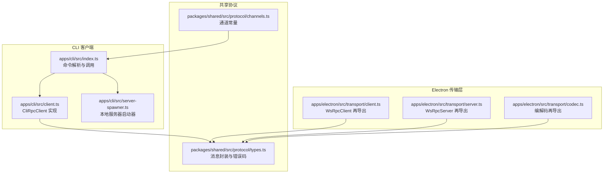
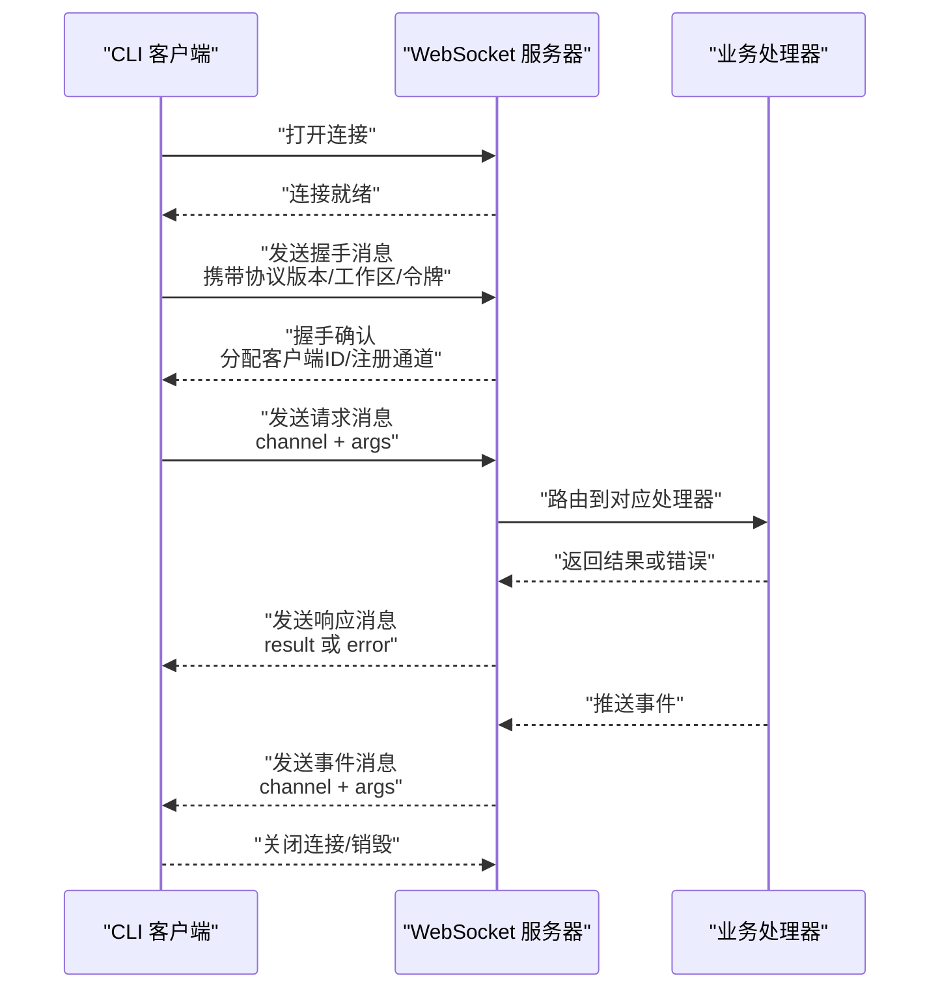
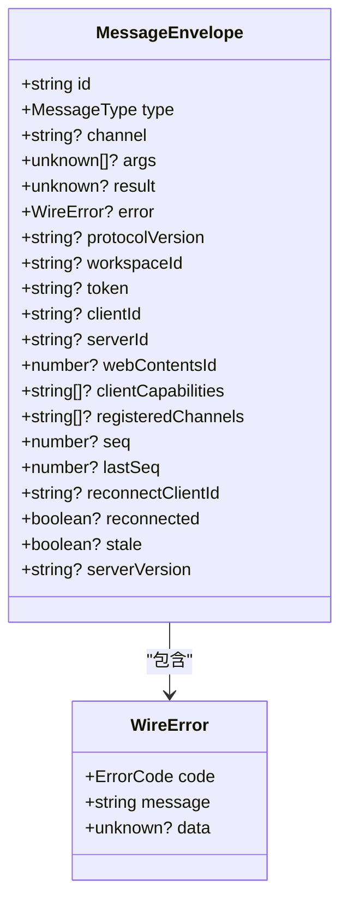
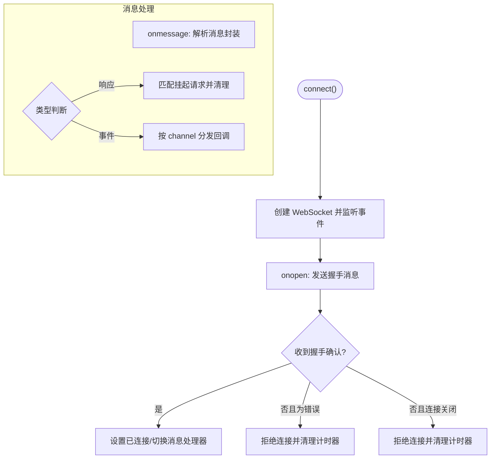
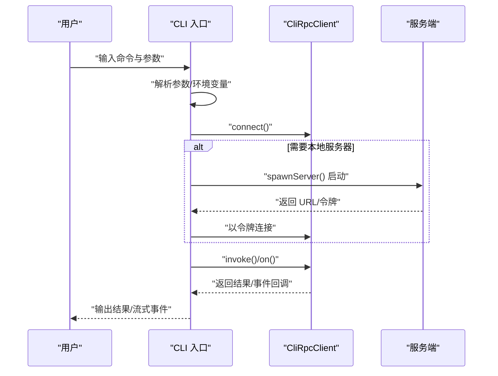
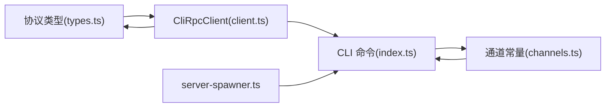

# RPC 通信协议

<cite>
**本文引用的文件**   
- [apps/cli/src/client.ts](file://apps/cli/src/client.ts)
- [apps/cli/src/index.ts](file://apps/cli/src/index.ts)
- [apps/cli/src/server-spawner.ts](file://apps/cli/src/server-spawner.ts)
- [apps/electron/src/transport/client.ts](file://apps/electron/src/transport/client.ts)
- [apps/electron/src/transport/server.ts](file://apps/electron/src/transport/server.ts)
- [apps/electron/src/transport/codec.ts](file://apps/electron/src/transport/codec.ts)
- [packages/shared/src/protocol/types.ts](file://packages/shared/src/protocol/types.ts)
- [packages/shared/src/protocol/channels.ts](file://packages/shared/src/protocol/channels.ts)
- [apps/cli/src/commands.test.ts](file://apps/cli/src/commands.test.ts)
</cite>

## 目录
1. [简介](#简介)
2. [项目结构](#项目结构)
3. [核心组件](#核心组件)
4. [架构总览](#架构总览)
5. [详细组件分析](#详细组件分析)
6. [依赖关系分析](#依赖关系分析)
7. [性能考量](#性能考量)
8. [故障排查指南](#故障排查指南)
9. [结论](#结论)
10. [附录](#附录)

## 简介
本文件为 CLI RPC 通信协议的深入技术文档，聚焦于基于 WebSocket 的 RPC 通道：从连接建立与认证、消息编解码与序列化、RPC 请求/响应与事件推送，到连接恢复与安全机制（TLS、令牌验证）。文档同时提供协议扩展与自定义消息格式指南，并给出调试与排障建议，帮助高级开发者与系统集成工程师快速掌握底层通信机制。

## 项目结构
本仓库中与 CLI RPC 协议直接相关的关键模块分布如下：
- CLI 客户端与命令入口：apps/cli/src/client.ts、apps/cli/src/index.ts、apps/cli/src/server-spawner.ts
- Electron 传输层再导出：apps/electron/src/transport/*.ts
- 共享协议类型与通道常量：packages/shared/src/protocol/*.ts
- CLI 命令解析与测试：apps/cli/src/commands.test.ts

**图表来源**
- [apps/cli/src/client.ts:1-240](file://apps/cli/src/client.ts#L1-L240)
- [apps/cli/src/index.ts:1-800](file://apps/cli/src/index.ts#L1-L800)
- [apps/cli/src/server-spawner.ts:1-150](file://apps/cli/src/server-spawner.ts#L1-L150)
- [apps/electron/src/transport/client.ts:1-18](file://apps/electron/src/transport/client.ts#L1-L18)
- [apps/electron/src/transport/server.ts:1-2](file://apps/electron/src/transport/server.ts#L1-L2)
- [apps/electron/src/transport/codec.ts:1-6](file://apps/electron/src/transport/codec.ts#L1-L6)
- [packages/shared/src/protocol/types.ts:1-128](file://packages/shared/src/protocol/types.ts#L1-L128)
- [packages/shared/src/protocol/channels.ts:412-448](file://packages/shared/src/protocol/channels.ts#L412-L448)

**章节来源**
- [apps/cli/src/client.ts:1-240](file://apps/cli/src/client.ts#L1-L240)
- [apps/cli/src/index.ts:1-800](file://apps/cli/src/index.ts#L1-L800)
- [apps/cli/src/server-spawner.ts:1-150](file://apps/cli/src/server-spawner.ts#L1-L150)
- [apps/electron/src/transport/client.ts:1-18](file://apps/electron/src/transport/client.ts#L1-L18)
- [apps/electron/src/transport/server.ts:1-2](file://apps/electron/src/transport/server.ts#L1-L2)
- [apps/electron/src/transport/codec.ts:1-6](file://apps/electron/src/transport/codec.ts#L1-L6)
- [packages/shared/src/protocol/types.ts:1-128](file://packages/shared/src/protocol/types.ts#L1-L128)
- [packages/shared/src/protocol/channels.ts:412-448](file://packages/shared/src/protocol/channels.ts#L412-L448)

## 核心组件
- 消息封装与协议常量：定义消息类型、消息体字段、错误码、心跳与可靠投递常量等，是所有 RPC 交互的基础契约。
- CLI RPC 客户端：实现 WebSocket 连接、握手、请求/响应、事件订阅、超时与销毁逻辑。
- 命令行入口：解析参数、连接服务器、执行命令、流式输出事件、管理生命周期。
- 本地服务器启动器：在无外部服务器时自动启动本地服务并注入令牌。
- Electron 传输层再导出：将通用传输层能力暴露给 Electron 应用，保持跨包一致性。

**章节来源**
- [packages/shared/src/protocol/types.ts:1-128](file://packages/shared/src/protocol/types.ts#L1-L128)
- [apps/cli/src/client.ts:38-240](file://apps/cli/src/client.ts#L38-L240)
- [apps/cli/src/index.ts:43-800](file://apps/cli/src/index.ts#L43-L800)
- [apps/cli/src/server-spawner.ts:55-150](file://apps/cli/src/server-spawner.ts#L55-L150)
- [apps/electron/src/transport/client.ts:8-17](file://apps/electron/src/transport/client.ts#L8-L17)
- [apps/electron/src/transport/server.ts:1-2](file://apps/electron/src/transport/server.ts#L1-L2)
- [apps/electron/src/transport/codec.ts:1-6](file://apps/electron/src/transport/codec.ts#L1-L6)

## 架构总览
下图展示 CLI 客户端与服务端之间的典型交互路径：握手、RPC 调用、事件推送与错误传播。

**图表来源**
- [apps/cli/src/client.ts:61-129](file://apps/cli/src/client.ts#L61-L129)
- [apps/cli/src/client.ts:132-154](file://apps/cli/src/client.ts#L132-L154)
- [apps/cli/src/client.ts:196-238](file://apps/cli/src/client.ts#L196-L238)
- [packages/shared/src/protocol/types.ts:20-63](file://packages/shared/src/protocol/types.ts#L20-L63)

## 详细组件分析

### 消息封装与协议常量
- 消息类型：握手、握手确认、请求、响应、事件、错误、序列确认。
- 消息体字段：id（UUID）、type、channel、args、result、error、协议版本、工作区ID、令牌、客户端ID、服务端能力等；还包含可靠投递相关的序号与过期策略。
- 错误码：涵盖处理器错误、通道不存在、认证失败、协议版本不支持、会话状态异常等。
- 协议常量：心跳间隔、最大错过心跳数、默认请求超时、事件缓冲大小与 TTL、断连保留时长、序列确认周期等。

**图表来源**
- [packages/shared/src/protocol/types.ts:20-69](file://packages/shared/src/protocol/types.ts#L20-L69)

**章节来源**
- [packages/shared/src/protocol/types.ts:11-128](file://packages/shared/src/protocol/types.ts#L11-L128)

### CLI RPC 客户端（CliRpcClient）
- 连接与握手
  - 使用构造函数传入 URL、可选令牌与工作区ID、请求/连接超时。
  - 打开 WebSocket 后发送握手消息，等待握手确认；若收到错误则拒绝连接。
- 请求/响应
  - 为每个请求生成唯一 id，存入挂起映射，发送请求消息；收到响应后根据 id 匹配并清理。
  - 响应中的错误会被转换为带 code/data 的 Error 对象。
- 事件订阅
  - on(channel, callback) 注册回调集合；收到事件时按 channel 分发。
  - 订阅返回取消函数，便于去订阅。
- 生命周期
  - destroy() 关闭连接并拒绝所有挂起请求；连接关闭时清理挂起队列。
  - 提供 isConnected 与 clientId 只读属性。

**图表来源**
- [apps/cli/src/client.ts:61-129](file://apps/cli/src/client.ts#L61-L129)
- [apps/cli/src/client.ts:196-238](file://apps/cli/src/client.ts#L196-L238)

**章节来源**
- [apps/cli/src/client.ts:38-240](file://apps/cli/src/client.ts#L38-L240)

### 命令行入口与命令执行
- 参数解析：支持 URL、令牌、工作区、超时、JSON 输出、TLS CA、发送超时、运行模式、输出格式、清理策略、详细日志、服务器入口、工作区目录、LLM 提供方/模型/API Key/BaseUrl 等。
- 命令体系：
  - ping/versions/workspaces/sessions/sources/connections 等查询类命令。
  - send：订阅会话事件、发送消息、流式输出、等待完成或中断。
  - run：本地启动服务器、自动配置 LLM 连接、创建会话、发送消息并清理。
  - invoke/listen：通用 RPC 调用与事件监听。
  - cancel/health/validate：取消会话、健康检查、验证服务器。
- 输出与颜色：支持 JSON 输出与 ANSI 彩色输出；TTY 检测与旋转动画。
- 信号处理：捕获 SIGINT/SIGTERM，尝试取消会话并清理资源。

**图表来源**
- [apps/cli/src/index.ts:43-800](file://apps/cli/src/index.ts#L43-L800)
- [apps/cli/src/server-spawner.ts:55-150](file://apps/cli/src/server-spawner.ts#L55-L150)
- [apps/cli/src/client.ts:61-129](file://apps/cli/src/client.ts#L61-L129)

**章节来源**
- [apps/cli/src/index.ts:43-800](file://apps/cli/src/index.ts#L43-L800)
- [apps/cli/src/server-spawner.ts:55-150](file://apps/cli/src/server-spawner.ts#L55-L150)

### 本地服务器启动器
- 自动定位服务入口文件，启动子进程，读取标准输出中的服务器地址与令牌。
- 支持超时控制、静默模式、环境变量透传。
- 提供停止方法，向子进程发送终止信号并等待退出。

**章节来源**
- [apps/cli/src/server-spawner.ts:55-150](file://apps/cli/src/server-spawner.ts#L55-L150)

### 传输层再导出（Electron）
- 将通用传输层能力通过再导出暴露给 Electron 应用，确保跨包一致的客户端/服务器与编解码接口。

**章节来源**
- [apps/electron/src/transport/client.ts:8-17](file://apps/electron/src/transport/client.ts#L8-L17)
- [apps/electron/src/transport/server.ts:1-2](file://apps/electron/src/transport/server.ts#L1-L2)
- [apps/electron/src/transport/codec.ts:1-6](file://apps/electron/src/transport/codec.ts#L1-L6)

## 依赖关系分析
- 协议类型与通道常量被 CLI 客户端与命令入口共同依赖，保证消息契约与通道命名的一致性。
- Electron 传输层通过再导出复用同一套协议实现，降低耦合度。
- CLI 命令入口依赖本地服务器启动器以支持“无需外部服务器”的场景。

**图表来源**
- [packages/shared/src/protocol/types.ts:1-128](file://packages/shared/src/protocol/types.ts#L1-L128)
- [packages/shared/src/protocol/channels.ts:412-448](file://packages/shared/src/protocol/channels.ts#L412-L448)
- [apps/cli/src/client.ts:10-15](file://apps/cli/src/client.ts#L10-L15)
- [apps/cli/src/index.ts:10-11](file://apps/cli/src/index.ts#L10-L11)
- [apps/cli/src/server-spawner.ts:496-510](file://apps/cli/src/server-spawner.ts#L496-L510)

**章节来源**
- [packages/shared/src/protocol/types.ts:1-128](file://packages/shared/src/protocol/types.ts#L1-L128)
- [packages/shared/src/protocol/channels.ts:412-448](file://packages/shared/src/protocol/channels.ts#L412-L448)
- [apps/cli/src/client.ts:10-15](file://apps/cli/src/client.ts#L10-L15)
- [apps/cli/src/index.ts:10-11](file://apps/cli/src/index.ts#L10-L11)
- [apps/cli/src/server-spawner.ts:496-510](file://apps/cli/src/server-spawner.ts#L496-L510)

## 性能考量
- 连接与请求超时：连接超时与请求超时可配置，默认值见协议常量；合理设置避免长时间阻塞。
- 事件缓冲与 TTL：服务端对每客户端事件缓冲有限且有 TTL，断连保留时间有限，需及时消费事件。
- 心跳与保活：服务端定期心跳，客户端需维持活跃；长时间无响应可能导致连接被终止。
- 流式输出：sendAndStream 使用轮询等待完成事件，注意 sendTimeout 的设置以避免无限等待。
- 序列确认：客户端定期发送序列确认，有助于服务端维护可靠投递与断连恢复。

[本节为通用指导，不直接分析具体文件]

## 故障排查指南
- 连接失败
  - 检查 URL 是否正确（ws:// 或 wss://），必要时提供 TLS CA。
  - 观察握手阶段是否收到错误消息，错误码可定位问题（如认证失败、协议版本不支持）。
- 请求超时
  - 调整请求超时参数；确认服务端处理耗时与网络状况。
- 事件未到达
  - 确认订阅的 channel 正确；检查事件缓冲是否被清理。
- 断连与恢复
  - 当前 CLI 客户端未实现自动重连；断开后需重新 connect。
- 参数与环境变量
  - 使用命令行参数覆盖环境变量；参考参数解析测试用例验证行为。

**章节来源**
- [apps/cli/src/commands.test.ts:8-233](file://apps/cli/src/commands.test.ts#L8-L233)
- [apps/cli/src/client.ts:61-129](file://apps/cli/src/client.ts#L61-L129)
- [packages/shared/src/protocol/types.ts:75-90](file://packages/shared/src/protocol/types.ts#L75-L90)

## 结论
该 CLI RPC 通信协议以 WebSocket 为基础，通过统一的消息封装与严格的错误码体系，实现了简洁可靠的请求/响应与事件推送。CLI 客户端专注于最小可用能力：连接、握手、RPC 调用、事件订阅与销毁；命令入口负责参数解析与工作流编排。协议常量与通道定义确保了跨组件一致性。对于需要更复杂功能（如自动重连、可靠投递）的场景，可在现有基础上扩展。

[本节为总结，不直接分析具体文件]

## 附录

### 协议扩展与自定义消息格式指南
- 新增消息类型
  - 在消息类型枚举中添加新类型，并在消息封装中补充必要字段。
  - 更新错误码枚举以覆盖新增场景。
- 新增通道
  - 在通道常量中定义新通道字符串，确保命令入口与服务端路由一致。
- 编解码与序列化
  - 使用共享编解码器进行消息封装与校验，确保跨语言/跨进程兼容。
- 可靠投递与断连恢复
  - 可参考协议常量中的可靠投递参数，结合客户端序列确认机制实现断连恢复。
- 安全加固
  - 强制使用 wss:// 并配置 TLS CA；令牌在握手阶段传递，避免明文泄露。
  - 严格校验握手确认中的协议版本与注册通道列表，防止降级攻击与越权调用。

**章节来源**
- [packages/shared/src/protocol/types.ts:11-128](file://packages/shared/src/protocol/types.ts#L11-L128)
- [packages/shared/src/protocol/channels.ts:412-448](file://packages/shared/src/protocol/channels.ts#L412-L448)
- [apps/electron/src/transport/codec.ts:1-6](file://apps/electron/src/transport/codec.ts#L1-L6)

### 调试工具与技巧
- 使用 validate-server 命令进行端到端验证，覆盖握手、会话生命周期、工具使用、分支与 Webhook 等步骤。
- 在 send/run 命令中启用 JSON 输出与详细日志，结合事件流式输出定位问题。
- 利用 listen 命令监听指定 channel，观察事件结构与顺序。
- 通过 SIGINT/SIGTERM 观察清理流程与资源回收。

**章节来源**
- [apps/cli/src/index.ts:716-751](file://apps/cli/src/index.ts#L716-L751)
- [apps/cli/src/index.ts:786-800](file://apps/cli/src/index.ts#L786-L800)