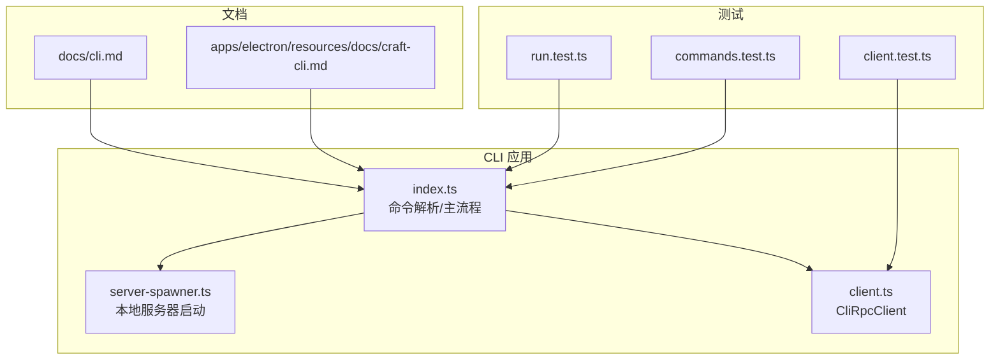
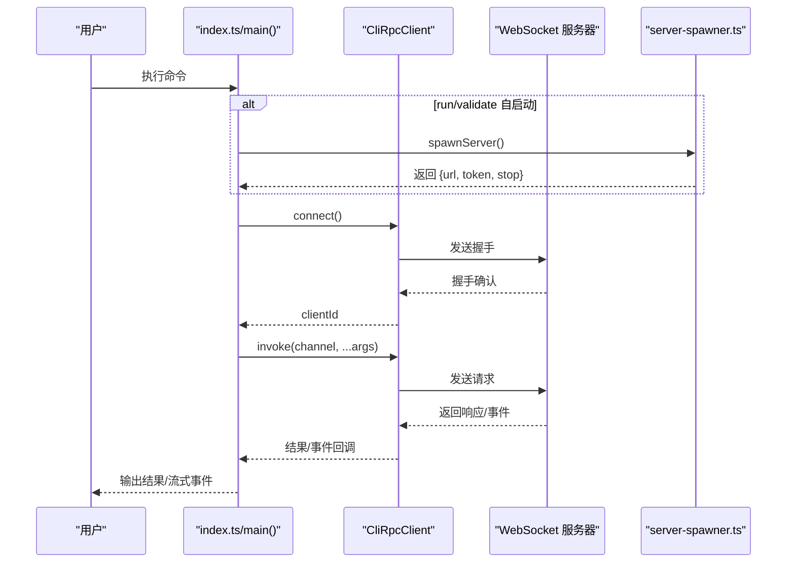
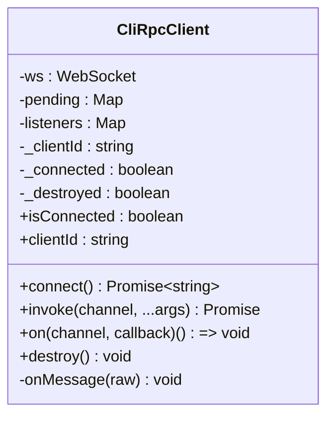
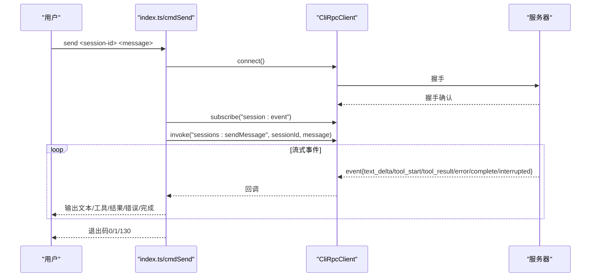
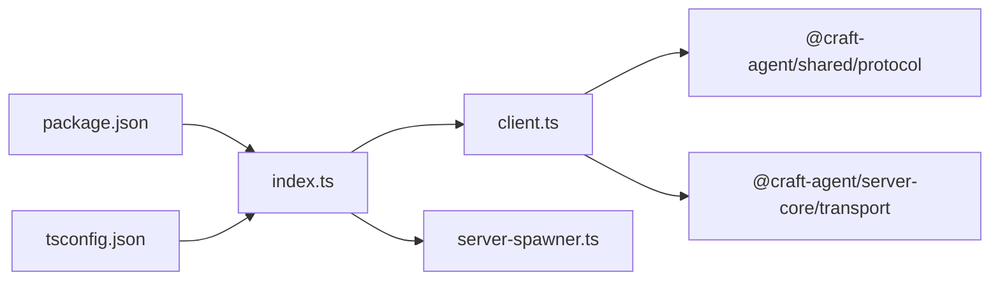

# 命令行客户端

<cite>
**本文引用的文件**
- [apps/cli/src/index.ts](file://apps/cli/src/index.ts)
- [apps/cli/src/client.ts](file://apps/cli/src/client.ts)
- [apps/cli/src/server-spawner.ts](file://apps/cli/src/server-spawner.ts)
- [apps/cli/src/run.test.ts](file://apps/cli/src/run.test.ts)
- [apps/cli/src/commands.test.ts](file://apps/cli/src/commands.test.ts)
- [apps/cli/src/client.test.ts](file://apps/cli/src/client.test.ts)
- [apps/cli/package.json](file://apps/cli/package.json)
- [apps/cli/tsconfig.json](file://apps/cli/tsconfig.json)
- [docs/cli.md](file://docs/cli.md)
- [apps/electron/resources/docs/craft-cli.md](file://apps/electron/resources/docs/craft-cli.md)
</cite>

## 目录
1. [简介](#简介)
2. [项目结构](#项目结构)
3. [核心组件](#核心组件)
4. [架构总览](#架构总览)
5. [详细组件分析](#详细组件分析)
6. [依赖关系分析](#依赖关系分析)
7. [性能与可靠性](#性能与可靠性)
8. [故障排查指南](#故障排查指南)
9. [结论](#结论)
10. [附录](#附录)

## 简介
本文件为 Craft Agents 项目的命令行客户端（craft-cli）提供完整使用与开发文档，覆盖命令行接口设计、参数解析、服务器管理（启动/连接/健康检查/自动重启）、RPC 通信协议与消息格式、错误处理策略，并包含脚本与 CI/CD 集成示例、批量自动化方案、扩展开发指南与调试工具使用方法。目标读者为系统管理员与 DevOps 工程师，帮助快速完成自动化集成与服务器管理任务。

## 项目结构
craft-cli 位于 apps/cli 目录，采用 Bun 运行时与 TypeScript 开发，通过 WebSocket 与 Craft Agent 服务器进行 RPC 通信。核心模块包括：
- 入口与命令分发：apps/cli/src/index.ts
- RPC 客户端：apps/cli/src/client.ts
- 本地服务器启动器：apps/cli/src/server-spawner.ts
- 测试用例：apps/cli/src/run.test.ts、apps/cli/src/commands.test.ts、apps/cli/src/client.test.ts
- 包配置与类型路径：apps/cli/package.json、apps/cli/tsconfig.json
- 用户参考文档：docs/cli.md
- 桌面端 CLI 文档（对比参考）：apps/electron/resources/docs/craft-cli.md

图表来源
- [apps/cli/src/index.ts:1-2076](file://apps/cli/src/index.ts#L1-L2076)
- [apps/cli/src/client.ts:1-240](file://apps/cli/src/client.ts#L1-L240)
- [apps/cli/src/server-spawner.ts:1-150](file://apps/cli/src/server-spawner.ts#L1-L150)
- [apps/cli/src/run.test.ts:1-429](file://apps/cli/src/run.test.ts#L1-L429)
- [apps/cli/src/commands.test.ts:1-404](file://apps/cli/src/commands.test.ts#L1-L404)
- [apps/cli/src/client.test.ts:1-410](file://apps/cli/src/client.test.ts#L1-L410)
- [docs/cli.md:1-241](file://docs/cli.md#L1-L241)
- [apps/electron/resources/docs/craft-cli.md:1-396](file://apps/electron/resources/docs/craft-cli.md#L1-L396)

章节来源
- [apps/cli/src/index.ts:1-200](file://apps/cli/src/index.ts#L1-L200)
- [apps/cli/package.json:1-26](file://apps/cli/package.json#L1-L26)
- [apps/cli/tsconfig.json:1-31](file://apps/cli/tsconfig.json#L1-L31)

## 核心组件
- 命令行入口与主流程：负责参数解析、TLS CA 注入、命令分发、运行模式（run/validate）与普通 RPC 调用。
- CliRpcClient：轻量 WebSocket RPC 客户端，支持握手、请求/响应、事件订阅、超时与断开处理。
- 本地服务器启动器：在子进程中启动 Craft Agent 服务器，解析输出中的 URL/TOKEN 并提供停止能力。
- 验证流程：内置 21 步集成验证，覆盖会话生命周期、工具调用、源与技能、自动化、分支、Webhook 等。

章节来源
- [apps/cli/src/index.ts:1961-2076](file://apps/cli/src/index.ts#L1961-L2076)
- [apps/cli/src/client.ts:38-240](file://apps/cli/src/client.ts#L38-L240)
- [apps/cli/src/server-spawner.ts:55-150](file://apps/cli/src/server-spawner.ts#L55-L150)

## 架构总览
CLI 通过 WebSocket 与服务器建立连接，握手后进入 RPC 通道。所有命令最终以 channel + args 的形式调用服务端 RPC 接口；run/validate 命令可自启动本地服务器，简化使用。

图表来源
- [apps/cli/src/index.ts:1961-2076](file://apps/cli/src/index.ts#L1961-L2076)
- [apps/cli/src/client.ts:61-129](file://apps/cli/src/client.ts#L61-L129)
- [apps/cli/src/server-spawner.ts:55-150](file://apps/cli/src/server-spawner.ts#L55-L150)

## 详细组件分析

### 命令行接口与参数解析
- 支持的全局选项：服务器地址、令牌、工作区、超时、TLS CA、JSON 输出、发送超时、verbose、server-entry、workspace-dir、LLM 提供商/模型/API Key/base-url 等。
- 命令分发：根据命令选择对应处理器（ping/health/versions/workspaces/sessions/connections/sources/session/send/cancel/invoke/listen/run/validate/version/help）。
- run/validate 特性：
  - run：自启动本地服务器，创建会话，发送消息并流式输出，支持权限模式、源启用、模型设置、清理策略等。
  - validate：执行 21 步集成验证，覆盖会话、工具、源、技能、自动化、分支、Webhook 等。

章节来源
- [apps/cli/src/index.ts:43-158](file://apps/cli/src/index.ts#L43-L158)
- [apps/cli/src/index.ts:1961-2076](file://apps/cli/src/index.ts#L1961-L2076)
- [apps/cli/src/index.ts:808-1706](file://apps/cli/src/index.ts#L808-L1706)
- [docs/cli.md:38-170](file://docs/cli.md#L38-L170)

### CliRpcClient：RPC 客户端
- 连接与握手：构造握手包（包含协议版本、可选 token/workspaceId），等待握手确认。
- 请求/响应：为每个请求分配唯一 ID，记录超时，解析响应或错误。
- 事件订阅：对指定 channel 订阅推送事件，支持多监听者与取消订阅。
- 错误处理：连接超时、握手拒绝、断线重连缺失、请求超时、断开清理未完成请求。
- 生命周期：destroy 关闭连接并拒绝所有待处理请求。

图表来源
- [apps/cli/src/client.ts:38-240](file://apps/cli/src/client.ts#L38-L240)

章节来源
- [apps/cli/src/client.ts:38-240](file://apps/cli/src/client.ts#L38-L240)
- [apps/cli/src/client.test.ts:171-384](file://apps/cli/src/client.test.ts#L171-L384)

### 本地服务器启动器（server-spawner）
- 自动定位 server 入口：从当前目录向上查找 monorepo 根下的 packages/server/src/index.ts。
- 启动子进程：传递环境变量（含 CRAFT_SERVER_TOKEN/CRAFT_RPC_HOST/CRAFT_RPC_PORT），读取标准输出中 CRAFT_SERVER_URL/CRAFT_SERVER_TOKEN 行。
- 超时控制：超过 startupTimeout 终止子进程并报错。
- 停止能力：向子进程发送 SIGTERM 并等待退出。

章节来源
- [apps/cli/src/server-spawner.ts:36-150](file://apps/cli/src/server-spawner.ts#L36-L150)

### 验证流程（runValidation）
- 步骤清单：包含握手、健康检查、版本信息、工作区与会话列表、LLM 连接、源与技能、自动化、分支、Webhook 等 21 步。
- 执行策略：逐步执行，收集结果与耗时；支持 JSON 输出与带 Spinner 的实时事件展示。
- 清理策略：异常或完成后清理临时资源（会话、分支会话、源、标签、自动化配置）。

章节来源
- [apps/cli/src/index.ts:997-1706](file://apps/cli/src/index.ts#L997-L1706)
- [apps/cli/src/index.ts:1708-1887](file://apps/cli/src/index.ts#L1708-L1887)

### 命令实现与交互流程
- ping/health/versions：连接后直接调用对应 RPC 并输出结果。
- workspaces/sessions/connections/sources：列出资源，支持 JSON 输出。
- session 子命令：create/messages/delete/cancel。
- send：订阅 session:event，按事件类型输出文本/工具/结果/错误/完成状态，支持 --stdin 与超时。
- invoke/listen：原始 RPC 调用与事件订阅。
- run：自启动服务器、注册/切换工作区、自动配置 LLM 连接、创建会话、发送消息并流式输出、清理。
- validate：runValidation 执行 21 步验证。

图表来源
- [apps/cli/src/index.ts:402-490](file://apps/cli/src/index.ts#L402-L490)
- [apps/cli/src/client.ts:156-182](file://apps/cli/src/client.ts#L156-L182)

章节来源
- [apps/cli/src/index.ts:247-784](file://apps/cli/src/index.ts#L247-L784)
- [apps/cli/src/index.ts:786-804](file://apps/cli/src/index.ts#L786-L804)

### 参数解析与默认值
- 优先级：命令行标志 > 环境变量（如 CRAFT_SERVER_URL/CRAFT_SERVER_TOKEN/CRAFT_TLS_CA/LLM_*）> 默认值。
- LLM 配置：provider/model/api-key/base-url，支持多种提供商与自定义 endpoint。
- run 特有：workspace-dir/source/mode/output-format/no-cleanup/server-entry。
- send 特有：send-timeout、stdin 输入。

章节来源
- [apps/cli/src/index.ts:43-158](file://apps/cli/src/index.ts#L43-L158)
- [apps/cli/src/commands.test.ts:8-233](file://apps/cli/src/commands.test.ts#L8-L233)

## 依赖关系分析
- 内部依赖：
  - @craft-agent/shared/protocol：消息封装与协议版本常量。
  - @craft-agent/server-core/transport：消息序列化/反序列化。
- 外部依赖：
  - Bun 运行时与 WebSocket API。
  - Node 环境变量（如 NODE_EXTRA_CA_CERTS）用于 TLS。
- 类型路径映射：
  - @craft-agent/shared -> ../../packages/shared/src/index.ts
  - @craft-agent/server-core -> ../../packages/server-core/src/index.ts

图表来源
- [apps/cli/src/index.ts:10-16](file://apps/cli/src/index.ts#L10-L16)
- [apps/cli/src/client.ts:8-16](file://apps/cli/src/client.ts#L8-L16)
- [apps/cli/package.json:16-24](file://apps/cli/package.json#L16-L24)
- [apps/cli/tsconfig.json:21-26](file://apps/cli/tsconfig.json#L21-L26)

章节来源
- [apps/cli/package.json:16-24](file://apps/cli/package.json#L16-L24)
- [apps/cli/tsconfig.json:21-26](file://apps/cli/tsconfig.json#L21-L26)

## 性能与可靠性
- 连接与请求超时：connectTimeout/requestTimeout 可配置，默认 10 秒；send 命令默认 5 分钟。
- 流式事件：send/validate 使用事件驱动输出，避免阻塞；Spinner 在无真实输出时保持可见。
- 资源清理：run/validate 在异常或完成后清理会话、分支会话、源、标签、自动化配置；支持 noCleanup 控制。
- TLS：支持自签名证书（NODE_EXTRA_CA_CERTS），便于本地与内网部署。

章节来源
- [apps/cli/src/index.ts:48-90](file://apps/cli/src/index.ts#L48-L90)
- [apps/cli/src/index.ts:1708-1887](file://apps/cli/src/index.ts#L1708-L1887)
- [apps/cli/src/index.ts:1964-1967](file://apps/cli/src/index.ts#L1964-L1967)

## 故障排查指南
常见问题与解决思路：
- 连接超时：检查服务器是否启动、URL 是否可达、网络策略与防火墙。
- AUTH_FAILED：核对令牌与服务器一致，确保 CRAFT_SERVER_TOKEN 设置正确。
- PROTOCOL_VERSION_UNSUPPORTED：升级 CLI 与服务器到相同版本。
- WebSocket 连接错误：自签名证书场景使用 --tls-ca 或设置 CRAFT_TLS_CA。
- 无工作区可用：先在桌面端或 API 创建工作区，或使用 --workspace-dir 自动注册。
- send 超时：检查服务器负载与网络延迟，适当增大 --send-timeout。
- LLM 连接失败：检查 provider/api-key/base-url，或使用 --validate-server 验证。

章节来源
- [docs/cli.md:232-241](file://docs/cli.md#L232-L241)
- [apps/cli/src/index.ts:1708-1887](file://apps/cli/src/index.ts#L1708-L1887)

## 结论
craft-cli 提供了简洁高效的命令行接口，支持服务器管理、会话操作、消息流式输出与自启动验证。其基于 WebSocket 的 RPC 协议与完善的错误处理，适合在自动化流水线与运维场景中稳定使用。通过合理的参数配置与清理策略，可满足从单次任务到持续集成的多样化需求。

## 附录

### 使用与集成示例
- 快速试用（无需外部服务器）：
  - ANTHROPIC_API_KEY=sk-... bun run apps/cli/src/index.ts run "你好世界"
- 连接现有服务器：
  - craft-cli --url ws://127.0.0.1:9100 --token <token> sessions
- 脚本化批处理：
  - 获取工作区列表并统计会话数
  - 创建会话并发送消息
  - 清理会话
- CI/CD 集成：
  - 使用 --validate-server 进行端到端验证
  - 在流水线中捕获 --json 输出，结合 jq 进行解析

章节来源
- [docs/cli.md:196-216](file://docs/cli.md#L196-L216)
- [docs/cli.md:158-194](file://docs/cli.md#L158-L194)

### 扩展开发指南
- 新增命令：
  - 在 index.ts 中新增命令解析与处理器函数，遵循现有风格（connect + invoke + 输出）。
  - 如需自启动服务器，复用 spawnLocalServer/spawnServer。
- 自定义 RPC：
  - 使用 CliRpcClient.invoke(channel, ...args) 调用任意 RPC 接口。
  - 使用 client.on(channel, cb) 订阅推送事件。
- 调试工具：
  - --verbose/--debug：查看服务器 stderr 输出。
  - --json：机器可读输出，便于脚本解析。
  - --validate-server：端到端验证，定位集成问题。

章节来源
- [apps/cli/src/index.ts:1961-2076](file://apps/cli/src/index.ts#L1961-L2076)
- [apps/cli/src/client.ts:156-182](file://apps/cli/src/client.ts#L156-L182)
- [apps/cli/src/server-spawner.ts:55-150](file://apps/cli/src/server-spawner.ts#L55-L150)