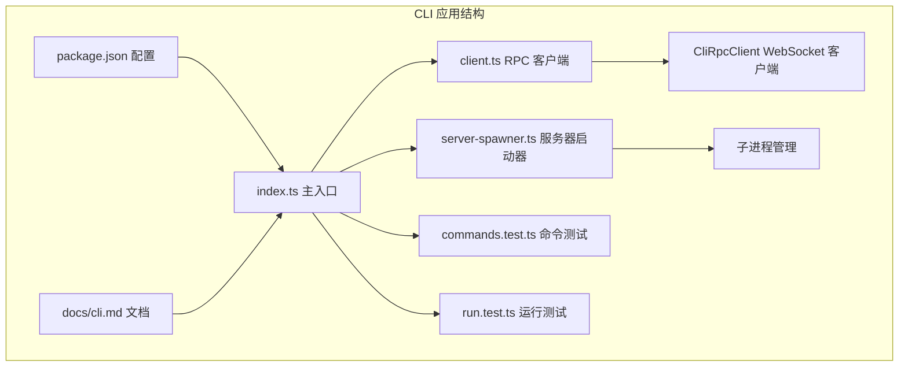
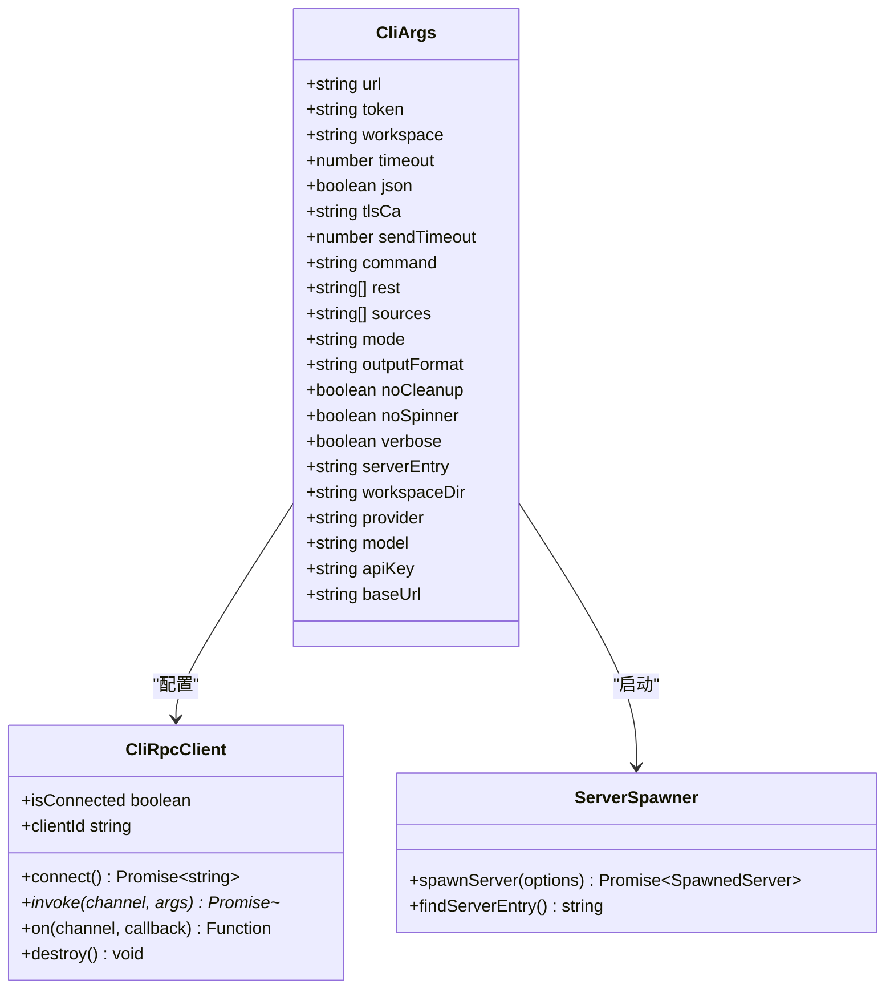
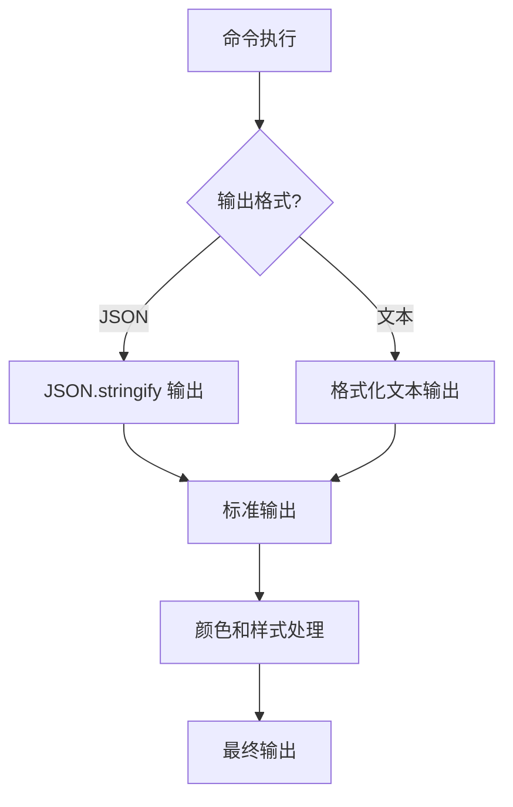
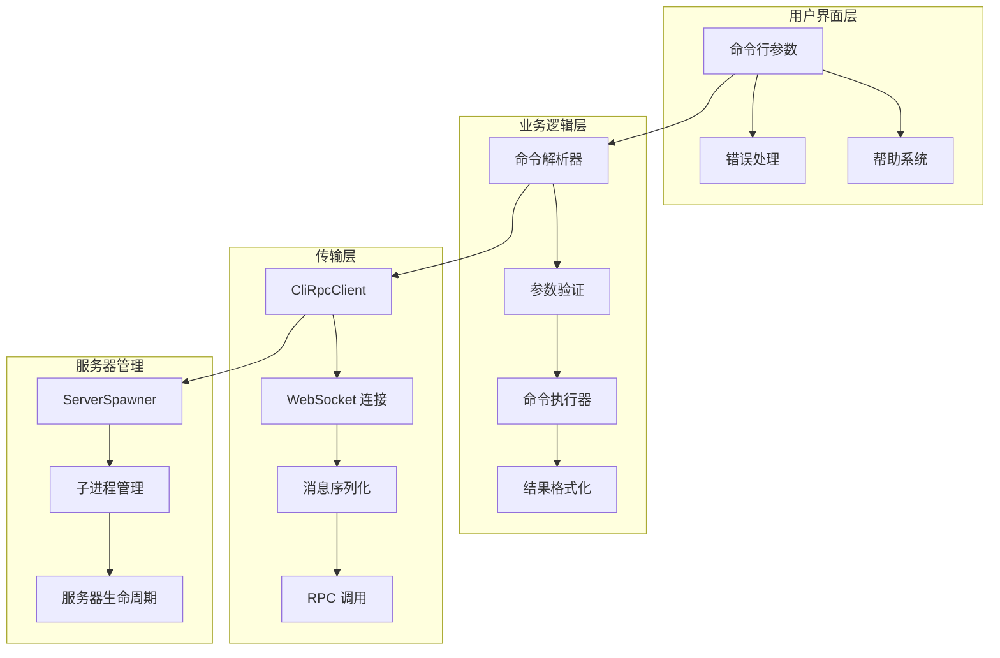
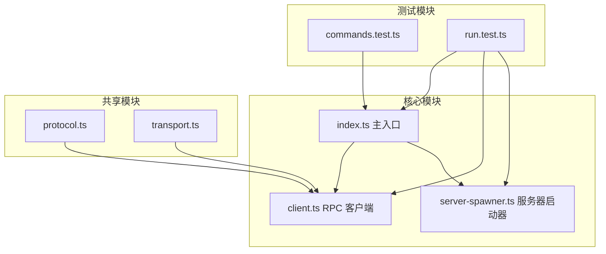

# 命令行接口

<cite>
**本文档引用的文件**
- [apps/cli/src/index.ts](file://apps/cli/src/index.ts)
- [apps/cli/src/client.ts](file://apps/cli/src/client.ts)
- [apps/cli/src/server-spawner.ts](file://apps/cli/src/server-spawner.ts)
- [apps/cli/src/run.test.ts](file://apps/cli/src/run.test.ts)
- [apps/cli/src/commands.test.ts](file://apps/cli/src/commands.test.ts)
- [apps/cli/package.json](file://apps/cli/package.json)
- [docs/cli.md](file://docs/cli.md)
</cite>

## 目录
1. [简介](#简介)
2. [项目结构](#项目结构)
3. [核心组件](#核心组件)
4. [架构概览](#架构概览)
5. [详细组件分析](#详细组件分析)
6. [依赖关系分析](#依赖关系分析)
7. [性能考虑](#性能考虑)
8. [故障排除指南](#故障排除指南)
9. [结论](#结论)
10. [附录](#附录)

## 简介

craft-cli 是一个功能强大的命令行界面，用于与 Craft Agent 服务器进行交互。该工具通过 WebSocket 连接（ws:// 或 wss://）连接到运行中的 Craft Agent 服务器，提供了丰富的命令集来管理资源、会话、发送消息以及验证服务器健康状况。

该 CLI 接口支持两种主要模式：
- **服务器模式**：连接到现有的 Craft Agent 服务器实例
- **自包含模式**：自动启动本地服务器实例，无需预先设置

## 项目结构

craft-cli 位于 `apps/cli` 目录下，采用模块化的 TypeScript 架构设计：



**图表来源**
- [apps/cli/src/index.ts:1-50](file://apps/cli/src/index.ts#L1-L50)
- [apps/cli/src/client.ts:1-50](file://apps/cli/src/client.ts#L1-L50)
- [apps/cli/src/server-spawner.ts:1-50](file://apps/cli/src/server-spawner.ts#L1-L50)

**章节来源**
- [apps/cli/src/index.ts:1-50](file://apps/cli/src/index.ts#L1-L50)
- [apps/cli/package.json:1-26](file://apps/cli/package.json#L1-L26)

## 核心组件

### CLI 参数解析器

CLI 参数解析器是整个系统的入口点，负责处理命令行参数并将其转换为内部数据结构：



**图表来源**
- [apps/cli/src/index.ts:17-41](file://apps/cli/src/index.ts#L17-L41)
- [apps/cli/src/client.ts:38-58](file://apps/cli/src/client.ts#L38-L58)
- [apps/cli/src/server-spawner.ts:15-30](file://apps/cli/src/server-spawner.ts#L15-L30)

### 输出格式化系统

CLI 提供灵活的输出格式化选项，支持人类可读格式和机器可读的 JSON 格式：



**图表来源**
- [apps/cli/src/index.ts:190-198](file://apps/cli/src/index.ts#L190-L198)

**章节来源**
- [apps/cli/src/index.ts:43-158](file://apps/cli/src/index.ts#L43-L158)
- [apps/cli/src/index.ts:190-241](file://apps/cli/src/index.ts#L190-L241)

## 架构概览

craft-cli 采用分层架构设计，确保了清晰的关注点分离和良好的可维护性：



**图表来源**
- [apps/cli/src/index.ts:247-257](file://apps/cli/src/index.ts#L247-L257)
- [apps/cli/src/client.ts:38-129](file://apps/cli/src/client.ts#L38-L129)
- [apps/cli/src/server-spawner.ts:55-149](file://apps/cli/src/server-spawner.ts#L55-L149)

## 详细组件分析

### 命令解析机制

CLI 支持多种命令类型，每种都有特定的语法和参数要求：

#### 基础连接命令

| 命令 | 语法 | 描述 | 使用场景 |
|------|------|------|----------|
| `ping` | `craft-cli ping` | 验证连接性和延迟 | 快速检查服务器连通性 |
| `health` | `craft-cli health` | 检查凭据存储健康状态 | 诊断认证问题 |
| `versions` | `craft-cli versions` | 显示服务器运行时版本 | 环境兼容性检查 |

#### 资源管理命令

| 命令 | 语法 | 描述 | 使用场景 |
|------|------|------|----------|
| `workspaces` | `craft-cli workspaces` | 列出所有工作区 | 管理多工作区环境 |
| `sessions` | `craft-cli sessions` | 列出工作区中的会话 | 会话监控和管理 |
| `connections` | `craft-cli connections` | 列出 LLM 连接 | 大模型配置管理 |
| `sources` | `craft-cli sources` | 列出配置的数据源 | 数据源集成管理 |

#### 会话操作命令

| 命令 | 语法 | 描述 | 使用场景 |
|------|------|------|----------|
| `session create` | `craft-cli session create [--name <n>] [--mode <m>]` | 创建新会话 | 启动新的对话流程 |
| `session messages` | `craft-cli session messages <id>` | 打印会话消息历史 | 调试和审计 |
| `session delete` | `craft-cli session delete <id>` | 删除会话 | 清理过期会话 |
| `cancel` | `craft-cli cancel <id>` | 取消进行中的处理 | 中断长时间运行的操作 |

#### 消息发送命令

| 命令 | 语法 | 描述 | 使用场景 |
|------|------|------|----------|
| `send` | `craft-cli send <session-id> <message>` | 发送消息并实时流式响应 | 与 AI 模型交互 |
| `run` | `craft-cli run <prompt>` | 自包含运行模式 | 快速原型开发和测试 |

#### 高级命令

| 命令 | 语法 | 描述 | 使用场景 |
|------|------|------|----------|
| `invoke` | `craft-cli invoke <channel> [json-args...]` | 发送任意 RPC 调用 | 直接访问底层 API |
| `listen` | `craft-cli listen <channel>` | 订阅推送事件 | 实时监控和调试 |
| `validate` | `craft-cli --validate-server` | 多步骤服务器集成测试 | 系统完整性验证 |

**章节来源**
- [apps/cli/src/index.ts:247-804](file://apps/cli/src/index.ts#L247-L804)
- [apps/cli/src/index.ts:1893-1955](file://apps/cli/src/index.ts#L1893-L1955)

### 参数处理系统

CLI 提供了丰富的参数处理功能，支持多种输入方式和环境变量配置：

#### 环境变量配置

| 环境变量 | 默认值 | 描述 |
|----------|--------|------|
| `CRAFT_SERVER_URL` | 无 | 服务器 WebSocket URL |
| `CRAFT_SERVER_TOKEN` | 无 | 认证令牌 |
| `CRAFT_TLS_CA` | 无 | 自签名 TLS 的自定义 CA 证书 |
| `LLM_PROVIDER` | `anthropic` | 大模型提供商 |
| `LLM_MODEL` | 无 | 模型 ID |
| `LLM_API_KEY` | 无 | API 密钥 |
| `LLM_BASE_URL` | 无 | 自定义 API 端点 |

#### LLM 提供商支持

CLI 支持多种大模型提供商，每种都有特定的环境变量要求：

| 提供商 | 环境变量 | 默认模型 |
|--------|----------|----------|
| `anthropic` | `ANTHROPIC_API_KEY` | `claude-sonnet-4-6` |
| `openai` | `OPENAI_API_KEY` | `gpt-4o` |
| `google` | `GOOGLE_API_KEY` | `gemini-2.0-flash` |
| `openrouter` | `OPENROUTER_API_KEY` | `openrouter` |
| `groq` | `GROQ_API_KEY` | `groq` |
| `mistral` | `MISTRAL_API_KEY` | `mistral` |
| `deepseek` | `DEEPSEEK_API_KEY` | `deepseek-v4-flash` |
| `xai` | `XAI_API_KEY` | `xai` |
| `cerebras` | `CEREBRAS_API_KEY` | `cerebras` |
| `huggingface` | `HUGGINGFACE_API_KEY` | `huggingface` |
| `amazon-bedrock` | AWS 凭证 | `amazon-bedrock` |

**章节来源**
- [apps/cli/src/index.ts:516-555](file://apps/cli/src/index.ts#L516-L555)
- [apps/cli/src/index.ts:557-559](file://apps/cli/src/index.ts#L557-L559)

### 输出格式化选项

CLI 支持多种输出格式，满足不同使用场景的需求：

#### 文本格式输出
- 人类可读的彩色输出
- 实时进度指示器
- 详细的错误信息

#### JSON 格式输出
- 机器可读的结构化数据
- 适合脚本和自动化
- 标准化的数据结构

#### 流式 JSON 输出
- `--output-format stream-json` 选项
- 实时事件流输出
- 适用于实时监控和日志分析

**章节来源**
- [apps/cli/src/index.ts:410-470](file://apps/cli/src/index.ts#L410-L470)
- [apps/cli/src/index.ts:1918-1918](file://apps/cli/src/index.ts#L1918-L1918)

## 依赖关系分析

### 外部依赖

craft-cli 依赖于以下关键包：

```mermaid
graph LR
A[@craft-agent/cli] --> B[@craft-agent/shared]
A --> C[@craft-agent/server-core]
A --> D[bun runtime]
B --> E[协议定义]
C --> F[传输层]
C --> G[RPC 通道]
D --> H[WebSocket 支持]
D --> I[子进程管理]
```

**图表来源**
- [apps/cli/package.json:16-24](file://apps/cli/package.json#L16-L24)

### 内部模块依赖



**图表来源**
- [apps/cli/src/index.ts:10-11](file://apps/cli/src/index.ts#L10-L11)
- [apps/cli/src/client.ts:8-15](file://apps/cli/src/client.ts#L8-L15)

**章节来源**
- [apps/cli/package.json:16-24](file://apps/cli/package.json#L16-L24)

## 性能考虑

### 连接优化

CLI 实现了多种性能优化策略：

- **连接复用**：单个客户端实例可重复使用多个命令
- **超时控制**：可配置的请求和连接超时时间
- **TLS 优化**：支持自定义 CA 证书缓存
- **背压处理**：流式输出的背压控制

### 内存管理

- **事件监听器清理**：自动清理不再使用的事件监听器
- **资源回收**：及时释放 WebSocket 连接和子进程句柄
- **内存泄漏防护**：防止定时器和回调函数导致的内存泄漏

### 并发处理

- **异步操作**：所有网络操作都是异步的
- **Promise 链**：避免回调地狱，提高代码可读性
- **错误隔离**：单个命令失败不影响其他命令执行

## 故障排除指南

### 常见连接问题

| 问题 | 可能原因 | 解决方案 |
|------|----------|----------|
| `Connection timeout` | 服务器未运行或无法访问 | 检查服务器状态，验证 URL 和网络连接 |
| `AUTH_FAILED` | 令牌不正确或过期 | 验证 `CRAFT_SERVER_TOKEN` 设置 |
| `PROTOCOL_VERSION_UNSUPPORTED` | CLI 和服务器版本不匹配 | 更新 CLI 和服务器到相同版本 |
| `WebSocket connection error` | 网络问题或 TLS 配置错误 | 检查防火墙设置，使用 `--tls-ca` 处理自签名证书 |

### LLM 集成问题

| 问题 | 可能原因 | 解决方案 |
|------|----------|----------|
| `No API key found` | 缺少必要的 API 密钥 | 设置 `--api-key` 或相应的环境变量 |
| `Invalid provider` | 不支持的提供商名称 | 使用受支持的提供商列表中的名称 |
| `Model not found` | 指定的模型不存在 | 检查模型 ID 是否正确，或使用默认模型 |

### 服务器启动问题

| 问题 | 可能原因 | 解决方案 |
|------|----------|----------|
| `Server did not start within 30000ms` | 服务器启动超时 | 检查服务器依赖项，增加 `--timeout` 值 |
| `Could not auto-detect server entry` | 服务器入口文件缺失 | 使用 `--server-entry` 指定正确的路径 |
| `Process exited before printing CRAFT_SERVER_URL` | 服务器启动失败 | 检查服务器日志输出，验证配置 |

**章节来源**
- [apps/cli/src/index.ts:2063-2067](file://apps/cli/src/index.ts#L2063-L2067)
- [apps/cli/src/server-spawner.ts:94-97](file://apps/cli/src/server-spawner.ts#L94-L97)

## 结论

craft-cli 提供了一个功能完整、易于使用的命令行接口，支持从简单的连接测试到复杂的服务器验证等多种使用场景。其模块化的设计使得扩展和维护变得简单，而丰富的配置选项则满足了不同用户的需求。

通过支持多种输出格式、环境变量配置和自定义提供商，craft-cli 成为了一个强大而灵活的工具，适用于个人开发者、DevOps 工程师和系统管理员等各种角色。

## 附录

### 实际使用示例

#### 基础连接测试
```bash
# 基本连接测试
craft-cli --url ws://localhost:9100 --token your-token ping

# 健康检查
craft-cli --url ws://localhost:9100 --token your-token health

# 版本信息
craft-cli --url ws://localhost:9100 --token your-token versions
```

#### 资源管理
```bash
# 列出工作区
craft-cli --url ws://localhost:9100 --token your-token workspaces

# 列出会话
craft-cli --url ws://localhost:9100 --token your-token --workspace ws-1 sessions

# 创建新会话
craft-cli --url ws://localhost:9100 --token your-token --workspace ws-1 session create --name "Test Session" --mode safe
```

#### 消息交互
```bash
# 发送消息并实时流式响应
craft-cli --url ws://localhost:9100 --token your-token send sess-123 "Hello, world!"

# 从标准输入读取消息
echo "Summarize this document" | craft-cli --url ws://localhost:9100 --token your-token send sess-123

# 自包含运行模式
ANTHROPIC_API_KEY=sk-... craft-cli run "What files are in the current directory?"
```

#### 高级操作
```bash
# 直接 RPC 调用
craft-cli --url ws://localhost:9100 --token your-token invoke system:homeDir

# 订阅事件
craft-cli --url ws://localhost:9100 --token your-token listen session:event

# 服务器验证
craft-cli --validate-server --url ws://localhost:9100 --token your-token
```

### 最佳实践

1. **环境变量管理**：优先使用环境变量而不是命令行参数，便于在 CI/CD 环境中使用
2. **超时设置**：根据网络条件调整 `--timeout` 和 `--send-timeout` 参数
3. **输出格式选择**：在脚本中使用 `--json`，在交互式使用中使用默认格式
4. **错误处理**：始终检查命令返回码，实现适当的错误处理逻辑
5. **安全配置**：使用 `--tls-ca` 处理自签名证书，避免在生产环境中使用 `--no-cleanup`

### 命令组合使用指南

```bash
# 获取工作区 ID 并列出会话数量
WORKSPACES=$(craft-cli --json workspaces | jq -r '.[].id')
for ws in $WORKSPACES; do
  COUNT=$(craft-cli --json --workspace "$ws" sessions | jq length)
  echo "$ws: $COUNT sessions"
done

# 创建会话并发送消息
SESSION_ID=$(craft-cli --json session create --name "CI Run" | jq -r '.id')
craft-cli send "$SESSION_ID" "Run the test suite and report results"
craft-cli session delete "$SESSION_ID"
```