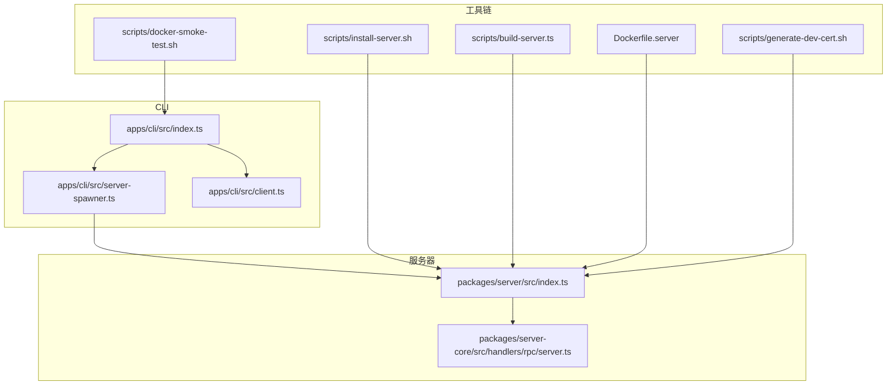
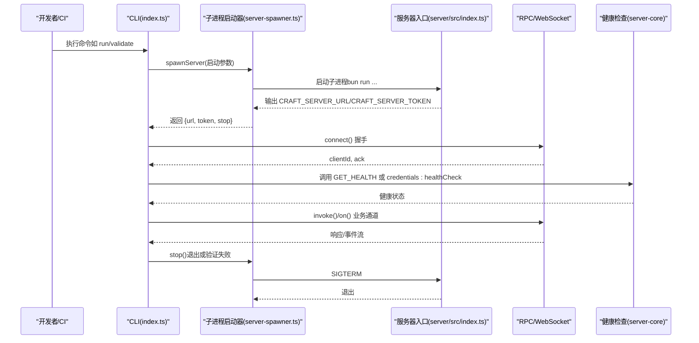
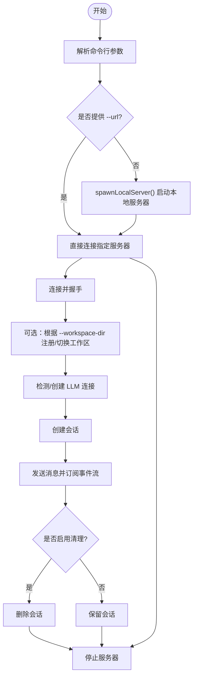
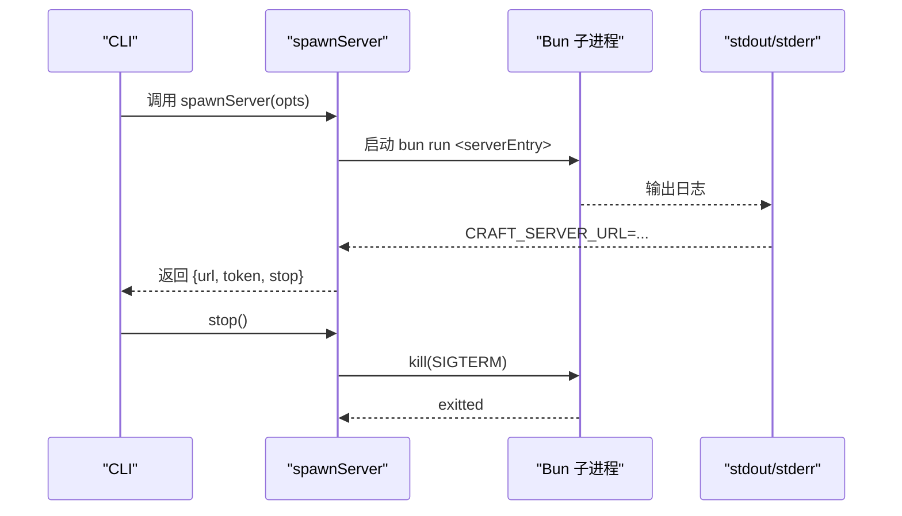
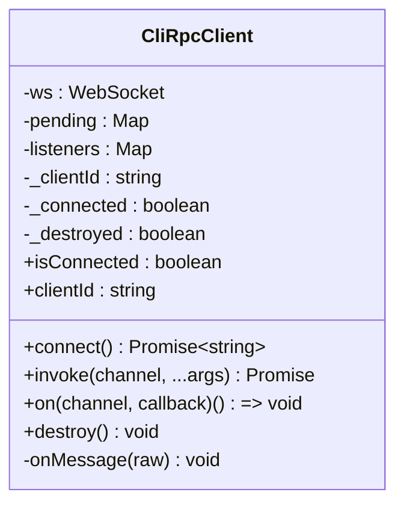
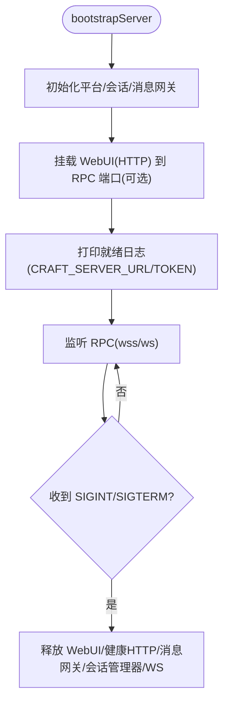
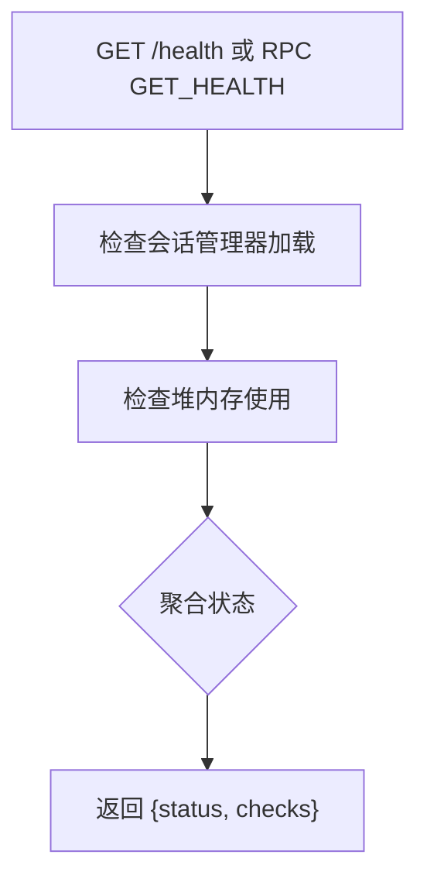
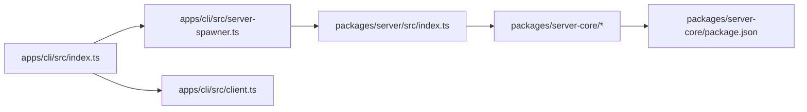

# 服务器管理

<cite>
**本文引用的文件**
- [apps/cli/src/index.ts](file://apps/cli/src/index.ts)
- [apps/cli/src/server-spawner.ts](file://apps/cli/src/server-spawner.ts)
- [apps/cli/src/client.ts](file://apps/cli/src/client.ts)
- [apps/cli/src/run.test.ts](file://apps/cli/src/run.test.ts)
- [packages/server/src/index.ts](file://packages/server/src/index.ts)
- [packages/server-core/src/handlers/rpc/server.ts](file://packages/server-core/src/handlers/rpc/server.ts)
- [packages/server-core/package.json](file://packages/server-core/package.json)
- [Dockerfile.server](file://Dockerfile.server)
- [scripts/install-server.sh](file://scripts/install-server.sh)
- [scripts/build-server.ts](file://scripts/build-server.ts)
- [scripts/docker-smoke-test.sh](file://scripts/docker-smoke-test.sh)
- [scripts/generate-dev-cert.sh](file://scripts/generate-dev-cert.sh)
</cite>

## 目录
1. [简介](#简介)
2. [项目结构](#项目结构)
3. [核心组件](#核心组件)
4. [架构总览](#架构总览)
5. [详细组件分析](#详细组件分析)
6. [依赖关系分析](#依赖关系分析)
7. [性能考虑](#性能考虑)
8. [故障排查指南](#故障排查指南)
9. [结论](#结论)
10. [附录](#附录)

## 简介
本文件面向系统管理员、DevOps 工程师与需要运维服务器的开发者，系统性阐述 CLI 服务器管理功能：本地服务器启动机制、进程管理与自动重启策略；服务器生命周期（启动、停止、健康检查、资源清理）；配置项（端口绑定、TLS、超时、日志级别）；监控指标与性能调优；部署与容器化、集群管理方案。内容基于仓库中的 CLI 客户端、服务器入口与核心模块，确保可操作、可落地。

## 项目结构
围绕“CLI 启动本地服务器 → 服务器进程 → RPC/WebSocket 服务 → 健康检查与资源清理”的主线，关键文件如下：
- CLI 入口与命令解析：apps/cli/src/index.ts
- 子进程服务器启动器：apps/cli/src/server-spawner.ts
- CLI RPC 客户端：apps/cli/src/client.ts
- 服务器入口与运行参数：packages/server/src/index.ts
- 服务器状态与健康检查：packages/server-core/src/handlers/rpc/server.ts
- 安装与打包脚本：scripts/install-server.sh、scripts/build-server.ts
- 容器化与测试：Dockerfile.server、scripts/docker-smoke-test.sh
- 开发证书生成：scripts/generate-dev-cert.sh

图表来源
- [apps/cli/src/index.ts:1-200](file://apps/cli/src/index.ts#L1-L200)
- [apps/cli/src/server-spawner.ts:1-150](file://apps/cli/src/server-spawner.ts#L1-L150)
- [apps/cli/src/client.ts:1-240](file://apps/cli/src/client.ts#L1-L240)
- [packages/server/src/index.ts:1-353](file://packages/server/src/index.ts#L1-L353)
- [packages/server-core/src/handlers/rpc/server.ts:1-167](file://packages/server-core/src/handlers/rpc/server.ts#L1-L167)
- [scripts/install-server.sh:1-107](file://scripts/install-server.sh#L1-L107)
- [scripts/build-server.ts:1-800](file://scripts/build-server.ts#L1-L800)
- [Dockerfile.server:1-120](file://Dockerfile.server#L1-L120)
- [scripts/docker-smoke-test.sh:40-87](file://scripts/docker-smoke-test.sh#L40-L87)
- [scripts/generate-dev-cert.sh:1-29](file://scripts/generate-dev-cert.sh#L1-L29)

章节来源
- [apps/cli/src/index.ts:1-200](file://apps/cli/src/index.ts#L1-L200)
- [apps/cli/src/server-spawner.ts:1-150](file://apps/cli/src/server-spawner.ts#L1-L150)
- [packages/server/src/index.ts:1-353](file://packages/server/src/index.ts#L1-L353)

## 核心组件
- CLI 命令与参数解析：支持连接、健康检查、版本查询、工作区与会话管理、发送消息、运行一次性任务等，并内置“本地服务器启动”能力。
- 服务器子进程启动器：通过 Bun 子进程启动服务器，监听标准输出以提取服务地址与令牌，提供优雅停止。
- CLI RPC 客户端：最小化 WebSocket RPC 客户端，负责握手、请求/响应、事件订阅与销毁。
- 服务器入口：解析环境变量（端口、TLS、WebUI、调试等），引导核心模块启动，打印就绪标识，注册信号处理与健康检查。
- 健康检查与状态：提供内存与会话管理器可用性检查，聚合为健康状态。
- 安装与打包：一键安装依赖、生成令牌、构建 WebUI 与子进程服务；支持多平台打包与 systemd 集成。
- 容器化：官方 Dockerfile，暴露端口、非 root 用户、预装 Node 用于 WhatsApp 子进程、默认绑定 0.0.0.0 并设置端口。
- 测试与验证：容器冒烟测试脚本等待就绪日志并执行 --validate-server；开发证书生成脚本。

章节来源
- [apps/cli/src/index.ts:43-158](file://apps/cli/src/index.ts#L43-L158)
- [apps/cli/src/server-spawner.ts:55-149](file://apps/cli/src/server-spawner.ts#L55-L149)
- [apps/cli/src/client.ts:38-240](file://apps/cli/src/client.ts#L38-L240)
- [packages/server/src/index.ts:166-353](file://packages/server/src/index.ts#L166-L353)
- [packages/server-core/src/handlers/rpc/server.ts:130-167](file://packages/server-core/src/handlers/rpc/server.ts#L130-L167)
- [scripts/install-server.sh:1-107](file://scripts/install-server.sh#L1-L107)
- [scripts/build-server.ts:567-706](file://scripts/build-server.ts#L567-L706)
- [Dockerfile.server:1-120](file://Dockerfile.server#L1-L120)
- [scripts/docker-smoke-test.sh:40-87](file://scripts/docker-smoke-test.sh#L40-L87)
- [scripts/generate-dev-cert.sh:1-29](file://scripts/generate-dev-cert.sh#L1-L29)

## 架构总览
CLI 作为“编排器”，在需要时启动本地服务器，建立 RPC 连接后执行业务命令；服务器作为“服务端”，承载会话、工作区、模型与消息网关等能力，并提供健康检查与资源清理。

图表来源
- [apps/cli/src/index.ts:496-510](file://apps/cli/src/index.ts#L496-L510)
- [apps/cli/src/server-spawner.ts:55-149](file://apps/cli/src/server-spawner.ts#L55-L149)
- [packages/server/src/index.ts:308-353](file://packages/server/src/index.ts#L308-L353)
- [packages/server-core/src/handlers/rpc/server.ts:130-167](file://packages/server-core/src/handlers/rpc/server.ts#L130-L167)

## 详细组件分析

### 组件一：CLI 参数解析与命令分发
- 支持连接参数（URL、令牌、超时、TLS CA）、运行模式（--run）、工作区目录、LLM 提供商与密钥注入、输出格式与清理策略等。
- 内置帮助、版本、健康检查、工作区列表、会话管理、消息发送、监听事件、调用任意 RPC 通道等命令。
- “运行一次性任务”流程：自动启动本地服务器、连接、创建工作区（可选）、自动配置 LLM 连接、创建会话、发送消息并流式输出、清理资源与停止服务器。

图表来源
- [apps/cli/src/index.ts:628-714](file://apps/cli/src/index.ts#L628-L714)
- [apps/cli/src/index.ts:496-510](file://apps/cli/src/index.ts#L496-L510)
- [apps/cli/src/server-spawner.ts:55-149](file://apps/cli/src/server-spawner.ts#L55-L149)

章节来源
- [apps/cli/src/index.ts:43-158](file://apps/cli/src/index.ts#L43-L158)
- [apps/cli/src/index.ts:247-714](file://apps/cli/src/index.ts#L247-L714)

### 组件二：服务器子进程启动器（spawner）
- 自动定位服务器入口（从 monorepo 根目录向上查找），设置随机令牌与本地回环绑定。
- 读取子进程 stdout/stderr，解析 CRAFT_SERVER_URL/CRAFT_SERVER_TOKEN，超时则终止并报错。
- 提供 stop() 发送 SIGTERM 并等待退出。

图表来源
- [apps/cli/src/server-spawner.ts:55-149](file://apps/cli/src/server-spawner.ts#L55-L149)

章节来源
- [apps/cli/src/server-spawner.ts:15-149](file://apps/cli/src/server-spawner.ts#L15-L149)

### 组件三：CLI RPC 客户端
- 握手阶段：发送协议版本、可选令牌与工作区，收到握手确认后切换到普通消息处理。
- 请求/响应：维护 pending 映射，超时自动拒绝。
- 事件订阅：按通道收集回调，事件到达时广播给订阅者。
- 销毁：关闭连接、清理 pending、标记销毁状态。

图表来源
- [apps/cli/src/client.ts:38-240](file://apps/cli/src/client.ts#L38-L240)

章节来源
- [apps/cli/src/client.ts:21-240](file://apps/cli/src/client.ts#L21-L240)

### 组件四：服务器入口与生命周期
- 环境变量解析：端口、主机、TLS（证书/私钥/CA）、WebUI、调试、资源路径等。
- 启动引导：初始化平台、注册 RPC 处理器、启动消息网关、挂载 WebUI（可选）。
- 就绪输出：打印 CRAFT_SERVER_URL/CRAFT_SERVER_TOKEN/CRAFT_WEBUI_URL。
- 绑定安全策略：非本地绑定且未启用 TLS 时，要求显式允许或直接拒绝。
- 信号处理：捕获 SIGINT/SIGTERM，依次释放 WebUI、健康 HTTP 服务器、消息网关、会话管理器与 WebSocket 服务。

图表来源
- [packages/server/src/index.ts:166-353](file://packages/server/src/index.ts#L166-L353)

章节来源
- [packages/server/src/index.ts:1-353](file://packages/server/src/index.ts#L1-L353)

### 组件五：健康检查与状态
- RPC 通道：GET_HEALTH 返回聚合健康状态；GET_STATUS 返回版本、运行时长、客户端数、工作区与内存使用。
- 健康检查逻辑：会话管理器可用性、堆内存阈值（1.5GB）告警。
- HTTP 健康端点：可通过 CRAFT_HEALTH_PORT 暴露独立健康检查服务。

图表来源
- [packages/server-core/src/handlers/rpc/server.ts:130-167](file://packages/server-core/src/handlers/rpc/server.ts#L130-L167)

章节来源
- [packages/server-core/src/handlers/rpc/server.ts:12-167](file://packages/server-core/src/handlers/rpc/server.ts#L12-L167)

### 组件六：安装、打包与容器化
- 安装脚本：校验 Bun、安装依赖、构建子进程服务与 WebUI、生成服务器令牌并输出启动命令。
- 打包脚本：多平台打包、下载 Bun/uv、复制资源与依赖树、生成入口脚本与 systemd 单元。
- 官方 Dockerfile：非 root 用户、安装 Node（WhatsApp 子进程）、暴露端口、设置环境变量、ENTRYPOINT 指向服务器入口。

章节来源
- [scripts/install-server.sh:1-107](file://scripts/install-server.sh#L1-L107)
- [scripts/build-server.ts:567-706](file://scripts/build-server.ts#L567-L706)
- [Dockerfile.server:1-120](file://Dockerfile.server#L1-L120)

### 组件七：部署与验证
- 容器冒烟测试：启动容器、等待就绪日志、执行 --validate-server。
- 开发证书：生成自签名证书用于本地 TLS 测试。

章节来源
- [scripts/docker-smoke-test.sh:40-87](file://scripts/docker-smoke-test.sh#L40-L87)
- [scripts/generate-dev-cert.sh:1-29](file://scripts/generate-dev-cert.sh#L1-L29)

## 依赖关系分析
- CLI 依赖 server-spawner 启动服务器，依赖 client 进行 RPC 通信。
- 服务器入口依赖 server-core 的引导与 RPC 处理器、WebUI 适配器、健康检查模块。
- 包管理与导出由 server-core 的 package.json 管理，CLI 通过相对路径导入 server-core 的传输与处理器。

图表来源
- [apps/cli/src/index.ts:1-200](file://apps/cli/src/index.ts#L1-L200)
- [apps/cli/src/server-spawner.ts:1-150](file://apps/cli/src/server-spawner.ts#L1-150)
- [apps/cli/src/client.ts:1-240](file://apps/cli/src/client.ts#L1-240)
- [packages/server/src/index.ts:1-353](file://packages/server/src/index.ts#L1-L353)
- [packages/server-core/package.json:1-39](file://packages/server-core/package.json#L1-L39)

章节来源
- [packages/server-core/package.json:1-39](file://packages/server-core/package.json#L1-L39)

## 性能考虑
- 性能追踪：server-core 提供性能度量工具（span、统计聚合、最近指标），可在调试模式下启用，避免干扰 stdout。
- 内存监控：健康检查包含堆内存阈值告警，建议结合系统监控与日志分析。
- I/O 与并发：CLI 侧使用 Bun 的子进程与 WebSocket，注意连接超时与请求超时配置；服务器侧合理设置会话与工作区数量，避免内存峰值过高。

章节来源
- [packages/server-core/src/handlers/rpc/server.ts:149-156](file://packages/server-core/src/handlers/rpc/server.ts#L149-L156)

## 故障排查指南
- 无法连接服务器
  - 检查 CRAFT_SERVER_URL 是否正确，确认 CLI 与服务器在同一网络或本地回环。
  - 使用 credentials:healthCheck 或 GET_HEALTH 排查服务器健康。
- 服务器未就绪
  - 查看子进程输出，等待 CRAFT_SERVER_URL/CRAFT_SERVER_TOKEN 日志；若超时，检查启动超时参数与资源占用。
- 绑定安全警告
  - 非本地绑定且未启用 TLS 会被拒绝；请配置证书或使用 --allow-insecure-bind（不推荐生产）。
- 容器启动失败
  - 使用冒烟测试脚本查看容器日志；确认令牌、端口映射与卷挂载。
- LLM 连接问题
  - 确认提供商、API Key、自定义 endpoint 设置；必要时使用自定义 endpoint 模式。

章节来源
- [packages/server/src/index.ts:314-335](file://packages/server/src/index.ts#L314-L335)
- [scripts/docker-smoke-test.sh:40-87](file://scripts/docker-smoke-test.sh#L40-L87)
- [apps/cli/src/index.ts:561-626](file://apps/cli/src/index.ts#L561-L626)

## 结论
该体系以 CLI 为入口，通过子进程与 RPC 实现“即用即启”的本地服务器管理，配合完善的健康检查、资源清理与容器化支持，满足从开发到生产的运维需求。建议在生产环境强制启用 TLS、合理设置超时与日志级别，并结合健康检查与性能度量进行持续监控。

## 附录

### 服务器配置选项清单
- 端口与绑定
  - CRAFT_RPC_HOST: 绑定地址（默认 127.0.0.1）
  - CRAFT_RPC_PORT: 绑定端口（默认 9100）
- TLS
  - CRAFT_RPC_TLS_CERT: PEM 证书路径
  - CRAFT_RPC_TLS_KEY: PEM 私钥路径
  - CRAFT_RPC_TLS_CA: PEM CA 链路径
- 认证与安全
  - CRAFT_SERVER_TOKEN: 必需的访问令牌
  - CRAFT_WEBUI_PASSWORD: WebUI 登录密码（可选，默认回退到服务器令牌）
  - CRAFT_WEBUI_SECURE_COOKIE: Cookie Secure 标志覆盖（可选）
- 资源与路径
  - CRAFT_APP_ROOT: 应用根目录
  - CRAFT_RESOURCES_PATH: 资源目录
  - CRAFT_WEBUI_DIR: WebUI 构建产物目录（启用 WebUI）
  - CRAFT_BUNDLED_ASSETS_ROOT: 打包资源根目录
- 调试与健康
  - CRAFT_DEBUG: 开启调试日志
  - CRAFT_HEALTH_PORT: 独立健康检查 HTTP 端口
- 消息与子进程
  - CRAFT_MESSAGING_WA_WORKER: WhatsApp Worker 入口（Node）
  - CRAFT_MESSAGING_NODE_BIN: Node 可执行路径

章节来源
- [packages/server/src/index.ts:8-26](file://packages/server/src/index.ts#L8-L26)
- [packages/server/src/index.ts:98-112](file://packages/server/src/index.ts#L98-L112)
- [Dockerfile.server:106-116](file://Dockerfile.server#L106-L116)

### CLI 常用命令与参数
- 连接与健康
  - --url/--token/--timeout/--json/--tls-ca/--send-timeout
- 运行一次性任务
  - --run: 自动启动本地服务器、创建会话、发送消息并流式输出
  - --workspace/--workspace-dir/--mode/--source/--output-format/--no-cleanup/--disable-spinner/--verbose
  - --provider/--model/--api-key/--base-url
- 其他命令
  - ping/versions/workspaces/sessions/sources/connections/send/cancel/invoke/listen/validate

章节来源
- [apps/cli/src/index.ts:17-41](file://apps/cli/src/index.ts#L17-L41)
- [apps/cli/src/index.ts:628-714](file://apps/cli/src/index.ts#L628-L714)

### 部署与容器化要点
- Dockerfile
  - 非 root 用户、安装 Node（WhatsApp 子进程）、暴露 9100、设置环境变量、ENTRYPOINT 指向服务器入口
- systemd
  - 打包脚本生成服务单元，支持自动重启与日志查看
- 冒烟测试
  - 等待就绪日志后执行 --validate-server

章节来源
- [Dockerfile.server:1-120](file://Dockerfile.server#L1-L120)
- [scripts/build-server.ts:646-696](file://scripts/build-server.ts#L646-L696)
- [scripts/docker-smoke-test.sh:40-87](file://scripts/docker-smoke-test.sh#L40-L87)