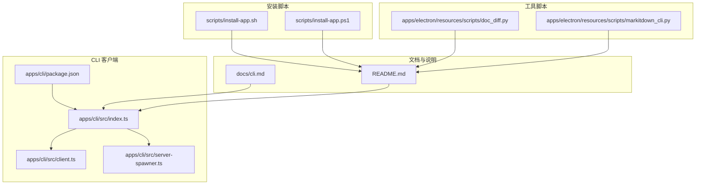
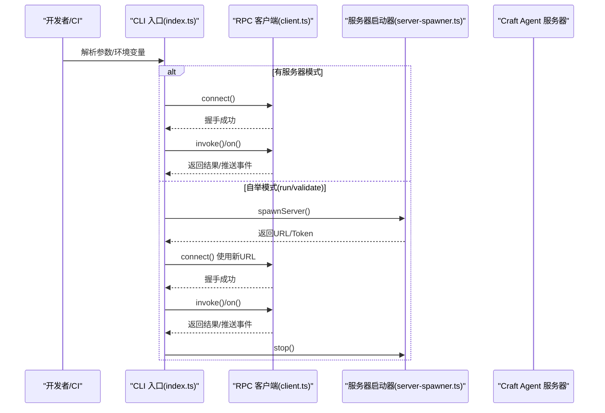
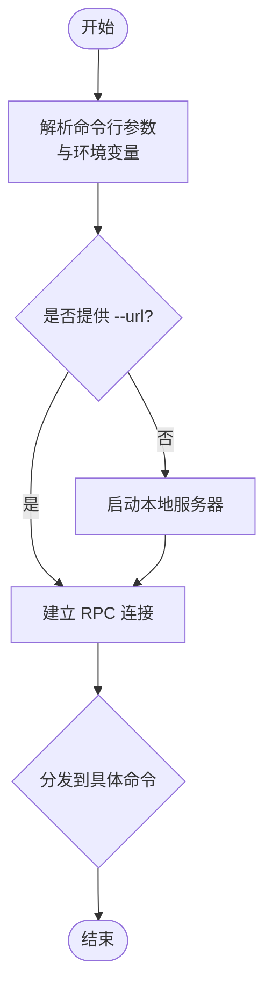
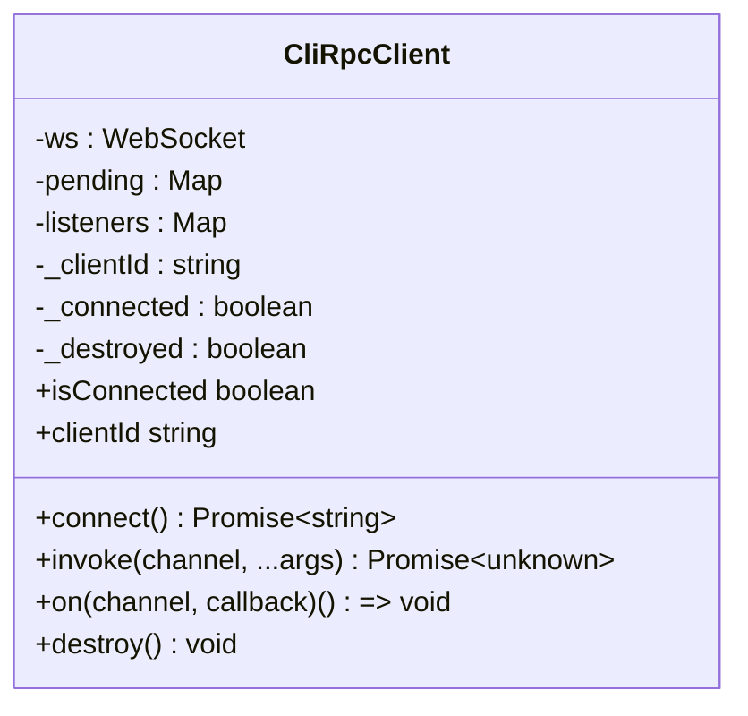
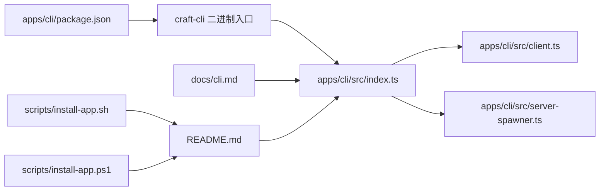

# 集成示例

<cite>
**本文引用的文件**
- [apps/cli/src/index.ts](file://apps/cli/src/index.ts)
- [apps/cli/src/client.ts](file://apps/cli/src/client.ts)
- [apps/cli/src/server-spawner.ts](file://apps/cli/src/server-spawner.ts)
- [apps/cli/src/run.test.ts](file://apps/cli/src/run.test.ts)
- [apps/cli/src/commands.test.ts](file://apps/cli/src/commands.test.ts)
- [apps/cli/package.json](file://apps/cli/package.json)
- [docs/cli.md](file://docs/cli.md)
- [README.md](file://README.md)
- [scripts/install-app.sh](file://scripts/install-app.sh)
- [scripts/install-app.ps1](file://scripts/install-app.ps1)
- [apps/electron/resources/scripts/doc_diff.py](file://apps/electron/resources/scripts/doc_diff.py)
- [apps/electron/resources/scripts/markitdown_cli.py](file://apps/electron/resources/scripts/markitdown_cli.py)
</cite>

## 目录
1. [简介](#简介)
2. [项目结构](#项目结构)
3. [核心组件](#核心组件)
4. [架构总览](#架构总览)
5. [详细组件分析](#详细组件分析)
6. [依赖关系分析](#依赖关系分析)
7. [性能考量](#性能考量)
8. [故障排查指南](#故障排查指南)
9. [结论](#结论)
10. [附录](#附录)

## 简介
本指南面向需要将 CLI 集成到现有工作流程中的企业用户与开发团队，提供从 CI/CD（GitHub Actions、GitLab CI、Jenkins）到脚本自动化（Bash、PowerShell、Python）的完整实践路径。内容涵盖：
- CI/CD 集成方案与最佳实践
- 脚本自动化：Bash、PowerShell、Python
- 批量操作示例：会话管理、消息发送、资源批量处理
- API 调用示例：自定义工具开发、第三方系统集成
- 监控告警、日志收集与性能监控方案

## 项目结构
该仓库采用 Monorepo 结构，CLI 客户端位于 apps/cli，配套文档在 docs/cli.md，安装脚本在 scripts 目录，桌面应用与工具脚本在 apps/electron/resources/scripts。

**图表来源**
- [apps/cli/src/index.ts:1-2076](file://apps/cli/src/index.ts#L1-L2076)
- [apps/cli/src/client.ts:1-240](file://apps/cli/src/client.ts#L1-L240)
- [apps/cli/src/server-spawner.ts:1-150](file://apps/cli/src/server-spawner.ts#L1-L150)
- [apps/cli/package.json:1-26](file://apps/cli/package.json#L1-L26)
- [docs/cli.md:1-241](file://docs/cli.md#L1-L241)
- [README.md:1-640](file://README.md#L1-L640)
- [scripts/install-app.sh:1-405](file://scripts/install-app.sh#L1-L405)
- [scripts/install-app.ps1:1-265](file://scripts/install-app.ps1#L1-L265)
- [apps/electron/resources/scripts/doc_diff.py:1-252](file://apps/electron/resources/scripts/doc_diff.py#L1-L252)
- [apps/electron/resources/scripts/markitdown_cli.py:1-138](file://apps/electron/resources/scripts/markitdown_cli.py#L1-L138)

**章节来源**
- [apps/cli/src/index.ts:1-2076](file://apps/cli/src/index.ts#L1-L2076)
- [apps/cli/src/client.ts:1-240](file://apps/cli/src/client.ts#L1-L240)
- [apps/cli/src/server-spawner.ts:1-150](file://apps/cli/src/server-spawner.ts#L1-L150)
- [apps/cli/package.json:1-26](file://apps/cli/package.json#L1-L26)
- [docs/cli.md:1-241](file://docs/cli.md#L1-L241)
- [README.md:1-640](file://README.md#L1-L640)
- [scripts/install-app.sh:1-405](file://scripts/install-app.sh#L1-L405)
- [scripts/install-app.ps1:1-265](file://scripts/install-app.ps1#L1-L265)
- [apps/electron/resources/scripts/doc_diff.py:1-252](file://apps/electron/resources/scripts/doc_diff.py#L1-L252)
- [apps/electron/resources/scripts/markitdown_cli.py:1-138](file://apps/electron/resources/scripts/markitdown_cli.py#L1-L138)

## 核心组件
- 命令行入口与参数解析：负责解析命令行参数、环境变量、默认值与子命令分发。
- RPC 客户端：基于 WebSocket 的轻量级 RPC 客户端，支持握手、请求响应与事件订阅。
- 本地服务器启动器：在 run/validate 场景中自动启动 headless 服务，读取输出中的连接信息。
- 测试与验证：内置 21 步集成验证流程，覆盖会话生命周期、工具调用、源与技能创建等。

**章节来源**
- [apps/cli/src/index.ts:43-158](file://apps/cli/src/index.ts#L43-L158)
- [apps/cli/src/client.ts:38-240](file://apps/cli/src/client.ts#L38-L240)
- [apps/cli/src/server-spawner.ts:55-150](file://apps/cli/src/server-spawner.ts#L55-L150)
- [apps/cli/src/run.test.ts:1-429](file://apps/cli/src/run.test.ts#L1-L429)
- [apps/cli/src/commands.test.ts:1-404](file://apps/cli/src/commands.test.ts#L1-L404)

## 架构总览
CLI 通过 WebSocket 连接到 Craft Agent 服务器，支持两类使用模式：
- 有服务器模式：连接已运行的服务器，执行查询、会话管理、消息发送等。
- 自举模式：run/validate 子命令自动启动本地 headless 服务器，完成一次性任务后退出。

**图表来源**
- [apps/cli/src/index.ts:496-510](file://apps/cli/src/index.ts#L496-L510)
- [apps/cli/src/client.ts:61-129](file://apps/cli/src/client.ts#L61-L129)
- [apps/cli/src/server-spawner.ts:55-150](file://apps/cli/src/server-spawner.ts#L55-L150)

**章节来源**
- [apps/cli/src/index.ts:496-751](file://apps/cli/src/index.ts#L496-L751)
- [apps/cli/src/client.ts:38-240](file://apps/cli/src/client.ts#L38-L240)
- [apps/cli/src/server-spawner.ts:55-150](file://apps/cli/src/server-spawner.ts#L55-L150)

## 详细组件分析

### 命令行入口与参数解析
- 支持的全局选项：连接参数（url/token/tls）、超时、JSON 输出、发送超时、verbose、server-entry、workspace-dir 等。
- 子命令：ping、health、versions、workspaces、sessions、connections、sources、session 子命令、send、cancel、invoke、listen、run、--validate-server。
- LLM 配置：provider、model、api-key、base-url，以及从环境变量解析 API Key 的逻辑。

**图表来源**
- [apps/cli/src/index.ts:43-158](file://apps/cli/src/index.ts#L43-L158)
- [apps/cli/src/index.ts:716-751](file://apps/cli/src/index.ts#L716-L751)

**章节来源**
- [apps/cli/src/index.ts:43-158](file://apps/cli/src/index.ts#L43-L158)
- [apps/cli/src/index.ts:247-784](file://apps/cli/src/index.ts#L247-L784)
- [apps/cli/src/index.ts:716-751](file://apps/cli/src/index.ts#L716-L751)

### RPC 客户端（CliRpcClient）
- 功能：握手、请求/响应、事件订阅、错误处理、销毁。
- 特点：无自动重连、无能力检测，适合 CLI 一次性任务场景。

**图表来源**
- [apps/cli/src/client.ts:38-240](file://apps/cli/src/client.ts#L38-L240)

**章节来源**
- [apps/cli/src/client.ts:38-240](file://apps/cli/src/client.ts#L38-L240)

### 服务器启动器（server-spawner）
- 自动定位 server 入口文件，启动子进程，解析标准输出中的连接信息，提供停止方法。
- 用于 run/validate 的自举场景，确保一次性任务的可重复性与隔离性。

**章节来源**
- [apps/cli/src/server-spawner.ts:55-150](file://apps/cli/src/server-spawner.ts#L55-L150)

### 验证与测试（run.test 与 commands.test）
- run.test：模拟 WebSocket 服务器，验证 run 命令的通道调用顺序、事件流、清理逻辑。
- commands.test：覆盖参数解析、API Key 解析策略、验证步骤清单等。

**章节来源**
- [apps/cli/src/run.test.ts:1-429](file://apps/cli/src/run.test.ts#L1-L429)
- [apps/cli/src/commands.test.ts:1-404](file://apps/cli/src/commands.test.ts#L1-L404)

## 依赖关系分析
- CLI 包定义了二进制入口 craft-cli 指向 src/index.ts，便于直接运行或链接到 PATH。
- 文档与 README 提供了安装、连接、命令与示例，是集成实践的重要参考。
- 安装脚本为不同平台提供一键安装，便于在 CI 环境中快速准备运行时。

**图表来源**
- [apps/cli/package.json:8-10](file://apps/cli/package.json#L8-L10)
- [apps/cli/src/index.ts:1-2076](file://apps/cli/src/index.ts#L1-L2076)
- [apps/cli/src/client.ts:1-240](file://apps/cli/src/client.ts#L1-L240)
- [apps/cli/src/server-spawner.ts:1-150](file://apps/cli/src/server-spawner.ts#L1-L150)
- [docs/cli.md:1-241](file://docs/cli.md#L1-L241)
- [README.md:1-640](file://README.md#L1-L640)
- [scripts/install-app.sh:1-405](file://scripts/install-app.sh#L1-L405)
- [scripts/install-app.ps1:1-265](file://scripts/install-app.ps1#L1-L265)

**章节来源**
- [apps/cli/package.json:1-26](file://apps/cli/package.json#L1-L26)
- [docs/cli.md:1-241](file://docs/cli.md#L1-L241)
- [README.md:1-640](file://README.md#L1-L640)
- [scripts/install-app.sh:1-405](file://scripts/install-app.sh#L1-L405)
- [scripts/install-app.ps1:1-265](file://scripts/install-app.ps1#L1-L265)

## 性能考量
- 连接与请求超时：可通过 --timeout 与 --send-timeout 控制，避免长时间阻塞。
- 输出格式：--json 便于机器解析，减少解析成本；--output-format stream-json 适合实时事件流。
- 本地服务器启动：run/validate 会在任务完成后停止，避免资源泄漏。
- 工具链选择：Python 工具脚本（如文档转换、差异对比）可作为批处理补充，注意依赖安装与缓存复用。

[本节为通用建议，无需特定文件引用]

## 故障排查指南
常见问题与解决思路：
- 连接超时：检查服务器是否启动、URL 是否正确、网络连通性。
- 认证失败：核对 CRAFT_SERVER_TOKEN 与服务器一致。
- 协议版本不匹配：更新 CLI 与服务器至相同版本。
- TLS 问题：自签名证书使用 --tls-ca 或设置 CRAFT_TLS_CA。
- 无可用工作区：先通过桌面应用或 API 创建工作区。

**章节来源**
- [docs/cli.md:232-241](file://docs/cli.md#L232-L241)

## 结论
通过 CLI 可以无缝接入现有工作流程，实现从单次验证到持续集成的全链路自动化。结合 Bash/PowerShell/Python 脚本与第三方工具，可在 CI/CD 中稳定地执行会话管理、消息发送与资源批量处理任务。配合监控与日志采集，可构建可观测的企业级集成方案。

[本节为总结，无需特定文件引用]

## 附录

### CI/CD 集成方案

- GitHub Actions
  - 在工作流中使用 craft-cli 进行健康检查与一次性任务。
  - 推荐步骤：安装依赖（Bun）、设置环境变量（CRAFT_SERVER_URL、CRAFT_SERVER_TOKEN、LLM_*）、执行 craft-cli 命令、上传日志。
  - 示例要点：使用 matrix 矩阵测试多 provider；在失败时保留 artifacts；使用 secrets 管理令牌与 API Key。

- GitLab CI
  - 在 .gitlab-ci.yml 中定义 job，使用容器镜像（含 Bun 与 CLI）。
  - 关键点：缓存依赖与工具链；按需启用 TLS；在 stages 中串联“验证-构建-清理”。

- Jenkins
  - 在 Jenkinsfile 中定义流水线，使用 Shell/PowerShell 步骤调用 craft-cli。
  - 关键点：在节点上预装 Bun 与 CLI；使用凭据插件注入密钥；将 JSON 输出与事件流写入构建产物。

[本节为通用实践建议，未直接分析具体文件，故不附“章节来源”]

### 脚本自动化

- Bash 脚本
  - 使用 install-app.sh 一键安装桌面应用（适用于 macOS/Linux），或直接运行 CLI。
  - 示例模式：循环列出工作区与会话、批量创建会话、发送消息并解析 JSON 输出。

- PowerShell 脚本
  - 使用 install-app.ps1 安装桌面应用（适用于 Windows），或直接调用 craft-cli。
  - 示例模式：通过管道传递输入、捕获返回码、记录日志。

- Python 脚本
  - 使用文档转换与差异对比工具作为批处理补充，例如：
    - 将多种文档格式转换为 Markdown，便于统一处理。
    - 对比两个文档的差异，生成统一或并排格式的 diff 报告。

**章节来源**
- [scripts/install-app.sh:1-405](file://scripts/install-app.sh#L1-L405)
- [scripts/install-app.ps1:1-265](file://scripts/install-app.ps1#L1-L265)
- [apps/electron/resources/scripts/markitdown_cli.py:1-138](file://apps/electron/resources/scripts/markitdown_cli.py#L1-L138)
- [apps/electron/resources/scripts/doc_diff.py:1-252](file://apps/electron/resources/scripts/doc_diff.py#L1-L252)

### 批量操作示例

- 会话管理
  - 列出工作区与会话、批量创建会话、删除临时会话。
  - 实施方式：通过 --json 输出，结合 jq 等工具进行过滤与迭代。

- 消息发送
  - 将提示词与输入文本通过管道传入 craft-cli send，实现批量化问答。
  - 注意：合理设置 --send-timeout，避免长尾任务阻塞流水线。

- 资源批量处理
  - 通过 invoke/listen 订阅事件，结合外部工具（Python 脚本）进行二次处理。
  - 示例：监听 tool_start/tool_result，提取工具输出并写入报告。

**章节来源**
- [docs/cli.md:196-216](file://docs/cli.md#L196-L216)
- [apps/cli/src/index.ts:372-489](file://apps/cli/src/index.ts#L372-L489)

### API 调用示例

- 自定义工具开发
  - 使用 invoke 通道直接调用内部 RPC 接口，便于扩展与调试。
  - 注意：参数需遵循 JSON 格式，必要时使用 --json 获取结构化输出。

- 第三方系统集成
  - 通过 --base-url 与 --provider 组合，对接 OpenRouter、Ollama 等第三方或自托管模型。
  - 在 CI 环境中，使用环境变量注入 API Key 与基础地址，避免硬编码。

**章节来源**
- [apps/cli/src/index.ts:561-626](file://apps/cli/src/index.ts#L561-L626)
- [docs/cli.md:136-151](file://docs/cli.md#L136-L151)

### 监控告警、日志收集与性能监控

- 监控告警
  - 使用 listen 订阅 session:event，捕获 error/complete/interrupted 等关键事件，触发告警。
  - 结合 --json 输出，将事件写入监控系统（如 Prometheus、Grafana）。

- 日志收集
  - 在 run/validate 场景中，服务器启动器会将子进程 stderr 输出到标准错误，便于集中收集。
  - 在 CI 环境中，将日志归档到 artifacts 或外部存储。

- 性能监控
  - 使用 ping/versions 命令定期探测服务状态与版本信息。
  - 通过 send 命令的超时与返回码评估端到端延迟与稳定性。

**章节来源**
- [apps/cli/src/index.ts:247-269](file://apps/cli/src/index.ts#L247-L269)
- [apps/cli/src/index.ts:786-800](file://apps/cli/src/index.ts#L786-L800)
- [apps/cli/src/server-spawner.ts:75-90](file://apps/cli/src/server-spawner.ts#L75-L90)