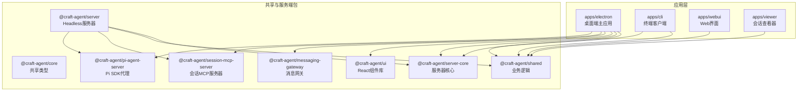
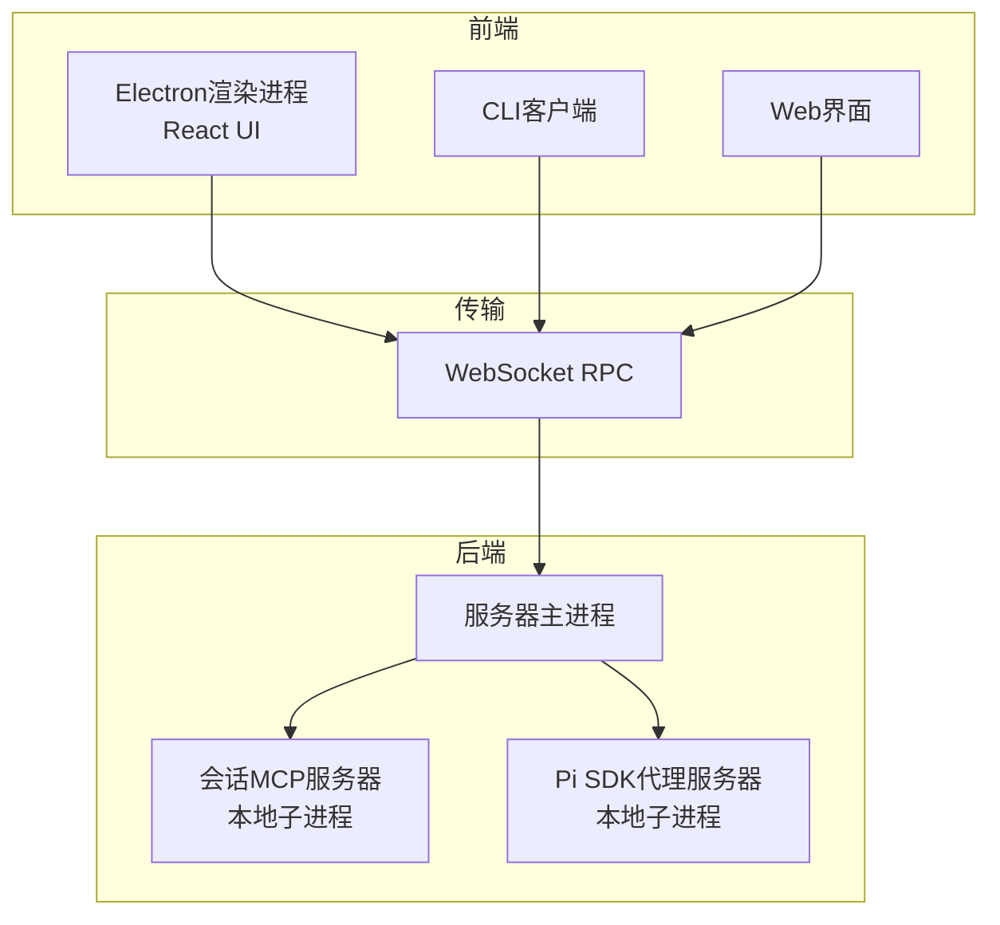
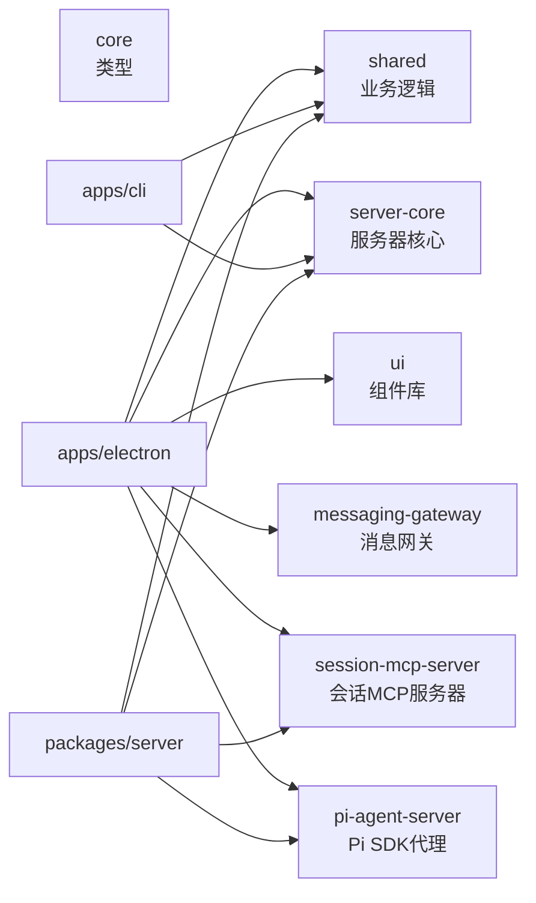

# 开发者指南

<cite>
**本文引用的文件**
- [README.md](file://README.md)
- [CONTRIBUTING.md](file://CONTRIBUTING.md)
- [SECURITY.md](file://SECURITY.md)
- [CODE_OF_CONDUCT.md](file://CODE_OF_CONDUCT.md)
- [package.json](file://package.json)
- [tsconfig.json](file://tsconfig.json)
- [apps/electron/tsconfig.json](file://apps/electron/tsconfig.json)
- [apps/cli/tsconfig.json](file://apps/cli/tsconfig.json)
- [packages/server/tsconfig.json](file://packages/server/tsconfig.json)
- [apps/electron/eslint.config.mjs](file://apps/electron/eslint.config.mjs)
- [scripts/electron-dev.ts](file://scripts/electron-dev.ts)
- [apps/electron/package.json](file://apps/electron/package.json)
- [apps/cli/package.json](file://apps/cli/package.json)
- [packages/server/package.json](file://packages/server/package.json)
</cite>

## 目录
1. [简介](#简介)
2. [项目结构](#项目结构)
3. [核心组件](#核心组件)
4. [架构总览](#架构总览)
5. [详细组件分析](#详细组件分析)
6. [依赖关系分析](#依赖关系分析)
7. [性能考虑](#性能考虑)
8. [故障排查指南](#故障排查指南)
9. [结论](#结论)
10. [附录](#附录)

## 简介
本指南面向希望参与 Craft Agents 开源项目开发与维护的贡献者，涵盖开发环境搭建、依赖安装、工具配置、代码规范、提交流程、PR 审查标准、项目架构理解、模块职责、开发工作流、调试与性能分析、问题排查、新功能开发与 Bug 修复流程，以及安全漏洞报告机制。目标是帮助你快速上手并高质量地贡献代码。

## 项目结构
项目采用 Monorepo 结构，主要由以下部分组成：
- apps：应用层
  - electron：桌面端主应用（React + Electron）
  - cli：终端客户端
  - webui：Web 界面（可选）
  - viewer：会话查看器（可选）
- packages：共享与服务端包
  - core：共享类型定义
  - shared：业务逻辑与通用能力
  - server：独立 Headless 服务器
  - server-core：服务器核心
  - session-mcp-server：会话级 MCP 服务器
  - pi-agent-server：Pi SDK 代理服务器
  - messaging-gateway：消息网关
  - messaging-whatsapp-worker：WhatsApp 消息工作进程
  - session-tools-core：会话工具核心
  - ui：React 组件库
- 脚本与配置：根目录脚本、构建与发布、Docker 配置等

图表来源
- [README.md:343-366](file://README.md#L343-L366)
- [package.json:17-21](file://package.json#L17-L21)

章节来源
- [README.md:343-366](file://README.md#L343-L366)
- [package.json:17-21](file://package.json#L17-L21)

## 核心组件
- 应用层
  - apps/electron：基于 Electron + React 的桌面应用，负责 UI、窗口管理、系统集成、与主进程通信等
  - apps/cli：通过 WebSocket 连接服务器的命令行客户端，支持健康检查、会话管理、RPC 调用等
  - apps/webui/viewer：可选的 Web/查看器界面
- 服务端与共享层
  - packages/server：Headless 服务器，提供 RPC 接口与会话执行
  - packages/server-core：服务器核心逻辑
  - packages/session-mcp-server：会话级 MCP 服务器（本地子进程）
  - packages/pi-agent-server：Pi SDK 代理服务器（本地子进程）
  - packages/shared：通用业务逻辑（会话、权限、凭证、配置、状态、源等）
  - packages/ui：React 组件库
  - packages/messaging-*：消息网关与工作进程
- 构建与运行
  - 根 package.json 提供统一脚本与工作区配置
  - tsconfig.json 与各应用 tsconfig 定义编译选项与路径映射

章节来源
- [README.md:343-366](file://README.md#L343-L366)
- [apps/electron/package.json:17-36](file://apps/electron/package.json#L17-L36)
- [apps/cli/package.json:11-14](file://apps/cli/package.json#L11-L14)
- [packages/server/package.json:22-25](file://packages/server/package.json#L22-L25)
- [package.json:17-21](file://package.json#L17-L21)

## 架构总览
整体架构分为三层：
- 前端层：Electron 渲染进程（React UI）与 Web 界面
- 传输层：WebSocket RPC 通道（Electron/CLI/WebUI 与服务器通信）
- 执行层：服务器主进程 + 子进程（MCP 服务器、Pi SDK 代理）

图表来源
- [README.md:150-242](file://README.md#L150-L242)
- [scripts/electron-dev.ts:218-255](file://scripts/electron-dev.ts#L218-L255)

章节来源
- [README.md:150-242](file://README.md#L150-L242)
- [scripts/electron-dev.ts:218-255](file://scripts/electron-dev.ts#L218-L255)

## 详细组件分析

### 开发环境与工具链
- 运行时与版本
  - Bun：项目首选运行时，用于构建、测试与开发
  - Node.js 18+：部分工具链需要
  - 支持平台：macOS、Linux、Windows
- 依赖安装
  - 使用 Bun 工作区安装所有包依赖
- 开发脚本
  - electron:dev：热重载开发（Vite + Electron）
  - electron:start：构建并启动打包版
  - typecheck:all：全量类型检查
  - lint：ESLint 规范检查（含自定义规则）
  - test：单元测试与集成测试
  - server:*：服务器相关脚本（启动、开发、构建）
- 环境变量
  - OAuth 凭据（如 Google、Slack、Microsoft）需在 .env 中配置
  - 服务器模式下使用 CRAFT_SERVER_TOKEN、CRAFT_RPC_* 等环境变量

章节来源
- [CONTRIBUTING.md:7-35](file://CONTRIBUTING.md#L7-L35)
- [package.json:22-96](file://package.json#L22-L96)
- [README.md:367-394](file://README.md#L367-L394)

### 代码规范与 ESLint 规则
- 语言与框架
  - TypeScript 全栈
  - React + shadcn/ui + Tailwind CSS v4
- 自定义 ESLint 规则（Electron 应用）
  - 导航状态、平台检测、路径分隔符、文件打开拦截、源认证检查、样式 z-index 与阴影约束
  - 主进程禁止直接引入后端 SDK，必须通过共享后端抽象层调用
- 类型检查
  - 各包独立 tsc 检查，根脚本提供全量检查
- 路径别名
  - 根 tsconfig 与各应用 tsconfig 定义了 @/* 及跨包别名，便于模块化开发

章节来源
- [apps/electron/eslint.config.mjs:1-226](file://apps/electron/eslint.config.mjs#L1-L226)
- [tsconfig.json:24-26](file://tsconfig.json#L24-L26)
- [apps/electron/tsconfig.json:22-28](file://apps/electron/tsconfig.json#L22-L28)
- [apps/cli/tsconfig.json:21-26](file://apps/cli/tsconfig.json#L21-L26)
- [packages/server/tsconfig.json:21-28](file://packages/server/tsconfig.json#L21-L28)

### 代码结构与模块职责
- apps/electron
  - main：Electron 主进程，窗口、菜单、系统集成、IPC、日志
  - preload：上下文桥接与预加载逻辑
  - renderer：React UI、组件、页面、hooks、lib、utils
  - transport：RPC 通道与编解码
  - shared：共享路由、菜单、类型
- apps/cli
  - 命令行入口与子命令（ping、sessions、send、invoke、listen、run 等）
- packages/server
  - 服务器入口、RPC 处理、会话生命周期、工具执行
- packages/shared
  - agent（会话与权限）、auth（OAuth/令牌）、config（存储/偏好/主题）、credentials（加密存储）、sessions/sources/statuses 等
- packages/ui
  - 可复用 UI 组件与设计系统

章节来源
- [README.md:343-366](file://README.md#L343-L366)
- [apps/electron/package.json:38-81](file://apps/electron/package.json#L38-L81)
- [apps/cli/package.json:16-25](file://apps/cli/package.json#L16-L25)
- [packages/server/package.json:27-38](file://packages/server/package.json#L27-L38)

### 开发工作流与分支策略
- 分支命名建议
  - feature/*：新增功能
  - fix/*：Bug 修复
  - refactor/*：重构
  - docs/*：文档更新
- 提交流程
  - 在本地分支进行变更
  - 运行类型检查与测试
  - 提交信息清晰描述变更内容
  - 推送到远程并创建 PR
- PR 模板要点
  - 概述、变更点、测试方式、截图（UI 变更时）

章节来源
- [CONTRIBUTING.md:39-91](file://CONTRIBUTING.md#L39-L91)

### 服务器与本地子进程
- 服务器模式
  - 通过环境变量配置 Token、绑定地址与端口、TLS 证书
  - 支持 wss:// 加密连接
- 本地 MCP 与 Pi 代理
  - 开发时自动构建会话级 MCP 服务器与 Pi 代理服务器
  - 子进程以 stdio 方式运行，隔离敏感环境变量
- 构建与启动
  - electron:dev 内置多进程并行构建与监听
  - server:dev/server:start 提供服务器开发/运行脚本

章节来源
- [README.md:150-242](file://README.md#L150-L242)
- [scripts/electron-dev.ts:218-255](file://scripts/electron-dev.ts#L218-L255)
- [apps/electron/package.json:17-36](file://apps/electron/package.json#L17-L36)

### CLI 客户端使用
- 连接方式
  - 通过环境变量或命令行参数传入服务器地址与 Token
  - 支持 TLS（wss://），可指定 CA 文件
- 常用命令
  - ping、health、versions、workspaces、sessions、connections、sources
  - session create/messages/delete、send、cancel、invoke、listen
  - run：自包含运行（自动启动服务器、发送提示、流式输出、退出）

章节来源
- [README.md:244-341](file://README.md#L244-L341)

## 依赖关系分析

图表来源
- [apps/electron/package.json:38-81](file://apps/electron/package.json#L38-L81)
- [apps/cli/package.json:16-25](file://apps/cli/package.json#L16-L25)
- [packages/server/package.json:27-38](file://packages/server/package.json#L27-L38)

章节来源
- [apps/electron/package.json:38-81](file://apps/electron/package.json#L38-L81)
- [apps/cli/package.json:16-25](file://apps/cli/package.json#L16-L25)
- [packages/server/package.json:27-38](file://packages/server/package.json#L27-L38)

## 性能考虑
- 构建与缓存
  - 使用 esbuild 与 Vite 并行构建，减少冷启动时间
  - 开发时启用严格端口与文件稳定等待，避免重复构建
- 运行时优化
  - 服务器与本地子进程分离，避免阻塞 UI
  - 大响应自动摘要（>~60KB）降低传输开销
- 日志与可观测性
  - 开发模式自动开启日志
  - Sentry 集成（Electron 与 React）

章节来源
- [scripts/electron-dev.ts:527-581](file://scripts/electron-dev.ts#L527-L581)
- [README.md:551-556](file://README.md#L551-L556)
- [README.md:581-600](file://README.md#L581-L600)

## 故障排查指南
- 启动失败
  - 检查端口占用并清理（脚本内置端口冲突处理）
  - 确认 .env 中 OAuth 凭据正确
- 构建错误
  - 运行类型检查与 ESLint，定位规则违规
  - 确认子进程（MCP/Pi）已成功构建
- 服务器连接问题
  - 确认 CRAFT_SERVER_TOKEN、CRAFT_RPC_HOST/PORT、TLS 证书配置
  - 使用 CLI 的 ping/health 命令验证连通性
- 日志定位
  - 开发日志路径按平台写入用户目录下的日志文件
  - 包装应用可通过命令行参数启用调试模式

章节来源
- [scripts/electron-dev.ts:122-179](file://scripts/electron-dev.ts#L122-L179)
- [README.md:383-394](file://README.md#L383-L394)
- [README.md:581-600](file://README.md#L581-L600)
- [README.md:244-341](file://README.md#L244-L341)

## 结论
本指南提供了从环境搭建到日常开发、测试、调试与发布的完整路径。遵循统一的代码规范、分支与 PR 流程，结合服务器与本地子进程的架构设计，可以高效地迭代功能、修复问题并保障质量与安全。

## 附录

### 新功能开发指南
- 设计与规划
  - 明确功能边界与影响范围
  - 参考现有模块职责（shared/ui/server 等）
- 实现步骤
  - 在 apps/electron/renderer 或 packages/shared 添加必要逻辑
  - 如涉及后端，补充 packages/server 与子进程适配
  - 编写单元测试与集成测试
- 提交与审查
  - 运行类型检查与 lint
  - 提交 PR 并附带测试说明与截图（UI 变更）

章节来源
- [CONTRIBUTING.md:39-91](file://CONTRIBUTING.md#L39-L91)
- [apps/electron/eslint.config.mjs:162-224](file://apps/electron/eslint.config.mjs#L162-L224)

### Bug 修复流程
- 复现与定位
  - 使用 CLI 或桌面端复现问题
  - 查看日志与错误堆栈
- 修复与验证
  - 编写最小化测试用例
  - 运行全量测试与类型检查
- 提交
  - 在 PR 描述中说明问题背景、修复方案与验证结果

章节来源
- [CONTRIBUTING.md:70-91](file://CONTRIBUTING.md#L70-L91)
- [README.md:581-600](file://README.md#L581-L600)

### 安全漏洞报告机制
- 报告渠道
  - 不要通过公开 Issue 报告安全漏洞
  - 发送邮件至 security@craft.do
- 报告内容
  - 漏洞描述、复现步骤、潜在影响、建议修复（可选）
- 响应流程
  - 48 小时内确认收到；7 天内初始评估；严重问题 30 天内解决
- 范围与支持版本
  - 适用于桌面应用、npm 包与官方仓库；仅对最新版本提供安全更新

章节来源
- [SECURITY.md:1-59](file://SECURITY.md#L1-L59)

### 行为准则
- 我们致力于提供包容、尊重的社区环境
- 违规行为可向 conduct@craft.do 报告，将得到及时公正处理

章节来源
- [CODE_OF_CONDUCT.md:1-27](file://CODE_OF_CONDUCT.md#L1-L27)