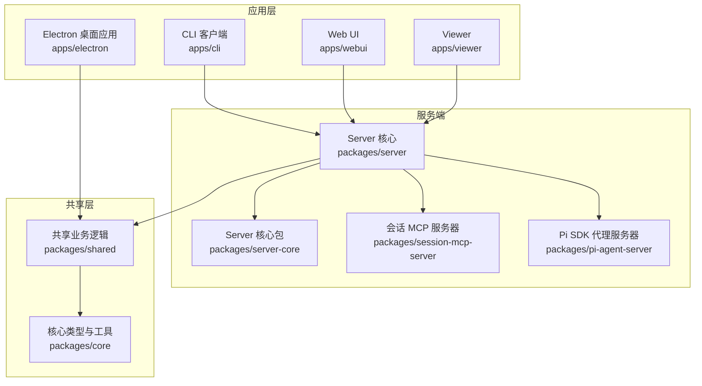
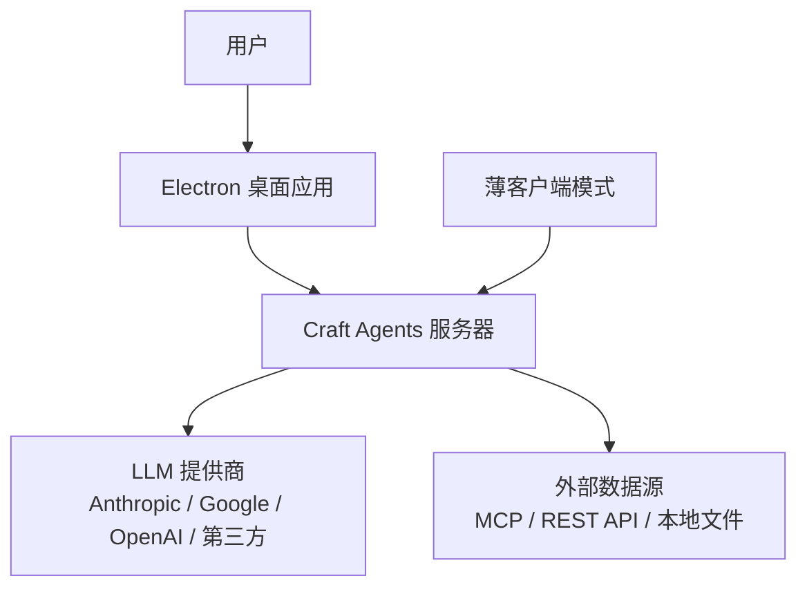
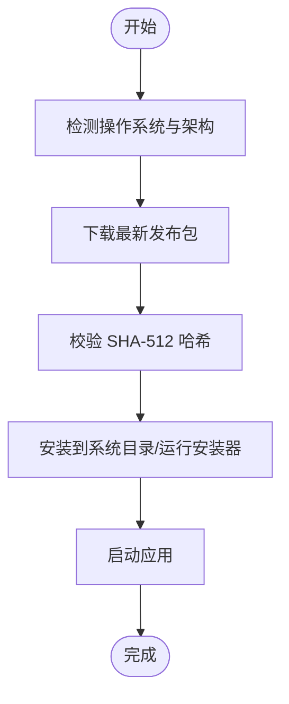
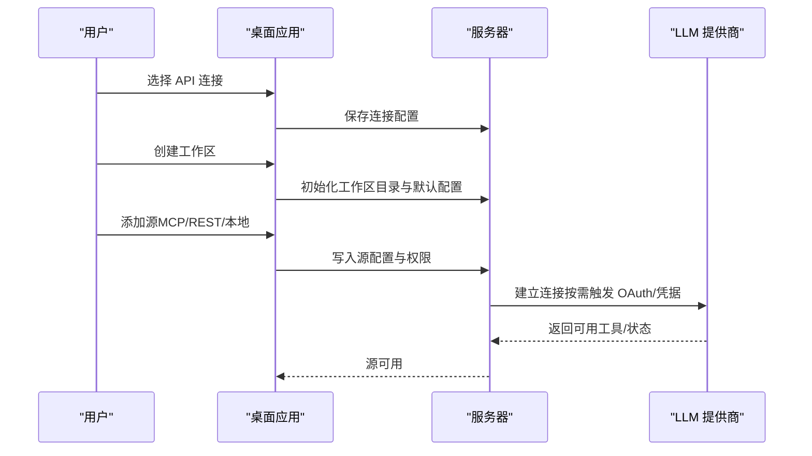
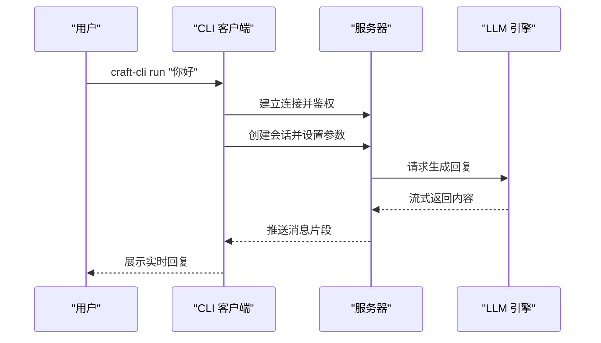
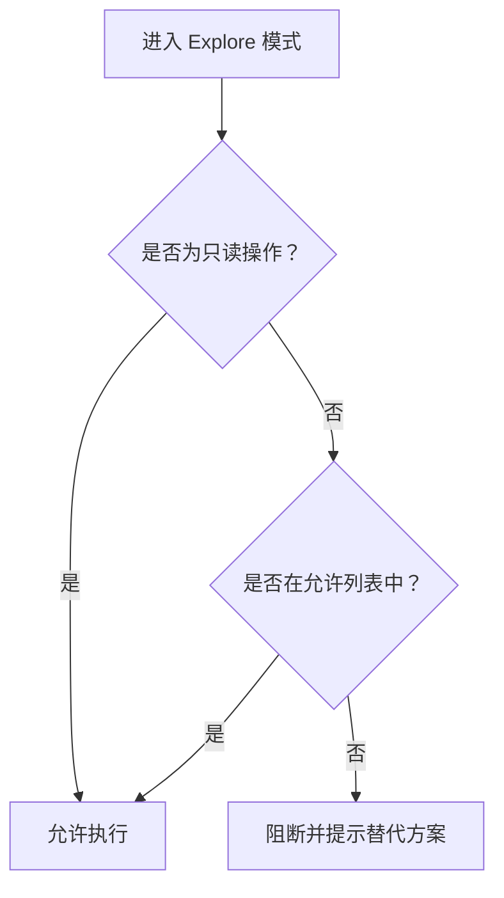
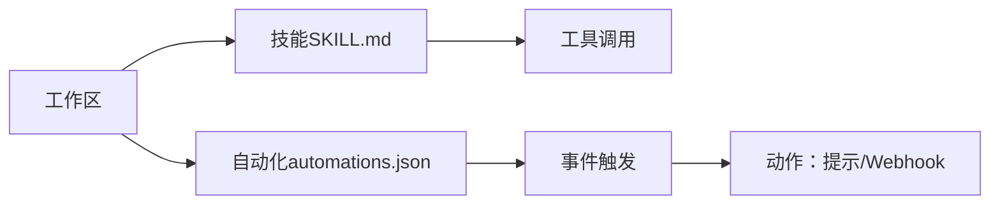
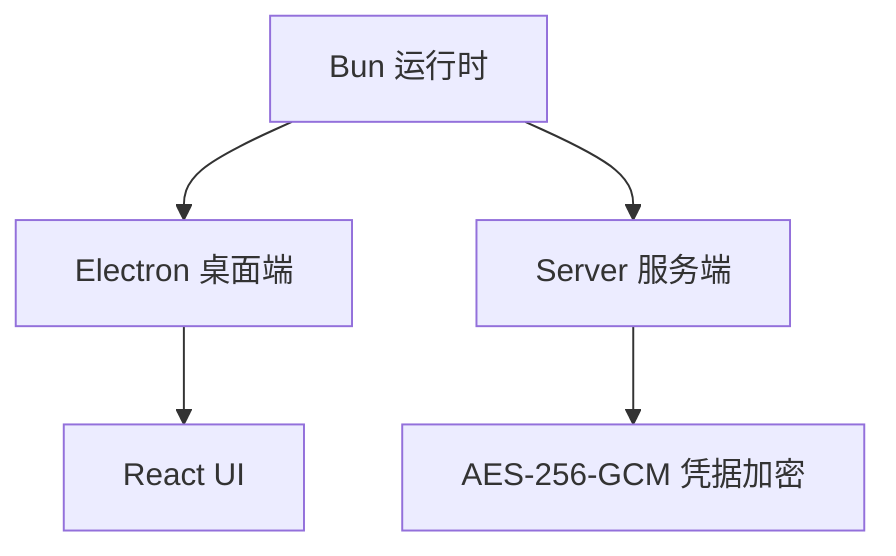

# 快速开始

<cite>
**本文引用的文件**
- [README.md](file://README.md)
- [install-app.sh](file://scripts/install-app.sh)
- [install-app.ps1](file://scripts/install-app.ps1)
- [install-server.sh](file://scripts/install-server.sh)
- [package.json](file://package.json)
- [config-defaults.json](file://apps/electron/resources/config-defaults.json)
- [sources.md](file://apps/electron/resources/docs/sources.md)
- [permissions.md](file://apps/electron/resources/docs/permissions.md)
- [skills.md](file://apps/electron/resources/docs/skills.md)
- [automations.md](file://apps/electron/resources/docs/automations.md)
- [craft-cli.md](file://apps/electron/resources/docs/craft-cli.md)
- [index.ts](file://apps/cli/src/index.ts)
- [storage.ts](file://packages/shared/src/workspaces/storage.ts)
- [storage.ts](file://packages/shared/src/config/storage.ts)
</cite>

## 目录
1. [简介](#简介)
2. [项目结构](#项目结构)
3. [核心组件](#核心组件)
4. [架构总览](#架构总览)
5. [详细组件分析](#详细组件分析)
6. [依赖分析](#依赖分析)
7. [性能考虑](#性能考虑)
8. [故障排除指南](#故障排除指南)
9. [结论](#结论)
10. [附录](#附录)

## 简介
Craft Agents 是一款面向“代理原生”软件理念的多会话桌面应用与远程服务器，支持多 LLM 提供商连接（Anthropic、Google AI Studio、ChatGPT Plus、GitHub Copilot 等），可直接连接 MCP 服务器、REST API 与本地文件系统，并提供权限模式、动态状态系统、技能与自动化等高级能力。本快速开始指南将帮助你在 30 分钟内完成安装、配置与首次体验。

## 项目结构
仓库采用 Monorepo 结构，核心模块包括：
- apps：桌面端 Electron 应用、命令行客户端、Web UI、Viewer
- packages：共享业务逻辑与核心类型
- scripts：安装与构建脚本
- docs：用户文档与指南

图示来源
- [package.json:17-21](file://package.json#L17-L21)

章节来源
- [package.json:17-21](file://package.json#L17-L21)

## 核心组件
- 桌面应用（Electron）：提供多会话管理、状态工作流、权限模式、主题系统、文件附件与自动化等桌面体验。
- 远程服务器（Server）：在远端运行，桌面应用以薄客户端方式连接，实现跨设备访问与长任务执行。
- CLI 客户端：通过 WebSocket 连接服务器，支持列出资源、管理会话、发送消息与健康检查等命令。
- 共享层（Shared）：统一的会话生命周期、配置存储、权限规则、标签与状态管理等。

章节来源
- [README.md:343-366](file://README.md#L343-L366)
- [README.md:486-506](file://README.md#L486-L506)

## 架构总览
下图展示了从用户操作到后端处理的关键交互路径，涵盖桌面端、CLI 与服务器之间的通信。

图示来源
- [README.md:150-181](file://README.md#L150-L181)
- [README.md:455-485](file://README.md#L455-L485)

## 详细组件分析

### 一、安装与启动（30 分钟内完成）
- 一键安装（推荐）
  - macOS/Linux：使用 curl 脚本自动检测平台、下载最新版本、校验 SHA-512 并安装至系统目录。
  - Windows：使用 PowerShell 脚本下载安装器、校验哈希并运行安装程序。
- 从源码构建
  - 克隆仓库、安装依赖、启动开发服务器或打包 Electron 应用。
- 远程服务器（可选）
  - 使用安装脚本生成令牌并启动服务器，或通过环境变量自定义绑定地址与端口；支持 TLS 加密。

图示来源
- [install-app.sh:21-405](file://scripts/install-app.sh#L21-L405)
- [install-app.ps1:17-265](file://scripts/install-app.ps1#L17-L265)
- [README.md:61-83](file://README.md#L61-L83)
- [install-server.sh:1-107](file://scripts/install-server.sh#L1-L107)

章节来源
- [README.md:61-83](file://README.md#L61-L83)
- [install-app.sh:21-405](file://scripts/install-app.sh#L21-L405)
- [install-app.ps1:17-265](file://scripts/install-app.ps1#L17-L265)
- [install-server.sh:1-107](file://scripts/install-server.sh#L1-L107)

### 二、初始配置（API 连接、工作区、源连接）
- API 连接设置
  - 支持 Anthropic（API Key 或 OAuth）、Google AI Studio（API Key）、ChatGPT Plus（Codex OAuth）、GitHub Copilot（OAuth）等多种提供商。
  - 可通过自定义 base URL 连接到第三方或自托管模型（如 OpenRouter、Vercel AI Gateway、Ollama 等）。
- 工作区创建
  - 首次启动时创建默认工作区，包含会话、源、技能、状态与标签等目录结构。
  - 工作区默认权限模式、思考级别等继承全局默认值。
- 源连接配置
  - MCP 服务器（OAuth、Bearer、无认证）、REST API（Bearer/Header/Query/Basic/OAuth）、本地文件系统。
  - 使用 CLI 工具进行源的创建、验证、测试与权限初始化，或在会话中通过向导式流程完成配置。

图示来源
- [README.md:101-108](file://README.md#L101-L108)
- [README.md:455-485](file://README.md#L455-L485)
- [config-defaults.json:15-23](file://apps/electron/resources/config-defaults.json#L15-L23)
- [storage.ts:292-347](file://packages/shared/src/workspaces/storage.ts#L292-L347)
- [storage.ts:697-743](file://packages/shared/src/config/storage.ts#L697-L743)
- [sources.md:1-200](file://apps/electron/resources/docs/sources.md#L1-L200)
- [craft-cli.md:66-129](file://apps/electron/resources/docs/craft-cli.md#L66-L129)

章节来源
- [README.md:101-108](file://README.md#L101-L108)
- [README.md:455-485](file://README.md#L455-L485)
- [config-defaults.json:15-23](file://apps/electron/resources/config-defaults.json#L15-L23)
- [storage.ts:292-347](file://packages/shared/src/workspaces/storage.ts#L292-L347)
- [storage.ts:697-743](file://packages/shared/src/config/storage.ts#L697-L743)
- [sources.md:1-200](file://apps/electron/resources/docs/sources.md#L1-L200)
- [craft-cli.md:66-129](file://apps/electron/resources/docs/craft-cli.md#L66-L129)

### 三、基本使用示例（会话、消息、状态管理）
- 创建会话：在桌面应用中新建聊天，或通过 CLI 创建会话并发送消息。
- 发送消息：支持实时流式响应，可指定工作区、权限模式、输出格式等。
- 管理状态：使用动态状态系统标记会话进度（待办、进行中、待审核、完成）。
- 自动化：基于事件（标签变更、定时器、工具使用等）触发提示或 Webhook。

图示来源
- [index.ts:164-184](file://apps/cli/src/index.ts#L164-L184)
- [README.md:244-342](file://README.md#L244-L342)

章节来源
- [index.ts:164-184](file://apps/cli/src/index.ts#L164-L184)
- [README.md:244-342](file://README.md#L244-L342)

### 四、权限与安全
- 权限模式：Explore（只读）、Ask to Edit（询问）、Auto（自动批准），可在会话中切换。
- Explore 模式默认允许安全的只读操作（如 Bash 的 ls/git 等），阻止写入与高风险命令。
- 自定义权限规则：通过 permissions.json 为工作区或源添加允许/阻止列表，支持 MCP、API 与 Bash 规则。

图示来源
- [permissions.md:188-258](file://apps/electron/resources/docs/permissions.md#L188-L258)
- [permissions.md:251-339](file://apps/electron/resources/docs/permissions.md#L251-L339)

章节来源
- [permissions.md:188-258](file://apps/electron/resources/docs/permissions.md#L188-L258)
- [permissions.md:251-339](file://apps/electron/resources/docs/permissions.md#L251-L339)

### 五、技能与自动化
- 技能（Skills）：为特定任务定制指令，支持图标、自动触发（glob）、预批准工具与所需源。
- 自动化（Automations）：基于事件（标签、状态、定时器、工具使用等）自动发送提示或调用 Webhook。

图示来源
- [skills.md:1-336](file://apps/electron/resources/docs/skills.md#L1-L336)
- [automations.md:1-200](file://apps/electron/resources/docs/automations.md#L1-L200)

章节来源
- [skills.md:1-336](file://apps/electron/resources/docs/skills.md#L1-L336)
- [automations.md:1-200](file://apps/electron/resources/docs/automations.md#L1-L200)

## 依赖分析
- 运行时：Bun（统一运行时）
- 桌面端：Electron + React + shadcn/ui + Tailwind CSS v4
- 服务器端：WebSocket 传输、RPC 通道、子进程服务器（MCP、Pi SDK）
- 凭据存储：AES-256-GCM 加密文件存储

图示来源
- [README.md:569-580](file://README.md#L569-L580)

章节来源
- [README.md:569-580](file://README.md#L569-L580)

## 性能考虑
- 服务器薄客户端模式：将会话逻辑与工具执行迁移到远端，降低本地资源占用，适合长时间任务与多端访问。
- 本地 MCP 服务器隔离：对敏感环境变量进行过滤，避免凭据泄露。
- 大响应摘要：超过阈值的工具响应自动摘要，减少上下文膨胀。

章节来源
- [README.md:150-181](file://README.md#L150-L181)
- [README.md:625-636](file://README.md#L625-L636)

## 故障排除指南
- 启动调试日志
  - macOS/Windows/Linux 提供带调试开关的启动方式，日志输出位置随平台而定。
- 常见问题
  - 无法连接 LLM：检查 API Key、自定义 base URL 与网络连通性。
  - 源连接失败：确认 OAuth 凭据、测试端点与权限配置。
  - 权限被阻断：在 Explore 模式下使用 Ask/Auto 切换，或调整 permissions.json。

章节来源
- [README.md:581-606](file://README.md#L581-L606)
- [permissions.md:188-258](file://apps/electron/resources/docs/permissions.md#L188-L258)

## 结论
通过一键安装脚本与从源码构建两种方式，你可以在 30 分钟内完成 Craft Agents 的安装与基础配置。结合多提供商 API 连接、工作区与源的灵活配置、权限模式与自动化能力，你可以快速上手并体验代理原生的工作流。

## 附录
- 快速开始步骤
  1) 选择安装方式（一键安装或从源码构建）
  2) 选择 API 连接（Anthropic/Google/OpenAI 等）
  3) 创建工作区并配置默认权限模式
  4) 添加源（MCP/REST/本地），并进行验证与授权
  5) 新建会话，发送消息，探索自动化与技能
- CLI 常用命令参考
  - ping/health/versions：健康检查与版本信息
  - workspaces/sessions/connections/sources：资源列表
  - session create/send/delete/cancel：会话管理
  - run：自包含运行（自动启动服务器、发送提示、退出）

章节来源
- [README.md:101-108](file://README.md#L101-L108)
- [README.md:244-342](file://README.md#L244-L342)
- [craft-cli.md:1-200](file://apps/electron/resources/docs/craft-cli.md#L1-L200)