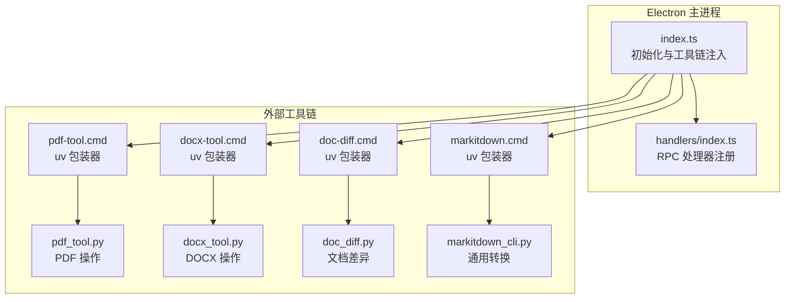
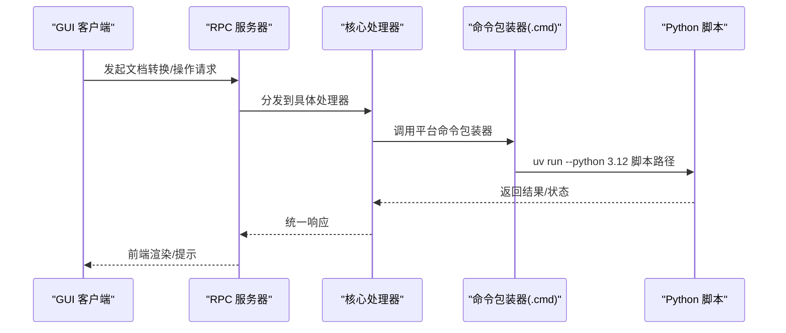
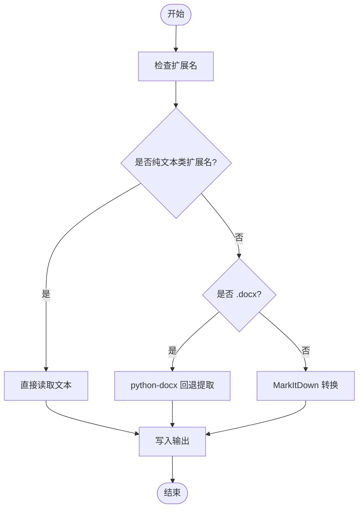
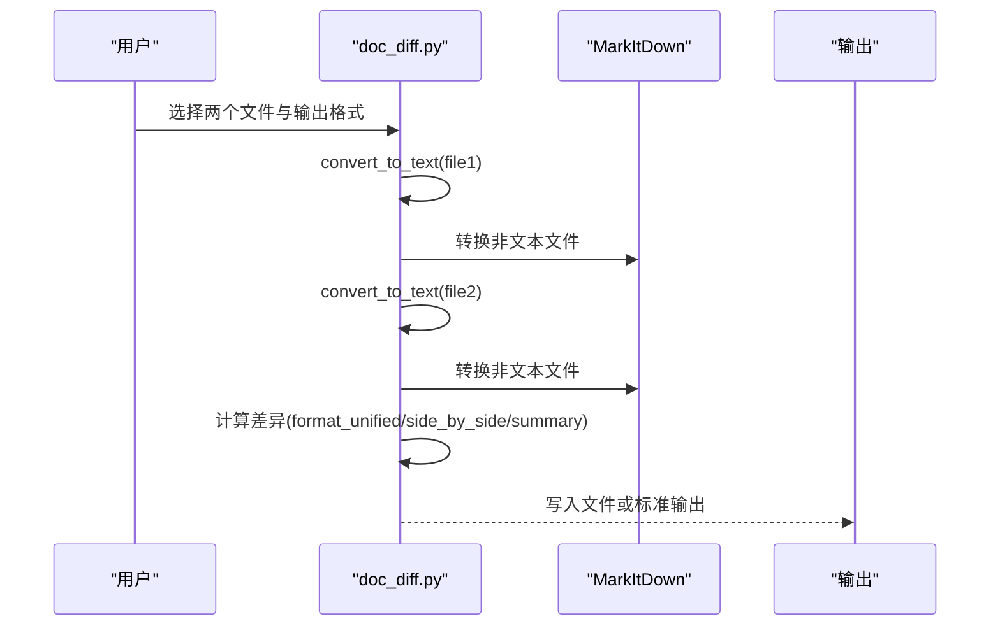
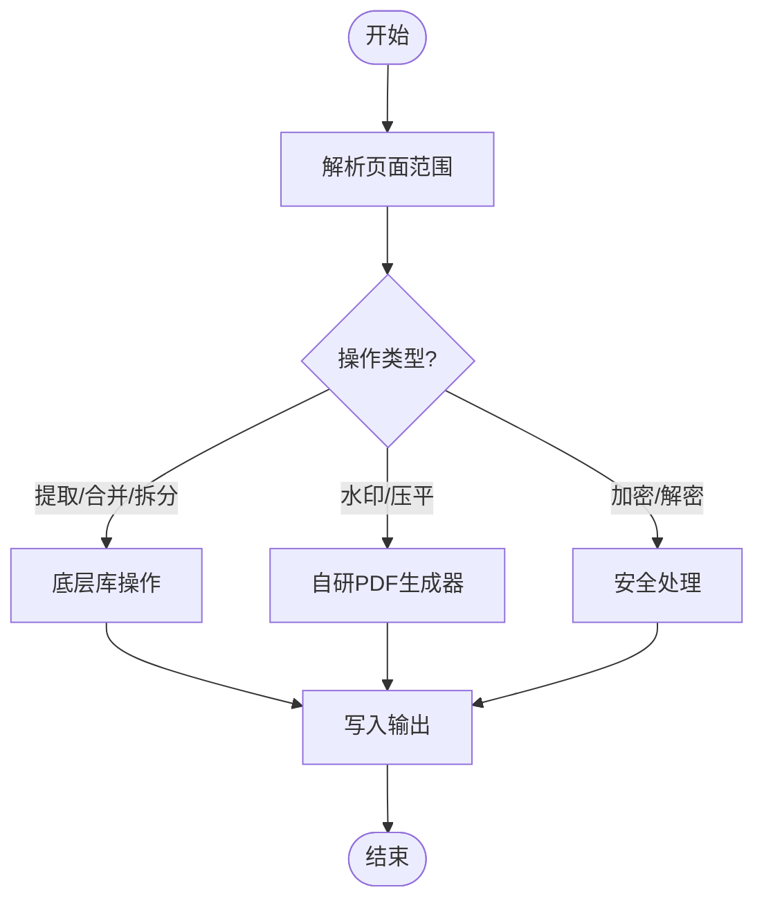
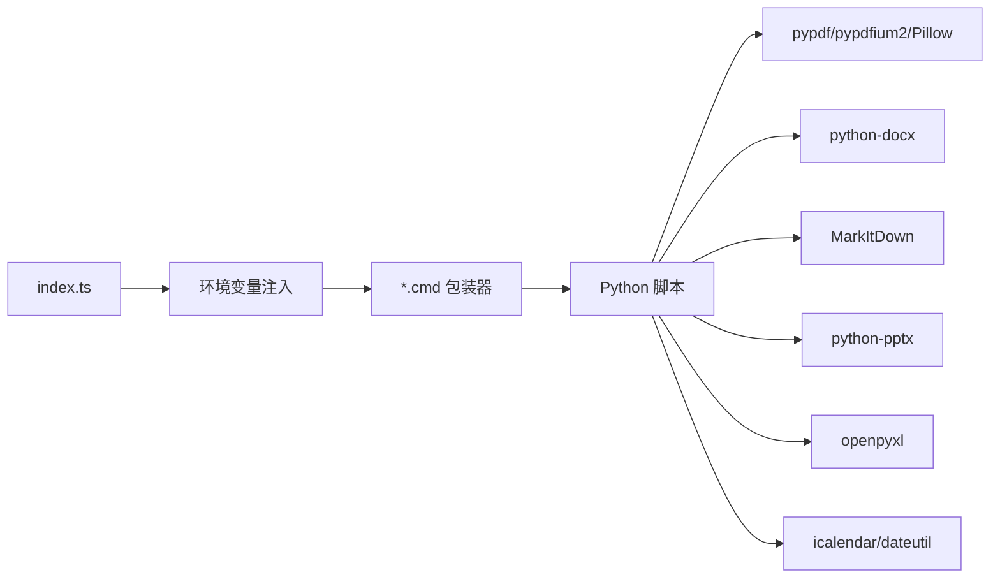

# 文档处理

<cite>
**本文引用的文件**
- [apps/electron/src/main/index.ts](file://apps/electron/src/main/index.ts)
- [apps/electron/src/main/handlers/index.ts](file://apps/electron/src/main/handlers/index.ts)
- [apps/electron/resources/bin/pdf-tool.cmd](file://apps/electron/resources/bin/pdf-tool.cmd)
- [apps/electron/resources/bin/docx-tool.cmd](file://apps/electron/resources/bin/docx-tool.cmd)
- [apps/electron/resources/bin/doc-diff.cmd](file://apps/electron/resources/bin/doc-diff.cmd)
- [apps/electron/resources/bin/markitdown.cmd](file://apps/electron/resources/bin/markitdown.cmd)
- [apps/electron/resources/scripts/pdf_tool.py](file://apps/electron/resources/scripts/pdf_tool.py)
- [apps/electron/resources/scripts/docx_tool.py](file://apps/electron/resources/scripts/docx_tool.py)
- [apps/electron/resources/scripts/doc_diff.py](file://apps/electron/resources/scripts/doc_diff.py)
- [apps/electron/resources/scripts/markitdown_cli.py](file://apps/electron/resources/scripts/markitdown_cli.py)
- [apps/electron/resources/scripts/img_tool.py](file://apps/electron/resources/scripts/img_tool.py)
- [apps/electron/resources/scripts/pptx_tool.py](file://apps/electron/resources/scripts/pptx_tool.py)
- [apps/electron/resources/scripts/xlsx_tool.py](file://apps/electron/resources/scripts/xlsx_tool.py)
- [apps/electron/resources/scripts/ical_tool.py](file://apps/electron/resources/scripts/ical_tool.py)
</cite>

## 目录
1. [简介](#简介)
2. [项目结构](#项目结构)
3. [核心组件](#核心组件)
4. [架构总览](#架构总览)
5. [详细组件分析](#详细组件分析)
6. [依赖关系分析](#依赖关系分析)
7. [性能考量](#性能考量)
8. [故障排查指南](#故障排查指南)
9. [结论](#结论)
10. [附录](#附录)

## 简介
本文件面向需要处理多种文档格式或集成文档管理功能的开发者，系统化梳理该仓库中的文档处理与转换能力：包括文档转换引擎、格式支持范围、转换流程优化；文档预览与差异比较、在线编辑能力；Python 脚本工具链、文件监控机制、转换缓存策略；以及文档安全处理、大文件优化、格式兼容性管理。同时提供自定义转换器开发指南、批量处理方案与性能调优技巧。

## 项目结构
该系统以 Electron 主进程为核心，通过环境变量与命令包装器将 Python 工具链注入到运行时，形成“主进程桥接 + 外部脚本工具”的混合架构。关键路径如下：
- Electron 主进程初始化与工具链注入：apps/electron/src/main/index.ts
- GUI 侧 RPC 处理器注册：apps/electron/src/main/handlers/index.ts
- Windows 批处理包装器（调用 uv 运行 Python 脚本）：apps/electron/resources/bin/*.cmd
- Python 脚本工具集：apps/electron/resources/scripts/*.py

图表来源
- [apps/electron/src/main/index.ts:119-177](file://apps/electron/src/main/index.ts#L119-L177)
- [apps/electron/src/main/handlers/index.ts:12-22](file://apps/electron/src/main/handlers/index.ts#L12-L22)
- [apps/electron/resources/bin/pdf-tool.cmd:1-3](file://apps/electron/resources/bin/pdf-tool.cmd#L1-L3)
- [apps/electron/resources/bin/docx-tool.cmd:1-3](file://apps/electron/resources/bin/docx-tool.cmd#L1-L3)
- [apps/electron/resources/bin/doc-diff.cmd:1-3](file://apps/electron/resources/bin/doc-diff.cmd#L1-L3)
- [apps/electron/resources/bin/markitdown.cmd:1-3](file://apps/electron/resources/bin/markitdown.cmd#L1-L3)

章节来源
- [apps/electron/src/main/index.ts:119-177](file://apps/electron/src/main/index.ts#L119-L177)
- [apps/electron/src/main/handlers/index.ts:12-22](file://apps/electron/src/main/handlers/index.ts#L12-L22)

## 核心组件
- 工具链注入与运行时配置
  - 主进程在启动时设置 CRAFT_* 环境变量，将 uv 可执行文件、脚本目录与命令入口注入 PATH，确保 CLI 工具可在会话中直接使用。
  - 在打包与开发两种模式下，资源路径与入口位置自动适配。
- Python 脚本工具集
  - PDF 工具：提取文本、合并/拆分页、旋转、重排、水印、表单填充、压缩、裁剪、尺寸调整、加密/解密、脱敏等。
  - DOCX 工具：创建、模板填充、信息查询、查找替换、内容抽取。
  - 文档差异：统一转为 Markdown 后进行差异计算与输出。
  - 通用转换：对多格式文档进行 Markdown 转换，内置纯文本与 DOCX 回退路径。
  - 图像工具：缩放、裁剪、旋转、格式转换、元数据、水印、合成。
  - PPTX 工具：从 Markdown/JSON 创建演示文稿、信息查询、内容抽取。
  - XLSX 工具：读取/写入单元格、信息查询、新增工作表、导出 CSV/JSON。
  - 日历工具：读取/创建/过滤 .ics 事件。
- 预览与差异比较
  - 通过通用转换器将各类文档统一转为 Markdown，便于前端渲染与对比。
  - 提供差异工具对两份文档进行统一格式化输出（统一差异、并排对比、摘要统计）。
- 在线编辑能力
  - 通过脚本工具实现模板填充、表单填写、内容抽取与再生成，支撑在线编辑场景。

章节来源
- [apps/electron/src/main/index.ts:119-177](file://apps/electron/src/main/index.ts#L119-L177)
- [apps/electron/resources/scripts/pdf_tool.py:420-800](file://apps/electron/resources/scripts/pdf_tool.py#L420-L800)
- [apps/electron/resources/scripts/docx_tool.py:111-391](file://apps/electron/resources/scripts/docx_tool.py#L111-L391)
- [apps/electron/resources/scripts/doc_diff.py:200-252](file://apps/electron/resources/scripts/doc_diff.py#L200-L252)
- [apps/electron/resources/scripts/markitdown_cli.py:87-138](file://apps/electron/resources/scripts/markitdown_cli.py#L87-L138)
- [apps/electron/resources/scripts/img_tool.py:63-371](file://apps/electron/resources/scripts/img_tool.py#L63-L371)
- [apps/electron/resources/scripts/pptx_tool.py:31-365](file://apps/electron/resources/scripts/pptx_tool.py#L31-L365)
- [apps/electron/resources/scripts/xlsx_tool.py:39-376](file://apps/electron/resources/scripts/xlsx_tool.py#L39-L376)
- [apps/electron/resources/scripts/ical_tool.py:113-373](file://apps/electron/resources/scripts/ical_tool.py#L113-L373)

## 架构总览
系统采用“主进程桥接 + 外部脚本工具”的混合架构：
- 主进程负责应用生命周期、窗口管理、RPC 注册与工具链注入。
- GUI 侧通过 RPC 调用核心处理器，核心处理器再委派至对应的 Python 脚本工具。
- Windows 平台通过 .cmd 包装器调用 uv，间接运行对应 Python 脚本。

图表来源
- [apps/electron/src/main/handlers/index.ts:19-22](file://apps/electron/src/main/handlers/index.ts#L19-L22)
- [apps/electron/resources/bin/pdf-tool.cmd:1-3](file://apps/electron/resources/bin/pdf-tool.cmd#L1-L3)
- [apps/electron/resources/bin/docx-tool.cmd:1-3](file://apps/electron/resources/bin/docx-tool.cmd#L1-L3)
- [apps/electron/resources/bin/doc-diff.cmd:1-3](file://apps/electron/resources/bin/doc-diff.cmd#L1-L3)
- [apps/electron/resources/bin/markitdown.cmd:1-3](file://apps/electron/resources/bin/markitdown.cmd#L1-L3)

## 详细组件分析

### 文档转换引擎（通用转换）
- 功能概述
  - 支持多种文档格式（含 DOCX、XLSX、PPTX、PDF、HTML、Jupyter Notebook、XML、RSS、ZIP、MSG、EMail、音视频等），统一输出 Markdown。
  - 对纯文本类扩展名与 DOCX 提供回退路径，避免依赖缺失导致失败。
- 关键流程
  - 输入校验与扩展名判定。
  - 纯文本与 DOCX 直接读取或回退提取。
  - 其他格式通过 MarkItDown 转换为 Markdown。
  - 输出写入文件或标准输出。
- 性能与健壮性
  - 延迟导入 MarkItDown，避免启动期崩溃。
  - 对常见依赖缺失给出明确提示（如 Microsoft Visual C++ Redistributable）。

图表来源
- [apps/electron/resources/scripts/markitdown_cli.py:87-138](file://apps/electron/resources/scripts/markitdown_cli.py#L87-L138)
- [apps/electron/resources/scripts/docx_tool.py:59-76](file://apps/electron/resources/scripts/docx_tool.py#L59-L76)

章节来源
- [apps/electron/resources/scripts/markitdown_cli.py:24-53](file://apps/electron/resources/scripts/markitdown_cli.py#L24-L53)
- [apps/electron/resources/scripts/markitdown_cli.py:87-138](file://apps/electron/resources/scripts/markitdown_cli.py#L87-L138)
- [apps/electron/resources/scripts/docx_tool.py:59-76](file://apps/electron/resources/scripts/docx_tool.py#L59-L76)

### 文档差异比较（doc_diff）
- 功能概述
  - 将两个文档统一转换为文本后，支持三种输出格式：统一差异、并排对比、摘要统计。
  - 支持词级标记与相似度统计。
- 关键流程
  - 读取文件并转换为文本。
  - 计算差异并按格式输出。
  - 支持写入文件或标准输出。

图表来源
- [apps/electron/resources/scripts/doc_diff.py:50-76](file://apps/electron/resources/scripts/doc_diff.py#L50-L76)
- [apps/electron/resources/scripts/doc_diff.py:200-252](file://apps/electron/resources/scripts/doc_diff.py#L200-L252)

章节来源
- [apps/electron/resources/scripts/doc_diff.py:78-197](file://apps/electron/resources/scripts/doc_diff.py#L78-L197)
- [apps/electron/resources/scripts/doc_diff.py:200-252](file://apps/electron/resources/scripts/doc_diff.py#L200-L252)

### PDF 操作工具（pdf_tool）
- 功能概述
  - 组织类：提取文本、信息查询、合并、拆分、旋转、重排、复制页。
  - 编辑类：水印、表单填充、压缩、裁剪、尺寸调整、压平等。
  - 安全类：加密、解密、脱敏、净化。
  - 转换类：图像提取、图像转 PDF、DOCX/PPTX 转换。
- 关键流程
  - 页面范围解析（严格校验，避免静默错误）。
  - 使用 pypdfium2/pypdf 等库进行底层操作。
  - 自研 PDF 生成器用于水印与覆盖层。

图表来源
- [apps/electron/resources/scripts/pdf_tool.py:71-136](file://apps/electron/resources/scripts/pdf_tool.py#L71-L136)
- [apps/electron/resources/scripts/pdf_tool.py:420-800](file://apps/electron/resources/scripts/pdf_tool.py#L420-L800)

章节来源
- [apps/electron/resources/scripts/pdf_tool.py:71-136](file://apps/electron/resources/scripts/pdf_tool.py#L71-L136)
- [apps/electron/resources/scripts/pdf_tool.py:165-287](file://apps/electron/resources/scripts/pdf_tool.py#L165-L287)

### DOCX 操作工具（docx_tool）
- 功能概述
  - 创建：从 Markdown/文本创建新文档，支持标题、列表、分页符等基础格式。
  - 模板：基于 JSON 填充占位符。
  - 信息：统计段落数、表格数、样式、字数等。
  - 查找替换：支持大小写敏感与跨段落/表格/页眉页脚替换。
  - 抽取：提取文本内容，保留标题层级。
- 关键流程
  - Markdown 到段落与内联样式的映射。
  - 占位符替换采用单次替换策略，避免重复替换。
  - 查找替换遍历段落、表格与页眉页脚。

章节来源
- [apps/electron/resources/scripts/docx_tool.py:32-110](file://apps/electron/resources/scripts/docx_tool.py#L32-L110)
- [apps/electron/resources/scripts/docx_tool.py:157-231](file://apps/electron/resources/scripts/docx_tool.py#L157-L231)
- [apps/electron/resources/scripts/docx_tool.py:289-351](file://apps/electron/resources/scripts/docx_tool.py#L289-L351)
- [apps/electron/resources/scripts/docx_tool.py:354-386](file://apps/electron/resources/scripts/docx_tool.py#L354-L386)

### 图像处理工具（img_tool）
- 功能概述
  - 缩放、裁剪、旋转、格式转换、元数据查询、水印、合成。
- 关键流程
  - 格式推断与保存参数（如 JPEG 质量）。
  - 水印与合成采用 Alpha 混合与透明度控制。

章节来源
- [apps/electron/resources/scripts/img_tool.py:69-122](file://apps/electron/resources/scripts/img_tool.py#L69-L122)
- [apps/electron/resources/scripts/img_tool.py:205-253](file://apps/electron/resources/scripts/img_tool.py#L205-L253)
- [apps/electron/resources/scripts/img_tool.py:256-323](file://apps/electron/resources/scripts/img_tool.py#L256-L323)
- [apps/electron/resources/scripts/img_tool.py:326-366](file://apps/electron/resources/scripts/img_tool.py#L326-L366)

### PPTX 操作工具（pptx_tool）
- 功能概述
  - 创建：从 Markdown/JSON/文本生成演示文稿，支持标题幻灯片与布局选择。
  - 信息：统计幻灯片数量、尺寸、布局、备注等。
  - 抽取：按幻灯片提取文本与表格内容。
- 关键流程
  - Markdown 解析为幻灯片数据结构。
  - 布局选择与内容占位符设置。

章节来源
- [apps/electron/resources/scripts/pptx_tool.py:114-144](file://apps/electron/resources/scripts/pptx_tool.py#L114-L144)
- [apps/electron/resources/scripts/pptx_tool.py:165-246](file://apps/electron/resources/scripts/pptx_tool.py#L165-L246)
- [apps/electron/resources/scripts/pptx_tool.py:248-297](file://apps/electron/resources/scripts/pptx_tool.py#L248-L297)
- [apps/electron/resources/scripts/pptx_tool.py:300-360](file://apps/electron/resources/scripts/pptx_tool.py#L300-L360)

### XLSX 操作工具（xlsx_tool）
- 功能概述
  - 读取：支持指定工作表、区域、全部工作表，输出文本/CSS/JSON。
  - 写入：创建或更新单元格值，自动类型转换。
  - 信息：统计工作表数量、维度等。
  - 导出：CSV/JSON 导出。
- 关键流程
  - 行数据转记录（带表头）。
  - 格式化输出（文本/CSV/JSON）。

章节来源
- [apps/electron/resources/scripts/xlsx_tool.py:117-179](file://apps/electron/resources/scripts/xlsx_tool.py#L117-L179)
- [apps/electron/resources/scripts/xlsx_tool.py:182-234](file://apps/electron/resources/scripts/xlsx_tool.py#L182-L234)
- [apps/electron/resources/scripts/xlsx_tool.py:237-274](file://apps/electron/resources/scripts/xlsx_tool.py#L237-L274)
- [apps/electron/resources/scripts/xlsx_tool.py:314-371](file://apps/electron/resources/scripts/xlsx_tool.py#L314-L371)

### 日历工具（ical_tool）
- 功能概述
  - 读取：事件列表与元数据。
  - 创建：从 JSON 生成 .ics 文件，支持日期/时间与时区处理。
  - 过滤：按日期范围筛选事件，支持输出为 .ics/JSON/文本。
- 关键流程
  - 日期解析与本地时区规范化。
  - 事件字段映射与 UID 生成。

章节来源
- [apps/electron/resources/scripts/ical_tool.py:119-169](file://apps/electron/resources/scripts/ical_tool.py#L119-L169)
- [apps/electron/resources/scripts/ical_tool.py:172-277](file://apps/electron/resources/scripts/ical_tool.py#L172-L277)
- [apps/electron/resources/scripts/ical_tool.py:280-368](file://apps/electron/resources/scripts/ical_tool.py#L280-L368)

## 依赖关系分析
- 主进程与工具链
  - 主进程通过环境变量注入 uv 与脚本目录，包装器以 .cmd 形式调用 uv，实现跨平台一致性。
- 工具链内部依赖
  - PDF 工具依赖 pypdfium2、pypdf、img2pdf、Pillow 等。
  - DOCX 工具依赖 python-docx。
  - 通用转换依赖 MarkItDown 及其可选原生依赖。
  - 图像工具依赖 Pillow。
  - PPTX 工具依赖 python-pptx。
  - XLSX 工具依赖 openpyxl。
  - 日历工具依赖 icalendar、python-dateutil。

图表来源
- [apps/electron/src/main/index.ts:119-177](file://apps/electron/src/main/index.ts#L119-L177)
- [apps/electron/resources/bin/pdf-tool.cmd:1-3](file://apps/electron/resources/bin/pdf-tool.cmd#L1-3)
- [apps/electron/resources/bin/docx-tool.cmd:1-3](file://apps/electron/resources/bin/docx-tool.cmd#L1-3)
- [apps/electron/resources/bin/doc-diff.cmd:1-3](file://apps/electron/resources/bin/doc-diff.cmd#L1-3)
- [apps/electron/resources/bin/markitdown.cmd:1-3](file://apps/electron/resources/bin/markitdown.cmd#L1-3)

章节来源
- [apps/electron/resources/scripts/pdf_tool.py:3-11](file://apps/electron/resources/scripts/pdf_tool.py#L3-L11)
- [apps/electron/resources/scripts/docx_tool.py:18-19](file://apps/electron/resources/scripts/docx_tool.py#L18-L19)
- [apps/electron/resources/scripts/markitdown_cli.py:2-4](file://apps/electron/resources/scripts/markitdown_cli.py#L2-L4)
- [apps/electron/resources/scripts/img_tool.py:17-18](file://apps/electron/resources/scripts/img_tool.py#L17-L18)
- [apps/electron/resources/scripts/pptx_tool.py:19](file://apps/electron/resources/scripts/pptx_tool.py#L19)
- [apps/electron/resources/scripts/xlsx_tool.py:20](file://apps/electron/resources/scripts/xlsx_tool.py#L20)
- [apps/electron/resources/scripts/ical_tool.py:22](file://apps/electron/resources/scripts/ical_tool.py#L22)

## 性能考量
- 转换流程优化
  - 通用转换器对纯文本与 DOCX 提供快速路径，减少 MarkItDown 的调用开销。
  - PDF 工具在压缩与水印等场景采用底层库原生能力，避免不必要的中间格式转换。
- 大文件优化
  - PDF 提取与编辑采用流式与按需加载策略，避免一次性载入整页。
  - 图像处理默认使用高质量采样算法，同时提供质量参数以平衡体积与清晰度。
- 格式兼容性
  - 通过严格的页面范围解析与错误提示，避免因输入不规范导致的隐性失败。
  - 通用转换器对缺失依赖给出明确指引，提升可用性。

[本节为通用指导，无需列出章节来源]

## 故障排查指南
- 通用转换失败
  - 症状：MarkItDown 依赖缺失导致转换异常。
  - 处理：安装 Microsoft Visual C++ Redistributable 后重试。
- PDF 操作异常
  - 症状：加密 PDF 无法读取元数据或提取文本。
  - 处理：先解密再操作；确认输出文件与输入文件不同。
- 页面范围错误
  - 症状：页面范围解析报错或静默忽略。
  - 处理：严格遵循“1-基索引”与逗号分隔规则，避免空段与越界。
- 图像格式问题
  - 症状：JPEG 透明通道丢失。
  - 处理：自动转换为 RGB 模式保存，必要时先转 PNG。
- DOCX 查找替换未生效
  - 症状：占位符未被替换或重复替换。
  - 处理：采用单次替换策略，确保占位符唯一且不嵌套。

章节来源
- [apps/electron/resources/scripts/markitdown_cli.py:120-133](file://apps/electron/resources/scripts/markitdown_cli.py#L120-L133)
- [apps/electron/resources/scripts/pdf_tool.py:465-551](file://apps/electron/resources/scripts/pdf_tool.py#L465-L551)
- [apps/electron/resources/scripts/pdf_tool.py:71-136](file://apps/electron/resources/scripts/pdf_tool.py#L71-L136)
- [apps/electron/resources/scripts/img_tool.py:47-60](file://apps/electron/resources/scripts/img_tool.py#L47-L60)
- [apps/electron/resources/scripts/docx_tool.py:209-231](file://apps/electron/resources/scripts/docx_tool.py#L209-L231)

## 结论
该系统通过 Electron 主进程与 Python 脚本工具链的协同，构建了覆盖多格式文档的转换、预览、差异比较与在线编辑能力。其设计强调：
- 统一转换入口（Markdown）简化前端渲染与对比；
- 严格的输入校验与错误提示提升稳定性；
- 跨平台包装器与环境注入保障运行一致性；
- 面向生产的日志与错误上报机制辅助运维与诊断。

[本节为总结性内容，无需列出章节来源]

## 附录

### 自定义转换器开发指南
- 设计原则
  - 输入：统一接收文件路径与输出目标。
  - 转换：优先使用轻量回退路径（如纯文本、DOCX），再使用 MarkItDown。
  - 输出：支持文件与标准输出，遵循 UTF-8 编码。
- 开发步骤
  - 新建脚本文件，声明依赖与入口。
  - 实现 convert_to_text 或等价逻辑，返回文本内容。
  - 提供 CLI 参数解析与输出写入。
  - 在 Windows 平台添加 .cmd 包装器，确保 uv 运行。
  - 在主进程中确认环境变量已注入脚本目录与 uv。

章节来源
- [apps/electron/resources/scripts/markitdown_cli.py:87-138](file://apps/electron/resources/scripts/markitdown_cli.py#L87-L138)
- [apps/electron/resources/bin/markitdown.cmd:1-3](file://apps/electron/resources/bin/markitdown.cmd#L1-L3)
- [apps/electron/src/main/index.ts:119-177](file://apps/electron/src/main/index.ts#L119-L177)

### 批量处理方案
- PDF 批处理
  - 使用合并/拆分/旋转/重排等命令对多个文件进行批量化操作。
  - 页面范围解析严格，建议先小批量验证再扩大规模。
- 文档转换批处理
  - 通过循环调用通用转换器，将目录内多格式文档统一转为 Markdown。
  - 结合差异工具对版本变更进行自动化比对。

章节来源
- [apps/electron/resources/scripts/pdf_tool.py:554-583](file://apps/electron/resources/scripts/pdf_tool.py#L554-L583)
- [apps/electron/resources/scripts/pdf_tool.py:585-616](file://apps/electron/resources/scripts/pdf_tool.py#L585-L616)
- [apps/electron/resources/scripts/pdf_tool.py:619-700](file://apps/electron/resources/scripts/pdf_tool.py#L619-L700)
- [apps/electron/resources/scripts/markitdown_cli.py:87-138](file://apps/electron/resources/scripts/markitdown_cli.py#L87-L138)
- [apps/electron/resources/scripts/doc_diff.py:200-252](file://apps/electron/resources/scripts/doc_diff.py#L200-L252)

### 安全处理与合规
- PDF 安全
  - 支持加密/解密、脱敏与净化，避免敏感信息泄露。
- 错误上报
  - 主进程集成 Sentry，自动屏蔽敏感头部与凭据，便于生产环境追踪。

章节来源
- [apps/electron/resources/scripts/pdf_tool.py:707-783](file://apps/electron/resources/scripts/pdf_tool.py#L707-L783)
- [apps/electron/src/main/index.ts:20-59](file://apps/electron/src/main/index.ts#L20-L59)