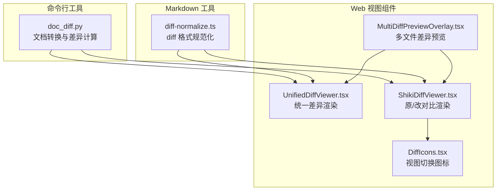
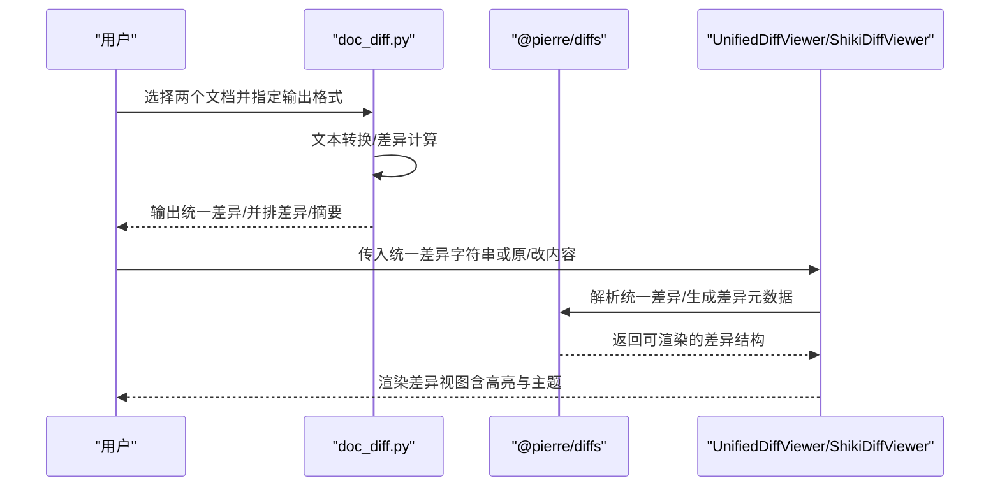
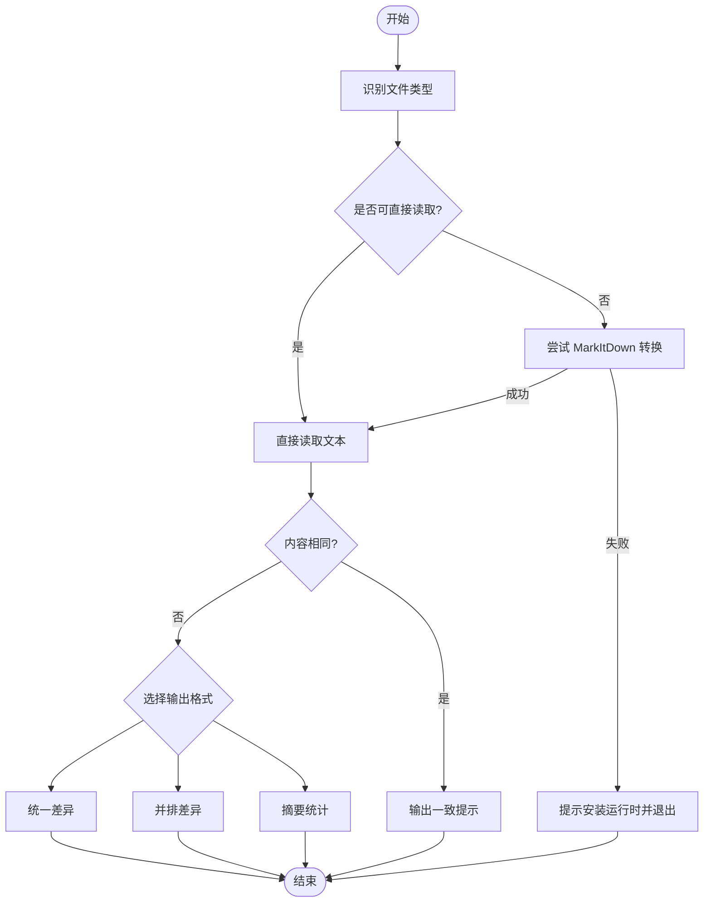
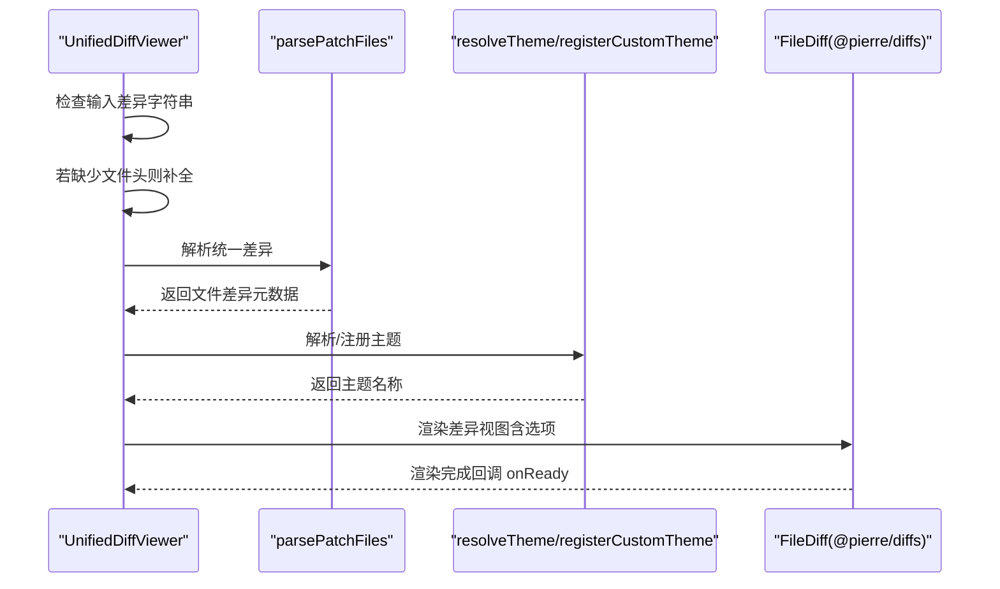
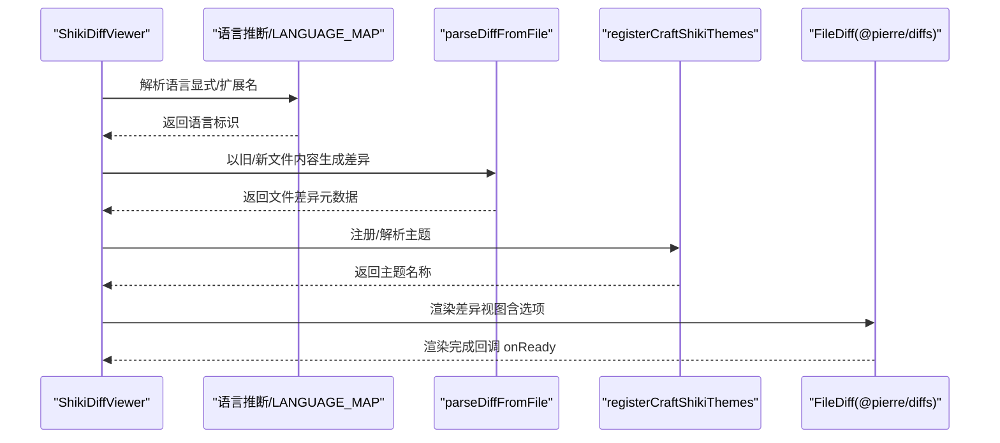
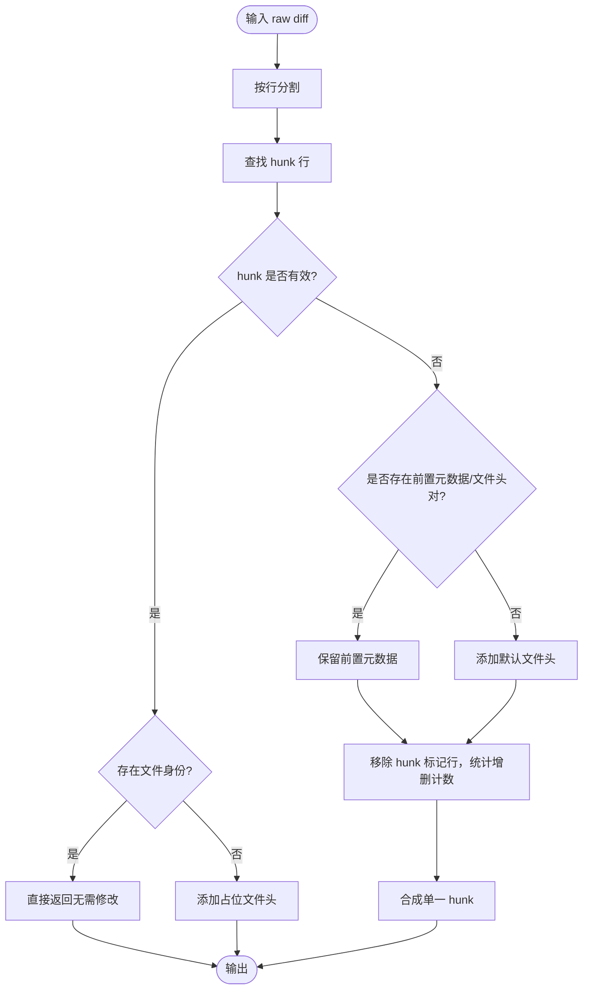
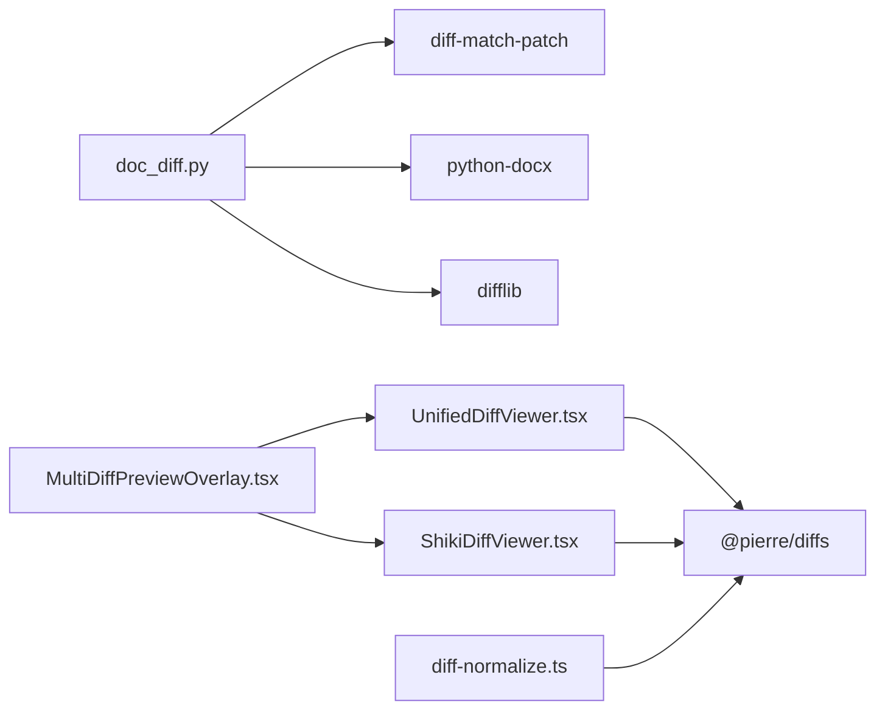

# 文档差异比较

<cite>
**本文引用的文件**
- [doc_diff.py](file://apps/electron/resources/scripts/doc_diff.py)
- [diff-normalize.ts](file://packages/ui/src/components/markdown/diff-normalize.ts)
- [UnifiedDiffViewer.tsx](file://packages/ui/src/components/code-viewer/UnifiedDiffViewer.tsx)
- [ShikiDiffViewer.tsx](file://packages/ui/src/components/code-viewer/ShikiDiffViewer.tsx)
- [DiffIcons.tsx](file://packages/ui/src/components/code-viewer/DiffIcons.tsx)
- [MultiDiffPreviewOverlay.tsx](file://packages/ui/src/components/overlay/MultiDiffPreviewOverlay.tsx)
- [test_doc_diff_smoke.py](file://apps/electron/resources/scripts/tests/test_doc_diff_smoke.py)
- [tiptap-mermaid-input-helpers.test.ts](file://packages/ui/src/components/markdown/__tests__/tiptap-mermaid-input-helpers.test.ts)
- [tiptap-mermaid-input-helpers.test.ts](file://packages/ui/src/components/markdown/__tests__/tiptap-mermaid-input-helpers.test.ts)
</cite>

## 目录
1. [简介](#简介)
2. [项目结构](#项目结构)
3. [核心组件](#核心组件)
4. [架构总览](#架构总览)
5. [详细组件分析](#详细组件分析)
6. [依赖关系分析](#依赖关系分析)
7. [性能考虑](#性能考虑)
8. [故障排查指南](#故障排查指南)
9. [结论](#结论)
10. [附录](#附录)

## 简介
本技术文档围绕“文档差异比较”能力，系统阐述差异检测算法、文本对比策略、变更高亮机制与可视化呈现；覆盖文档版本对比、增量更新、冲突解决等特性；并给出性能优化、内存控制与大文件处理方案，以及差异可视化设计、用户交互反馈与导出报告生成建议。最后提供差异比较器扩展指南、自定义比较规则与比较精度调优方法，帮助开发者快速集成到版本管理或内容审核场景。

## 项目结构
该能力由三部分协同实现：
- 命令行工具：基于 Python 的文档差异比较脚本，支持多种文档格式转换与统一输出（统一差异、并排对比、摘要统计）。
- Web 视图组件：基于 @pierre/diffs 的 React 组件，提供统一/分屏视图、语法高亮、主题切换与点击文件头回调。
- Markdown 工具：对来自编辑器的 diff 片段进行规范化，确保可被统一解析器正确识别。

**图表来源**
- [doc_diff.py:1-252](file://apps/electron/resources/scripts/doc_diff.py#L1-L252)
- [UnifiedDiffViewer.tsx:1-247](file://packages/ui/src/components/code-viewer/UnifiedDiffViewer.tsx#L1-L247)
- [ShikiDiffViewer.tsx:1-222](file://packages/ui/src/components/code-viewer/ShikiDiffViewer.tsx#L1-L222)
- [DiffIcons.tsx:1-51](file://packages/ui/src/components/code-viewer/DiffIcons.tsx#L1-L51)
- [MultiDiffPreviewOverlay.tsx:64-104](file://packages/ui/src/components/overlay/MultiDiffPreviewOverlay.tsx#L64-L104)
- [diff-normalize.ts:1-129](file://packages/ui/src/components/markdown/diff-normalize.ts#L1-L129)

**章节来源**
- [doc_diff.py:1-252](file://apps/electron/resources/scripts/doc_diff.py#L1-L252)
- [UnifiedDiffViewer.tsx:1-247](file://packages/ui/src/components/code-viewer/UnifiedDiffViewer.tsx#L1-L247)
- [ShikiDiffViewer.tsx:1-222](file://packages/ui/src/components/code-viewer/ShikiDiffViewer.tsx#L1-L222)
- [diff-normalize.ts:1-129](file://packages/ui/src/components/markdown/diff-normalize.ts#L1-L129)
- [MultiDiffPreviewOverlay.tsx:64-104](file://packages/ui/src/components/overlay/MultiDiffPreviewOverlay.tsx#L64-L104)

## 核心组件
- 命令行差异比较器（Python）
  - 支持 .txt/.md/.rst/.csv/.tsv/.log 等纯文本直读；.docx 提供独立路径；其他格式通过 MarkItDown 转换为文本；随后使用 difflib 生成统一差异或并排差异，或输出语义化摘要。
  - 关键流程：文件读取 → 文本转换 → 差异计算 → 输出格式化。
- 统一差异渲染器（React）
  - 接收已计算的统一差异字符串，自动补全缺失的文件头，解析为内部结构后交由 @pierre/diffs 渲染；支持主题、样式、背景高亮开关、文件头点击回调。
- 原/改对比渲染器（React）
  - 接收原始与修改后的内容与语言信息，内部调用解析器生成差异并渲染；同样支持主题、样式、背景高亮与文件头点击回调。
- Markdown diff 规范化（React）
  - 将来自编辑器的 diff 片段标准化为统一差异格式，保证解析器可正确识别单文件差异；对裸标记、无文件头等情况进行合成与修正。
- 多文件差异预览（React）
  - 将多个文件变更按文件路径分组，支持合并/非合并两种展示模式，便于在弹层中集中审阅。

**章节来源**
- [doc_diff.py:50-84](file://apps/electron/resources/scripts/doc_diff.py#L50-L84)
- [UnifiedDiffViewer.tsx:62-90](file://packages/ui/src/components/code-viewer/UnifiedDiffViewer.tsx#L62-L90)
- [ShikiDiffViewer.tsx:123-125](file://packages/ui/src/components/code-viewer/ShikiDiffViewer.tsx#L123-L125)
- [diff-normalize.ts:63-128](file://packages/ui/src/components/markdown/diff-normalize.ts#L63-L128)
- [MultiDiffPreviewOverlay.tsx:98-104](file://packages/ui/src/components/overlay/MultiDiffPreviewOverlay.tsx#L98-L104)

## 架构总览
整体架构分为“数据准备—差异计算—渲染展示—交互反馈”四层：
- 数据准备：命令行工具负责文档转换与差异计算；Web 组件直接消费已计算的差异或原/改内容。
- 差异计算：Python 使用 difflib 与 diff-match-patch；React 组件使用 @pierre/diffs 解析统一差异。
- 渲染展示：统一/分屏视图、语法高亮、主题适配。
- 交互反馈：文件头点击、视图切换、统计信息展示。

**图表来源**
- [doc_diff.py:200-248](file://apps/electron/resources/scripts/doc_diff.py#L200-L248)
- [UnifiedDiffViewer.tsx:111-113](file://packages/ui/src/components/code-viewer/UnifiedDiffViewer.tsx#L111-L113)
- [ShikiDiffViewer.tsx:123-125](file://packages/ui/src/components/code-viewer/ShikiDiffViewer.tsx#L123-L125)

## 详细组件分析

### 命令行差异比较器（doc_diff.py）
- 功能要点
  - 文件类型识别与转换：纯文本直读；.docx 独立路径；其他通过 MarkItDown 转换；失败时提示安装必要运行时。
  - 差异输出：统一差异、并排差异、摘要统计（相似度、增删行数、字符级插入/删除统计）。
  - 词级标记（摘要）：可选以 [-删除-] 与 {+插入+} 形式展示。
- 算法与策略
  - 行级差异：difflib.unified_diff 与 SequenceMatcher。
  - 字符级差异：diff-match-patch 的 diff_main + diff_cleanupSemantic。
- 错误处理
  - 缺失文件、转换异常、空差异等场景均有明确返回码与提示。

**图表来源**
- [doc_diff.py:50-84](file://apps/electron/resources/scripts/doc_diff.py#L50-L84)
- [doc_diff.py:125-197](file://apps/electron/resources/scripts/doc_diff.py#L125-L197)
- [doc_diff.py:200-248](file://apps/electron/resources/scripts/doc_diff.py#L200-L248)

**章节来源**
- [doc_diff.py:1-252](file://apps/electron/resources/scripts/doc_diff.py#L1-L252)
- [test_doc_diff_smoke.py:24-42](file://apps/electron/resources/scripts/tests/test_doc_diff_smoke.py#L24-L42)

### 统一差异渲染器（UnifiedDiffViewer）
- 功能要点
  - 接收统一差异字符串，自动补全缺失文件头；解析为 @pierre/diffs 可识别的文件差异元数据；支持主题、样式、背景高亮、文件头点击回调。
  - 提供统计函数用于快速获取新增/删除行数，便于在标题栏展示。
- 设计模式
  - 使用 useMemo 缓存解析结果，避免重复解析；useEffect 在首次渲染后触发 onReady 回调。
  - 通过自定义元素与 Shadow DOM 查询定位文件头，注入点击事件，保持对第三方组件的最小侵入。

**图表来源**
- [UnifiedDiffViewer.tsx:62-90](file://packages/ui/src/components/code-viewer/UnifiedDiffViewer.tsx#L62-L90)
- [UnifiedDiffViewer.tsx:124-134](file://packages/ui/src/components/code-viewer/UnifiedDiffViewer.tsx#L124-L134)
- [UnifiedDiffViewer.tsx:137-150](file://packages/ui/src/components/code-viewer/UnifiedDiffViewer.tsx#L137-L150)

**章节来源**
- [UnifiedDiffViewer.tsx:1-247](file://packages/ui/src/components/code-viewer/UnifiedDiffViewer.tsx#L1-L247)

### 原/改对比渲染器（ShikiDiffViewer）
- 功能要点
  - 接收原始与修改后的内容与语言信息，内部调用解析器生成差异并渲染；支持主题、样式、背景高亮与文件头点击回调。
  - 语言自动推断（基于文件扩展名映射），支持显式语言覆盖。
- 性能与体验
  - 通过 useMemo 缓存文件内容对象，减少重复解析；首次渲染后触发 onReady 回调，确保语法高亮完成后再显示。

**图表来源**
- [ShikiDiffViewer.tsx:78-82](file://packages/ui/src/components/code-viewer/ShikiDiffViewer.tsx#L78-L82)
- [ShikiDiffViewer.tsx:123-125](file://packages/ui/src/components/code-viewer/ShikiDiffViewer.tsx#L123-L125)
- [ShikiDiffViewer.tsx:135-145](file://packages/ui/src/components/code-viewer/ShikiDiffViewer.tsx#L135-L145)

**章节来源**
- [ShikiDiffViewer.tsx:1-222](file://packages/ui/src/components/code-viewer/ShikiDiffViewer.tsx#L1-L222)

### Markdown diff 规范化（diff-normalize）
- 功能要点
  - 将来自编辑器的 diff 片段标准化为统一差异格式，确保 @pierre/diffs 可解析。
  - 对以下情况进行处理：
    - 已有效的单文件统一/git 差异：原样返回。
    - 仅有编号 hunk 且无文件头：补前缀文件头。
    - 裸/错误标记：保留前置元数据，将所有变更折叠为单一合成 hunk。
- 边界处理
  - 多文件 patch 保持不变，避免错误解析为单文件。

**图表来源**
- [diff-normalize.ts:63-128](file://packages/ui/src/components/markdown/diff-normalize.ts#L63-L128)

**章节来源**
- [diff-normalize.ts:1-129](file://packages/ui/src/components/markdown/diff-normalize.ts#L1-L129)

### 多文件差异预览（MultiDiffPreviewOverlay）
- 功能要点
  - 将多个文件变更按文件路径分组；支持“合并/非合并”两种展示模式；可聚焦特定变更；支持主题与设置持久化回调。
- 交互设计
  - 通过 onFileHeaderClick 与视图切换图标联动，提升审阅效率。

**章节来源**
- [MultiDiffPreviewOverlay.tsx:64-104](file://packages/ui/src/components/overlay/MultiDiffPreviewOverlay.tsx#L64-L104)
- [DiffIcons.tsx:1-51](file://packages/ui/src/components/code-viewer/DiffIcons.tsx#L1-L51)

## 依赖关系分析
- 组件耦合
  - UnifiedDiffViewer 与 ShikiDiffViewer 共享 @pierre/diffs 的自定义元素与主题注册，降低重复开销。
  - MultiDiffPreviewOverlay 同时依赖两类渲染器，形成上层聚合层。
- 外部依赖
  - Python 端：difflib、diff-match-patch、python-docx、MarkItDown。
  - Web 端：@pierre/diffs（React 组件与解析器）、Shiki 主题注册。

**图表来源**
- [doc_diff.py:14-23](file://apps/electron/resources/scripts/doc_diff.py#L14-L23)
- [UnifiedDiffViewer.tsx:13-14](file://packages/ui/src/components/code-viewer/UnifiedDiffViewer.tsx#L13-L14)
- [ShikiDiffViewer.tsx:13-14](file://packages/ui/src/components/code-viewer/ShikiDiffViewer.tsx#L13-L14)
- [diff-normalize.ts:1-6](file://packages/ui/src/components/markdown/diff-normalize.ts#L1-L6)

**章节来源**
- [doc_diff.py:1-252](file://apps/electron/resources/scripts/doc_diff.py#L1-L252)
- [UnifiedDiffViewer.tsx:1-247](file://packages/ui/src/components/code-viewer/UnifiedDiffViewer.tsx#L1-L247)
- [ShikiDiffViewer.tsx:1-222](file://packages/ui/src/components/code-viewer/ShikiDiffViewer.tsx#L1-L222)
- [diff-normalize.ts:1-129](file://packages/ui/src/components/markdown/diff-normalize.ts#L1-L129)

## 性能考虑
- 时间复杂度
  - 行级差异：difflib 的序列对齐通常为 O(nm)，其中 n、m 为两文本行数；在大文档上需谨慎使用。
  - 字符级差异：diff-match-patch 的清理与合并操作线性于字符数，适合细粒度对比。
- 内存控制
  - 避免一次性加载超大文档至内存：优先采用流式读取与分块处理；对二进制文档先转文本再比较。
  - Web 端使用 useMemo 缓存解析结果，减少重复计算；仅在输入变化时重新解析。
- 大文件处理
  - 分页/分段对比：将长文档拆分为若干片段，分别计算差异并汇总统计。
  - 降采样策略：对超长行进行截断或摘要化处理，降低渲染压力。
  - 异步渲染：在 Web 端延迟首次高亮，待基础视图稳定后再执行语法高亮。
- I/O 优化
  - 命令行端尽量复用转换后的文本缓存；Web 端避免重复解析同一差异字符串。

[本节为通用性能指导，不直接分析具体文件，故无“章节来源”]

## 故障排查指南
- 常见问题
  - MarkItDown 不可用：提示安装 Microsoft Visual C++ 运行时后重试。
  - 缺少文件：检查路径是否存在，权限是否足够。
  - 差异为空：确认转换后内容是否相同；检查编码与换行符。
- 定位手段
  - 命令行工具输出详细错误信息与返回码；单元测试覆盖摘要输出与缺失文件场景。
  - Web 端解析失败会记录警告日志；可回退到原始差异字符串查看。
- 建议修复
  - 确保转换后文本一致性；对特殊字符与编码进行预处理；在 UI 中提供“复制原始差异”入口以便进一步诊断。

**章节来源**
- [doc_diff.py:64-71](file://apps/electron/resources/scripts/doc_diff.py#L64-L71)
- [test_doc_diff_smoke.py:35-42](file://apps/electron/resources/scripts/tests/test_doc_diff_smoke.py#L35-L42)
- [UnifiedDiffViewer.tsx:86-89](file://packages/ui/src/components/code-viewer/UnifiedDiffViewer.tsx#L86-L89)

## 结论
本方案通过“命令行转换 + 统一差异 + React 渲染”的组合，实现了从多格式文档到统一差异的完整链路，并提供了丰富的可视化与交互能力。其核心优势在于：
- 算法稳健：统一差异与并排对比兼顾，摘要统计直观。
- 渲染高效：主题与高亮解耦，首次渲染后回调确保体验。
- 扩展友好：统一格式规范化与组件化设计便于二次开发。

[本节为总结性内容，不直接分析具体文件，故无“章节来源”]

## 附录

### 文档版本对比与增量更新
- 版本对比
  - 命令行：直接比较两个版本文件，输出统一/并排/摘要。
  - Web：传入统一差异字符串或原/改内容，渲染差异视图。
- 增量更新
  - 基于统计函数快速获取新增/删除行数，用于在标题栏或侧边栏展示变更概览。
  - 多文件场景：通过 MultiDiffPreviewOverlay 合并/拆分展示，提升审阅效率。

**章节来源**
- [UnifiedDiffViewer.tsx:235-246](file://packages/ui/src/components/code-viewer/UnifiedDiffViewer.tsx#L235-L246)
- [MultiDiffPreviewOverlay.tsx:98-104](file://packages/ui/src/components/overlay/MultiDiffPreviewOverlay.tsx#L98-L104)

### 冲突解决与报告导出
- 冲突解决
  - 统一差异可清晰标注删除/插入/替换区域，结合语言高亮辅助定位冲突点。
  - 并排视图便于逐行比对，适合人工仲裁。
- 报告导出
  - 命令行支持将输出写入文件；Web 端可提供“复制差异”“下载报告”等交互入口（建议在应用层补充）。

**章节来源**
- [doc_diff.py:26-33](file://apps/electron/resources/scripts/doc_diff.py#L26-L33)
- [ShikiDiffViewer.tsx:170-195](file://packages/ui/src/components/code-viewer/ShikiDiffViewer.tsx#L170-L195)

### 差异比较器扩展指南
- 新增文档格式支持
  - 在转换阶段增加对应格式的提取逻辑（如表格、图片等），确保转换为统一文本。
- 自定义比较规则
  - 在 Python 端可调整 difflib 参数（如忽略空白、大小写）；在 Web 端可扩展 diff-normalize 的规范化策略。
- 比较精度调优
  - 行级 vs 字符级：根据场景权衡速度与精度；对长段落可启用语义清理（diff-match-patch）。
  - 主题与高亮：按需开启/关闭背景高亮，避免影响长文档滚动性能。

**章节来源**
- [doc_diff.py:125-197](file://apps/electron/resources/scripts/doc_diff.py#L125-L197)
- [diff-normalize.ts:55-62](file://packages/ui/src/components/markdown/diff-normalize.ts#L55-L62)

### 用户交互反馈与可视化设计
- 文件头点击：在 Web 端可绑定打开文件编辑器等动作。
- 视图切换：统一/分屏图标与状态同步，提升审阅效率。
- 统计展示：在标题栏或侧边栏显示新增/删除行数与相似度，辅助快速定位重点。

**章节来源**
- [UnifiedDiffViewer.tsx:157-182](file://packages/ui/src/components/code-viewer/UnifiedDiffViewer.tsx#L157-L182)
- [ShikiDiffViewer.tsx:170-195](file://packages/ui/src/components/code-viewer/ShikiDiffViewer.tsx#L170-L195)
- [DiffIcons.tsx:1-51](file://packages/ui/src/components/code-viewer/DiffIcons.tsx#L1-L51)