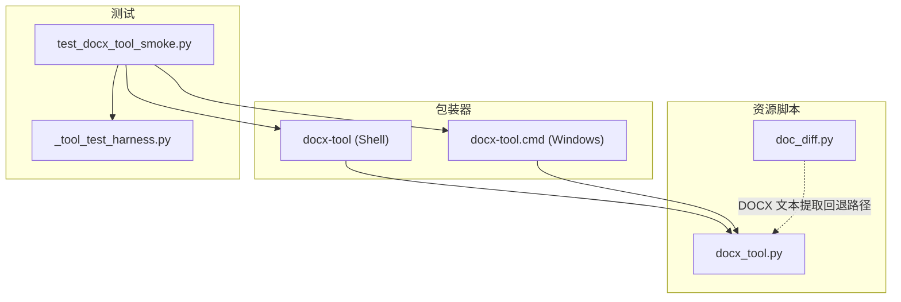
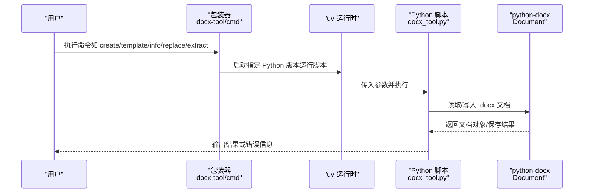
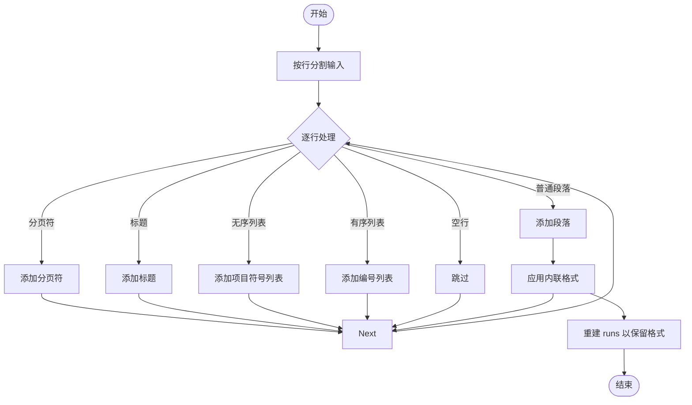
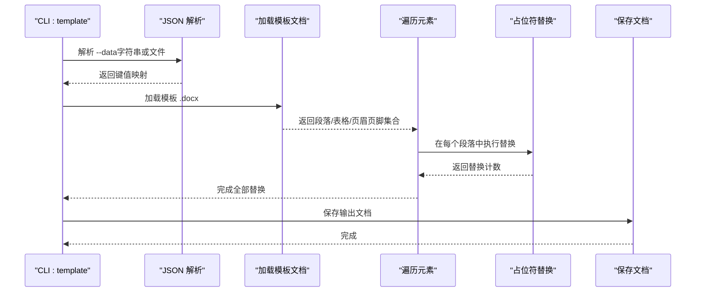
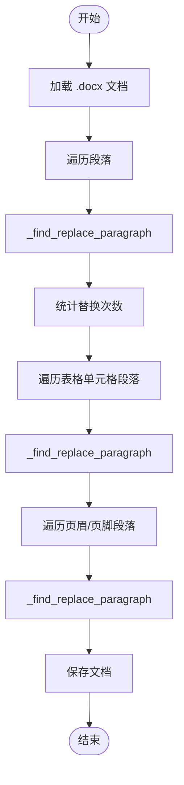
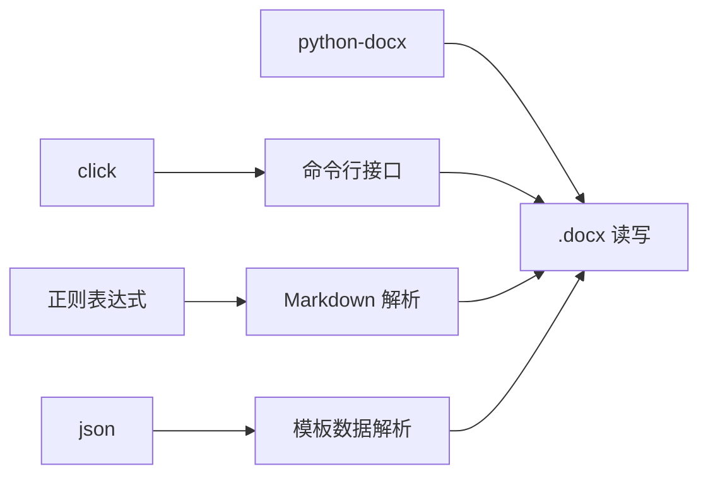

# DOCX 文档转换器

<cite>
**本文引用的文件**
- [docx_tool.py](file://apps/electron/resources/scripts/docx_tool.py)
- [docx-tool](file://apps/electron/resources/bin/docx-tool)
- [docx-tool.cmd](file://apps/electron/resources/bin/docx-tool.cmd)
- [test_docx_tool_smoke.py](file://apps/electron/resources/scripts/tests/test_docx_tool_smoke.py)
- [_tool_test_harness.py](file://apps/electron/resources/scripts/tests/_tool_test_harness.py)
- [doc_diff.py](file://apps/electron/resources/scripts/doc_diff.py)
- [system.ts](file://packages/shared/src/prompts/system.ts)
</cite>

## 目录
1. [简介](#简介)
2. [项目结构](#项目结构)
3. [核心组件](#核心组件)
4. [架构总览](#架构总览)
5. [详细组件分析](#详细组件分析)
6. [依赖关系分析](#依赖关系分析)
7. [性能考虑](#性能考虑)
8. [故障排查指南](#故障排查指南)
9. [结论](#结论)
10. [附录](#附录)

## 简介
本技术文档围绕基于 python-docx 的 DOCX 文档转换器展开，系统阐述以下能力与实现细节：
- 使用 python-docx 创建与编辑 Word 文档（.docx）
- Markdown 到 DOCX 的转换算法与格式映射
- 模板填充机制：在段落、表格、页眉页脚中进行占位符替换
- 文本查找替换功能：支持大小写敏感与不敏感模式
- 命令行接口设计、参数处理与错误处理策略
- 文档结构解析、样式应用、段落格式化、列表处理、页面分隔符等核心功能
- 性能优化技巧、内存管理与批量处理方案
- 自定义转换器开发指南、格式兼容性处理与转换质量保证方法

该工具作为 Electron 应用内置的 CLI 工具之一，通过包装脚本在不同平台启动，并由统一的测试夹具驱动端到端验证。

## 项目结构
本转换器位于 Electron 资源目录下，采用“脚本 + 包装器 + 测试”的组织方式：
- 脚本层：Python 实现的 docx_tool.py，提供 create、template、info、replace、extract 等子命令
- 包装层：跨平台可执行包装器（Unix Shell 与 Windows 批处理），用于调用 uv 运行时
- 测试层：单元测试与工具测试夹具，确保命令链路正确性与错误路径覆盖

图示来源
- [docx_tool.py:1-391](file://apps/electron/resources/scripts/docx_tool.py#L1-L391)
- [docx-tool:1-3](file://apps/electron/resources/bin/docx-tool#L1-L3)
- [docx-tool.cmd:1-3](file://apps/electron/resources/bin/docx-tool.cmd#L1-L3)
- [test_docx_tool_smoke.py:1-91](file://apps/electron/resources/scripts/tests/test_docx_tool_smoke.py#L1-L91)
- [_tool_test_harness.py:1-83](file://apps/electron/resources/scripts/tests/_tool_test_harness.py#L1-L83)
- [doc_diff.py:1-250](file://apps/electron/resources/scripts/doc_diff.py#L1-L250)

章节来源
- [docx_tool.py:1-391](file://apps/electron/resources/scripts/docx_tool.py#L1-L391)
- [docx-tool:1-3](file://apps/electron/resources/bin/docx-tool#L1-L3)
- [docx-tool.cmd:1-3](file://apps/electron/resources/bin/docx-tool.cmd#L1-L3)
- [test_docx_tool_smoke.py:1-91](file://apps/electron/resources/scripts/tests/test_docx_tool_smoke.py#L1-L91)
- [_tool_test_harness.py:1-83](file://apps/electron/resources/scripts/tests/_tool_test_harness.py#L1-L83)
- [doc_diff.py:1-250](file://apps/electron/resources/scripts/doc_diff.py#L1-L250)

## 核心组件
- 命令组与子命令
  - create：从文本或 Markdown 创建新文档，支持标题与字号设置
  - template：对模板文档进行占位符替换，覆盖段落、表格、页眉页脚
  - info：输出文档统计、样式、属性与模板占位符清单
  - replace：在段落、表格、页眉页脚中进行查找替换
  - extract：抽取纯文本内容，可选包含表格
- Markdown 转换器
  - 支持标题（h1-h6）、粗体、斜体、无序列表、有序列表、空行段落、分页符
- 模板填充
  - 单次遍历替换，避免嵌套替换导致的级联问题；保留段落内运行（runs）格式
- 查找替换
  - 支持大小写敏感与不敏感两种模式；重建 runs 以保持格式
- 文档信息提取
  - 统计段落数、表格数、节数、样式集合、字数、核心属性、模板占位符

章节来源
- [docx_tool.py:111-391](file://apps/electron/resources/scripts/docx_tool.py#L111-L391)

## 架构总览
整体架构由“包装器”触发 Python 脚本，脚本内部使用 click 定义命令行接口，底层通过 python-docx 读写 .docx 文件。测试夹具负责在不同平台上定位 uv 可执行文件与包装器，统一执行流程。

图示来源
- [docx-tool:1-3](file://apps/electron/resources/bin/docx-tool#L1-L3)
- [docx-tool.cmd:1-3](file://apps/electron/resources/bin/docx-tool.cmd#L1-L3)
- [docx_tool.py:18-391](file://apps/electron/resources/scripts/docx_tool.py#L18-L391)

## 详细组件分析

### 命令行接口与参数处理
- 命令组
  - 使用 click.group 定义主命令组，子命令通过 @cli.command 装饰器注册
- 参数规范
  - create：输入来源（--from-file 或 --text）、标题（--title）、字号（--font-size）、输出（-o）
  - template：模板文件（位置参数）、数据（--data，支持 JSON 字符串或 JSON 文件路径）、输出（-o）
  - info：目标文件（位置参数）、输出（-o）
  - replace：目标文件（位置参数）、查找词（--find）、替换词（--replace-with）、大小写选项（--case-sensitive/--no-case-sensitive）、输出（-o）
  - extract：目标文件（位置参数）、是否包含表格（--include-tables/--no-tables）、输出（-o）
- 错误处理
  - 子命令内部捕获异常并通过 click.echo 输出错误信息并退出非零码
  - JSON 解析失败时明确提示“JSON 解析错误”

章节来源
- [docx_tool.py:111-391](file://apps/electron/resources/scripts/docx_tool.py#L111-L391)

### Markdown 到 DOCX 转换算法
- 支持元素
  - 标题：匹配 # 至 ######，映射为相应标题级别
  - 列表：无序列表（- * + 开头）、有序列表（数字+点/括号开头）
  - 段落：空行作为段落分隔，普通文本作为段落
  - 分页符：连续三字符分隔线（如 ---、***、___）
  - 内联格式：支持 **粗体**、*斜体*、***粗斜体***，按正则拆分并逐个设置 run 的粗体/斜体属性
- 处理流程
  - 将输入按行扫描，识别类型后调用 Document.add_* 接口添加元素
  - 对段落内的内联格式，先清空默认 runs，再逐段落构建新的 runs 以保留格式

图示来源
- [docx_tool.py:32-109](file://apps/electron/resources/scripts/docx_tool.py#L32-L109)

章节来源
- [docx_tool.py:32-109](file://apps/electron/resources/scripts/docx_tool.py#L32-L109)

### 模板填充机制
- 数据来源
  - 支持 JSON 字符串或 JSON 文件路径，自动判断并解析
  - 非对象 JSON 将被拒绝
- 替换范围
  - 遍历所有段落、表格单元格中的段落、页眉页脚（非链接到前一节）中的段落
- 替换策略
  - 使用单次正则替换，避免替换值中再次出现占位符导致的二次替换
  - 若段落存在 runs，则清空多余 runs 并将完整替换后的文本写入首个 run，以保持原有格式

图示来源
- [docx_tool.py:157-206](file://apps/electron/resources/scripts/docx_tool.py#L157-L206)
- [docx_tool.py:209-231](file://apps/electron/resources/scripts/docx_tool.py#L209-L231)

章节来源
- [docx_tool.py:157-206](file://apps/electron/resources/scripts/docx_tool.py#L157-L206)
- [docx_tool.py:209-231](file://apps/electron/resources/scripts/docx_tool.py#L209-L231)

### 文本查找替换功能
- 覆盖范围
  - 段落、表格单元格中的段落、页眉页脚（非链接到前一节）中的段落
- 匹配策略
  - 大小写敏感：直接比较与替换
  - 大小写不敏感：编译忽略大小写正则进行替换
- 格式保持
  - 若段落存在 runs，清空多余 runs 并将替换后的完整文本写入首个 run

图示来源
- [docx_tool.py:289-351](file://apps/electron/resources/scripts/docx_tool.py#L289-L351)

章节来源
- [docx_tool.py:289-351](file://apps/electron/resources/scripts/docx_tool.py#L289-L351)

### 文档信息提取与统计
- 统计项
  - 段落数、表格数、节数、样式集合、字数
- 属性
  - 核心属性（标题、作者、主题、创建/修改时间、最后修改者、修订号）
- 模板占位符
  - 提取文档中所有 {{key}} 形式的占位符集合
- 输出
  - 以 JSON 格式输出，支持写入文件或标准输出

章节来源
- [docx_tool.py:233-286](file://apps/electron/resources/scripts/docx_tool.py#L233-L286)

### 文档结构解析与样式应用
- 结构解析
  - 通过 Document.paragraphs、Document.tables、Document.sections、Section.header/footer 访问文档结构
- 样式应用
  - 默认字体大小通过 Normal 样式设置
  - 标题样式映射到 Heading N
  - 列表样式映射到 List Bullet/List Number
- 段落格式化
  - 内联格式通过 runs 的 bold/italic 属性控制
- 列表处理
  - 无序列表与有序列表分别使用预置样式，保持项目符号/编号一致性
- 页面分隔符
  - 通过 add_page_break 添加分页符

章节来源
- [docx_tool.py:123-151](file://apps/electron/resources/scripts/docx_tool.py#L123-L151)
- [docx_tool.py:32-85](file://apps/electron/resources/scripts/docx_tool.py#L32-L85)

### 命令行包装器与跨平台执行
- 包装器
  - Unix：通过 shebang 调用 uv 运行时执行脚本
  - Windows：批处理脚本同样委托 uv 运行时
- 运行时选择
  - 优先使用打包在资源中的 uv，若不存在则回退到系统 PATH 中的 uv
- 环境变量
  - CRAFT_UV 指向 uv 可执行文件
  - CRAFT_SCRIPTS 指向脚本目录
  - PATH 中包含资源 bin 与 uv 所在目录

章节来源
- [docx-tool:1-3](file://apps/electron/resources/bin/docx-tool#L1-L3)
- [docx-tool.cmd:1-3](file://apps/electron/resources/bin/docx-tool.cmd#L1-L3)
- [_tool_test_harness.py:58-82](file://apps/electron/resources/scripts/tests/_tool_test_harness.py#L58-L82)

### 端到端测试与回归保障
- 测试场景
  - create → extract：验证创建与抽取流程
  - template：模板填充与抽取验证
  - replace：查找替换与抽取验证
  - JSON 解析错误：验证错误路径
- 测试夹具
  - 自动定位 uv 与包装器，构建环境并执行命令
  - 统一捕获返回码、标准输出与标准错误

章节来源
- [test_docx_tool_smoke.py:24-86](file://apps/electron/resources/scripts/tests/test_docx_tool_smoke.py#L24-L86)
- [_tool_test_harness.py:71-82](file://apps/electron/resources/scripts/tests/_tool_test_harness.py#L71-L82)

## 依赖关系分析
- 外部依赖
  - python-docx：核心 .docx 读写库
  - click：命令行接口定义与参数解析
- 内部依赖
  - 正则表达式：用于 Markdown 语法识别与模板/查找替换
  - JSON：用于模板数据解析
- 兼容性
  - DOCX 文本提取存在回退路径（doc_diff.py 中针对 .docx 的提取逻辑），体现对不同依赖的兼容策略

图示来源
- [docx_tool.py:18-391](file://apps/electron/resources/scripts/docx_tool.py#L18-L391)
- [doc_diff.py:1-250](file://apps/electron/resources/scripts/doc_diff.py#L1-L250)

章节来源
- [docx_tool.py:18-391](file://apps/electron/resources/scripts/docx_tool.py#L18-L391)
- [doc_diff.py:1-250](file://apps/electron/resources/scripts/doc_diff.py#L1-L250)

## 性能考虑
- 内存管理
  - 采用一次性加载文档、逐元素处理的方式，避免重复构建大对象
  - 在替换过程中仅重建必要的 runs，减少对象分配
- I/O 优化
  - 批量处理时建议复用同一 Document 对象，减少文件打开/关闭次数
  - 输出阶段统一保存一次，避免频繁写盘
- 正则与字符串操作
  - 模板与查找替换使用单次正则替换，避免多次迭代
  - 大小写不敏感时使用预编译正则，降低重复编译开销
- 并发与批处理
  - 建议在外部调度器中并发执行多个独立任务，但每个任务内部仍遵循单文档单进程的处理模型
- 大文档处理
  - 对超大文档，优先使用流式读取与增量写入策略（当前实现为一次性加载，建议在上层进行分片或拆分）

[本节为通用性能指导，无需特定文件引用]

## 故障排查指南
- 常见错误与定位
  - JSON 解析失败：检查 --data 是否为合法 JSON 对象
  - 输入缺失：create 必须提供 --from-file 或 --text
  - 模板占位符未替换：确认占位符格式为 {{key}}，且 key 与 JSON 键一致
  - 查找替换无效：确认大小写选项与目标文本一致
- 日志与输出
  - 所有错误通过 click.echo 输出到标准错误，返回非零码
  - 成功信息通过标准输出或标准错误输出，便于管道重定向
- 环境问题
  - uv 未找到：检查 CRAFT_UV 与 PATH 设置，确认资源 bin 与 uv 可执行文件可用
- 回归验证
  - 使用测试夹具与 smoke 测试快速验证命令链路

章节来源
- [docx_tool.py:129-131](file://apps/electron/resources/scripts/docx_tool.py#L129-L131)
- [docx_tool.py:201-203](file://apps/electron/resources/scripts/docx_tool.py#L201-L203)
- [test_docx_tool_smoke.py:78-86](file://apps/electron/resources/scripts/tests/test_docx_tool_smoke.py#L78-L86)
- [_tool_test_harness.py:58-82](file://apps/electron/resources/scripts/tests/_tool_test_harness.py#L58-L82)

## 结论
本 DOCX 文档转换器以简洁的命令行接口与稳定的 Python 实现，提供了从 Markdown 创建、模板填充、信息提取到查找替换的完整能力。通过正则与 python-docx 的组合，实现了对常见格式的良好支持；借助包装器与测试夹具，确保了跨平台的一致性与可维护性。对于更高性能与复杂场景，可在上层引入批处理与分片策略，在保持格式一致性的前提下进一步提升吞吐。

[本节为总结性内容，无需特定文件引用]

## 附录

### 命令速查与示例路径
- 创建文档：[create 命令实现:117-154](file://apps/electron/resources/scripts/docx_tool.py#L117-L154)
- 模板填充：[template 命令实现:157-206](file://apps/electron/resources/scripts/docx_tool.py#L157-L206)
- 文档信息：[info 命令实现:233-286](file://apps/electron/resources/scripts/docx_tool.py#L233-L286)
- 查找替换：[replace 命令实现:289-351](file://apps/electron/resources/scripts/docx_tool.py#L289-L351)
- 抽取文本：[extract 命令实现:354-386](file://apps/electron/resources/scripts/docx_tool.py#L354-L386)

### 跨平台包装器
- Unix 包装器：[docx-tool:1-3](file://apps/electron/resources/bin/docx-tool#L1-L3)
- Windows 包装器：[docx-tool.cmd:1-3](file://apps/electron/resources/bin/docx-tool.cmd#L1-L3)
- 运行时解析与环境构建：[_tool_test_harness.py:58-82](file://apps/electron/resources/scripts/tests/_tool_test_harness.py#L58-L82)

### 工具集成参考
- 系统提示中对 docx-tool 的使用说明与示例：[system.ts:1061-1078](file://packages/shared/src/prompts/system.ts#L1061-L1078)