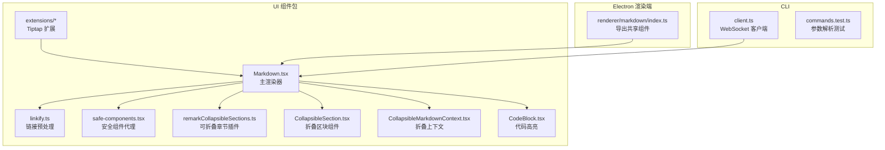
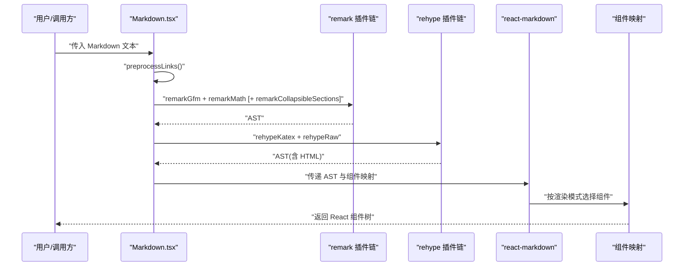
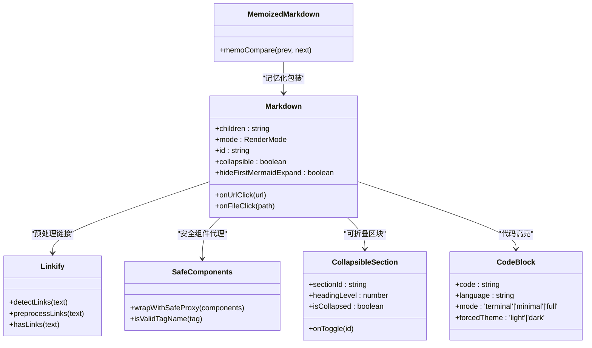
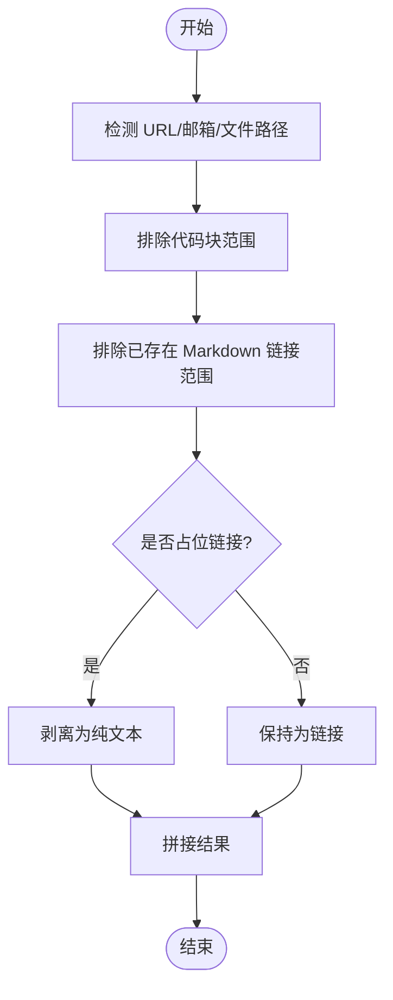
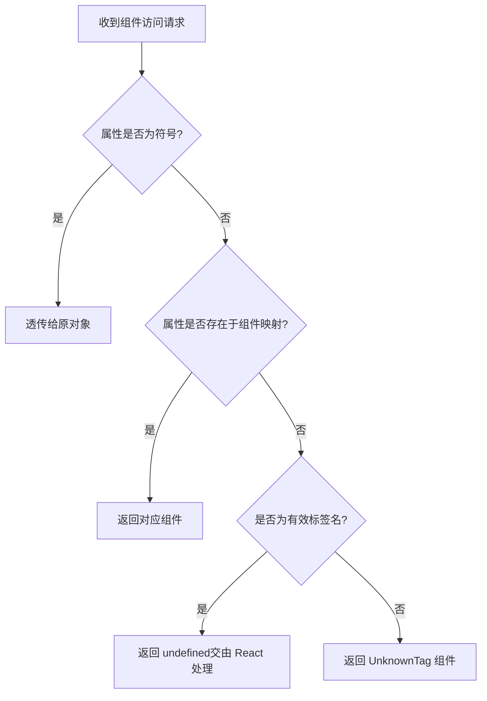
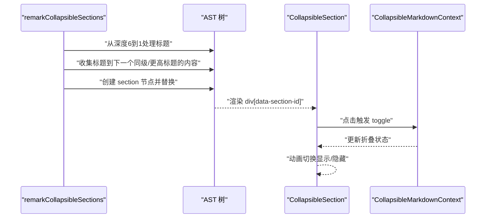
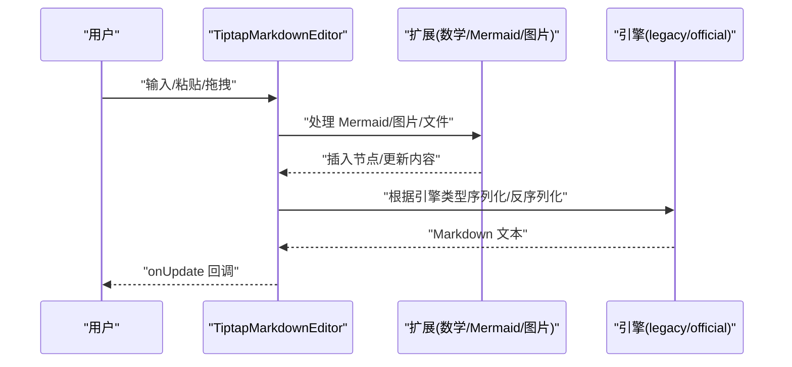
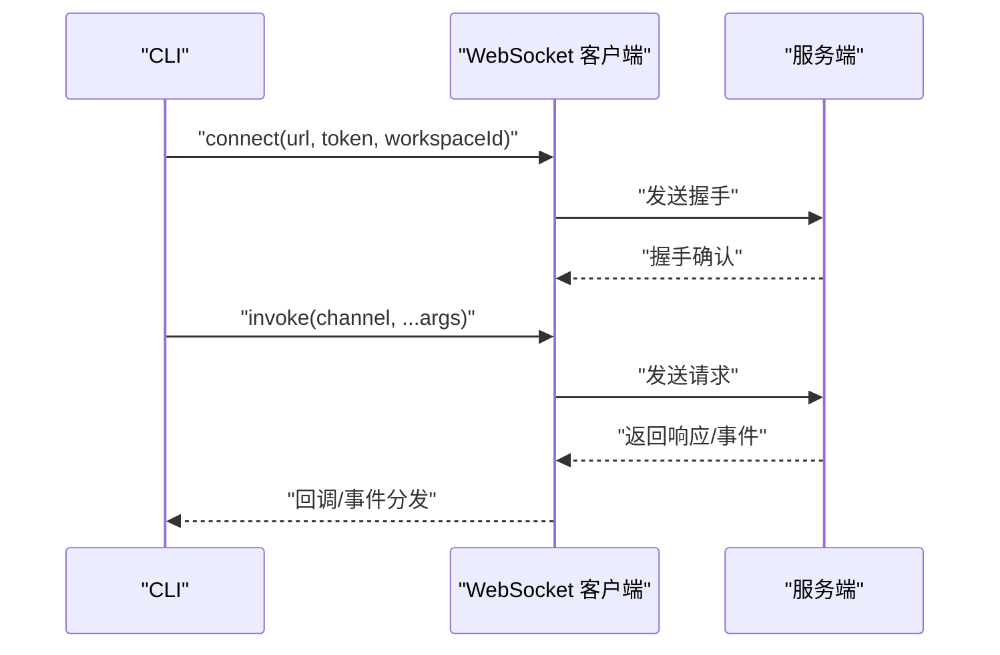
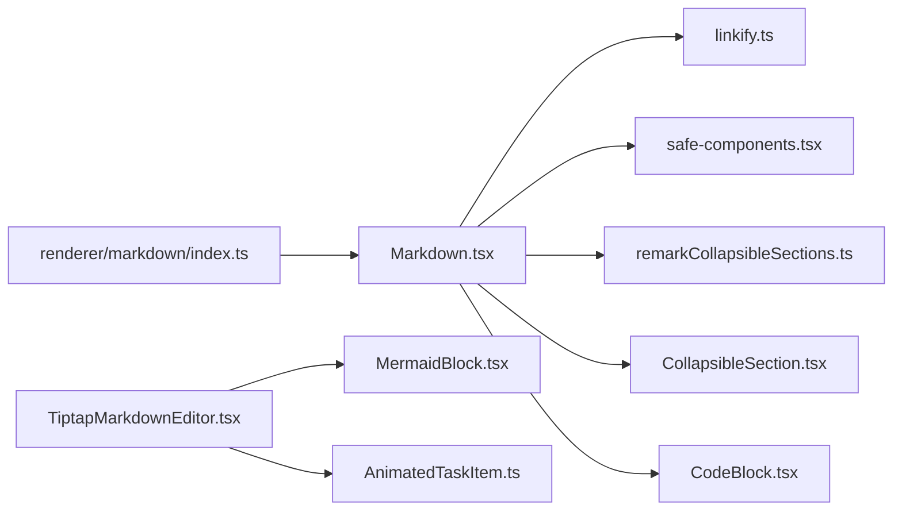

# Markdown 转换器

<cite>
**本文引用的文件**
- [packages/ui/src/components/markdown/index.ts](file://packages/ui/src/components/markdown/index.ts)
- [packages/ui/src/components/markdown/Markdown.tsx](file://packages/ui/src/components/markdown/Markdown.tsx)
- [packages/ui/src/components/markdown/linkify.ts](file://packages/ui/src/components/markdown/linkify.ts)
- [packages/ui/src/components/markdown/safe-components.tsx](file://packages/ui/src/components/markdown/safe-components.tsx)
- [packages/ui/src/components/markdown/remarkCollapsibleSections.ts](file://packages/ui/src/components/markdown/remarkCollapsibleSections.ts)
- [packages/ui/src/components/markdown/CollapsibleSection.tsx](file://packages/ui/src/components/markdown/CollapsibleSection.tsx)
- [packages/ui/src/components/markdown/CollapsibleMarkdownContext.tsx](file://packages/ui/src/components/markdown/CollapsibleMarkdownContext.tsx)
- [packages/ui/src/components/markdown/CodeBlock.tsx](file://packages/ui/src/components/markdown/CodeBlock.tsx)
- [packages/ui/src/components/markdown/extensions/AnimatedTaskItem.ts](file://packages/ui/src/components/markdown/extensions/AnimatedTaskItem.ts)
- [packages/ui/src/components/markdown/extensions/MermaidBlock.tsx](file://packages/ui/src/components/markdown/extensions/MermaidBlock.tsx)
- [packages/ui/src/components/markdown/TiptapMarkdownEditor.tsx](file://packages/ui/src/components/markdown/TiptapMarkdownEditor.tsx)
- [apps/cli/src/client.ts](file://apps/cli/src/client.ts)
- [apps/cli/src/commands.test.ts](file://apps/cli/src/commands.test.ts)
- [apps/electron/src/renderer/components/markdown/index.ts](file://apps/electron/src/renderer/components/markdown/index.ts)
</cite>

## 目录
1. [简介](#简介)
2. [项目结构](#项目结构)
3. [核心组件](#核心组件)
4. [架构总览](#架构总览)
5. [详细组件分析](#详细组件分析)
6. [依赖关系分析](#依赖关系分析)
7. [性能考量](#性能考量)
8. [故障排查指南](#故障排查指南)
9. [结论](#结论)
10. [附录](#附录)

## 简介
本文件为 Markdown 转换器的技术文档，聚焦于以下方面：
- Markdown 解析算法与语法树构建：基于 remark/remark-math、GFM 插件与自定义插件（可折叠章节）。
- HTML 转换机制：通过 react-markdown 与 rehype/raw、rehype-katex，结合安全组件代理。
- 样式映射与渲染模式：提供 terminal/minimal/full 三种渲染模式，支持代码高亮、数学公式、Mermaid 图表、表格、任务列表等。
- 命令行接口设计：参数解析、连接与调用流程、输出格式控制。
- 特殊标记与编辑器能力：链接预处理、未知标签安全回退、可折叠标题、Tiptap 编辑器（官方/传统引擎）、Mermaid/LaTeX/图片/文件拖拽插入等。
- 性能优化与内存管理：缓存、懒加载、流式渲染、最小化重渲染。
- 自定义转换器开发指南：扩展点、兼容性与质量保障。

## 项目结构
该转换器主要分布在 UI 组件包与 Electron 渲染端，CLI 提供命令行入口与参数解析。

**图表来源**
- [packages/ui/src/components/markdown/Markdown.tsx:504-568](file://packages/ui/src/components/markdown/Markdown.tsx#L504-L568)
- [packages/ui/src/components/markdown/linkify.ts:228-268](file://packages/ui/src/components/markdown/linkify.ts#L228-L268)
- [packages/ui/src/components/markdown/safe-components.tsx:76-112](file://packages/ui/src/components/markdown/safe-components.tsx#L76-L112)
- [packages/ui/src/components/markdown/remarkCollapsibleSections.ts:43-54](file://packages/ui/src/components/markdown/remarkCollapsibleSections.ts#L43-L54)
- [packages/ui/src/components/markdown/CollapsibleSection.tsx:44-104](file://packages/ui/src/components/markdown/CollapsibleSection.tsx#L44-L104)
- [packages/ui/src/components/markdown/CollapsibleMarkdownContext.tsx:32-61](file://packages/ui/src/components/markdown/CollapsibleMarkdownContext.tsx#L32-L61)
- [packages/ui/src/components/markdown/CodeBlock.tsx:64-235](file://packages/ui/src/components/markdown/CodeBlock.tsx#L64-L235)
- [packages/ui/src/components/markdown/extensions/MermaidBlock.tsx:8-79](file://packages/ui/src/components/markdown/extensions/MermaidBlock.tsx#L8-L79)
- [apps/electron/src/renderer/components/markdown/index.ts:1-6](file://apps/electron/src/renderer/components/markdown/index.ts#L1-L6)
- [apps/cli/src/client.ts:38-240](file://apps/cli/src/client.ts#L38-L240)
- [apps/cli/src/commands.test.ts:8-233](file://apps/cli/src/commands.test.ts#L8-L233)

**章节来源**
- [packages/ui/src/components/markdown/index.ts:1-15](file://packages/ui/src/components/markdown/index.ts#L1-L15)
- [apps/electron/src/renderer/components/markdown/index.ts:1-6](file://apps/electron/src/renderer/components/markdown/index.ts#L1-L6)

## 核心组件
- Markdown 主渲染器：负责解析 Markdown、应用 remark/rehype 插件、生成 React 组件树，并根据渲染模式输出不同风格的 HTML。
- 链接预处理：识别 URL、邮箱与本地文件路径，避免在代码块与已有链接中误判，支持占位链接剥离。
- 安全组件代理：对未知/非法标签进行兜底处理，防止 React 渲染崩溃。
- 可折叠章节：将标题与其内容包裹为可折叠区块，支持多级嵌套。
- 代码高亮：基于 Shiki 的语言检测与缓存，支持多种渲染模式。
- Tiptap 编辑器：提供富文本编辑体验，支持官方/传统两种 Markdown 引擎、数学公式、Mermaid、LaTeX、图片与文件拖拽插入。
- CLI 客户端：封装 WebSocket RPC 客户端，用于命令行工具与服务端通信。

**章节来源**
- [packages/ui/src/components/markdown/Markdown.tsx:27-74](file://packages/ui/src/components/markdown/Markdown.tsx#L27-L74)
- [packages/ui/src/components/markdown/linkify.ts:123-183](file://packages/ui/src/components/markdown/linkify.ts#L123-L183)
- [packages/ui/src/components/markdown/safe-components.tsx:40-42](file://packages/ui/src/components/markdown/safe-components.tsx#L40-L42)
- [packages/ui/src/components/markdown/remarkCollapsibleSections.ts:20-32](file://packages/ui/src/components/markdown/remarkCollapsibleSections.ts#L20-L32)
- [packages/ui/src/components/markdown/CodeBlock.tsx:64-140](file://packages/ui/src/components/markdown/CodeBlock.tsx#L64-L140)
- [packages/ui/src/components/markdown/TiptapMarkdownEditor.tsx:214-406](file://packages/ui/src/components/markdown/TiptapMarkdownEditor.tsx#L214-L406)
- [apps/cli/src/client.ts:38-191](file://apps/cli/src/client.ts#L38-L191)

## 架构总览
Markdown 转换器采用“解析-插件-渲染”的分层架构：
- 解析层：remark（GFM、数学、可折叠章节），retext（可选）。
- 插件层：链接预处理、安全组件代理、KaTeX、raw HTML。
- 渲染层：react-markdown 将 AST 转为 React 组件；Tiptap 编辑器将 Markdown/AST 映射到可编辑视图。

**图表来源**
- [packages/ui/src/components/markdown/Markdown.tsx:530-567](file://packages/ui/src/components/markdown/Markdown.tsx#L530-L567)
- [packages/ui/src/components/markdown/linkify.ts:228-268](file://packages/ui/src/components/markdown/linkify.ts#L228-L268)

## 详细组件分析

### Markdown 主渲染器（Markdown.tsx）
- 渲染模式：
  - terminal：极简，保留控制字符，适合日志与调试。
  - minimal：干净高亮，适合聊天与内联内容。
  - full：富排版，适合长文档。
- 关键特性：
  - 链接预处理：自动将 URL/邮箱/文件路径转为 Markdown 链接，跳过代码块与已存在链接。
  - 安全组件代理：对未知标签使用兜底组件，避免渲染异常。
  - 可折叠章节：通过 remark 插件将标题与其内容包裹为 section 节点，再由 CollapsibleSection 渲染。
  - 数学公式：remark-math + KaTeX，支持行间与行内公式。
  - 代码高亮：CodeBlock 使用 Shiki，支持缓存与主题切换。
  - 组件映射：根据节点类型与渲染模式动态生成组件，支持 Mermaid、LaTeX、PDF、HTML 预览、数据表等扩展块。
  - 流式渲染优化：MemoizedMarkdown 基于消息 ID 或内容比较，减少重渲染。

**图表来源**
- [packages/ui/src/components/markdown/Markdown.tsx:41-74](file://packages/ui/src/components/markdown/Markdown.tsx#L41-L74)
- [packages/ui/src/components/markdown/Markdown.tsx:504-599](file://packages/ui/src/components/markdown/Markdown.tsx#L504-L599)
- [packages/ui/src/components/markdown/linkify.ts:123-183](file://packages/ui/src/components/markdown/linkify.ts#L123-L183)
- [packages/ui/src/components/markdown/safe-components.tsx:76-112](file://packages/ui/src/components/markdown/safe-components.tsx#L76-L112)
- [packages/ui/src/components/markdown/CollapsibleSection.tsx:27-50](file://packages/ui/src/components/markdown/CollapsibleSection.tsx#L27-L50)
- [packages/ui/src/components/markdown/CodeBlock.tsx:64-235](file://packages/ui/src/components/markdown/CodeBlock.tsx#L64-L235)

**章节来源**
- [packages/ui/src/components/markdown/Markdown.tsx:27-74](file://packages/ui/src/components/markdown/Markdown.tsx#L27-L74)
- [packages/ui/src/components/markdown/Markdown.tsx:504-599](file://packages/ui/src/components/markdown/Markdown.tsx#L504-L599)

### 链接预处理（linkify.ts）
- 算法要点：
  - 使用 linkify-it 检测 URL/邮箱；自定义正则检测本地文件路径。
  - 排除代码块与已存在 Markdown 链接范围，避免误判。
  - 支持占位链接剥离（如 AI 生成的 `/...` 链接），还原为纯文本。
  - 提供快速检测函数 hasLinks，用于跳过不必要的预处理。
- 复杂度：
  - 时间复杂度近似 O(n)，其中 n 为文本长度；空间复杂度 O(k)，k 为匹配数量。

**图表来源**
- [packages/ui/src/components/markdown/linkify.ts:228-268](file://packages/ui/src/components/markdown/linkify.ts#L228-L268)

**章节来源**
- [packages/ui/src/components/markdown/linkify.ts:123-183](file://packages/ui/src/components/markdown/linkify.ts#L123-L183)
- [packages/ui/src/components/markdown/linkify.ts:228-268](file://packages/ui/src/components/markdown/linkify.ts#L228-L268)

### 安全组件代理（safe-components.tsx）
- 设计目标：当用户输入类似 HTML 的内容（如 `<sq+qr>`）时，避免被 rehype-raw 当作真实标签解析导致 React 崩溃。
- 实现方式：通过 Proxy 包装组件映射，拦截未知/非法标签名，统一使用 UnknownTag 组件渲染为普通文本。
- 标签合法性判定：仅允许小写 HTML 标签名或大写 PascalCase React 组件名。

**图表来源**
- [packages/ui/src/components/markdown/safe-components.tsx:76-112](file://packages/ui/src/components/markdown/safe-components.tsx#L76-L112)

**章节来源**
- [packages/ui/src/components/markdown/safe-components.tsx:19-42](file://packages/ui/src/components/markdown/safe-components.tsx#L19-L42)

### 可折叠章节（remarkCollapsibleSections.ts 与 CollapsibleSection.tsx）
- AST 层：remark 插件从深到浅遍历标题节点，收集同级或更高层级标题之间的内容，包裹为自定义 section 节点。
- 渲染层：CollapsibleSection 以动画方式展开/收起内容，仅对 H1-H4 生效。
- 上下文：CollapsibleMarkdownContext 提供折叠状态与切换逻辑。

**图表来源**
- [packages/ui/src/components/markdown/remarkCollapsibleSections.ts:43-54](file://packages/ui/src/components/markdown/remarkCollapsibleSections.ts#L43-L54)
- [packages/ui/src/components/markdown/CollapsibleSection.tsx:44-104](file://packages/ui/src/components/markdown/CollapsibleSection.tsx#L44-L104)
- [packages/ui/src/components/markdown/CollapsibleMarkdownContext.tsx:32-61](file://packages/ui/src/components/markdown/CollapsibleMarkdownContext.tsx#L32-L61)

**章节来源**
- [packages/ui/src/components/markdown/remarkCollapsibleSections.ts:56-127](file://packages/ui/src/components/markdown/remarkCollapsibleSections.ts#L56-L127)
- [packages/ui/src/components/markdown/CollapsibleSection.tsx:27-50](file://packages/ui/src/components/markdown/CollapsibleSection.tsx#L27-L50)
- [packages/ui/src/components/markdown/CollapsibleMarkdownContext.tsx:12-20](file://packages/ui/src/components/markdown/CollapsibleMarkdownContext.tsx#L12-L20)

### 代码高亮（CodeBlock.tsx）
- 语言解析：支持别名映射与 Shiki 内置语言集合；无效语言回退为纯文本。
- 主题选择：优先使用 ShikiThemeContext，其次 forcedTheme，最后基于系统类名检测。
- 缓存策略：LRU 缓存高亮结果，容量上限 200；首次加载异步渲染，失败回退。
- 渲染模式：
  - terminal：仅等宽字体与换行。
  - minimal：直接注入 HTML，无额外装饰。
  - full：带语言标签与复制按钮的容器。

**章节来源**
- [packages/ui/src/components/markdown/CodeBlock.tsx:45-140](file://packages/ui/src/components/markdown/CodeBlock.tsx#L45-L140)
- [packages/ui/src/components/markdown/CodeBlock.tsx:152-219](file://packages/ui/src/components/markdown/CodeBlock.tsx#L152-L219)

### Tiptap 编辑器（TiptapMarkdownEditor.tsx）
- 引擎选择：legacy（tiptap-markdown）与 official（@tiptap/markdown + mathematics）双引擎，通过 markdownEngine 参数切换。
- 预处理/后处理：官方引擎启用时，对 $$...$$ 与货币符号进行占位与还原，避免误识别为数学节点。
- 扩展能力：Mermaid、LaTeX、图片、文件拖拽、富区块交互、斜杠菜单、任务列表动画等。
- 同步策略：内容变更回调中根据引擎类型获取 Markdown；支持受控/非受控同步与焦点保护，避免瞬态状态丢失。

**图表来源**
- [packages/ui/src/components/markdown/TiptapMarkdownEditor.tsx:196-212](file://packages/ui/src/components/markdown/TiptapMarkdownEditor.tsx#L196-L212)
- [packages/ui/src/components/markdown/TiptapMarkdownEditor.tsx:301-353](file://packages/ui/src/components/markdown/TiptapMarkdownEditor.tsx#L301-L353)
- [packages/ui/src/components/markdown/extensions/MermaidBlock.tsx:8-79](file://packages/ui/src/components/markdown/extensions/MermaidBlock.tsx#L8-L79)

**章节来源**
- [packages/ui/src/components/markdown/TiptapMarkdownEditor.tsx:69-98](file://packages/ui/src/components/markdown/TiptapMarkdownEditor.tsx#L69-L98)
- [packages/ui/src/components/markdown/TiptapMarkdownEditor.tsx:175-194](file://packages/ui/src/components/markdown/TiptapMarkdownEditor.tsx#L175-L194)
- [packages/ui/src/components/markdown/TiptapMarkdownEditor.tsx:214-406](file://packages/ui/src/components/markdown/TiptapMarkdownEditor.tsx#L214-L406)

### 命令行接口（CLI）
- 参数解析：支持 --url、--token、--workspace、--timeout、--json、--tls-ca、--send-timeout、--output-format、--no-cleanup、--server-entry、--workspace-dir、--provider 等。
- 连接与调用：通过 WebSocket RPC 客户端建立握手，发送请求并等待响应；支持订阅事件通道。
- 输出格式控制：通过 --output-format 控制输出格式（如 text/stream-json），配合 --json 控制 JSON 输出。

**图表来源**
- [apps/cli/src/client.ts:61-129](file://apps/cli/src/client.ts#L61-L129)
- [apps/cli/src/client.ts:132-154](file://apps/cli/src/client.ts#L132-L154)
- [apps/cli/src/client.ts:196-238](file://apps/cli/src/client.ts#L196-L238)

**章节来源**
- [apps/cli/src/commands.test.ts:8-233](file://apps/cli/src/commands.test.ts#L8-L233)
- [apps/cli/src/client.ts:38-191](file://apps/cli/src/client.ts#L38-L191)

## 依赖关系分析
- Markdown.tsx 依赖 linkify.ts、safe-components.tsx、remarkCollapsibleSections.ts、CollapsibleSection.tsx、CodeBlock.tsx。
- TiptapMarkdownEditor.tsx 依赖 @tiptap/*、katex、MermaidBlock.tsx、AnimatedTaskItem.ts 等。
- Electron 渲染端通过本地 index.ts 重新导出 UI 组件，便于上层应用统一导入。

**图表来源**
- [packages/ui/src/components/markdown/Markdown.tsx:1-26](file://packages/ui/src/components/markdown/Markdown.tsx#L1-L26)
- [packages/ui/src/components/markdown/TiptapMarkdownEditor.tsx:1-23](file://packages/ui/src/components/markdown/TiptapMarkdownEditor.tsx#L1-L23)
- [apps/electron/src/renderer/components/markdown/index.ts:1-6](file://apps/electron/src/renderer/components/markdown/index.ts#L1-L6)

**章节来源**
- [packages/ui/src/components/markdown/index.ts:1-15](file://packages/ui/src/components/markdown/index.ts#L1-L15)

## 性能考量
- 代码高亮缓存：LRU 缓存高亮结果，命中直接渲染，避免重复计算。
- 懒加载与主题检测：首次渲染异步执行，失败回退；主题优先级明确，减少无效重绘。
- 流式渲染优化：MemoizedMarkdown 基于消息 ID 或内容比较，仅增量更新。
- 链接预处理短路：hasLinks 快速判断，避免不必要的正则扫描。
- DOM 操作最小化：CollapsibleSection 使用动画框架，仅切换高度与透明度。
- 编辑器同步保护：受控内容更新时避免 setContent 导致的选择跳变与瞬态状态丢失。

[本节为通用性能建议，不直接分析具体文件]

## 故障排查指南
- 渲染崩溃或标签异常：
  - 确认使用了安全组件代理；检查未知标签是否被兜底。
  - 参考：[packages/ui/src/components/markdown/safe-components.tsx:76-112](file://packages/ui/src/components/markdown/safe-components.tsx#L76-L112)
- 链接未正确识别或误识别：
  - 检查是否位于代码块或已有链接范围内；确认占位链接是否被剥离。
  - 参考：[packages/ui/src/components/markdown/linkify.ts:228-268](file://packages/ui/src/components/markdown/linkify.ts#L228-L268)
- 折叠功能无效：
  - 确保包裹在 CollapsibleMarkdownProvider 下；检查 headingLevel 是否在 H1-H4。
  - 参考：[packages/ui/src/components/markdown/CollapsibleMarkdownContext.tsx:32-61](file://packages/ui/src/components/markdown/CollapsibleMarkdownContext.tsx#L32-L61)
- 编辑器数学公式显示异常：
  - 切换引擎（legacy/official）并检查预处理/后处理逻辑。
  - 参考：[packages/ui/src/components/markdown/TiptapMarkdownEditor.tsx:69-98](file://packages/ui/src/components/markdown/TiptapMarkdownEditor.tsx#L69-L98)
- CLI 连接失败或超时：
  - 检查 --url、--token、--workspace 与 --timeout 设置；查看握手阶段错误。
  - 参考：[apps/cli/src/client.ts:61-129](file://apps/cli/src/client.ts#L61-L129)

**章节来源**
- [packages/ui/src/components/markdown/safe-components.tsx:76-112](file://packages/ui/src/components/markdown/safe-components.tsx#L76-L112)
- [packages/ui/src/components/markdown/linkify.ts:228-268](file://packages/ui/src/components/markdown/linkify.ts#L228-L268)
- [packages/ui/src/components/markdown/CollapsibleMarkdownContext.tsx:32-61](file://packages/ui/src/components/markdown/CollapsibleMarkdownContext.tsx#L32-L61)
- [packages/ui/src/components/markdown/TiptapMarkdownEditor.tsx:69-98](file://packages/ui/src/components/markdown/TiptapMarkdownEditor.tsx#L69-L98)
- [apps/cli/src/client.ts:61-129](file://apps/cli/src/client.ts#L61-L129)

## 结论
该 Markdown 转换器通过模块化的解析、插件与渲染层，提供了从基础文本到富媒体内容的完整转换链路。其核心优势包括：
- 稳健的链接识别与安全渲染；
- 可折叠章节与多模式渲染；
- 高性能代码高亮与流式渲染优化；
- 可扩展的编辑器与 CLI 工具链。

对于需要处理复杂 Markdown 文档或集成 Markdown 功能的开发者，建议优先采用 MemoizedMarkdown 与 CodeBlock 的组合，并在 Electron/CLI 场景中充分利用安全组件代理与参数解析能力。

[本节为总结性内容，不直接分析具体文件]

## 附录
- 自定义转换器开发建议：
  - 在 Markdown.tsx 中扩展组件映射，新增节点类型时确保安全代理覆盖。
  - 如需自定义 remark 插件，参考 remarkCollapsibleSections 的实现模式。
  - 对于编辑器扩展，遵循 Tiptap 的 Node/Extension 模式，注意与官方/传统引擎的差异。
- 兼容性与质量保证：
  - 使用 hasLinks 与 preprocessLinks 的组合，确保链接识别稳定。
  - 在 CLI 侧完善参数解析测试，覆盖默认值与环境变量场景。
  - 对于大文档，优先使用 full 模式下的缓存与懒加载策略。

[本节为通用指导，不直接分析具体文件]