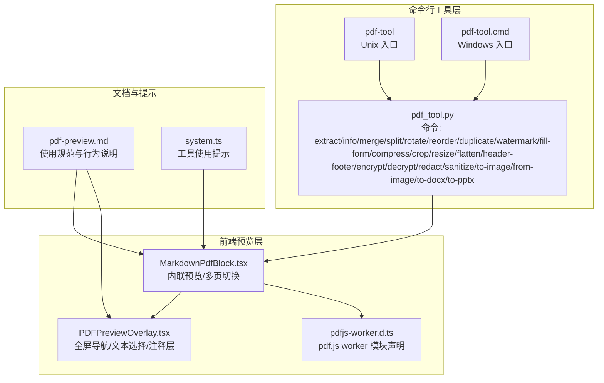
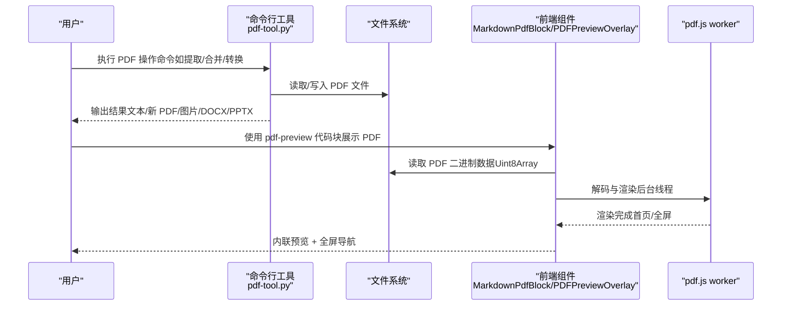
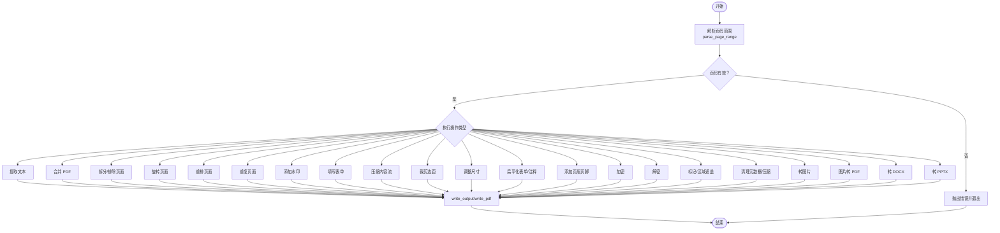
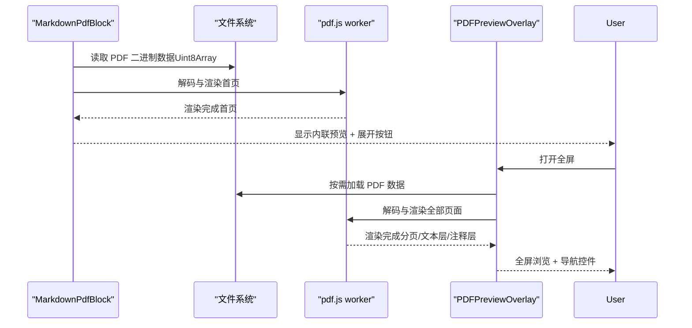
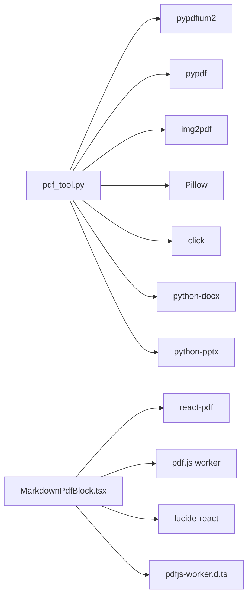

# PDF 文档转换器

<cite>
**本文引用的文件**
- [pdf_tool.py](file://apps/electron/resources/scripts/pdf_tool.py)
- [pdf-preview.md](file://apps/electron/resources/docs/pdf-preview.md)
- [MarkdownPdfBlock.tsx](file://packages/ui/src/components/markdown/MarkdownPdfBlock.tsx)
- [PDFPreviewOverlay.tsx](file://packages/ui/src/components/overlay/PDFPreviewOverlay.tsx)
- [pdfjs-worker.d.ts](file://packages/ui/src/pdfjs-worker.d.ts)
- [pdf-tool](file://apps/electron/resources/bin/pdf-tool)
- [pdf-tool.cmd](file://apps/electron/resources/bin/pdf-tool.cmd)
- [test_pdf_tool_smoke.py](file://apps/electron/resources/scripts/tests/test_pdf_tool_smoke.py)
- [system.ts](file://packages/shared/src/prompts/system.ts)
</cite>

## 目录
1. [简介](#简介)
2. [项目结构](#项目结构)
3. [核心组件](#核心组件)
4. [架构总览](#架构总览)
5. [详细组件分析](#详细组件分析)
6. [依赖关系分析](#依赖关系分析)
7. [性能考虑](#性能考虑)
8. [故障排除指南](#故障排除指南)
9. [结论](#结论)
10. [附录](#附录)

## 简介
本技术文档围绕仓库中的 PDF 文档转换与预览能力，系统阐述以下方面：
- PDF 处理库的使用方式与命令行工具设计
- 文档解析算法、文本提取机制、页面操作功能
- 命令行接口设计、参数验证、输出格式控制
- PDF 结构分析、内容提取、元数据读取、页面渲染
- 性能优化策略、内存管理、大文件处理技巧
- 自定义转换器开发指南、格式兼容性处理、转换质量保证方法

该能力覆盖从 Electron 资源脚本（Python）到前端 UI 预览组件的完整链路，既支持本地命令行批量处理，也支持在应用内进行 PDF 的可视化预览与交互。

## 项目结构
围绕 PDF 的关键目录与文件如下：
- 命令行工具：apps/electron/resources/scripts/pdf_tool.py 提供丰富的 PDF 操作命令（提取、合并、拆分、旋转、重排、水印、压缩、裁剪、缩放、扁平化、页眉页脚、加密解密、标记、净化、转图片、转 DOCX、转 PPTX 等）
- 命令入口：apps/electron/resources/bin/pdf-tool 与 pdf-tool.cmd 用于在不同平台调用上述 Python 工具
- 前端预览：packages/ui/src/components/markdown/MarkdownPdfBlock.tsx 与 packages/ui/src/components/overlay/PDFPreviewOverlay.tsx 实现 PDF 的内联预览与全屏导航
- 文档规范：apps/electron/resources/docs/pdf-preview.md 定义了 pdf-preview 代码块的使用方式与行为
- 类型声明：packages/ui/src/pdfjs-worker.d.ts 为 pdf.js worker 提供模块声明
- 测试：apps/electron/resources/scripts/tests/test_pdf_tool_smoke.py 对工具进行健壮性测试
- 提示系统：packages/shared/src/prompts/system.ts 中包含对 pdf-tool 的使用提示

**图表来源**
- [pdf_tool.py:13-1322](file://apps/electron/resources/scripts/pdf_tool.py#L13-L1322)
- [pdf-tool:1-3](file://apps/electron/resources/bin/pdf-tool#L1-L3)
- [pdf-tool.cmd:1-3](file://apps/electron/resources/bin/pdf-tool.cmd#L1-L3)
- [MarkdownPdfBlock.tsx:1-252](file://packages/ui/src/components/markdown/MarkdownPdfBlock.tsx#L1-L252)
- [PDFPreviewOverlay.tsx:1-165](file://packages/ui/src/components/overlay/PDFPreviewOverlay.tsx#L1-L165)
- [pdfjs-worker.d.ts:1-5](file://packages/ui/src/pdfjs-worker.d.ts#L1-L5)
- [pdf-preview.md:1-224](file://apps/electron/resources/docs/pdf-preview.md#L1-L224)
- [system.ts:1032-1070](file://packages/shared/src/prompts/system.ts#L1032-L1070)

**章节来源**
- [pdf_tool.py:13-1322](file://apps/electron/resources/scripts/pdf_tool.py#L13-L1322)
- [pdf-preview.md:1-224](file://apps/electron/resources/docs/pdf-preview.md#L1-L224)
- [MarkdownPdfBlock.tsx:1-252](file://packages/ui/src/components/markdown/MarkdownPdfBlock.tsx#L1-L252)
- [PDFPreviewOverlay.tsx:1-165](file://packages/ui/src/components/overlay/PDFPreviewOverlay.tsx#L1-L165)
- [pdfjs-worker.d.ts:1-5](file://packages/ui/src/pdfjs-worker.d.ts#L1-L5)
- [pdf-tool:1-3](file://apps/electron/resources/bin/pdf-tool#L1-L3)
- [pdf-tool.cmd:1-3](file://apps/electron/resources/bin/pdf-tool.cmd#L1-L3)
- [test_pdf_tool_smoke.py:1-127](file://apps/electron/resources/scripts/tests/test_pdf_tool_smoke.py#L1-L127)
- [system.ts:1032-1070](file://packages/shared/src/prompts/system.ts#L1032-L1070)

## 核心组件
- 命令行 PDF 工具（Python）：基于 pypdfium2、pypdf、img2pdf、Pillow、click、python-docx、python-pptx 等库，提供文本提取、信息查询、合并拆分、旋转重排、水印、表单填充、压缩、裁剪、缩放、扁平化、页眉页脚、加解密、标记、净化、图像/文档转换等能力。严格校验页码范围，避免静默失败；支持多种输出格式与安全选项。
- 前端 PDF 预览组件：MarkdownPdfBlock.tsx 将 pdf-preview 代码块渲染为内联首页预览，支持多文档标签切换；PDFPreviewOverlay.tsx 提供全屏浏览、分页计数、复制路径、文本选择与注释层；通过 pdf.js worker 在后台线程解码与渲染，提升性能与稳定性。
- 文档与提示：pdf-preview.md 明确使用场景、字段规范与行为边界；system.ts 中包含对 pdf-tool 的使用提示，便于在对话式工作流中调用。

**章节来源**
- [pdf_tool.py:13-1322](file://apps/electron/resources/scripts/pdf_tool.py#L13-L1322)
- [MarkdownPdfBlock.tsx:1-252](file://packages/ui/src/components/markdown/MarkdownPdfBlock.tsx#L1-L252)
- [PDFPreviewOverlay.tsx:1-165](file://packages/ui/src/components/overlay/PDFPreviewOverlay.tsx#L1-L165)
- [pdf-preview.md:1-224](file://apps/electron/resources/docs/pdf-preview.md#L1-L224)
- [system.ts:1032-1070](file://packages/shared/src/prompts/system.ts#L1032-L1070)

## 架构总览
下图展示从命令行到前端预览的整体流程与组件交互：

**图表来源**
- [pdf_tool.py:430-1322](file://apps/electron/resources/scripts/pdf_tool.py#L430-L1322)
- [MarkdownPdfBlock.tsx:124-163](file://packages/ui/src/components/markdown/MarkdownPdfBlock.tsx#L124-L163)
- [PDFPreviewOverlay.tsx:77-115](file://packages/ui/src/components/overlay/PDFPreviewOverlay.tsx#L77-L115)

## 详细组件分析

### 命令行 PDF 工具（pdf_tool.py）
- 支持的操作类别
  - 组织类：extract、info、merge、split、rotate、reorder、duplicate
  - 编辑类：watermark、fill-form、compress、crop、resize、flatten、header-footer
  - 安全类：encrypt、decrypt、redact、sanitize
  - 转换类：to-image、from-image、to-docx、to-pptx
- 关键实现要点
  - 页码解析：parse_page_range 对输入进行严格校验，包括空段、越界、非法格式等，确保错误显式返回而非静默忽略
  - 文本提取：使用 pypdfium2 的 get_textpage/get_text_bounded 获取页面文本
  - 页面操作：pypdf 的 PdfReader/PdfWriter 提供合并、拆分、旋转、裁剪、缩放、压缩、水印叠加、表单填充、加密解密、标记、净化等
  - 图像/文档转换：from-image 使用 img2pdf；to-docx 基于 python-docx；to-pptx 基于 python-pptx
  - 输出控制：统一的 write_output/write_pdf 输出到文件或标准输出，支持严格检查输出文件与输入文件不同
- 参数验证与错误处理
  - 严格的页码范围校验，避免越界与非法格式
  - 互斥参数（如 reorder 的 --order 与 --reverse）显式报错
  - 复杂转换（如 to-pptx）对空页集合进行保护，避免索引异常
  - sanitize 清理标准元数据并压缩内容流，提升安全性与体积

**图表来源**
- [pdf_tool.py:71-136](file://apps/electron/resources/scripts/pdf_tool.py#L71-L136)
- [pdf_tool.py:430-1322](file://apps/electron/resources/scripts/pdf_tool.py#L430-L1322)

**章节来源**
- [pdf_tool.py:13-1322](file://apps/electron/resources/scripts/pdf_tool.py#L13-L1322)
- [test_pdf_tool_smoke.py:70-123](file://apps/electron/resources/scripts/tests/test_pdf_tool_smoke.py#L70-L123)

### 前端 PDF 预览组件（MarkdownPdfBlock.tsx 与 PDFPreviewOverlay.tsx）
- 内联预览
  - 仅加载首页，最大高度 400px，底部渐隐，悬停显示展开按钮
  - 支持多文档标签切换，固定容器高度防止布局抖动
  - 通过 onReadFileBinary 读取二进制数据，缓存 master 副本，避免 ArrayBuffer 转移导致的原数据丢失
- 全屏预览
  - 打开 PDFPreviewOverlay 后按需加载剩余页面，启用文本层与注释层，支持分页导航与页码显示
  - 使用 react-pdf 的 Document/ Page 渲染，pdf.js worker 在后台线程解码，主线程保持流畅
- 错误边界与回退
  - 渲染失败时回退到代码块显示，提升鲁棒性
- 主题与交互
  - 支持浅色/深色主题，提供复制路径、多文档导航等操作

**图表来源**
- [MarkdownPdfBlock.tsx:124-163](file://packages/ui/src/components/markdown/MarkdownPdfBlock.tsx#L124-L163)
- [PDFPreviewOverlay.tsx:77-115](file://packages/ui/src/components/overlay/PDFPreviewOverlay.tsx#L77-L115)

**章节来源**
- [MarkdownPdfBlock.tsx:1-252](file://packages/ui/src/components/markdown/MarkdownPdfBlock.tsx#L1-L252)
- [PDFPreviewOverlay.tsx:1-165](file://packages/ui/src/components/overlay/PDFPreviewOverlay.tsx#L1-L165)
- [pdfjs-worker.d.ts:1-5](file://packages/ui/src/pdfjs-worker.d.ts#L1-L5)

### 命令行入口与跨平台支持
- Unix 入口：apps/electron/resources/bin/pdf-tool 通过 CRAFT_UV 运行指定版本 Python 与脚本
- Windows 入口：apps/electron/resources/bin/pdf-tool.cmd 同样通过 CRAFT_UV 调用
- 两者均传递原始参数给 pdf_tool.py，确保跨平台一致性

**章节来源**
- [pdf-tool:1-3](file://apps/electron/resources/bin/pdf-tool#L1-L3)
- [pdf-tool.cmd:1-3](file://apps/electron/resources/bin/pdf-tool.cmd#L1-L3)

### 文档规范与提示
- pdf-preview.md 明确了 pdf-preview 代码块的使用场景、字段规范（src/items）、渲染行为（内联/全屏）、性能注意事项与常见问题排查
- system.ts 中包含对 pdf-tool 的使用提示，便于在对话式工作流中直接调用

**章节来源**
- [pdf-preview.md:1-224](file://apps/electron/resources/docs/pdf-preview.md#L1-L224)
- [system.ts:1032-1070](file://packages/shared/src/prompts/system.ts#L1032-L1070)

## 依赖关系分析
- 命令行工具依赖
  - pypdfium2：高性能 PDF 页面渲染与文本提取
  - pypdf：PDF 读写、表单、加密、元数据、内容流压缩
  - img2pdf：图片转 PDF
  - Pillow：图像处理（水印遮盖、扁平化）
  - click：命令行参数解析与子命令组织
  - python-docx/python-pptx：文档格式转换
- 前端依赖
  - react-pdf：React 组件化 PDF 渲染
  - pdf.js worker：后台线程解码与渲染
  - lucide-react：图标
  - pdfjs-worker.d.ts：模块声明，确保构建兼容

**图表来源**
- [pdf_tool.py:37-11](file://apps/electron/resources/scripts/pdf_tool.py#L37-L11)
- [MarkdownPdfBlock.tsx:32-44](file://packages/ui/src/components/markdown/MarkdownPdfBlock.tsx#L32-L44)
- [pdfjs-worker.d.ts:1-5](file://packages/ui/src/pdfjs-worker.d.ts#L1-L5)

**章节来源**
- [pdf_tool.py:37-11](file://apps/electron/resources/scripts/pdf_tool.py#L37-L11)
- [MarkdownPdfBlock.tsx:32-44](file://packages/ui/src/components/markdown/MarkdownPdfBlock.tsx#L32-L44)

## 性能考虑
- 前端渲染
  - pdf.js worker 在后台线程解码与渲染，避免阻塞主线程
  - 内联预览仅渲染第一页，其余页面按需加载，降低初始渲染压力
  - 使用稳定文件对象引用（=== 比较），减少不必要的重新挂载
  - 文本层与注释层在全屏模式启用，兼顾可读性与性能
- 命令行处理
  - 压缩内容流与清理元数据可显著减小文件体积
  - 扁平化与遮盖会将页面渲染为高分辨率图像，适合最终交付但会增大体积
  - 严格页码校验避免无效操作带来的资源浪费
- 大文件处理
  - 前端采用按需加载策略，避免一次性加载所有页面
  - 命令行工具对输出文件与输入文件进行同一性检查，防止覆盖与循环引用

**章节来源**
- [MarkdownPdfBlock.tsx:124-163](file://packages/ui/src/components/markdown/MarkdownPdfBlock.tsx#L124-L163)
- [PDFPreviewOverlay.tsx:77-115](file://packages/ui/src/components/overlay/PDFPreviewOverlay.tsx#L77-L115)
- [pdf_tool.py:790-812](file://apps/electron/resources/scripts/pdf_tool.py#L790-L812)
- [pdf-preview.md:165-169](file://apps/electron/resources/docs/pdf-preview.md#L165-L169)

## 故障排除指南
- 命令行工具
  - 页码越界/非法格式：严格校验会显式报错，修正页码范围后重试
  - 互斥参数冲突：如 reorder 同时提供 --order 与 --reverse，需二选一
  - 输出文件与输入相同：工具会拒绝覆盖，修改输出路径
  - to-pptx 无有效页选择：确保页码范围有效，避免越界
- 前端预览
  - “加载中”长时间不变化：确认 src 为绝对路径且文件存在
  - 白屏/空白：检查文件是否为有效 PDF，部分加密 PDF 无法渲染
  - 首页被截断：内联预览最大高度为 400px，点击展开按钮进入全屏查看
  - 文本不可选：内联预览禁用文本层以提升性能，全屏模式启用文本层
  - 全屏内容不一致：若文件在打开前被修改，overlay 加载的是独立副本，可能与内联内容差异

**章节来源**
- [test_pdf_tool_smoke.py:70-123](file://apps/electron/resources/scripts/tests/test_pdf_tool_smoke.py#L70-L123)
- [pdf-preview.md:195-224](file://apps/electron/resources/docs/pdf-preview.md#L195-L224)

## 结论
本项目提供了从命令行到前端的完整 PDF 处理与预览方案：
- 命令行工具以 Python 为核心，覆盖文本提取、页面操作、安全与转换等广泛场景，具备严格的参数校验与健壮的错误处理
- 前端组件以 react-pdf 为基础，结合 pdf.js worker，实现高效、可交互的 PDF 预览体验
- 文档与提示明确了使用边界与最佳实践，便于在自动化与对话式工作流中集成

建议在生产环境中：
- 对大文件优先采用命令行批处理，前端仅做轻量预览
- 使用压缩与净化命令降低存储与传输成本
- 在需要高质量交付时再启用扁平化与高分辨率渲染

## 附录
- 自定义转换器开发指南
  - 基于 pdf_tool.py 的命令结构扩展新的子命令，遵循现有参数解析与错误处理模式
  - 新增命令需提供明确的帮助信息与示例，确保易用性
  - 对涉及页面操作的命令，务必复用 parse_page_range 并进行严格校验
- 格式兼容性处理
  - 对于扫描版 PDF，建议先进行 OCR 或使用图像转 PDF 的方式导入
  - 表单 PDF 在导出/转换前可考虑 flatten，确保最终文档不可编辑
- 转换质量保证
  - 使用 compress 与 sanitize 减少冗余与潜在风险
  - 在 to-pptx/to-docx 等转换中，合理设置 DPI 与页码范围，平衡质量与体积