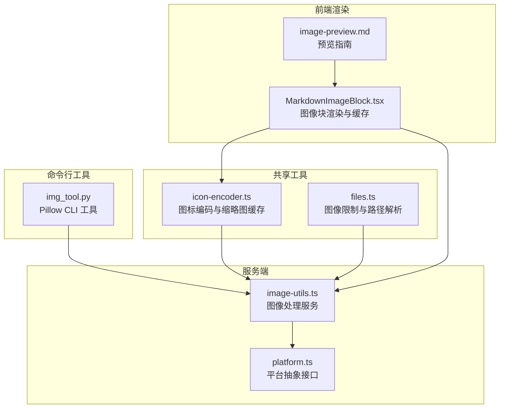
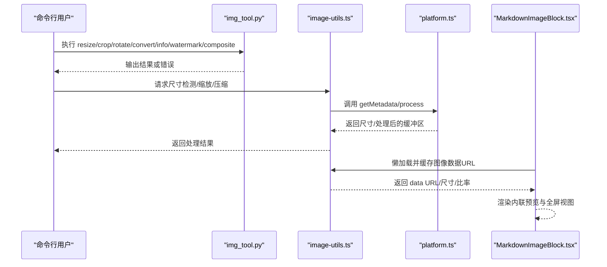
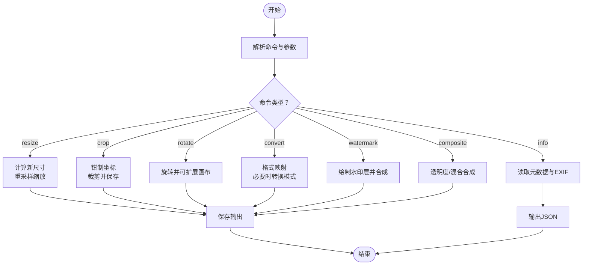
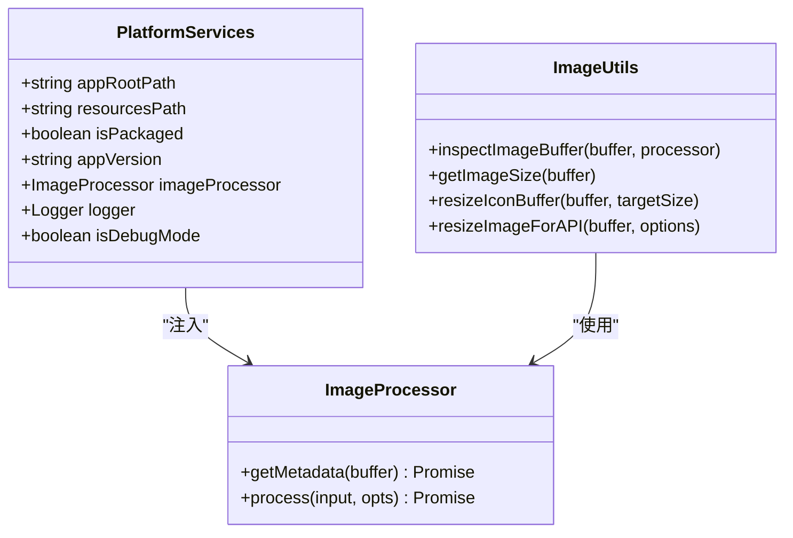
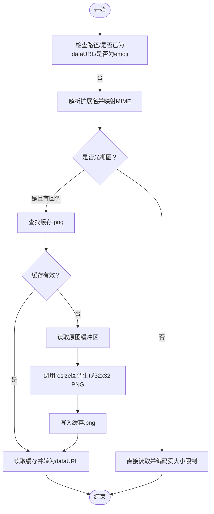
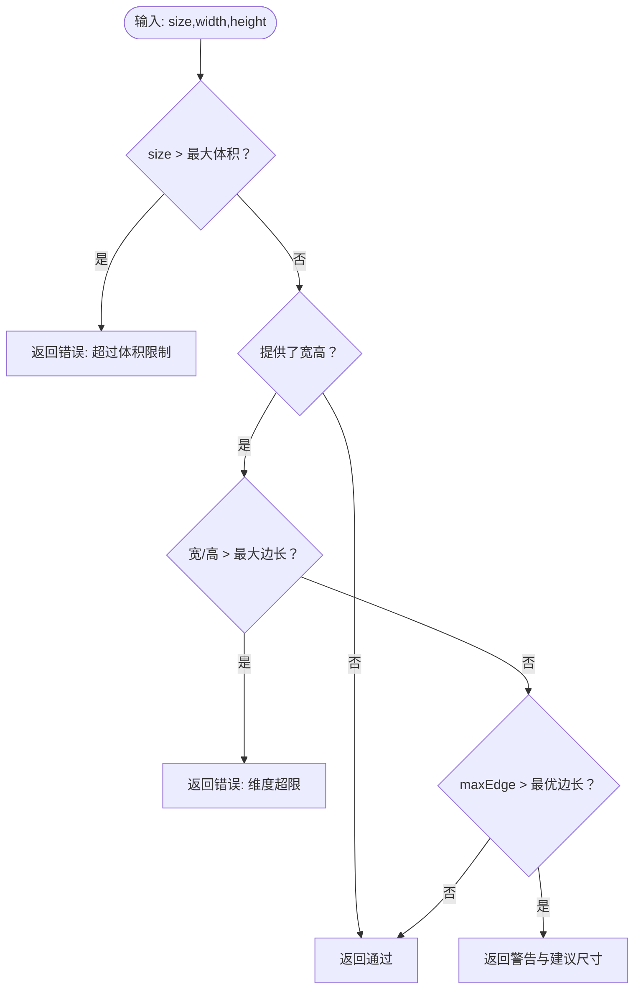
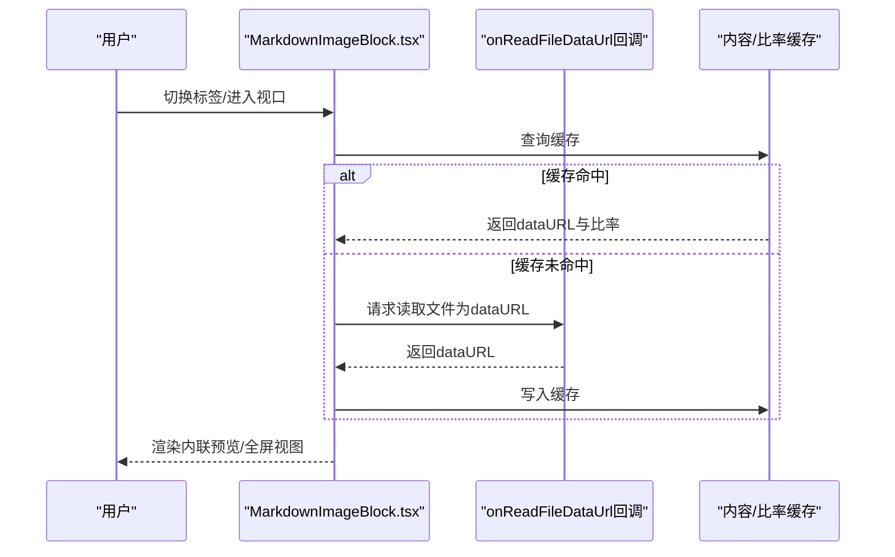
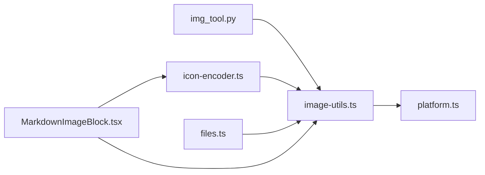

# 图像转换器

<cite>
**本文引用的文件**
- [img_tool.py](file://apps/electron/resources/scripts/img_tool.py)
- [image-utils.ts](file://packages/server-core/src/services/image-utils.ts)
- [platform.ts](file://packages/server-core/src/runtime/platform.ts)
- [icon-encoder.ts](file://packages/shared/src/utils/icon-encoder.ts)
- [files.ts](file://packages/shared/src/utils/files.ts)
- [image-preview.md](file://apps/electron/resources/docs/image-preview.md)
- [MarkdownImageBlock.tsx](file://packages/ui/src/components/MarkdownImageBlock.tsx)
- [client.ts](file://apps/cli/src/client.ts)
- [commands.test.ts](file://apps/cli/src/commands.test.ts)
</cite>

## 目录
1. [简介](#简介)
2. [项目结构](#项目结构)
3. [核心组件](#核心组件)
4. [架构总览](#架构总览)
5. [详细组件分析](#详细组件分析)
6. [依赖关系分析](#依赖关系分析)
7. [性能考量](#性能考量)
8. [故障排查指南](#故障排查指南)
9. [结论](#结论)
10. [附录](#附录)

## 简介
本文件为“图像转换器”的技术文档，聚焦于以下能力与目标：
- 基于 Pillow 的命令行图像处理工具，支持尺寸调整、裁剪、旋转、格式转换、元信息查看、水印叠加与图像合成。
- 基于可插拔图像处理器（平台抽象）的图像尺寸检测、缩放与质量控制，适配不同运行环境（Electron 或 Headless）。
- 面向前端的图像预览与数据加载流程，含缓存与错误处理。
- 针对大模型输入的图像尺寸与体积限制校验与自动压缩策略。
- 提供性能优化、内存管理与批量处理建议，以及自定义转换器开发指南。

## 项目结构
围绕图像处理的关键模块分布如下：
- 命令行图像工具：基于 Pillow 的 Python 脚本，提供 resize、crop、rotate、convert、info、watermark、composite 等子命令。
- 服务端图像处理：通过平台抽象接口注入图像处理器，提供尺寸检测、缩放、格式转换与质量控制。
- 共享工具：图标编码、图像尺寸限制常量与路径提取等。
- 前端渲染：Markdown 图像块组件负责懒加载、缓存与多图切换。
- CLI 客户端：用于连接后端服务进行 RPC 调用（与图像处理相关的能力可通过服务端实现）。

**图表来源**
- [img_tool.py:1-371](file://apps/electron/resources/scripts/img_tool.py#L1-L371)
- [image-utils.ts:1-181](file://packages/server-core/src/services/image-utils.ts#L1-L181)
- [platform.ts:1-86](file://packages/server-core/src/runtime/platform.ts#L1-L86)
- [icon-encoder.ts:1-235](file://packages/shared/src/utils/icon-encoder.ts#L1-L235)
- [files.ts:140-339](file://packages/shared/src/utils/files.ts#L140-L339)
- [MarkdownImageBlock.tsx:84-205](file://packages/ui/src/components/MarkdownImageBlock.tsx#L84-L205)
- [image-preview.md:1-110](file://apps/electron/resources/docs/image-preview.md#L1-L110)

**章节来源**
- [img_tool.py:1-371](file://apps/electron/resources/scripts/img_tool.py#L1-L371)
- [image-utils.ts:1-181](file://packages/server-core/src/services/image-utils.ts#L1-L181)
- [platform.ts:1-86](file://packages/server-core/src/runtime/platform.ts#L1-L86)
- [icon-encoder.ts:1-235](file://packages/shared/src/utils/icon-encoder.ts#L1-L235)
- [files.ts:140-339](file://packages/shared/src/utils/files.ts#L140-L339)
- [MarkdownImageBlock.tsx:84-205](file://packages/ui/src/components/MarkdownImageBlock.tsx#L84-L205)
- [image-preview.md:1-110](file://apps/electron/resources/docs/image-preview.md#L1-L110)

## 核心组件
- Pillow 命令行工具（img_tool.py）
  - 支持 resize、crop、rotate、convert、info、watermark、composite 子命令。
  - 参数校验与错误处理，输出格式推断与保存。
- 可插拔图像处理器（platform.ts + image-utils.ts）
  - 平台抽象定义 getMetadata 与 process 接口；服务端实现按需调用底层图像库（如 sharp）。
  - 提供尺寸检查、缩放、格式转换与质量控制。
- 图标编码与缩略图缓存（icon-encoder.ts）
  - 将图标文件转为 data URL；对光栅图标生成 32x32 缩略图并缓存，避免重复处理。
- 图像限制与路径工具（files.ts）
  - 对 Claude API 输入的图像尺寸与体积限制进行校验，并给出建议尺寸。
  - 提供路径提取、类型判断与 MIME 映射。
- 前端图像块渲染（MarkdownImageBlock.tsx + image-preview.md）
  - 懒加载、缓存、多图标签页与全屏预览；对不支持格式给出提示。

**章节来源**
- [img_tool.py:63-371](file://apps/electron/resources/scripts/img_tool.py#L63-L371)
- [platform.ts:16-37](file://packages/server-core/src/runtime/platform.ts#L16-L37)
- [image-utils.ts:28-181](file://packages/server-core/src/services/image-utils.ts#L28-L181)
- [icon-encoder.ts:86-235](file://packages/shared/src/utils/icon-encoder.ts#L86-L235)
- [files.ts:140-339](file://packages/shared/src/utils/files.ts#L140-L339)
- [MarkdownImageBlock.tsx:84-205](file://packages/ui/src/components/MarkdownImageBlock.tsx#L84-L205)
- [image-preview.md:1-110](file://apps/electron/resources/docs/image-preview.md#L1-L110)

## 架构总览
下图展示从命令行到服务端再到前端的整体流程与职责边界：

**图表来源**
- [img_tool.py:63-371](file://apps/electron/resources/scripts/img_tool.py#L63-L371)
- [image-utils.ts:28-181](file://packages/server-core/src/services/image-utils.ts#L28-L181)
- [platform.ts:16-37](file://packages/server-core/src/runtime/platform.ts#L16-L37)
- [MarkdownImageBlock.tsx:84-205](file://packages/ui/src/components/MarkdownImageBlock.tsx#L84-L205)

## 详细组件分析

### Pillow 命令行工具（img_tool.py）
- 功能概览
  - resize：按宽高或比例缩放，保持或不保持纵横比，使用高质量重采样。
  - crop：按矩形区域裁剪，数值钳制与有效性校验。
  - rotate：指定角度旋转，可扩展画布并设置背景色。
  - convert：格式转换，针对 JPEG 自动去除透明通道并设置质量。
  - info：输出文件路径、格式、模式、尺寸、字节数、DPI、EXIF、帧数等。
  - watermark：在图像上添加文本水印，支持字体、透明度、位置与颜色。
  - composite：将覆盖层与底图合成，支持透明度与整体混合。
- 关键实现点
  - 格式推断与保存参数（如 JPEG 质量）。
  - 参数校验与异常捕获，统一错误输出。
  - 水印与合成中 RGBA 处理与输出格式转换。
- 错误处理
  - 输入参数合法性检查失败时直接退出。
  - 文件读取/写入与 Pillow 操作异常统一捕获并输出错误信息。

**图表来源**
- [img_tool.py:69-371](file://apps/electron/resources/scripts/img_tool.py#L69-L371)

**章节来源**
- [img_tool.py:63-371](file://apps/electron/resources/scripts/img_tool.py#L63-L371)

### 可插拔图像处理器（platform.ts + image-utils.ts）
- 平台抽象
  - ImageProcessor 接口定义 getMetadata 与 process，支持尺寸、重采样、格式与质量控制。
  - PlatformServices 注入 imageProcessor，屏蔽 Electron 与 Headless 的差异。
- 服务实现
  - inspectImageBuffer：区分无效输入与处理器不可用错误，必要时回退到 PNG 处理再检测。
  - resizeIconBuffer：将图标缩放至目标尺寸并输出 PNG。
  - resizeImageForAPI：根据 Claude API 限制进行尺寸与体积控制，优先 PNG，必要时降级 JPEG 并调整质量。
- 错误处理
  - 对“找不到 sharp 包”类错误进行识别与分类，避免误判为无效图像。

**图表来源**
- [platform.ts:16-65](file://packages/server-core/src/runtime/platform.ts#L16-L65)
- [image-utils.ts:28-181](file://packages/server-core/src/services/image-utils.ts#L28-L181)

**章节来源**
- [platform.ts:1-86](file://packages/server-core/src/runtime/platform.ts#L1-L86)
- [image-utils.ts:1-181](file://packages/server-core/src/services/image-utils.ts#L1-L181)

### 图标编码与缩略图缓存（icon-encoder.ts）
- 功能要点
  - 将图标文件转为 data URL；SVG 直接编码，光栅图可选缩放为 32x32 并缓存为 .thumb.png。
  - 仅对小于阈值的文件进行直接编码，避免超大文件。
  - 支持同步与异步两种回调，便于集成不同图像库（如 sharp）。
- 性能与缓存
  - 基于原文件修改时间判断缓存有效性，减少重复处理。
  - 缩略图写入失败为最佳努力（best-effort），不影响主流程。

**图表来源**
- [icon-encoder.ts:86-235](file://packages/shared/src/utils/icon-encoder.ts#L86-L235)

**章节来源**
- [icon-encoder.ts:1-235](file://packages/shared/src/utils/icon-encoder.ts#L1-L235)

### 图像限制与路径工具（files.ts）
- 图像尺寸与体积限制
  - 对 Claude API 输入进行严格限制：最大体积、最大边长；当超过最优边长时建议缩放并返回建议尺寸。
  - 导出常量用于其他模块复用。
- 路径解析与类型判断
  - 提取文本中的绝对路径与带空格路径，支持转义与引号包裹。
  - 判断文件类型（image/text/pdf/office/audio/unknown），并提供 MIME 类型映射。

**图表来源**
- [files.ts:140-202](file://packages/shared/src/utils/files.ts#L140-L202)

**章节来源**
- [files.ts:140-339](file://packages/shared/src/utils/files.ts#L140-L339)

### 前端图像块渲染（MarkdownImageBlock.tsx + image-preview.md）
- 渲染行为
  - 解析 image-preview 代码块配置，支持单图与多图（标签页）。
  - 懒加载：切换标签或进入视口时才加载；加载完成后缓存 data URL 与宽高比。
  - 内联预览固定高度，支持展开全屏；多图支持左右导航与复制路径。
- 错误处理
  - 加载失败时显示错误提示；支持全失败场景的统一提示。
- 格式支持
  - 文档明确列出 Chromium 可解码格式；对 HEIC/HEIF/TIFF 等不支持格式给出外部打开建议。

**图表来源**
- [MarkdownImageBlock.tsx:84-205](file://packages/ui/src/components/MarkdownImageBlock.tsx#L84-L205)
- [image-preview.md:1-110](file://apps/electron/resources/docs/image-preview.md#L1-L110)

**章节来源**
- [MarkdownImageBlock.tsx:84-205](file://packages/ui/src/components/MarkdownImageBlock.tsx#L84-L205)
- [image-preview.md:1-110](file://apps/electron/resources/docs/image-preview.md#L1-L110)

### CLI 客户端（client.ts）与参数解析（commands.test.ts）
- CLI 客户端
  - WebSocket RPC 客户端，握手后发送请求并订阅事件；支持超时与断开处理。
- 参数解析测试
  - 覆盖 URL、令牌、工作区、TLS CA、超时、JSON 输出、源列表、模式、输出格式、清理开关、服务器入口、工作区目录、提供商等参数的解析与默认值。
- 与图像处理的关系
  - CLI 主要用于连接后端服务；图像处理能力由服务端实现并通过平台抽象提供。

**章节来源**
- [client.ts:1-240](file://apps/cli/src/client.ts#L1-L240)
- [commands.test.ts:1-404](file://apps/cli/src/commands.test.ts#L1-L404)

## 依赖关系分析
- Pillow CLI 与服务端图像处理的耦合点
  - CLI 侧重本地文件处理；服务端通过 ImageProcessor 抽象实现跨平台图像处理。
- 前端与服务端的协作
  - 前端通过回调获取 data URL；服务端可提供尺寸与比率信息，前端据此渲染。
- 平台抽象的扩展性
  - Electron 环境可用 nativeImage；Headless 环境可用 sharp；通过 setImageProcessor 注入实现。

**图表来源**
- [img_tool.py:1-371](file://apps/electron/resources/scripts/img_tool.py#L1-L371)
- [image-utils.ts:1-181](file://packages/server-core/src/services/image-utils.ts#L1-L181)
- [platform.ts:1-86](file://packages/server-core/src/runtime/platform.ts#L1-L86)
- [icon-encoder.ts:1-235](file://packages/shared/src/utils/icon-encoder.ts#L1-L235)
- [files.ts:140-339](file://packages/shared/src/utils/files.ts#L140-L339)
- [MarkdownImageBlock.tsx:84-205](file://packages/ui/src/components/MarkdownImageBlock.tsx#L84-L205)

**章节来源**
- [img_tool.py:1-371](file://apps/electron/resources/scripts/img_tool.py#L1-L371)
- [image-utils.ts:1-181](file://packages/server-core/src/services/image-utils.ts#L1-L181)
- [platform.ts:1-86](file://packages/server-core/src/runtime/platform.ts#L1-L86)
- [icon-encoder.ts:1-235](file://packages/shared/src/utils/icon-encoder.ts#L1-L235)
- [files.ts:140-339](file://packages/shared/src/utils/files.ts#L140-L339)
- [MarkdownImageBlock.tsx:84-205](file://packages/ui/src/components/MarkdownImageBlock.tsx#L84-L205)

## 性能考量
- 尺寸与质量控制
  - 优先 PNG 以保留无损质量；对照片类图像在超限情况下降级 JPEG 并调整质量。
  - 当最大边超过最优边长时，按比例缩放以降低 token 与延迟消耗。
- 缓存与复用
  - 图标缩略图缓存减少重复处理；前端对 data URL 与比率进行缓存，避免重复 IO。
- 重采样与格式
  - CLI 使用高质量重采样算法；JPEG 保存时设置合理质量；透明通道在 JPEG 下自动去除。
- 批量处理建议
  - 服务端可并发调用 process；注意内存峰值与磁盘 IO；对超大文件优先考虑分块或流式处理。
- 运行环境
  - Headless 环境建议使用高性能图像库（如 sharp），并合理配置线程池与内存上限。

[本节为通用指导，无需特定文件引用]

## 故障排查指南
- 命令行工具
  - 参数非法：宽度/高度必须为正数，比例必须为正值；未指定目标尺寸时直接报错。
  - 文件不可读或格式不受支持：Pillow 抛出异常并输出错误信息。
  - 输出格式不支持：根据扩展名推断格式，必要时转换模式（如 JPEG 去除透明通道）。
- 服务端图像处理
  - 处理器不可用：识别“找不到 sharp 包”类错误，避免误判为无效图像。
  - 尺寸检测失败：回退到 PNG 处理后再检测，提升容错性。
- 前端图像块
  - “加载中”长时间不变化：确认路径为绝对路径、文件存在且可读、格式受 Chromium 支持。
  - “加载失败”：检查文件损坏、权限问题或格式不被解码。
  - HEIC/TIFF 不渲染：预期行为，建议外部打开。

**章节来源**
- [img_tool.py:85-121](file://apps/electron/resources/scripts/img_tool.py#L85-L121)
- [image-utils.ts:40-65](file://packages/server-core/src/services/image-utils.ts#L40-L65)
- [MarkdownImageBlock.tsx:177-183](file://packages/ui/src/components/MarkdownImageBlock.tsx#L177-L183)
- [image-preview.md:95-110](file://apps/electron/resources/docs/image-preview.md#L95-L110)

## 结论
本项目通过 Pillow 命令行工具、可插拔图像处理器与前端渲染组件，构建了完整的图像处理与展示链路。其核心优势在于：
- 明确的职责分离与平台抽象，便于在不同运行环境中灵活部署。
- 针对 API 输入的尺寸与体积限制提供自动化策略，兼顾质量与性能。
- 前端缓存与懒加载提升用户体验，错误处理与格式支持指引增强健壮性。
面向需要处理图像文件或集成图像功能的开发者，可在现有抽象之上扩展自定义转换器与批处理方案。

[本节为总结，无需特定文件引用]

## 附录

### 命令行接口设计与参数验证
- 子命令与参数
  - resize：--width、--height、--scale、--keep-aspect、-o 输出。
  - crop：--left、--top、--right、--bottom、-o 输出。
  - rotate：--angle、--expand/--no-expand、--fill-color、-o 输出。
  - convert：--format（png/jpeg/jpg/gif/bmp/tiff/webp）、-o 输出。
  - info：-o 输出文件或标准输出。
  - watermark：--text、--font-size、--opacity、--position、--color、-o 输出。
  - composite：--x、--y、--opacity、--blend、-o 输出。
- 参数验证
  - 宽高与比例的正数校验；裁剪区域的有效性校验；水印位置与颜色解析；格式映射与保存参数设置。

**章节来源**
- [img_tool.py:69-371](file://apps/electron/resources/scripts/img_tool.py#L69-L371)

### 输出格式选择与质量控制
- 格式映射：.jpg/.jpeg→JPEG，.png→PNG，.gif→GIF，.bmp→BMP，.tiff/.tif→TIFF，.webp→WEBP，.ico→ICO。
- 质量控制：JPEG 默认质量较高；当体积仍超限时，逐步降低质量以满足限制。
- 透明通道：输出 JPEG 时自动去除透明通道。

**章节来源**
- [img_tool.py:30-60](file://apps/electron/resources/scripts/img_tool.py#L30-L60)
- [image-utils.ts:111-181](file://packages/server-core/src/services/image-utils.ts#L111-L181)

### 图像结构分析与像素处理
- 结构分析：读取尺寸、模式、DPI、EXIF、帧数等元信息。
- 像素处理：重采样缩放、裁剪、旋转、水印绘制、透明度与混合合成。
- 色彩空间：根据输出格式自动转换（如 RGBA→RGB）。

**章节来源**
- [img_tool.py:205-371](file://apps/electron/resources/scripts/img_tool.py#L205-L371)

### 自定义转换器开发指南
- 实现 ImageProcessor 接口
  - getMetadata：返回宽度与高度；失败时返回 null。
  - process：支持 resize、fit、format、quality 等选项；返回 Buffer。
- 注入平台
  - 通过 setImageProcessor 注入实现；确保在应用初始化阶段完成。
- 兼容性与质量保证
  - 遵循 Claude API 限制策略；对超限图像自动降级；提供清晰的错误分类与日志。

**章节来源**
- [platform.ts:16-37](file://packages/server-core/src/runtime/platform.ts#L16-L37)
- [image-utils.ts:67-97](file://packages/server-core/src/services/image-utils.ts#L67-L97)