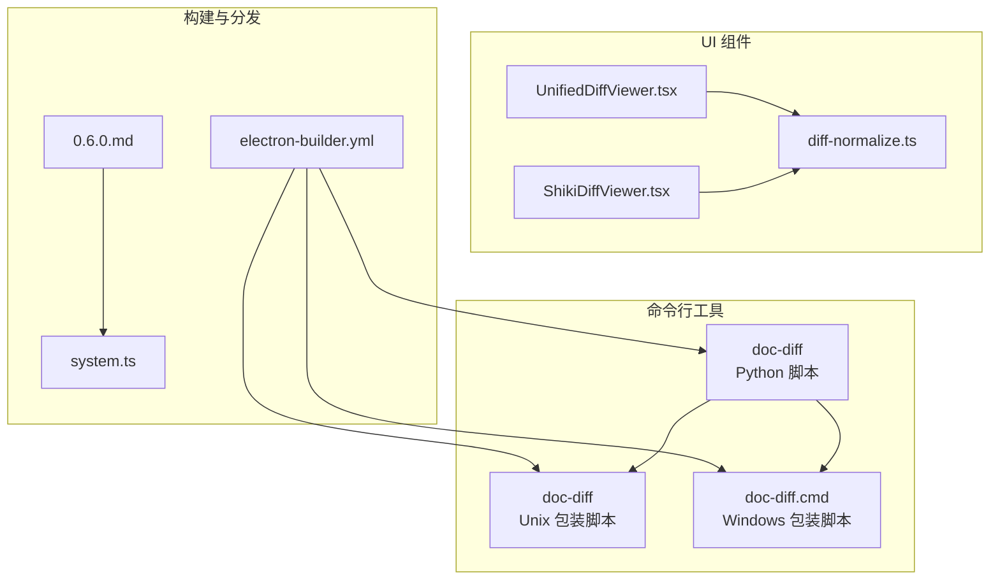
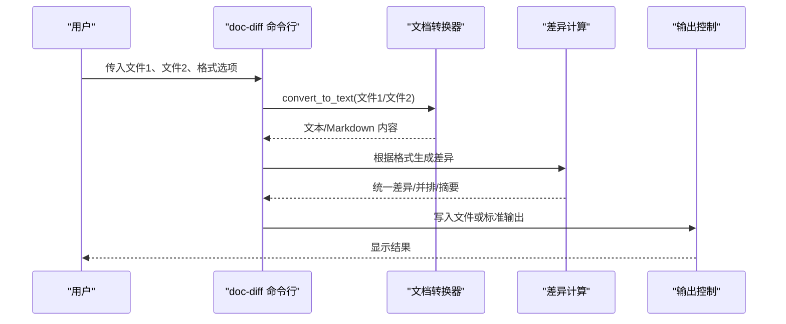
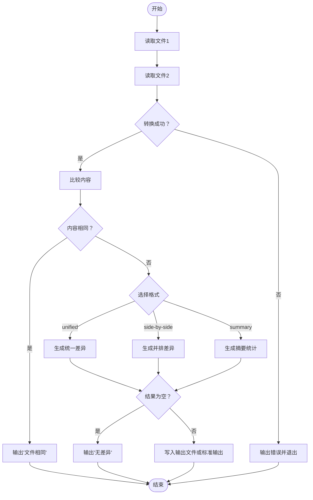
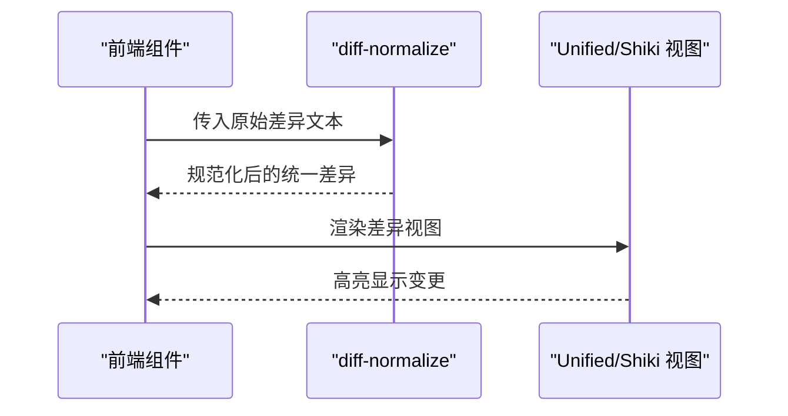
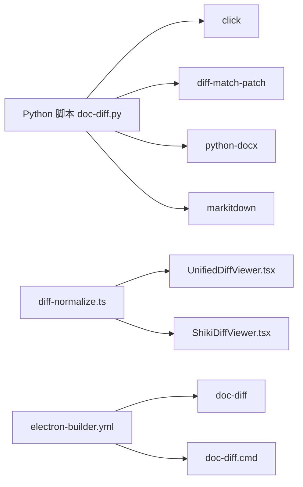

# 文档差异比较器

<cite>
**本文引用的文件**
- [doc_diff.py](file://apps/electron/resources/scripts/doc_diff.py)
- [doc-diff](file://apps/electron/resources/bin/doc-diff)
- [doc-diff.cmd](file://apps/electron/resources/bin/doc-diff.cmd)
- [test_doc_diff_smoke.py](file://apps/electron/resources/scripts/tests/test_doc_diff_smoke.py)
- [diff-normalize.ts](file://packages/ui/src/components/markdown/diff-normalize.ts)
- [ShikiDiffViewer.tsx](file://packages/ui/src/components/code-viewer/ShikiDiffViewer.tsx)
- [UnifiedDiffViewer.tsx](file://packages/ui/src/components/code-viewer/UnifiedDiffViewer.tsx)
- [electron-builder.yml](file://apps/electron/electron-builder.yml)
- [0.6.0.md](file://apps/electron/resources/release-notes/0.6.0.md)
- [system.ts](file://packages/shared/src/prompts/system.ts)
</cite>

## 目录
1. [简介](#简介)
2. [项目结构](#项目结构)
3. [核心组件](#核心组件)
4. [架构总览](#架构总览)
5. [详细组件分析](#详细组件分析)
6. [依赖关系分析](#依赖关系分析)
7. [性能考虑](#性能考虑)
8. [故障排除指南](#故障排除指南)
9. [结论](#结论)
10. [附录](#附录)

## 简介
本技术文档围绕“文档差异比较器”展开，系统阐述其文本比较算法、差异检测机制、变更高亮与可视化、合并策略、命令行接口设计与参数处理、输出格式控制、文档结构分析与内容对比、相似度计算、以及在 Electron 应用中的集成方式。同时提供性能优化策略、内存管理建议、大文件处理技巧、自定义比较器开发指南、格式兼容性处理与差异分析质量保证方法，帮助开发者快速集成与扩展。

## 项目结构
文档差异比较器由三部分组成：
- 命令行工具：基于 Python 的 doc-diff 脚本，负责将任意文档转换为文本/Markdown 后进行差异比对，并支持统一差异、并排对比与摘要统计三种输出格式。
- UI 可视化：前端组件负责解析与渲染差异结果，支持统一差异与基于 Shiki 的语法高亮差异视图。
- 构建与分发：通过 electron-builder 将 CLI 工具与包装脚本打包进应用资源，便于跨平台使用。

**图表来源**
- [doc_diff.py:1-252](file://apps/electron/resources/scripts/doc_diff.py#L1-L252)
- [doc-diff:1-3](file://apps/electron/resources/bin/doc-diff#L1-L3)
- [doc-diff.cmd:1-3](file://apps/electron/resources/bin/doc-diff.cmd#L1-L3)
- [UnifiedDiffViewer.tsx:213-246](file://packages/ui/src/components/code-viewer/UnifiedDiffViewer.tsx#L213-L246)
- [ShikiDiffViewer.tsx:110-144](file://packages/ui/src/components/code-viewer/ShikiDiffViewer.tsx#L110-L144)
- [diff-normalize.ts:63-128](file://packages/ui/src/components/markdown/diff-normalize.ts#L63-L128)
- [electron-builder.yml:40-41](file://apps/electron/electron-builder.yml#L40-L41)
- [0.6.0.md:27-31](file://apps/electron/resources/release-notes/0.6.0.md#L27-L31)
- [system.ts:1070-1072](file://packages/shared/src/prompts/system.ts#L1070-L1072)

**章节来源**
- [doc_diff.py:1-252](file://apps/electron/resources/scripts/doc_diff.py#L1-L252)
- [doc-diff:1-3](file://apps/electron/resources/bin/doc-diff#L1-L3)
- [doc-diff.cmd:1-3](file://apps/electron/resources/bin/doc-diff.cmd#L1-L3)
- [UnifiedDiffViewer.tsx:213-246](file://packages/ui/src/components/code-viewer/UnifiedDiffViewer.tsx#L213-L246)
- [ShikiDiffViewer.tsx:110-144](file://packages/ui/src/components/code-viewer/ShikiDiffViewer.tsx#L110-L144)
- [diff-normalize.ts:63-128](file://packages/ui/src/components/markdown/diff-normalize.ts#L63-L128)
- [electron-builder.yml:40-41](file://apps/electron/electron-builder.yml#L40-L41)
- [0.6.0.md:27-31](file://apps/electron/resources/release-notes/0.6.0.md#L27-L31)
- [system.ts:1070-1072](file://packages/shared/src/prompts/system.ts#L1070-L1072)

## 核心组件
- 文档转换与预处理
  - 支持纯文本、Markdown、CSV/TSV、日志等直接读取；DOCX 采用内置解析；其他格式通过 MarkItDown 转换为文本/Markdown。
  - 对于非文本文件，若 MarkItDown 不可用，会抛出明确错误提示（需安装 Microsoft Visual C++ 运行时）。
- 差异计算与输出
  - 统一差异：基于 difflib.unified_diff 输出标准统一差异。
  - 并排对比：基于 difflib.SequenceMatcher 对齐行，生成左右两列对比视图。
  - 摘要统计：使用 diff-match-patch 计算字符级插入/删除数量与行级增删改统计，并可选输出词级标记。
  - 相似度：基于行级 SequenceMatcher 的 ratio 计算相似百分比。
- 命令行接口
  - 参数：两个输入文件、输出格式选择（unified/side-by-side/summary）、词级标记开关、输出文件路径。
  - 行为：转换失败返回非零退出码；内容完全相同时输出“文件相同”提示；空差异输出“无差异”。

**章节来源**
- [doc_diff.py:50-76](file://apps/electron/resources/scripts/doc_diff.py#L50-L76)
- [doc_diff.py:78-123](file://apps/electron/resources/scripts/doc_diff.py#L78-L123)
- [doc_diff.py:125-197](file://apps/electron/resources/scripts/doc_diff.py#L125-L197)
- [doc_diff.py:200-248](file://apps/electron/resources/scripts/doc_diff.py#L200-L248)

## 架构总览
下图展示从用户调用到结果可视化的端到端流程：

**图表来源**
- [doc_diff.py:200-248](file://apps/electron/resources/scripts/doc_diff.py#L200-L248)
- [doc_diff.py:50-76](file://apps/electron/resources/scripts/doc_diff.py#L50-L76)
- [doc_diff.py:78-123](file://apps/electron/resources/scripts/doc_diff.py#L78-L123)
- [doc_diff.py:125-197](file://apps/electron/resources/scripts/doc_diff.py#L125-L197)

## 详细组件分析

### 命令行工具：doc-diff
- 功能要点
  - 文档转换：优先直读纯文本类文件；DOCX 使用内置解析；其他格式通过 MarkItDown 转换。
  - 差异生成：统一差异、并排对比、摘要统计三类输出。
  - 相似度与统计：行级与字符级变更计数，支持词级标记。
  - 错误处理：转换异常、缺失文件、输出写入失败均给出明确错误信息。
- 参数与行为
  - 输入：两个文件路径（必须存在且为文件）。
  - 选项：--format（默认 unified）、--word-level（仅摘要模式生效）、-o/--output。
  - 特殊情况：内容完全相同时输出“文件相同”；无差异时输出“无差异”。

**图表来源**
- [doc_diff.py:200-248](file://apps/electron/resources/scripts/doc_diff.py#L200-L248)
- [doc_diff.py:26-33](file://apps/electron/resources/scripts/doc_diff.py#L26-L33)
- [doc_diff.py:231-247](file://apps/electron/resources/scripts/doc_diff.py#L231-L247)

**章节来源**
- [doc_diff.py:200-248](file://apps/electron/resources/scripts/doc_diff.py#L200-L248)
- [doc_diff.py:26-33](file://apps/electron/resources/scripts/doc_diff.py#L26-L33)

### UI 差异可视化：diff-normalize 与 Viewer
- diff-normalize
  - 将非标准或裸露的差异块规范化为统一差异格式，确保解析器能正确处理。
  - 支持自动补全文件头、Git 头、单文件多 hunk 的合成，保留原始 hunk 元数据。
- UnifiedDiffViewer
  - 从统一差异字符串中统计增删行数，用于在 UI 中显示变更概览。
- ShikiDiffViewer
  - 解析统一差异并注入主题、行差异类型、溢出控制等选项，支持点击文件头回调。

**图表来源**
- [diff-normalize.ts:63-128](file://packages/ui/src/components/markdown/diff-normalize.ts#L63-L128)
- [UnifiedDiffViewer.tsx:235-246](file://packages/ui/src/components/code-viewer/UnifiedDiffViewer.tsx#L235-L246)
- [ShikiDiffViewer.tsx:123-144](file://packages/ui/src/components/code-viewer/ShikiDiffViewer.tsx#L123-L144)

**章节来源**
- [diff-normalize.ts:63-128](file://packages/ui/src/components/markdown/diff-normalize.ts#L63-L128)
- [UnifiedDiffViewer.tsx:235-246](file://packages/ui/src/components/code-viewer/UnifiedDiffViewer.tsx#L235-L246)
- [ShikiDiffViewer.tsx:123-144](file://packages/ui/src/components/code-viewer/ShikiDiffViewer.tsx#L123-L144)

### 构建与分发：electron-builder 集成
- 将 doc-diff 与 doc-diff.cmd 打包进应用资源，随应用分发，确保跨平台可用。
- 发布说明与系统提示文档中明确列出该工具及其用途。

**章节来源**
- [electron-builder.yml:40-41](file://apps/electron/electron-builder.yml#L40-L41)
- [0.6.0.md:27-31](file://apps/electron/resources/release-notes/0.6.0.md#L27-L31)
- [system.ts:1070-1072](file://packages/shared/src/prompts/system.ts#L1070-L1072)

## 依赖关系分析
- 外部依赖
  - Python 生态：click（命令行）、diff-match-patch（语义差异）、python-docx（DOCX 解析）、markitdown（通用文档转 Markdown）。
- 内部依赖
  - UI 层依赖 diff-normalize 将非标准差异规范化；UnifiedDiffViewer 与 ShikiDiffViewer 依赖统一差异格式。
- 构建依赖
  - electron-builder 将 CLI 工具与包装脚本纳入最终产物，确保运行时可用。

**图表来源**
- [doc_diff.py:22-23](file://apps/electron/resources/scripts/doc_diff.py#L22-L23)
- [diff-normalize.ts:63-128](file://packages/ui/src/components/markdown/diff-normalize.ts#L63-L128)
- [UnifiedDiffViewer.tsx:213-246](file://packages/ui/src/components/code-viewer/UnifiedDiffViewer.tsx#L213-L246)
- [ShikiDiffViewer.tsx:110-144](file://packages/ui/src/components/code-viewer/ShikiDiffViewer.tsx#L110-L144)
- [electron-builder.yml:40-41](file://apps/electron/electron-builder.yml#L40-L41)

**章节来源**
- [doc_diff.py:22-23](file://apps/electron/resources/scripts/doc_diff.py#L22-L23)
- [electron-builder.yml:40-41](file://apps/electron/electron-builder.yml#L40-L41)

## 性能考虑
- 文本转换阶段
  - 对于大体积 DOCX，建议先提取必要段落与表格，避免一次性加载过多内容。
  - 非文本文件尽量使用 MarkItDown 的轻量转换，减少中间层开销。
- 差异计算阶段
  - 统一差异与并排对比使用 difflib，适合中等规模文档；对于超大文档，建议分段对比并汇总结果。
  - 词级标记（summary 的 --word-level）会增加额外处理时间，按需启用。
- UI 渲染阶段
  - diff-normalize 在前端对差异进行规范化，避免重复解析；ShikiDiffViewer 支持滚动与主题切换，降低长文档渲染压力。
- 内存管理
  - 命令行工具逐行读取与处理，避免一次性载入整个文件；UI 组件按需渲染，支持懒加载与溢出控制。
- 大文件处理技巧
  - 分块读取与增量比较；限制最大行数或字符数；对表格类内容可先抽取关键字段再比较。
  - 使用缓存与去重策略，避免重复计算相同片段。

[本节为通用性能指导，不直接分析具体文件，故无“章节来源”]

## 故障排除指南
- MarkItDown 不可用
  - 现象：转换非文本文件时报错，提示缺少 Microsoft Visual C++ 运行时。
  - 处理：安装所需运行时后重试。
- 文件不存在或不可读
  - 现象：命令行提示文件不存在或读取失败。
  - 处理：检查路径与权限，确认文件存在且可读。
- 输出写入失败
  - 现象：输出到文件时报错。
  - 处理：检查目标目录权限与磁盘空间。
- 测试验证
  - 单元测试覆盖摘要模式工作流与缺失文件场景，可作为回归参考。

**章节来源**
- [doc_diff.py:64-71](file://apps/electron/resources/scripts/doc_diff.py#L64-L71)
- [test_doc_diff_smoke.py:24-42](file://apps/electron/resources/scripts/tests/test_doc_diff_smoke.py#L24-L42)

## 结论
文档差异比较器通过“转换—比较—输出—可视化”的完整链路，实现了对多格式文档的统一差异分析。命令行工具提供灵活的参数与多种输出格式，UI 组件则确保差异结果在前端的高质量呈现。结合性能优化与质量保障措施，该方案适用于日常文档对比、自动化工作流与大规模内容管理场景。

[本节为总结性内容，不直接分析具体文件，故无“章节来源”]

## 附录

### 命令行接口与参数说明
- 基本用法
  - uv run doc_diff.py [OPTIONS] FILE1 FILE2
- 参数
  - --format：输出格式（unified、side-by-side、summary，默认 unified）
  - --word-level：摘要模式下的词级标记（仅 summary 生效）
  - -o/--output：输出到文件（默认输出到标准输出）

**章节来源**
- [doc_diff.py:200-211](file://apps/electron/resources/scripts/doc_diff.py#L200-L211)

### 输出格式与差异可视化
- 统一差异：标准统一差异格式，便于版本控制与工具链集成。
- 并排对比：左右列对比，直观显示行级差异。
- 摘要统计：包含相似度、行级与字符级变更计数，可选词级标记。
- UI 视图：统一差异与 Shiki 语法高亮视图，支持主题与样式定制。

**章节来源**
- [doc_diff.py:78-123](file://apps/electron/resources/scripts/doc_diff.py#L78-L123)
- [doc_diff.py:125-197](file://apps/electron/resources/scripts/doc_diff.py#L125-L197)
- [UnifiedDiffViewer.tsx:235-246](file://packages/ui/src/components/code-viewer/UnifiedDiffViewer.tsx#L235-L246)
- [ShikiDiffViewer.tsx:123-144](file://packages/ui/src/components/code-viewer/ShikiDiffViewer.tsx#L123-L144)

### 自定义比较器开发指南
- 接口设计
  - 输入：两个文档路径或文本内容。
  - 输出：统一差异字符串或结构化差异对象。
- 算法选择
  - 行级：difflib.unified_diff 或 SequenceMatcher。
  - 字符级：diff-match-patch，支持语义清理与词级标记。
- 兼容性处理
  - 对齐不同来源的差异格式，必要时使用 diff-normalize 规范化。
- 质量保证
  - 单元测试覆盖典型场景（如摘要统计、并排对比、相似度计算）。
  - 回归测试验证边界条件（空差异、完全相同、大文件分段对比）。

**章节来源**
- [doc_diff.py:78-123](file://apps/electron/resources/scripts/doc_diff.py#L78-L123)
- [doc_diff.py:125-197](file://apps/electron/resources/scripts/doc_diff.py#L125-L197)
- [diff-normalize.ts:63-128](file://packages/ui/src/components/markdown/diff-normalize.ts#L63-L128)
- [test_doc_diff_smoke.py:24-34](file://apps/electron/resources/scripts/tests/test_doc_diff_smoke.py#L24-L34)