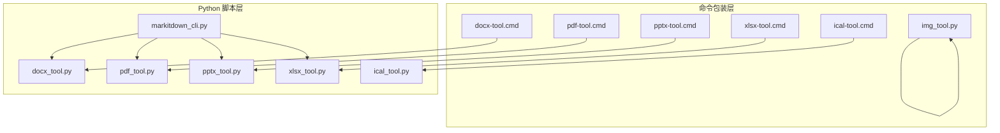
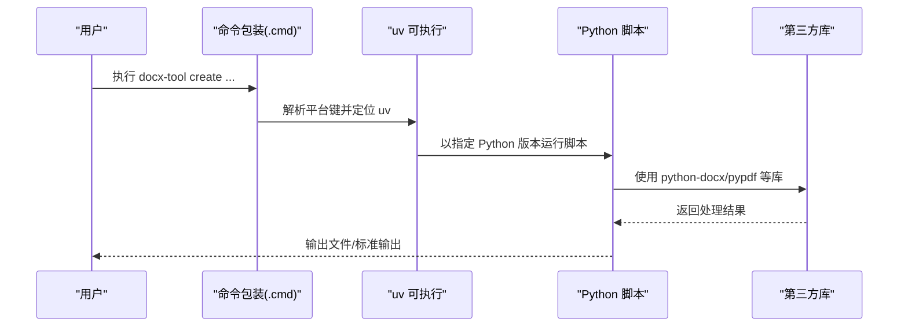
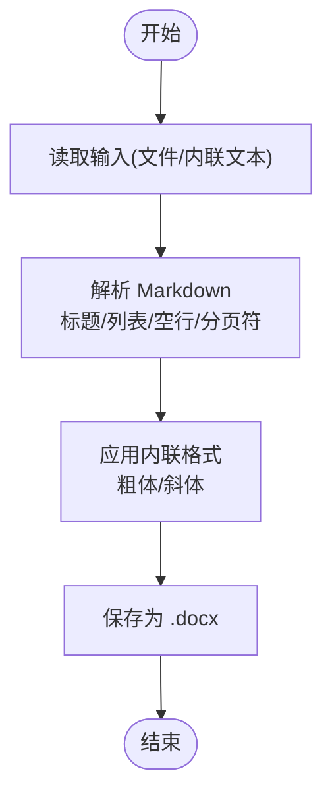
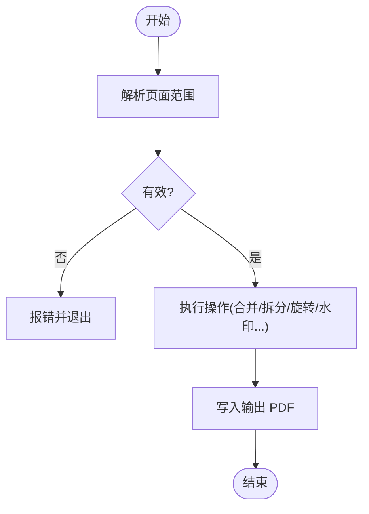
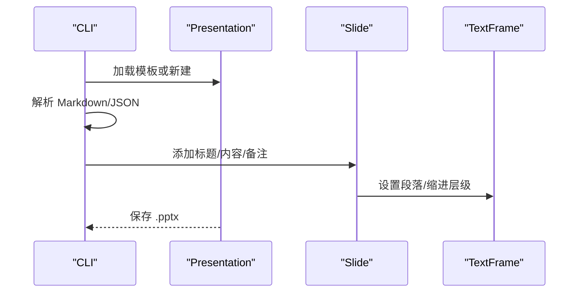
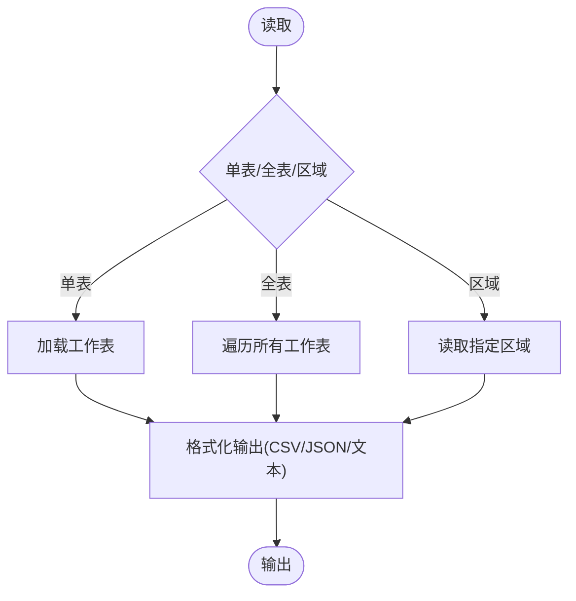
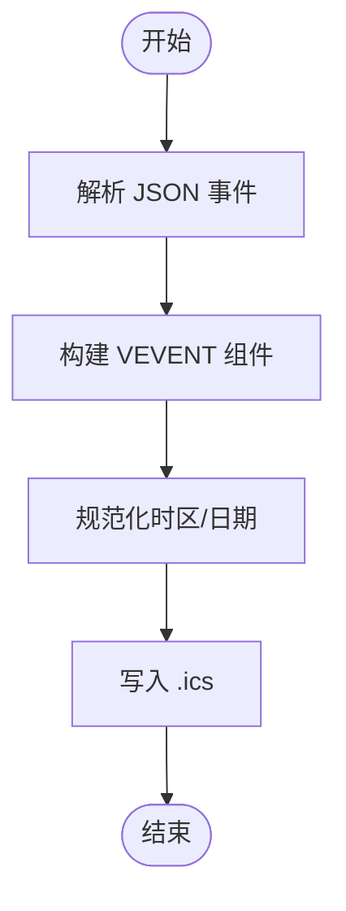
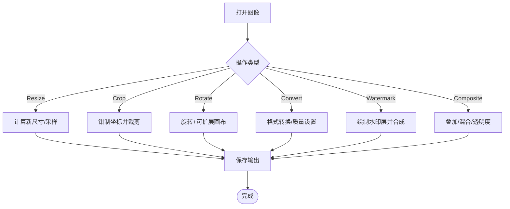
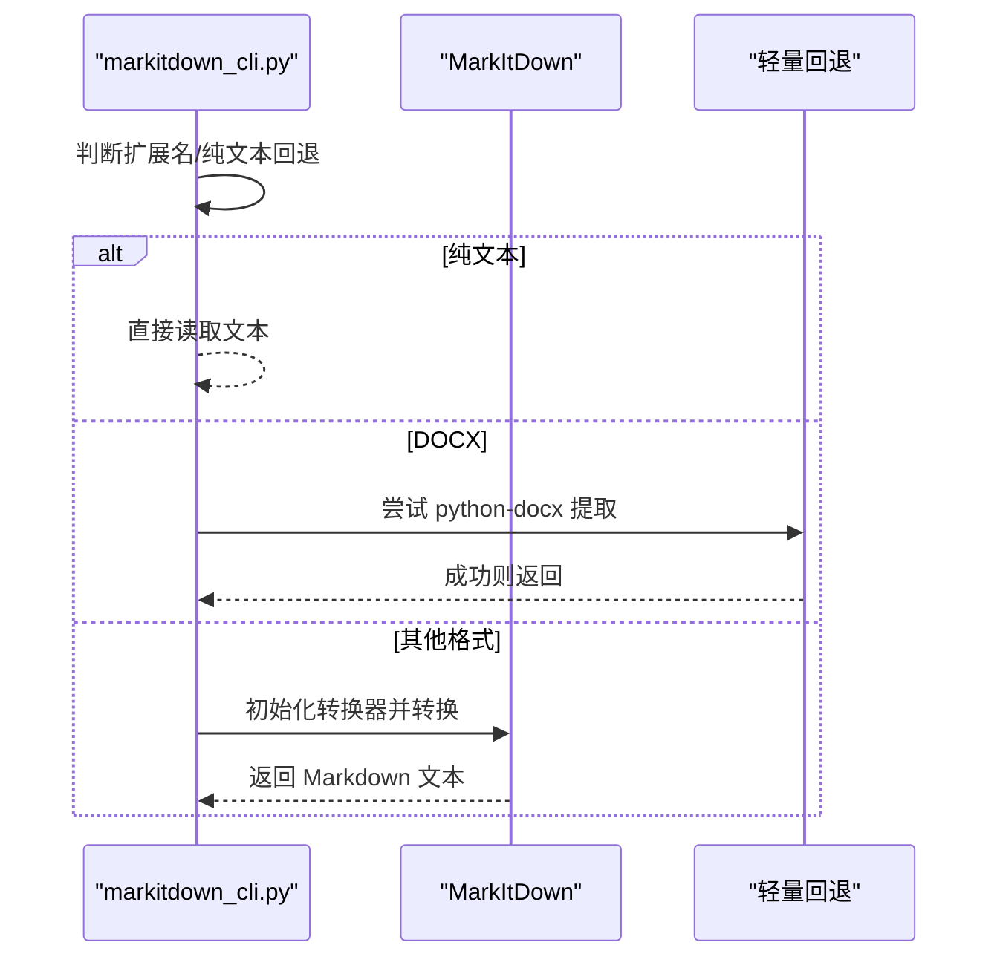
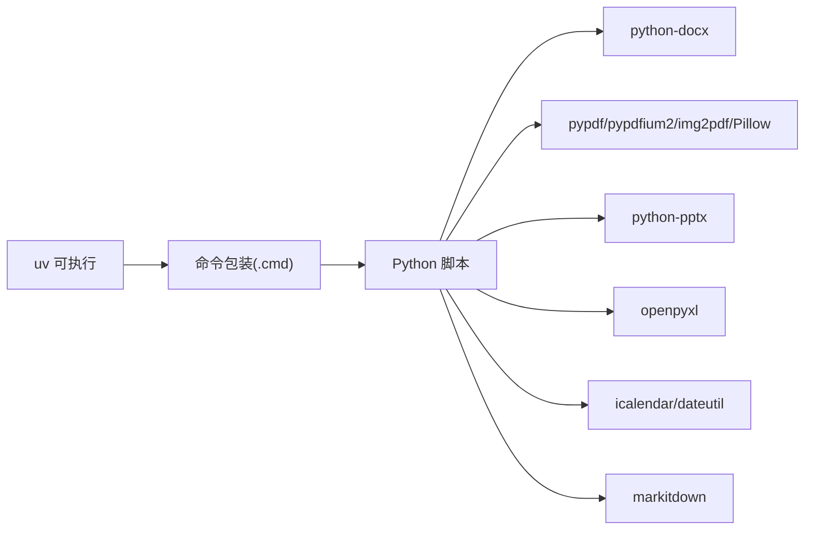

# 文档转换引擎

<cite>
**本文引用的文件**
- [docx_tool.py](file://apps/electron/resources/scripts/docx_tool.py)
- [pdf_tool.py](file://apps/electron/resources/scripts/pdf_tool.py)
- [pptx_tool.py](file://apps/electron/resources/scripts/pptx_tool.py)
- [xlsx_tool.py](file://apps/electron/resources/scripts/xlsx_tool.py)
- [ical_tool.py](file://apps/electron/resources/scripts/ical_tool.py)
- [img_tool.py](file://apps/electron/resources/scripts/img_tool.py)
- [markitdown_cli.py](file://apps/electron/resources/scripts/markitdown_cli.py)
- [_tool_test_harness.py](file://apps/electron/resources/scripts/tests/_tool_test_harness.py)
- [test_docx_tool_smoke.py](file://apps/electron/resources/scripts/tests/test_docx_tool_smoke.py)
- [test_pdf_tool_smoke.py](file://apps/electron/resources/scripts/tests/test_pdf_tool_smoke.py)
- [test_pptx_tool_smoke.py](file://apps/electron/resources/scripts/tests/test_pptx_tool_smoke.py)
- [test_xlsx_tool_smoke.py](file://apps/electron/resources/scripts/tests/test_xlsx_tool_smoke.py)
- [test_ical_tool_smoke.py](file://apps/electron/resources/scripts/tests/test_ical_tool_smoke.py)
- [test_img_tool_smoke.py](file://apps/electron/resources/scripts/tests/test_img_tool_smoke.py)
- [docx-tool.cmd](file://apps/electron/resources/bin/docx-tool.cmd)
- [pdf-tool.cmd](file://apps/electron/resources/bin/pdf-tool.cmd)
- [pptx-tool.cmd](file://apps/electron/resources/bin/pptx-tool.cmd)
- [xlsx-tool.cmd](file://apps/electron/resources/bin/xlsx-tool.cmd)
- [ical-tool.cmd](file://apps/electron/resources/bin/ical-tool.cmd)
- [img-tool.cmd](file://apps/electron/resources/bin/img-tool.cmd)
</cite>

## 目录
1. [简介](#简介)
2. [项目结构](#项目结构)
3. [核心组件](#核心组件)
4. [架构总览](#架构总览)
5. [详细组件分析](#详细组件分析)
6. [依赖关系分析](#依赖关系分析)
7. [性能考虑](#性能考虑)
8. [故障排查指南](#故障排查指南)
9. [结论](#结论)
10. [附录](#附录)

## 简介
本项目提供一套基于 Python 的文档转换与处理工具链，覆盖 DOCX、PDF、PPTX、XLSX、ICAL、IMG 等常见文档与图像格式，并通过统一的命令行接口对外提供“创建、读取、编辑、转换、提取”等能力。核心设计目标包括：
- 统一 CLI 接口与错误处理
- 面向多格式的转换与提取
- 可扩展的转换器与插件化思路
- 健壮的边界条件与严格参数校验
- 与 Electron 应用集成的跨平台可执行包装

## 项目结构
工具链采用“按格式分脚本”的模块化组织方式，每个格式一个独立的 CLI 工具，配合通用的输出与错误处理函数；另有通用的 Markdown 转换入口，支持多种输入格式到 Markdown 的统一转换。

图表来源
- [docx-tool.cmd:1-3](file://apps/electron/resources/bin/docx-tool.cmd#L1-L3)
- [pdf-tool.cmd:1-3](file://apps/electron/resources/bin/pdf-tool.cmd#L1-L3)
- [pptx-tool.cmd:1-3](file://apps/electron/resources/bin/pptx-tool.cmd#L1-L3)
- [xlsx-tool.cmd:1-3](file://apps/electron/resources/bin/xlsx-tool.cmd#L1-L3)
- [ical-tool.cmd:1-3](file://apps/electron/resources/bin/ical-tool.cmd#L1-L3)
- [img-tool.cmd:1-3](file://apps/electron/resources/bin/img-tool.cmd#L1-L3)
- [docx_tool.py:1-391](file://apps/electron/resources/scripts/docx_tool.py#L1-L391)
- [pdf_tool.py:1-1322](file://apps/electron/resources/scripts/pdf_tool.py#L1-L1322)
- [pptx_tool.py:1-365](file://apps/electron/resources/scripts/pptx_tool.py#L1-L365)
- [xlsx_tool.py:1-376](file://apps/electron/resources/scripts/xlsx_tool.py#L1-L376)
- [ical_tool.py:1-373](file://apps/electron/resources/scripts/ical_tool.py#L1-L373)
- [img_tool.py:1-371](file://apps/electron/resources/scripts/img_tool.py#L1-L371)
- [markitdown_cli.py:1-138](file://apps/electron/resources/scripts/markitdown_cli.py#L1-L138)

章节来源
- [docx_tool.py:1-391](file://apps/electron/resources/scripts/docx_tool.py#L1-L391)
- [pdf_tool.py:1-1322](file://apps/electron/resources/scripts/pdf_tool.py#L1-L1322)
- [pptx_tool.py:1-365](file://apps/electron/resources/scripts/pptx_tool.py#L1-L365)
- [xlsx_tool.py:1-376](file://apps/electron/resources/scripts/xlsx_tool.py#L1-L376)
- [ical_tool.py:1-373](file://apps/electron/resources/scripts/ical_tool.py#L1-L373)
- [img_tool.py:1-371](file://apps/electron/resources/scripts/img_tool.py#L1-L371)
- [markitdown_cli.py:1-138](file://apps/electron/resources/scripts/markitdown_cli.py#L1-L138)
- [docx-tool.cmd:1-3](file://apps/electron/resources/bin/docx-tool.cmd#L1-L3)
- [pdf-tool.cmd:1-3](file://apps/electron/resources/bin/pdf-tool.cmd#L1-L3)
- [pptx-tool.cmd:1-3](file://apps/electron/resources/bin/pptx-tool.cmd#L1-L3)
- [xlsx-tool.cmd:1-3](file://apps/electron/resources/bin/xlsx-tool.cmd#L1-L3)
- [ical-tool.cmd:1-3](file://apps/electron/resources/bin/ical-tool.cmd#L1-L3)
- [img-tool.cmd:1-3](file://apps/electron/resources/bin/img-tool.cmd#L1-L3)

## 核心组件
- DOCX 工具：支持从文本/Markdown 创建文档、模板填充、信息查询、查找替换、内容提取。
- PDF 工具：支持提取文本、元数据读写、合并/拆分/旋转/重排/复制、压缩、裁剪、水印、表单填写、安全处理（加密/解密/加敏）、图像转 PDF、PDF 转其他格式（DOCX/PPTX）。
- PPTX 工具：支持从 Markdown/JSON 创建演示文稿、信息查询、内容提取。
- XLSX 工具：支持读取/导出（CSV/JSON）、写入单元格、新增工作表、信息查询。
- ICAL 工具：支持读取事件、创建日历、按日期范围过滤。
- IMG 工具：支持缩放、裁剪、旋转、格式转换、信息查询、水印、合成。
- Markdown 统一转换器：基于 markitdown 库，支持多种格式到 Markdown 的转换，并内置轻量回退路径。

章节来源
- [docx_tool.py:111-391](file://apps/electron/resources/scripts/docx_tool.py#L111-L391)
- [pdf_tool.py:419-1322](file://apps/electron/resources/scripts/pdf_tool.py#L419-L1322)
- [pptx_tool.py:31-365](file://apps/electron/resources/scripts/pptx_tool.py#L31-L365)
- [xlsx_tool.py:39-376](file://apps/electron/resources/scripts/xlsx_tool.py#L39-L376)
- [ical_tool.py:113-373](file://apps/electron/resources/scripts/ical_tool.py#L113-L373)
- [img_tool.py:63-371](file://apps/electron/resources/scripts/img_tool.py#L63-L371)
- [markitdown_cli.py:1-138](file://apps/electron/resources/scripts/markitdown_cli.py#L1-L138)

## 架构总览
整体架构由“命令包装层 + Python 脚本层 + 外部库/原生依赖”组成。命令包装层负责在不同平台上定位 uv 可执行并调用对应脚本；脚本层使用 Click 定义子命令，内部通过第三方库完成具体格式操作；测试夹具负责在 CI 或本地环境中统一运行工具。

图表来源
- [docx-tool.cmd:1-3](file://apps/electron/resources/bin/docx-tool.cmd#L1-L3)
- [pdf-tool.cmd:1-3](file://apps/electron/resources/bin/pdf-tool.cmd#L1-L3)
- [pptx-tool.cmd:1-3](file://apps/electron/resources/bin/pptx-tool.cmd#L1-L3)
- [xlsx-tool.cmd:1-3](file://apps/electron/resources/bin/xlsx-tool.cmd#L1-L3)
- [ical-tool.cmd:1-3](file://apps/electron/resources/bin/ical-tool.cmd#L1-L3)
- [img-tool.cmd:1-3](file://apps/electron/resources/bin/img-tool.cmd#L1-L3)
- [docx_tool.py:111-155](file://apps/electron/resources/scripts/docx_tool.py#L111-L155)
- [pdf_tool.py:419-552](file://apps/electron/resources/scripts/pdf_tool.py#L419-L552)

## 详细组件分析

### DOCX 转换器
- 功能要点
  - 文本/Markdown 到 DOCX：支持标题、粗体、斜体、无序/有序列表、空行段落、分页符。
  - 模板填充：在段落、表格、页眉页脚中进行占位符替换，避免二次替换。
  - 查找替换：支持大小写敏感/不敏感，重建 runs 保持格式。
  - 提取：保留标题级别标记，可选包含表格内容。
  - 信息：统计段落数、表格数、样式集合、字数、核心属性。
- 性能与健壮性
  - 单次替换使用一次性替换函数，避免重复匹配导致的级联替换。
  - 清理 runs 后重建文本，减少格式碎片。
- 错误处理
  - 输入缺失、JSON 数据类型错误、保存失败均捕获并返回非零退出码。

图表来源
- [docx_tool.py:32-155](file://apps/electron/resources/scripts/docx_tool.py#L32-L155)

章节来源
- [docx_tool.py:32-155](file://apps/electron/resources/scripts/docx_tool.py#L32-L155)
- [docx_tool.py:157-207](file://apps/electron/resources/scripts/docx_tool.py#L157-L207)
- [docx_tool.py:209-352](file://apps/electron/resources/scripts/docx_tool.py#L209-L352)
- [docx_tool.py:354-387](file://apps/electron/resources/scripts/docx_tool.py#L354-L387)

### PDF 转换器
- 功能要点
  - 组织类：提取文本、信息查询、合并、拆分、旋转、重排、复制页面。
  - 编辑类：水印、表单填值、压缩、裁剪、尺寸调整、压平等。
  - 安全类：加密、解密、加敏、净化。
  - 转换类：图像转 PDF、PDF 转 DOCX/PPTX。
- 关键算法
  - 页面范围解析：严格校验，不允许空段、越界、非法格式，快速失败。
  - 水印生成：纯 Python 构造最小 PDF 对象流，避免额外依赖。
  - 图像嵌入：zlib 压缩 RGB 数据，构造 XObject。
- 性能与健壮性
  - 压缩：对每页内容流进行压缩。
  - 严格参数校验：输出文件与输入文件必须不同，互斥选项明确。
- 错误处理
  - JSON/参数解析异常、I/O 异常、范围越界等均显式报错并退出。

图表来源
- [pdf_tool.py:71-137](file://apps/electron/resources/scripts/pdf_tool.py#L71-L137)
- [pdf_tool.py:165-288](file://apps/electron/resources/scripts/pdf_tool.py#L165-L288)
- [pdf_tool.py:355-417](file://apps/electron/resources/scripts/pdf_tool.py#L355-L417)

章节来源
- [pdf_tool.py:430-552](file://apps/electron/resources/scripts/pdf_tool.py#L430-L552)
- [pdf_tool.py:554-701](file://apps/electron/resources/scripts/pdf_tool.py#L554-L701)
- [pdf_tool.py:708-801](file://apps/electron/resources/scripts/pdf_tool.py#L708-L801)
- [pdf_tool.py:802-1322](file://apps/electron/resources/scripts/pdf_tool.py#L802-L1322)

### PPTX 转换器
- 功能要点
  - 创建：支持 Markdown/JSON 结构，滑动布局自动选择，支持讲稿备注。
  - 信息：统计幻灯片数量、尺寸、布局、形状数、备注存在情况。
  - 提取：按编号或全部提取，保留缩进层级与表格内容。
- 性能与健壮性
  - 布局容错：当模板缺少布局时回退到默认布局。
  - 文本框容错：空白布局下动态添加文本框。
- 错误处理
  - JSON 格式错误、模板布局缺失、无效幻灯片号等均显式报错。

图表来源
- [pptx_tool.py:37-112](file://apps/electron/resources/scripts/pptx_tool.py#L37-L112)
- [pptx_tool.py:114-145](file://apps/electron/resources/scripts/pptx_tool.py#L114-L145)
- [pptx_tool.py:165-247](file://apps/electron/resources/scripts/pptx_tool.py#L165-L247)

章节来源
- [pptx_tool.py:37-112](file://apps/electron/resources/scripts/pptx_tool.py#L37-L112)
- [pptx_tool.py:248-361](file://apps/electron/resources/scripts/pptx_tool.py#L248-L361)

### XLSX 转换器
- 功能要点
  - 读取：支持单表/全表、区域读取，输出文本/CSS/JSON。
  - 写入：创建/打开工作簿，写入指定单元格，自动推断数值/布尔。
  - 导出：CSV/JSON 导出，带表头记录转换。
  - 新增工作表：创建新表并可指定位置。
  - 信息：统计工作表数量、名称、维度、行列范围。
- 性能与健壮性
  - 只读模式读取，降低内存占用。
  - 表头推断与记录转换，保证 JSON 输出一致性。
- 错误处理
  - 互斥参数检查、工作表不存在、数值转换失败等。

图表来源
- [xlsx_tool.py:117-180](file://apps/electron/resources/scripts/xlsx_tool.py#L117-L180)
- [xlsx_tool.py:314-372](file://apps/electron/resources/scripts/xlsx_tool.py#L314-L372)

章节来源
- [xlsx_tool.py:117-180](file://apps/electron/resources/scripts/xlsx_tool.py#L117-L180)
- [xlsx_tool.py:182-235](file://apps/electron/resources/scripts/xlsx_tool.py#L182-L235)
- [xlsx_tool.py:237-275](file://apps/electron/resources/scripts/xlsx_tool.py#L237-L275)
- [xlsx_tool.py:277-312](file://apps/electron/resources/scripts/xlsx_tool.py#L277-L312)
- [xlsx_tool.py:314-372](file://apps/electron/resources/scripts/xlsx_tool.py#L314-L372)

### ICAL 转换器
- 功能要点
  - 读取：事件列表、日历元数据、事件字段标准化。
  - 创建：从 JSON 生成 .ics，支持日期/时间、递归规则、参会者、UID。
  - 过滤：按日期范围筛选事件，支持输出为文本/JSON/ICS。
- 时间处理
  - 日期与日期时间区分，全天事件统一为本地时区午夜。
  - 未带时区的时间统一转换为本地时区，确保比较一致性。
- 错误处理
  - JSON 格式错误、解析失败、非法日期范围等。

图表来源
- [ical_tool.py:172-278](file://apps/electron/resources/scripts/ical_tool.py#L172-L278)
- [ical_tool.py:280-370](file://apps/electron/resources/scripts/ical_tool.py#L280-L370)

章节来源
- [ical_tool.py:119-171](file://apps/electron/resources/scripts/ical_tool.py#L119-L171)
- [ical_tool.py:172-278](file://apps/electron/resources/scripts/ical_tool.py#L172-L278)
- [ical_tool.py:280-370](file://apps/electron/resources/scripts/ical_tool.py#L280-L370)

### IMG 转换器
- 功能要点
  - 尺寸：等比/非等比缩放、比例缩放、边界约束。
  - 裁剪：像素坐标裁剪，边界钳制。
  - 旋转：角度旋转、画布扩展、背景色。
  - 转换：格式转换，JPEG 自动去 Alpha。
  - 信息：格式、模式、尺寸、EXIF、动画帧数。
  - 水印：文字水印、透明度、位置、颜色。
  - 合成：两图层叠加、透明度、整图混合。
- 错误处理
  - 参数合法性检查、字体加载回退、格式不支持提示。

图表来源
- [img_tool.py:69-203](file://apps/electron/resources/scripts/img_tool.py#L69-L203)
- [img_tool.py:205-254](file://apps/electron/resources/scripts/img_tool.py#L205-L254)
- [img_tool.py:256-367](file://apps/electron/resources/scripts/img_tool.py#L256-L367)

章节来源
- [img_tool.py:69-203](file://apps/electron/resources/scripts/img_tool.py#L69-L203)
- [img_tool.py:205-254](file://apps/electron/resources/scripts/img_tool.py#L205-L254)
- [img_tool.py:256-367](file://apps/electron/resources/scripts/img_tool.py#L256-L367)

### Markdown 统一转换器
- 功能要点
  - 支持多种输入格式（DOCX、XLSX、PPTX、PDF、HTML、IPYNB、XML、RSS、ZIP、MSG、EMl、CSV/TSV/JSON/TXT/MD/RST/RTF、图片、音频等）。
  - 对于纯文本类扩展名直接读取为文本。
  - DOCX 提供轻量回退路径，避免 MarkItDown 的可选原生依赖链。
  - 通过 MarkItDown 转换为 Markdown 文本内容。
- 错误处理
  - 捕获转换异常并提示安装 Microsoft Visual C++ Redistributable（针对可选原生依赖问题）。

图表来源
- [markitdown_cli.py:59-134](file://apps/electron/resources/scripts/markitdown_cli.py#L59-L134)

章节来源
- [markitdown_cli.py:1-138](file://apps/electron/resources/scripts/markitdown_cli.py#L1-L138)

## 依赖关系分析
- 平台与运行时
  - uv 包管理器用于隔离与运行 Python 环境，包装器根据平台键选择二进制。
- 第三方库
  - DOCX：python-docx
  - PDF：pypdfium2、pypdf、img2pdf、Pillow、python-docx、python-pptx
  - PPTX：python-pptx
  - XLSX：openpyxl
  - ICAL：icalendar、python-dateutil
  - IMG：Pillow
  - Markdown：markitdown
- 测试与集成
  - 测试夹具统一解析平台键、定位 uv、注入环境变量并执行工具包装器。

图表来源
- [_tool_test_harness.py:37-83](file://apps/electron/resources/scripts/tests/_tool_test_harness.py#L37-L83)
- [docx_tool.py:1-21](file://apps/electron/resources/scripts/docx_tool.py#L1-L21)
- [pdf_tool.py:1-12](file://apps/electron/resources/scripts/pdf_tool.py#L1-L12)
- [pptx_tool.py:1-4](file://apps/electron/resources/scripts/pptx_tool.py#L1-L4)
- [xlsx_tool.py:1-4](file://apps/electron/resources/scripts/xlsx_tool.py#L1-L4)
- [ical_tool.py:1-4](file://apps/electron/resources/scripts/ical_tool.py#L1-L4)
- [img_tool.py:1-4](file://apps/electron/resources/scripts/img_tool.py#L1-L4)
- [markitdown_cli.py:1-4](file://apps/electron/resources/scripts/markitdown_cli.py#L1-L4)

章节来源
- [_tool_test_harness.py:1-83](file://apps/electron/resources/scripts/tests/_tool_test_harness.py#L1-L83)

## 性能考虑
- I/O 与内存
  - PDF/XLSX 采用只读模式读取，减少内存压力；大对象写入使用流式/分块策略（如 PDF 压缩、图像嵌入）。
  - 图像处理优先使用高效重采样（如 Lanczos），并尽量避免不必要的模式转换。
- 算法复杂度
  - 页面范围解析为线性扫描，时间复杂度 O(n)，空间复杂度 O(n)（n 为选择的页数）。
  - 文本替换与 Markdown 解析为线性扫描，避免正则回溯陷阱。
- 可靠性
  - 严格的参数校验与快速失败，避免无效操作消耗资源。
  - 轻量回退路径（如 DOCX 提取）提升可用性。

## 故障排查指南
- 常见错误与定位
  - 参数错误：页面范围越界、互斥参数同时使用、数值非法等，查看测试用例中的断言行为。
  - JSON 解析错误：模板/表单/日历 JSON 格式不正确。
  - 文件不可写/同名输出：输出路径与输入相同。
  - 原生依赖缺失：MarkItDown 在某些系统上需要额外运行时。
- 建议排查步骤
  - 使用 info/extract/read 等只读命令先确认输入状态。
  - 逐步缩小参数范围（如页面范围、工作表名）。
  - 使用测试夹具在本地复现问题，观察 stderr 输出。

章节来源
- [test_docx_tool_smoke.py:78-87](file://apps/electron/resources/scripts/tests/test_docx_tool_smoke.py#L78-L87)
- [test_pdf_tool_smoke.py:70-117](file://apps/electron/resources/scripts/tests/test_pdf_tool_smoke.py#L70-L117)
- [test_pptx_tool_smoke.py:49-57](file://apps/electron/resources/scripts/tests/test_pptx_tool_smoke.py#L49-L57)
- [test_xlsx_tool_smoke.py:76-80](file://apps/electron/resources/scripts/tests/test_xlsx_tool_smoke.py#L76-L80)
- [test_ical_tool_smoke.py:60-67](file://apps/electron/resources/scripts/tests/test_ical_tool_smoke.py#L60-L67)
- [test_img_tool_smoke.py:48-53](file://apps/electron/resources/scripts/tests/test_img_tool_smoke.py#L48-L53)

## 结论
该工具链以“格式专用脚本 + 统一包装 + 严格校验 + 轻量回退”为核心设计，既满足多格式转换与提取需求，又兼顾了跨平台部署与稳定性。建议在生产集成中：
- 明确输入格式与期望输出，使用 info/extract 辅助预检。
- 对大文件操作启用只读/流式策略，避免一次性加载。
- 为可选原生依赖准备兜底方案（如 MarkItDown 回退路径）。
- 借助测试夹具建立回归保障，持续验证关键路径。

## 附录
- 批量处理建议
  - 使用外部批处理脚本循环调用各工具，结合 info/extract/read 作为前置检查。
  - 对 PDF 合并与拆分，建议先做页面范围校验再执行。
- 缓存策略
  - 对频繁访问的只读操作（如 info/extract）可缓存中间结果（如 JSON 元数据），避免重复解析。
- 自定义转换器开发指南
  - 基于现有脚本的命令结构与错误处理模式，新增格式时遵循：
    - 使用 Click 定义子命令与参数
    - 实现统一的 write_output 函数
    - 严格参数校验与异常捕获
    - 提供 info/extract 等只读能力
  - 参考实现路径：
    - [docx_tool.py:111-391](file://apps/electron/resources/scripts/docx_tool.py#L111-L391)
    - [pdf_tool.py:419-1322](file://apps/electron/resources/scripts/pdf_tool.py#L419-L1322)
    - [pptx_tool.py:31-365](file://apps/electron/resources/scripts/pptx_tool.py#L31-L365)
    - [xlsx_tool.py:39-376](file://apps/electron/resources/scripts/xlsx_tool.py#L39-L376)
    - [ical_tool.py:113-373](file://apps/electron/resources/scripts/ical_tool.py#L113-L373)
    - [img_tool.py:63-371](file://apps/electron/resources/scripts/img_tool.py#L63-L371)
    - [markitdown_cli.py:1-138](file://apps/electron/resources/scripts/markitdown_cli.py#L1-L138)