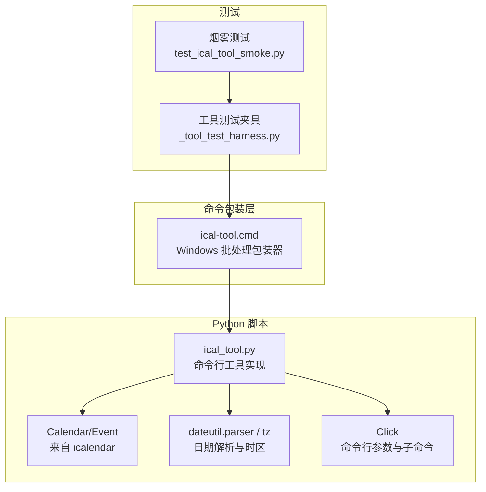
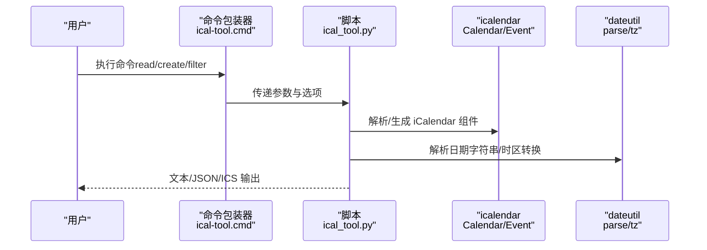
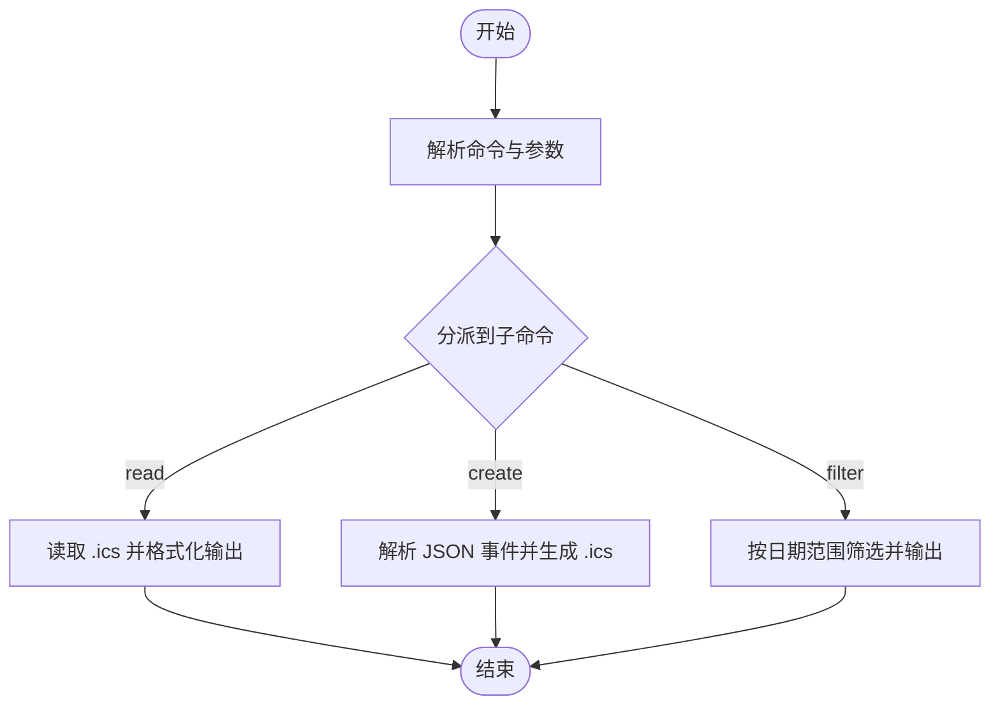
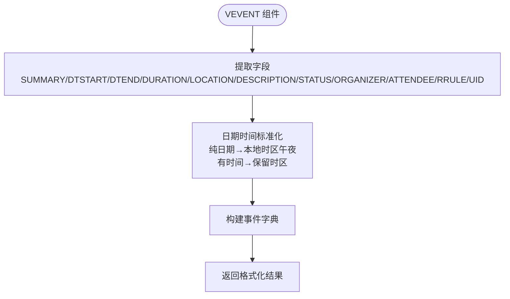
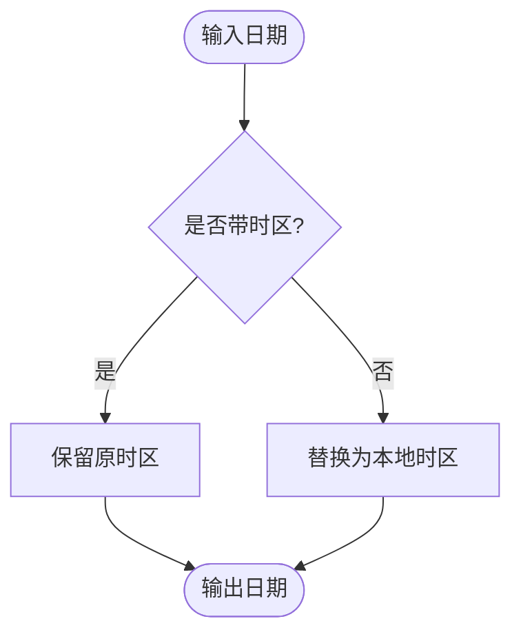
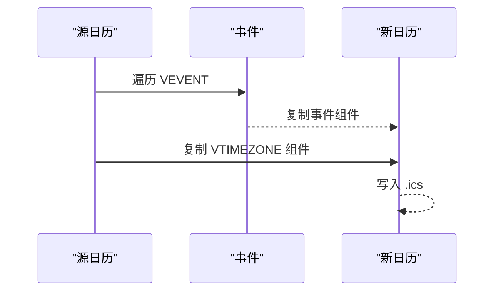
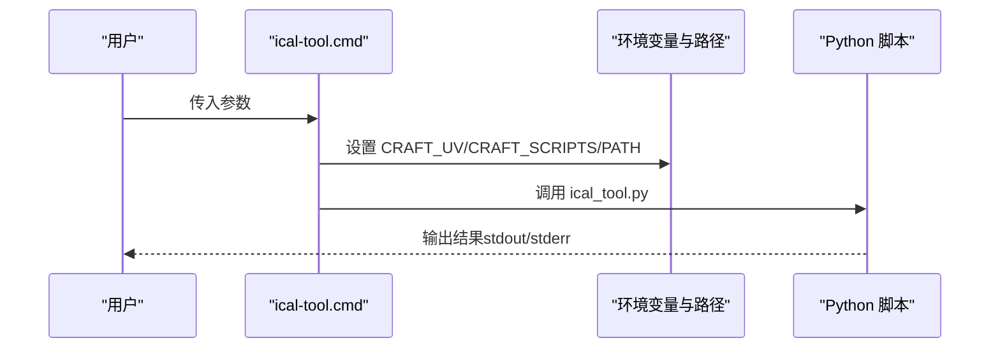
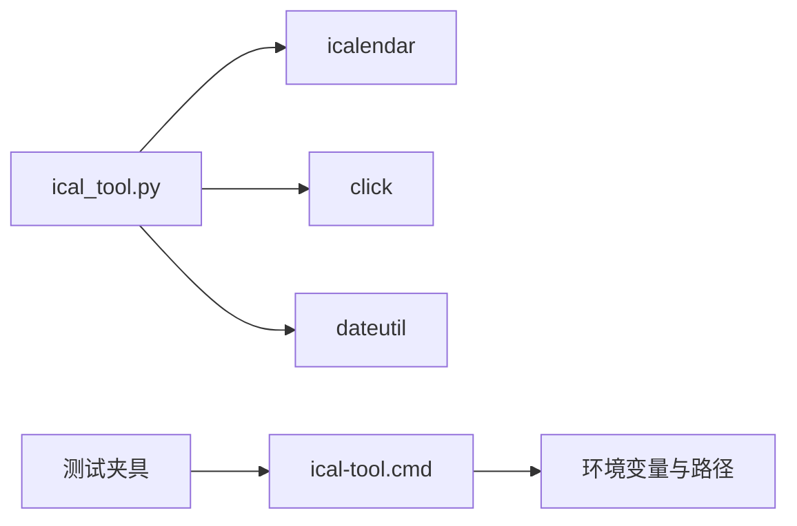

# 日历转换器

<cite>
**本文引用的文件**
- [ical_tool.py](file://apps/electron/resources/scripts/ical_tool.py)
- [ical-tool.cmd](file://apps/electron/resources/bin/ical-tool.cmd)
- [_tool_test_harness.py](file://apps/electron/resources/scripts/tests/_tool_test_harness.py)
- [test_ical_tool_smoke.py](file://apps/electron/resources/scripts/tests/test_ical_tool_smoke.py)
</cite>

## 目录
1. [简介](#简介)
2. [项目结构](#项目结构)
3. [核心组件](#核心组件)
4. [架构总览](#架构总览)
5. [详细组件分析](#详细组件分析)
6. [依赖关系分析](#依赖关系分析)
7. [性能考虑](#性能考虑)
8. [故障排查指南](#故障排查指南)
9. [结论](#结论)
10. [附录](#附录)

## 简介
本文件为 iCal 日历转换器的技术文档，聚焦于基于 icalendar 库的日历事件解析与转换能力，涵盖以下主题：
- 命令行接口设计与参数处理
- iCalendar 格式解析、事件提取、日期时间处理与元数据读取
- 时区处理机制与本地化策略
- 重复规则（RRULE）解析与导出
- 输出格式控制（文本、JSON、ICS）
- 性能优化与扩展建议
- 自定义转换器开发指南与兼容性保障

该工具以 Python 脚本为核心，通过 Click 提供命令行入口，并借助 icalendar 与 python-dateutil 完成 iCalendar 文件的读写与解析。

## 项目结构
围绕 iCal 转换器的相关文件组织如下：
- 命令包装层：Windows 批处理包装器，用于调用 Python 脚本
- Python 脚本：实现 read/create/filter 三大命令，负责 iCalendar 解析、事件格式化、过滤与生成
- 测试框架与用例：提供工具运行环境构建、命令执行与断言

图表来源
- [ical-tool.cmd:1-3](file://apps/electron/resources/bin/ical-tool.cmd#L1-L3)
- [ical_tool.py:1-373](file://apps/electron/resources/scripts/ical_tool.py#L1-L373)
- [_tool_test_harness.py:1-83](file://apps/electron/resources/scripts/tests/_tool_test_harness.py#L1-L83)
- [test_ical_tool_smoke.py:1-71](file://apps/electron/resources/scripts/tests/test_ical_tool_smoke.py#L1-L71)

章节来源
- [ical-tool.cmd:1-3](file://apps/electron/resources/bin/ical-tool.cmd#L1-L3)
- [ical_tool.py:1-373](file://apps/electron/resources/scripts/ical_tool.py#L1-L373)
- [_tool_test_harness.py:1-83](file://apps/electron/resources/scripts/tests/_tool_test_harness.py#L1-L83)
- [test_ical_tool_smoke.py:1-71](file://apps/electron/resources/scripts/tests/test_ical_tool_smoke.py#L1-L71)

## 核心组件
- 命令组与子命令
  - read：从 .ics 文件读取并展示事件，支持 JSON/文本输出
  - create：从 JSON 事件数组生成 .ics 文件，支持日期/日期时间输入
  - filter：按起止日期筛选事件，支持 JSON/文本/ICS 输出
- 数据模型与字段映射
  - 事件字段：摘要、开始/结束时间、地点、描述、状态、组织者、出席者、重复规则、UID
  - 日历元数据：产品标识、版本、日历名称
- 日期时间处理
  - 识别纯日期字符串（无时间部分），统一转换为本地时区的午夜时刻
  - 对带时区信息的日期时间进行解析与本地化
- 时区策略
  - 默认使用本地时区（tzlocal），确保边界与事件时间一致性
  - 过滤时对边界与事件时间均应用本地时区
- 重复规则
  - 读取并原样导出 RRULE 字段，保持 iCalendar 兼容性

章节来源
- [ical_tool.py:58-111](file://apps/electron/resources/scripts/ical_tool.py#L58-L111)
- [ical_tool.py:119-170](file://apps/electron/resources/scripts/ical_tool.py#L119-L170)
- [ical_tool.py:172-278](file://apps/electron/resources/scripts/ical_tool.py#L172-L278)
- [ical_tool.py:280-369](file://apps/electron/resources/scripts/ical_tool.py#L280-L369)

## 架构总览
整体流程分为“输入解析—事件提取—格式化输出”三段式，结合 Click 的命令分发与 icalendar 的组件遍历，形成清晰的职责划分。

图表来源
- [ical-tool.cmd:1-3](file://apps/electron/resources/bin/ical-tool.cmd#L1-L3)
- [ical_tool.py:113-373](file://apps/electron/resources/scripts/ical_tool.py#L113-L373)

## 详细组件分析

### 命令行接口与参数处理
- 子命令
  - read：读取 .ics 文件，支持 --format=json|text 与 -o 输出路径
  - create：接收 JSON 字符串或文件路径，生成 .ics；支持 --cal-name 指定日历名
  - filter：按 --start/--end 过滤事件，支持 --format=json|text|ics
- 参数校验与错误处理
  - JSON 输入存在性检查与解码失败处理
  - 事件数组格式校验
  - 异常捕获并返回非零退出码

图表来源
- [ical_tool.py:113-373](file://apps/electron/resources/scripts/ical_tool.py#L113-L373)

章节来源
- [ical_tool.py:119-170](file://apps/electron/resources/scripts/ical_tool.py#L119-L170)
- [ical_tool.py:172-278](file://apps/electron/resources/scripts/ical_tool.py#L172-L278)
- [ical_tool.py:280-369](file://apps/electron/resources/scripts/ical_tool.py#L280-L369)

### 事件解析与格式化
- 事件字段提取
  - 必填：摘要（SUMMARY）
  - 可选：开始/结束（DTSTART/DTEND）、持续时间（DURATION）、地点（LOCATION）、描述（DESCRIPTION）、状态（STATUS）、组织者（ORGANIZER）、出席者（ATTENDEE）、重复规则（RRULE）、UID
- 日期时间标准化
  - 纯日期字符串统一转为本地时区的 datetime（午夜）
  - 带时区信息的日期时间保留时区
- 输出字典结构
  - 包含索引、摘要、开始/结束、持续时间、地点、描述、状态、组织者、出席者、重复规则、UID 等键

图表来源
- [ical_tool.py:58-111](file://apps/electron/resources/scripts/ical_tool.py#L58-L111)

章节来源
- [ical_tool.py:58-111](file://apps/electron/resources/scripts/ical_tool.py#L58-L111)

### 时区处理机制
- 默认策略
  - 使用本地时区（tzlocal）作为默认时区，确保边界与事件时间在同一体系下比较
- 处理细节
  - 读取与过滤时，若日期对象无时区信息，则替换为本地时区
  - 创建事件时，若开始/结束时间无时区信息，则补全为本地时区
- 注意事项
  - 本地时区依赖系统设置，跨时区场景建议显式提供带时区的时间戳
  - 重复规则中的时区信息由源日历决定，导出时复制 VTIMEZONE 组件以维持兼容性

图表来源
- [ical_tool.py:42-56](file://apps/electron/resources/scripts/ical_tool.py#L42-L56)
- [ical_tool.py:292-299](file://apps/electron/resources/scripts/ical_tool.py#L292-L299)
- [ical_tool.py:319-321](file://apps/electron/resources/scripts/ical_tool.py#L319-L321)

章节来源
- [ical_tool.py:42-56](file://apps/electron/resources/scripts/ical_tool.py#L42-L56)
- [ical_tool.py:292-299](file://apps/electron/resources/scripts/ical_tool.py#L292-L299)
- [ical_tool.py:319-321](file://apps/electron/resources/scripts/ical_tool.py#L319-L321)

### 重复规则解析与导出
- 读取：从 RRULE 属性中获取原始规则字符串
- 导出：在 filter --format=ics 时，复制源日历中的 VTIMEZONE 组件，确保时区规则完整
- 建议：如需展开重复事件，请在外部使用支持 RRule 展开的库（例如 dateutil.rrule），并在本工具基础上二次处理

图表来源
- [ical_tool.py:329-338](file://apps/electron/resources/scripts/ical_tool.py#L329-L338)

章节来源
- [ical_tool.py:102-104](file://apps/electron/resources/scripts/ical_tool.py#L102-L104)
- [ical_tool.py:329-338](file://apps/electron/resources/scripts/ical_tool.py#L329-L338)

### 输出格式控制
- read
  - text：输出人类可读的摘要、时间、地点、描述、重复规则等
  - json：输出结构化的事件数组与日历元数据
- filter
  - text：输出筛选后的摘要与时间
  - json：输出筛选统计与事件数组
  - ics：输出新的 .ics 文件，包含匹配事件与 VTIMEZONE
- create
  - 输出 .ics 字节流或写入文件

章节来源
- [ical_tool.py:139-166](file://apps/electron/resources/scripts/ical_tool.py#L139-L166)
- [ical_tool.py:340-364](file://apps/electron/resources/scripts/ical_tool.py#L340-L364)
- [ical_tool.py:265-270](file://apps/electron/resources/scripts/ical_tool.py#L265-L270)

### 命令执行链路（CLI → 脚本）

图表来源
- [ical-tool.cmd:1-3](file://apps/electron/resources/bin/ical-tool.cmd#L1-L3)
- [_tool_test_harness.py:58-68](file://apps/electron/resources/scripts/tests/_tool_test_harness.py#L58-L68)

章节来源
- [ical-tool.cmd:1-3](file://apps/electron/resources/bin/ical-tool.cmd#L1-L3)
- [_tool_test_harness.py:58-68](file://apps/electron/resources/scripts/tests/_tool_test_harness.py#L58-L68)

## 依赖关系分析
- 外部库
  - icalendar：解析与生成 iCalendar
  - click：命令行参数与子命令
  - python-dateutil：日期解析与本地时区
- 内部依赖
  - 命令包装器依赖环境变量与路径配置
  - 测试夹具负责解析平台键、定位 uv 二进制与工具包装器

图表来源
- [ical_tool.py:1-373](file://apps/electron/resources/scripts/ical_tool.py#L1-L373)
- [ical-tool.cmd:1-3](file://apps/electron/resources/bin/ical-tool.cmd#L1-L3)
- [_tool_test_harness.py:1-83](file://apps/electron/resources/scripts/tests/_tool_test_harness.py#L1-L83)

章节来源
- [ical_tool.py:1-373](file://apps/electron/resources/scripts/ical_tool.py#L1-L373)
- [ical-tool.cmd:1-3](file://apps/electron/resources/bin/ical-tool.cmd#L1-L3)
- [_tool_test_harness.py:1-83](file://apps/electron/resources/scripts/tests/_tool_test_harness.py#L1-L83)

## 性能考虑
- I/O 与内存
  - read/filter 在单次遍历中完成事件提取与筛选，避免多次文件读取
  - create 逐条构建事件，适合中小规模日历；大规模日历时建议批量写入与分块处理
- 日期解析
  - 使用 dateutil.parser 与 tzlocal，解析成本较低；对大量重复字符串可考虑缓存解析结果
- 输出
  - JSON 输出采用标准库 dumps，注意大对象序列化时的内存占用
- 时区处理
  - 本地时区统一策略减少比较误差，但可能引入额外的时区转换成本；如需高性能可预计算本地时区偏移

## 故障排查指南
- 常见问题
  - 输入不是有效 .ics：read 命令会返回错误并退出非零码
  - JSON 不合法或格式错误：create 命令会提示解析失败
  - 缺少必需参数：Click 将显示帮助信息并退出
- 排查步骤
  - 确认 .ics 文件可读且符合 iCalendar 规范
  - 确认 JSON 事件数组结构正确（数组、对象字段齐全）
  - 检查命令包装器与环境变量（CRAFT_UV/CRAFT_SCRIPTS/PATH）是否正确设置
- 单元测试参考
  - 烟雾测试覆盖 create/read/filter 的基本链路，可作为回归验证的基础

章节来源
- [ical_tool.py:167-169](file://apps/electron/resources/scripts/ical_tool.py#L167-L169)
- [ical_tool.py:272-277](file://apps/electron/resources/scripts/ical_tool.py#L272-L277)
- [test_ical_tool_smoke.py:60-66](file://apps/electron/resources/scripts/tests/test_ical_tool_smoke.py#L60-L66)

## 结论
本工具以简洁的命令行接口与稳定的第三方库组合，实现了 iCalendar 文件的读取、创建与筛选，并在日期时间与时区处理上采用本地化策略，兼顾易用性与兼容性。对于更复杂的重复事件展开与多时区转换需求，可在现有基础上扩展外部库或二次处理流程。

## 附录

### 命令速查
- read
  - 功能：读取 .ics 并输出事件摘要
  - 关键参数：--format=text|json，-o 输出路径
- create
  - 功能：从 JSON 事件数组生成 .ics
  - 关键参数：--data JSON 或文件路径，--cal-name 日历名，-o 输出路径
- filter
  - 功能：按日期范围筛选事件
  - 关键参数：--start/--end，--format=text|json|ics，-o 输出路径

章节来源
- [ical_tool.py:119-170](file://apps/electron/resources/scripts/ical_tool.py#L119-L170)
- [ical_tool.py:172-278](file://apps/electron/resources/scripts/ical_tool.py#L172-L278)
- [ical_tool.py:280-369](file://apps/electron/resources/scripts/ical_tool.py#L280-L369)

### 自定义转换器开发指南
- 基础步骤
  - 选择语言与库：推荐 Python + icalendar/dateutil
  - 设计命令集：read/create/filter 三件套，支持 JSON/文本/ICS 输出
  - 实现事件字段映射：SUMMARY/DTSTART/DTEND/DURATION/LOCATION/DESCRIPTION/STATUS/ORGANIZER/ATTENDEE/RRULE/UID
  - 处理日期时间：区分纯日期与日期时间，统一本地时区策略
  - 时区兼容：复制 VTIMEZONE 组件，确保 RRULE 与 TZ 规则一致
- 兼容性与质量保证
  - 使用单元测试覆盖边界条件（空值、非法输入、缺失字段）
  - 对照 RFC 5545 与 iCalendar 规范，确保属性顺序与编码合规
  - 提供示例 .ics 与 JSON，便于手工验证与回归测试
- 性能优化建议
  - 批量处理：合并多次 I/O 操作
  - 增量更新：仅对变更事件重新生成组件
  - 缓存解析：对重复出现的日期字符串进行缓存