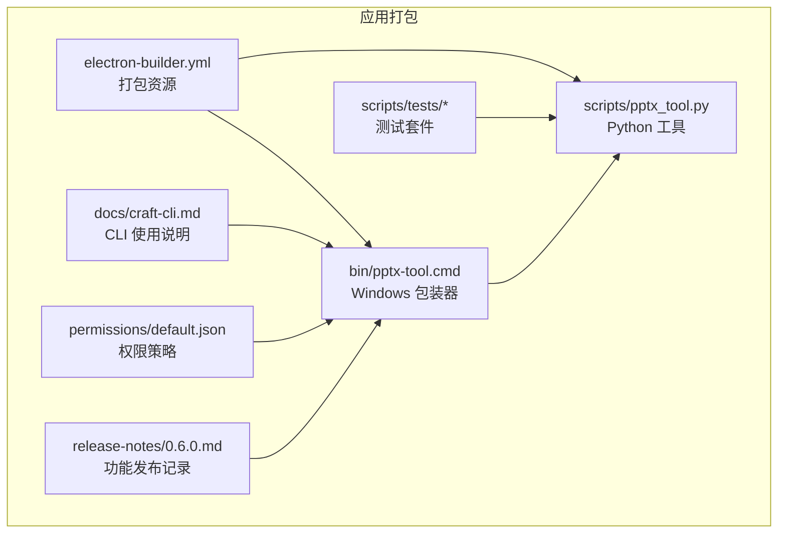
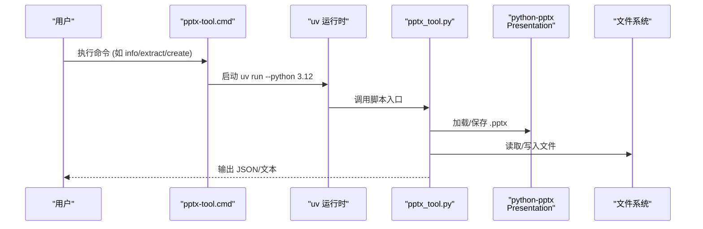
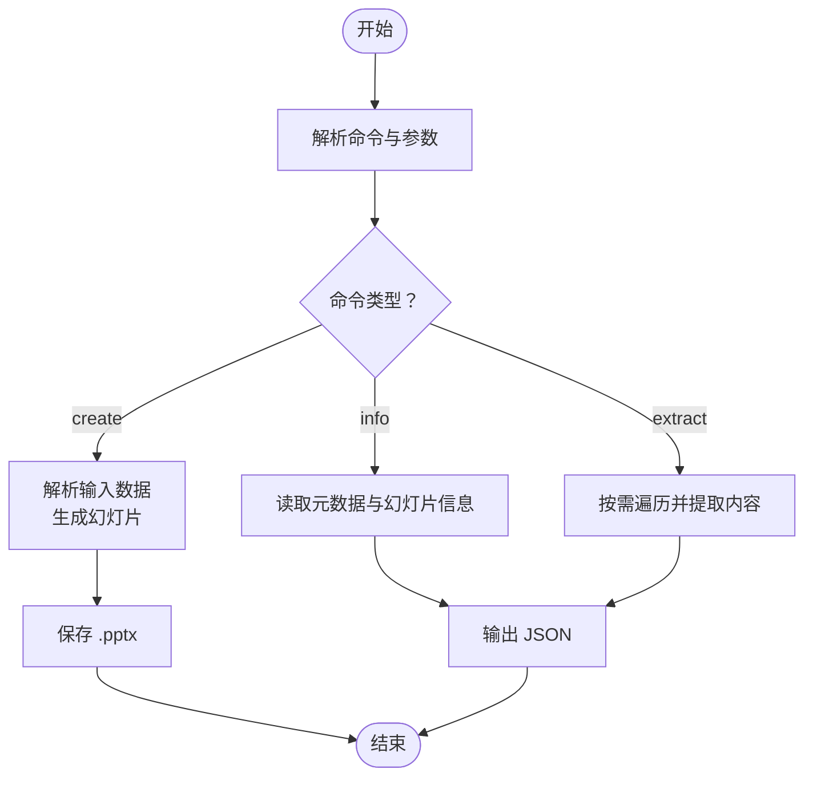
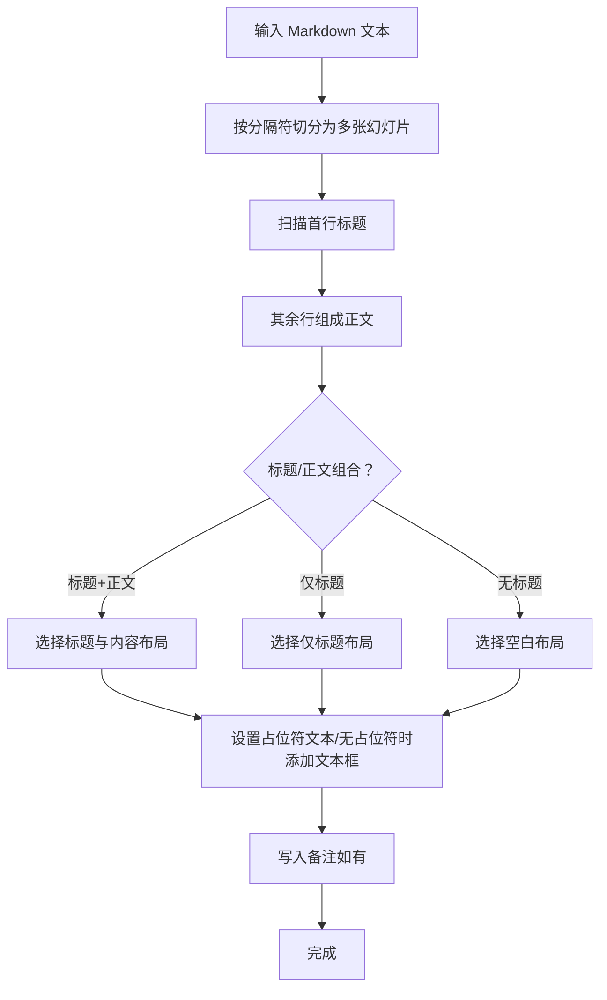
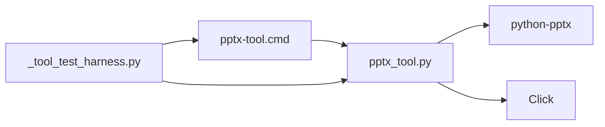

# 演示文稿转换器

<cite>
**本文引用的文件**
- [pptx_tool.py](file://apps/electron/resources/scripts/pptx_tool.py)
- [pptx-tool.cmd](file://apps/electron/resources/bin/pptx-tool.cmd)
- [test_pptx_tool_smoke.py](file://apps/electron/resources/scripts/tests/test_pptx_tool_smoke.py)
- [_tool_test_harness.py](file://apps/electron/resources/scripts/tests/_tool_test_harness.py)
- [craft-cli.md](file://apps/electron/resources/docs/craft-cli.md)
- [system.ts](file://packages/shared/src/prompts/system.ts)
- [electron-builder.yml](file://apps/electron/electron-builder.yml)
- [default.json](file://apps/electron/resources/permissions/default.json)
- [0.6.0.md](file://apps/electron/resources/release-notes/0.6.0.md)
</cite>

## 目录
1. [简介](#简介)
2. [项目结构](#项目结构)
3. [核心组件](#核心组件)
4. [架构总览](#架构总览)
5. [详细组件分析](#详细组件分析)
6. [依赖关系分析](#依赖关系分析)
7. [性能考虑](#性能考虑)
8. [故障排查指南](#故障排查指南)
9. [结论](#结论)
10. [附录](#附录)

## 简介
本文件为演示文稿转换器的技术文档，聚焦于 PowerPoint (.pptx) 的命令行处理能力：创建、信息查询与内容提取。该工具基于 python-pptx 库实现，通过 Click 提供命令行接口，并在 Windows 上由批处理包装器调用 uv 运行时执行。文档涵盖以下主题：
- 使用 python-pptx 的方式与幻灯片解析算法
- 内容提取机制（文本、表格、备注）
- 样式应用与布局选择策略
- 命令行接口设计、参数处理与输出格式控制
- 演示文稿结构分析、幻灯片遍历、文本提取、图片处理与布局信息
- 性能优化、内存管理与批量处理建议
- 自定义转换器开发指南、格式兼容性与质量保障方法

## 项目结构
演示文稿转换器位于 Electron 资源目录中，采用“脚本 + 包装器 + 测试”的组织方式：
- 脚本层：Python 实现的命令行工具，负责解析输入、操作 Presentation 对象、输出结果
- 包装器层：Windows 批处理脚本，通过 uv 运行 Python 脚本
- 测试层：单元测试与工具测试夹具，验证端到端流程
- 配置与打包：electron-builder 将包装器与脚本打包进应用；权限策略限制工具调用范围

**图表来源**
- [electron-builder.yml:45-46](file://apps/electron/electron-builder.yml#L45-L46)
- [pptx-tool.cmd:1-3](file://apps/electron/resources/bin/pptx-tool.cmd#L1-L3)
- [pptx_tool.py:1-365](file://apps/electron/resources/scripts/pptx_tool.py#L1-L365)
- [craft-cli.md:1-396](file://apps/electron/resources/docs/craft-cli.md#L1-L396)
- [default.json:92-100](file://apps/electron/resources/permissions/default.json#L92-L100)
- [0.6.0.md:24-24](file://apps/electron/resources/release-notes/0.6.0.md#L24-L24)

**章节来源**
- [pptx_tool.py:1-365](file://apps/electron/resources/scripts/pptx_tool.py#L1-L365)
- [pptx-tool.cmd:1-3](file://apps/electron/resources/bin/pptx-tool.cmd#L1-L3)
- [craft-cli.md:1-396](file://apps/electron/resources/docs/craft-cli.md#L1-L396)
- [electron-builder.yml:45-46](file://apps/electron/electron-builder.yml#L45-L46)
- [default.json:92-100](file://apps/electron/resources/permissions/default.json#L92-L100)
- [0.6.0.md:24-24](file://apps/electron/resources/release-notes/0.6.0.md#L24-L24)

## 核心组件
- 命令组与子命令
  - create：从 Markdown/JSON 文本创建演示文稿，支持标题幻灯片与模板
  - info：输出元数据与每张幻灯片的布局、形状数量、备注存在性等
  - extract：按需提取指定幻灯片或全量提取文本、表格与备注
- 输入解析与数据准备
  - 支持从文件、内联文本或 JSON 字符串读取内容
  - Markdown 幻灯片以分隔线切分，标题识别与正文提取
  - JSON 支持本地文件路径或直接字符串，数组形式的幻灯片对象
- 输出控制
  - 可将结果写入文件或标准输出
  - info/extract 输出 JSON 或文本，便于后续处理

**章节来源**
- [pptx_tool.py:31-365](file://apps/electron/resources/scripts/pptx_tool.py#L31-L365)

## 架构总览
下图展示命令行工具的调用链路与核心模块交互：

**图表来源**
- [pptx-tool.cmd:1-3](file://apps/electron/resources/bin/pptx-tool.cmd#L1-L3)
- [pptx_tool.py:1-365](file://apps/electron/resources/scripts/pptx_tool.py#L1-L365)

## 详细组件分析

### 命令行接口与参数处理
- create 子命令
  - 参数：输入来源（文件/内联/JSON）、标题、模板、输出路径
  - 行为：根据来源解析为幻灯片数据，可选添加标题幻灯片，逐条生成内容幻灯片并保存
- info 子命令
  - 参数：输入 .pptx 文件、输出目标
  - 行为：统计幻灯片数量、尺寸、可用布局，枚举每张幻灯片的编号、布局名、标题、形状数、备注存在性
- extract 子命令
  - 参数：输入 .pptx、可选单张幻灯片号、是否包含备注、输出目标
  - 行为：遍历幻灯片，提取标题、文本段落（保留缩进层级）、表格内容、备注文本

**图表来源**
- [pptx_tool.py:37-365](file://apps/electron/resources/scripts/pptx_tool.py#L37-L365)

**章节来源**
- [pptx_tool.py:37-365](file://apps/electron/resources/scripts/pptx_tool.py#L37-L365)

### 幻灯片解析与内容提取算法
- Markdown 切分与标题识别
  - 使用分隔符切分多张幻灯片
  - 正则匹配标题行，首行标题作为幻灯片标题
  - 其余文本组成正文，按行处理并保留空行
- 内容幻灯片生成
  - 根据是否存在标题与正文选择布局：标题与内容、仅标题、空白
  - 文本框填充：无占位符时动态添加文本框；支持列表与编号项、缩进层级
  - 备注：写入备注区
- 提取算法
  - 遍历 shapes：跳过标题形状，提取每个段落文本并按层级缩进
  - 表格：遍历行列，拼接单元格文本
  - 备注：按需包含

**图表来源**
- [pptx_tool.py:114-246](file://apps/electron/resources/scripts/pptx_tool.py#L114-L246)

**章节来源**
- [pptx_tool.py:114-246](file://apps/electron/resources/scripts/pptx_tool.py#L114-L246)
- [pptx_tool.py:300-361](file://apps/electron/resources/scripts/pptx_tool.py#L300-L361)

### 样式应用与布局信息
- 布局选择
  - 标题与内容布局：适合有标题与正文的幻灯片
  - 仅标题布局：仅标题场景
  - 空白布局：无占位符时自动添加文本框
- 缩进与层级
  - 通过段落级别（level）控制缩进层级，支持有序/无序列表
- 图片处理
  - 当前实现未涉及图片提取或处理逻辑；如需图片导出，可在现有框架上扩展 shapes 遍历，识别图片形状并导出

**章节来源**
- [pptx_tool.py:165-246](file://apps/electron/resources/scripts/pptx_tool.py#L165-L246)

### 命令行包装器与运行时
- Windows 包装器
  - 通过环境变量传递 uv 可执行路径与脚本目录，确保跨平台一致运行
- 权限与安全
  - 默认权限策略限制对工具的调用模式，仅允许特定命令组合
- 打包与分发
  - electron-builder 将包装器与脚本打包进应用，便于分发与部署

**章节来源**
- [pptx-tool.cmd:1-3](file://apps/electron/resources/bin/pptx-tool.cmd#L1-L3)
- [default.json:92-100](file://apps/electron/resources/permissions/default.json#L92-L100)
- [electron-builder.yml:45-46](file://apps/electron/electron-builder.yml#L45-L46)

### 端到端测试与验证
- 测试夹具
  - 解析平台键、定位 uv、构建环境变量，统一运行工具
- 烟雾测试
  - create → info → extract 的完整链路验证
  - 错误场景：无效幻灯片号返回非零退出码并输出错误信息

**章节来源**
- [_tool_test_harness.py:1-83](file://apps/electron/resources/scripts/tests/_tool_test_harness.py#L1-L83)
- [test_pptx_tool_smoke.py:1-61](file://apps/electron/resources/scripts/tests/test_pptx_tool_smoke.py#L1-L61)

## 依赖关系分析
- 外部依赖
  - python-pptx：核心库，提供 Presentation、Slide、Shape、TextFrame 等对象模型
  - Click：命令行参数与子命令框架
- 内部耦合
  - 脚本与包装器之间通过环境变量解耦
  - 测试夹具与脚本通过统一的运行接口对接

**图表来源**
- [pptx_tool.py:1-365](file://apps/electron/resources/scripts/pptx_tool.py#L1-L365)
- [pptx-tool.cmd:1-3](file://apps/electron/resources/bin/pptx-tool.cmd#L1-L3)
- [_tool_test_harness.py:1-83](file://apps/electron/resources/scripts/tests/_tool_test_harness.py#L1-L83)

**章节来源**
- [pptx_tool.py:1-365](file://apps/electron/resources/scripts/pptx_tool.py#L1-L365)
- [pptx-tool.cmd:1-3](file://apps/electron/resources/bin/pptx-tool.cmd#L1-L3)
- [_tool_test_harness.py:1-83](file://apps/electron/resources/scripts/tests/_tool_test_harness.py#L1-L83)

## 性能考虑
- 内存管理
  - 使用 Presentation 对象一次性加载/保存，避免重复打开文件
  - 在提取阶段按需遍历，减少中间结构体大小
- I/O 优化
  - 输出优先写入文件而非频繁打印到终端，降低 stdout 压力
- 批量处理建议
  - 将多个 .pptx 文件放入队列，顺序处理并在完成后统一报告
  - 对大文件可先执行 info 获取元数据，再按需提取特定幻灯片
- 并发与并行
  - 当前实现为同步流程；若需并发，可引入进程池对不同文件并行处理，注意避免同时写入同一输出目录

[本节为通用指导，不直接分析具体文件]

## 故障排查指南
- 常见错误与提示
  - JSON 解析失败：检查 JSON 结构是否为数组，字段是否正确
  - 模板无布局：模板文件缺少 slide_layouts，导致无法选择布局
  - 幻灯片索引越界：extract 的 --slide 参数超出范围
- 定位步骤
  - 使用 info 命令确认幻灯片数量与布局名称
  - 逐步缩小输入范围（如先 --slide 1 验证），再扩大到全量
  - 检查权限策略是否允许调用对应命令
- 单元测试参考
  - 烟雾测试覆盖了 create → info → extract 的主流程与边界条件

**章节来源**
- [pptx_tool.py:55-111](file://apps/electron/resources/scripts/pptx_tool.py#L55-L111)
- [pptx_tool.py:312-317](file://apps/electron/resources/scripts/pptx_tool.py#L312-L317)
- [test_pptx_tool_smoke.py:25-56](file://apps/electron/resources/scripts/tests/test_pptx_tool_smoke.py#L25-L56)

## 结论
演示文稿转换器以简洁的命令行接口与清晰的数据流实现了 PowerPoint 的创建、信息查询与内容提取。其基于 python-pptx 的稳定实现，结合 Click 的参数处理与 Windows 包装器，提供了跨平台可用的工具链。当前版本专注于文本与表格内容的提取与生成，未来可扩展图片处理与更丰富的样式应用。

[本节为总结性内容，不直接分析具体文件]

## 附录

### 命令速查与使用建议
- 创建演示文稿
  - 从 Markdown/JSON 文本创建，支持标题幻灯片与模板
- 查询信息
  - 获取元数据、布局、形状与备注信息
- 提取内容
  - 支持按单张或全量提取，可选择是否包含备注

**章节来源**
- [pptx_tool.py:37-365](file://apps/electron/resources/scripts/pptx_tool.py#L37-L365)
- [craft-cli.md:1-396](file://apps/electron/resources/docs/craft-cli.md#L1-L396)
- [system.ts:1068-1068](file://packages/shared/src/prompts/system.ts#L1068-L1068)

### 发布与集成信息
- 工具随应用发布，首次启动会同步相关资源
- 版本记录显示该工具在特定版本中新增

**章节来源**
- [0.6.0.md:24-24](file://apps/electron/resources/release-notes/0.6.0.md#L24-L24)