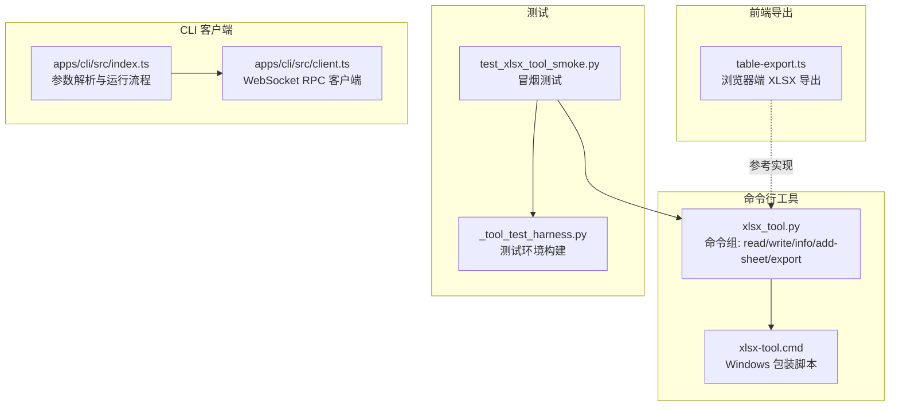
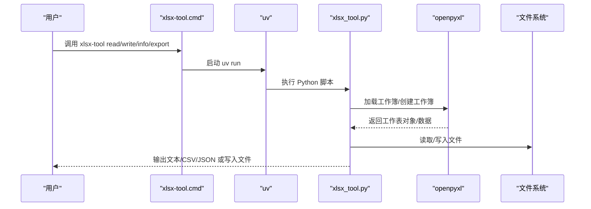
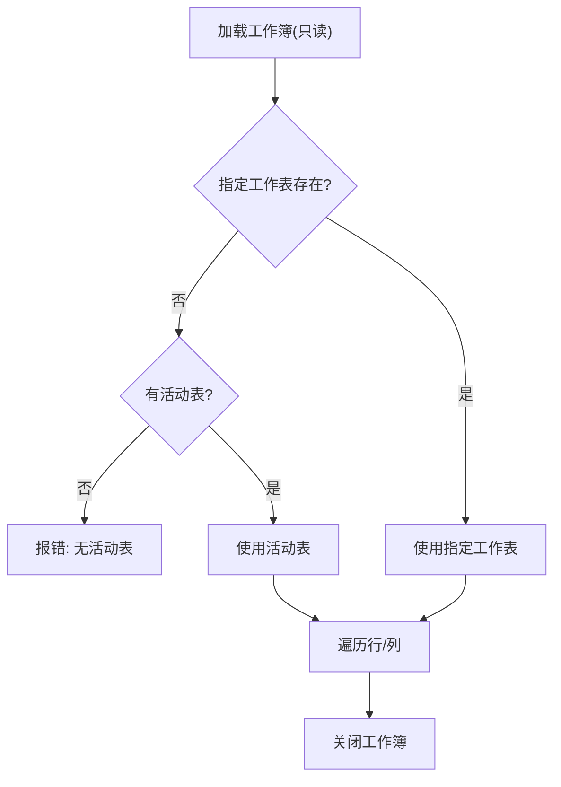
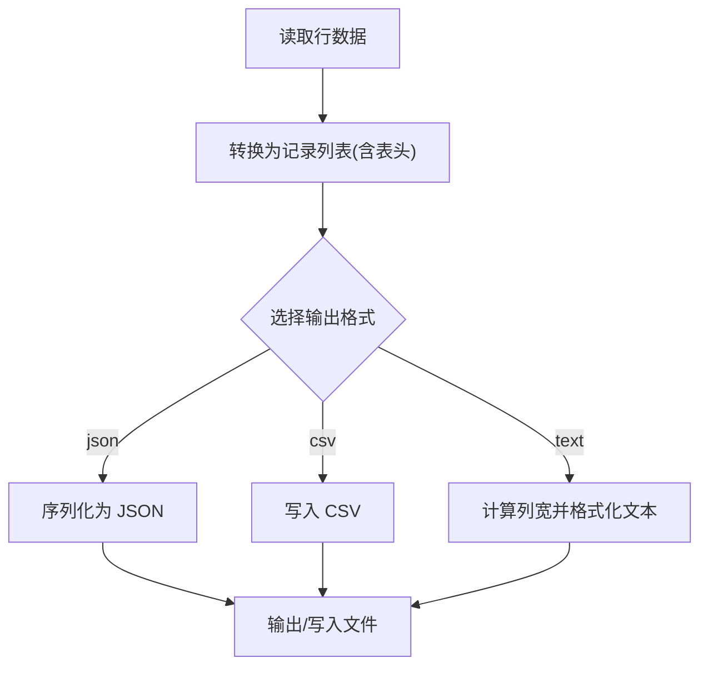
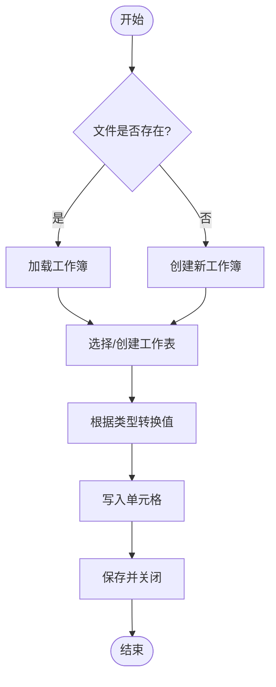
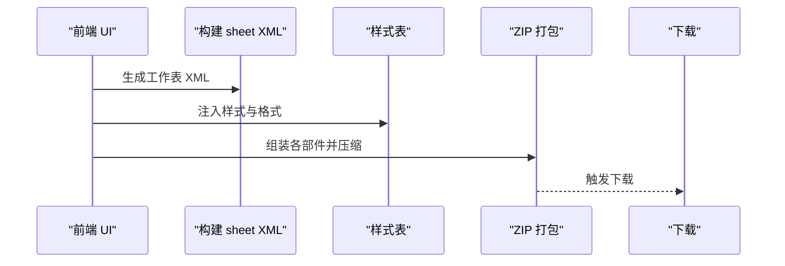
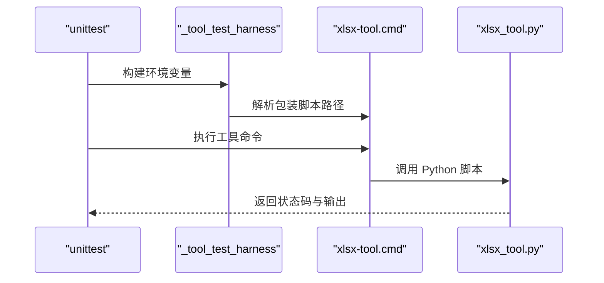
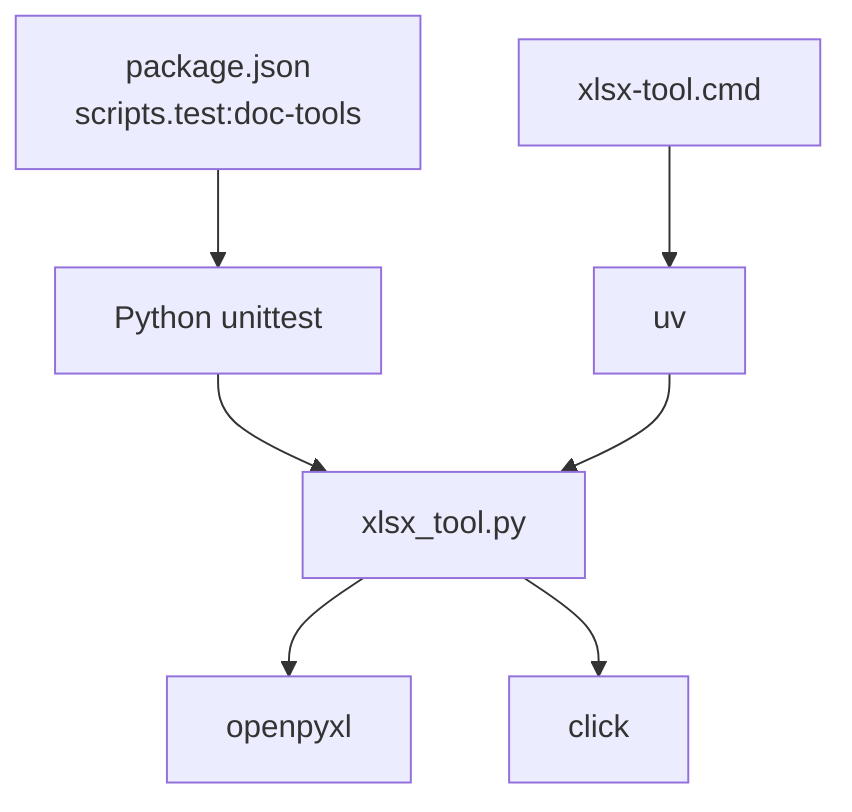

# 电子表格转换器

<cite>
**本文引用的文件**
- [xlsx_tool.py](file://apps/electron/resources/scripts/xlsx_tool.py)
- [xlsx-tool.cmd](file://apps/electron/resources/bin/xlsx-tool.cmd)
- [test_xlsx_tool_smoke.py](file://apps/electron/resources/scripts/tests/test_xlsx_tool_smoke.py)
- [_tool_test_harness.py](file://apps/electron/resources/scripts/tests/_tool_test_harness.py)
- [table-export.ts](file://packages/ui/src/components/markdown/table-export.ts)
- [index.ts](file://apps/cli/src/index.ts)
- [client.ts](file://apps/cli/src/client.ts)
- [package.json](file://package.json)
- [README.md](file://README.md)
</cite>

## 目录
1. [简介](#简介)
2. [项目结构](#项目结构)
3. [核心组件](#核心组件)
4. [架构总览](#架构总览)
5. [详细组件分析](#详细组件分析)
6. [依赖关系分析](#依赖关系分析)
7. [性能考虑](#性能考虑)
8. [故障排查指南](#故障排查指南)
9. [结论](#结论)
10. [附录](#附录)

## 简介
本文件为“电子表格转换器”的技术文档，聚焦于基于 openpyxl 的 XLSX 电子表格处理能力与命令行工具链。内容涵盖：
- openpyxl 使用方式与工作簿解析算法
- 单元格数据提取机制与数据类型处理
- 公式处理现状与限制
- 命令行接口设计、参数校验与输出格式化
- 电子表格结构分析、工作表遍历、行列操作
- 性能优化策略、内存管理与大数据集处理技巧
- 自定义转换器开发指南、格式兼容性与质量保障方法

该工具链由 Python 脚本提供核心读写与导出能力，并通过 Windows 批处理包装在不同平台统一调用；同时，项目内还包含浏览器端直接生成 XLSX 的前端导出逻辑，便于理解完整生态。

## 项目结构
围绕 XLSX 转换器的关键文件与模块如下：
- 命令行工具：Python 脚本提供 read、write、info、add-sheet、export 等子命令
- 平台包装：Windows 下通过批处理脚本统一调用 uv 运行 Python 工具
- 测试框架：基于 unittest 的冒烟测试，验证写入、读取、信息查询、导出与新增工作表
- 前端导出：浏览器端直接生成 XLSX 的 XML/ZIP 组合逻辑（用于对比与参考）
- CLI 客户端：与服务端交互的终端客户端（与 XLSX 工具解耦，但同属工具生态）

**图表来源**
- [xlsx_tool.py:117-372](file://apps/electron/resources/scripts/xlsx_tool.py#L117-L372)
- [xlsx-tool.cmd:1-3](file://apps/electron/resources/bin/xlsx-tool.cmd#L1-L3)
- [test_xlsx_tool_smoke.py:11-84](file://apps/electron/resources/scripts/tests/test_xlsx_tool_smoke.py#L11-L84)
- [_tool_test_harness.py:51-83](file://apps/electron/resources/scripts/tests/_tool_test_harness.py#L51-L83)
- [table-export.ts:198-261](file://packages/ui/src/components/markdown/table-export.ts#L198-L261)
- [index.ts:43-158](file://apps/cli/src/index.ts#L43-L158)
- [client.ts:38-240](file://apps/cli/src/client.ts#L38-L240)

**章节来源**
- [xlsx_tool.py:117-372](file://apps/electron/resources/scripts/xlsx_tool.py#L117-L372)
- [xlsx-tool.cmd:1-3](file://apps/electron/resources/bin/xlsx-tool.cmd#L1-L3)
- [test_xlsx_tool_smoke.py:11-84](file://apps/electron/resources/scripts/tests/test_xlsx_tool_smoke.py#L11-L84)
- [_tool_test_harness.py:51-83](file://apps/electron/resources/scripts/tests/_tool_test_harness.py#L51-L83)
- [table-export.ts:198-261](file://packages/ui/src/components/markdown/table-export.ts#L198-L261)
- [index.ts:43-158](file://apps/cli/src/index.ts#L43-L158)
- [client.ts:38-240](file://apps/cli/src/client.ts#L38-L240)

## 核心组件
- 命令行工具（xlsx_tool.py）
  - 提供 read、write、info、add-sheet、export 子命令
  - 支持只读模式加载工作簿、按范围读取、CSV/JSON/text 输出
  - 支持写入指定单元格、自动类型转换（字符串/数字/布尔）
  - 支持多工作表信息查询与导出
- 平台包装（xlsx-tool.cmd）
  - Windows 下通过 uv 运行 Python 脚本，确保 Python 3.12 环境
- 测试框架（test_xlsx_tool_smoke.py + _tool_test_harness.py）
  - 构建测试环境变量、定位 uv 二进制与包装脚本
  - 验证写入、读取、信息查询、导出与新增工作表的端到端流程
- 前端导出（table-export.ts）
  - 展示如何从表格数据生成 XLSX（XML + ZIP），可作为自定义转换器参考
- CLI 客户端（index.ts + client.ts）
  - 与服务端交互的终端客户端，虽不直接处理 XLSX，但体现参数解析与错误处理模式

**章节来源**
- [xlsx_tool.py:117-372](file://apps/electron/resources/scripts/xlsx_tool.py#L117-L372)
- [xlsx-tool.cmd:1-3](file://apps/electron/resources/bin/xlsx-tool.cmd#L1-L3)
- [test_xlsx_tool_smoke.py:11-84](file://apps/electron/resources/scripts/tests/test_xlsx_tool_smoke.py#L11-L84)
- [_tool_test_harness.py:51-83](file://apps/electron/resources/scripts/tests/_tool_test_harness.py#L51-L83)
- [table-export.ts:198-261](file://packages/ui/src/components/markdown/table-export.ts#L198-L261)
- [index.ts:43-158](file://apps/cli/src/index.ts#L43-L158)
- [client.ts:38-240](file://apps/cli/src/client.ts#L38-L240)

## 架构总览
下图展示 XLSX 工具的命令流与关键处理步骤：

**图表来源**
- [xlsx-tool.cmd:1-3](file://apps/electron/resources/bin/xlsx-tool.cmd#L1-L3)
- [xlsx_tool.py:126-179](file://apps/electron/resources/scripts/xlsx_tool.py#L126-L179)
- [xlsx_tool.py:188-234](file://apps/electron/resources/scripts/xlsx_tool.py#L188-L234)
- [xlsx_tool.py:242-274](file://apps/electron/resources/scripts/xlsx_tool.py#L242-L274)
- [xlsx_tool.py:322-371](file://apps/electron/resources/scripts/xlsx_tool.py#L322-L371)

## 详细组件分析

### 命令行接口与参数解析
- 参数解析采用顺序扫描与键值匹配，支持多种标志位与选项
- 关键参数包括：输入文件路径、工作表名、是否读取全部工作表、单元格范围、输出格式（text/csv/json）、输出文件路径等
- 对互斥选项进行显式校验（如 --all-sheets 与 --sheet 不可同时使用）

**图表来源**
- [xlsx_tool.py:129-133](file://apps/electron/resources/scripts/xlsx_tool.py#L129-L133)
- [xlsx_tool.py:286-299](file://apps/electron/resources/scripts/xlsx_tool.py#L286-L299)
- [xlsx_tool.py:325-329](file://apps/electron/resources/scripts/xlsx_tool.py#L325-L329)

**章节来源**
- [xlsx_tool.py:117-180](file://apps/electron/resources/scripts/xlsx_tool.py#L117-L180)
- [xlsx_tool.py:181-235](file://apps/electron/resources/scripts/xlsx_tool.py#L181-L235)
- [xlsx_tool.py:237-275](file://apps/electron/resources/scripts/xlsx_tool.py#L237-L275)
- [xlsx_tool.py:277-321](file://apps/electron/resources/scripts/xlsx_tool.py#L277-L321)
- [xlsx_tool.py:322-372](file://apps/electron/resources/scripts/xlsx_tool.py#L322-L372)

### 工作簿解析与工作表遍历
- 使用 openpyxl 的只读模式加载工作簿，避免大文件时的写锁与额外开销
- 支持按名称或活动表访问；当未指定工作表且无活动表时给出明确错误提示
- 支持计算维度（优先使用 dimensions，若不可用则回退 calculate_dimension）

**图表来源**
- [xlsx_tool.py:127-170](file://apps/electron/resources/scripts/xlsx_tool.py#L127-L170)
- [xlsx_tool.py:243-271](file://apps/electron/resources/scripts/xlsx_tool.py#L243-L271)

**章节来源**
- [xlsx_tool.py:45-51](file://apps/electron/resources/scripts/xlsx_tool.py#L45-L51)
- [xlsx_tool.py:127-170](file://apps/electron/resources/scripts/xlsx_tool.py#L127-L170)
- [xlsx_tool.py:243-271](file://apps/electron/resources/scripts/xlsx_tool.py#L243-L271)

### 单元格数据提取与格式化
- 行数据读取支持两种路径：按范围读取或全表迭代
- 将二维数组转换为记录列表（首行为表头），缺失值转为空字符串或占位符
- 输出格式化支持 text、csv、json；text 模式自动计算列宽并左对齐

**图表来源**
- [xlsx_tool.py:45-66](file://apps/electron/resources/scripts/xlsx_tool.py#L45-L66)
- [xlsx_tool.py:69-115](file://apps/electron/resources/scripts/xlsx_tool.py#L69-L115)

**章节来源**
- [xlsx_tool.py:45-66](file://apps/electron/resources/scripts/xlsx_tool.py#L45-L66)
- [xlsx_tool.py:69-115](file://apps/electron/resources/scripts/xlsx_tool.py#L69-L115)

### 写入与类型转换
- 支持写入指定单元格，若文件不存在则创建新工作簿
- 类型转换逻辑：字符串、整数、浮点数、布尔（大小写不敏感）
- 错误处理：非法数值会提示并退出

**图表来源**
- [xlsx_tool.py:193-234](file://apps/electron/resources/scripts/xlsx_tool.py#L193-L234)

**章节来源**
- [xlsx_tool.py:188-234](file://apps/electron/resources/scripts/xlsx_tool.py#L188-L234)

### 公式处理现状与限制
- 当前实现使用 data_only=True 读取单元格值，仅获取已计算结果，不解析公式表达式
- 若需保留公式或解析公式，可在 openpyxl 中切换为非 data_only 模式并读取内部公式存储结构，但会增加复杂度与性能成本

**章节来源**
- [xlsx_tool.py:127-127](file://apps/electron/resources/scripts/xlsx_tool.py#L127-L127)
- [xlsx_tool.py:200-200](file://apps/electron/resources/scripts/xlsx_tool.py#L200-L200)
- [xlsx_tool.py:323-323](file://apps/electron/resources/scripts/xlsx_tool.py#L323-L323)

### 前端导出参考（浏览器端）
- 前端通过构建 XLSX 的 XML 片段与样式表，再打包为 ZIP，最终触发下载
- 该实现展示了如何从表格数据生成 XLSX 的完整流程，可作为自定义转换器的参考模板

**图表来源**
- [table-export.ts:198-261](file://packages/ui/src/components/markdown/table-export.ts#L198-L261)

**章节来源**
- [table-export.ts:198-261](file://packages/ui/src/components/markdown/table-export.ts#L198-L261)

### 测试与验证
- 测试框架负责解析平台架构、定位 uv 与包装脚本、注入环境变量并执行工具
- 冒烟测试覆盖写入、读取、信息查询、导出与新增工作表，确保核心路径可用

**图表来源**
- [_tool_test_harness.py:51-83](file://apps/electron/resources/scripts/tests/_tool_test_harness.py#L51-L83)
- [test_xlsx_tool_smoke.py:18-36](file://apps/electron/resources/scripts/tests/test_xlsx_tool_smoke.py#L18-L36)

**章节来源**
- [_tool_test_harness.py:51-83](file://apps/electron/resources/scripts/tests/_tool_test_harness.py#L51-L83)
- [test_xlsx_tool_smoke.py:11-84](file://apps/electron/resources/scripts/tests/test_xlsx_tool_smoke.py#L11-L84)

## 依赖关系分析
- Python 依赖：openpyxl（版本约束为 3.1 到 4 之间）、click（命令行解析）
- 平台依赖：Windows 下通过 uv 确保 Python 3.12 环境
- 项目脚本：通过 package.json 的 test:doc-tools 调用 Python unittest 运行所有文档工具的冒烟测试

**图表来源**
- [package.json:41-41](file://package.json#L41-L41)
- [xlsx_tool.py:3-3](file://apps/electron/resources/scripts/xlsx_tool.py#L3-L3)
- [xlsx-tool.cmd:1-3](file://apps/electron/resources/bin/xlsx-tool.cmd#L1-L3)

**章节来源**
- [package.json:41-41](file://package.json#L41-L41)
- [xlsx_tool.py:3-3](file://apps/electron/resources/scripts/xlsx_tool.py#L3-L3)
- [xlsx-tool.cmd:1-3](file://apps/electron/resources/bin/xlsx-tool.cmd#L1-L3)

## 性能考虑
- 只读模式与 data_only=True：减少内存占用与 IO 开销，适合大文件读取
- 按范围读取：仅处理目标区域，避免全表扫描
- 输出格式化：text 模式预先计算列宽，避免重复遍历
- 类型转换：在写入阶段完成，减少后续处理成本
- 建议
  - 大文件优先使用 --range 限定区域
  - 导出场景优先选择 CSV，JSON 适合结构化数据传输
  - 批量写入时尽量合并保存调用，减少磁盘写入次数

[本节为通用指导，无需特定文件引用]

## 故障排查指南
- 常见错误与处理
  - 未找到工作表：检查工作表名称拼写与可用列表
  - 互斥参数冲突：--all-sheets 与 --sheet 不能同时使用
  - 无活动表：显式指定 --sheet 或在文件中创建默认工作表
  - 非法数值：写入数字时确保输入为合法数值字符串
- 日志与输出
  - 所有命令均通过 click.echo 输出错误信息，便于定位问题
  - 信息命令 info 输出 JSON，便于自动化脚本解析

**章节来源**
- [xlsx_tool.py:129-133](file://apps/electron/resources/scripts/xlsx_tool.py#L129-L133)
- [xlsx_tool.py:160-163](file://apps/electron/resources/scripts/xlsx_tool.py#L160-L163)
- [xlsx_tool.py:200-209](file://apps/electron/resources/scripts/xlsx_tool.py#L200-L209)
- [xlsx_tool.py:214-222](file://apps/electron/resources/scripts/xlsx_tool.py#L214-L222)
- [xlsx_tool.py:286-299](file://apps/electron/resources/scripts/xlsx_tool.py#L286-L299)
- [xlsx_tool.py:325-329](file://apps/electron/resources/scripts/xlsx_tool.py#L325-L329)

## 结论
本电子表格转换器以 openpyxl 为核心，提供了稳定、高效的 XLSX 读取、写入、信息查询与导出能力。通过只读模式与范围读取等策略，兼顾了性能与易用性；结合平台包装与测试框架，实现了跨平台一致的用户体验。对于需要处理 Excel 文档或集成电子表格功能的开发者，该工具链提供了清晰的扩展点与参考实现。

[本节为总结性内容，无需特定文件引用]

## 附录

### 命令与参数速查
- read
  - 功能：读取单个或全部工作表，支持按范围读取
  - 关键参数：--sheet、--all-sheets、--range、--format、-o
- write
  - 功能：向指定单元格写入值，支持类型转换
  - 关键参数：--cell、--value、--type
- info
  - 功能：输出工作簿信息（工作表数量、名称、维度等）
- add-sheet
  - 功能：新增工作表，支持指定位置
- export
  - 功能：导出为 CSV 或 JSON

**章节来源**
- [xlsx_tool.py:117-180](file://apps/electron/resources/scripts/xlsx_tool.py#L117-L180)
- [xlsx_tool.py:181-235](file://apps/electron/resources/scripts/xlsx_tool.py#L181-L235)
- [xlsx_tool.py:237-275](file://apps/electron/resources/scripts/xlsx_tool.py#L237-L275)
- [xlsx_tool.py:277-321](file://apps/electron/resources/scripts/xlsx_tool.py#L277-L321)
- [xlsx_tool.py:322-372](file://apps/electron/resources/scripts/xlsx_tool.py#L322-L372)

### 自定义转换器开发指南
- 参考前端导出实现，理解 XLSX 的 XML 结构与 ZIP 组织方式
- 在 Python 中使用 openpyxl 创建/修改工作簿，注意只读与 data_only 的权衡
- 实现自定义格式映射与样式应用，确保与业务字段类型匹配
- 编写单元测试覆盖边界情况（空表、超长文本、特殊字符、日期时间等）

**章节来源**
- [table-export.ts:198-261](file://packages/ui/src/components/markdown/table-export.ts#L198-L261)
- [xlsx_tool.py:127-127](file://apps/electron/resources/scripts/xlsx_tool.py#L127-L127)
- [xlsx_tool.py:243-243](file://apps/electron/resources/scripts/xlsx_tool.py#L243-L243)