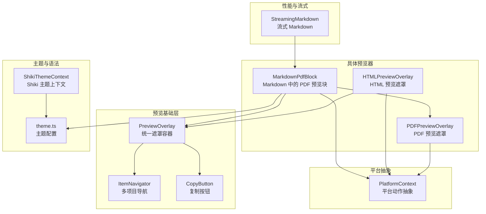
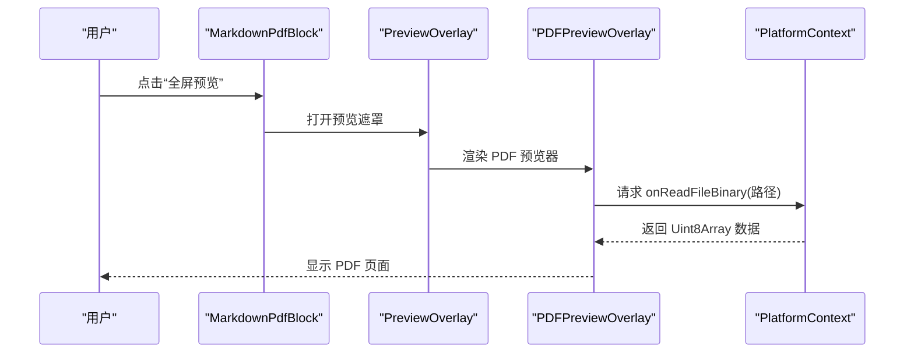
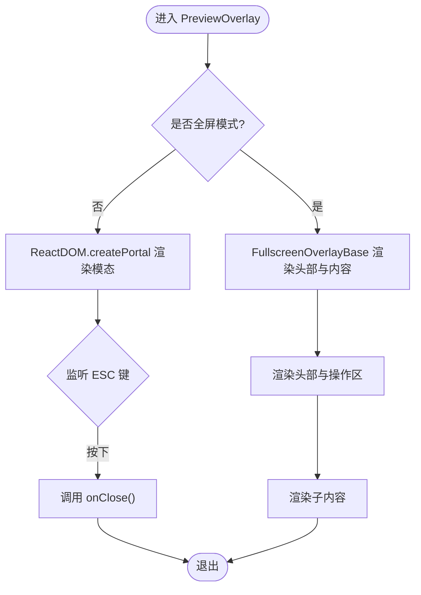
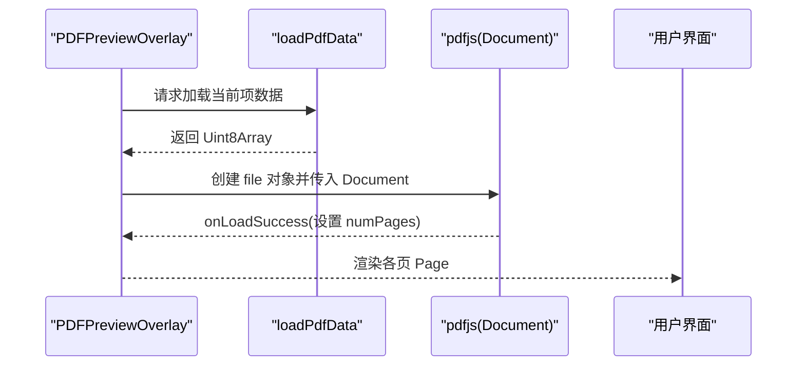
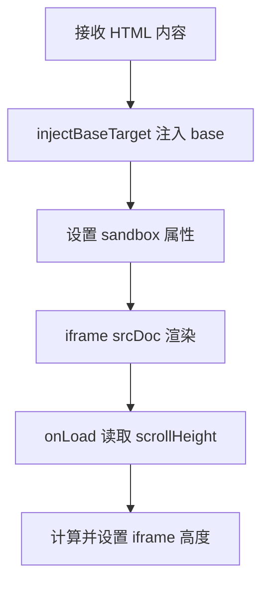
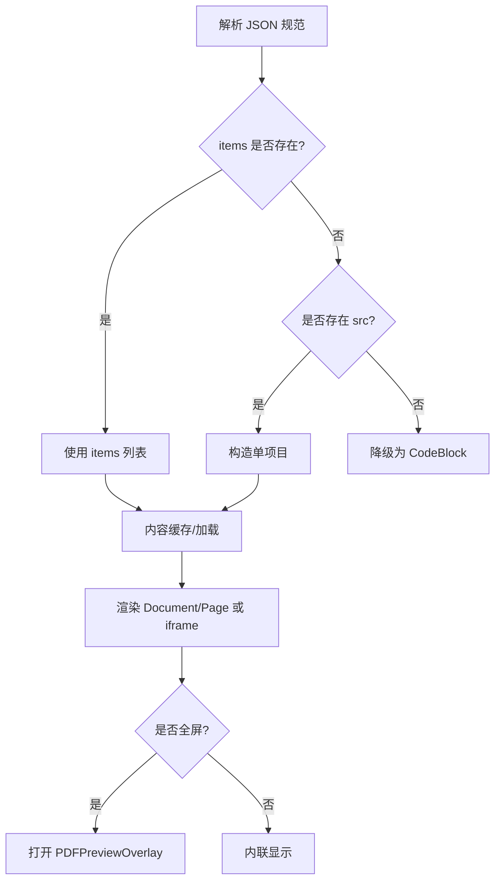
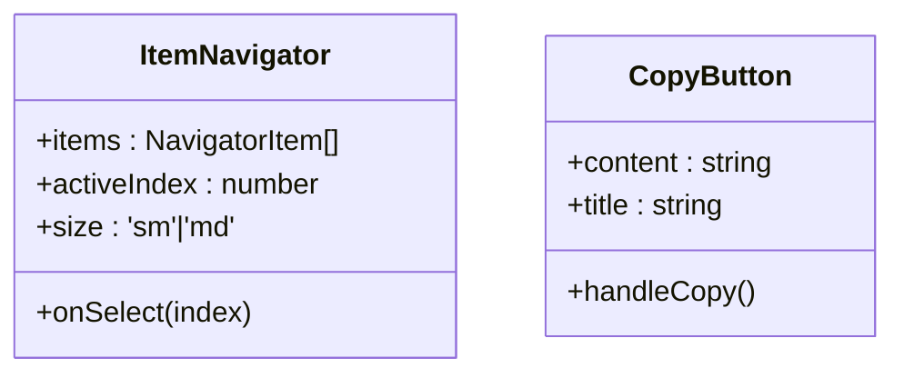
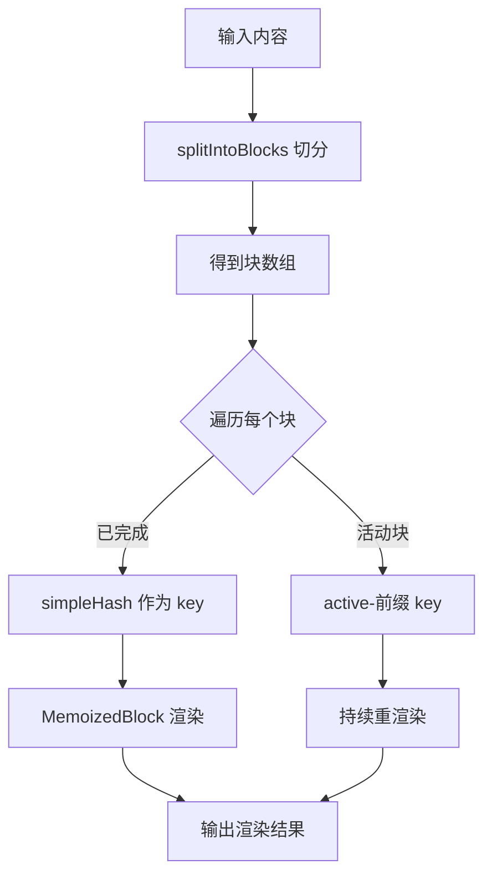
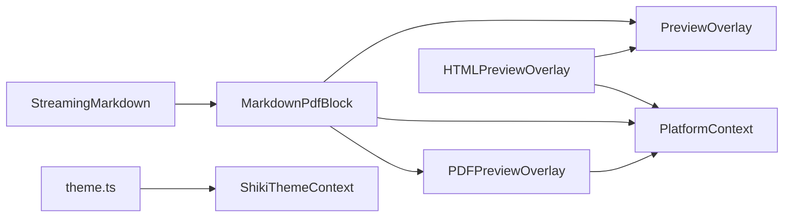

# 文档预览系统

<cite>
**本文引用的文件**
- [packages/ui/src/components/overlay/PreviewOverlay.tsx](file://packages/ui/src/components/overlay/PreviewOverlay.tsx)
- [packages/ui/src/components/overlay/PDFPreviewOverlay.tsx](file://packages/ui/src/components/overlay/PDFPreviewOverlay.tsx)
- [packages/ui/src/components/overlay/HTMLPreviewOverlay.tsx](file://packages/ui/src/components/overlay/HTMLPreviewOverlay.tsx)
- [packages/ui/src/components/overlay/ItemNavigator.tsx](file://packages/ui/src/components/overlay/ItemNavigator.tsx)
- [packages/ui/src/components/overlay/CopyButton.tsx](file://packages/ui/src/components/overlay/CopyButton.tsx)
- [packages/ui/src/components/markdown/MarkdownPdfBlock.tsx](file://packages/ui/src/components/markdown/MarkdownPdfBlock.tsx)
- [packages/ui/src/components/markdown/MarkdownHtmlBlock.tsx](file://packages/ui/src/components/markdown/MarkdownHtmlBlock.tsx)
- [packages/ui/src/context/PlatformContext.tsx](file://packages/ui/src/context/PlatformContext.tsx)
- [packages/shared/src/config/theme.ts](file://packages/shared/src/config/theme.ts)
- [packages/ui/src/context/ShikiThemeContext.tsx](file://packages/ui/src/context/ShikiThemeContext.tsx)
- [packages/shared/src/utils/files.ts](file://packages/shared/src/utils/files.ts)
- [apps/electron/src/renderer/components/markdown/StreamingMarkdown.tsx](file://apps/electron/src/renderer/components/markdown/StreamingMarkdown.tsx)
- [packages/ui/src/pdfjs-worker.d.ts](file://packages/ui/src/pdfjs-worker.d.ts)
</cite>

## 目录
1. [简介](#简介)
2. [项目结构](#项目结构)
3. [核心组件](#核心组件)
4. [架构总览](#架构总览)
5. [详细组件分析](#详细组件分析)
6. [依赖关系分析](#依赖关系分析)
7. [性能考虑](#性能考虑)
8. [故障排查指南](#故障排查指南)
9. [结论](#结论)
10. [附录](#附录)

## 简介
本文件为文档预览系统的详细技术文档，面向需要集成文档预览功能或开发文档查看器的开发者。内容涵盖预览组件的架构设计、渲染引擎实现、交互功能开发；详细介绍文档内容展示、目录导航、搜索高亮、缩放控制等核心功能；解释预览性能优化、内存管理、大文件处理策略；包含预览状态管理、用户交互响应、主题适配机制；并提供预览组件扩展指南、自定义渲染器开发、预览体验优化技巧。

## 项目结构
预览系统主要由以下模块构成：
- 预览基础层：统一的预览遮罩容器与全屏/模态切换逻辑
- 具体预览器：PDF 预览器、HTML 预览器、Markdown 块级预览器
- 平台抽象层：跨平台读取文件、打开链接/文件等能力
- 主题与语法高亮：主题解析、Shiki 主题上下文
- 性能与流式渲染：流式 Markdown 渲染与块级缓存

**图表来源**
- [packages/ui/src/components/overlay/PreviewOverlay.tsx:1-211](file://packages/ui/src/components/overlay/PreviewOverlay.tsx#L1-L211)
- [packages/ui/src/components/overlay/PDFPreviewOverlay.tsx:1-164](file://packages/ui/src/components/overlay/PDFPreviewOverlay.tsx#L1-L164)
- [packages/ui/src/components/overlay/HTMLPreviewOverlay.tsx:1-216](file://packages/ui/src/components/overlay/HTMLPreviewOverlay.tsx#L1-L216)
- [packages/ui/src/components/overlay/ItemNavigator.tsx:1-110](file://packages/ui/src/components/overlay/ItemNavigator.tsx#L1-L110)
- [packages/ui/src/components/overlay/CopyButton.tsx:1-57](file://packages/ui/src/components/overlay/CopyButton.tsx#L1-L57)
- [packages/ui/src/components/markdown/MarkdownPdfBlock.tsx:37-252](file://packages/ui/src/components/markdown/MarkdownPdfBlock.tsx#L37-L252)
- [packages/ui/src/context/PlatformContext.tsx:1-117](file://packages/ui/src/context/PlatformContext.tsx#L1-L117)
- [packages/shared/src/config/theme.ts:1-317](file://packages/shared/src/config/theme.ts#L1-L317)
- [packages/ui/src/context/ShikiThemeContext.tsx:1-36](file://packages/ui/src/context/ShikiThemeContext.tsx#L1-L36)
- [apps/electron/src/renderer/components/markdown/StreamingMarkdown.tsx:1-186](file://apps/electron/src/renderer/components/markdown/StreamingMarkdown.tsx#L1-L186)

**章节来源**
- [packages/ui/src/components/overlay/PreviewOverlay.tsx:1-211](file://packages/ui/src/components/overlay/PreviewOverlay.tsx#L1-L211)
- [packages/ui/src/components/overlay/PDFPreviewOverlay.tsx:1-164](file://packages/ui/src/components/overlay/PDFPreviewOverlay.tsx#L1-L164)
- [packages/ui/src/components/overlay/HTMLPreviewOverlay.tsx:1-216](file://packages/ui/src/components/overlay/HTMLPreviewOverlay.tsx#L1-L216)
- [packages/ui/src/components/overlay/ItemNavigator.tsx:1-110](file://packages/ui/src/components/overlay/ItemNavigator.tsx#L1-L110)
- [packages/ui/src/components/overlay/CopyButton.tsx:1-57](file://packages/ui/src/components/overlay/CopyButton.tsx#L1-L57)
- [packages/ui/src/components/markdown/MarkdownPdfBlock.tsx:37-252](file://packages/ui/src/components/markdown/MarkdownPdfBlock.tsx#L37-L252)
- [packages/ui/src/context/PlatformContext.tsx:1-117](file://packages/ui/src/context/PlatformContext.tsx#L1-L117)
- [packages/shared/src/config/theme.ts:1-317](file://packages/shared/src/config/theme.ts#L1-L317)
- [packages/ui/src/context/ShikiThemeContext.tsx:1-36](file://packages/ui/src/context/ShikiThemeContext.tsx#L1-L36)
- [apps/electron/src/renderer/components/markdown/StreamingMarkdown.tsx:1-186](file://apps/electron/src/renderer/components/markdown/StreamingMarkdown.tsx#L1-L186)

## 核心组件
- 预览遮罩容器（PreviewOverlay）：提供统一的全屏/模态模式、响应式布局、错误横幅、标题栏与操作区、ESC 关闭、点击背景关闭等通用行为。
- PDF 预览器（PDFPreviewOverlay）：基于 react-pdf/pdf.js 的 PDF 渲染，支持多项目导航、加载状态、错误提示、暗色/亮色主题。
- HTML 预览器（HTMLPreviewOverlay）：在沙箱 iframe 中渲染 HTML，自动注入 base target 以拦截链接跳转到系统浏览器；支持多项目、内容缓存、自适应高度。
- Markdown 块级预览器（MarkdownPdfBlock / MarkdownHtmlBlock）：在 Markdown 内容中嵌入 PDF 或 HTML 预览块，支持 JSON 规范化、缓存、错误边界回退。
- 导航与交互（ItemNavigator、CopyButton）：左右箭头与下拉菜单切换多个预览项；复制路径/内容。
- 平台抽象（PlatformContext）：统一 onReadFile/onReadFileBinary/onOpenUrl 等平台能力，便于 Electron/Web 环境复用。
- 主题与语法（theme.ts、ShikiThemeContext）：主题合并与 CSS 变量生成、Shiki 主题选择与覆盖。
- 流式渲染（StreamingMarkdown）：将 Markdown 内容按段落/代码块切分，独立缓存与重渲染，提升流式输出体验。

**章节来源**
- [packages/ui/src/components/overlay/PreviewOverlay.tsx:76-211](file://packages/ui/src/components/overlay/PreviewOverlay.tsx#L76-L211)
- [packages/ui/src/components/overlay/PDFPreviewOverlay.tsx:44-164](file://packages/ui/src/components/overlay/PDFPreviewOverlay.tsx#L44-L164)
- [packages/ui/src/components/overlay/HTMLPreviewOverlay.tsx:61-216](file://packages/ui/src/components/overlay/HTMLPreviewOverlay.tsx#L61-L216)
- [packages/ui/src/components/markdown/MarkdownPdfBlock.tsx:84-252](file://packages/ui/src/components/markdown/MarkdownPdfBlock.tsx#L84-L252)
- [packages/ui/src/components/markdown/MarkdownHtmlBlock.tsx:96-144](file://packages/ui/src/components/markdown/MarkdownHtmlBlock.tsx#L96-L144)
- [packages/ui/src/components/overlay/ItemNavigator.tsx:34-110](file://packages/ui/src/components/overlay/ItemNavigator.tsx#L34-L110)
- [packages/ui/src/components/overlay/CopyButton.tsx:25-57](file://packages/ui/src/components/overlay/CopyButton.tsx#L25-L57)
- [packages/ui/src/context/PlatformContext.tsx:19-117](file://packages/ui/src/context/PlatformContext.tsx#L19-L117)
- [packages/shared/src/config/theme.ts:135-206](file://packages/shared/src/config/theme.ts#L135-L206)
- [packages/ui/src/context/ShikiThemeContext.tsx:19-36](file://packages/ui/src/context/ShikiThemeContext.tsx#L19-L36)
- [apps/electron/src/renderer/components/markdown/StreamingMarkdown.tsx:139-186](file://apps/electron/src/renderer/components/markdown/StreamingMarkdown.tsx#L139-L186)

## 架构总览
预览系统采用“基础容器 + 具体渲染器 + 平台抽象 + 主题/语法”的分层架构。Markdown 块级预览器负责解析 JSON 规范并驱动对应预览器；预览遮罩容器统一处理响应式布局与交互；平台上下文屏蔽 Electron/Web 差异；主题系统与 Shiki 上下文保证跨模式一致的视觉与语法高亮。

**图表来源**
- [packages/ui/src/components/markdown/MarkdownPdfBlock.tsx:240-252](file://packages/ui/src/components/markdown/MarkdownPdfBlock.tsx#L240-L252)
- [packages/ui/src/components/overlay/PreviewOverlay.tsx:167-185](file://packages/ui/src/components/overlay/PreviewOverlay.tsx#L167-L185)
- [packages/ui/src/components/overlay/PDFPreviewOverlay.tsx:76-101](file://packages/ui/src/components/overlay/PDFPreviewOverlay.tsx#L76-L101)
- [packages/ui/src/context/PlatformContext.tsx:95-96](file://packages/ui/src/context/PlatformContext.tsx#L95-L96)

## 详细组件分析

### 预览遮罩容器（PreviewOverlay）
- 责任：统一遮罩容器，支持全屏与模态两种布局；ESC 关闭；错误横幅；标题栏与操作区；渐隐遮罩；嵌入模式。
- 关键点：根据屏幕宽度自动切换 modal/fullscreen；模态模式支持点击背景关闭；全屏模式委托给 FullscreenOverlayBaseHeader；错误状态通过 OverlayErrorBanner 统一展示。

**图表来源**
- [packages/ui/src/components/overlay/PreviewOverlay.tsx:96-108](file://packages/ui/src/components/overlay/PreviewOverlay.tsx#L96-L108)
- [packages/ui/src/components/overlay/PreviewOverlay.tsx:167-185](file://packages/ui/src/components/overlay/PreviewOverlay.tsx#L167-L185)
- [packages/ui/src/components/overlay/PreviewOverlay.tsx:188-210](file://packages/ui/src/components/overlay/PreviewOverlay.tsx#L188-L210)

**章节来源**
- [packages/ui/src/components/overlay/PreviewOverlay.tsx:76-211](file://packages/ui/src/components/overlay/PreviewOverlay.tsx#L76-L211)

### PDF 预览器（PDFPreviewOverlay）
- 责任：在遮罩容器内渲染 PDF，支持多项目导航、页码统计、加载/错误状态、暗色/亮色主题。
- 关键点：使用 pdfjs.GlobalWorkerOptions.workerSrc 指定 worker；Document/DocumentLoadSuccess/DocumentLoadError 控制页数与错误；memo 化 file 对象避免不必要的重渲染；支持从外部加载器获取 Uint8Array。

**图表来源**
- [packages/ui/src/components/overlay/PDFPreviewOverlay.tsx:76-101](file://packages/ui/src/components/overlay/PDFPreviewOverlay.tsx#L76-L101)
- [packages/ui/src/components/overlay/PDFPreviewOverlay.tsx:103-115](file://packages/ui/src/components/overlay/PDFPreviewOverlay.tsx#L103-L115)
- [packages/ui/src/pdfjs-worker.d.ts:1-4](file://packages/ui/src/pdfjs-worker.d.ts#L1-L4)

**章节来源**
- [packages/ui/src/components/overlay/PDFPreviewOverlay.tsx:44-164](file://packages/ui/src/components/overlay/PDFPreviewOverlay.tsx#L44-L164)
- [packages/ui/src/pdfjs-worker.d.ts:1-4](file://packages/ui/src/pdfjs-worker.d.ts#L1-L4)

### HTML 预览器（HTMLPreviewOverlay）
- 责任：在沙箱 iframe 中渲染 HTML，自动注入 base target 以拦截链接跳转到系统浏览器；支持多项目、内容缓存、自适应高度。
- 关键点：injectBaseTarget 注入 base target；sandbox="allow-same-origin allow-top-navigation-by-user-activation"；iframe onLoad 后读取 contentDocument.scrollHeight 自适应高度。

**图表来源**
- [packages/ui/src/components/overlay/HTMLPreviewOverlay.tsx:24-33](file://packages/ui/src/components/overlay/HTMLPreviewOverlay.tsx#L24-L33)
- [packages/ui/src/components/overlay/HTMLPreviewOverlay.tsx:202-210](file://packages/ui/src/components/overlay/HTMLPreviewOverlay.tsx#L202-L210)

**章节来源**
- [packages/ui/src/components/overlay/HTMLPreviewOverlay.tsx:61-216](file://packages/ui/src/components/overlay/HTMLPreviewOverlay.tsx#L61-L216)

### Markdown 块级预览器（MarkdownPdfBlock / MarkdownHtmlBlock）
- 责任：在 Markdown 内容中嵌入 PDF/HTML 预览块，支持 JSON 规范化、缓存、错误边界回退、全屏预览。
- 关键点：JSON 解析支持 items 数组或单个 src；PDF 使用 onReadFileBinary 获取二进制数据并复制到新 Uint8Array（react-pdf 会转移 ArrayBuffer）；HTML 使用 onReadFile 获取字符串；错误边界降级为 CodeBlock。

**图表来源**
- [packages/ui/src/components/markdown/MarkdownPdfBlock.tsx:88-110](file://packages/ui/src/components/markdown/MarkdownPdfBlock.tsx#L88-L110)
- [packages/ui/src/components/markdown/MarkdownPdfBlock.tsx:115-160](file://packages/ui/src/components/markdown/MarkdownPdfBlock.tsx#L115-L160)
- [packages/ui/src/components/markdown/MarkdownHtmlBlock.tsx:100-122](file://packages/ui/src/components/markdown/MarkdownHtmlBlock.tsx#L100-L122)

**章节来源**
- [packages/ui/src/components/markdown/MarkdownPdfBlock.tsx:84-252](file://packages/ui/src/components/markdown/MarkdownPdfBlock.tsx#L84-L252)
- [packages/ui/src/components/markdown/MarkdownHtmlBlock.tsx:96-144](file://packages/ui/src/components/markdown/MarkdownHtmlBlock.tsx#L96-L144)

### 导航与交互（ItemNavigator / CopyButton）
- ItemNavigator：左右箭头与下拉菜单切换多个预览项，显示当前索引与总数，支持 md/sm 尺寸变体。
- CopyButton：复制内容到剪贴板，显示“已复制”反馈。

**图表来源**
- [packages/ui/src/components/overlay/ItemNavigator.tsx:22-32](file://packages/ui/src/components/overlay/ItemNavigator.tsx#L22-L32)
- [packages/ui/src/components/overlay/CopyButton.tsx:14-23](file://packages/ui/src/components/overlay/CopyButton.tsx#L14-L23)

**章节来源**
- [packages/ui/src/components/overlay/ItemNavigator.tsx:34-110](file://packages/ui/src/components/overlay/ItemNavigator.tsx#L34-L110)
- [packages/ui/src/components/overlay/CopyButton.tsx:25-57](file://packages/ui/src/components/overlay/CopyButton.tsx#L25-L57)

### 平台抽象（PlatformContext）
- 责任：统一平台能力接口，包括读取文本/二进制文件、打开 URL/文件、在资源管理器中定位、流量灯可见性控制等。
- 价值：使预览器在 Electron 与 Web 环境可复用，避免直接耦合平台 API。

**章节来源**
- [packages/ui/src/context/PlatformContext.tsx:19-117](file://packages/ui/src/context/PlatformContext.tsx#L19-L117)

### 主题与语法（theme.ts / ShikiThemeContext）
- theme.ts：主题合并、CSS 变量生成、深色覆盖、Shiki 主题映射。
- ShikiThemeContext：解决深色主题在浅色系统模式下的语法高亮问题，确保代码块使用正确的 Shiki 主题。

**章节来源**
- [packages/shared/src/config/theme.ts:135-206](file://packages/shared/src/config/theme.ts#L135-L206)
- [packages/ui/src/context/ShikiThemeContext.tsx:19-36](file://packages/ui/src/context/ShikiThemeContext.tsx#L19-L36)

### 流式渲染（StreamingMarkdown）
- 责任：将 Markdown 内容按段落/代码块切分为“块”，独立缓存与渲染，仅最后一个活动块随流式更新重渲染，极大提升性能与体验。
- 关键点：splitIntoBlocks 按双换行与代码围栏切分；simpleHash 作为已完成块的稳定 key；MemoizedBlock 仅在内容变化时重渲染。

**图表来源**
- [apps/electron/src/renderer/components/markdown/StreamingMarkdown.tsx:38-92](file://apps/electron/src/renderer/components/markdown/StreamingMarkdown.tsx#L38-L92)
- [apps/electron/src/renderer/components/markdown/StreamingMarkdown.tsx:101-121](file://apps/electron/src/renderer/components/markdown/StreamingMarkdown.tsx#L101-L121)
- [apps/electron/src/renderer/components/markdown/StreamingMarkdown.tsx:146-151](file://apps/electron/src/renderer/components/markdown/StreamingMarkdown.tsx#L146-L151)

**章节来源**
- [apps/electron/src/renderer/components/markdown/StreamingMarkdown.tsx:139-186](file://apps/electron/src/renderer/components/markdown/StreamingMarkdown.tsx#L139-L186)

## 依赖关系分析
- 组件耦合：MarkdownPdfBlock/MarkdownHtmlBlock 依赖 PreviewOverlay 与平台上下文；PDFPreviewOverlay 依赖 react-pdf/pdf.js 与 PlatformContext；HTMLPreviewOverlay 依赖 PreviewOverlay 与平台上下文。
- 外部依赖：pdfjs-dist、react-pdf、lucide-react、react-i18next。
- 主题与语法：theme.ts 与 ShikiThemeContext 协同，确保在不同系统模式下正确应用主题与语法高亮。

**图表来源**
- [packages/ui/src/components/markdown/MarkdownPdfBlock.tsx:240-252](file://packages/ui/src/components/markdown/MarkdownPdfBlock.tsx#L240-L252)
- [packages/ui/src/components/overlay/PreviewOverlay.tsx:167-185](file://packages/ui/src/components/overlay/PreviewOverlay.tsx#L167-L185)
- [packages/ui/src/components/overlay/PDFPreviewOverlay.tsx:76-101](file://packages/ui/src/components/overlay/PDFPreviewOverlay.tsx#L76-L101)
- [packages/ui/src/components/overlay/HTMLPreviewOverlay.tsx:183-216](file://packages/ui/src/components/overlay/HTMLPreviewOverlay.tsx#L183-L216)
- [packages/ui/src/context/PlatformContext.tsx:95-96](file://packages/ui/src/context/PlatformContext.tsx#L95-L96)
- [packages/shared/src/config/theme.ts:178-206](file://packages/shared/src/config/theme.ts#L178-L206)
- [packages/ui/src/context/ShikiThemeContext.tsx:19-36](file://packages/ui/src/context/ShikiThemeContext.tsx#L19-L36)
- [apps/electron/src/renderer/components/markdown/StreamingMarkdown.tsx:139-186](file://apps/electron/src/renderer/components/markdown/StreamingMarkdown.tsx#L139-L186)

**章节来源**
- [packages/ui/src/components/markdown/MarkdownPdfBlock.tsx:84-252](file://packages/ui/src/components/markdown/MarkdownPdfBlock.tsx#L84-L252)
- [packages/ui/src/components/overlay/PDFPreviewOverlay.tsx:44-164](file://packages/ui/src/components/overlay/PDFPreviewOverlay.tsx#L44-L164)
- [packages/ui/src/components/overlay/HTMLPreviewOverlay.tsx:61-216](file://packages/ui/src/components/overlay/HTMLPreviewOverlay.tsx#L61-L216)
- [packages/ui/src/context/PlatformContext.tsx:19-117](file://packages/ui/src/context/PlatformContext.tsx#L19-L117)
- [packages/shared/src/config/theme.ts:178-206](file://packages/shared/src/config/theme.ts#L178-L206)
- [packages/ui/src/context/ShikiThemeContext.tsx:19-36](file://packages/ui/src/context/ShikiThemeContext.tsx#L19-L36)
- [apps/electron/src/renderer/components/markdown/StreamingMarkdown.tsx:139-186](file://apps/electron/src/renderer/components/markdown/StreamingMarkdown.tsx#L139-L186)

## 性能考虑
- 流式渲染：StreamingMarkdown 将内容切分为块，已完成块使用内容哈希作为 key，避免重复渲染；仅活动块重渲染，显著降低重排与重绘成本。
- 缓存策略：PDF 预览器对 Uint8Array 进行复制并缓存，避免 react-pdf 转移 ArrayBuffer 导致的失效；HTML 预览器支持外部内容缓存与按需加载。
- 渲染隔离：PDF 使用 react-pdf 的 Document/Page，按页渲染；HTML 使用沙箱 iframe，避免脚本执行影响主页面。
- 主题与语法：主题 CSS 变量集中生成，减少样式抖动；Shiki 主题上下文确保在系统浅色模式下也能正确使用深色语法主题。
- 大文件处理：共享工具限制文本文件最大读取大小，超过阈值进行截断并提示，防止内存占用过高。

**章节来源**
- [apps/electron/src/renderer/components/markdown/StreamingMarkdown.tsx:139-186](file://apps/electron/src/renderer/components/markdown/StreamingMarkdown.tsx#L139-L186)
- [packages/ui/src/components/markdown/MarkdownPdfBlock.tsx:115-160](file://packages/ui/src/components/markdown/MarkdownPdfBlock.tsx#L115-L160)
- [packages/ui/src/components/overlay/HTMLPreviewOverlay.tsx:66-71](file://packages/ui/src/components/overlay/HTMLPreviewOverlay.tsx#L66-L71)
- [packages/shared/src/config/theme.ts:178-206](file://packages/shared/src/config/theme.ts#L178-L206)
- [packages/ui/src/context/ShikiThemeContext.tsx:19-36](file://packages/ui/src/context/ShikiThemeContext.tsx#L19-L36)
- [packages/shared/src/utils/files.ts:367-399](file://packages/shared/src/utils/files.ts#L367-L399)

## 故障排查指南
- PDF 加载失败：检查 loadPdfData 是否返回有效 Uint8Array；确认 onReadFileBinary 实现与权限；查看错误横幅与日志。
- HTML 链接无法跳转：确认 HTML 已注入 base target，且 iframe sandbox 设置允许 allow-top-navigation-by-user-activation。
- 预览遮罩无法关闭：检查 ESC 键事件绑定（模态模式）与 onClose 回调；确认点击背景关闭逻辑。
- 语法高亮异常：检查 ShikiThemeContext 提供的主题名称与 theme.ts 的深色覆盖；确认系统模式与主题支持模式匹配。
- 性能卡顿：启用流式渲染；避免一次性渲染超大内容；合理使用缓存；监控内存占用。

**章节来源**
- [packages/ui/src/components/overlay/PDFPreviewOverlay.tsx:93-109](file://packages/ui/src/components/overlay/PDFPreviewOverlay.tsx#L93-L109)
- [packages/ui/src/components/overlay/HTMLPreviewOverlay.tsx:202-210](file://packages/ui/src/components/overlay/HTMLPreviewOverlay.tsx#L202-L210)
- [packages/ui/src/components/overlay/PreviewOverlay.tsx:96-108](file://packages/ui/src/components/overlay/PreviewOverlay.tsx#L96-L108)
- [packages/ui/src/context/ShikiThemeContext.tsx:19-36](file://packages/ui/src/context/ShikiThemeContext.tsx#L19-L36)
- [apps/electron/src/renderer/components/markdown/StreamingMarkdown.tsx:139-186](file://apps/electron/src/renderer/components/markdown/StreamingMarkdown.tsx#L139-L186)

## 结论
该预览系统通过清晰的分层架构与平台抽象，实现了跨环境一致的文档预览体验。结合流式渲染、缓存策略与主题/语法适配，系统在性能与可用性上取得良好平衡。开发者可基于现有组件快速扩展新的预览类型，并遵循统一的交互与主题规范，确保一致的用户体验。

## 附录
- 扩展指南：新增预览类型时，建议参考 PDF/HTML 预览器的实现模式，封装为独立组件并接入 PreviewOverlay；通过 PlatformContext 提供读取能力；在 Markdown 中提供 JSON 规范入口。
- 自定义渲染器：可参考 MarkdownPdfBlock/HTMLPreviewOverlay 的模式，将外部数据源转换为组件所需格式；注意缓存与错误处理。
- 预览体验优化：优先使用流式渲染；合理设置固定高度避免布局抖动；在全屏模式下隐藏系统窗口控件；提供复制与导航能力；在深色模式下保持语法高亮一致性。