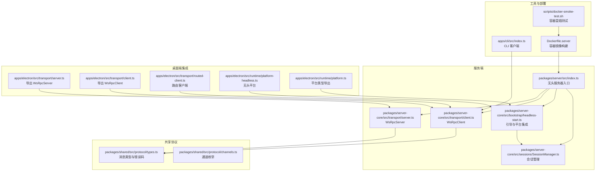
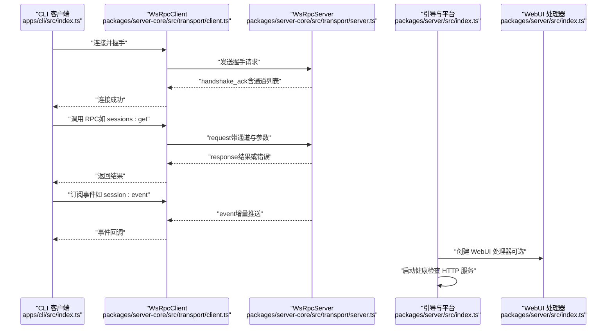
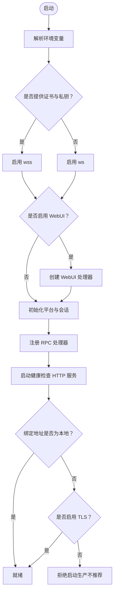
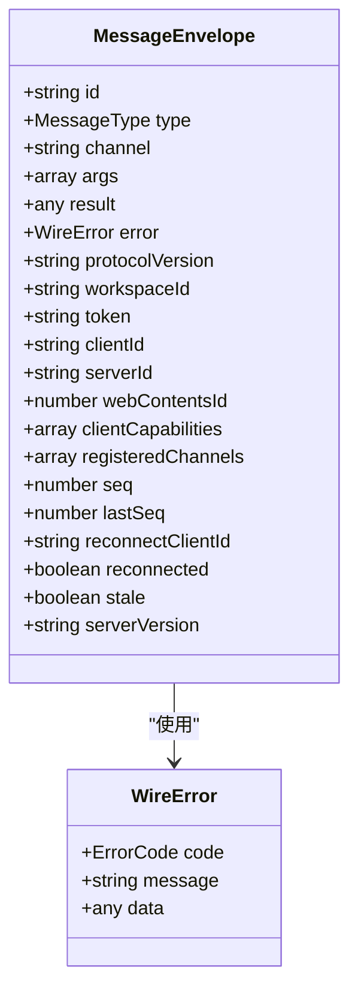
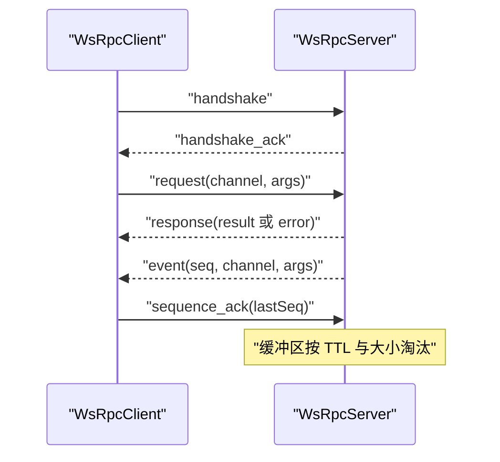
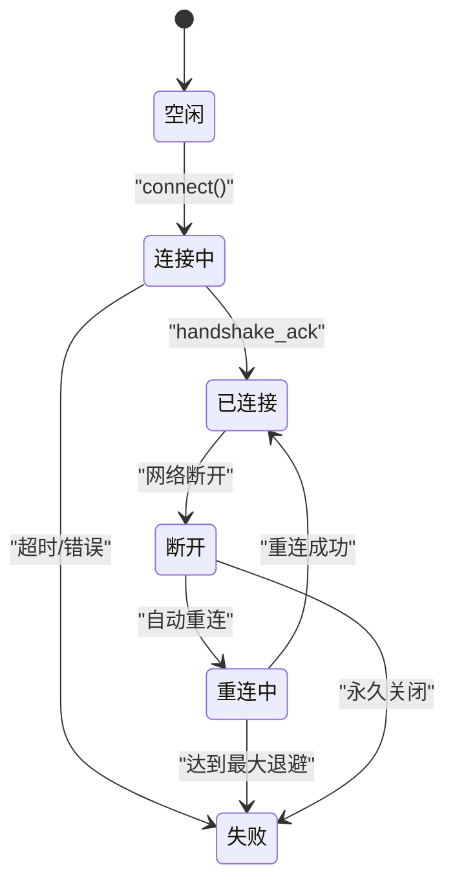
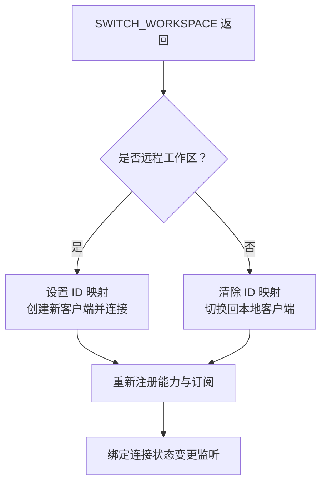
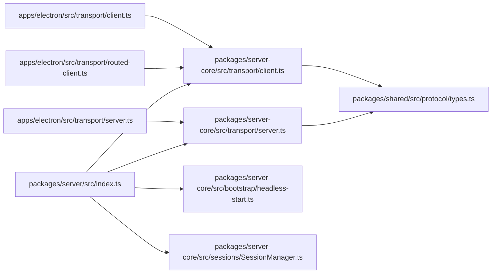

# 服务器架构

<cite>
**本文引用的文件**
- [packages/server/src/index.ts](file://packages/server/src/index.ts)
- [packages/server-core/src/transport/server.ts](file://packages/server-core/src/transport/server.ts)
- [packages/server-core/src/transport/client.ts](file://packages/server-core/src/transport/client.ts)
- [apps/electron/src/transport/server.ts](file://apps/electron/src/transport/server.ts)
- [apps/electron/src/transport/client.ts](file://apps/electron/src/transport/client.ts)
- [apps/electron/src/transport/routed-client.ts](file://apps/electron/src/transport/routed-client.ts)
- [apps/electron/src/runtime/platform-headless.ts](file://apps/electron/src/runtime/platform-headless.ts)
- [apps/electron/src/runtime/platform.ts](file://apps/electron/src/runtime/platform.ts)
- [packages/shared/src/protocol/types.ts](file://packages/shared/src/protocol/types.ts)
- [packages/shared/src/protocol/channels.ts](file://packages/shared/src/protocol/channels.ts)
- [Dockerfile.server](file://Dockerfile.server)
- [scripts/docker-smoke-test.sh](file://scripts/docker-smoke-test.sh)
- [apps/cli/src/index.ts](file://apps/cli/src/index.ts)
</cite>

## 目录
1. [引言](#引言)
2. [项目结构](#项目结构)
3. [核心组件](#核心组件)
4. [架构总览](#架构总览)
5. [详细组件分析](#详细组件分析)
6. [依赖关系分析](#依赖关系分析)
7. [性能考虑](#性能考虑)
8. [故障排查指南](#故障排查指南)
9. [结论](#结论)
10. [附录](#附录)

## 引言
本文件面向系统管理员与高级开发者，系统性阐述 Craft Agents 无头服务器的架构设计与实现细节，覆盖以下主题：
- 无头服务器设计理念与运行模式
- WebSocket RPC 通信协议与消息模型
- TLS 加密与安全配置
- 会话管理、传输层、事件处理核心组件
- 远程服务器部署、容器化与环境变量配置
- 健康检查、自动更新机制与错误处理策略
- 性能调优、安全加固与监控告警最佳实践

## 项目结构
Craft Agents 采用多包（monorepo）组织方式，核心服务位于 packages/server，传输与协议定义位于 packages/server-core 与 packages/shared，桌面端与 Electron 集成位于 apps/electron，CLI 工具位于 apps/cli，容器化与部署脚本位于根目录。

图表来源
- [packages/server/src/index.ts:1-353](file://packages/server/src/index.ts#L1-L353)
- [packages/server-core/src/transport/server.ts:1-869](file://packages/server-core/src/transport/server.ts#L1-L869)
- [packages/server-core/src/transport/client.ts:1-983](file://packages/server-core/src/transport/client.ts#L1-L983)
- [apps/electron/src/transport/server.ts:1-2](file://apps/electron/src/transport/server.ts#L1-L2)
- [apps/electron/src/transport/client.ts:1-18](file://apps/electron/src/transport/client.ts#L1-L18)
- [apps/electron/src/transport/routed-client.ts:1-252](file://apps/electron/src/transport/routed-client.ts#L1-L252)
- [apps/electron/src/runtime/platform-headless.ts:1-2](file://apps/electron/src/runtime/platform-headless.ts#L1-L2)
- [apps/electron/src/runtime/platform.ts:1-8](file://apps/electron/src/runtime/platform.ts#L1-L8)
- [packages/shared/src/protocol/types.ts:1-80](file://packages/shared/src/protocol/types.ts#L1-L80)
- [packages/shared/src/protocol/channels.ts:408-425](file://packages/shared/src/protocol/channels.ts#L408-L425)
- [Dockerfile.server:1-115](file://Dockerfile.server#L1-L115)
- [scripts/docker-smoke-test.sh:1-116](file://scripts/docker-smoke-test.sh#L1-L116)
- [apps/cli/src/index.ts:1-800](file://apps/cli/src/index.ts#L1-L800)

章节来源
- [packages/server/src/index.ts:1-353](file://packages/server/src/index.ts#L1-L353)
- [Dockerfile.server:1-115](file://Dockerfile.server#L1-L115)

## 核心组件
- 无头服务器入口：负责解析环境变量、加载 TLS、创建 WebUI 处理器、初始化平台与会话管理、注册 RPC 处理器、启动健康检查 HTTP 服务，并在进程退出时进行清理。
- 传输层（WsRpcServer/WsRpcClient）：实现基于 WebSocket 的可靠 RPC 通信，支持握手、心跳、序列号确认、事件缓冲与重连恢复。
- 协议与通道：统一的消息类型、错误码与通道命名空间，确保客户端与服务器兼容性。
- 路由客户端（RoutedClient）：在本地嵌入式服务器与远程工作区之间透明切换，维护监听者与能力处理器的重新订阅。
- 平台与会话：无头平台抽象与会话管理器，为模型刷新、搜索与图像处理等子系统注入平台能力。

章节来源
- [packages/server/src/index.ts:1-353](file://packages/server/src/index.ts#L1-L353)
- [packages/server-core/src/transport/server.ts:1-869](file://packages/server-core/src/transport/server.ts#L1-L869)
- [packages/server-core/src/transport/client.ts:1-983](file://packages/server-core/src/transport/client.ts#L1-L983)
- [apps/electron/src/transport/routed-client.ts:1-252](file://apps/electron/src/transport/routed-client.ts#L1-L252)
- [apps/electron/src/runtime/platform-headless.ts:1-2](file://apps/electron/src/runtime/platform-headless.ts#L1-L2)
- [apps/electron/src/runtime/platform.ts:1-8](file://apps/electron/src/runtime/platform.ts#L1-L8)
- [packages/shared/src/protocol/types.ts:1-80](file://packages/shared/src/protocol/types.ts#L1-L80)
- [packages/shared/src/protocol/channels.ts:408-425](file://packages/shared/src/protocol/channels.ts#L408-L425)

## 架构总览
下图展示从 CLI 到无头服务器的端到端交互路径，以及 WebUI 与健康检查的集成。

图表来源
- [apps/cli/src/index.ts:1-800](file://apps/cli/src/index.ts#L1-L800)
- [packages/server-core/src/transport/client.ts:1-983](file://packages/server-core/src/transport/client.ts#L1-L983)
- [packages/server-core/src/transport/server.ts:1-869](file://packages/server-core/src/transport/server.ts#L1-L869)
- [packages/server/src/index.ts:1-353](file://packages/server/src/index.ts#L1-L353)

## 详细组件分析

### 无头服务器入口与引导流程
- 环境变量解析：包括认证令牌、绑定地址与端口、TLS 证书与私钥、WebUI 目录与密码、WhatsApp 工作线程路径等。
- TLS 配置：当提供证书与私钥路径时启用 wss；否则仅启用 ws。
- WebUI 集成：在同端口提供 HTTP 服务以承载 WebUI，支持基于会话 Cookie 的认证。
- 平台与会话：设置平台能力、模型刷新服务、会话管理器与运行时钩子。
- RPC 注册：注册核心 RPC 处理器，将会话事件通过消息网关发布。
- 健康检查：可选启动独立 HTTP 健康检查服务。
- 绑定策略：非本地绑定且未启用 TLS 时拒绝启动，除非显式允许（生产不推荐）。

图表来源
- [packages/server/src/index.ts:1-353](file://packages/server/src/index.ts#L1-L353)

章节来源
- [packages/server/src/index.ts:1-353](file://packages/server/src/index.ts#L1-L353)

### WebSocket RPC 通信协议与消息模型
- 消息类型：握手、握手确认、请求、响应、事件、错误、序列确认。
- 字段语义：包含通道名、参数、结果、错误对象、协议版本、工作区 ID、客户端能力、序列号与最后已确认序号等。
- 错误码：包括处理器错误、通道不存在、认证失败、协议版本不支持、会话非空闲等。
- 通道枚举：集中定义所有 RPC 通道，便于客户端与服务器一致性校验。

图表来源
- [packages/shared/src/protocol/types.ts:1-80](file://packages/shared/src/protocol/types.ts#L1-L80)

章节来源
- [packages/shared/src/protocol/types.ts:1-80](file://packages/shared/src/protocol/types.ts#L1-L80)
- [packages/shared/src/protocol/channels.ts:408-425](file://packages/shared/src/protocol/channels.ts#L408-L425)

### 传输层（WsRpcServer）
- 连接生命周期：握手超时、认证（令牌或会话 Cookie）、心跳检测、断开保留缓冲用于重连回放。
- 请求分发：按通道查找处理器，执行超时控制，返回响应或结构化错误。
- 事件推送：为每个目标客户端分配递增序列号，维护环形缓冲区，支持 TTL 与大小限制淘汰。
- 重连机制：支持断线后携带 lastSeq 与 reconnectClientId 进行回放或标记为“陈旧”要求全量刷新。
- HTTP 嵌入：当提供 HTTP 处理器时，可在同一端口同时提供 WebSocket 与常规 HTTP 服务（如 WebUI）。

图表来源
- [packages/server-core/src/transport/server.ts:1-869](file://packages/server-core/src/transport/server.ts#L1-L869)

章节来源
- [packages/server-core/src/transport/server.ts:1-869](file://packages/server-core/src/transport/server.ts#L1-L869)

### 传输层（WsRpcClient）
- 连接状态模型：空闲、连接中、已连接、重连中、断开、失败。
- 自动重连：指数退避，最大延迟可配置；支持手动触发重连。
- 序列确认：周期性发送 lastSeq，服务器据此清理缓冲。
- 能力调用：支持服务器向客户端发起能力调用（capability），客户端注册处理器。
- 通道可用性：根据服务器 handshake_ack 中的 registeredChannels 判断。

图表来源
- [packages/server-core/src/transport/client.ts:1-983](file://packages/server-core/src/transport/client.ts#L1-L983)

章节来源
- [packages/server-core/src/transport/client.ts:1-983](file://packages/server-core/src/transport/client.ts#L1-L983)

### 路由客户端（RoutedClient）
- 双客户端模型：本地嵌入式服务器客户端与当前工作区对应的远程客户端。
- 通道路由：LOCAL_ONLY 通道走本地客户端，其余走远程客户端。
- 工作区切换：透明替换远程客户端，重新注册能力与订阅，保持监听者一致性。
- ID 映射：将本地工作区 ID 替换为远程工作区 ID，保证远端处理器正确解析。

图表来源
- [apps/electron/src/transport/routed-client.ts:1-252](file://apps/electron/src/transport/routed-client.ts#L1-L252)

章节来源
- [apps/electron/src/transport/routed-client.ts:1-252](file://apps/electron/src/transport/routed-client.ts#L1-L252)

### 平台与无头运行时
- 无头平台：通过 server-core 导出的 createHeadlessPlatform 创建，注入日志、图像处理等服务。
- 类型导出：平台服务接口与日志器类型在 server-core 中定义，供上层复用。

章节来源
- [apps/electron/src/runtime/platform-headless.ts:1-2](file://apps/electron/src/runtime/platform-headless.ts#L1-L2)
- [apps/electron/src/runtime/platform.ts:1-8](file://apps/electron/src/runtime/platform.ts#L1-L8)

### CLI 客户端与健康检查
- CLI 支持连接服务器、列出资源、管理会话、发送消息并实时流式输出、验证服务器健康。
- 健康检查：通过 credentials:healthCheck 通道与健康 HTTP 服务共同保障服务可用性。

章节来源
- [apps/cli/src/index.ts:1-800](file://apps/cli/src/index.ts#L1-L800)

## 依赖关系分析
- 服务端入口依赖传输层、平台与会话管理、WebUI 处理器与健康检查 HTTP 服务。
- 传输层依赖共享协议定义的消息类型与通道常量。
- 路由客户端依赖 WsRpcClient 与通道分类工具，实现跨服务器的透明通信。
- 桌面端导出层将 server-core 的传输组件暴露给 Electron 应用层，保持解耦。

图表来源
- [packages/server/src/index.ts:1-353](file://packages/server/src/index.ts#L1-L353)
- [packages/server-core/src/transport/server.ts:1-869](file://packages/server-core/src/transport/server.ts#L1-L869)
- [packages/server-core/src/transport/client.ts:1-983](file://packages/server-core/src/transport/client.ts#L1-L983)
- [apps/electron/src/transport/routed-client.ts:1-252](file://apps/electron/src/transport/routed-client.ts#L1-L252)
- [apps/electron/src/transport/server.ts:1-2](file://apps/electron/src/transport/server.ts#L1-L2)
- [apps/electron/src/transport/client.ts:1-18](file://apps/electron/src/transport/client.ts#L1-L18)
- [packages/shared/src/protocol/types.ts:1-80](file://packages/shared/src/protocol/types.ts#L1-L80)

章节来源
- [packages/server/src/index.ts:1-353](file://packages/server/src/index.ts#L1-L353)
- [packages/server-core/src/transport/server.ts:1-869](file://packages/server-core/src/transport/server.ts#L1-L869)
- [packages/server-core/src/transport/client.ts:1-983](file://packages/server-core/src/transport/client.ts#L1-L983)
- [apps/electron/src/transport/routed-client.ts:1-252](file://apps/electron/src/transport/routed-client.ts#L1-L252)
- [apps/electron/src/transport/server.ts:1-2](file://apps/electron/src/transport/server.ts#L1-L2)
- [apps/electron/src/transport/client.ts:1-18](file://apps/electron/src/transport/client.ts#L1-L18)
- [packages/shared/src/protocol/types.ts:1-80](file://packages/shared/src/protocol/types.ts#L1-L80)

## 性能考虑
- 事件缓冲与淘汰：服务器为每个客户端维护环形缓冲区，按 TTL 与最大容量淘汰，避免内存无限增长。建议合理设置事件 TTL 与缓冲上限，平衡重连回放与内存占用。
- 心跳与超时：心跳间隔与最大错过次数决定连接稳定性阈值；请求与处理器执行超时限制防止阻塞。可根据网络质量调整心跳参数。
- 并发连接数：通过 maxClients 控制最大并发客户端数量，避免资源耗尽。
- 序列确认：定期发送 lastSeq，服务器据此清理缓冲，减少重复传输。
- 重连退避：指数退避上限可配置，避免雪崩效应。
- WebUI 与 HTTP 嵌入：在同一端口提供 HTTP 与 WebSocket 服务，减少端口占用与代理复杂度。

[本节为通用指导，无需特定文件引用]

## 故障排查指南
- 认证失败：检查 CRAFT_SERVER_TOKEN 是否正确设置，CLI 是否携带正确的 x-craft-token 头。
- 协议版本不匹配：确保客户端与服务器协议版本主版本一致。
- TLS 配置问题：证书与私钥必须同时提供；若使用自签名证书，客户端需允许不拒绝授权（Node 环境）。
- 绑定地址风险：非本地绑定且未启用 TLS 将被拒绝；生产环境务必启用 wss。
- 健康检查：通过 CLI 的 credentials:healthCheck 或独立健康端口确认服务状态。
- 容器部署：使用 Dockerfile.server 提供的环境变量与运行参数，结合 scripts/docker-smoke-test.sh 进行冒烟测试。

章节来源
- [packages/server/src/index.ts:1-353](file://packages/server/src/index.ts#L1-L353)
- [apps/cli/src/index.ts:1-800](file://apps/cli/src/index.ts#L1-L800)
- [scripts/docker-smoke-test.sh:1-116](file://scripts/docker-smoke-test.sh#L1-L116)

## 结论
Craft Agents 无头服务器以清晰的模块化设计实现了可靠的 WebSocket RPC 通信、灵活的会话管理与可扩展的平台抽象。通过严格的 TLS 配置、事件缓冲与重连机制、以及完善的健康检查与容器化支持，能够在生产环境中稳定运行并满足高可用需求。建议在部署时遵循安全与性能最佳实践，并结合监控告警体系持续优化。

[本节为总结性内容，无需特定文件引用]

## 附录

### 环境变量与配置清单
- 服务器运行与安全
  - CRAFT_SERVER_TOKEN：必需，用于客户端认证
  - CRAFT_RPC_HOST：可选，默认 127.0.0.1
  - CRAFT_RPC_PORT：可选，默认 9100
  - CRAFT_RPC_TLS_CERT：可选，PEM 证书路径（启用 wss）
  - CRAFT_RPC_TLS_KEY：可选，PEM 私钥路径（启用 wss）
  - CRAFT_RPC_TLS_CA：可选，PEM CA 链路径
- WebUI 与健康检查
  - CRAFT_WEBUI_DIR：可选，WebUI 构建产物目录
  - CRAFT_WEBUI_PASSWORD：可选，WebUI 登录密码（默认回退至服务器令牌）
  - CRAFT_WEBUI_SECURE_COOKIE：可选，Cookie Secure 标志
  - CRAFT_WEBUI_WS_URL：可选，浏览器可见的 ws/wss 地址
  - CRAFT_HEALTH_PORT：可选，独立健康检查 HTTP 端口
- 资源与运行时
  - CRAFT_APP_ROOT：可选，应用根目录
  - CRAFT_RESOURCES_PATH：可选，资源目录
  - CRAFT_IS_PACKAGED：可选，生产模式开关
  - CRAFT_VERSION：可选，应用版本
  - CRAFT_DEBUG：可选，调试日志开关
  - CRAFT_BUNDLED_ASSETS_ROOT：可选，打包资源根目录
  - CRAFT_MESSAGING_WA_WORKER：可选，WhatsApp 工作线程入口
  - CRAFT_MESSAGING_NODE_BIN：可选，Node 可执行路径

章节来源
- [packages/server/src/index.ts:1-353](file://packages/server/src/index.ts#L1-L353)
- [Dockerfile.server:1-115](file://Dockerfile.server#L1-L115)

### 运维与部署要点
- 容器镜像：基于 oven/bun:1.3-slim，预装 Node.js 以支持 WhatsApp 工作线程；非 root 用户运行；暴露 9100 端口。
- 启动命令：通过 bun run packages/server/src/index.ts 启动；可通过环境变量配置 TLS 与 WebUI。
- 冒烟测试：scripts/docker-smoke-test.sh 提供自动化容器启动、就绪等待与基础连通性验证。
- 生产建议：始终启用 wss；限制绑定地址；配置健康检查与监控；定期更新镜像与依赖。

章节来源
- [Dockerfile.server:1-115](file://Dockerfile.server#L1-L115)
- [scripts/docker-smoke-test.sh:1-116](file://scripts/docker-smoke-test.sh#L1-L116)