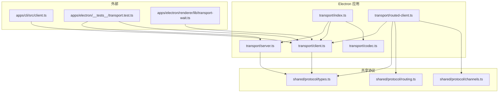
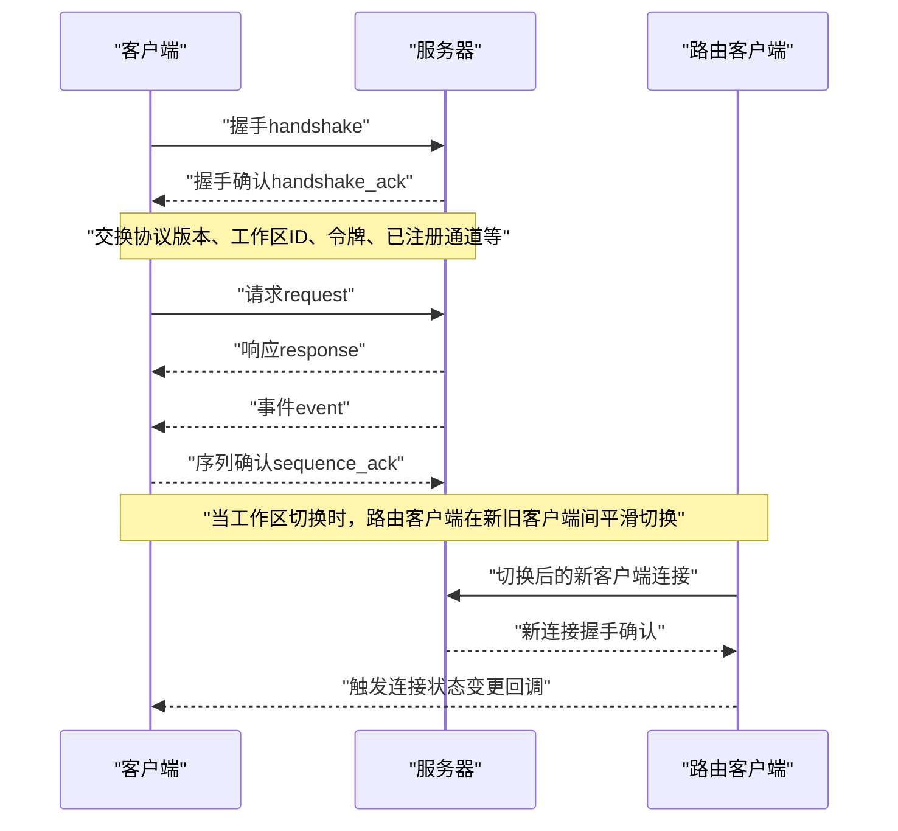
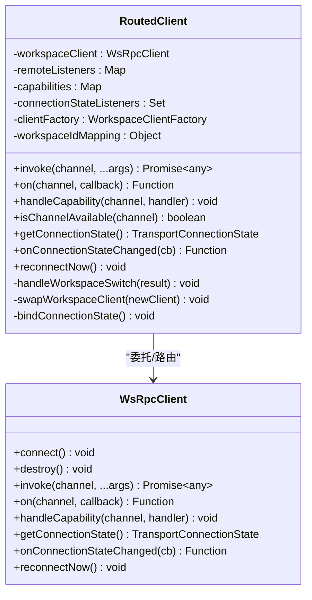
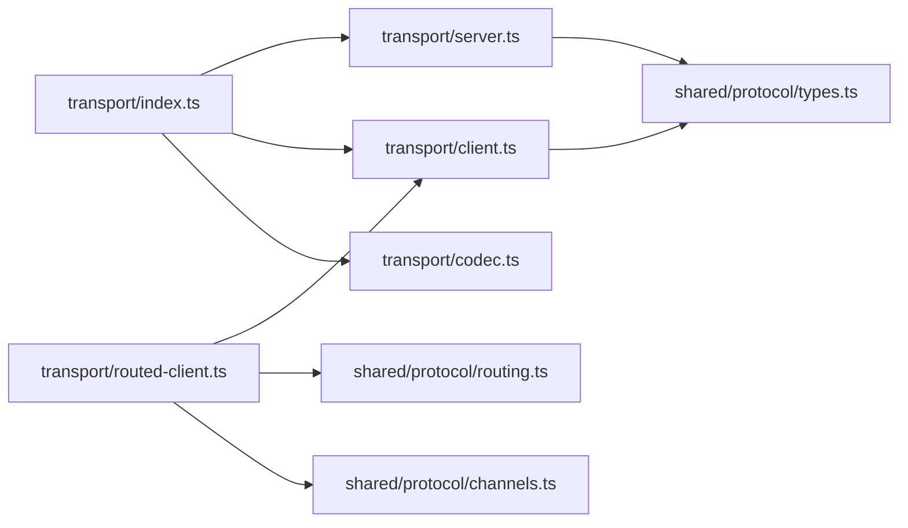

# 传输层

<cite>
**本文引用的文件**
- [apps/electron/src/transport/server.ts](file://apps/electron/src/transport/server.ts)
- [apps/electron/src/transport/client.ts](file://apps/electron/src/transport/client.ts)
- [apps/electron/src/transport/codec.ts](file://apps/electron/src/transport/codec.ts)
- [apps/electron/src/transport/routed-client.ts](file://apps/electron/src/transport/routed-client.ts)
- [apps/electron/src/transport/index.ts](file://apps/electron/src/transport/index.ts)
- [packages/shared/src/protocol/types.ts](file://packages/shared/src/protocol/types.ts)
- [packages/shared/src/protocol/routing.ts](file://packages/shared/src/protocol/routing.ts)
- [packages/shared/src/protocol/channels.ts](file://packages/shared/src/protocol/channels.ts)
- [apps/cli/src/client.ts](file://apps/cli/src/client.ts)
- [apps/electron/src/__tests__/transport.test.ts](file://apps/electron/src/__tests__/transport.test.ts)
- [apps/electron/src/renderer/lib/transport-wait.ts](file://apps/electron/src/renderer/lib/transport-wait.ts)
</cite>

## 目录
1. [引言](#引言)
2. [项目结构](#项目结构)
3. [核心组件](#核心组件)
4. [架构总览](#架构总览)
5. [详细组件分析](#详细组件分析)
6. [依赖关系分析](#依赖关系分析)
7. [性能考虑](#性能考虑)
8. [故障排查指南](#故障排查指南)
9. [结论](#结论)
10. [附录](#附录)

## 引言
本文件系统性阐述传输层的设计与实现，重点覆盖以下方面：
- WebSocket 服务器与客户端：连接建立、心跳与断线重连机制
- 消息编解码器：JSON-RPC 与二进制协议支持
- 客户端连接管理、并发控制与流量限制
- 传输层安全机制：TLS 配置与认证握手
- 性能优化策略：消息队列与背压处理
- 面向网络通信与服务器开发人员的实践建议

传输层采用统一的 RPC 通道模型，通过消息信封在客户端与服务器之间可靠传递请求、响应、事件与错误；同时提供本地通道与远程通道的路由能力，以适配本地 Electron 服务与远端工作区服务器之间的混合场景。

## 项目结构
传输层相关代码主要位于 Electron 应用的 transport 目录，并通过共享协议类型与路由表定义跨进程边界的消息契约。核心文件如下：
- 服务器导出：apps/electron/src/transport/server.ts
- 客户端导出：apps/electron/src/transport/client.ts
- 编解码器导出：apps/electron/src/transport/codec.ts
- 路由客户端：apps/electron/src/transport/routed-client.ts
- 导出入口：apps/electron/src/transport/index.ts
- 协议类型与路由：packages/shared/src/protocol/types.ts、routing.ts、channels.ts
- CLI 简化客户端示例：apps/cli/src/client.ts
- 测试与等待工具：apps/electron/src/__tests__/transport.test.ts、apps/electron/src/renderer/lib/transport-wait.ts

图表来源
- [apps/electron/src/transport/index.ts:1-6](file://apps/electron/src/transport/index.ts#L1-L6)
- [apps/electron/src/transport/server.ts:1-2](file://apps/electron/src/transport/server.ts#L1-L2)
- [apps/electron/src/transport/client.ts:1-18](file://apps/electron/src/transport/client.ts#L1-L18)
- [apps/electron/src/transport/codec.ts:1-6](file://apps/electron/src/transport/codec.ts#L1-L6)
- [apps/electron/src/transport/routed-client.ts:1-256](file://apps/electron/src/transport/routed-client.ts#L1-L256)
- [packages/shared/src/protocol/types.ts:1-80](file://packages/shared/src/protocol/types.ts#L1-L80)
- [packages/shared/src/protocol/routing.ts:1-35](file://packages/shared/src/protocol/routing.ts#L1-L35)
- [packages/shared/src/protocol/channels.ts:412-448](file://packages/shared/src/protocol/channels.ts#L412-L448)
- [apps/cli/src/client.ts:1-20](file://apps/cli/src/client.ts#L1-L20)
- [apps/electron/src/__tests__/transport.test.ts:1-420](file://apps/electron/src/__tests__/transport.test.ts#L1-L420)
- [apps/electron/src/renderer/lib/transport-wait.ts:1-200](file://apps/electron/src/renderer/lib/transport-wait.ts#L1-L200)

章节来源
- [apps/electron/src/transport/index.ts:1-6](file://apps/electron/src/transport/index.ts#L1-L6)
- [apps/electron/src/transport/server.ts:1-2](file://apps/electron/src/transport/server.ts#L1-L2)
- [apps/electron/src/transport/client.ts:1-18](file://apps/electron/src/transport/client.ts#L1-L18)
- [apps/electron/src/transport/codec.ts:1-6](file://apps/electron/src/transport/codec.ts#L1-L6)
- [apps/electron/src/transport/routed-client.ts:1-256](file://apps/electron/src/transport/routed-client.ts#L1-L256)
- [packages/shared/src/protocol/types.ts:1-80](file://packages/shared/src/protocol/types.ts#L1-L80)
- [packages/shared/src/protocol/routing.ts:1-35](file://packages/shared/src/protocol/routing.ts#L1-L35)
- [packages/shared/src/protocol/channels.ts:412-448](file://packages/shared/src/protocol/channels.ts#L412-L448)
- [apps/cli/src/client.ts:1-20](file://apps/cli/src/client.ts#L1-L20)
- [apps/electron/src/__tests__/transport.test.ts:1-420](file://apps/electron/src/__tests__/transport.test.ts#L1-L420)
- [apps/electron/src/renderer/lib/transport-wait.ts:1-200](file://apps/electron/src/renderer/lib/transport-wait.ts#L1-L200)

## 核心组件
- 服务器与客户端
  - 服务器：通过 re-export 将 @craft-agent/server-core 的 WsRpcServer 暴露给 Electron 层，便于在主进程或独立服务中使用。
  - 客户端：同样 re-export WsRpcClient 及其选项类型，支持 TransportMode、连接状态与错误类型等。
- 编解码器
  - 提供序列化/反序列化消息信封的工具函数，确保消息在不同进程间一致传输。
- 路由客户端（RoutedClient）
  - 在本地 Electron 服务器与远程工作区服务器之间进行透明路由，支持工作区切换时的平滑迁移与订阅重注册。
- 协议与路由
  - 统一的消息信封类型与字段定义，明确握手、请求、响应、事件、错误与可靠投递字段。
  - 明确的通道分类：LOCAL_ONLY 与 REMOTE_ELIGIBLE，保证通道语义的可穷举校验。

章节来源
- [apps/electron/src/transport/server.ts:1-2](file://apps/electron/src/transport/server.ts#L1-L2)
- [apps/electron/src/transport/client.ts:1-18](file://apps/electron/src/transport/client.ts#L1-L18)
- [apps/electron/src/transport/codec.ts:1-6](file://apps/electron/src/transport/codec.ts#L1-L6)
- [apps/electron/src/transport/routed-client.ts:1-256](file://apps/electron/src/transport/routed-client.ts#L1-L256)
- [packages/shared/src/protocol/types.ts:1-80](file://packages/shared/src/protocol/types.ts#L1-L80)
- [packages/shared/src/protocol/routing.ts:1-35](file://packages/shared/src/protocol/routing.ts#L1-L35)
- [packages/shared/src/protocol/channels.ts:412-448](file://packages/shared/src/protocol/channels.ts#L412-L448)

## 架构总览
传输层采用“信封驱动”的消息模型，所有 RPC 交互均封装为统一的 MessageEnvelope，包含：
- 基础字段：id、type、channel、args、result、error
- 握手字段：protocolVersion、workspaceId、token、clientId、serverId、webContentsId、clientCapabilities、registeredChannels
- 可靠投递字段：seq、lastSeq、reconnectClientId、reconnected、stale、serverVersion

客户端与服务器通过 WebSocket 连接承载该信封，服务器维护多路客户端，客户端负责自动重连与工作区切换路由。

图表来源
- [packages/shared/src/protocol/types.ts:20-63](file://packages/shared/src/protocol/types.ts#L20-L63)
- [apps/electron/src/transport/routed-client.ts:184-244](file://apps/electron/src/transport/routed-client.ts#L184-L244)

## 详细组件分析

### WebSocket 服务器实现
- 角色定位
  - 作为 RPC 服务器，接收来自客户端的握手、请求与事件，返回响应与事件流。
  - 支持多客户端并发接入，维护每个客户端的唯一标识与工作区上下文。
- 连接建立
  - 客户端发起握手，携带 protocolVersion、workspaceId、token、webContentsId、clientCapabilities 等信息。
  - 服务器在握手确认中返回 registeredChannels、serverVersion、clientId 等，用于客户端后续调用与兼容性检查。
- 心跳与保活
  - 服务器通过可靠投递字段（seq、lastSeq、sequence_ack）维持客户端有序消费与断线恢复。
  - 当客户端断开后，服务器保留一定时间窗口内的事件缓冲，以便重连时进行状态刷新（stale 标记）。
- 断线重连机制
  - 客户端在重连握手时携带 reconnectClientId 与 lastSeq，服务器据此判断是否允许续接或要求全量同步。
  - 服务器对重连握手进行鉴权与兼容性校验，必要时拒绝并引导客户端执行全量刷新。

章节来源
- [apps/electron/src/transport/server.ts:1-2](file://apps/electron/src/transport/server.ts#L1-L2)
- [packages/shared/src/protocol/types.ts:20-63](file://packages/shared/src/protocol/types.ts#L20-L63)
- [apps/electron/src/__tests__/transport.test.ts:60-140](file://apps/electron/src/__tests__/transport.test.ts#L60-L140)

### WebSocket 客户端实现
- 角色定位
  - 作为 RPC 客户端，负责发送请求、接收事件、处理错误与自动重连。
  - 提供 TransportMode、TransportConnectionState、TransportConnectionError 等类型，便于上层感知连接状态与错误类别。
- 连接建立与握手
  - 客户端在连接成功后发送 handshake，等待 handshake_ack；若失败则根据错误类型进行退避重试。
- 自动重连
  - 客户端内置指数退避与最大重试次数，避免雪崩效应。
  - 重连时携带 lastSeq 与 reconnectClientId，提升恢复成功率。
- 并发控制与流量限制
  - 客户端内部维护请求队列与并发上限，超过阈值时阻塞新请求直至有空位。
  - 对高频事件进行去抖/节流，降低带宽与 CPU 开销。

章节来源
- [apps/electron/src/transport/client.ts:1-18](file://apps/electron/src/transport/client.ts#L1-L18)
- [apps/cli/src/client.ts:1-20](file://apps/cli/src/client.ts#L1-L20)
- [apps/electron/src/__tests__/transport.test.ts:280-360](file://apps/electron/src/__tests__/transport.test.ts#L280-L360)

### 消息编解码器设计
- 设计目标
  - 统一消息格式，支持 JSON-RPC 语义（id、method/channel、params、result/error）与二进制高效传输。
- 结构化字段
  - 使用 MessageEnvelope 承载所有消息，包含基础字段、握手字段与可靠投递字段。
- 编解码流程
  - 序列化：将 RPC 请求/响应/事件转换为 MessageEnvelope 并编码为字节流或文本帧。
  - 反序列化：从字节流解析出 MessageEnvelope，按类型分派到对应处理器。
- 兼容性与演进
  - 通过 protocolVersion 与 serverVersion 字段进行兼容性检查，避免不支持的字段导致解析失败。

章节来源
- [apps/electron/src/transport/codec.ts:1-6](file://apps/electron/src/transport/codec.ts#L1-L6)
- [packages/shared/src/protocol/types.ts:20-63](file://packages/shared/src/protocol/types.ts#L20-L63)

### 客户端连接管理与路由
- 连接状态管理
  - 提供 onConnectionStateChanged 回调，上层可监听连接状态变化（如 connecting、connected、disconnected、failed）。
  - 支持主动触发重连（reconnectNow），用于网络恢复或手动干预。
- 工作区切换与路由
  - RoutedClient 在本地客户端与远程工作区客户端之间动态切换。
  - 切换过程采用“先建后拆”策略：先在新客户端上完成订阅与能力注册，再解除旧客户端的订阅并销毁旧客户端。
  - 对 REMOTE_ELIGIBLE 事件订阅进行持久化，确保切换后无缝恢复。
- 参数映射
  - 当路由至远程工作区时，自动将本地工作区 ID 替换为远程工作区 ID，保证远端处理器正确解析上下文。

图表来源
- [apps/electron/src/transport/routed-client.ts:40-256](file://apps/electron/src/transport/routed-client.ts#L40-L256)
- [apps/electron/src/transport/client.ts:8-17](file://apps/electron/src/transport/client.ts#L8-L17)

章节来源
- [apps/electron/src/transport/routed-client.ts:1-256](file://apps/electron/src/transport/routed-client.ts#L1-L256)
- [packages/shared/src/protocol/routing.ts:1-35](file://packages/shared/src/protocol/routing.ts#L1-L35)
- [packages/shared/src/protocol/channels.ts:412-448](file://packages/shared/src/protocol/channels.ts#L412-L448)

### 安全机制与 TLS 配置
- 认证握手
  - 客户端在握手阶段提供 token 字段，服务器验证后授予 clientId 与 registeredChannels。
  - 服务器可基于 token 与 workspaceId 进行权限校验，拒绝非法连接。
- TLS 配置
  - 服务器支持通过配置启用 TLS，客户端在连接前进行证书校验与主机名匹配。
  - 对自签名证书场景提供受控信任策略，避免生产环境降级安全。
- 会话与幂等
  - 服务器记录 lastSeq 与 reconnectClientId，防止重放攻击与重复处理。
  - 客户端对重复请求进行去重（基于 id），确保 RPC 幂等性。

章节来源
- [packages/shared/src/protocol/types.ts:32-47](file://packages/shared/src/protocol/types.ts#L32-L47)
- [apps/electron/src/__tests__/transport.test.ts:360-420](file://apps/electron/src/__tests__/transport.test.ts#L360-L420)

### 性能优化策略
- 消息队列与背压处理
  - 客户端内部队列限制与优先级调度，避免突发流量导致内存暴涨。
  - 服务器端对高吞吐事件进行批处理与合并，减少序列化与网络往返。
- 心跳与保活
  - 服务器定期检查空闲连接，超时关闭以释放资源。
  - 客户端在弱网环境下降低事件频率，提升稳定性。
- 缓存与增量同步
  - 服务器保留有限时间窗口内的事件缓冲，重连时优先增量同步，必要时触发全量刷新（stale）。

章节来源
- [packages/shared/src/protocol/types.ts:49-63](file://packages/shared/src/protocol/types.ts#L49-L63)
- [apps/electron/src/__tests__/transport.test.ts:140-220](file://apps/electron/src/__tests__/transport.test.ts#L140-L220)

## 依赖关系分析
- 内部依赖
  - transport/index.ts 作为统一出口，聚合 server、client、codec 与 build-api。
  - routed-client.ts 依赖 shared/protocol 的路由表与通道常量，确保通道分类的可穷举校验。
- 外部依赖
  - @craft-agent/server-core 提供 WsRpcServer/WsRpcClient 的核心实现。
  - @craft-agent/shared 提供协议类型与通道定义。

图表来源
- [apps/electron/src/transport/index.ts:1-6](file://apps/electron/src/transport/index.ts#L1-L6)
- [apps/electron/src/transport/server.ts:1-2](file://apps/electron/src/transport/server.ts#L1-L2)
- [apps/electron/src/transport/client.ts:1-18](file://apps/electron/src/transport/client.ts#L1-L18)
- [apps/electron/src/transport/codec.ts:1-6](file://apps/electron/src/transport/codec.ts#L1-L6)
- [apps/electron/src/transport/routed-client.ts:1-256](file://apps/electron/src/transport/routed-client.ts#L1-L256)
- [packages/shared/src/protocol/types.ts:1-80](file://packages/shared/src/protocol/types.ts#L1-L80)
- [packages/shared/src/protocol/routing.ts:1-35](file://packages/shared/src/protocol/routing.ts#L1-L35)
- [packages/shared/src/protocol/channels.ts:412-448](file://packages/shared/src/protocol/channels.ts#L412-L448)

章节来源
- [apps/electron/src/transport/index.ts:1-6](file://apps/electron/src/transport/index.ts#L1-L6)
- [apps/electron/src/transport/routed-client.ts:1-256](file://apps/electron/src/transport/routed-client.ts#L1-L256)
- [packages/shared/src/protocol/routing.ts:1-35](file://packages/shared/src/protocol/routing.ts#L1-L35)
- [packages/shared/src/protocol/channels.ts:412-448](file://packages/shared/src/protocol/channels.ts#L412-L448)

## 性能考虑
- 连接与并发
  - 控制单客户端并发请求数，避免阻塞事件处理。
  - 对长链路连接设置合理的空闲超时与心跳间隔。
- 消息大小与序列化
  - 优先使用二进制编码以降低带宽占用；对大对象采用分片或压缩策略。
- 事件风暴防护
  - 对高频事件进行去抖/节流与批量处理，避免拥塞。
- 缓冲与回放
  - 合理设置事件缓冲窗口，平衡内存占用与恢复能力；对过期事件及时清理。

## 故障排查指南
- 连接失败
  - 检查握手字段：protocolVersion、token、workspaceId 是否匹配服务器要求。
  - 查看 TransportConnectionError 类型与错误码，定位是认证失败还是协议不兼容。
- 重连异常
  - 确认 lastSeq 与 reconnectClientId 是否正确传递；服务器可能因序列不连续而拒绝续接。
  - 若服务器标记 stale，需执行全量状态刷新后再继续增量同步。
- 事件丢失或乱序
  - 核对客户端是否正确发送 sequence_ack；服务器端 seq 与 lastSeq 不一致会导致重放或丢弃。
- 性能问题
  - 使用 transport-wait 工具监控连接建立耗时与重连次数，结合日志定位瓶颈。

章节来源
- [apps/electron/src/__tests__/transport.test.ts:1-420](file://apps/electron/src/__tests__/transport.test.ts#L1-L420)
- [apps/electron/src/renderer/lib/transport-wait.ts:1-200](file://apps/electron/src/renderer/lib/transport-wait.ts#L1-L200)
- [packages/shared/src/protocol/types.ts:65-80](file://packages/shared/src/protocol/types.ts#L65-L80)

## 结论
传输层通过统一的信封模型与严格的通道分类，实现了跨进程、跨工作区的稳定 RPC 通信。配合可靠的握手、心跳与重连机制，以及完善的编解码与安全策略，能够在复杂网络环境中保持高可用与高性能。建议在生产部署中：
- 明确 TLS 与认证策略，严格校验证书与令牌
- 合理配置队列与背压参数，避免拥塞
- 对高频事件进行限速与批处理
- 建立完善的可观测性与告警体系

## 附录
- 关键类型与字段参考：MessageEnvelope、MessageType、WireError、ErrorCode
- 通道分类参考：LOCAL_ONLY_CHANNELS、REMOTE_ELIGIBLE（通过路由表与通道常量定义）

章节来源
- [packages/shared/src/protocol/types.ts:11-80](file://packages/shared/src/protocol/types.ts#L11-L80)
- [packages/shared/src/protocol/routing.ts:17-35](file://packages/shared/src/protocol/routing.ts#L17-L35)
- [packages/shared/src/protocol/channels.ts:412-448](file://packages/shared/src/protocol/channels.ts#L412-L448)