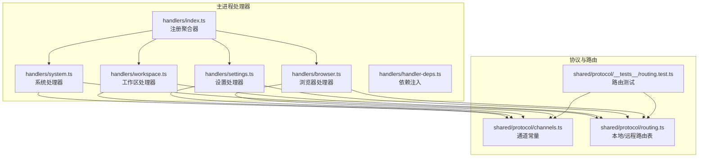
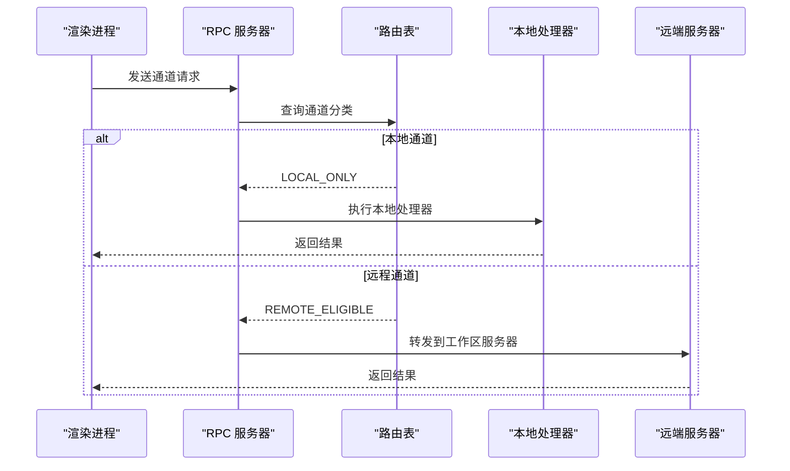
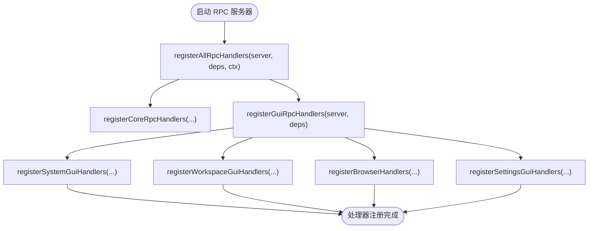
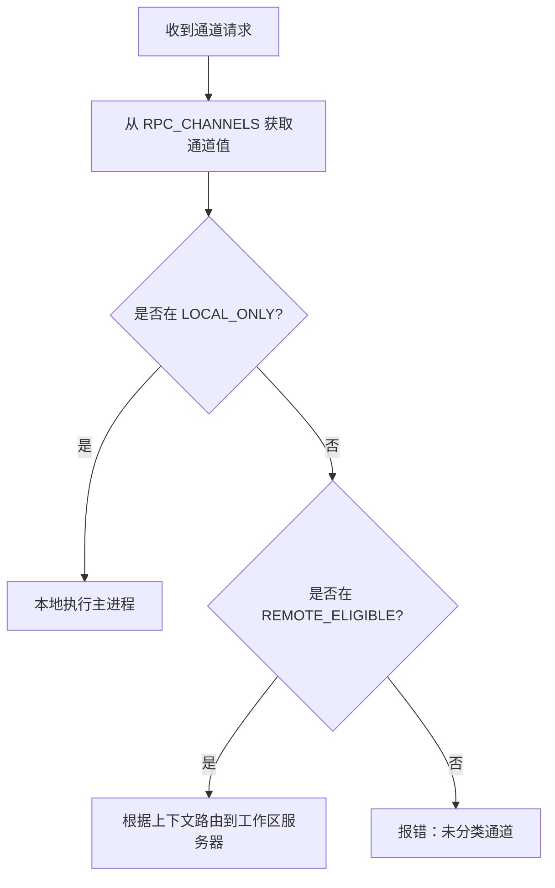
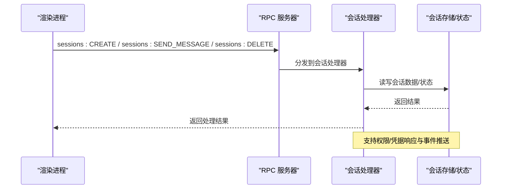
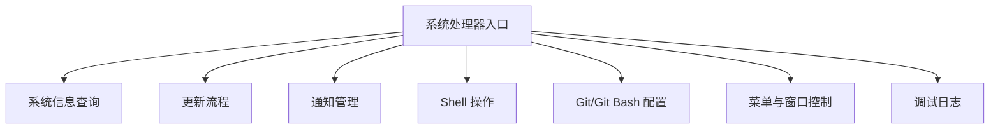
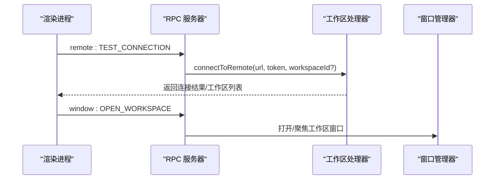
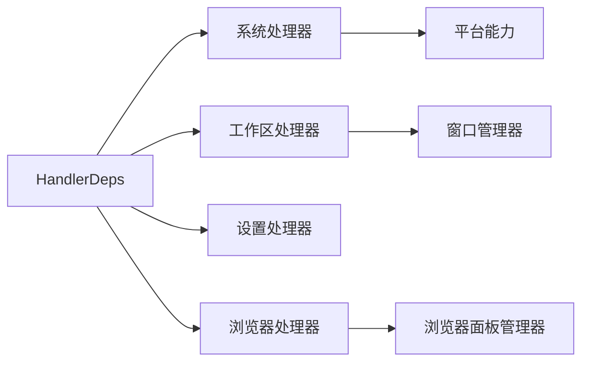

# 处理器系统

<cite>
**本文引用的文件**
- [apps/electron/src/main/handlers/index.ts](file://apps/electron/src/main/handlers/index.ts)
- [apps/electron/src/main/handlers/system.ts](file://apps/electron/src/main/handlers/system.ts)
- [apps/electron/src/main/handlers/workspace.ts](file://apps/electron/src/main/handlers/workspace.ts)
- [apps/electron/src/main/handlers/settings.ts](file://apps/electron/src/main/handlers/settings.ts)
- [apps/electron/src/main/handlers/browser.ts](file://apps/electron/src/main/handlers/browser.ts)
- [apps/electron/src/main/handlers/handler-deps.ts](file://apps/electron/src/main/handlers/handler-deps.ts)
- [packages/shared/src/protocol/channels.ts](file://packages/shared/src/protocol/channels.ts)
- [packages/shared/src/protocol/routing.ts](file://packages/shared/src/protocol/routing.ts)
- [packages/shared/src/protocol/__tests__/routing.test.ts](file://packages/shared/src/protocol/__tests__/routing.test.ts)
</cite>

## 目录
1. [简介](#简介)
2. [项目结构](#项目结构)
3. [核心组件](#核心组件)
4. [架构总览](#架构总览)
5. [详细组件分析](#详细组件分析)
6. [依赖关系分析](#依赖关系分析)
7. [性能考虑](#性能考虑)
8. [故障排查指南](#故障排查指南)
9. [结论](#结论)
10. [附录](#附录)

## 简介
本文件系统性梳理处理器（Handler）体系的设计与实现，覆盖 RPC 处理器的注册机制、请求路由与分发逻辑；会话处理器的实现要点（创建、更新、删除等）；系统处理器的功能边界（服务器状态查询、配置管理、健康检查等）；工作区处理器的实现细节、权限验证与访问控制；以及自定义处理器的开发指南、错误处理策略与性能监控建议。文档面向 API 开发与服务器维护人员，帮助快速理解与扩展处理器系统。

## 项目结构
处理器系统位于 Electron 主进程的 handlers 目录中，按功能域拆分为多个处理器模块：系统处理器、工作区处理器、设置处理器、浏览器处理器。所有处理器通过统一入口进行注册，并基于通道（Channel）路由表决定本地执行还是远程执行。

**图表来源**
- [apps/electron/src/main/handlers/index.ts:1-23](file://apps/electron/src/main/handlers/index.ts#L1-L23)
- [apps/electron/src/main/handlers/system.ts:1-441](file://apps/electron/src/main/handlers/system.ts#L1-L441)
- [apps/electron/src/main/handlers/workspace.ts:1-137](file://apps/electron/src/main/handlers/workspace.ts#L1-L137)
- [apps/electron/src/main/handlers/settings.ts:1-31](file://apps/electron/src/main/handlers/settings.ts#L1-L31)
- [apps/electron/src/main/handlers/browser.ts:1-185](file://apps/electron/src/main/handlers/browser.ts#L1-L185)
- [apps/electron/src/main/handlers/handler-deps.ts:1-19](file://apps/electron/src/main/handlers/handler-deps.ts#L1-L19)
- [packages/shared/src/protocol/channels.ts:412-448](file://packages/shared/src/protocol/channels.ts#L412-L448)
- [packages/shared/src/protocol/routing.ts:1-432](file://packages/shared/src/protocol/routing.ts#L1-L432)
- [packages/shared/src/protocol/__tests__/routing.test.ts:1-71](file://packages/shared/src/protocol/__tests__/routing.test.ts#L1-L71)

**章节来源**
- [apps/electron/src/main/handlers/index.ts:1-23](file://apps/electron/src/main/handlers/index.ts#L1-L23)
- [apps/electron/src/main/handlers/handler-deps.ts:1-19](file://apps/electron/src/main/handlers/handler-deps.ts#L1-L19)
- [packages/shared/src/protocol/routing.ts:1-432](file://packages/shared/src/protocol/routing.ts#L1-L432)

## 核心组件
- 注册聚合器：集中导出并调用各处理器的注册函数，确保 RPC 服务端在启动时完成全部处理器绑定。
- 依赖注入：通过 HandlerDeps 将会话管理、窗口管理、浏览器面板管理、OAuth 存储等外部能力注入到处理器中。
- 通道与路由：基于 RPC_CHANNELS 常量与 LOCAL_ONLY/REMOTE_ELIGIBLE 路由表，决定请求是本地执行还是转发至工作区所属的远端服务器。

**章节来源**
- [apps/electron/src/main/handlers/index.ts:12-22](file://apps/electron/src/main/handlers/index.ts#L12-L22)
- [apps/electron/src/main/handlers/handler-deps.ts:13-18](file://apps/electron/src/main/handlers/handler-deps.ts#L13-L18)
- [packages/shared/src/protocol/routing.ts:1-432](file://packages/shared/src/protocol/routing.ts#L1-L432)

## 架构总览
处理器系统采用“本地执行 + 远程代理”的混合架构：
- 本地通道（LOCAL_ONLY）：直接在主进程执行，典型场景为系统级操作、UI 窗口管理、通知与菜单等。
- 远程通道（REMOTE_ELIGIBLE）：根据请求上下文（如 workspaceId）路由到对应工作区的服务器执行，典型场景为会话管理、资源操作、消息网关等。

**图表来源**
- [packages/shared/src/protocol/routing.ts:1-432](file://packages/shared/src/protocol/routing.ts#L1-L432)
- [packages/shared/src/protocol/channels.ts:412-448](file://packages/shared/src/protocol/channels.ts#L412-L448)

## 详细组件分析

### RPC 处理器注册机制
- 入口注册：registerAllRpcHandlers 聚合核心与 GUI 处理器，确保在 RPC 服务器启动后一次性完成绑定。
- GUI 注册：registerGuiRpcHandlers 按顺序注册系统、工作区、浏览器、设置等 GUI 专属处理器。
- 依赖注入：所有处理器接收统一的 HandlerDeps，解耦平台能力与业务逻辑。

**图表来源**
- [apps/electron/src/main/handlers/index.ts:12-22](file://apps/electron/src/main/handlers/index.ts#L12-L22)

**章节来源**
- [apps/electron/src/main/handlers/index.ts:12-22](file://apps/electron/src/main/handlers/index.ts#L12-L22)
- [apps/electron/src/main/handlers/handler-deps.ts:13-18](file://apps/electron/src/main/handlers/handler-deps.ts#L13-L18)

### 请求路由与分发逻辑
- 通道枚举：RPC_CHANNELS 定义了所有可用通道，用于统一命名与类型约束。
- 路由表：LOCAL_ONLY 与 REMOTE_ELIGIBLE 两套集合，保证每个通道仅属于一个集合，且完全穷尽。
- 测试保障：路由测试确保新增通道必须显式分类，避免遗漏或重复。

**图表来源**
- [packages/shared/src/protocol/routing.ts:1-432](file://packages/shared/src/protocol/routing.ts#L1-L432)
- [packages/shared/src/protocol/channels.ts:412-448](file://packages/shared/src/protocol/channels.ts#L412-L448)
- [packages/shared/src/protocol/__tests__/routing.test.ts:1-71](file://packages/shared/src/protocol/__tests__/routing.test.ts#L1-L71)

**章节来源**
- [packages/shared/src/protocol/routing.ts:1-432](file://packages/shared/src/protocol/routing.ts#L1-L432)
- [packages/shared/src/protocol/channels.ts:412-448](file://packages/shared/src/protocol/channels.ts#L412-L448)
- [packages/shared/src/protocol/__tests__/routing.test.ts:1-71](file://packages/shared/src/protocol/__tests__/routing.test.ts#L1-L71)

### 会话处理器实现要点
- 会话生命周期：创建、删除、消息读取、发送、取消、模型切换、文件/笔记管理、权限与凭据响应等。
- 权限与凭据：支持按会话维度的权限模式状态查询与响应，以及凭据请求响应。
- 事件与订阅：提供未读摘要、事件推送、计划执行状态等订阅接口。
- 访问控制：结合消息网关通道，实现平台所有者、访问模式、待处理发送方、绑定访问等控制。

**图表来源**
- [packages/shared/src/protocol/routing.ts:228-250](file://packages/shared/src/protocol/routing.ts#L228-L250)

**章节来源**
- [packages/shared/src/protocol/routing.ts:228-250](file://packages/shared/src/protocol/routing.ts#L228-L250)

### 系统处理器（系统状态、配置、健康检查）
- 系统信息：主题偏好、运行版本、用户主目录、调试模式等。
- 更新与通知：自动更新检查、安装、忽略版本；通知开关与显示。
- Shell 操作：打开 URL（含深链）、打开文件、在文件夹中显示。
- Git/Git Bash：检测与配置 Git Bash 路径，跨平台兼容。
- 菜单与窗口：窗口最小化/最大化、缩放、开发者工具、撤销/重做、剪切/复制/粘贴等。
- 调试日志：从渲染进程转发调试日志到主进程日志。

**图表来源**
- [apps/electron/src/main/handlers/system.ts:69-266](file://apps/electron/src/main/handlers/system.ts#L69-L266)
- [apps/electron/src/main/handlers/system.ts:268-440](file://apps/electron/src/main/handlers/system.ts#L268-L440)

**章节来源**
- [apps/electron/src/main/handlers/system.ts:69-266](file://apps/electron/src/main/handlers/system.ts#L69-L266)
- [apps/electron/src/main/handlers/system.ts:268-440](file://apps/electron/src/main/handlers/system.ts#L268-L440)

### 工作区处理器（连接、打开、关闭）
- 远端连接测试：连接到远程服务器，握手后返回工作区列表或需要创建工作区的提示。
- 工作区打开：在新窗口中打开指定工作区，或聚焦已存在窗口。
- 会话打开：在新窗口中打开指定会话。
- 窗口生命周期：关闭、确认关闭、取消关闭、交通灯按钮可见性控制。
- 深链集成：通过 craftagents:// 协议在窗口间导航。

**图表来源**
- [apps/electron/src/main/handlers/workspace.ts:21-94](file://apps/electron/src/main/handlers/workspace.ts#L21-L94)
- [apps/electron/src/main/handlers/workspace.ts:96-136](file://apps/electron/src/main/handlers/workspace.ts#L96-L136)

**章节来源**
- [apps/electron/src/main/handlers/workspace.ts:21-94](file://apps/electron/src/main/handlers/workspace.ts#L21-L94)
- [apps/electron/src/main/handlers/workspace.ts:96-136](file://apps/electron/src/main/handlers/workspace.ts#L96-L136)

### 设置处理器（电源与网络代理）
- 保持唤醒：持久化设置并同步到电源管理器。
- 网络代理：更新 Electron 会话的网络代理配置。

**章节来源**
- [apps/electron/src/main/handlers/settings.ts:14-30](file://apps/electron/src/main/handlers/settings.ts#L14-L30)

### 浏览器处理器（Browser Pane 管理）
- 实例管理：创建、销毁、列出实例。
- 导航与交互：跳转、前进、后退、刷新、停止、聚焦。
- 用户交互：点击、填写、选择元素。
- 截图与快照：可访问性快照、屏幕截图（Base64 返回）。
- 事件广播：实例状态变更、移除、交互事件向所有窗口广播。

**章节来源**
- [apps/electron/src/main/handlers/browser.ts:26-184](file://apps/electron/src/main/handlers/browser.ts#L26-L184)

## 依赖关系分析
- 组件内聚：各处理器模块职责清晰，分别覆盖系统、工作区、设置、浏览器等不同领域。
- 组件耦合：处理器通过 HandlerDeps 解耦平台能力；通道与路由通过共享协议层统一约束。
- 外部依赖：系统处理器依赖平台能力（日志、系统主题、退出等）；工作区处理器依赖窗口管理器；浏览器处理器依赖浏览器面板管理器。

**图表来源**
- [apps/electron/src/main/handlers/handler-deps.ts:13-18](file://apps/electron/src/main/handlers/handler-deps.ts#L13-L18)
- [apps/electron/src/main/handlers/system.ts:1-11](file://apps/electron/src/main/handlers/system.ts#L1-L11)
- [apps/electron/src/main/handlers/workspace.ts:1-3](file://apps/electron/src/main/handlers/workspace.ts#L1-L3)
- [apps/electron/src/main/handlers/browser.ts:1-4](file://apps/electron/src/main/handlers/browser.ts#L1-L4)

**章节来源**
- [apps/electron/src/main/handlers/handler-deps.ts:13-18](file://apps/electron/src/main/handlers/handler-deps.ts#L13-L18)

## 性能考虑
- 本地通道优先：将对系统资源敏感的操作（如窗口管理、通知、菜单）置于本地通道，降低网络往返开销。
- 异步与超时：远程连接测试设置超时，避免阻塞；浏览器导航与交互捕获异常并记录日志，防止崩溃扩散。
- 广播优化：浏览器事件广播使用“推”模式，避免轮询；仅在状态变化时推送。
- 日志与调试：调试日志为 fire-and-forget，不影响主流程；生产环境建议限制日志级别。

## 故障排查指南
- 通道未分类：新增通道需在路由表中明确归类，否则路由测试会失败。
- 连接失败：工作区连接测试返回失败时，检查远端服务器可达性、令牌有效性与握手状态。
- 文件路径安全：Shell 打开文件/文件夹前进行路径校验，拒绝越权路径。
- URL 安全：打开外部链接前进行协议校验，阻止不安全方案。
- 浏览器交互：导航/截图/交互失败时查看日志，确认实例 ID 与元素引用有效。

**章节来源**
- [packages/shared/src/protocol/__tests__/routing.test.ts:1-71](file://packages/shared/src/protocol/__tests__/routing.test.ts#L1-L71)
- [apps/electron/src/main/handlers/workspace.ts:61-94](file://apps/electron/src/main/handlers/workspace.ts#L61-L94)
- [apps/electron/src/main/handlers/system.ts:238-265](file://apps/electron/src/main/handlers/system.ts#L238-L265)
- [apps/electron/src/main/handlers/system.ts:206-236](file://apps/electron/src/main/handlers/system.ts#L206-L236)
- [apps/electron/src/main/handlers/browser.ts:50-184](file://apps/electron/src/main/handlers/browser.ts#L50-L184)

## 结论
处理器系统以通道路由为核心，实现了本地与远程能力的清晰分离与高效协作。通过统一的注册入口、依赖注入与路由表，系统具备良好的扩展性与可维护性。建议在新增处理器时严格遵循通道命名规范与路由分类规则，并配套完善错误处理与性能监控。

## 附录
- 自定义处理器开发指南
  - 新增通道：在 RPC_CHANNELS 中定义新通道名，确保唯一性。
  - 分类路由：在 LOCAL_ONLY 或 REMOTE_ELIGIBLE 中添加通道，保持穷尽性。
  - 注册处理器：在对应处理器模块中实现 handle，并在入口聚合器中注册。
  - 依赖注入：通过 HandlerDeps 注入所需平台能力，避免硬编码。
  - 错误处理：捕获并记录异常，必要时抛出语义化错误。
  - 性能监控：对耗时操作增加计时与日志，关注超时与重试策略。
- 权限验证与访问控制
  - 使用消息网关通道进行平台所有者与绑定访问控制。
  - 对敏感操作（如会话删除、资源导入导出）实施细粒度权限校验。
  - 在工作区上下文中校验操作范围，避免越权访问。