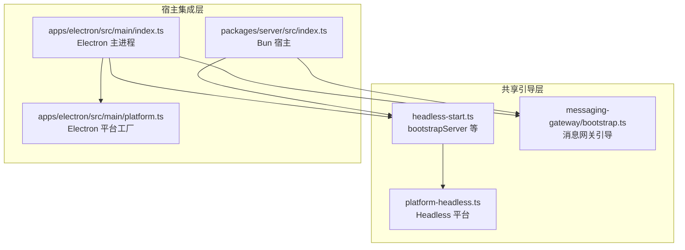
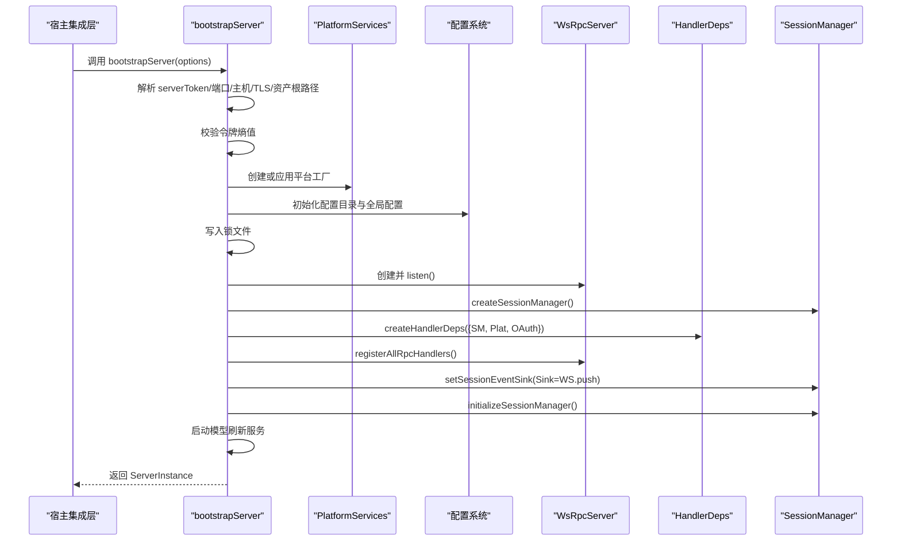
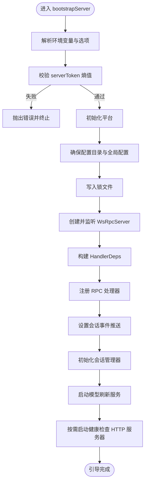
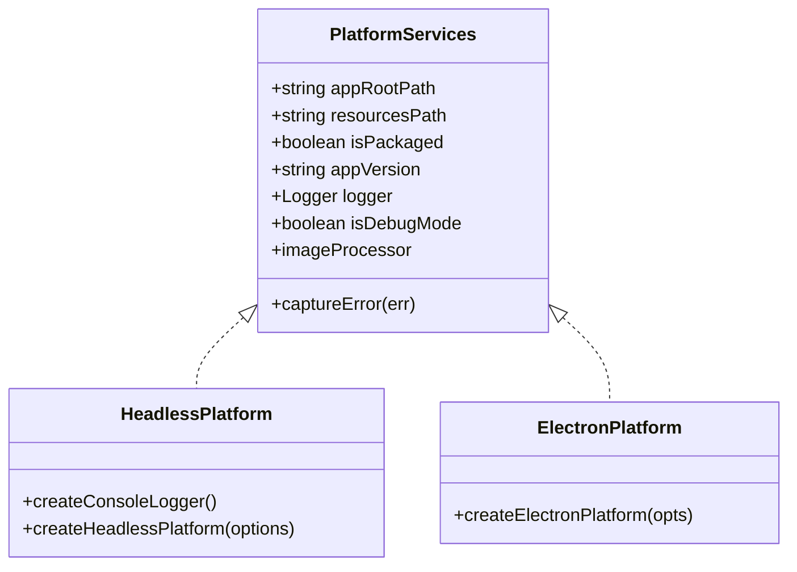
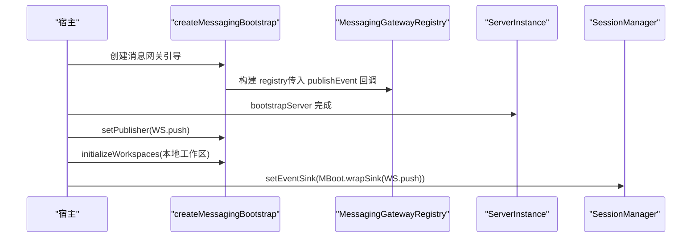
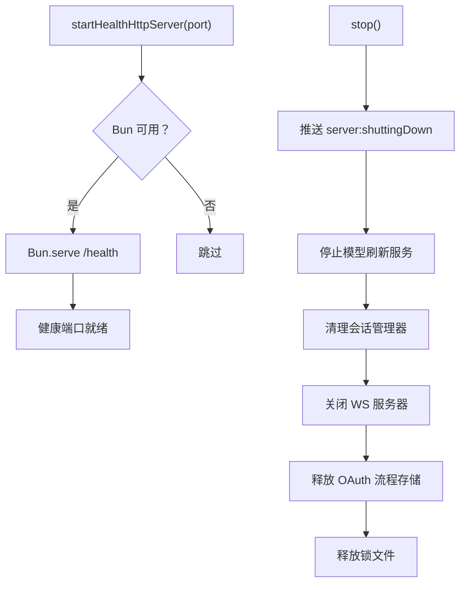
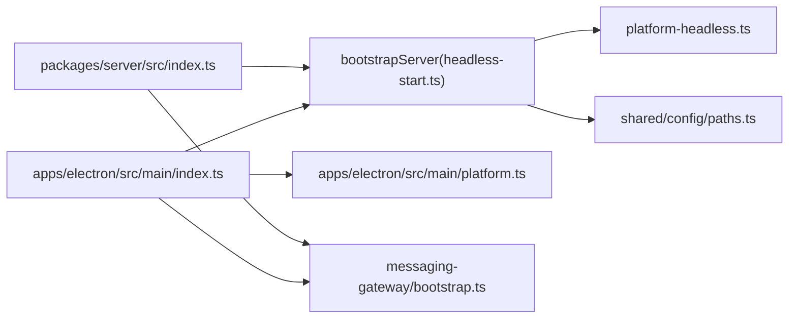

# 引导系统

<cite>
**本文引用的文件**
- [packages/server-core/src/bootstrap/headless-start.ts](file://packages/server-core/src/bootstrap/headless-start.ts)
- [packages/server-core/src/bootstrap/index.ts](file://packages/server-core/src/bootstrap/index.ts)
- [packages/server/src/index.ts](file://packages/server/src/index.ts)
- [apps/electron/src/main/index.ts](file://apps/electron/src/main/index.ts)
- [apps/electron/src/main/platform.ts](file://apps/electron/src/main/platform.ts)
- [packages/server-core/src/runtime/platform-headless.ts](file://packages/server-core/src/runtime/platform-headless.ts)
- [packages/messaging-gateway/src/bootstrap.ts](file://packages/messaging-gateway/src/bootstrap.ts)
- [packages/shared/src/config/paths.ts](file://packages/shared/src/config/paths.ts)
- [packages/server-core/src/bootstrap/__tests__/token-entropy.test.ts](file://packages/server-core/src/bootstrap/__tests__/token-entropy.test.ts)
- [scripts/build-server.ts](file://scripts/build-server.ts)
- [scripts/docker-smoke-test.sh](file://scripts/docker-smoke-test.sh)
- [scripts/generate-dev-cert.sh](file://scripts/generate-dev-cert.sh)
</cite>

## 目录
1. [引言](#引言)
2. [项目结构](#项目结构)
3. [核心组件](#核心组件)
4. [架构总览](#架构总览)
5. [详细组件分析](#详细组件分析)
6. [依赖关系分析](#依赖关系分析)
7. [性能考量](#性能考量)
8. [故障排查指南](#故障排查指南)
9. [结论](#结论)
10. [附录](#附录)

## 引言
本文件面向服务器架构师与高级开发者，系统化阐述服务器引导系统的设计与实现，重点覆盖以下主题：
- bootstrapServer 函数的初始化流程：从环境变量解析、配置文件加载到依赖注入容器的建立
- 启动参数处理机制：命令行参数与配置文件的合并策略
- 平台检测与适配逻辑：Headless 与 Electron 的差异与桥接
- 依赖项验证与错误处理：令牌强度校验、端口合法性、网络绑定安全策略
- 引导过程中的日志记录、健康检查、资源清理
- 自定义引导器的实现方法与扩展点

## 项目结构
引导系统由“共享引导层”和“宿主集成层”组成：
- 共享引导层（server-core）：提供跨宿主一致的引导 API（bootstrapServer）、平台抽象（PlatformServices）、健康检查、锁文件与资源清理等
- 宿主集成层（packages/server 与 apps/electron）：在不同运行时（Bun/Electron）中装配具体依赖，注入平台服务与会话管理器，并注册 RPC 处理器

图示来源
- [packages/server-core/src/bootstrap/headless-start.ts:252-394](file://packages/server-core/src/bootstrap/headless-start.ts#L252-L394)
- [packages/server-core/src/runtime/platform-headless.ts:44-88](file://packages/server-core/src/runtime/platform-headless.ts#L44-L88)
- [packages/messaging-gateway/src/bootstrap.ts:66-118](file://packages/messaging-gateway/src/bootstrap.ts#L66-L118)
- [packages/server/src/index.ts:166-254](file://packages/server/src/index.ts#L166-L254)
- [apps/electron/src/main/index.ts:604-705](file://apps/electron/src/main/index.ts#L604-L705)
- [apps/electron/src/main/platform.ts:21-72](file://apps/electron/src/main/platform.ts#L21-L72)

章节来源
- [packages/server-core/src/bootstrap/index.ts:1-2](file://packages/server-core/src/bootstrap/index.ts#L1-L2)
- [packages/server/src/index.ts:166-254](file://packages/server/src/index.ts#L166-L254)
- [apps/electron/src/main/index.ts:604-705](file://apps/electron/src/main/index.ts#L604-L705)

## 核心组件
- bootstrapServer：统一的服务器引导入口，负责令牌校验、平台初始化、配置目录与全局配置准备、服务监听、RPC 处理器注册、会话事件推送、模型刷新服务启动以及优雅停机
- ServerBootstrapOptions：引导选项接口，定义了可插拔的依赖构造器与生命周期钩子（如 createSessionManager、registerAllRpcHandlers、initializeSessionManager、cleanupSessionManager 等）
- ServerInstance：引导完成后返回的实例，包含平台、会话管理器、WS 服务器、OAuth 流程存储、连接上下文与 stop 回调
- 平台抽象 PlatformServices：屏蔽宿主差异，提供日志、图像处理、打包状态、版本号等能力
- 消息网关引导 createMessagingBootstrap：在 bootstrapServer 之后绑定发布者、组合事件扇出、初始化工作区

章节来源
- [packages/server-core/src/bootstrap/headless-start.ts:18-70](file://packages/server-core/src/bootstrap/headless-start.ts#L18-L70)
- [packages/server-core/src/bootstrap/headless-start.ts:252-394](file://packages/server-core/src/bootstrap/headless-start.ts#L252-L394)
- [packages/server-core/src/runtime/platform-headless.ts:44-88](file://packages/server-core/src/runtime/platform-headless.ts#L44-L88)
- [packages/messaging-gateway/src/bootstrap.ts:28-64](file://packages/messaging-gateway/src/bootstrap.ts#L28-L64)

## 架构总览
引导流程的关键步骤如下：
1. 参数解析与校验：优先使用显式选项，其次回退至环境变量；对令牌进行熵值校验，对端口范围进行合法性检查
2. 平台初始化：通过 platformFactory 或默认 Headless 平台创建 PlatformServices
3. 配置与资源：确保配置目录存在，初始化缺失的全局配置；写入锁文件防止重复启动
4. 服务监听：创建并启动 WsRpcServer，支持 TLS 与 HTTP 兼容端口
5. 依赖注入：创建会话管理器、处理器依赖对象、注册 RPC 处理器、设置会话事件推送
6. 启动辅助服务：启动模型刷新服务
7. 健康检查：按需启动 HTTP 健康端点（仅在 Bun 可用时）
8. 停机清理：发送关闭通知、停止模型刷新、清理会话管理器、关闭 WS、释放锁文件

图示来源
- [packages/server-core/src/bootstrap/headless-start.ts:252-394](file://packages/server-core/src/bootstrap/headless-start.ts#L252-L394)
- [packages/server/src/index.ts:166-254](file://packages/server/src/index.ts#L166-L254)
- [apps/electron/src/main/index.ts:604-705](file://apps/electron/src/main/index.ts#L604-L705)

## 详细组件分析

### 组件一：bootstrapServer 初始化流程
- 环境变量解析与合并策略
  - serverToken：必须提供，优先 options.serverToken，否则回退 CRAFT_SERVER_TOKEN
  - 端口与主机：优先 options.rpcPort/rpcHost，否则回退 CRAFT_RPC_PORT/CRAFT_RPC_HOST，默认主机为 127.0.0.1
  - TLS：options.tls 与 CRAFT_RPC_TLS_CERT/CRAFT_RPC_TLS_KEY 配合使用
  - 资产根路径：options.bundledAssetsRoot 或 CRAFT_BUNDLED_ASSETS_ROOT，否则使用当前工作目录
- 令牌强度校验：最小长度、单字符重复、低多样性警告
- 平台初始化：options.platformFactory 优先；否则使用 Headless 平台；支持 applyPlatformToSubsystems 将平台注入各子系统
- 配置与资源：ensureConfigDir、saveConfig 初始化缺失的全局配置；acquireServerLock 防止重复启动
- 服务监听：WsRpcServer.listen()，支持 cookie 校验与 HTTP 兼容处理器
- 依赖注入：createSessionManager、createHandlerDeps、registerAllRpcHandlers、setSessionEventSink、initializeSessionManager
- 辅助服务：initModelRefreshService 启动模型刷新
- 健康检查：startHealthHttpServer 在 Bun 可用时启动 /health 接口
- 停机清理：stop 回调依次关闭模型刷新、会话管理器、WS、OAuth 存储，释放锁文件

图示来源
- [packages/server-core/src/bootstrap/headless-start.ts:252-394](file://packages/server-core/src/bootstrap/headless-start.ts#L252-L394)
- [packages/server-core/src/bootstrap/headless-start.ts:411-443](file://packages/server-core/src/bootstrap/headless-start.ts#L411-L443)

章节来源
- [packages/server-core/src/bootstrap/headless-start.ts:252-394](file://packages/server-core/src/bootstrap/headless-start.ts#L252-L394)
- [packages/server-core/src/bootstrap/headless-start.ts:411-443](file://packages/server-core/src/bootstrap/headless-start.ts#L411-L443)

### 组件二：平台检测与适配逻辑
- Headless 平台（Bun）：基于控制台日志、sharp 图像处理、无 GUI 方法（未定义），适用于非 Electron 运行时
- Electron 平台：封装 Electron API（打开外部链接、打开路径、显示项目所在位置、退出、深色模式、日志文件路径、错误捕获），用于桌面应用场景
- 平台注入：applyPlatformToSubsystems 将平台能力注入抓取器、会话、搜索、图像处理与运行时钩子

图示来源
- [packages/server-core/src/runtime/platform-headless.ts:44-88](file://packages/server-core/src/runtime/platform-headless.ts#L44-L88)
- [apps/electron/src/main/platform.ts:21-72](file://apps/electron/src/main/platform.ts#L21-L72)

章节来源
- [packages/server-core/src/runtime/platform-headless.ts:44-88](file://packages/server-core/src/runtime/platform-headless.ts#L44-L88)
- [apps/electron/src/main/platform.ts:21-72](file://apps/electron/src/main/platform.ts#L21-L72)

### 组件三：消息网关引导与事件扇出
- createMessagingBootstrap：在 bootstrapServer 之前创建，返回 registry、setPublisher、wrapSink、initializeWorkspaces、dispose
- post-bootstrap 绑定：在 bootstrapServer 返回后，将 WS push 绑定为发布者，初始化本地工作区，组合事件扇出 sink
- 工作区初始化：过滤远程工作区，仅初始化本地工作区

图示来源
- [packages/messaging-gateway/src/bootstrap.ts:66-118](file://packages/messaging-gateway/src/bootstrap.ts#L66-L118)
- [packages/server/src/index.ts:261-272](file://packages/server/src/index.ts#L261-L272)
- [apps/electron/src/main/index.ts:718-741](file://apps/electron/src/main/index.ts#L718-L741)

章节来源
- [packages/messaging-gateway/src/bootstrap.ts:66-118](file://packages/messaging-gateway/src/bootstrap.ts#L66-L118)
- [packages/server/src/index.ts:261-272](file://packages/server/src/index.ts#L261-L272)
- [apps/electron/src/main/index.ts:718-741](file://apps/electron/src/main/index.ts#L718-L741)

### 组件四：健康检查与停机流程
- 健康检查：startHealthHttpServer 在 Bun 可用时启动 /health，返回状态码 200/503
- 停机流程：发送服务器关闭通知、停止模型刷新、清理会话管理器、关闭 WS、释放 OAuth 流程存储、释放锁文件

图示来源
- [packages/server-core/src/bootstrap/headless-start.ts:411-443](file://packages/server-core/src/bootstrap/headless-start.ts#L411-L443)
- [packages/server-core/src/bootstrap/headless-start.ts:335-394](file://packages/server-core/src/bootstrap/headless-start.ts#L335-L394)

章节来源
- [packages/server-core/src/bootstrap/headless-start.ts:411-443](file://packages/server-core/src/bootstrap/headless-start.ts#L411-L443)
- [packages/server-core/src/bootstrap/headless-start.ts:335-394](file://packages/server-core/src/bootstrap/headless-start.ts#L335-L394)

## 依赖关系分析
- 宿主到引导层：packages/server 与 apps/electron 通过 bootstrapServer 调用共享引导逻辑
- 平台抽象：Headless 与 Electron 平台均实现 PlatformServices，供引导层统一使用
- 消息网关：createMessagingBootstrap 作为独立模块，先于 bootstrapServer 构建，后于 bootstrapServer 绑定发布者与初始化工作区
- 配置路径：CONFIG_DIR 由环境变量 CRAFT_CONFIG_DIR 控制，支持多实例开发

图示来源
- [packages/server/src/index.ts:166-254](file://packages/server/src/index.ts#L166-L254)
- [apps/electron/src/main/index.ts:604-705](file://apps/electron/src/main/index.ts#L604-L705)
- [packages/server-core/src/bootstrap/headless-start.ts:252-394](file://packages/server-core/src/bootstrap/headless-start.ts#L252-L394)
- [packages/server-core/src/runtime/platform-headless.ts:44-88](file://packages/server-core/src/runtime/platform-headless.ts#L44-L88)
- [apps/electron/src/main/platform.ts:21-72](file://apps/electron/src/main/platform.ts#L21-L72)
- [packages/messaging-gateway/src/bootstrap.ts:66-118](file://packages/messaging-gateway/src/bootstrap.ts#L66-L118)
- [packages/shared/src/config/paths.ts:17-19](file://packages/shared/src/config/paths.ts#L17-L19)

章节来源
- [packages/shared/src/config/paths.ts:17-19](file://packages/shared/src/config/paths.ts#L17-L19)
- [packages/server/src/index.ts:166-254](file://packages/server/src/index.ts#L166-L254)
- [apps/electron/src/main/index.ts:604-705](file://apps/electron/src/main/index.ts#L604-L705)

## 性能考量
- 锁文件与进程存活检测：避免 PID 复用导致的误判，减少重复启动风险
- 事件扇出：通过 wrapSink 将 RPC 推送与消息网关事件合并，降低多次推送开销
- 延迟初始化：消息网关在 bootstrapServer 返回后再绑定发布者与初始化工作区，避免循环依赖
- 健康检查：仅在 Bun 可用时启用，避免在 Electron 环境引入额外依赖

## 故障排查指南
- 令牌问题
  - 弱令牌：长度不足、单字符重复、低多样性。建议使用 generateServerToken 生成强随机令牌
  - 生成与测试：可通过单元测试验证令牌长度、唯一性与多样性
- 端口与绑定
  - 网络地址绑定且未启用 TLS：默认拒绝，可通过 --allow-insecure-bind 显式允许（不推荐生产环境）
- 锁文件冲突
  - 另一个实例已在运行：删除 .server.lock 或更换 CRAFT_CONFIG_DIR
- TLS 证书
  - 使用脚本生成自签名证书，或在环境变量中指定证书与密钥路径
- Docker 环境
  - 通过 docker-compose 与 smoke 测试脚本验证容器启动与就绪信号

章节来源
- [packages/server-core/src/bootstrap/headless-start.ts:82-100](file://packages/server-core/src/bootstrap/headless-start.ts#L82-L100)
- [packages/server-core/src/bootstrap/__tests__/token-entropy.test.ts:11-29](file://packages/server-core/src/bootstrap/__tests__/token-entropy.test.ts#L11-L29)
- [packages/server/src/index.ts:314-335](file://packages/server/src/index.ts#L314-L335)
- [scripts/generate-dev-cert.sh:1-29](file://scripts/generate-dev-cert.sh#L1-L29)
- [scripts/docker-smoke-test.sh:40-87](file://scripts/docker-smoke-test.sh#L40-L87)

## 结论
该引导系统以 bootstrapServer 为核心，通过清晰的选项接口与平台抽象，实现了跨宿主的一致行为。其设计强调安全性（令牌熵校验、网络绑定策略）、可观测性（日志、健康检查）与可维护性（依赖注入、事件扇出、资源清理）。宿主集成层仅承担装配职责，保证了引导逻辑的稳定与可复用。

## 附录

### 自定义引导器实现方法与扩展点
- 扩展点一览
  - platformFactory：自定义平台实现（如云原生平台）
  - applyPlatformToSubsystems：将平台能力注入抓取器、会话、搜索、图像处理与运行时钩子
  - createSessionManager/createHandlerDeps/registerAllRpcHandlers/setSessionEventSink/initializeSessionManager：替换或扩展会话管理与 RPC 处理器
  - initModelRefreshService：自定义模型凭据拉取与刷新策略
  - cleanupSessionManager/cleanupClientResources/onClientConnected：自定义清理与客户端映射
  - tls/validateSessionCookie/httpHandler：启用 TLS、会话 Cookie 校验与 HTTP 兼容端口
- 实现步骤
  1) 在宿主入口调用 bootstrapServer，传入上述扩展点
  2) 在 createHandlerDeps 中构建消息网关引导 handle，并在 bootstrapServer 返回后绑定发布者与初始化工作区
  3) 在宿主停机流程中调用 instance.stop 与 handle.dispose

章节来源
- [packages/server-core/src/bootstrap/headless-start.ts:18-50](file://packages/server-core/src/bootstrap/headless-start.ts#L18-L50)
- [packages/server/src/index.ts:166-254](file://packages/server/src/index.ts#L166-L254)
- [apps/electron/src/main/index.ts:604-705](file://apps/electron/src/main/index.ts#L604-L705)
- [packages/messaging-gateway/src/bootstrap.ts:66-118](file://packages/messaging-gateway/src/bootstrap.ts#L66-L118)