# 服务器核心

<cite>
**本文引用的文件**
- [apps/electron/src/main/index.ts](file://apps/electron/src/main/index.ts)
- [apps/electron/src/platform.ts](file://apps/electron/src/platform.ts)
- [apps/electron/src/transport/server.ts](file://apps/electron/src/transport/server.ts)
- [packages/shared/src/protocol/types.ts](file://packages/shared/src/protocol/types.ts)
- [packages/shared/src/protocol/channels.ts](file://packages/shared/src/protocol/channels.ts)
- [packages/shared/src/protocol/routing.ts](file://packages/shared/src/protocol/routing.ts)
- [packages/shared/src/config/server-config.ts](file://packages/shared/src/config/server-config.ts)
- [packages/shared/src/config/storage.ts](file://packages/shared/src/config/storage.ts)
- [packages/shared/src/mcp/pool-server.ts](file://packages/shared/src/mcp/pool-server.ts)
- [packages/shared/src/agent/session-self-management-bindings.ts](file://packages/shared/src/agent/session-self-management-bindings.ts)
- [packages/shared/src/agent/diagnostics.ts](file://packages/shared/src/agent/diagnostics.ts)
- [packages/core/src/types/server.ts](file://packages/core/src/types/server.ts)
- [apps/cli/src/server-spawner.ts](file://apps/cli/src/server-spawner.ts)
- [apps/electron/src/__tests__/transport.test.ts](file://apps/electron/src/__tests__/transport.test.ts)
- [packages/server-core/src/sessions/RemoteBrowserPaneManager.ts](file://packages/server-core/src/sessions/RemoteBrowserPaneManager.ts)
- [packages/server-core/src/transport/browser-capability.ts](file://packages/server-core/src/transport/browser-capability.ts)
- [packages/server-core/src/transport/capabilities.ts](file://packages/server-core/src/transport/capabilities.ts)
- [packages/server-core/src/sessions/SessionManager.ts](file://packages/server-core/src/sessions/SessionManager.ts)
- [packages/server-core/src/handlers/browser-pane-manager-interface.ts](file://packages/server-core/src/handlers/browser-pane-manager-interface.ts)
- [packages/server-core/src/runtime/null-browser-pane-manager.ts](file://packages/server-core/src/runtime/null-browser-pane-manager.ts)
</cite>

## 目录
1. [简介](#简介)
2. [项目结构](#项目结构)
3. [核心组件](#核心组件)
4. [架构总览](#架构总览)
5. [组件详解](#组件详解)
6. [依赖关系分析](#依赖关系分析)
7. [性能与可靠性](#性能与可靠性)
8. [故障排查指南](#故障排查指南)
9. [结论](#结论)
10. [附录：启动参数与环境变量](#附录启动参数与环境变量)

## 简介
本文件聚焦"服务器核心"能力，面向服务器开发与维护人员，系统性阐述以下主题：
- bootstrapServer 初始化流程与控制流
- 会话管理器的创建与配置
- RPC 处理器注册机制与通道路由
- 传输层 WebSocket 协议、消息编解码与连接管理
- 运行时环境配置、平台抽象层与错误处理
- 健康检查接口与状态模型
- 扩展点与自定义配置方法
- **新增** 远程浏览器工具桥接系统：RemoteBrowserPaneManager 类、WebSocket RPC 通道、BrowserCapabilityRequest 对象

## 项目结构
围绕"服务器核心"的关键位置如下：
- 应用入口与引导：apps/electron/src/main/index.ts 调用 bootstrapServer 完成服务初始化
- 传输层导出：apps/electron/src/transport/server.ts 导出 WsRpcServer（来自 server-core 包）
- 协议与通道：packages/shared/src/protocol 下的 types、channels、routing 提供消息模型与路由表
- 配置与状态：packages/shared/src/config 下的 server-config 与 storage 提供远程模式配置与持久化
- MCP 池化服务：packages/shared/src/mcp/pool-server.ts 提供无状态 HTTP/MCP 服务
- 会话绑定：packages/shared/src/agent/session-self-management-bindings.ts 提供会话上下文绑定
- 核心类型：packages/core/src/types/server.ts 定义服务器状态与健康模型
- 平台抽象：apps/electron/src/platform.ts 提供平台注入与能力
- CLI 启动：apps/cli/src/server-spawner.ts 提供独立服务器进程启动
- **新增** 远程浏览器桥接：packages/server-core/src/sessions/RemoteBrowserPaneManager.ts 实现远程浏览器工具桥接
- **新增** 浏览器能力协议：packages/server-core/src/transport/browser-capability.ts 定义浏览器能力请求格式
- **新增** 客户端能力常量：packages/server-core/src/transport/capabilities.ts 定义客户端能力声明

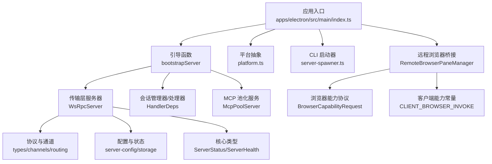

**图表来源**
- [apps/electron/src/main/index.ts:604](file://apps/electron/src/main/index.ts#L604)
- [apps/electron/src/transport/server.ts:1](file://apps/electron/src/transport/server.ts#L1)
- [packages/shared/src/protocol/types.ts:1](file://packages/shared/src/protocol/types.ts#L1)
- [packages/shared/src/protocol/channels.ts:1](file://packages/shared/src/protocol/channels.ts#L1)
- [packages/shared/src/protocol/routing.ts:1](file://packages/shared/src/protocol/routing.ts#L1)
- [packages/shared/src/config/server-config.ts:1](file://packages/shared/src/config/server-config.ts#L1)
- [packages/shared/src/config/storage.ts:2901](file://packages/shared/src/config/storage.ts#L2901)
- [packages/shared/src/mcp/pool-server.ts:35](file://packages/shared/src/mcp/pool-server.ts#L35)
- [packages/core/src/types/server.ts:1](file://packages/core/src/types/server.ts#L1)
- [apps/electron/src/platform.ts:1](file://apps/electron/src/platform.ts#L1)
- [apps/cli/src/server-spawner.ts:1](file://apps/cli/src/server-spawner.ts#L1)
- [packages/server-core/src/sessions/RemoteBrowserPaneManager.ts:1](file://packages/server-core/src/sessions/RemoteBrowserPaneManager.ts#L1)
- [packages/server-core/src/transport/browser-capability.ts:1](file://packages/server-core/src/transport/browser-capability.ts#L1)
- [packages/server-core/src/transport/capabilities.ts:1](file://packages/server-core/src/transport/capabilities.ts#L1)

**章节来源**
- [apps/electron/src/main/index.ts:604](file://apps/electron/src/main/index.ts#L604)
- [apps/electron/src/transport/server.ts:1](file://apps/electron/src/transport/server.ts#L1)
- [packages/shared/src/protocol/types.ts:1](file://packages/shared/src/protocol/types.ts#L1)
- [packages/shared/src/protocol/channels.ts:1](file://packages/shared/src/protocol/channels.ts#L1)
- [packages/shared/src/protocol/routing.ts:1](file://packages/shared/src/protocol/routing.ts#L1)
- [packages/shared/src/config/server-config.ts:1](file://packages/shared/src/config/server-config.ts#L1)
- [packages/shared/src/config/storage.ts:2901](file://packages/shared/src/config/storage.ts#L2901)
- [packages/shared/src/mcp/pool-server.ts:35](file://packages/shared/src/mcp/pool-server.ts#L35)
- [packages/core/src/types/server.ts:1](file://packages/core/src/types/server.ts#L1)
- [apps/electron/src/platform.ts:1](file://apps/electron/src/platform.ts#L1)
- [apps/cli/src/server-spawner.ts:1](file://apps/cli/src/server-spawner.ts#L1)
- [packages/server-core/src/sessions/RemoteBrowserPaneManager.ts:1](file://packages/server-core/src/sessions/RemoteBrowserPaneManager.ts#L1)
- [packages/server-core/src/transport/browser-capability.ts:1](file://packages/server-core/src/transport/browser-capability.ts#L1)
- [packages/server-core/src/transport/capabilities.ts:1](file://packages/server-core/src/transport/capabilities.ts#L1)

## 核心组件
- 引导与装配：bootstrapServer 在应用入口完成服务初始化、会话管理器装配、RPC 处理器注册与传输层启动
- 传输层：基于 WebSocket 的 RPC 服务器（WsRpcServer），负责握手、可靠投递、序列号与重连
- 协议与通道：统一的消息封装、通道命名空间与路由表，确保本地/远程通道清晰分离
- 配置与状态：远程模式开关、端口、TLS、认证令牌与运行时状态模型
- MCP 池化：无状态 HTTP/MCP 服务，用于工具发现与调用
- 会话绑定：为工具上下文注入会话级读写能力
- 平台抽象：通过平台注入提供能力差异化的实现
- 健康检查：统一的健康状态模型与诊断接口
- **新增** 远程浏览器桥接：RemoteBrowserPaneManager 实现远程浏览器工具桥接，支持会话级浏览器实例管理
- **新增** 浏览器能力协议：BrowserCapabilityRequest 定义浏览器能力调用的统一格式
- **新增** 客户端能力系统：CLIENT_BROWSER_INVOKE 能力允许客户端代理执行浏览器操作

**章节来源**
- [apps/electron/src/main/index.ts:604](file://apps/electron/src/main/index.ts#L604)
- [packages/shared/src/protocol/types.ts:1](file://packages/shared/src/protocol/types.ts#L1)
- [packages/shared/src/protocol/channels.ts:1](file://packages/shared/src/protocol/channels.ts#L1)
- [packages/shared/src/protocol/routing.ts:1](file://packages/shared/src/protocol/routing.ts#L1)
- [packages/shared/src/config/server-config.ts:1](file://packages/shared/src/config/server-config.ts#L1)
- [packages/shared/src/mcp/pool-server.ts:35](file://packages/shared/src/mcp/pool-server.ts#L35)
- [packages/shared/src/agent/session-self-management-bindings.ts:28](file://packages/shared/src/agent/session-self-management-bindings.ts#L28)
- [packages/core/src/types/server.ts:1](file://packages/core/src/types/server.ts#L1)
- [packages/server-core/src/sessions/RemoteBrowserPaneManager.ts:1](file://packages/server-core/src/sessions/RemoteBrowserPaneManager.ts#L1)
- [packages/server-core/src/transport/browser-capability.ts:1](file://packages/server-core/src/transport/browser-capability.ts#L1)
- [packages/server-core/src/transport/capabilities.ts:1](file://packages/server-core/src/transport/capabilities.ts#L1)

## 架构总览
下图展示从应用入口到传输层、协议与配置的整体交互，包括新增的远程浏览器桥接系统。

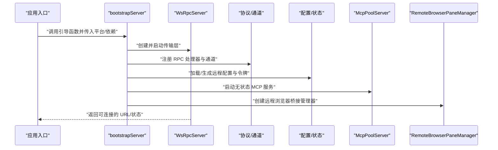

**图表来源**
- [apps/electron/src/main/index.ts:604](file://apps/electron/src/main/index.ts#L604)
- [apps/electron/src/transport/server.ts:1](file://apps/electron/src/transport/server.ts#L1)
- [packages/shared/src/protocol/channels.ts:1](file://packages/shared/src/protocol/channels.ts#L1)
- [packages/shared/src/config/server-config.ts:1](file://packages/shared/src/config/server-config.ts#L1)
- [packages/shared/src/mcp/pool-server.ts:35](file://packages/shared/src/mcp/pool-server.ts#L35)
- [packages/server-core/src/sessions/RemoteBrowserPaneManager.ts:1](file://packages/server-core/src/sessions/RemoteBrowserPaneManager.ts#L1)

## 组件详解

### bootstrapServer 初始化流程
- 入口位置：应用主进程在入口文件中调用引导函数，传入会话管理器与依赖集合
- 控制流要点：
  - 创建并启动传输层服务器（WsRpcServer）
  - 注册 RPC 处理器（按通道命名空间分类）
  - 加载/生成远程配置（含端口、TLS、令牌）并持久化
  - 启动 MCP 池化服务（无状态 HTTP/MCP）
  - **新增** 创建远程浏览器桥接管理器（RemoteBrowserPaneManager）
  - 返回运行时状态与连接信息（URL、是否 TLS、令牌等）

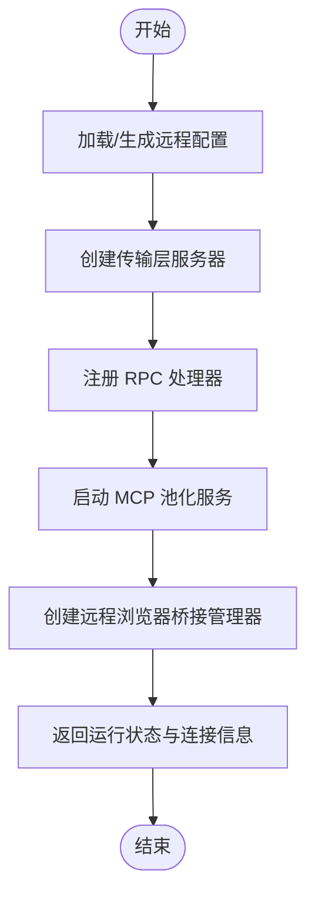

**图表来源**
- [apps/electron/src/main/index.ts:604](file://apps/electron/src/main/index.ts#L604)
- [packages/shared/src/config/storage.ts:2901](file://packages/shared/src/config/storage.ts#L2901)
- [packages/shared/src/mcp/pool-server.ts:35](file://packages/shared/src/mcp/pool-server.ts#L35)
- [packages/server-core/src/sessions/RemoteBrowserPaneManager.ts:1](file://packages/server-core/src/sessions/RemoteBrowserPaneManager.ts#L1)

**章节来源**
- [apps/electron/src/main/index.ts:604](file://apps/electron/src/main/index.ts#L604)
- [packages/shared/src/config/storage.ts:2901](file://packages/shared/src/config/storage.ts#L2901)

### 会话管理器的创建与配置
- 会话生命周期与状态变更回调由会话生命周期管理器提供
- 工具上下文可通过会话自管理绑定注入会话级读写能力（如标签、状态、会话列表、标签与状态解析）
- 绑定以会话 ID 为作用域，动态从注册表解析最新回调
- **新增** 会话级浏览器桥接：SessionManager.getBrowserPaneManagerForSession 提供能力感知的主机客户端回退和会话级浏览器实例管理

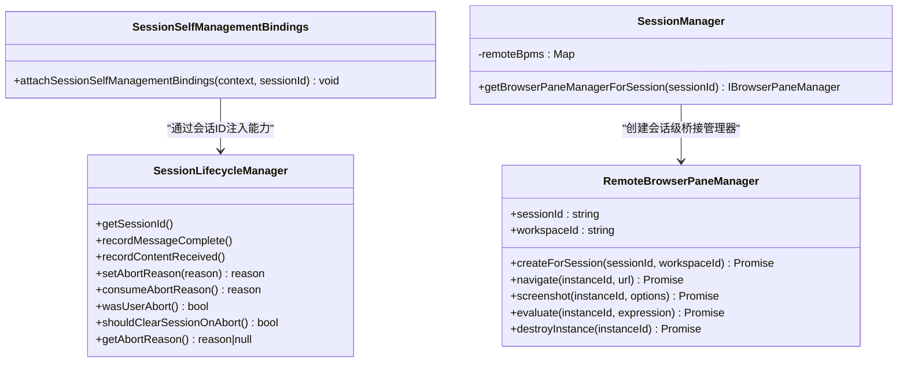

**图表来源**
- [packages/shared/src/agent/session-self-management-bindings.ts:28](file://packages/shared/src/agent/session-self-management-bindings.ts#L28)
- [packages/server-core/src/sessions/RemoteBrowserPaneManager.ts:43](file://packages/server-core/src/sessions/RemoteBrowserPaneManager.ts#L43)
- [packages/server-core/src/sessions/SessionManager.ts:1197](file://packages/server-core/src/sessions/SessionManager.ts#L1197)

**章节来源**
- [packages/shared/src/agent/session-self-management-bindings.ts:28](file://packages/shared/src/agent/session-self-management-bindings.ts#L28)
- [packages/server-core/src/sessions/SessionManager.ts:1215](file://packages/server-core/src/sessions/SessionManager.ts#L1215)

### RPC 处理器注册机制
- 通道命名空间：remote、server、sessions、workspaces、window、automations、git、resources、messaging 等
- 路由策略：LOCAL_ONLY 与 REMOTE_ELIGIBLE 两套集合，确保通道归属明确
- 注册流程：引导阶段将处理器绑定到对应通道，客户端通过通道名进行调用
- **新增** 浏览器能力通道：CLIENT_BROWSER_INVOKE 通道用于远程浏览器操作调用

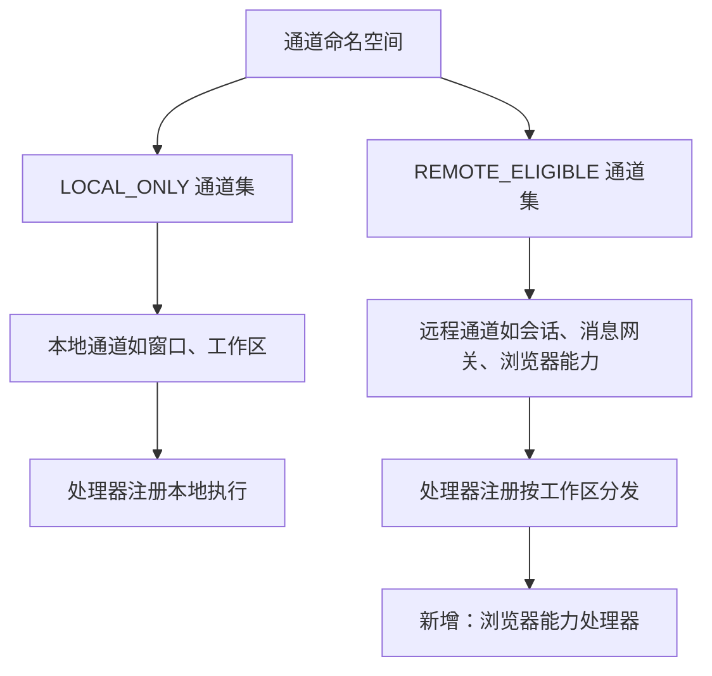

**图表来源**
- [packages/shared/src/protocol/channels.ts:1](file://packages/shared/src/protocol/channels.ts#L1)
- [packages/shared/src/protocol/routing.ts:1](file://packages/shared/src/protocol/routing.ts#L1)
- [packages/server-core/src/transport/capabilities.ts:25](file://packages/server-core/src/transport/capabilities.ts#L25)

**章节来源**
- [packages/shared/src/protocol/channels.ts:1](file://packages/shared/src/protocol/channels.ts#L1)
- [packages/shared/src/protocol/routing.ts:1](file://packages/shared/src/protocol/routing.ts#L1)
- [packages/server-core/src/transport/capabilities.ts:25](file://packages/server-core/src/transport/capabilities.ts#L25)

### 传输层 WebSocket 通信协议
- 消息封装：统一的信封结构，包含消息类型、通道、参数、结果、错误、序列号等字段
- 握手与重连：支持握手、握手确认、重连握手、序列号确认与过期标记
- 可靠投递：基于序列号与 lastSeq 的确认机制，支持断线重连与状态刷新
- **新增** 客户端能力系统：支持客户端能力声明与查询，包括浏览器能力

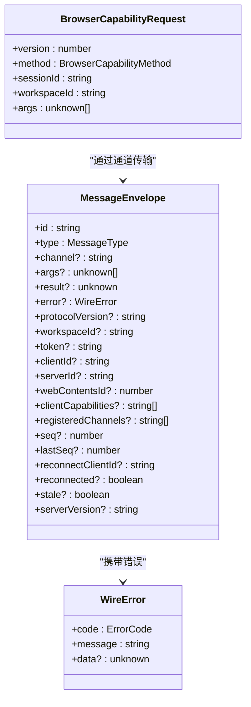

**图表来源**
- [packages/shared/src/protocol/types.ts:1](file://packages/shared/src/protocol/types.ts#L1)
- [packages/server-core/src/transport/browser-capability.ts:17](file://packages/server-core/src/transport/browser-capability.ts#L17)

**章节来源**
- [packages/shared/src/protocol/types.ts:1](file://packages/shared/src/protocol/types.ts#L1)
- [packages/server-core/src/transport/browser-capability.ts:1](file://packages/server-core/src/transport/browser-capability.ts#L1)

### 连接管理与重连
- 传输层服务器负责：
  - 接受 WebSocket 连接
  - 处理握手与认证（含令牌）
  - 维护客户端序列号与重连状态
  - 在缓冲区被驱逐时提示客户端全量刷新
  - **新增** 客户端能力查询：支持 hasClientCapability 和 findClientsWithCapability 方法

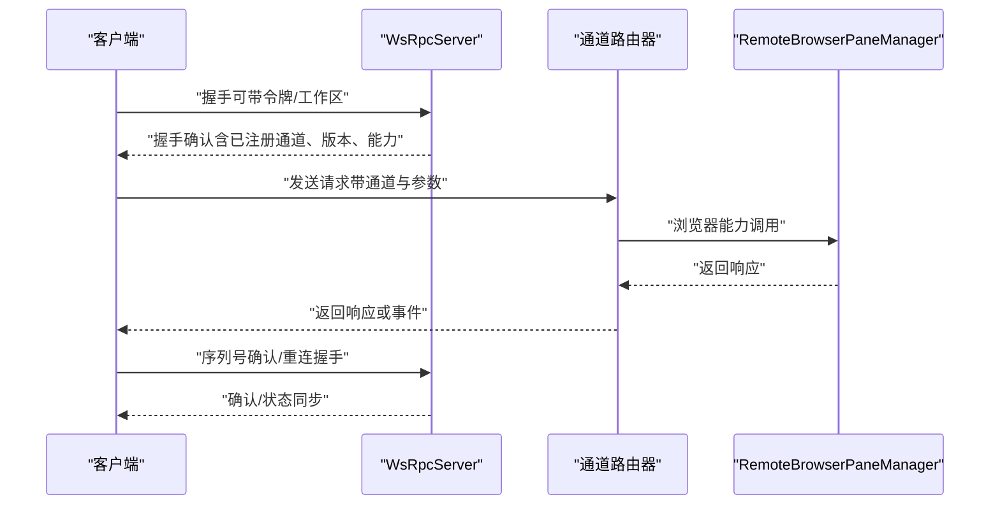

**图表来源**
- [packages/shared/src/protocol/types.ts:1](file://packages/shared/src/protocol/types.ts#L1)
- [packages/shared/src/protocol/channels.ts:1](file://packages/shared/src/protocol/channels.ts#L1)
- [packages/server-core/src/transport/capabilities.ts:33](file://packages/server-core/src/transport/capabilities.ts#L33)

**章节来源**
- [packages/shared/src/protocol/types.ts:1](file://packages/shared/src/protocol/types.ts#L1)
- [packages/shared/src/protocol/channels.ts:1](file://packages/shared/src/protocol/channels.ts#L1)
- [packages/server-core/src/transport/capabilities.ts:25](file://packages/server-core/src/transport/capabilities.ts#L25)

### 运行时环境配置与平台抽象
- 远程模式配置：启用/禁用、固定端口、TLS 证书与私钥路径、稳定认证令牌
- 存储与生成：首次启用时自动生成稳定令牌并持久化
- 平台抽象：通过平台注入提供差异化能力（如窗口管理、文件打开等）
- **新增** 浏览器工具配置：支持 allowRemoteEvaluate 设置控制远程评估功能

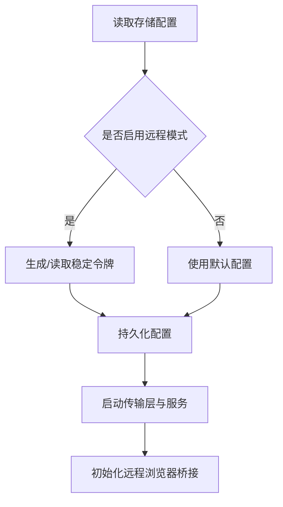

**图表来源**
- [packages/shared/src/config/server-config.ts:1](file://packages/shared/src/config/server-config.ts#L1)
- [packages/shared/src/config/storage.ts:2901](file://packages/shared/src/config/storage.ts#L2901)

**章节来源**
- [packages/shared/src/config/server-config.ts:1](file://packages/shared/src/config/server-config.ts#L1)
- [packages/shared/src/config/storage.ts:2901](file://packages/shared/src/config/storage.ts#L2901)
- [apps/electron/src/platform.ts:1](file://apps/electron/src/platform.ts#L1)

### 错误处理与恢复机制
- 协议错误码：处理器错误、通道不存在、认证失败、协议版本不支持、会话非空闲等
- 健康检查：对服务可达性进行诊断，区分超时、不可达与未知情况
- 恢复策略：序列号确认失败触发重连；缓冲区驱逐提示全量刷新；MCP 工具变更提示客户端重新发现
- **新增** 浏览器工具错误映射：Friendly error mappings for BROWSER_NO_CAPABLE_CLIENT、CAPABILITY_UNAVAILABLE、CLIENT_DISCONNECTED、CLIENT_REQUEST_TIMEOUT、BROWSER_INSTANCE_NOT_OWNED、BROWSER_REMOTE_UPLOAD_NOT_SUPPORTED、BROWSER_REMOTE_EVALUATE_BLOCKED

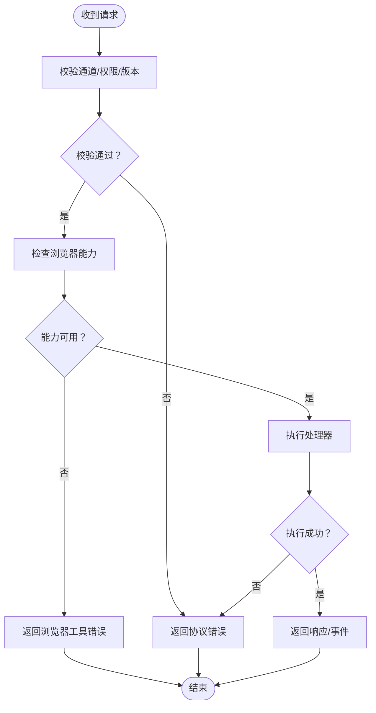

**图表来源**
- [packages/shared/src/protocol/types.ts:65](file://packages/shared/src/protocol/types.ts#L65)
- [packages/shared/src/agent/diagnostics.ts:177](file://packages/shared/src/agent/diagnostics.ts#L177)

**章节来源**
- [packages/shared/src/protocol/types.ts:65](file://packages/shared/src/protocol/types.ts#L65)
- [packages/shared/src/agent/diagnostics.ts:177](file://packages/shared/src/agent/diagnostics.ts#L177)

### 健康检查接口与状态模型
- 服务器状态：包含服务器标识、版本、运行时长、客户端数量、工作区统计、内存指标等
- 健康状态：通过检查项集合返回整体健康度与明细
- 通道暴露：健康检查与状态查询通道在通道表中定义
- **新增** 浏览器工具状态：包含浏览器实例数量、能力可用性等状态信息

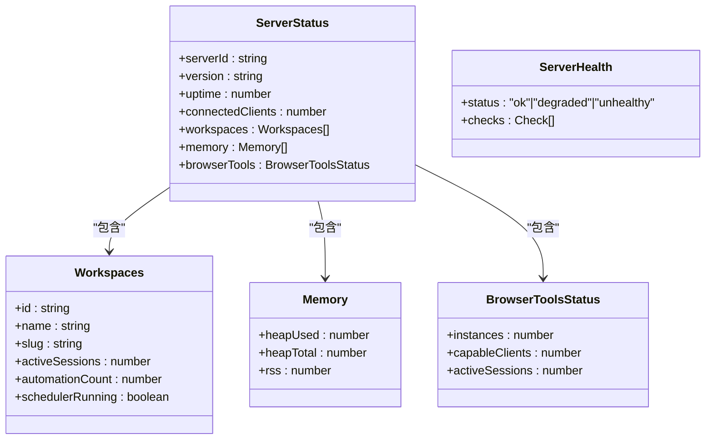

**图表来源**
- [packages/core/src/types/server.ts:1](file://packages/core/src/types/server.ts#L1)

**章节来源**
- [packages/core/src/types/server.ts:1](file://packages/core/src/types/server.ts#L1)
- [packages/shared/src/protocol/channels.ts:1](file://packages/shared/src/protocol/channels.ts#L1)

### 扩展点与自定义配置
- 自定义 RPC 处理器：在引导阶段向指定通道注册处理器
- 通道扩展：新增通道需纳入路由表，确保 LOCAL_ONLY 或 REMOTE_ELIGIBLE 明确
- 传输层扩展：可替换/扩展握手、认证与序列化逻辑
- 平台能力注入：通过平台抽象注入特定平台能力
- MCP 扩展：通过 MCP 池化服务扩展工具发现与调用
- **新增** 浏览器工具扩展：通过 RemoteBrowserPaneManager 接口扩展浏览器工具功能
- **新增** 客户端能力扩展：通过 CLIENT_BROWSER_INVOKE 能力扩展客户端代理执行能力

**章节来源**
- [packages/shared/src/protocol/channels.ts:1](file://packages/shared/src/protocol/channels.ts#L1)
- [packages/shared/src/protocol/routing.ts:1](file://packages/shared/src/protocol/routing.ts#L1)
- [apps/electron/src/platform.ts:1](file://apps/electron/src/platform.ts#L1)
- [packages/shared/src/mcp/pool-server.ts:35](file://packages/shared/src/mcp/pool-server.ts#L35)
- [packages/server-core/src/transport/capabilities.ts:25](file://packages/server-core/src/transport/capabilities.ts#L25)

## 依赖关系分析
- 应用入口依赖引导函数与传输层导出
- 传输层依赖协议与通道定义
- 配置模块提供远程模式与令牌生成
- MCP 池化服务作为无状态工具层
- 会话绑定依赖会话生命周期管理器
- **新增** 远程浏览器桥接依赖传输层能力和会话管理
- **新增** 浏览器能力协议定义了跨进程通信的数据结构

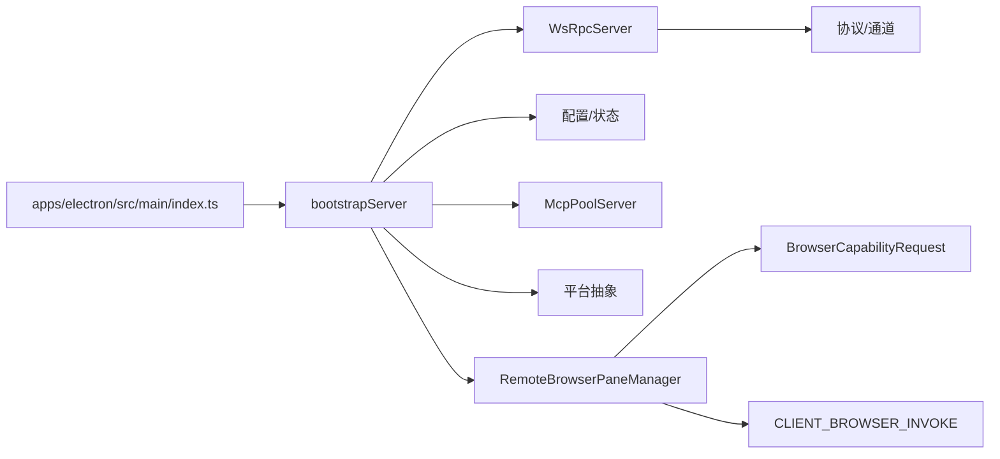

**图表来源**
- [apps/electron/src/main/index.ts:604](file://apps/electron/src/main/index.ts#L604)
- [apps/electron/src/transport/server.ts:1](file://apps/electron/src/transport/server.ts#L1)
- [packages/shared/src/protocol/channels.ts:1](file://packages/shared/src/protocol/channels.ts#L1)
- [packages/shared/src/config/server-config.ts:1](file://packages/shared/src/config/server-config.ts#L1)
- [packages/shared/src/mcp/pool-server.ts:35](file://packages/shared/src/mcp/pool-server.ts#L35)
- [apps/electron/src/platform.ts:1](file://apps/electron/src/platform.ts#L1)
- [packages/server-core/src/sessions/RemoteBrowserPaneManager.ts:1](file://packages/server-core/src/sessions/RemoteBrowserPaneManager.ts#L1)
- [packages/server-core/src/transport/browser-capability.ts:1](file://packages/server-core/src/transport/browser-capability.ts#L1)
- [packages/server-core/src/transport/capabilities.ts:1](file://packages/server-core/src/transport/capabilities.ts#L1)

**章节来源**
- [apps/electron/src/main/index.ts:604](file://apps/electron/src/main/index.ts#L604)
- [apps/electron/src/transport/server.ts:1](file://apps/electron/src/transport/server.ts#L1)
- [packages/shared/src/protocol/channels.ts:1](file://packages/shared/src/protocol/channels.ts#L1)
- [packages/shared/src/config/server-config.ts:1](file://packages/shared/src/config/server-config.ts#L1)
- [packages/shared/src/mcp/pool-server.ts:35](file://packages/shared/src/mcp/pool-server.ts#L35)
- [apps/electron/src/platform.ts:1](file://apps/electron/src/platform.ts#L1)
- [packages/server-core/src/sessions/RemoteBrowserPaneManager.ts:1](file://packages/server-core/src/sessions/RemoteBrowserPaneManager.ts#L1)
- [packages/server-core/src/transport/browser-capability.ts:1](file://packages/server-core/src/transport/browser-capability.ts#L1)
- [packages/server-core/src/transport/capabilities.ts:1](file://packages/server-core/src/transport/capabilities.ts#L1)

## 性能与可靠性
- 性能追踪：可配置性能跟踪，支持启用/禁用与聚合统计
- 可靠投递：序列号与 lastSeq 支持确认与重连
- 资源监控：服务器状态包含内存指标，便于容量规划
- **新增** 浏览器工具性能：包含浏览器实例数量、能力可用性等性能指标

**章节来源**
- [packages/shared/src/utils/perf.ts:45](file://packages/shared/src/utils/perf.ts#L45)
- [packages/core/src/types/server.ts:1](file://packages/core/src/types/server.ts#L1)

## 故障排查指南
- 认证失败：检查令牌生成与传递
- 协议版本不支持：确认客户端/服务器版本兼容
- 通道不存在：核对通道命名与路由表
- 服务不可达：使用健康检查接口定位网络/端口问题
- 重连异常：检查序列号确认与缓冲区驱逐标志
- **新增** 浏览器工具故障：检查 CLIENT_BROWSER_INVOKE 能力可用性、主机客户端连接状态、会话级浏览器实例状态

**章节来源**
- [packages/shared/src/protocol/types.ts:65](file://packages/shared/src/protocol/types.ts#L65)
- [packages/shared/src/agent/diagnostics.ts:177](file://packages/shared/src/agent/diagnostics.ts#L177)

## 结论
服务器核心通过清晰的引导流程、可靠的传输层协议、完善的通道路由与配置体系，提供了可扩展、可观测且易维护的远程服务能力。结合会话绑定与 MCP 池化服务，能够满足多工作区、多会话与工具生态的复杂场景需求。**新增的远程浏览器工具桥接系统进一步增强了服务器的核心能力，通过 RemoteBrowserPaneManager 实现了会话级浏览器实例管理，通过 BrowserCapabilityRequest 提供了统一的浏览器能力调用协议，通过 CLIENT_BROWSER_INVOKE 能力实现了客户端代理执行浏览器操作的功能。**这些组件共同构成了完整的远程浏览器工具生态系统，为用户提供了无缝的远程浏览器体验。

## 附录：启动参数与环境变量
- 远程模式配置键
  - enabled：是否启用远程模式
  - port：监听端口（默认 9100）
  - tlsCertPath/tlsKeyPath：TLS 证书与私钥路径
  - token：稳定认证令牌（首次启用自动生成）
- CLI 启动器
  - 提供独立服务器进程的启动与资源打包能力
- **新增** 浏览器工具配置
  - allowRemoteEvaluate：是否允许远程评估功能
  - 远程浏览器工具桥接：自动检测和管理会话级浏览器实例

**章节来源**
- [packages/shared/src/config/server-config.ts:1](file://packages/shared/src/config/server-config.ts#L1)
- [packages/shared/src/config/storage.ts:2901](file://packages/shared/src/config/storage.ts#L2901)
- [apps/cli/src/server-spawner.ts:1](file://apps/cli/src/server-spawner.ts#L1)
- [packages/server-core/src/transport/capabilities.ts:25](file://packages/server-core/src/transport/capabilities.ts#L25)