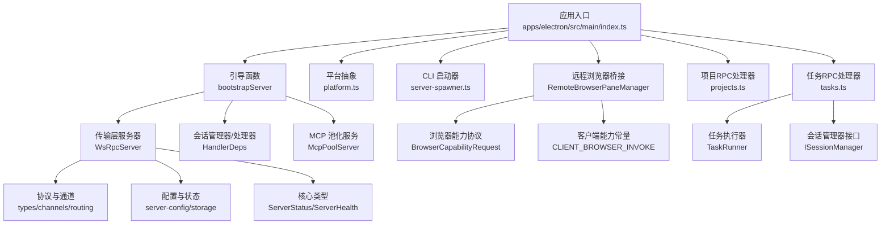
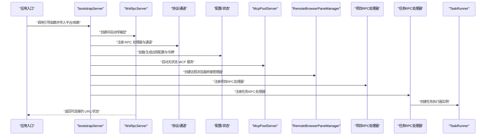
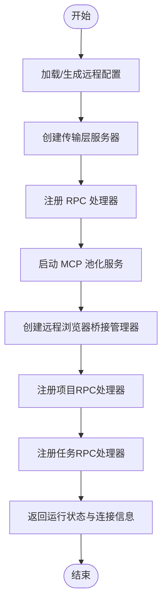
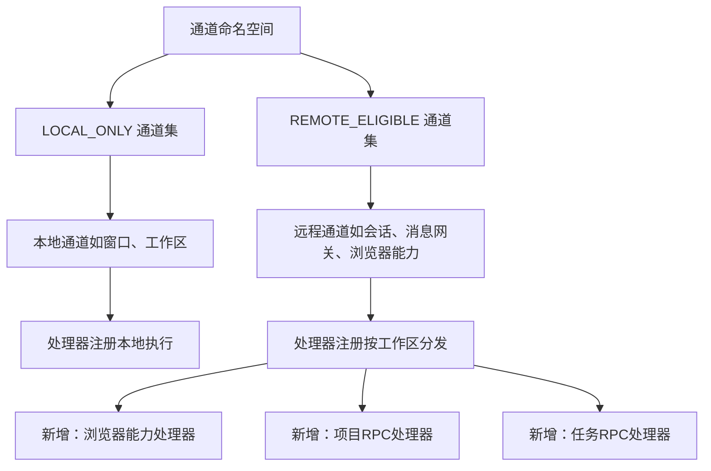
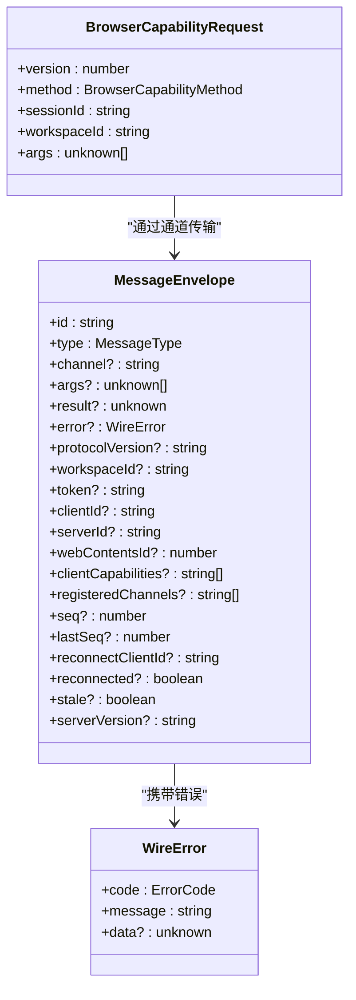
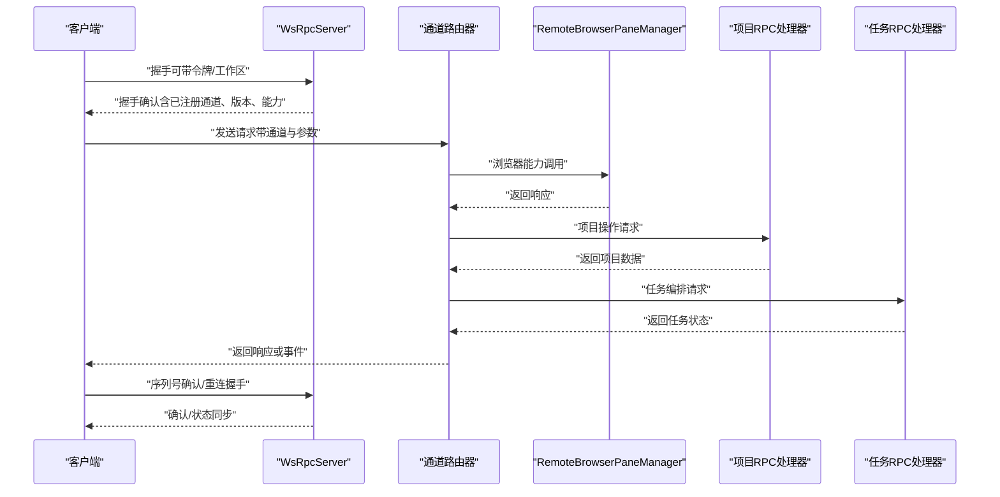
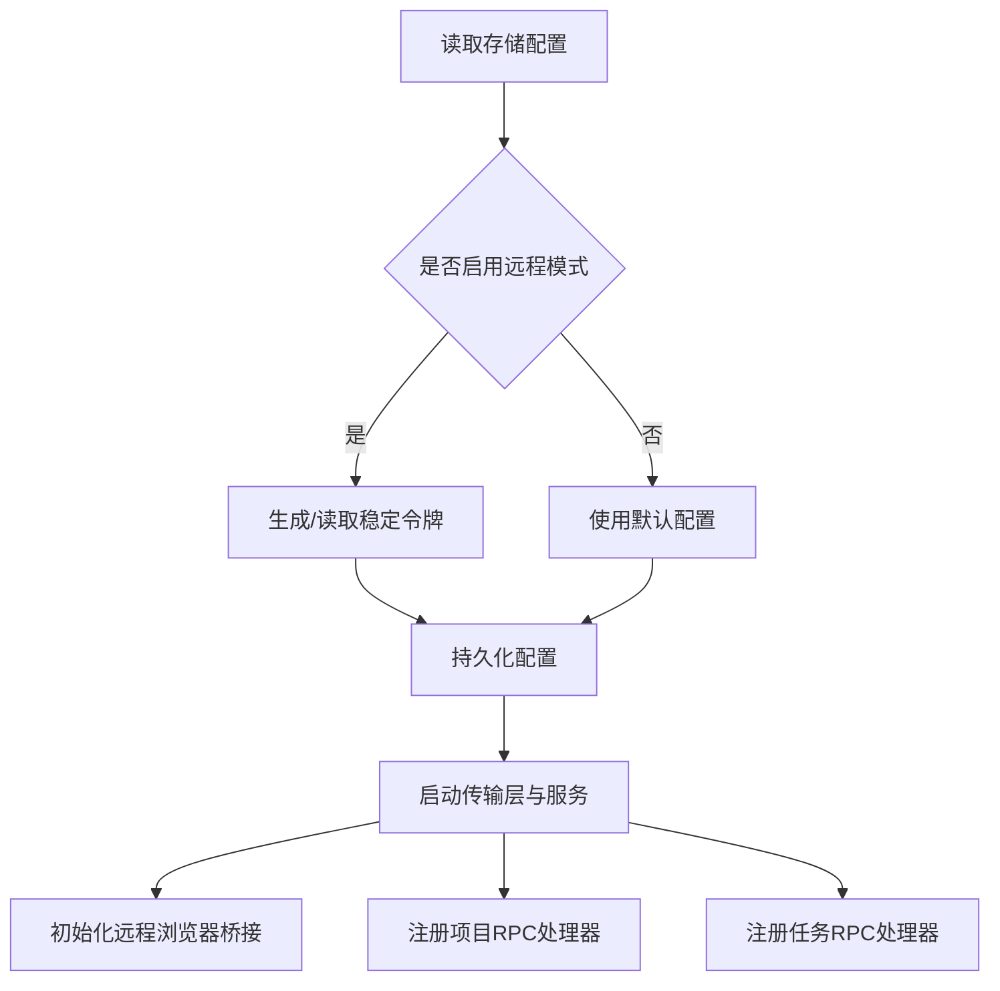
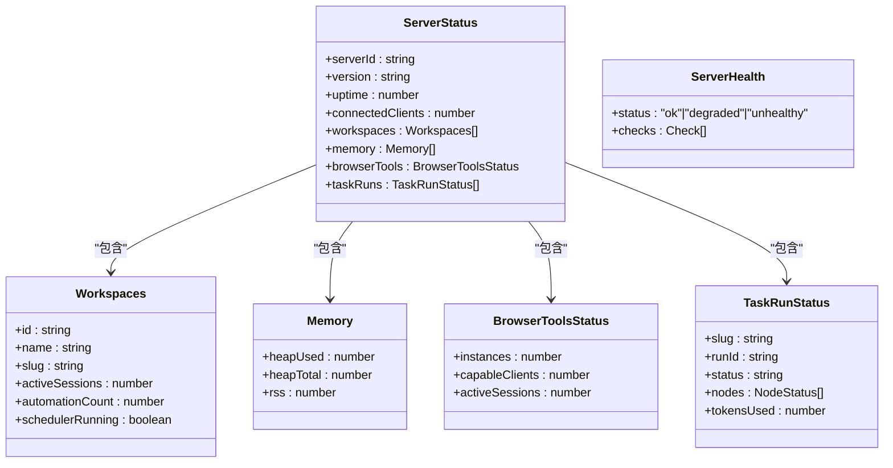
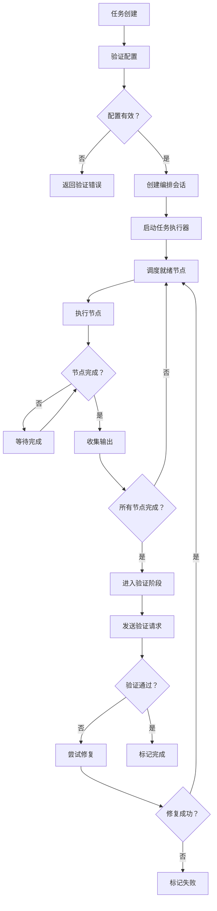
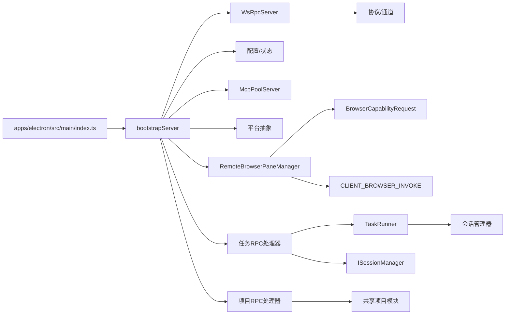

# 服务器核心

<cite>
**本文引用的文件**
- [apps/electron/src/main/index.ts](file://apps/electron/src/main/index.ts)
- [apps/electron/src/platform.ts](file://apps/electron/src/platform.ts)
- [apps/electron/src/transport/server.ts](file://apps/electron/src/transport/server.ts)
- [packages/shared/src/protocol/types.ts](file://packages/shared/src/protocol/types.ts)
- [packages/shared/src/protocol/channels.ts](file://packages/shared/src/protocol/channels.ts)
- [packages/shared/src/protocol/routing.ts](file://packages/shared/src/protocol/routing.ts)
- [packages/shared/src/config/server-config.ts](file://packages/shared/src/config/server-config.ts)
- [packages/shared/src/config/storage.ts](file://packages/shared/src/config/storage.ts)
- [packages/shared/src/mcp/pool-server.ts](file://packages/shared/src/mcp/pool-server.ts)
- [packages/shared/src/agent/session-self-management-bindings.ts](file://packages/shared/src/agent/session-self-management-bindings.ts)
- [packages/shared/src/agent/diagnostics.ts](file://packages/shared/src/agent/diagnostics.ts)
- [packages/core/src/types/server.ts](file://packages/core/src/types/server.ts)
- [apps/cli/src/server-spawner.ts](file://apps/cli/src/server-spawner.ts)
- [apps/electron/src/__tests__/transport.test.ts](file://apps/electron/src/__tests__/transport.test.ts)
- [packages/server-core/src/sessions/RemoteBrowserPaneManager.ts](file://packages/server-core/src/sessions/RemoteBrowserPaneManager.ts)
- [packages/server-core/src/transport/browser-capability.ts](file://packages/server-core/src/transport/browser-capability.ts)
- [packages/server-core/src/transport/capabilities.ts](file://packages/server-core/src/transport/capabilities.ts)
- [packages/server-core/src/sessions/SessionManager.ts](file://packages/server-core/src/sessions/SessionManager.ts)
- [packages/server-core/src/handlers/browser-pane-manager-interface.ts](file://packages/server-core/src/handlers/browser-pane-manager-interface.ts)
- [packages/server-core/src/runtime/null-browser-pane-manager.ts](file://packages/server-core/src/runtime/null-browser-pane-manager.ts)
- [packages/server-core/src/handlers/rpc/projects.ts](file://packages/server-core/src/handlers/rpc/projects.ts)
- [packages/server-core/src/handlers/rpc/tasks.ts](file://packages/server-core/src/handlers/rpc/tasks.ts)
- [packages/server-core/src/tasks/TaskRunner.ts](file://packages/server-core/src/tasks/TaskRunner.ts)
- [packages/server-core/src/tasks/create-task.ts](file://packages/server-core/src/tasks/create-task.ts)
- [packages/server-core/src/handlers/session-manager-interface.ts](file://packages/server-core/src/handlers/session-manager-interface.ts)
</cite>

## 更新摘要
**变更内容**
- 新增项目RPC处理器：实现了项目的CRUD操作、资产管理和变更广播机制
- 新增任务执行器：完整的任务编排系统，支持DAG调度、并行执行、结果验证和修复循环
- 增强会话管理器接口：扩展了任务编排相关的会话管理能力，包括任务标签应用、工作目录继承等
- 更新了引导流程以集成新的处理器和组件

## 目录
1. [简介](#简介)
2. [项目结构](#项目结构)
3. [核心组件](#核心组件)
4. [架构总览](#架构总览)
5. [组件详解](#组件详解)
6. [依赖关系分析](#依赖关系分析)
7. [性能与可靠性](#性能与可靠性)
8. [故障排查指南](#故障排查指南)
9. [结论](#结论)
10. [附录：启动参数与环境变量](#附录启动参数与环境变量)

## 简介
本文件聚焦"服务器核心"能力，面向服务器开发与维护人员，系统性阐述以下主题：
- bootstrapServer 初始化流程与控制流
- 会话管理器的创建与配置
- RPC 处理器注册机制与通道路由
- 传输层 WebSocket 协议、消息编解码与连接管理
- 运行时环境配置、平台抽象层与错误处理
- 健康检查接口与状态模型
- 扩展点与自定义配置方法
- **新增** 远程浏览器工具桥接系统：RemoteBrowserPaneManager 类、WebSocket RPC 通道、BrowserCapabilityRequest 对象
- **新增** 项目RPC处理器：完整的项目管理功能，包括CRUD操作、资产管理和变更广播
- **新增** 任务执行器：基于DAG的任务编排系统，支持并行执行、结果验证和自动修复
- **新增** 增强的会话管理器接口：任务编排相关的会话管理能力扩展

## 项目结构
围绕"服务器核心"的关键位置如下：
- 应用入口与引导：apps/electron/src/main/index.ts 调用 bootstrapServer 完成服务初始化
- 传输层导出：apps/electron/src/transport/server.ts 导出 WsRpcServer（来自 server-core 包）
- 协议与通道：packages/shared/src/protocol 下的 types、channels、routing 提供消息模型与路由表
- 配置与状态：packages/shared/src/config 下的 server-config 与 storage 提供远程模式配置与持久化
- MCP 池化服务：packages/shared/src/mcp/pool-server.ts 提供无状态 HTTP/MCP 服务
- 会话绑定：packages/shared/src/agent/session-self-management-bindings.ts 提供会话上下文绑定
- 核心类型：packages/core/src/types/server.ts 定义服务器状态与健康模型
- 平台抽象：apps/electron/src/platform.ts 提供平台注入与能力
- CLI 启动：apps/cli/src/server-spawner.ts 提供独立服务器进程启动
- **新增** 远程浏览器桥接：packages/server-core/src/sessions/RemoteBrowserPaneManager.ts 实现远程浏览器工具桥接
- **新增** 浏览器能力协议：packages/server-core/src/transport/browser-capability.ts 定义浏览器能力请求格式
- **新增** 客户端能力常量：packages/server-core/src/transport/capabilities.ts 定义客户端能力声明
- **新增** 项目RPC处理器：packages/server-core/src/handlers/rpc/projects.ts 提供项目管理功能
- **新增** 任务RPC处理器：packages/server-core/src/handlers/rpc/tasks.ts 提供任务编排功能
- **新增** 任务执行器：packages/server-core/src/tasks/TaskRunner.ts 实现DAG任务调度
- **新增** 会话管理器接口：packages/server-core/src/handlers/session-manager-interface.ts 定义增强的会话管理接口



**图表来源**
- [apps/electron/src/main/index.ts:604](file://apps/electron/src/main/index.ts#L604)
- [apps/electron/src/transport/server.ts:1](file://apps/electron/src/transport/server.ts#L1)
- [packages/shared/src/protocol/types.ts:1](file://packages/shared/src/protocol/types.ts#L1)
- [packages/shared/src/protocol/channels.ts:1](file://packages/shared/src/protocol/channels.ts#L1)
- [packages/shared/src/protocol/routing.ts:1](file://packages/shared/src/protocol/routing.ts#L1)
- [packages/shared/src/config/server-config.ts:1](file://packages/shared/src/config/server-config.ts#L1)
- [packages/shared/src/config/storage.ts:2901](file://packages/shared/src/config/storage.ts#L2901)
- [packages/shared/src/mcp/pool-server.ts:35](file://packages/shared/src/mcp/pool-server.ts#L35)
- [packages/core/src/types/server.ts:1](file://packages/core/src/types/server.ts#L1)
- [apps/electron/src/platform.ts:1](file://apps/electron/src/platform.ts#L1)
- [apps/cli/src/server-spawner.ts:1](file://apps/cli/src/server-spawner.ts#L1)
- [packages/server-core/src/sessions/RemoteBrowserPaneManager.ts:1](file://packages/server-core/src/sessions/RemoteBrowserPaneManager.ts#L1)
- [packages/server-core/src/transport/browser-capability.ts:1](file://packages/server-core/src/transport/browser-capability.ts#L1)
- [packages/server-core/src/transport/capabilities.ts:1](file://packages/server-core/src/transport/capabilities.ts#L1)
- [packages/server-core/src/handlers/rpc/projects.ts:1](file://packages/server-core/src/handlers/rpc/projects.ts#L1)
- [packages/server-core/src/handlers/rpc/tasks.ts:1](file://packages/server-core/src/handlers/rpc/tasks.ts#L1)
- [packages/server-core/src/tasks/TaskRunner.ts:1](file://packages/server-core/src/tasks/TaskRunner.ts#L1)
- [packages/server-core/src/handlers/session-manager-interface.ts:1](file://packages/server-core/src/handlers/session-manager-interface.ts#L1)

**章节来源**
- [apps/electron/src/main/index.ts:604](file://apps/electron/src/main/index.ts#L604)
- [apps/electron/src/transport/server.ts:1](file://apps/electron/src/transport/server.ts#L1)
- [packages/shared/src/protocol/types.ts:1](file://packages/shared/src/protocol/types.ts#L1)
- [packages/shared/src/protocol/channels.ts:1](file://packages/shared/src/protocol/channels.ts#L1)
- [packages/shared/src/protocol/routing.ts:1](file://packages/shared/src/protocol/routing.ts#L1)
- [packages/shared/src/config/server-config.ts:1](file://packages/shared/src/config/server-config.ts#L1)
- [packages/shared/src/config/storage.ts:2901](file://packages/shared/src/config/storage.ts#L2901)
- [packages/shared/src/mcp/pool-server.ts:35](file://packages/shared/src/mcp/pool-server.ts#L35)
- [packages/core/src/types/server.ts:1](file://packages/core/src/types/server.ts#L1)
- [apps/electron/src/platform.ts:1](file://apps/electron/src/platform.ts#L1)
- [apps/cli/src/server-spawner.ts:1](file://apps/cli/src/server-spawner.ts#L1)
- [packages/server-core/src/sessions/RemoteBrowserPaneManager.ts:1](file://packages/server-core/src/sessions/RemoteBrowserPaneManager.ts#L1)
- [packages/server-core/src/transport/browser-capability.ts:1](file://packages/server-core/src/transport/browser-capability.ts#L1)
- [packages/server-core/src/transport/capabilities.ts:1](file://packages/server-core/src/transport/capabilities.ts#L1)
- [packages/server-core/src/handlers/rpc/projects.ts:1](file://packages/server-core/src/handlers/rpc/projects.ts#L1)
- [packages/server-core/src/handlers/rpc/tasks.ts:1](file://packages/server-core/src/handlers/rpc/tasks.ts#L1)
- [packages/server-core/src/tasks/TaskRunner.ts:1](file://packages/server-core/src/tasks/TaskRunner.ts#L1)
- [packages/server-core/src/handlers/session-manager-interface.ts:1](file://packages/server-core/src/handlers/session-manager-interface.ts#L1)

## 核心组件
- 引导与装配：bootstrapServer 在应用入口完成服务初始化、会话管理器装配、RPC 处理器注册与传输层启动
- 传输层：基于 WebSocket 的 RPC 服务器（WsRpcServer），负责握手、可靠投递、序列号与重连
- 协议与通道：统一的消息封装、通道命名空间与路由表，确保本地/远程通道清晰分离
- 配置与状态：远程模式开关、端口、TLS、认证令牌与运行时状态模型
- MCP 池化：无状态 HTTP/MCP 服务，用于工具发现与调用
- 会话绑定：为工具上下文注入会话级读写能力
- 平台抽象：通过平台注入提供能力差异化的实现
- 健康检查：统一的健康状态模型与诊断接口
- **新增** 远程浏览器桥接：RemoteBrowserPaneManager 实现远程浏览器工具桥接，支持会话级浏览器实例管理
- **新增** 浏览器能力协议：BrowserCapabilityRequest 定义浏览器能力调用的统一格式
- **新增** 客户端能力系统：CLIENT_BROWSER_INVOKE 能力允许客户端代理执行浏览器操作
- **新增** 项目RPC处理器：提供完整的项目管理功能，包括CRUD操作、资产管理和变更广播
- **新增** 任务执行器：基于DAG的任务编排系统，支持并行执行、结果验证和自动修复
- **新增** 增强的会话管理器接口：扩展了任务编排相关的会话管理能力

**章节来源**
- [apps/electron/src/main/index.ts:604](file://apps/electron/src/main/index.ts#L604)
- [packages/shared/src/protocol/types.ts:1](file://packages/shared/src/protocol/types.ts#L1)
- [packages/shared/src/protocol/channels.ts:1](file://packages/shared/src/protocol/channels.ts#L1)
- [packages/shared/src/protocol/routing.ts:1](file://packages/shared/src/protocol/routing.ts#L1)
- [packages/shared/src/config/server-config.ts:1](file://packages/shared/src/config/server-config.ts#L1)
- [packages/shared/src/mcp/pool-server.ts:35](file://packages/shared/src/mcp/pool-server.ts#L35)
- [packages/shared/src/agent/session-self-management-bindings.ts:28](file://packages/shared/src/agent/session-self-management-bindings.ts#L28)
- [packages/core/src/types/server.ts:1](file://packages/core/src/types/server.ts#L1)
- [packages/server-core/src/sessions/RemoteBrowserPaneManager.ts:1](file://packages/server-core/src/sessions/RemoteBrowserPaneManager.ts#L1)
- [packages/server-core/src/transport/browser-capability.ts:1](file://packages/server-core/src/transport/browser-capability.ts#L1)
- [packages/server-core/src/transport/capabilities.ts:1](file://packages/server-core/src/transport/capabilities.ts#L1)
- [packages/server-core/src/handlers/rpc/projects.ts:1](file://packages/server-core/src/handlers/rpc/projects.ts#L1)
- [packages/server-core/src/handlers/rpc/tasks.ts:1](file://packages/server-core/src/handlers/rpc/tasks.ts#L1)
- [packages/server-core/src/tasks/TaskRunner.ts:1](file://packages/server-core/src/tasks/TaskRunner.ts#L1)
- [packages/server-core/src/handlers/session-manager-interface.ts:1](file://packages/server-core/src/handlers/session-manager-interface.ts#L1)

## 架构总览
下图展示从应用入口到传输层、协议与配置的整体交互，包括新增的远程浏览器桥接系统、项目RPC处理器和任务执行器。



**图表来源**
- [apps/electron/src/main/index.ts:604](file://apps/electron/src/main/index.ts#L604)
- [apps/electron/src/transport/server.ts:1](file://apps/electron/src/transport/server.ts#L1)
- [packages/shared/src/protocol/channels.ts:1](file://packages/shared/src/protocol/channels.ts#L1)
- [packages/shared/src/config/server-config.ts:1](file://packages/shared/src/config/server-config.ts#L1)
- [packages/shared/src/mcp/pool-server.ts:35](file://packages/shared/src/mcp/pool-server.ts#L35)
- [packages/server-core/src/sessions/RemoteBrowserPaneManager.ts:1](file://packages/server-core/src/sessions/RemoteBrowserPaneManager.ts#L1)
- [packages/server-core/src/handlers/rpc/projects.ts:1](file://packages/server-core/src/handlers/rpc/projects.ts#L1)
- [packages/server-core/src/handlers/rpc/tasks.ts:1](file://packages/server-core/src/handlers/rpc/tasks.ts#L1)
- [packages/server-core/src/tasks/TaskRunner.ts:1](file://packages/server-core/src/tasks/TaskRunner.ts#L1)

## 组件详解

### bootstrapServer 初始化流程
- 入口位置：应用主进程在入口文件中调用引导函数，传入会话管理器与依赖集合
- 控制流要点：
  - 创建并启动传输层服务器（WsRpcServer）
  - 注册 RPC 处理器（按通道命名空间分类）
  - 加载/生成远程配置（含端口、TLS、令牌）并持久化
  - 启动 MCP 池化服务（无状态 HTTP/MCP）
  - **新增** 创建远程浏览器桥接管理器（RemoteBrowserPaneManager）
  - **新增** 注册项目RPC处理器（projects.ts）
  - **新增** 注册任务RPC处理器（tasks.ts）
  - 返回运行时状态与连接信息（URL、是否 TLS、令牌等）



**图表来源**
- [apps/electron/src/main/index.ts:604](file://apps/electron/src/main/index.ts#L604)
- [packages/shared/src/config/storage.ts:2901](file://packages/shared/src/config/storage.ts#L2901)
- [packages/shared/src/mcp/pool-server.ts:35](file://packages/shared/src/mcp/pool-server.ts#L35)
- [packages/server-core/src/sessions/RemoteBrowserPaneManager.ts:1](file://packages/server-core/src/sessions/RemoteBrowserPaneManager.ts#L1)
- [packages/server-core/src/handlers/rpc/projects.ts:1](file://packages/server-core/src/handlers/rpc/projects.ts#L1)
- [packages/server-core/src/handlers/rpc/tasks.ts:1](file://packages/server-core/src/handlers/rpc/tasks.ts#L1)

**章节来源**
- [apps/electron/src/main/index.ts:604](file://apps/electron/src/main/index.ts#L604)
- [packages/shared/src/config/storage.ts:2901](file://packages/shared/src/config/storage.ts#L2901)

### 会话管理器的创建与配置
- 会话生命周期与状态变更回调由会话生命周期管理器提供
- 工具上下文可通过会话自管理绑定注入会话级读写能力（如标签、状态、会话列表、标签与状态解析）
- 绑定以会话 ID 为作用域，动态从注册表解析最新回调
- **新增** 会话级浏览器桥接：SessionManager.getBrowserPaneManagerForSession 提供能力感知的主机客户端回退和会话级浏览器实例管理
- **新增** 增强的会话管理器接口：支持任务编排相关的会话管理能力，包括任务标签应用、工作目录继承等

```mermaid
classDiagram
class SessionLifecycleManager {
+getSessionId()
+recordMessageComplete()
+recordContentReceived()
+setAbortReason(reason) reason
+consumeAbortReason() reason
+wasUserAbort() bool
+shouldClearSessionOnAbort() bool
+getAbortReason() reason|null
}
class SessionSelfManagementBindings {
+attachSessionSelfManagementBindings(context, sessionId) void
}
class RemoteBrowserPaneManager {
+sessionId : string
+workspaceId : string
+createForSession(sessionId, workspaceId) Promise<string>
+navigate(instanceId, url) Promise<void>
+screenshot(instanceId, options) Promise<Buffer>
+evaluate(instanceId, expression) Promise<unknown>
+destroyInstance(instanceId) Promise<void>
}
class SessionManager {
+getBrowserPaneManagerForSession(sessionId) IBrowserPaneManager
-remoteBpms : Map<string, RemoteBrowserPaneManager>
+applyTaskLabel(sessionId, opts) Promise<{labelId : string}>
+setSessionWorkingDirectory(sessionId, path) void
+getSessionWorkingDirectory(sessionId) string
+adoptGeneratedTaskOrchestrator(sessionId, taskSlug, reconcile) Promise<boolean>
+bindExistingSessionToTask(sessionId, taskSlug, reconcile) Promise<boolean>
}
class ISessionManager {
+onSessionComplete(listener) () => void
+sendMessage(sessionId, message, options) Promise<void>
+setKanbanColumn(sessionId, column) Promise<void>
+setTaskNodeCount(sessionId, count) Promise<void>
}
SessionSelfManagementBindings --> SessionLifecycleManager : "通过会话ID注入能力"
SessionManager --> RemoteBrowserPaneManager : "创建会话级桥接管理器"
ISessionManager --> SessionManager : "定义增强的会话管理接口"
```

**图表来源**
- [packages/shared/src/agent/session-self-management-bindings.ts:28](file://packages/shared/src/agent/session-self-management-bindings.ts#L28)
- [packages/server-core/src/sessions/RemoteBrowserPaneManager.ts:43](file://packages/server-core/src/sessions/RemoteBrowserPaneManager.ts#L43)
- [packages/server-core/src/sessions/SessionManager.ts:1197](file://packages/server-core/src/sessions/SessionManager.ts#L1197)
- [packages/server-core/src/handlers/session-manager-interface.ts:29](file://packages/server-core/src/handlers/session-manager-interface.ts#L29)

**章节来源**
- [packages/shared/src/agent/session-self-management-bindings.ts:28](file://packages/shared/src/agent/session-self-management-bindings.ts#L28)
- [packages/server-core/src/sessions/SessionManager.ts:1215](file://packages/server-core/src/sessions/SessionManager.ts#L1215)
- [packages/server-core/src/handlers/session-manager-interface.ts:29](file://packages/server-core/src/handlers/session-manager-interface.ts#L29)

### RPC 处理器注册机制
- 通道命名空间：remote、server、sessions、workspaces、window、automations、git、resources、messaging 等
- 路由策略：LOCAL_ONLY 与 REMOTE_ELIGIBLE 两套集合，确保通道归属明确
- 注册流程：引导阶段将处理器绑定到对应通道，客户端通过通道名进行调用
- **新增** 浏览器能力通道：CLIENT_BROWSER_INVOKE 通道用于远程浏览器操作调用
- **新增** 项目RPC通道：projects.GET、projects.CREATE、projects.UPDATE、projects.DELETE等
- **新增** 任务RPC通道：tasks.VALIDATE、tasks.CREATE、tasks.RUN、tasks.PAUSE等



**图表来源**
- [packages/shared/src/protocol/channels.ts:1](file://packages/shared/src/protocol/channels.ts#L1)
- [packages/shared/src/protocol/routing.ts:1](file://packages/shared/src/protocol/routing.ts#L1)
- [packages/server-core/src/transport/capabilities.ts:25](file://packages/server-core/src/transport/capabilities.ts#L25)
- [packages/server-core/src/handlers/rpc/projects.ts:6](file://packages/server-core/src/handlers/rpc/projects.ts#L6)
- [packages/server-core/src/handlers/rpc/tasks.ts:51](file://packages/server-core/src/handlers/rpc/tasks.ts#L51)

**章节来源**
- [packages/shared/src/protocol/channels.ts:1](file://packages/shared/src/protocol/channels.ts#L1)
- [packages/shared/src/protocol/routing.ts:1](file://packages/shared/src/protocol/routing.ts#L1)
- [packages/server-core/src/transport/capabilities.ts:25](file://packages/server-core/src/transport/capabilities.ts#L25)
- [packages/server-core/src/handlers/rpc/projects.ts:6](file://packages/server-core/src/handlers/rpc/projects.ts#L6)
- [packages/server-core/src/handlers/rpc/tasks.ts:51](file://packages/server-core/src/handlers/rpc/tasks.ts#L51)

### 传输层 WebSocket 通信协议
- 消息封装：统一的信封结构，包含消息类型、通道、参数、结果、错误、序列号等字段
- 握手与重连：支持握手、握手确认、重连握手、序列号确认与过期标记
- 可靠投递：基于序列号与 lastSeq 的确认机制，支持断线重连与状态刷新
- **新增** 客户端能力系统：支持客户端能力声明与查询，包括浏览器能力



**图表来源**
- [packages/shared/src/protocol/types.ts:1](file://packages/shared/src/protocol/types.ts#L1)
- [packages/server-core/src/transport/browser-capability.ts:17](file://packages/server-core/src/transport/browser-capability.ts#L17)

**章节来源**
- [packages/shared/src/protocol/types.ts:1](file://packages/shared/src/protocol/types.ts#L1)
- [packages/server-core/src/transport/browser-capability.ts:1](file://packages/server-core/src/transport/browser-capability.ts#L1)

### 连接管理与重连
- 传输层服务器负责：
  - 接受 WebSocket 连接
  - 处理握手与认证（含令牌）
  - 维护客户端序列号与重连状态
  - 在缓冲区被驱逐时提示客户端全量刷新
  - **新增** 客户端能力查询：支持 hasClientCapability 和 findClientsWithCapability 方法



**图表来源**
- [packages/shared/src/protocol/types.ts:1](file://packages/shared/src/protocol/types.ts#L1)
- [packages/shared/src/protocol/channels.ts:1](file://packages/shared/src/protocol/channels.ts#L1)
- [packages/server-core/src/transport/capabilities.ts:33](file://packages/server-core/src/transport/capabilities.ts#L33)
- [packages/server-core/src/handlers/rpc/projects.ts:17](file://packages/server-core/src/handlers/rpc/projects.ts#L17)
- [packages/server-core/src/handlers/rpc/tasks.ts:93](file://packages/server-core/src/handlers/rpc/tasks.ts#L93)

**章节来源**
- [packages/shared/src/protocol/types.ts:1](file://packages/shared/src/protocol/types.ts#L1)
- [packages/shared/src/protocol/channels.ts:1](file://packages/shared/src/protocol/channels.ts#L1)
- [packages/server-core/src/transport/capabilities.ts:25](file://packages/server-core/src/transport/capabilities.ts#L25)

### 运行时环境配置与平台抽象
- 远程模式配置：启用/禁用、固定端口、TLS 证书与私钥路径、稳定认证令牌
- 存储与生成：首次启用时自动生成稳定令牌并持久化
- 平台抽象：通过平台注入提供差异化能力（如窗口管理、文件打开等）
- **新增** 浏览器工具配置：支持 allowRemoteEvaluate 设置控制远程评估功能



**图表来源**
- [packages/shared/src/config/server-config.ts:1](file://packages/shared/src/config/server-config.ts#L1)
- [packages/shared/src/config/storage.ts:2901](file://packages/shared/src/config/storage.ts#L2901)
- [packages/server-core/src/handlers/rpc/projects.ts:17](file://packages/server-core/src/handlers/rpc/projects.ts#L17)
- [packages/server-core/src/handlers/rpc/tasks.ts:93](file://packages/server-core/src/handlers/rpc/tasks.ts#L93)

**章节来源**
- [packages/shared/src/config/server-config.ts:1](file://packages/shared/src/config/server-config.ts#L1)
- [packages/shared/src/config/storage.ts:2901](file://packages/shared/src/config/storage.ts#L2901)
- [apps/electron/src/platform.ts:1](file://apps/electron/src/platform.ts#L1)

### 错误处理与恢复机制
- 协议错误码：处理器错误、通道不存在、认证失败、协议版本不支持、会话非空闲等
- 健康检查：对服务可达性进行诊断，区分超时、不可达与未知情况
- 恢复策略：序列号确认失败触发重连；缓冲区驱逐提示全量刷新；MCP 工具变更提示客户端重新发现
- **新增** 浏览器工具错误映射：Friendly error mappings for BROWSER_NO_CAPABLE_CLIENT、CAPABILITY_UNAVAILABLE、CLIENT_DISCONNECTED、CLIENT_REQUEST_TIMEOUT、BROWSER_INSTANCE_NOT_OWNED、BROWSER_REMOTE_UPLOAD_NOT_SUPPORTED、BROWSER_REMOTE_EVALUATE_BLOCKED
- **新增** 任务执行错误处理：支持节点重试、预算超支、验证失败等场景的错误处理


**图表来源**
- [packages/shared/src/protocol/types.ts:65](file://packages/shared/src/protocol/types.ts#L65)
- [packages/shared/src/agent/diagnostics.ts:177](file://packages/shared/src/agent/diagnostics.ts#L177)
- [packages/server-core/src/tasks/TaskRunner.ts:476](file://packages/server-core/src/tasks/TaskRunner.ts#L476)

**章节来源**
- [packages/shared/src/protocol/types.ts:65](file://packages/shared/src/protocol/types.ts#L65)
- [packages/shared/src/agent/diagnostics.ts:177](file://packages/shared/src/agent/diagnostics.ts#L177)

### 健康检查接口与状态模型
- 服务器状态：包含服务器标识、版本、运行时长、客户端数量、工作区统计、内存指标等
- 健康状态：通过检查项集合返回整体健康度与明细
- 通道暴露：健康检查与状态查询通道在通道表中定义
- **新增** 浏览器工具状态：包含浏览器实例数量、能力可用性等状态信息
- **新增** 任务执行状态：包含任务运行状态、节点执行进度、资源使用情况等



**图表来源**
- [packages/core/src/types/server.ts:1](file://packages/core/src/types/server.ts#L1)
- [packages/server-core/src/tasks/TaskRunner.ts:95](file://packages/server-core/src/tasks/TaskRunner.ts#L95)

**章节来源**
- [packages/core/src/types/server.ts:1](file://packages/core/src/types/server.ts#L1)
- [packages/shared/src/protocol/channels.ts:1](file://packages/shared/src/protocol/channels.ts#L1)

### 扩展点与自定义配置
- 自定义 RPC 处理器：在引导阶段向指定通道注册处理器
- 通道扩展：新增通道需纳入路由表，确保 LOCAL_ONLY 或 REMOTE_ELIGIBLE 明确
- 传输层扩展：可替换/扩展握手、认证与序列化逻辑
- 平台能力注入：通过平台抽象注入特定平台能力
- MCP 扩展：通过 MCP 池化服务扩展工具发现与调用
- **新增** 浏览器工具扩展：通过 RemoteBrowserPaneManager 接口扩展浏览器工具功能
- **新增** 客户端能力扩展：通过 CLIENT_BROWSER_INVOKE 能力扩展客户端代理执行能力
- **新增** 项目扩展：通过项目RPC处理器扩展项目管理功能
- **新增** 任务扩展：通过任务执行器扩展任务编排功能

**章节来源**
- [packages/shared/src/protocol/channels.ts:1](file://packages/shared/src/protocol/channels.ts#L1)
- [packages/shared/src/protocol/routing.ts:1](file://packages/shared/src/protocol/routing.ts#L1)
- [apps/electron/src/platform.ts:1](file://apps/electron/src/platform.ts#L1)
- [packages/shared/src/mcp/pool-server.ts:35](file://packages/shared/src/mcp/pool-server.ts#L35)
- [packages/server-core/src/transport/capabilities.ts:25](file://packages/server-core/src/transport/capabilities.ts#L25)
- [packages/server-core/src/handlers/rpc/projects.ts:17](file://packages/server-core/src/handlers/rpc/projects.ts#L17)
- [packages/server-core/src/handlers/rpc/tasks.ts:93](file://packages/server-core/src/handlers/rpc/tasks.ts#L93)

### 项目RPC处理器详解
- 功能概述：提供完整的项目管理功能，包括CRUD操作、资产管理和变更广播
- 支持的通道：
  - projects.GET：获取工作区中的所有项目
  - projects.GET_ONE：根据ID或slug获取单个项目
  - projects.CREATE：创建新项目
  - projects.UPDATE：更新项目配置
  - projects.DELETE：删除项目并解绑相关会话
  - projects.LIST_ASSETS：列出项目资产
  - projects.UPLOAD_ASSET：上传项目资产
  - projects.DELETE_ASSET：删除项目资产
  - projects.CHANGED：项目变更广播事件
- 特性：
  - 工作区隔离：所有操作都基于工作区上下文
  - 变更广播：项目变更后自动通知相关客户端
  - 会话解绑：删除项目时自动解绑关联的会话
  - 资产支持：支持多种类型的资产文件管理

**章节来源**
- [packages/server-core/src/handlers/rpc/projects.ts:17](file://packages/server-core/src/handlers/rpc/projects.ts#L17)
- [packages/server-core/src/handlers/rpc/projects.ts:27](file://packages/server-core/src/handlers/rpc/projects.ts#L27)
- [packages/server-core/src/handlers/rpc/projects.ts:38](file://packages/server-core/src/handlers/rpc/projects.ts#L38)
- [packages/server-core/src/handlers/rpc/projects.ts:47](file://packages/server-core/src/handlers/rpc/projects.ts#L47)
- [packages/server-core/src/handlers/rpc/projects.ts:64](file://packages/server-core/src/handlers/rpc/projects.ts#L64)
- [packages/server-core/src/handlers/rpc/projects.ts:79](file://packages/server-core/src/handlers/rpc/projects.ts#L79)
- [packages/server-core/src/handlers/rpc/projects.ts:98](file://packages/server-core/src/handlers/rpc/projects.ts#L98)
- [packages/server-core/src/handlers/rpc/projects.ts:106](file://packages/server-core/src/handlers/rpc/projects.ts#L106)
- [packages/server-core/src/handlers/rpc/projects.ts:122](file://packages/server-core/src/handlers/rpc/projects.ts#L122)

### 任务执行器详解
- 功能概述：基于DAG的任务编排系统，支持并行执行、结果验证和自动修复
- 核心组件：
  - TaskRunner：任务执行器主类，负责任务调度和状态管理
  - ActiveRun：单次任务运行的状态机
  - ConductorSessionHost：会话主机接口，抽象会话管理操作
- 支持的通道：
  - tasks.VALIDATE：验证任务YAML配置
  - tasks.CREATE：创建任务并启动编排会话
  - tasks.GENERATE：异步生成任务配置
  - tasks.RUN：启动任务执行
  - tasks.PAUSE/RESUME/STOP：任务控制操作
  - tasks.GET：获取任务信息和运行状态
  - tasks.LIST：列出可用的任务
  - tasks.GET_RESULTS：获取任务执行结果
- 特性：
  - DAG调度：支持节点依赖关系的有向无环图执行
  - 并行执行：支持最大并行度控制和资源限制
  - 结果验证：支持编排会话对执行结果的验证
  - 自动修复：支持失败节点的自动重试和修复
  - 预算控制：支持token预算和迭代次数限制
  - 持久化：支持运行日志和节点输出的持久化存储



**图表来源**
- [packages/server-core/src/tasks/TaskRunner.ts:188](file://packages/server-core/src/tasks/TaskRunner.ts#L188)
- [packages/server-core/src/tasks/TaskRunner.ts:315](file://packages/server-core/src/tasks/TaskRunner.ts#L315)
- [packages/server-core/src/tasks/TaskRunner.ts:503](file://packages/server-core/src/tasks/TaskRunner.ts#L503)
- [packages/server-core/src/tasks/TaskRunner.ts:524](file://packages/server-core/src/tasks/TaskRunner.ts#L524)

**章节来源**
- [packages/server-core/src/handlers/rpc/tasks.ts:93](file://packages/server-core/src/handlers/rpc/tasks.ts#L93)
- [packages/server-core/src/tasks/TaskRunner.ts:1](file://packages/server-core/src/tasks/TaskRunner.ts#L1)
- [packages/server-core/src/tasks/create-task.ts:70](file://packages/server-core/src/tasks/create-task.ts#L70)

### 增强的会话管理器接口详解
- 功能概述：扩展了会话管理器接口，支持任务编排相关的会话管理能力
- 新增方法：
  - applyTaskLabel：应用任务标签，将会话归入任务层级结构
  - setSessionWorkingDirectory：设置会话工作目录
  - getSessionWorkingDirectory：获取会话工作目录
  - adoptGeneratedTaskOrchestrator：采用生成的任务编排会话
  - bindExistingSessionToTask：将现有会话绑定到任务
  - onSessionComplete：订阅会话完成事件
  - getSessionFinalText：获取会话最终文本
  - setKanbanColumn：设置看板列
  - setTaskNodeCount：设置任务节点计数
- 特性：
  - 任务编排支持：专门为任务编排设计的会话管理能力
  - 工作目录继承：支持子会话继承父会话的工作目录
  - 事件驱动：支持会话完成事件的订阅和处理
  - 状态同步：支持与看板系统的状态同步

**章节来源**
- [packages/server-core/src/handlers/session-manager-interface.ts:29](file://packages/server-core/src/handlers/session-manager-interface.ts#L29)
- [packages/server-core/src/handlers/session-manager-interface.ts:86](file://packages/server-core/src/handlers/session-manager-interface.ts#L86)
- [packages/server-core/src/handlers/session-manager-interface.ts:131](file://packages/server-core/src/handlers/session-manager-interface.ts#L131)
- [packages/server-core/src/handlers/session-manager-interface.ts:93](file://packages/server-core/src/handlers/session-manager-interface.ts#L93)

## 依赖关系分析
- 应用入口依赖引导函数与传输层导出
- 传输层依赖协议与通道定义
- 配置模块提供远程模式与令牌生成
- MCP 池化服务作为无状态工具层
- 会话绑定依赖会话生命周期管理器
- **新增** 远程浏览器桥接依赖传输层能力和会话管理
- **新增** 浏览器能力协议定义了跨进程通信的数据结构
- **新增** 项目RPC处理器依赖共享项目模块和工作区配置
- **新增** 任务执行器依赖会话管理器和任务规范模块



**图表来源**
- [apps/electron/src/main/index.ts:604](file://apps/electron/src/main/index.ts#L604)
- [apps/electron/src/transport/server.ts:1](file://apps/electron/src/transport/server.ts#L1)
- [packages/shared/src/protocol/channels.ts:1](file://packages/shared/src/protocol/channels.ts#L1)
- [packages/shared/src/config/server-config.ts:1](file://packages/shared/src/config/server-config.ts#L1)
- [packages/shared/src/mcp/pool-server.ts:35](file://packages/shared/src/mcp/pool-server.ts#L35)
- [apps/electron/src/platform.ts:1](file://apps/electron/src/platform.ts#L1)
- [packages/server-core/src/sessions/RemoteBrowserPaneManager.ts:1](file://packages/server-core/src/sessions/RemoteBrowserPaneManager.ts#L1)
- [packages/server-core/src/transport/browser-capability.ts:1](file://packages/server-core/src/transport/browser-capability.ts#L1)
- [packages/server-core/src/transport/capabilities.ts:1](file://packages/server-core/src/transport/capabilities.ts#L1)
- [packages/server-core/src/handlers/rpc/projects.ts:1](file://packages/server-core/src/handlers/rpc/projects.ts#L1)
- [packages/server-core/src/handlers/rpc/tasks.ts:1](file://packages/server-core/src/handlers/rpc/tasks.ts#L1)
- [packages/server-core/src/tasks/TaskRunner.ts:1](file://packages/server-core/src/tasks/TaskRunner.ts#L1)
- [packages/server-core/src/handlers/session-manager-interface.ts:1](file://packages/server-core/src/handlers/session-manager-interface.ts#L1)

**章节来源**
- [apps/electron/src/main/index.ts:604](file://apps/electron/src/main/index.ts#L604)
- [apps/electron/src/transport/server.ts:1](file://apps/electron/src/transport/server.ts#L1)
- [packages/shared/src/protocol/channels.ts:1](file://packages/shared/src/protocol/channels.ts#L1)
- [packages/shared/src/config/server-config.ts:1](file://packages/shared/src/config/server-config.ts#L1)
- [packages/shared/src/mcp/pool-server.ts:35](file://packages/shared/src/mcp/pool-server.ts#L35)
- [apps/electron/src/platform.ts:1](file://apps/electron/src/platform.ts#L1)
- [packages/server-core/src/sessions/RemoteBrowserPaneManager.ts:1](file://packages/server-core/src/sessions/RemoteBrowserPaneManager.ts#L1)
- [packages/server-core/src/transport/browser-capability.ts:1](file://packages/server-core/src/transport/browser-capability.ts#L1)
- [packages/server-core/src/transport/capabilities.ts:1](file://packages/server-core/src/transport/capabilities.ts#L1)
- [packages/server-core/src/handlers/rpc/projects.ts:1](file://packages/server-core/src/handlers/rpc/projects.ts#L1)
- [packages/server-core/src/handlers/rpc/tasks.ts:1](file://packages/server-core/src/handlers/rpc/tasks.ts#L1)
- [packages/server-core/src/tasks/TaskRunner.ts:1](file://packages/server-core/src/tasks/TaskRunner.ts#L1)
- [packages/server-core/src/handlers/session-manager-interface.ts:1](file://packages/server-core/src/handlers/session-manager-interface.ts#L1)

## 性能与可靠性
- 性能追踪：可配置性能跟踪，支持启用/禁用与聚合统计
- 可靠投递：序列号与 lastSeq 支持确认与重连
- 资源监控：服务器状态包含内存指标，便于容量规划
- **新增** 浏览器工具性能：包含浏览器实例数量、能力可用性等性能指标
- **新增** 任务执行性能：支持token预算控制、并行度限制和资源监控
- **新增** 项目操作性能：支持批量操作和变更广播优化

**章节来源**
- [packages/shared/src/utils/perf.ts:45](file://packages/shared/src/utils/perf.ts#L45)
- [packages/core/src/types/server.ts:1](file://packages/core/src/types/server.ts#L1)
- [packages/server-core/src/tasks/TaskRunner.ts:740](file://packages/server-core/src/tasks/TaskRunner.ts#L740)

## 故障排查指南
- 认证失败：检查令牌生成与传递
- 协议版本不支持：确认客户端/服务器版本兼容
- 通道不存在：核对通道命名与路由表
- 服务不可达：使用健康检查接口定位网络/端口问题
- 重连异常：检查序列号确认与缓冲区驱逐标志
- **新增** 浏览器工具故障：检查 CLIENT_BROWSER_INVOKE 能力可用性、主机客户端连接状态、会话级浏览器实例状态
- **新增** 项目操作故障：检查工作区配置、项目文件权限、资产存储路径
- **新增** 任务执行故障：检查任务配置语法、节点依赖关系、资源配额、会话状态

**章节来源**
- [packages/shared/src/protocol/types.ts:65](file://packages/shared/src/protocol/types.ts#L65)
- [packages/shared/src/agent/diagnostics.ts:177](file://packages/shared/src/agent/diagnostics.ts#L177)
- [packages/server-core/src/tasks/TaskRunner.ts:476](file://packages/server-core/src/tasks/TaskRunner.ts#L476)

## 结论
服务器核心通过清晰的引导流程、可靠的传输层协议、完善的通道路由与配置体系，提供了可扩展、可观测且易维护的远程服务能力。结合会话绑定与 MCP 池化服务，能够满足多工作区、多会话与工具生态的复杂场景需求。**新增的远程浏览器工具桥接系统进一步增强了服务器的核心能力，通过 RemoteBrowserPaneManager 实现了会话级浏览器实例管理，通过 BrowserCapabilityRequest 提供了统一的浏览器能力调用协议，通过 CLIENT_BROWSER_INVOKE 能力实现了客户端代理执行浏览器操作的功能。**同时，**新增的项目RPC处理器提供了完整的项目管理功能，包括CRUD操作、资产管理和变更广播机制，支持工作区隔离和会话解绑。**而**新增的任务执行器则实现了基于DAG的任务编排系统，支持并行执行、结果验证和自动修复，为复杂的自动化工作流提供了强大的支撑。**这些组件共同构成了完整的远程浏览器工具生态系统，为用户提供了无缝的远程浏览器体验，并通过项目和任务管理功能增强了服务器的业务处理能力。

## 附录：启动参数与环境变量
- 远程模式配置键
  - enabled：是否启用远程模式
  - port：监听端口（默认 9100）
  - tlsCertPath/tlsKeyPath：TLS 证书与私钥路径
  - token：稳定认证令牌（首次启用自动生成）
- CLI 启动器
  - 提供独立服务器进程的启动与资源打包能力
- **新增** 浏览器工具配置
  - allowRemoteEvaluate：是否允许远程评估功能
  - 远程浏览器工具桥接：自动检测和管理会话级浏览器实例
- **新增** 项目配置
  - 项目存储路径：项目配置文件和资产的存储位置
  - 资产大小限制：单个资产文件的大小限制
- **新增** 任务配置
  - 默认并行度：任务执行的默认并行度
  - Token预算：任务执行的token预算限制
  - 修复次数：失败节点的最大修复次数

**章节来源**
- [packages/shared/src/config/server-config.ts:1](file://packages/shared/src/config/server-config.ts#L1)
- [packages/shared/src/config/storage.ts:2901](file://packages/shared/src/config/storage.ts#L2901)
- [apps/cli/src/server-spawner.ts:1](file://apps/cli/src/server-spawner.ts#L1)
- [packages/server-core/src/transport/capabilities.ts:25](file://packages/server-core/src/transport/capabilities.ts#L25)
- [packages/server-core/src/tasks/TaskRunner.ts:110](file://packages/server-core/src/tasks/TaskRunner.ts#L110)
- [packages/server-core/src/tasks/TaskRunner.ts:182](file://packages/server-core/src/tasks/TaskRunner.ts#L182)