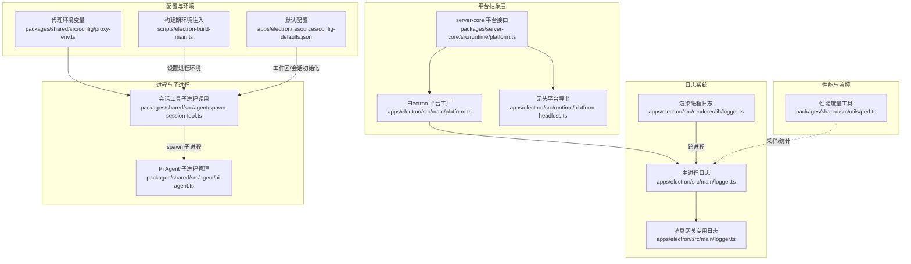
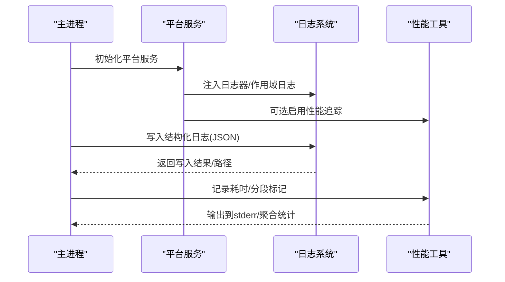
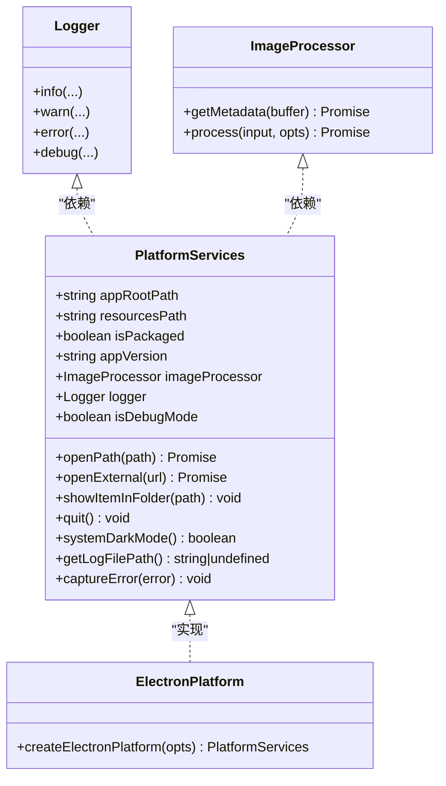
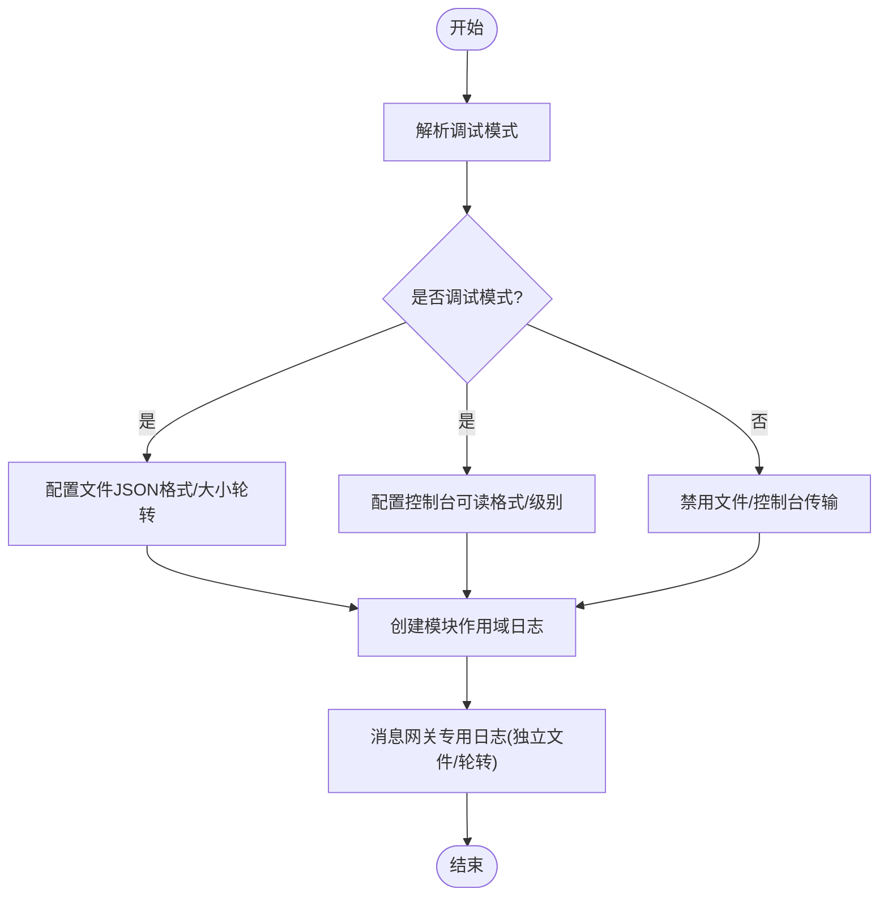
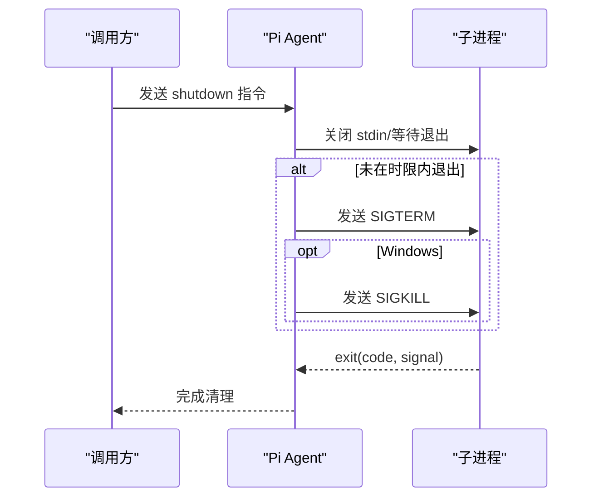
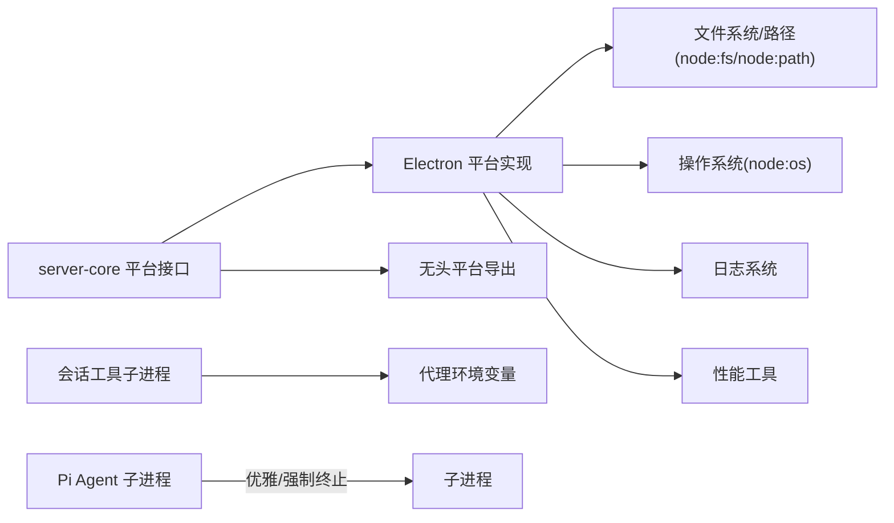

# 运行时环境

<cite>
**本文引用的文件**
- [apps/electron/src/runtime/platform.ts](file://apps/electron/src/runtime/platform.ts)
- [apps/electron/src/runtime/platform-headless.ts](file://apps/electron/src/runtime/platform-headless.ts)
- [packages/server-core/src/runtime/platform.ts](file://packages/server-core/src/runtime/platform.ts)
- [apps/electron/src/main/platform.ts](file://apps/electron/src/main/platform.ts)
- [apps/electron/src/main/logger.ts](file://apps/electron/src/main/logger.ts)
- [apps/electron/src/renderer/lib/logger.ts](file://apps/electron/src/renderer/lib/logger.ts)
- [packages/shared/src/utils/perf.ts](file://packages/shared/src/utils/perf.ts)
- [packages/shared/src/agent/backend/types.ts](file://packages/shared/src/agent/backend/types.ts)
- [packages/shared/src/config/proxy-env.ts](file://packages/shared/src/config/proxy-env.ts)
- [packages/shared/src/agent/spawn-session-tool.ts](file://packages/shared/src/agent/spawn-session-tool.ts)
- [packages/shared/src/agent/pi-agent.ts](file://packages/shared/src/agent/pi-agent.ts)
- [scripts/electron-build-main.ts](file://scripts/electron-build-main.ts)
- [apps/electron/resources/config-defaults.json](file://apps/electron/resources/config-defaults.json)
</cite>

## 目录
1. [简介](#简介)
2. [项目结构](#项目结构)
3. [核心组件](#核心组件)
4. [架构总览](#架构总览)
5. [组件详解](#组件详解)
6. [依赖关系分析](#依赖关系分析)
7. [性能与监控](#性能与监控)
8. [故障排查指南](#故障排查指南)
9. [结论](#结论)
10. [附录](#附录)

## 简介
本文件面向系统运维与平台开发人员，系统性阐述运行时环境的设计与实现，覆盖以下主题：
- 平台抽象层：操作系统检测、文件系统访问、进程管理
- 日志系统：多级别日志、结构化输出、跨进程传输
- 错误处理与恢复：异常捕获、错误传播、降级策略
- 运行时监控：性能统计、资源使用、可观测性
- 配置与环境：运行时配置项、环境变量注入、安全上下文

## 项目结构
运行时相关能力主要分布在以下模块：
- 平台抽象与实现：服务接口定义（server-core）、Electron 实现（apps/electron）、无头实现（apps/electron/runtime）
- 日志：主进程日志、渲染进程日志、消息网关专用日志
- 性能：共享的性能度量工具
- 进程与子进程：会话工具子进程、Pi Agent 子进程管理
- 配置与环境：代理环境变量、构建期环境注入、默认配置

图表来源
- [packages/server-core/src/runtime/platform.ts:1-86](file://packages/server-core/src/runtime/platform.ts#L1-L86)
- [apps/electron/src/main/platform.ts:1-73](file://apps/electron/src/main/platform.ts#L1-L73)
- [apps/electron/src/runtime/platform-headless.ts:1-2](file://apps/electron/src/runtime/platform-headless.ts#L1-L2)
- [apps/electron/src/main/logger.ts:1-218](file://apps/electron/src/main/logger.ts#L1-L218)
- [apps/electron/src/renderer/lib/logger.ts:1-8](file://apps/electron/src/renderer/lib/logger.ts#L1-L8)
- [packages/shared/src/utils/perf.ts:1-418](file://packages/shared/src/utils/perf.ts#L1-L418)
- [packages/shared/src/agent/spawn-session-tool.ts:85-102](file://packages/shared/src/agent/spawn-session-tool.ts#L85-L102)
- [packages/shared/src/agent/pi-agent.ts:2302-2344](file://packages/shared/src/agent/pi-agent.ts#L2302-L2344)
- [packages/shared/src/config/proxy-env.ts:1-25](file://packages/shared/src/config/proxy-env.ts#L1-L25)
- [scripts/electron-build-main.ts:28-63](file://scripts/electron-build-main.ts#L28-L63)
- [apps/electron/resources/config-defaults.json](file://apps/electron/resources/config-defaults.json)

章节来源
- [packages/server-core/src/runtime/platform.ts:1-86](file://packages/server-core/src/runtime/platform.ts#L1-L86)
- [apps/electron/src/main/platform.ts:1-73](file://apps/electron/src/main/platform.ts#L1-L73)
- [apps/electron/src/runtime/platform-headless.ts:1-2](file://apps/electron/src/runtime/platform-headless.ts#L1-L2)
- [apps/electron/src/main/logger.ts:1-218](file://apps/electron/src/main/logger.ts#L1-L218)
- [apps/electron/src/renderer/lib/logger.ts:1-8](file://apps/electron/src/renderer/lib/logger.ts#L1-L8)
- [packages/shared/src/utils/perf.ts:1-418](file://packages/shared/src/utils/perf.ts#L1-L418)
- [packages/shared/src/agent/spawn-session-tool.ts:85-102](file://packages/shared/src/agent/spawn-session-tool.ts#L85-L102)
- [packages/shared/src/agent/pi-agent.ts:2302-2344](file://packages/shared/src/agent/pi-agent.ts#L2302-L2344)
- [packages/shared/src/config/proxy-env.ts:1-25](file://packages/shared/src/config/proxy-env.ts#L1-L25)
- [scripts/electron-build-main.ts:28-63](file://scripts/electron-build-main.ts#L28-L63)
- [apps/electron/resources/config-defaults.json](file://apps/electron/resources/config-defaults.json)

## 核心组件
- 平台抽象接口：统一声明日志、图像处理、路径解析、系统集成、生命周期等能力，作为依赖注入的边界。
- Electron 平台实现：基于 Electron API 提供具体实现，并封装图像处理、系统交互、日志转发等。
- 无头平台导出：在 headless 场景下导出无头实现，便于在 Node/Bun 环境复用核心逻辑。
- 日志系统：主进程采用结构化 JSON 文件与控制台输出；渲染进程采用轻量作用域日志；消息网关独立专用日志文件，便于隔离排查。
- 性能度量：共享的性能工具，支持起止计时、异步/同步测量、分段标记、聚合统计与阈值过滤。
- 进程管理：会话工具通过子进程执行；Pi Agent 具备优雅关闭与强制终止策略。

章节来源
- [packages/server-core/src/runtime/platform.ts:9-85](file://packages/server-core/src/runtime/platform.ts#L9-L85)
- [apps/electron/src/main/platform.ts:21-72](file://apps/electron/src/main/platform.ts#L21-L72)
- [apps/electron/src/runtime/platform-headless.ts:1-2](file://apps/electron/src/runtime/platform-headless.ts#L1-L2)
- [apps/electron/src/main/logger.ts:11-218](file://apps/electron/src/main/logger.ts#L11-L218)
- [apps/electron/src/renderer/lib/logger.ts:1-8](file://apps/electron/src/renderer/lib/logger.ts#L1-L8)
- [packages/shared/src/utils/perf.ts:74-418](file://packages/shared/src/utils/perf.ts#L74-L418)
- [packages/shared/src/agent/spawn-session-tool.ts:85-102](file://packages/shared/src/agent/spawn-session-tool.ts#L85-L102)
- [packages/shared/src/agent/pi-agent.ts:2302-2344](file://packages/shared/src/agent/pi-agent.ts#L2302-L2344)

## 架构总览
平台抽象层通过接口定义能力边界，Electron 实现对接原生 API，无头实现对接第三方库或空操作。日志系统贯穿主/渲染进程与专用通道，性能工具以非侵入方式采集指标。进程管理围绕会话工具与后端代理展开，配合代理环境变量与构建期注入，确保在受限网络环境下稳定运行。

图表来源
- [apps/electron/src/main/platform.ts:21-72](file://apps/electron/src/main/platform.ts#L21-L72)
- [apps/electron/src/main/logger.ts:38-104](file://apps/electron/src/main/logger.ts#L38-L104)
- [packages/shared/src/utils/perf.ts:193-301](file://packages/shared/src/utils/perf.ts#L193-L301)

## 组件详解

### 平台抽象层与实现
- 接口职责
  - 路径解析：应用根目录、资源目录、打包状态
  - 应用元数据：版本号
  - 图像处理：元信息读取、尺寸调整、格式转换
  - 系统集成：打开路径/外部链接、展示文件、深色模式
  - 生命周期：退出应用
  - 可观测性：日志器、调试模式、日志文件路径、错误上报
- Electron 实现要点
  - 使用 Electron 原生对象（nativeImage、shell、nativeTheme）实现系统集成与图像处理
  - 将日志器、调试模式、日志路径、错误上报透传给上层
- 无头实现
  - 在 headless 模式下导出无头平台，用于 Node/Bun 环境复用核心逻辑

图表来源
- [packages/server-core/src/runtime/platform.ts:9-85](file://packages/server-core/src/runtime/platform.ts#L9-L85)
- [apps/electron/src/main/platform.ts:21-72](file://apps/electron/src/main/platform.ts#L21-L72)

章节来源
- [packages/server-core/src/runtime/platform.ts:9-85](file://packages/server-core/src/runtime/platform.ts#L9-L85)
- [apps/electron/src/main/platform.ts:21-72](file://apps/electron/src/main/platform.ts#L21-L72)
- [apps/electron/src/runtime/platform-headless.ts:1-2](file://apps/electron/src/runtime/platform-headless.ts#L1-L2)

### 日志系统
- 主进程日志
  - 调试模式：文件 JSON 结构化输出、控制台可读格式、大小轮转
  - 生产模式：禁用文件与控制台传输
  - 作用域日志：按模块划分（main/session/handler/window/agent/search）
  - 消息网关专用日志：独立目录与文件，独立轮转策略，错误级别同步到主日志
- 渲染进程日志
  - 作用域日志（renderer/search），便于前端侧定位问题
- 日志规范化
  - 对错误、数组、对象进行深度归一化，避免循环引用与不可序列化字段

图表来源
- [apps/electron/src/main/logger.ts:20-104](file://apps/electron/src/main/logger.ts#L20-L104)
- [apps/electron/src/main/logger.ts:177-202](file://apps/electron/src/main/logger.ts#L177-L202)

章节来源
- [apps/electron/src/main/logger.ts:11-218](file://apps/electron/src/main/logger.ts#L11-L218)
- [apps/electron/src/renderer/lib/logger.ts:1-8](file://apps/electron/src/renderer/lib/logger.ts#L1-L8)

### 进程管理与子进程
- 会话工具子进程
  - 通过统一入口调用 spawn，捕获异常并返回标准化错误响应
  - 支持工作目录路径展开（~、${HOME}、相对路径）
- Pi Agent 子进程
  - 优雅关闭：发送 shutdown 指令，等待退出
  - 强制终止：超时后发送 SIGTERM/SIGKILL，确保资源回收
- 代理环境变量
  - 将存储的代理设置转换为 HTTP_PROXY/HTTPS_PROXY/NO_PROXY 等环境变量，传递给子进程

图表来源
- [packages/shared/src/agent/pi-agent.ts:2302-2344](file://packages/shared/src/agent/pi-agent.ts#L2302-L2344)

章节来源
- [packages/shared/src/agent/spawn-session-tool.ts:85-102](file://packages/shared/src/agent/spawn-session-tool.ts#L85-L102)
- [packages/shared/src/agent/pi-agent.ts:2302-2344](file://packages/shared/src/agent/pi-agent.ts#L2302-L2344)
- [packages/shared/src/config/proxy-env.ts:1-25](file://packages/shared/src/config/proxy-env.ts#L1-L25)

### 配置与环境
- 运行时上下文
  - 后端主机运行时上下文包含应用根路径、资源路径、打包状态、可选 Node/Bun 可执行路径、拦截器包路径等
- 构建期环境注入
  - 从 .env 文件读取键值对注入到进程环境，支持单引号/双引号去除
- 默认配置
  - 应用资源中提供默认配置文件，作为工作区/会话初始化的基础

章节来源
- [packages/shared/src/agent/backend/types.ts:152-187](file://packages/shared/src/agent/backend/types.ts#L152-L187)
- [scripts/electron-build-main.ts:28-63](file://scripts/electron-build-main.ts#L28-L63)
- [apps/electron/resources/config-defaults.json](file://apps/electron/resources/config-defaults.json)

## 依赖关系分析
- 耦合与内聚
  - 平台抽象层高内聚、低耦合，通过接口屏蔽 Electron/无头差异
  - 日志系统与平台服务解耦，通过注入方式接入
  - 性能工具与业务逻辑解耦，仅在需要时启用
- 外部依赖与集成点
  - Electron 原生模块（nativeImage、shell、nativeTheme）
  - 文件系统与路径模块（node:fs、node:path、node:os）
  - 子进程与信号处理（child_process、信号常量）

图表来源
- [packages/server-core/src/runtime/platform.ts:1-86](file://packages/server-core/src/runtime/platform.ts#L1-L86)
- [apps/electron/src/main/platform.ts:1-73](file://apps/electron/src/main/platform.ts#L1-L73)
- [packages/shared/src/config/proxy-env.ts:1-25](file://packages/shared/src/config/proxy-env.ts#L1-L25)
- [packages/shared/src/agent/pi-agent.ts:2302-2344](file://packages/shared/src/agent/pi-agent.ts#L2302-L2344)

章节来源
- [packages/server-core/src/runtime/platform.ts:1-86](file://packages/server-core/src/runtime/platform.ts#L1-L86)
- [apps/electron/src/main/platform.ts:1-73](file://apps/electron/src/main/platform.ts#L1-L73)
- [packages/shared/src/config/proxy-env.ts:1-25](file://packages/shared/src/config/proxy-env.ts#L1-L25)
- [packages/shared/src/agent/pi-agent.ts:2302-2344](file://packages/shared/src/agent/pi-agent.ts#L2302-L2344)

## 性能与监控
- 性能度量
  - 提供 start/measure/measureSync/span 等 API，支持中间标记与元数据
  - 聚合统计包含计数、总时长、最小/最大/平均、P50/P95 百分位
  - 可配置最小阈值与自定义回调，输出到 stderr
- 监控指标建议
  - 结合日志系统记录关键事件与错误
  - 在关键路径埋点，利用 span 分解瓶颈
  - 通过代理环境变量保障子进程网络监控

章节来源
- [packages/shared/src/utils/perf.ts:1-418](file://packages/shared/src/utils/perf.ts#L1-L418)

## 故障排查指南
- 日志定位
  - 主进程：查看调试模式下的文件路径与控制台输出；生产模式下禁用文件/控制台传输
  - 消息网关：检查专用日志文件路径与轮转备份
  - 渲染进程：使用作用域日志定位前端问题
- 进程问题
  - 子进程异常：捕获错误并返回标准化响应；必要时检查代理环境变量
  - Pi Agent 未退出：确认优雅关闭流程与强制终止策略
- 配置问题
  - 确认构建期环境注入是否生效
  - 检查默认配置文件与工作区路径解析

章节来源
- [apps/electron/src/main/logger.ts:208-218](file://apps/electron/src/main/logger.ts#L208-L218)
- [packages/shared/src/agent/spawn-session-tool.ts:85-102](file://packages/shared/src/agent/spawn-session-tool.ts#L85-L102)
- [packages/shared/src/agent/pi-agent.ts:2302-2344](file://packages/shared/src/agent/pi-agent.ts#L2302-L2344)
- [scripts/electron-build-main.ts:28-63](file://scripts/electron-build-main.ts#L28-L63)

## 结论
该运行时环境通过平台抽象层屏蔽底层差异，结合结构化日志、性能度量与稳健的进程管理，提供了可运维、可观测、可扩展的运行支撑。建议在生产环境中谨慎开启日志与性能追踪，配合代理环境变量与默认配置，确保在复杂网络与多平台场景下的稳定性。

## 附录
- 运行时配置项
  - 后端主机运行时上下文：应用根路径、资源路径、打包状态、可执行路径、拦截器包路径
- 环境变量管理
  - 构建期注入：从 .env 读取并注入进程环境
  - 运行时注入：代理设置转换为 HTTP/HTTPS/NO_PROXY
- 安全上下文
  - 会话工具子进程路径展开与工作目录规范化，避免路径逃逸
  - Pi Agent 的优雅关闭与强制终止策略，降低资源泄漏风险

章节来源
- [packages/shared/src/agent/backend/types.ts:152-187](file://packages/shared/src/agent/backend/types.ts#L152-L187)
- [scripts/electron-build-main.ts:28-63](file://scripts/electron-build-main.ts#L28-L63)
- [packages/shared/src/config/proxy-env.ts:1-25](file://packages/shared/src/config/proxy-env.ts#L1-L25)
- [packages/shared/src/agent/spawn-session-tool.ts:85-102](file://packages/shared/src/agent/spawn-session-tool.ts#L85-L102)
- [packages/shared/src/agent/pi-agent.ts:2302-2344](file://packages/shared/src/agent/pi-agent.ts#L2302-L2344)