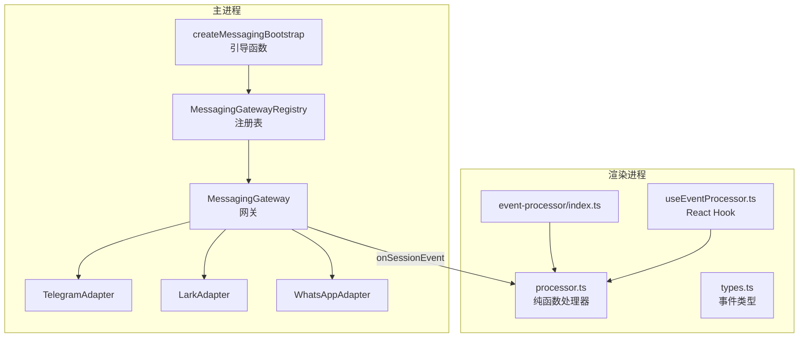
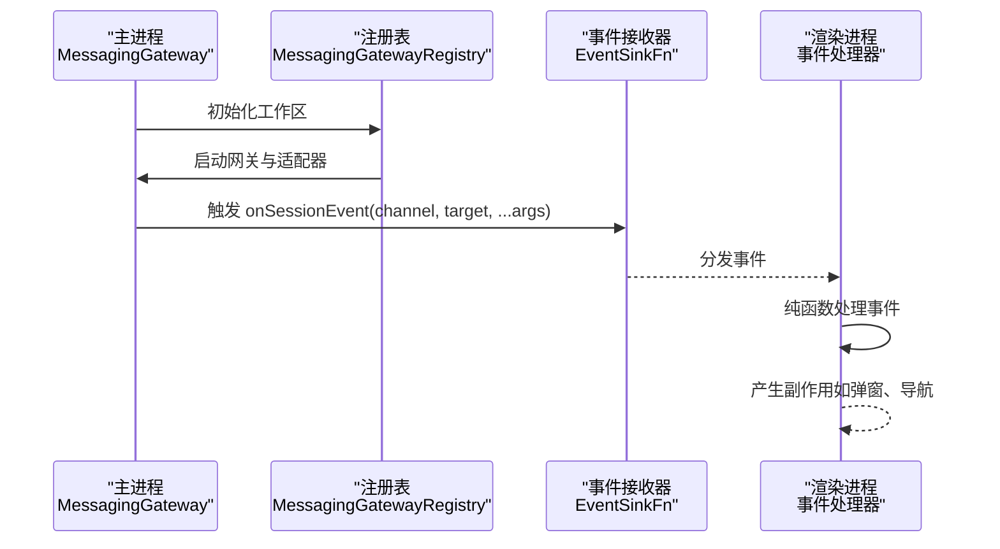
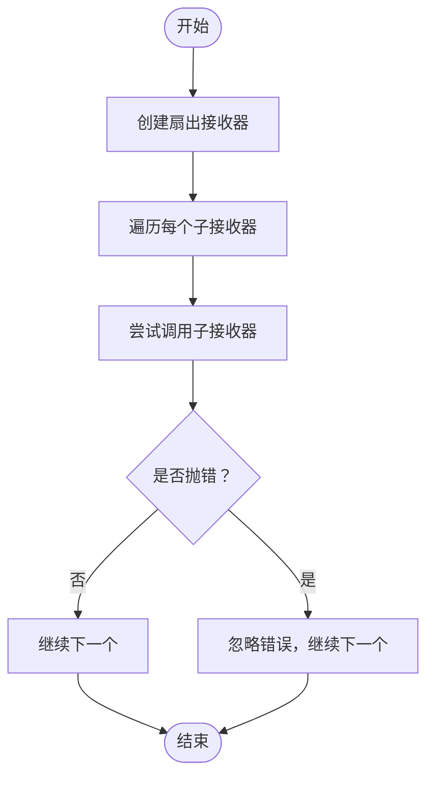
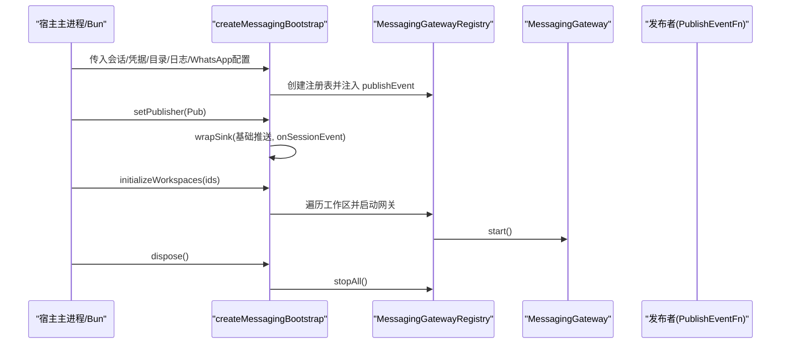
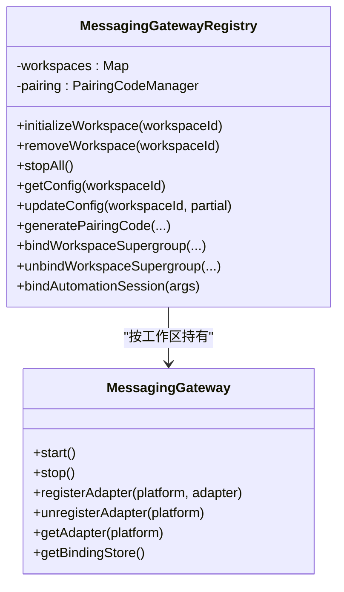
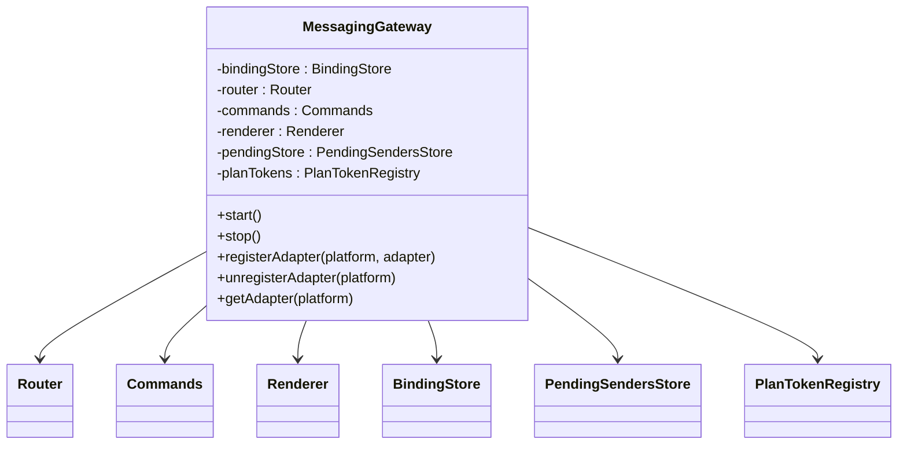
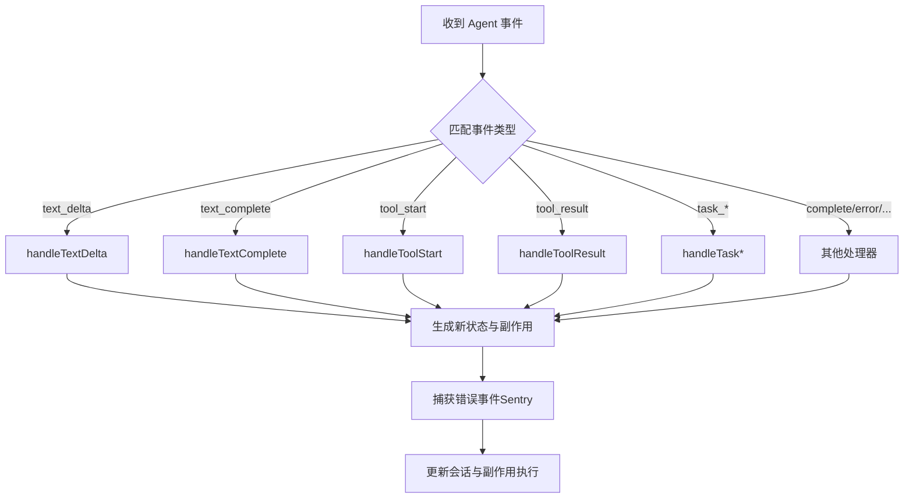
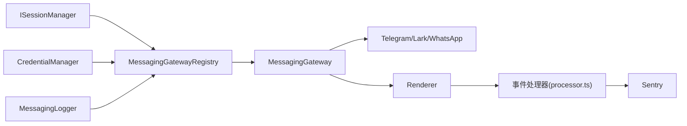

# 消息事件系统

<cite>
**本文引用的文件**
- [packages/messaging-gateway/src/bootstrap.ts](file://packages/messaging-gateway/src/bootstrap.ts)
- [packages/messaging-gateway/src/event-fanout.ts](file://packages/messaging-gateway/src/event-fanout.ts)
- [packages/messaging-gateway/src/registry.ts](file://packages/messaging-gateway/src/registry.ts)
- [packages/messaging-gateway/src/gateway.ts](file://packages/messaging-gateway/src/gateway.ts)
- [packages/messaging-gateway/src/types.ts](file://packages/messaging-gateway/src/types.ts)
- [packages/messaging-gateway/src/adapters/whatsapp/index.ts](file://packages/messaging-gateway/src/adapters/whatsapp/index.ts)
- [apps/electron/src/renderer/event-processor/index.ts](file://apps/electron/src/renderer/event-processor/index.ts)
- [apps/electron/src/renderer/event-processor/processor.ts](file://apps/electron/src/renderer/event-processor/processor.ts)
- [apps/electron/src/renderer/event-processor/types.ts](file://apps/electron/src/renderer/event-processor/types.ts)
- [apps/electron/src/renderer/event-processor/useEventProcessor.ts](file://apps/electron/src/renderer/event-processor/useEventProcessor.ts)
</cite>

## 目录
1. [简介](#简介)
2. [项目结构](#项目结构)
3. [核心组件](#核心组件)
4. [架构总览](#架构总览)
5. [详细组件分析](#详细组件分析)
6. [依赖关系分析](#依赖关系分析)
7. [性能考量](#性能考量)
8. [故障排查指南](#故障排查指南)
9. [结论](#结论)
10. [附录](#附录)

## 简介
本文件系统性阐述消息事件系统的设计与实现，覆盖以下关键主题：
- EventSinkFn 事件接收器与扇出模式（fan-out）的实现与传播机制
- MessagingGatewayRegistry 注册表的架构、网关实例管理与生命周期控制
- createMessagingBootstrap 引导函数的功能、初始化流程与依赖注入
- 事件类型定义、回调机制与异步处理
- 事件监听器注册、性能监控与故障隔离
- 使用示例、调试方法与扩展指南

该系统在主进程与渲染进程之间通过统一的事件通道进行解耦：主进程负责平台适配器、路由与绑定管理，渲染进程负责事件的集中式纯函数处理与副作用执行。

## 项目结构
消息事件系统主要分布在两个层次：
- 主进程侧（packages/messaging-gateway）：注册表、网关、适配器、类型与引导逻辑
- 渲染进程侧（apps/electron/src/renderer/event-processor）：事件类型、处理器与 React Hook

**图表来源**
- [packages/messaging-gateway/src/bootstrap.ts:66-118](file://packages/messaging-gateway/src/bootstrap.ts#L66-L118)
- [packages/messaging-gateway/src/registry.ts:94-218](file://packages/messaging-gateway/src/registry.ts#L94-L218)
- [packages/messaging-gateway/src/gateway.ts:129-200](file://packages/messaging-gateway/src/gateway.ts#L129-L200)
- [packages/messaging-gateway/src/adapters/whatsapp/index.ts:112-140](file://packages/messaging-gateway/src/adapters/whatsapp/index.ts#L112-L140)
- [apps/electron/src/renderer/event-processor/index.ts:1-40](file://apps/electron/src/renderer/event-processor/index.ts#L1-L40)
- [apps/electron/src/renderer/event-processor/processor.ts:62-229](file://apps/electron/src/renderer/event-processor/processor.ts#L62-L229)
- [apps/electron/src/renderer/event-processor/types.ts:475-537](file://apps/electron/src/renderer/event-processor/types.ts#L475-L537)
- [apps/electron/src/renderer/event-processor/useEventProcessor.ts:78-130](file://apps/electron/src/renderer/event-processor/useEventProcessor.ts#L78-L130)

**章节来源**
- [packages/messaging-gateway/src/bootstrap.ts:66-118](file://packages/messaging-gateway/src/bootstrap.ts#L66-L118)
- [packages/messaging-gateway/src/registry.ts:94-218](file://packages/messaging-gateway/src/registry.ts#L94-L218)
- [packages/messaging-gateway/src/gateway.ts:129-200](file://packages/messaging-gateway/src/gateway.ts#L129-L200)
- [apps/electron/src/renderer/event-processor/index.ts:1-40](file://apps/electron/src/renderer/event-processor/index.ts#L1-L40)

## 核心组件
- EventSinkFn 与扇出模式：用于将单一推送通道合并为多路分发，确保某一路异常不影响其他路
- MessagingGatewayRegistry：按工作区持有网关实例，管理配置、绑定、配对码与平台生命周期
- MessagingGateway：编排适配器、路由、命令与渲染器，维护权限提示与计划令牌等状态
- 事件处理器（渲染进程）：以纯函数方式处理各类 Agent 事件，保证可测试性与一致性
- 引导函数 createMessagingBootstrap：统一注入依赖、设置发布者、包装事件接收器并初始化工作区

**章节来源**
- [packages/messaging-gateway/src/event-fanout.ts:20-36](file://packages/messaging-gateway/src/event-fanout.ts#L20-L36)
- [packages/messaging-gateway/src/registry.ts:94-218](file://packages/messaging-gateway/src/registry.ts#L94-L218)
- [packages/messaging-gateway/src/gateway.ts:129-200](file://packages/messaging-gateway/src/gateway.ts#L129-L200)
- [apps/electron/src/renderer/event-processor/processor.ts:62-229](file://apps/electron/src/renderer/event-processor/processor.ts#L62-L229)
- [packages/messaging-gateway/src/bootstrap.ts:66-118](file://packages/messaging-gateway/src/bootstrap.ts#L66-L118)

## 架构总览
消息事件系统采用“主进程网关 + 渲染进程处理器”的双层架构：
- 主进程负责平台接入、路由与持久化；渲染进程负责 UI 响应与副作用
- 通过 EventSinkFn 扇出，将主进程事件广播到渲染进程
- 事件类型在渲染侧集中定义，处理器以纯函数形式更新状态并产生副作用

**图表来源**
- [packages/messaging-gateway/src/registry.ts:125-200](file://packages/messaging-gateway/src/registry.ts#L125-L200)
- [packages/messaging-gateway/src/gateway.ts:129-200](file://packages/messaging-gateway/src/gateway.ts#L129-L200)
- [packages/messaging-gateway/src/event-fanout.ts:26-36](file://packages/messaging-gateway/src/event-fanout.ts#L26-L36)
- [apps/electron/src/renderer/event-processor/processor.ts:62-229](file://apps/electron/src/renderer/event-processor/processor.ts#L62-L229)

## 详细组件分析

### EventSinkFn 与扇出模式
- 定义：EventSinkFn 是一个通用推送回调签名，用于向指定通道与目标推送事件
- 实现：createFanOutSink 将多个 EventSinkFn 组合为单一入口，逐个调用，任一失败不阻断其他
- 用途：在引导阶段将网关事件与现有 RPC 推送通道合并，避免破坏既有推送链路

**图表来源**
- [packages/messaging-gateway/src/event-fanout.ts:26-36](file://packages/messaging-gateway/src/event-fanout.ts#L26-L36)

**章节来源**
- [packages/messaging-gateway/src/event-fanout.ts:20-36](file://packages/messaging-gateway/src/event-fanout.ts#L20-L36)

### createMessagingBootstrap 引导函数
- 职责：统一创建注册表、注入会话管理器与凭据管理器、设置发布者、包装事件接收器、初始化工作区、释放资源
- 关键步骤：
  - 构造注册表并注入 publishEvent 回调
  - setPublisher：在服务端 WebSocket 可用后绑定推送函数
  - wrapSink：将基础推送与网关 onSessionEvent 合并为单一事件接收器
  - initializeWorkspaces：逐个工作区启动网关与平台连接
  - dispose：停止所有网关并清理资源

**图表来源**
- [packages/messaging-gateway/src/bootstrap.ts:66-118](file://packages/messaging-gateway/src/bootstrap.ts#L66-L118)
- [packages/messaging-gateway/src/registry.ts:125-200](file://packages/messaging-gateway/src/registry.ts#L125-L200)

**章节来源**
- [packages/messaging-gateway/src/bootstrap.ts:66-118](file://packages/messaging-gateway/src/bootstrap.ts#L66-L118)

### MessagingGatewayRegistry 注册表
- 职责：
  - 按工作区持有网关、配置存储、话题注册表、运行时信息
  - 管理平台生命周期（Telegram/Lark/WhatsApp）、配对码、绑定与权限
  - 作为 IMessagingGatewayRegistry 对外暴露配置、绑定与配对接口
- 生命周期：
  - initializeWorkspace：启动网关并尝试连接各平台
  - removeWorkspace：停止网关、清理配对码
  - stopAll：并行停止所有网关并清空内存状态
- 平台管理：
  - Telegram：保存令牌、连接、超群组配对
  - Lark：校验凭据、保存凭据并连接
  - WhatsApp：子进程生命周期管理、配对模式与自聊路由

**图表来源**
- [packages/messaging-gateway/src/registry.ts:94-218](file://packages/messaging-gateway/src/registry.ts#L94-L218)
- [packages/messaging-gateway/src/gateway.ts:129-200](file://packages/messaging-gateway/src/gateway.ts#L129-L200)

**章节来源**
- [packages/messaging-gateway/src/registry.ts:94-218](file://packages/messaging-gateway/src/registry.ts#L94-L218)

### MessagingGateway 网关
- 编排角色：绑定存储、路由器、命令系统、渲染器、待处理发送者与计划令牌
- 权限控制：基于工作区配置与绑定配置评估预绑定与绑定内访问
- 状态管理：维护计划提示、权限提示、紧凑接受等交互状态，确保按钮幂等与过期清理
- 适配器集成：支持 Telegram、Lark、WhatsApp，统一平台能力与事件模型

**图表来源**
- [packages/messaging-gateway/src/gateway.ts:129-200](file://packages/messaging-gateway/src/gateway.ts#L129-L200)

**章节来源**
- [packages/messaging-gateway/src/gateway.ts:129-200](file://packages/messaging-gateway/src/gateway.ts#L129-L200)

### 渲染进程事件处理器
- 类型体系：集中定义 Agent 事件类型（文本增量、工具开始/结果、完成、错误、权限请求、标签变更、计划提交、状态变更、任务后台化、用户消息、消息注解更新、分享状态、认证请求/完成、源激活、用量更新等）
- 处理器：processEvent 作为纯函数，根据事件类型分派到对应处理器，返回新状态与副作用
- Hook：useEventProcessor 提供 React Hook，管理每会话的流式状态，捕获错误事件上报 Sentry，并输出副作用

**图表来源**
- [apps/electron/src/renderer/event-processor/processor.ts:62-229](file://apps/electron/src/renderer/event-processor/processor.ts#L62-L229)
- [apps/electron/src/renderer/event-processor/types.ts:475-537](file://apps/electron/src/renderer/event-processor/types.ts#L475-L537)
- [apps/electron/src/renderer/event-processor/useEventProcessor.ts:21-44](file://apps/electron/src/renderer/event-processor/useEventProcessor.ts#L21-L44)

**章节来源**
- [apps/electron/src/renderer/event-processor/index.ts:1-40](file://apps/electron/src/renderer/event-processor/index.ts#L1-L40)
- [apps/electron/src/renderer/event-processor/processor.ts:62-229](file://apps/electron/src/renderer/event-processor/processor.ts#L62-L229)
- [apps/electron/src/renderer/event-processor/types.ts:475-537](file://apps/electron/src/renderer/event-processor/types.ts#L475-L537)
- [apps/electron/src/renderer/event-processor/useEventProcessor.ts:78-130](file://apps/electron/src/renderer/event-processor/useEventProcessor.ts#L78-L130)

### 事件类型定义与回调机制
- 事件类型：在渲染侧集中定义，覆盖文本、工具、会话元数据、权限、认证、后台任务、分享、用量等全量 Agent 事件
- 回调机制：主进程通过 EventSinkFn 将事件推送到渲染进程；渲染侧以纯函数处理并返回副作用
- 异步处理：事件处理器保持纯函数特性，副作用通过 Effect 结构分离，由 Hook 或上层调度执行

**章节来源**
- [apps/electron/src/renderer/event-processor/types.ts:475-537](file://apps/electron/src/renderer/event-processor/types.ts#L475-L537)
- [apps/electron/src/renderer/event-processor/processor.ts:62-229](file://apps/electron/src/renderer/event-processor/processor.ts#L62-L229)

### WhatsApp 适配器与生命周期
- 子进程模型：通过 spawn 启动独立子进程承载 Baileys，隔离崩溃与内存风险
- 事件桥接：解析 worker 输出帧，转换为平台事件并触发回调
- 运行时参数：支持配对模式（二维码/手机号码）、自聊路由、发送超时与响应前缀
- 错误处理：进程退出、stderr 日志与 pending 请求清理，保障稳定性

**章节来源**
- [packages/messaging-gateway/src/adapters/whatsapp/index.ts:112-200](file://packages/messaging-gateway/src/adapters/whatsapp/index.ts#L112-L200)

## 依赖关系分析
- 主进程依赖注入：
  - 会话管理器（ISessionManager）：驱动自动化绑定与会话事件
  - 凭据管理器（CredentialManager）：保存/读取平台令牌与凭据
  - 日志器（MessagingLogger）：结构化日志上下文
  - 存储路径：工作区消息目录与历史迁移目录
- 渲染进程依赖：
  - 事件类型与处理器：集中定义与处理 Agent 事件
  - Sentry：错误事件上报
  - React Hook：会话状态与副作用管理

**图表来源**
- [packages/messaging-gateway/src/bootstrap.ts:28-48](file://packages/messaging-gateway/src/bootstrap.ts#L28-L48)
- [packages/messaging-gateway/src/registry.ts:62-82](file://packages/messaging-gateway/src/registry.ts#L62-L82)
- [packages/messaging-gateway/src/gateway.ts:188-200](file://packages/messaging-gateway/src/gateway.ts#L188-L200)
- [apps/electron/src/renderer/event-processor/useEventProcessor.ts:9-13](file://apps/electron/src/renderer/event-processor/useEventProcessor.ts#L9-L13)

**章节来源**
- [packages/messaging-gateway/src/bootstrap.ts:28-48](file://packages/messaging-gateway/src/bootstrap.ts#L28-L48)
- [packages/messaging-gateway/src/registry.ts:62-82](file://packages/messaging-gateway/src/registry.ts#L62-L82)
- [packages/messaging-gateway/src/gateway.ts:188-200](file://packages/messaging-gateway/src/gateway.ts#L188-L200)
- [apps/electron/src/renderer/event-processor/useEventProcessor.ts:9-13](file://apps/electron/src/renderer/event-processor/useEventProcessor.ts#L9-L13)

## 性能考量
- 纯函数处理器：保证状态更新确定性，减少竞态与重复渲染
- 扇出模式：单点推送合并，避免多次网络往返
- 并行停止：stopAll 并行关闭所有网关，缩短停机时间
- 流式渲染：StreamingState 仅在内存中累积，避免频繁 React 状态更新
- 超时与重试：WhatsApp 发送超时控制，防止阻塞渲染路径

[本节为通用性能建议，无需特定文件引用]

## 故障排查指南
- 日志与上下文：注册表与网关均提供结构化日志，包含组件名、工作区、事件等上下文字段，便于定位问题
- 错误事件上报：渲染侧 Hook 在捕获 error/typed_error 时上报 Sentry，便于集中分析
- 适配器健康检查：
  - Telegram：保存令牌后立即尝试连接并更新运行时状态
  - Lark：凭据校验通过后再写入凭据并连接
  - WhatsApp：子进程退出、stderr 日志与 pending 请求清理
- 配对与绑定：
  - 生成配对码与超群组绑定需检查平台连接状态与配置
  - 绑定变更会触发通知，便于确认路由生效

**章节来源**
- [packages/messaging-gateway/src/registry.ts:48-60](file://packages/messaging-gateway/src/registry.ts#L48-L60)
- [apps/electron/src/renderer/event-processor/useEventProcessor.ts:21-44](file://apps/electron/src/renderer/event-processor/useEventProcessor.ts#L21-L44)
- [packages/messaging-gateway/src/adapters/whatsapp/index.ts:175-200](file://packages/messaging-gateway/src/adapters/whatsapp/index.ts#L175-L200)

## 结论
消息事件系统通过清晰的职责划分与稳定的引导流程，实现了主进程与渲染进程之间的高效协作。EventSinkFn 扇出模式确保了事件传播的健壮性；注册表与网关提供了完善的生命周期与平台管理能力；渲染侧的纯函数处理器与副作用分离提升了可维护性与可观测性。结合结构化日志与 Sentry 上报，系统具备良好的故障隔离与诊断能力。

[本节为总结性内容，无需特定文件引用]

## 附录

### 使用示例（步骤级）
- 引导阶段
  - 调用 createMessagingBootstrap，传入会话管理器、凭据管理器、存储目录与日志器
  - 在服务端 WebSocket 可用后调用 setPublisher 绑定推送
  - 调用 wrapSink 将基础推送与网关 onSessionEvent 合并
  - 调用 initializeWorkspaces 初始化启用消息的工作区
- 事件监听
  - 在渲染侧通过 useEventProcessor 获取事件处理器
  - 将 Agent 事件交由 processEvent 处理，执行副作用并更新会话
- 平台配置
  - Telegram：保存令牌后自动连接并更新运行时状态
  - Lark：校验凭据后保存并连接
  - WhatsApp：根据配对模式启动子进程并建立连接

**章节来源**
- [packages/messaging-gateway/src/bootstrap.ts:66-118](file://packages/messaging-gateway/src/bootstrap.ts#L66-L118)
- [apps/electron/src/renderer/event-processor/useEventProcessor.ts:78-130](file://apps/electron/src/renderer/event-processor/useEventProcessor.ts#L78-L130)

### 调试方法
- 启用结构化日志：通过 MessagingLogger 查看组件与事件上下文
- Sentry 错误追踪：在渲染侧捕获 error/typed_error 事件并上报
- 事件类型核对：对照渲染侧事件类型定义，确保主进程推送字段一致
- 并发问题排查：确认事件处理器为纯函数，副作用通过 Effect 分离

**章节来源**
- [packages/messaging-gateway/src/types.ts:36-41](file://packages/messaging-gateway/src/types.ts#L36-L41)
- [apps/electron/src/renderer/event-processor/useEventProcessor.ts:21-44](file://apps/electron/src/renderer/event-processor/useEventProcessor.ts#L21-L44)
- [apps/electron/src/renderer/event-processor/types.ts:475-537](file://apps/electron/src/renderer/event-processor/types.ts#L475-L537)

### 扩展指南
- 新增平台适配器
  - 实现 PlatformAdapter 接口，包含 initialize/destroy/onMessage/onButtonPress/send* 等
  - 在网关中注册并纳入运行时状态管理
- 新增事件类型
  - 在渲染侧 types.ts 中新增事件接口与联合类型
  - 在 processor.ts 的 switch 中添加处理分支
  - 如有副作用，扩展 Effect 类型并在处理器中返回
- 新增引导流程
  - 在 createMessagingBootstrap 中注入新依赖或配置项
  - 确保 setPublisher/wrapSink/initializeWorkspaces/dispose 的正确顺序

**章节来源**
- [packages/messaging-gateway/src/types.ts:185-228](file://packages/messaging-gateway/src/types.ts#L185-L228)
- [apps/electron/src/renderer/event-processor/types.ts:475-537](file://apps/electron/src/renderer/event-processor/types.ts#L475-L537)
- [packages/messaging-gateway/src/bootstrap.ts:66-118](file://packages/messaging-gateway/src/bootstrap.ts#L66-L118)