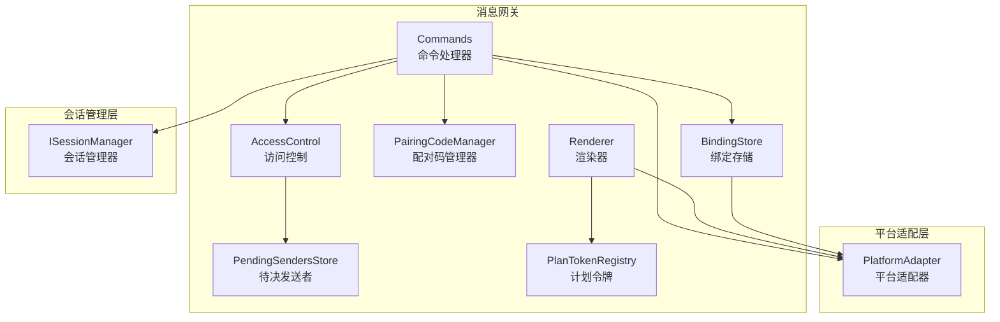
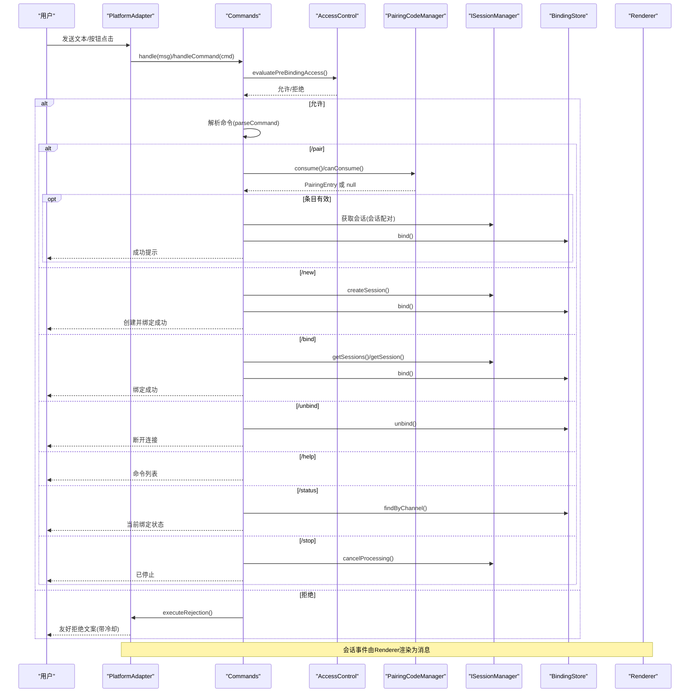
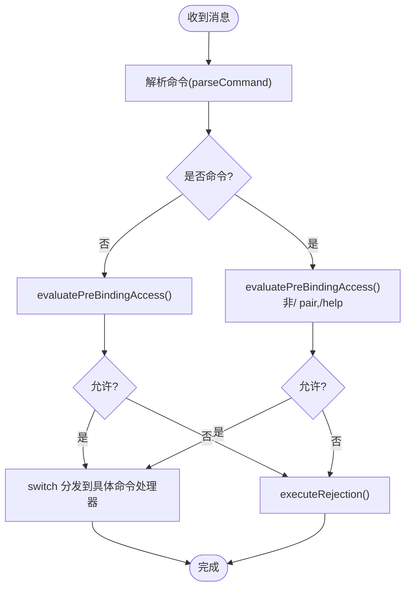
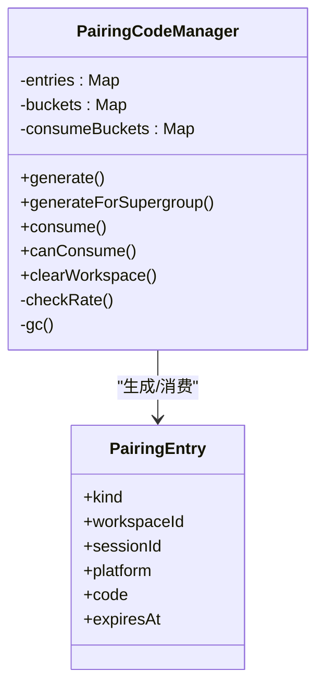
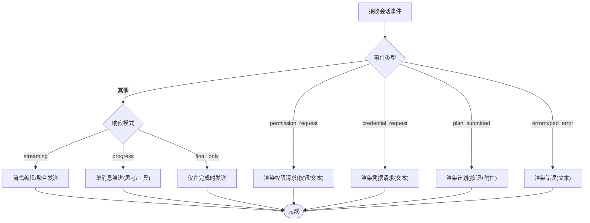
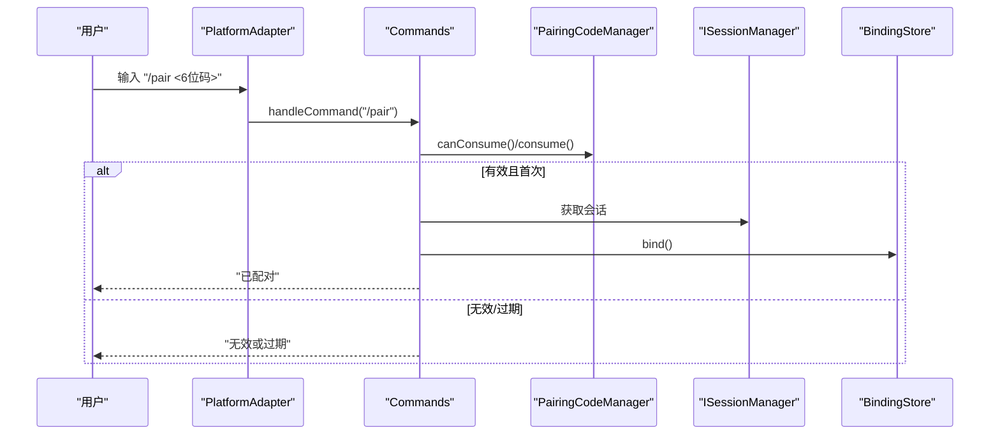
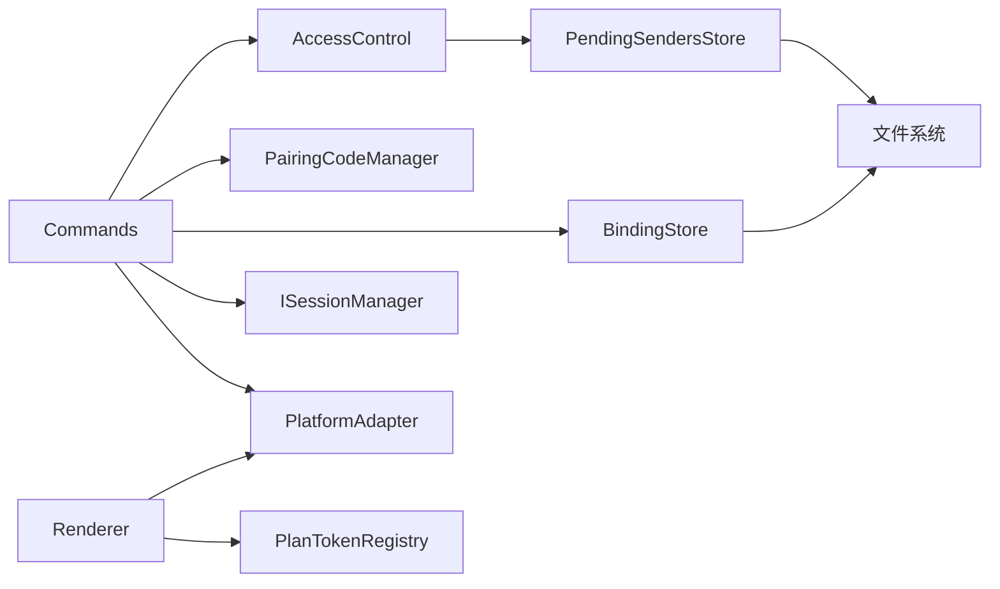

# 消息命令系统

<cite>
**本文引用的文件**
- [commands.ts](file://packages/messaging-gateway/src/commands.ts)
- [pairing.ts](file://packages/messaging-gateway/src/pairing.ts)
- [renderer.ts](file://packages/messaging-gateway/src/renderer.ts)
- [access-control.ts](file://packages/messaging-gateway/src/access-control.ts)
- [binding-store.ts](file://packages/messaging-gateway/src/binding-store.ts)
- [pending-senders.ts](file://packages/messaging-gateway/src/pending-senders.ts)
- [plan-tokens.ts](file://packages/messaging-gateway/src/plan-tokens.ts)
- [pairing.test.ts](file://packages/messaging-gateway/src/__tests__/pairing.test.ts)
- [client.ts](file://apps/cli/src/client.ts)
- [client.ts](file://apps/electron/src/transport/client.ts)
</cite>

## 目录
1. [简介](#简介)
2. [项目结构](#项目结构)
3. [核心组件](#核心组件)
4. [架构总览](#架构总览)
5. [详细组件分析](#详细组件分析)
6. [依赖关系分析](#依赖关系分析)
7. [性能考量](#性能考量)
8. [故障排查指南](#故障排查指南)
9. [结论](#结论)
10. [附录](#附录)

## 简介
本文件系统性阐述消息命令系统的架构与实现，重点覆盖以下方面：
- Commands 命令处理器：命令解析、路由、访问控制、执行流程与错误恢复
- PairingCodeManager 二维码管理器：配对码生成、消费、过期与速率限制
- PairingEntry 配对条目：结构、作用域与生命周期
- Renderer 渲染器：会话事件到消息的转换、响应模式、权限与错误处理
- 安全机制：预绑定访问控制、拒绝回复冷却、速率限制、一次性消费
- 命令开发指南：注册机制、参数校验、错误恢复
- 配对流程演示：从生成到绑定的端到端时序
- 安全最佳实践：平台差异、超群组配对、令牌与按钮安全

## 项目结构
消息命令系统位于 messaging-gateway 包中，围绕命令处理、配对管理、渲染与访问控制四大模块协同工作，并通过绑定存储持久化通道绑定关系，通过待决发送者记录被拒访客以便运营介入。

图表来源
- [commands.ts](file://packages/messaging-gateway/src/commands.ts)
- [access-control.ts](file://packages/messaging-gateway/src/access-control.ts)
- [pairing.ts](file://packages/messaging-gateway/src/pairing.ts)
- [renderer.ts](file://packages/messaging-gateway/src/renderer.ts)
- [binding-store.ts](file://packages/messaging-gateway/src/binding-store.ts)
- [pending-senders.ts](file://packages/messaging-gateway/src/pending-senders.ts)
- [plan-tokens.ts](file://packages/messaging-gateway/src/plan-tokens.ts)

章节来源
- [commands.ts](file://packages/messaging-gateway/src/commands.ts)
- [access-control.ts](file://packages/messaging-gateway/src/access-control.ts)
- [pairing.ts](file://packages/messaging-gateway/src/pairing.ts)
- [renderer.ts](file://packages/messaging-gateway/src/renderer.ts)
- [binding-store.ts](file://packages/messaging-gateway/src/binding-store.ts)
- [pending-senders.ts](file://packages/messaging-gateway/src/pending-senders.ts)
- [plan-tokens.ts](file://packages/messaging-gateway/src/plan-tokens.ts)

## 核心组件
- Commands：统一入口，负责命令解析、预绑定访问控制、命令分发与执行、帮助与状态展示、停止运行等
- PairingCodeManager：生成与消费一次性配对码，带过期清理与速率限制
- PairingEntry：配对条目，区分会话级与工作区超群组级配对
- Renderer：将会话事件转换为平台消息，支持 streaming、progress、final_only 三种模式
- BindingStore：通道绑定的持久化存储
- PendingSendersStore：待决发送者记录，便于运营放行
- PlanTokenRegistry：为计划审批按钮颁发短生命周期令牌
- AccessControl：预绑定与绑定后访问控制、拒绝回复构建与冷却

章节来源
- [commands.ts](file://packages/messaging-gateway/src/commands.ts)
- [pairing.ts](file://packages/messaging-gateway/src/pairing.ts)
- [renderer.ts](file://packages/messaging-gateway/src/renderer.ts)
- [binding-store.ts](file://packages/messaging-gateway/src/binding-store.ts)
- [pending-senders.ts](file://packages/messaging-gateway/src/pending-senders.ts)
- [plan-tokens.ts](file://packages/messaging-gateway/src/plan-tokens.ts)
- [access-control.ts](file://packages/messaging-gateway/src/access-control.ts)

## 架构总览
消息命令系统采用“命令入口 + 访问控制 + 平台适配 + 会话管理 + 绑定存储 + 渲染输出”的分层设计。Commands 负责命令解析与路由；AccessControl 在命令与消息进入会话前进行权限判定；PairingCodeManager 提供一次性配对码；Renderer 将会话事件转化为平台消息；BindingStore 持久化绑定关系；PendingSendersStore 记录被拒访客；PlanTokenRegistry 保障按钮回调安全。

图表来源
- [commands.ts](file://packages/messaging-gateway/src/commands.ts)
- [access-control.ts](file://packages/messaging-gateway/src/access-control.ts)
- [pairing.ts](file://packages/messaging-gateway/src/pairing.ts)
- [renderer.ts](file://packages/messaging-gateway/src/renderer.ts)
- [binding-store.ts](file://packages/messaging-gateway/src/binding-store.ts)

## 详细组件分析

### Commands 命令处理器
- 命令解析：支持带 @BotName 的命令（如 /pair@MyBot），统一转为小写命令名
- 预绑定访问控制：除 /pair 与 /help 外，所有命令在进入处理前需通过 evaluatePreBindingAccess
- 命令分发：/new 新建并绑定、/bind 列表或指定绑定、/pair 消费配对码、/unbind 断开、/help 展示、/status 查询、/stop 停止当前运行
- 错误恢复：失败时记录日志并回退友好提示；拒绝路径统一走 executeRejection，避免重复打扰

图表来源
- [commands.ts](file://packages/messaging-gateway/src/commands.ts)
- [access-control.ts](file://packages/messaging-gateway/src/access-control.ts)

章节来源
- [commands.ts](file://packages/messaging-gateway/src/commands.ts)
- [access-control.ts](file://packages/messaging-gateway/src/access-control.ts)

### PairingCodeManager 二维码管理器
- 结构与意图：PairingEntry 支持两种 kind：session（会话级）与 workspace-supergroup（工作区超群组级）
- 生成：6 位数字、5 分钟 TTL、按工作区与平台命名空间内去重、速率限制（默认每分钟 10 次）
- 消费：一次性原子操作，按工作区+平台+代码定位，过期自动清理，错误返回 null
- 速率限制：/pair 尝试按工作区+平台+发送者限流（默认每分钟 5 次），防御暴力破解
- 清理：clearWorkspace 清空指定工作区的所有配对码

图表来源
- [pairing.ts](file://packages/messaging-gateway/src/pairing.ts)

章节来源
- [pairing.ts](file://packages/messaging-gateway/src/pairing.ts)
- [pairing.test.ts](file://packages/messaging-gateway/src/__tests__/pairing.test.ts)

### PairingEntry 配对条目
- 字段：kind、workspaceId、可选 sessionId、platform、code、expiresAt
- 生命周期：生成后进入内存映射，TTL 过期自动 GC；consume 后立即删除，确保一次性使用
- 作用域：严格按 workspaceId + platform + code 命名空间，跨工作区不可见

章节来源
- [pairing.ts](file://packages/messaging-gateway/src/pairing.ts)

### Renderer 渲染器
- 模式：
  - streaming：逐字节流式编辑（Telegram），否则在 text_complete 聚合发送
  - progress：单条演进消息，显示“思考/工具”状态，最终替换为完整文本
  - final_only：仅在 complete 时发送最终文本
- 权限与错误：优先渲染权限请求与错误，不被模式吞没
- 平台适配：根据能力决定是否可编辑、按钮、最大消息长度、主题分割策略
- 计划审批：通过 PlanTokenRegistry 为按钮颁发短生命周期令牌，避免回调数据过大

图表来源
- [renderer.ts](file://packages/messaging-gateway/src/renderer.ts)
- [plan-tokens.ts](file://packages/messaging-gateway/src/plan-tokens.ts)

章节来源
- [renderer.ts](file://packages/messaging-gateway/src/renderer.ts)
- [plan-tokens.ts](file://packages/messaging-gateway/src/plan-tokens.ts)

### 访问控制与安全机制
- 预绑定访问控制：evaluatePreBindingAccess 根据平台访问模式与拥有者列表判定
- 绑定后访问控制：evaluateBindingAccess 支持继承、开放与白名单三种模式
- 拒绝回复：executeRejection 统一构建友好文案，带每(平台,发送者)冷却时间，记录待决发送者
- 速率限制：配对尝试限流、配对码签发限流，结合 TTL 降低泄露风险
- 一次性消费：配对码消费后即删除，防止重放

章节来源
- [access-control.ts](file://packages/messaging-gateway/src/access-control.ts)
- [pairing.ts](file://packages/messaging-gateway/src/pairing.ts)
- [pending-senders.ts](file://packages/messaging-gateway/src/pending-senders.ts)

### 命令注册机制、参数验证与错误恢复
- 注册机制：Commands 内部 switch 分发，新增命令只需扩展 parse 与处理函数
- 参数验证：parseCommand 统一解析，/pair 格式校验（6 位数字）、/bind 支持索引与 ID 两种形式
- 错误恢复：失败时记录日志、向用户反馈简洁信息；拒绝路径统一冷却与待决记录

章节来源
- [commands.ts](file://packages/messaging-gateway/src/commands.ts)

### 配对流程演示（端到端时序）

图表来源
- [commands.ts](file://packages/messaging-gateway/src/commands.ts)
- [pairing.ts](file://packages/messaging-gateway/src/pairing.ts)
- [binding-store.ts](file://packages/messaging-gateway/src/binding-store.ts)

## 依赖关系分析
- Commands 依赖 AccessControl、PairingCodeManager、BindingStore、ISessionManager、PlatformAdapter
- Renderer 依赖 PlatformAdapter、PlanTokenRegistry、ChannelBinding
- AccessControl 依赖 PendingSendersStore
- BindingStore/PendingSendersStore 依赖文件系统持久化
- PlanTokenRegistry 依赖内存映射与 TTL

图表来源
- [commands.ts](file://packages/messaging-gateway/src/commands.ts)
- [renderer.ts](file://packages/messaging-gateway/src/renderer.ts)
- [access-control.ts](file://packages/messaging-gateway/src/access-control.ts)
- [binding-store.ts](file://packages/messaging-gateway/src/binding-store.ts)
- [pending-senders.ts](file://packages/messaging-gateway/src/pending-senders.ts)
- [plan-tokens.ts](file://packages/messaging-gateway/src/plan-tokens.ts)

章节来源
- [commands.ts](file://packages/messaging-gateway/src/commands.ts)
- [renderer.ts](file://packages/messaging-gateway/src/renderer.ts)
- [access-control.ts](file://packages/messaging-gateway/src/access-control.ts)
- [binding-store.ts](file://packages/messaging-gateway/src/binding-store.ts)
- [pending-senders.ts](file://packages/messaging-gateway/src/pending-senders.ts)
- [plan-tokens.ts](file://packages/messaging-gateway/src/plan-tokens.ts)

## 性能考量
- 配对码管理：Map 查找 O(1)，GC 扫描 O(n) 但窗口小，适合高并发场景
- 渲染器：流式编辑定时器按需调度，编辑间隔动态退避以应对 429
- 文本拆分：按换行/空格截断，避免破坏语义
- 存储：绑定与待决发送者采用 JSON 文件，变更后统一落盘并触发监听

## 故障排查指南
- 常见问题
  - 无法配对：检查配对码是否过期、是否跨工作区、是否命中 /pair 尝试限流
  - 无权限：确认平台访问模式与拥有者列表，查看待决发送者记录
  - 消息未更新：检查平台是否支持消息编辑，关注 429 退避逻辑
- 排查步骤
  - 查看日志中的事件标记（如 pairing_redeemed、access_rejected）
  - 使用 /status 查看当前绑定与响应模式
  - 对于按钮类交互，确认 PlanTokenRegistry 是否过期
- 相关实现参考
  - 拒绝回复与待决记录：[access-control.ts](file://packages/messaging-gateway/src/access-control.ts)
  - 配对码消费与限流：[pairing.ts](file://packages/messaging-gateway/src/pairing.ts)
  - 渲染器编辑与退避：[renderer.ts](file://packages/messaging-gateway/src/renderer.ts)

章节来源
- [access-control.ts](file://packages/messaging-gateway/src/access-control.ts)
- [pairing.ts](file://packages/messaging-gateway/src/pairing.ts)
- [renderer.ts](file://packages/messaging-gateway/src/renderer.ts)

## 结论
该消息命令系统通过清晰的职责分离与强安全基线，实现了从命令解析、访问控制、配对管理到消息渲染的完整闭环。Commands 作为统一入口，配合 PairingCodeManager 的一次性消费与 TTL 机制，有效降低了泄露风险；Renderer 的多模式支持兼顾了不同平台与用户体验；AccessControl 与 PendingSendersStore 则提供了可运营的治理能力。建议在生产环境中启用 owner-only 模式、合理配置响应模式，并定期审查待决发送者记录。

## 附录

### 命令开发指南
- 新增命令
  - 在 Commands 中添加解析与处理函数，必要时扩展 parseCommand 的支持
  - 如需预绑定访问控制，确保 evaluatePreBindingAccess 返回允许
  - 在 handle/help 中补充命令说明
- 参数校验
  - 使用 parseCommand 统一解析，对格式进行显式校验（如 /pair 6 位数字）
  - 对会话 ID、索引等进行边界检查
- 错误恢复
  - 记录结构化日志，向用户返回简洁提示
  - 对拒绝路径统一走 executeRejection，避免重复打扰

章节来源
- [commands.ts](file://packages/messaging-gateway/src/commands.ts)
- [access-control.ts](file://packages/messaging-gateway/src/access-control.ts)

### 安全最佳实践
- 平台差异
  - Telegram 支持超群组话题与按钮，WhatsApp 不支持按钮与编辑
  - 仅在 Telegram 上支持工作区超群组配对
- 配对安全
  - 启用 owner-only 模式，首次成功配对自动登记首个拥有者
  - 限制 /pair 尝试频率，结合 TTL 降低暴力破解收益
- 渲染安全
  - 使用 PlanTokenRegistry 保护按钮回调数据
  - 对平台能力进行降级（无编辑能力时退化为最终发送）

章节来源
- [commands.ts](file://packages/messaging-gateway/src/commands.ts)
- [pairing.ts](file://packages/messaging-gateway/src/pairing.ts)
- [renderer.ts](file://packages/messaging-gateway/src/renderer.ts)
- [plan-tokens.ts](file://packages/messaging-gateway/src/plan-tokens.ts)