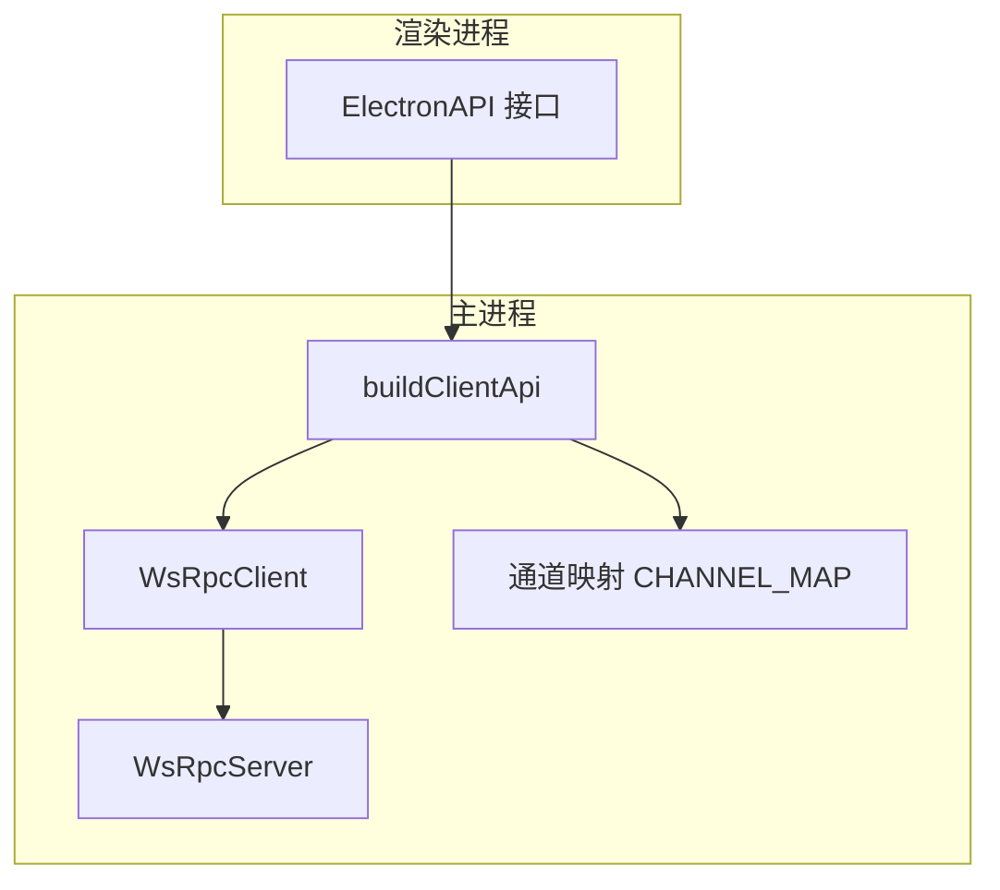
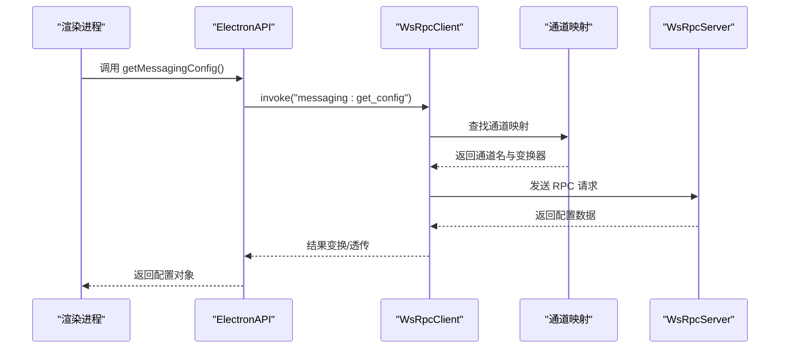
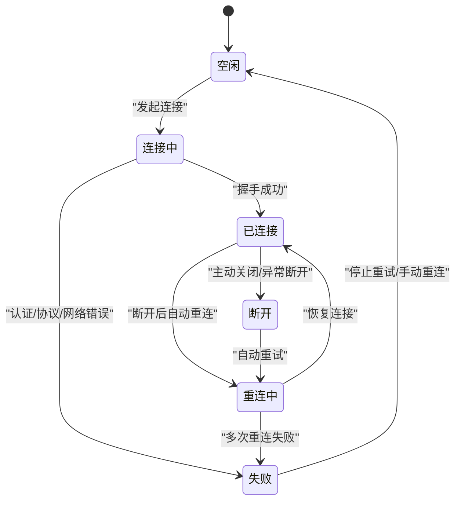
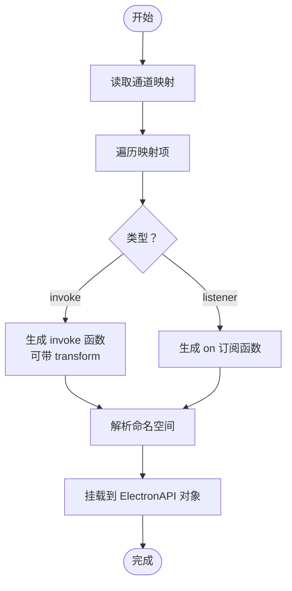
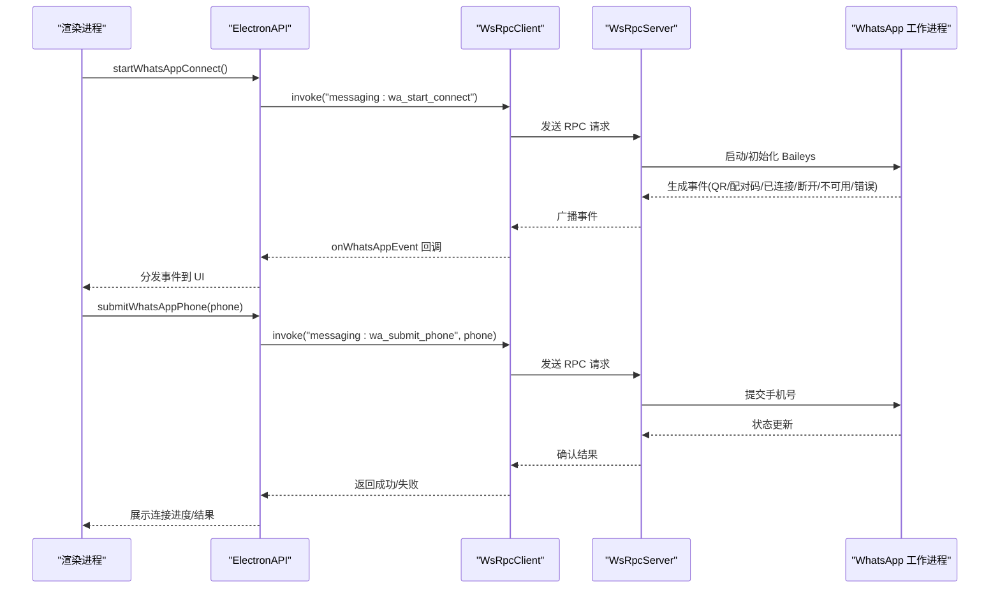
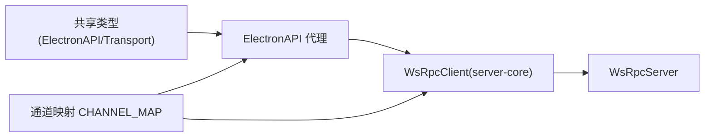

# 消息网关

<cite>
**本文引用的文件**
- [apps/electron/src/transport/index.ts](file://apps/electron/src/transport/index.ts)
- [apps/electron/src/transport/server.ts](file://apps/electron/src/transport/server.ts)
- [apps/electron/src/transport/client.ts](file://apps/electron/src/transport/client.ts)
- [apps/electron/src/transport/build-api.ts](file://apps/electron/src/transport/build-api.ts)
- [apps/electron/src/transport/channel-map.ts](file://apps/electron/src/transport/channel-map.ts)
- [apps/electron/src/shared/types.ts](file://apps/electron/src/shared/types.ts)
</cite>

## 目录
1. [简介](#简介)
2. [项目结构](#项目结构)
3. [核心组件](#核心组件)
4. [架构总览](#架构总览)
5. [组件详解](#组件详解)
6. [依赖关系分析](#依赖关系分析)
7. [性能与优化](#性能与优化)
8. [故障排查指南](#故障排查指南)
9. [结论](#结论)
10. [附录](#附录)

## 简介
本文件为“消息网关系统”的技术文档，面向消息服务开发与运维人员。内容覆盖消息路由机制、事件分发策略、连接池管理；重点阐述 WhatsApp 工作进程的启动与管理、消息队列处理与重连机制；解释消息网关的配置选项、性能优化与故障转移；并提供多平台消息服务的统一接口、消息持久化与状态同步方案，以及监控指标、日志记录与调试方法。

## 项目结构
消息网关在应用层通过 Electron 主进程与渲染进程之间的 IPC 通道实现，核心由以下模块组成：
- 传输层（WsRpcServer/WsRpcClient）：负责 RPC 调用与事件分发，支持本地/远程模式与断线重连。
- 客户端 API 构建器（buildClientApi）：基于通道映射生成类型安全的客户端代理，屏蔽底层 IPC 细节。
- 通道映射（CHANNEL_MAP）：定义所有可用的 RPC 方法与监听器，涵盖会话、工作区、文件、设置、自动更新、通知、浏览器窗格、LLM 连接、自动化、资源导出导入、以及消息网关相关能力。
- 共享类型（ElectronAPI 与 Transport 类型）：统一定义消息网关的配置、绑定、运行时状态、访问控制等类型，并暴露到渲染层。

图表来源
- [apps/electron/src/transport/build-api.ts:25-65](file://apps/electron/src/transport/build-api.ts#L25-L65)
- [apps/electron/src/transport/channel-map.ts:19-420](file://apps/electron/src/transport/channel-map.ts#L19-L420)
- [apps/electron/src/transport/client.ts:8-17](file://apps/electron/src/transport/client.ts#L8-L17)
- [apps/electron/src/transport/server.ts:1-1](file://apps/electron/src/transport/server.ts#L1-L1)

章节来源
- [apps/electron/src/transport/index.ts:1-6](file://apps/electron/src/transport/index.ts#L1-L6)
- [apps/electron/src/transport/server.ts:1-1](file://apps/electron/src/transport/server.ts#L1-L1)
- [apps/electron/src/transport/client.ts:1-18](file://apps/electron/src/transport/client.ts#L1-L18)
- [apps/electron/src/transport/build-api.ts:1-66](file://apps/electron/src/transport/build-api.ts#L1-L66)
- [apps/electron/src/transport/channel-map.ts:1-421](file://apps/electron/src/transport/channel-map.ts#L1-L421)
- [apps/electron/src/shared/types.ts:172-756](file://apps/electron/src/shared/types.ts#L172-L756)

## 核心组件
- 传输层
  - WsRpcServer：提供 RPC 服务端能力，承载消息网关的业务处理器。
  - WsRpcClient：提供 RPC 客户端能力，封装调用与事件订阅。
- 客户端 API 构建器
  - 将通道映射转换为可调用的 ElectronAPI 对象，支持嵌套命名空间与结果变换。
- 通道映射
  - 定义 RPC 方法（invoke）与监听器（listener），覆盖消息网关的配置、测试、保存、绑定、解绑、状态变更与事件广播等。
- 共享类型
  - 定义 Transport 连接状态、错误类型、消息网关配置结构、运行时信息、访问控制模式与待处理发送者等。

章节来源
- [apps/electron/src/transport/server.ts:1-1](file://apps/electron/src/transport/server.ts#L1-L1)
- [apps/electron/src/transport/client.ts:8-17](file://apps/electron/src/transport/client.ts#L8-L17)
- [apps/electron/src/transport/build-api.ts:15-65](file://apps/electron/src/transport/build-api.ts#L15-L65)
- [apps/electron/src/transport/channel-map.ts:19-420](file://apps/electron/src/transport/channel-map.ts#L19-L420)
- [apps/electron/src/shared/types.ts:130-169](file://apps/electron/src/shared/types.ts#L130-L169)
- [apps/electron/src/shared/types.ts:661-704](file://apps/electron/src/shared/types.ts#L661-L704)

## 架构总览
消息网关采用“主进程承载服务 + 渲染进程通过 IPC 访问”的架构。渲染侧通过 buildClientApi 生成的 ElectronAPI 代理调用主进程的 WsRpcServer，主进程根据 CHANNEL_MAP 将请求路由到对应处理器。事件通过监听器通道回推到渲染侧，形成双向通信闭环。

图表来源
- [apps/electron/src/transport/build-api.ts:25-65](file://apps/electron/src/transport/build-api.ts#L25-L65)
- [apps/electron/src/transport/channel-map.ts:388-408](file://apps/electron/src/transport/channel-map.ts#L388-L408)
- [apps/electron/src/transport/client.ts:8-17](file://apps/electron/src/transport/client.ts#L8-L17)
- [apps/electron/src/transport/server.ts:1-1](file://apps/electron/src/transport/server.ts#L1-L1)

## 组件详解

### 传输层与连接管理
- 连接状态模型
  - 支持 idle/connecting/connected/reconnecting/disconnected/failed 等状态。
  - 提供错误类别（认证、协议、超时、网络、服务器、未知）与关闭信息。
- 重连机制
  - 通过 onReconnected 回调通知 UI 重连完成；当缓冲区被逐出时返回 isStale=true，提示全量刷新。
- 传输模式
  - local/remote 两种模式，用于区分本地或远端服务器。

图表来源
- [apps/electron/src/shared/types.ts:132-169](file://apps/electron/src/shared/types.ts#L132-L169)

章节来源
- [apps/electron/src/shared/types.ts:130-169](file://apps/electron/src/shared/types.ts#L130-L169)
- [apps/electron/src/transport/client.ts:8-17](file://apps/electron/src/transport/client.ts#L8-L17)

### 客户端 API 构建器与路由
- 功能
  - 基于通道映射动态构建 ElectronAPI，支持点式命名空间（如 browserPane.create）与监听器注册。
  - 可选的结果变换器 transform，用于对 invoke 结果进行预处理。
- 路由机制
  - invoke 类条目通过 client.invoke 调用指定通道；listener 类条目通过 client.on 订阅事件。
  - 通过 isChannelAvailable 检查通道可用性，便于 UI 做功能降级。

图表来源
- [apps/electron/src/transport/build-api.ts:25-65](file://apps/electron/src/transport/build-api.ts#L25-L65)

章节来源
- [apps/electron/src/transport/build-api.ts:15-65](file://apps/electron/src/transport/build-api.ts#L15-L65)

### 通道映射与消息网关能力
- 通道映射覆盖范围
  - 会话管理：获取会话、发送消息、取消处理、导出/导入会话等。
  - 工作区与远程：工作区 CRUD、远程连接测试、跨工作区资源导出导入。
  - 文件与预览：文件读取、二进制读取、缩略图生成、文件搜索。
  - 设置与偏好：LLM 连接、网络代理、主题、输入设置、通知等。
  - 自动化与技能：自动化列表、测试、启用/禁用、复制、删除、历史与回放。
  - 浏览器窗格：创建/销毁/导航/前进/后退/重载/停止/聚焦等。
  - LLM 连接：列出、保存、测试、设置默认连接等。
  - 消息网关：获取配置、更新配置、测试/保存 Telegram/Lark、断开/忘记平台、获取绑定、生成配对码、超级群组配对、解绑会话/绑定、监听绑定与平台状态变化、WhatsApp 启动与事件回调、访问控制（拥有者、待处理发送者、绑定访问模式）。
- 通道示例
  - 获取消息网关配置：messaging:get_config
  - 更新配置：messaging:update_config
  - 测试 Telegram Token：messaging:test_telegram
  - 保存 Telegram Token：messaging:save_telegram
  - 测试 Lark 凭据：messaging:test_lark
  - 保存 Lark 凭据：messaging:save_lark
  - 断开平台：messaging:disconnect
  - 忘记平台：messaging:forget
  - 获取绑定：messaging:get_bindings
  - 生成配对码：messaging:generate_code
  - 生成超级群组配对码：messaging:generate_supergroup_code
  - 获取超级群组：messaging:get_supergroup
  - 解绑超级群组：messaging:unbind_supergroup
  - 解绑会话：messaging:unbind
  - 解绑绑定：messaging:unbind_binding
  - 监听绑定变化：messaging:binding_changed
  - 监听平台状态：messaging:platform_status
  - 启动 WhatsApp 连接：messaging:wa_start_connect
  - 提交 WhatsApp 手机号：messaging:wa_submit_phone
  - 监听 WhatsApp 事件：messaging:wa_ui_event
  - 访问控制：获取/设置平台拥有者、获取/设置平台访问模式、获取待处理发送者、忽略/允许发送者、设置绑定访问模式、监听待处理变化。

章节来源
- [apps/electron/src/transport/channel-map.ts:388-420](file://apps/electron/src/transport/channel-map.ts#L388-L420)
- [apps/electron/src/shared/types.ts:661-704](file://apps/electron/src/shared/types.ts#L661-L704)

### WhatsApp 工作进程：启动与管理
- 启动流程
  - 渲染侧调用 startWhatsAppConnect 触发工作进程启动。
  - 工作进程内部通过 Baileys 实现 WhatsApp 连接，产生二维码或配对码事件。
  - 通过 onWhatsAppEvent 将事件回推到 UI，支持 QR、配对码、已连接、断开、不可用、错误等事件类型。
- 手机号提交
  - 通过 submitWhatsAppPhone 提交手机号以完成配对流程。
- UI 事件
  - 事件类型包括二维码、配对码、已连接（jid/名称）、断开（含登出标记与原因）、不可用（原因与消息）、错误（消息）。

图表来源
- [apps/electron/src/transport/channel-map.ts:406-408](file://apps/electron/src/transport/channel-map.ts#L406-L408)
- [apps/electron/src/shared/types.ts:686-756](file://apps/electron/src/shared/types.ts#L686-L756)

章节来源
- [apps/electron/src/transport/channel-map.ts:406-408](file://apps/electron/src/transport/channel-map.ts#L406-L408)
- [apps/electron/src/shared/types.ts:686-756](file://apps/electron/src/shared/types.ts#L686-L756)

### 事件分发策略与消息队列
- 事件分发
  - listener 类通道通过 client.on 订阅，主进程在事件发生时推送至渲染侧。
  - onMessagingBindingChanged/onMessagingPlatformStatus/onWhatsAppEvent 等用于实时反馈状态变化。
- 消息队列处理
  - 通过 SESSION 通道族（如 SEND_MESSAGE、GET_MESSAGES、CANCEL 等）实现消息的入队、处理与结果回传。
  - 取消处理与 Shell 杀死能力用于中断长耗时任务，保障队列健康。
- 重连与一致性
  - onReconnected 回调携带 isStale 标识，UI 在缓冲区被逐出时触发全量刷新，确保状态一致。

章节来源
- [apps/electron/src/transport/channel-map.ts:20-46](file://apps/electron/src/transport/channel-map.ts#L20-L46)
- [apps/electron/src/shared/types.ts:338-347](file://apps/electron/src/shared/types.ts#L338-L347)

### 配置选项与访问控制
- 配置结构
  - enabled：是否启用消息网关
  - platforms：按平台维度的启用、访问模式、拥有者等
  - runtime：按平台维度的配置状态、连接状态、身份、最后错误、更新时间等
- 访问控制
  - 平台级：open（开放）/ owner-only（仅拥有者）
  - 绑定级：inherit（继承）/ allow-list（白名单）/ open（开放）
  - 待处理发送者：记录用户 ID、显示名、用户名、最近尝试时间、尝试次数、拒绝原因、绑定 ID、会话 ID、频道/主题 ID；支持忽略与允许操作。

章节来源
- [apps/electron/src/shared/types.ts:661-704](file://apps/electron/src/shared/types.ts#L661-L704)
- [apps/electron/src/shared/types.ts:716-746](file://apps/electron/src/shared/types.ts#L716-L746)

### 多平台统一接口与持久化
- 统一接口
  - 通过 CHANNEL_MAP 将不同平台（Telegram、Lark、WhatsApp 等）的操作统一到一组 RPC 方法，屏蔽平台差异。
- 持久化
  - 绑定信息（会话 ID、平台、频道/主题、启用状态、创建时间、访问模式、允许发送者列表）持久化存储于磁盘，支持解绑与迁移。
- 状态同步
  - 平台运行时信息（configured/connected/state/identity/lastError/updatedAt）与绑定变更事件用于 UI 与服务端状态同步。

章节来源
- [apps/electron/src/transport/channel-map.ts:388-420](file://apps/electron/src/transport/channel-map.ts#L388-L420)
- [apps/electron/src/shared/types.ts:706-714](file://apps/electron/src/shared/types.ts#L706-L714)

## 依赖关系分析
- 组件耦合
  - buildClientApi 依赖 CHANNEL_MAP 与 RpcClient，提供类型安全的 API 代理。
  - WsRpcClient 从 server-core 导出，避免与 Electron 应用层直接耦合。
  - ElectronAPI 作为渲染侧唯一入口，集中暴露所有能力。
- 外部依赖
  - 传输层依赖 server-core 的 transport 抽象，保证可复用性与可替换性。
- 潜在环路
  - 当前结构为单向依赖（渲染侧 -> 主进程），无循环依赖迹象。

图表来源
- [apps/electron/src/transport/build-api.ts:25-65](file://apps/electron/src/transport/build-api.ts#L25-L65)
- [apps/electron/src/transport/channel-map.ts:19-420](file://apps/electron/src/transport/channel-map.ts#L19-L420)
- [apps/electron/src/transport/client.ts:8-17](file://apps/electron/src/transport/client.ts#L8-L17)
- [apps/electron/src/shared/types.ts:172-756](file://apps/electron/src/shared/types.ts#L172-L756)

章节来源
- [apps/electron/src/transport/index.ts:1-6](file://apps/electron/src/transport/index.ts#L1-L6)
- [apps/electron/src/transport/client.ts:8-17](file://apps/electron/src/transport/client.ts#L8-L17)
- [apps/electron/src/transport/build-api.ts:25-65](file://apps/electron/src/transport/build-api.ts#L25-L65)
- [apps/electron/src/transport/channel-map.ts:19-420](file://apps/electron/src/transport/channel-map.ts#L19-L420)
- [apps/electron/src/shared/types.ts:172-756](file://apps/electron/src/shared/types.ts#L172-L756)

## 性能与优化
- 连接池与并发
  - 使用 WsRpcClient 的并发调用能力，结合 invoke/on 的分离，避免阻塞 UI。
- 缓冲与重放
  - onReconnected 的 isStale 标识用于触发全量刷新，减少局部缓存不一致带来的重复计算。
- 事件去抖与批处理
  - 对高频事件（如 unread summary、绑定变化、平台状态）建议在 UI 层做去抖与批量更新，降低渲染压力。
- 日志与可观测性
  - 使用 debugLog 将渲染侧日志转发到主进程日志文件，便于定位问题。
- 网络与代理
  - 通过网络代理设置与连接测试，提升跨环境稳定性。

## 故障排查指南
- 连接问题
  - 检查 TransportConnectionState 中的 status、lastError、lastClose 与 nextRetryInMs。
  - 若出现认证/协议/网络错误，依据错误类别采取相应措施（重试/检查凭据/切换代理）。
- 重连后数据不一致
  - 监听 onReconnected，当 isStale=true 时执行全量刷新。
- WhatsApp 连接异常
  - 关注 onWhatsAppEvent 的 disconnected/unavailable/error 事件，结合日志定位原因。
- 平台访问控制
  - 通过 getMessagingPendingSenders 与 onMessagingPendingChanged 监控待处理发送者，使用 dismiss/allow 操作维护白名单。

章节来源
- [apps/electron/src/shared/types.ts:130-169](file://apps/electron/src/shared/types.ts#L130-L169)
- [apps/electron/src/shared/types.ts:338-347](file://apps/electron/src/shared/types.ts#L338-L347)
- [apps/electron/src/shared/types.ts:686-756](file://apps/electron/src/shared/types.ts#L686-L756)
- [apps/electron/src/shared/types.ts:690-703](file://apps/electron/src/shared/types.ts#L690-L703)

## 结论
消息网关通过统一的传输层与通道映射，实现了多平台消息服务的统一接入与管理。借助 Electron 的 IPC 机制，渲染侧以类型安全的方式访问主进程能力，同时具备完善的事件分发、重连与状态同步机制。WhatsApp 工作进程的启动、配对与事件回推流程清晰，配合访问控制与持久化绑定，满足企业级部署与运维需求。

## 附录
- 监控指标建议
  - 连接状态计数（connected/disconnected/reconnecting）
  - 事件广播延迟与丢弃率
  - RPC 调用成功率与 P95/P99 延迟
  - 重连次数与平均恢复时间
  - 平台接入失败率与失败原因分布
- 日志记录
  - 使用 debugLog 将关键路径日志上报至主进程日志文件，保留时间戳、工作区 ID、会话 ID、通道名与错误堆栈。
- 调试方法
  - 开启调试模式，观察 onTransportConnectionStateChanged 与 onReconnected 的状态流转。
  - 对高频通道（如绑定变化、平台状态）增加本地缓存与增量更新策略，减少 UI 重绘。