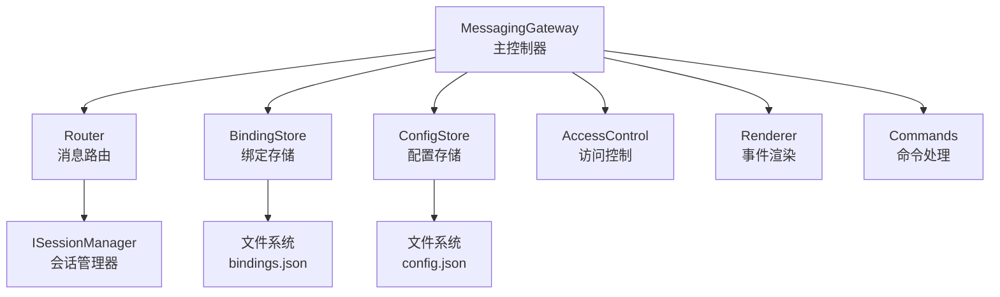
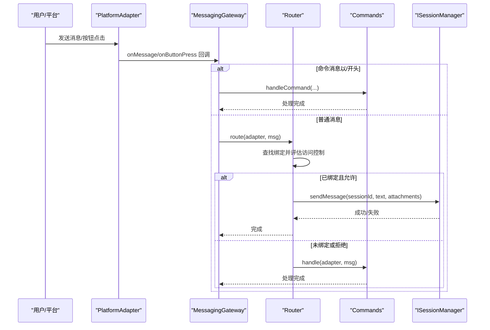
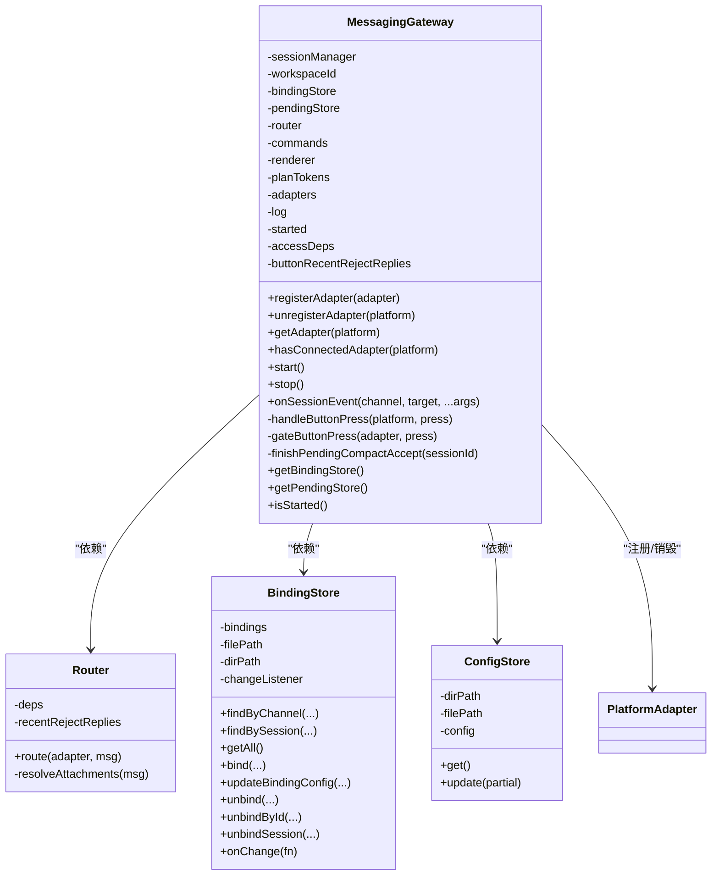
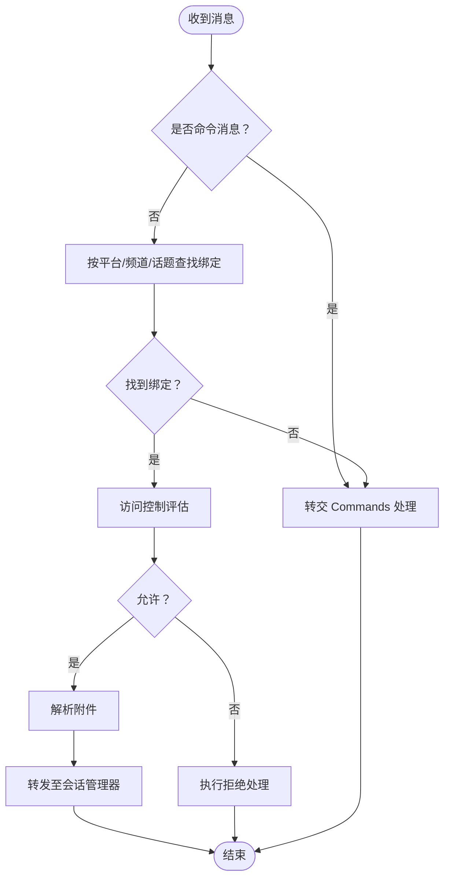
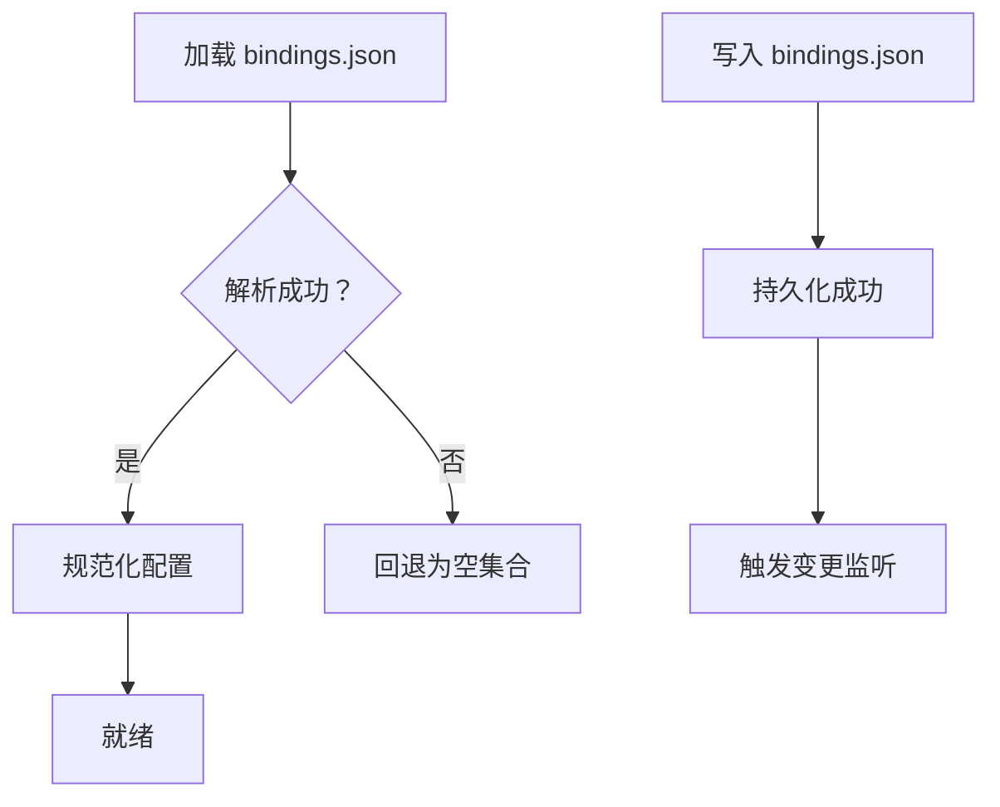
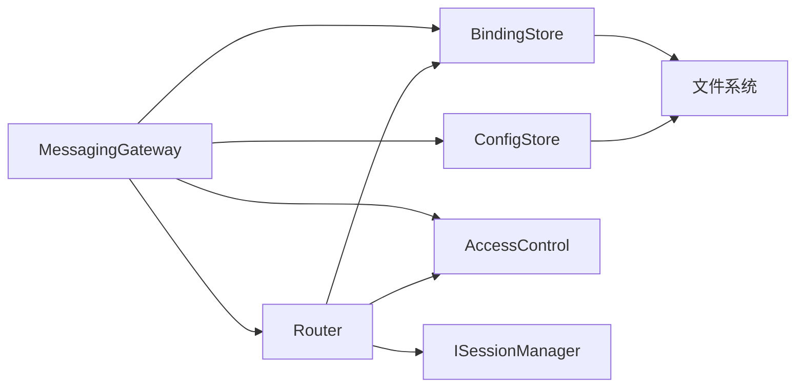

# 消息网关核心

<cite>
**本文引用的文件**
- [gateway.ts](file://packages/messaging-gateway/src/gateway.ts)
- [router.ts](file://packages/messaging-gateway/src/router.ts)
- [binding-store.ts](file://packages/messaging-gateway/src/binding-store.ts)
- [config-store.ts](file://packages/messaging-gateway/src/config-store.ts)
- [types.ts](file://packages/messaging-gateway/src/types.ts)
- [access-control.ts](file://packages/messaging-gateway/src/access-control.ts)
- [channels.ts](file://packages/shared/src/protocol/channels.ts)
- [routing.ts](file://packages/shared/src/protocol/routing.ts)
</cite>

## 目录
1. [简介](#简介)
2. [项目结构](#项目结构)
3. [核心组件](#核心组件)
4. [架构总览](#架构总览)
5. [详细组件分析](#详细组件分析)
6. [依赖分析](#依赖分析)
7. [性能考虑](#性能考虑)
8. [故障排查指南](#故障排查指南)
9. [结论](#结论)
10. [附录：使用示例与最佳实践](#附录使用示例与最佳实践)

## 简介
本文件系统性梳理消息网关核心组件的设计与实现，围绕以下目标展开：
- MessagingGateway 类的架构设计、初始化流程与配置管理
- Router 路由器的工作原理、消息分发机制与优先级处理
- BindingStore 绑定存储的实现、绑定关系管理与状态同步
- ConfigStore 配置存储的功能、配置验证与动态更新
- 核心接口定义、错误处理策略与性能优化方案
- 提供可操作的使用示例与最佳实践

## 项目结构
消息网关核心位于 packages/messaging-gateway 包内，主要文件包括：
- gateway.ts：网关主控制器，编排适配器、路由器、渲染器、绑定存储等
- router.ts：路由模块，负责将入站消息按绑定与访问控制规则分发到会话
- binding-store.ts：绑定存储，持久化平台通道与会话的绑定关系
- config-store.ts：配置存储，持久化工作区级消息配置（启用开关、平台策略、所有者列表等）
- types.ts：核心类型定义（平台类型、消息结构、适配器接口、绑定配置、访问策略等）
- access-control.ts：访问控制评估与拒绝处理
- channels.ts 与 routing.ts：RPC 通道与路由分类（用于 UI/服务端交互）

图表来源
- [gateway.ts:129-232](file://packages/messaging-gateway/src/gateway.ts#L129-L232)
- [router.ts:46-58](file://packages/messaging-gateway/src/router.ts#L46-L58)
- [binding-store.ts:31-49](file://packages/messaging-gateway/src/binding-store.ts#L31-L49)
- [config-store.ts:25-37](file://packages/messaging-gateway/src/config-store.ts#L25-L37)

章节来源
- [gateway.ts:129-232](file://packages/messaging-gateway/src/gateway.ts#L129-L232)
- [router.ts:46-58](file://packages/messaging-gateway/src/router.ts#L46-L58)
- [binding-store.ts:31-49](file://packages/messaging-gateway/src/binding-store.ts#L31-L49)
- [config-store.ts:25-37](file://packages/messaging-gateway/src/config-store.ts#L25-L37)

## 核心组件
- MessagingGateway：单实例网关，负责注册适配器、启动/停止生命周期、接入按钮回调、会话事件广播与渲染、访问控制门禁、计划执行与紧凑执行等
- Router：根据绑定表与访问控制决策，将消息转发给会话管理器；若无绑定则转交命令处理器
- BindingStore：绑定持久化与查询，支持按通道/会话/绑定ID查询与变更，迁移旧路径、保存后触发变更监听
- ConfigStore：工作区级消息配置持久化，支持增量更新与默认值合并
- 访问控制：统一的预绑定与绑定后访问评估，拒绝时统一走拒绝处理逻辑（含“待批准发送者”记录）
- 渲染器：将会话事件转换为平台消息（如权限提示、计划按钮、紧凑执行结果等）

章节来源
- [gateway.ts:129-232](file://packages/messaging-gateway/src/gateway.ts#L129-L232)
- [router.ts:46-58](file://packages/messaging-gateway/src/router.ts#L46-L58)
- [binding-store.ts:31-49](file://packages/messaging-gateway/src/binding-store.ts#L31-L49)
- [config-store.ts:25-37](file://packages/messaging-gateway/src/config-store.ts#L25-L37)
- [access-control.ts](file://packages/messaging-gateway/src/access-control.ts)

## 架构总览
消息网关在进程内与会话管理器协同运行，桥接多个平台适配器（Telegram/WhatsApp/Lark），通过绑定表将平台通道映射到会话，并基于访问控制策略进行准入与拒绝。

图表来源
- [gateway.ts:318-336](file://packages/messaging-gateway/src/gateway.ts#L318-L336)
- [router.ts:60-126](file://packages/messaging-gateway/src/router.ts#L60-L126)
- [access-control.ts](file://packages/messaging-gateway/src/access-control.ts)

## 详细组件分析

### MessagingGateway 类
职责与设计要点：
- 组合与编排：持有并组合 BindingStore、Router、Commands、Renderer、PendingSendersStore、PlanTokenRegistry、PlatformAdapter 等
- 生命周期：start/stop 控制适配器连接与销毁；注册适配器时自动连线消息与按钮事件
- 访问控制：通过 AccessControlDeps 注入工作区配置与待批准发送者存储，独立维护按钮点击的拒绝冷却
- 会话事件：接收会话事件，按绑定筛选对应适配器并渲染（含清理过期权限提示）
- 按钮处理：对 bind:/perm:/plan: 三类按钮进行门禁校验、权限路由、计划接受/紧凑执行
- 适配器替换：支持替换已注册适配器并在运行时重新连线

图表来源
- [gateway.ts:129-232](file://packages/messaging-gateway/src/gateway.ts#L129-L232)
- [router.ts:46-58](file://packages/messaging-gateway/src/router.ts#L46-L58)
- [binding-store.ts:31-49](file://packages/messaging-gateway/src/binding-store.ts#L31-L49)
- [config-store.ts:25-37](file://packages/messaging-gateway/src/config-store.ts#L25-L37)

章节来源
- [gateway.ts:156-232](file://packages/messaging-gateway/src/gateway.ts#L156-L232)
- [gateway.ts:318-336](file://packages/messaging-gateway/src/gateway.ts#L318-L336)
- [gateway.ts:433-738](file://packages/messaging-gateway/src/gateway.ts#L433-L738)
- [gateway.ts:761-796](file://packages/messaging-gateway/src/gateway.ts#L761-L796)
- [gateway.ts:802-814](file://packages/messaging-gateway/src/gateway.ts#L802-L814)

### Router 路由器
工作原理与消息分发机制：
- 绑定查找：按 (platform, channelId, threadId) 查找活动绑定；Telegram 超级群话题需区分 threadId
- 访问控制：对已绑定场景调用访问控制评估，拒绝时统一走拒绝处理（含“最近拒绝回复”冷却）
- 附件处理：将本地路径附件转换为会话可用的文件附件，异常静默跳过
- 分发策略：命中绑定则转发至会话管理器；未命中则转交命令处理器

优先级与决策流程：
- 命令消息优先：以“/”开头的消息先交由命令处理器
- 绑定优先：存在绑定且允许时直接路由
- 否则进入命令处理

图表来源
- [router.ts:60-126](file://packages/messaging-gateway/src/router.ts#L60-L126)
- [router.ts:133-150](file://packages/messaging-gateway/src/router.ts#L133-L150)

章节来源
- [router.ts:60-126](file://packages/messaging-gateway/src/router.ts#L60-L126)
- [router.ts:133-150](file://packages/messaging-gateway/src/router.ts#L133-L150)

### BindingStore 绑定存储
功能与实现要点：
- 存储位置：在指定存储目录下以 bindings.json 持久化
- 查询能力：按通道/会话/绑定ID查询；支持按 threadId 区分 Telegram 超级群话题
- 变更操作：bind（覆盖式插入）、updateBindingConfig（原地更新配置）、unbind/unbindById/unbindSession
- 迁移与容错：支持从旧路径一次性迁移；加载/保存失败时记录日志并回退为空集合
- 状态同步：保存成功后触发变更监听，确保 UI 等外部订阅方及时感知

图表来源
- [binding-store.ts:245-281](file://packages/messaging-gateway/src/binding-store.ts#L245-L281)

章节来源
- [binding-store.ts:68-84](file://packages/messaging-gateway/src/binding-store.ts#L68-L84)
- [binding-store.ts:90-132](file://packages/messaging-gateway/src/binding-store.ts#L90-L132)
- [binding-store.ts:145-160](file://packages/messaging-gateway/src/binding-store.ts#L145-L160)
- [binding-store.ts:162-214](file://packages/messaging-gateway/src/binding-store.ts#L162-L214)
- [binding-store.ts:220-243](file://packages/messaging-gateway/src/binding-store.ts#L220-L243)
- [binding-store.ts:245-281](file://packages/messaging-gateway/src/binding-store.ts#L245-L281)

### ConfigStore 配置存储
功能与实现要点：
- 存储位置：在指定存储目录下以 config.json 持久化
- 默认值：采用 DEFAULT_MESSAGING_CONFIG 合并部分字段
- 更新策略：update 支持增量更新，返回新配置快照
- 迁移与容错：支持从旧路径一次性迁移；加载失败回退默认配置

章节来源
- [config-store.ts:39-54](file://packages/messaging-gateway/src/config-store.ts#L39-L54)
- [config-store.ts:79-97](file://packages/messaging-gateway/src/config-store.ts#L79-L97)
- [config-store.ts:99-110](file://packages/messaging-gateway/src/config-store.ts#L99-L110)

### 访问控制与拒绝处理
- 预绑定门禁：针对 /bind 等预绑定命令，评估工作区级策略（如仅所有者）
- 绑定后门禁：针对已绑定通道，评估绑定级策略（继承/白名单/开放）与发送者身份
- 拒绝处理：统一调用 executeRejection，记录“待批准发送者”，并按策略回复友好提示
- 冷却与去重：按钮点击与文本输入分别维护拒绝冷却，避免重复打扰

章节来源
- [access-control.ts](file://packages/messaging-gateway/src/access-control.ts)
- [gateway.ts:672-738](file://packages/messaging-gateway/src/gateway.ts#L672-L738)
- [router.ts:133-150](file://packages/messaging-gateway/src/router.ts#L133-L150)

### 核心接口定义
- 平台类型：telegram、whatsapp、lark
- 消息结构：IncomingMessage、IncomingAttachment、ButtonPress、SentMessage
- 适配器接口：PlatformAdapter（初始化/销毁、消息/按钮回调、发送文本/按钮/文件、可选清空键盘、运行时接受列表、论坛话题创建、Webhook）
- 绑定配置：BindingConfig（响应模式、工具活动显示、审批渠道、编辑间隔、访问模式、允许发送者列表）
- 工作区配置：MessagingConfig（启用开关、平台级策略、所有者列表、超级群配置等）

章节来源
- [types.ts:12](file://packages/messaging-gateway/src/types.ts#L12)
- [types.ts:81-126](file://packages/messaging-gateway/src/types.ts#L81-L126)
- [types.ts:185-228](file://packages/messaging-gateway/src/types.ts#L185-L228)
- [types.ts:260-289](file://packages/messaging-gateway/src/types.ts#L260-L289)
- [types.ts:463-513](file://packages/messaging-gateway/src/types.ts#L463-L513)

## 依赖分析
- MessagingGateway 依赖 Router、BindingStore、ConfigStore、AccessControl、Renderer、Commands
- Router 依赖 BindingStore、AccessControl、SessionManager、文件附件读取工具
- BindingStore 与 ConfigStore 均依赖文件系统与默认配置常量
- 通道与路由分类由 shared 协议层提供（UI/服务端通信通道）

图表来源
- [gateway.ts:129-232](file://packages/messaging-gateway/src/gateway.ts#L129-L232)
- [router.ts:46-58](file://packages/messaging-gateway/src/router.ts#L46-L58)
- [binding-store.ts:31-49](file://packages/messaging-gateway/src/binding-store.ts#L31-L49)
- [config-store.ts:25-37](file://packages/messaging-gateway/src/config-store.ts#L25-L37)

章节来源
- [channels.ts:383-432](file://packages/shared/src/protocol/channels.ts#L383-L432)
- [routing.ts:430-454](file://packages/shared/src/protocol/routing.ts#L430-L454)

## 性能考虑
- 拒绝冷却：Router 与按钮点击分别维护拒绝冷却映射，降低重复打扰与抖动
- 附件处理：仅处理带本地路径的附件，失败静默跳过，避免阻塞主链路
- 事件清理：会话事件到达时清理过期权限提示，防止 Telegram 长时间残留按钮导致回调风暴
- 紧凑执行：计划紧凑执行采用 TTL 与延迟派发，避免长时间占用资源
- 日志最小化：未启用日志时使用空实现，减少开销

## 故障排查指南
常见问题与定位建议：
- 无法路由到会话：检查绑定是否存在且启用；确认访问控制策略是否允许该发送者
- 按钮点击无效：确认按钮前缀正确；检查适配器是否支持清空键盘；查看按钮门禁是否拒绝
- 配置不生效：确认 ConfigStore 的 getWorkspaceConfig 在每次调用时返回最新配置
- 附件未送达：确认适配器已下载附件并提供本地路径；检查附件读取工具是否成功编码
- 适配器连接异常：查看网关启动/停止流程与适配器 destroy 行为；确认 isConnected 状态

章节来源
- [router.ts:133-150](file://packages/messaging-gateway/src/router.ts#L133-L150)
- [gateway.ts:433-738](file://packages/messaging-gateway/src/gateway.ts#L433-L738)
- [config-store.ts:39-54](file://packages/messaging-gateway/src/config-store.ts#L39-L54)
- [binding-store.ts:245-281](file://packages/messaging-gateway/src/binding-store.ts#L245-L281)

## 结论
消息网关通过清晰的职责划分与强一致的持久化策略，实现了跨平台消息的可靠接入与治理。其核心在于：
- 明确的路由与访问控制边界
- 健壮的绑定与配置持久化
- 友好的按钮交互与会话事件渲染
- 可扩展的适配器模型与生命周期管理

## 附录：使用示例与最佳实践
- 初始化与启动
  - 创建网关实例并注入会话管理器、工作区ID、存储目录与可选回调
  - 注册平台适配器并调用 start，等待适配器连接
  - 关闭时调用 stop，确保适配器销毁与资源释放
- 绑定管理
  - 使用 BindingStore.bind 将平台通道绑定到会话；同一通道/话题仅保留一个活动绑定
  - 使用 updateBindingConfig 修改绑定配置（如访问模式、响应模式），避免重建绑定ID
  - 使用 unbind/unbindById/unbindSession 解绑绑定
- 配置管理
  - 使用 ConfigStore.update 增量更新工作区配置；get 返回当前快照
  - 通过 getWorkspaceConfig 注入到网关与路由，使配置变更即时生效
- 访问控制
  - 预绑定命令（如 /bind）使用预绑定门禁；已绑定通道使用绑定后门禁
  - 拒绝时统一记录“待批准发送者”，便于 UI 一键放行
- 按钮处理
  - bind:/perm:/plan: 三类按钮分别走不同处理路径；注意按钮门禁与键盘清理
  - 权限提示与计划按钮采用幂等记录与过期清理，避免重复操作与过期回调
- 最佳实践
  - 将 ConfigStore 的 getWorkspaceConfig 实现为轻量读取，避免阻塞
  - 对于高并发场景，合理设置拒绝冷却与编辑间隔，平衡用户体验与平台限制
  - 保持适配器能力声明与实际行为一致，避免功能不可用或误判