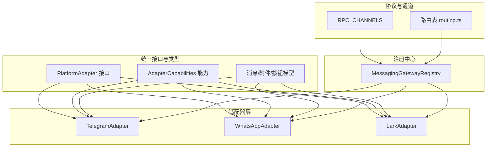
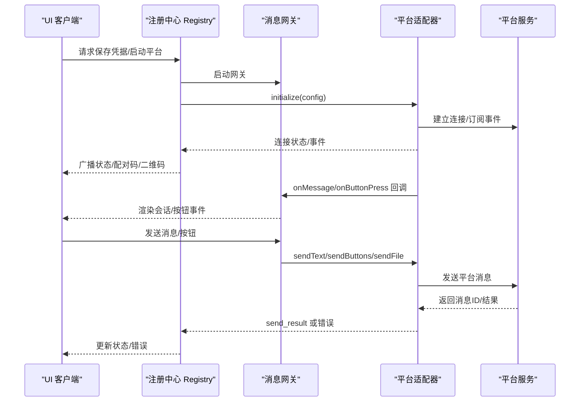
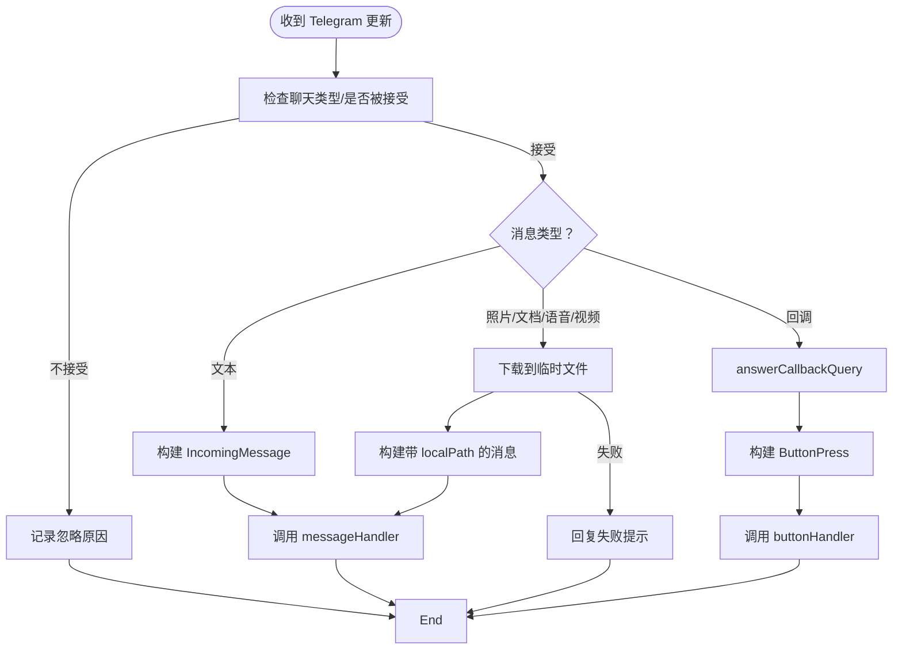
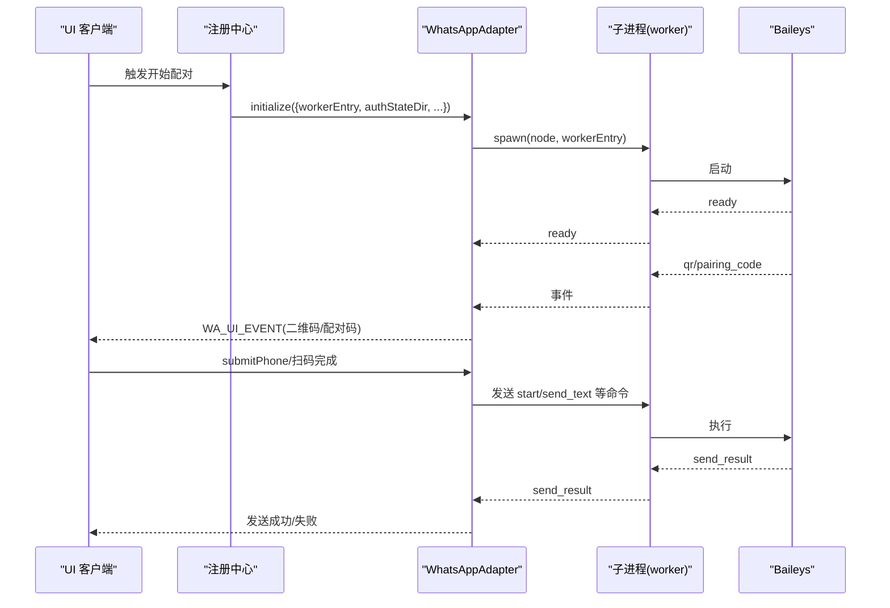
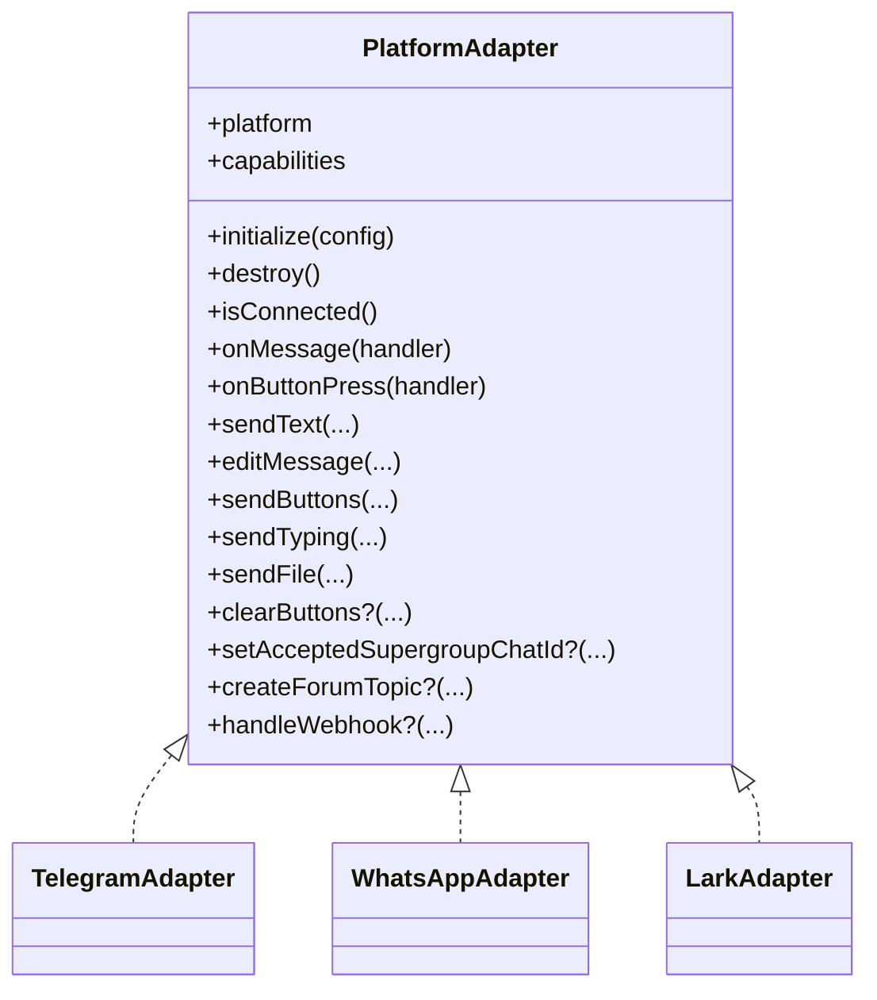
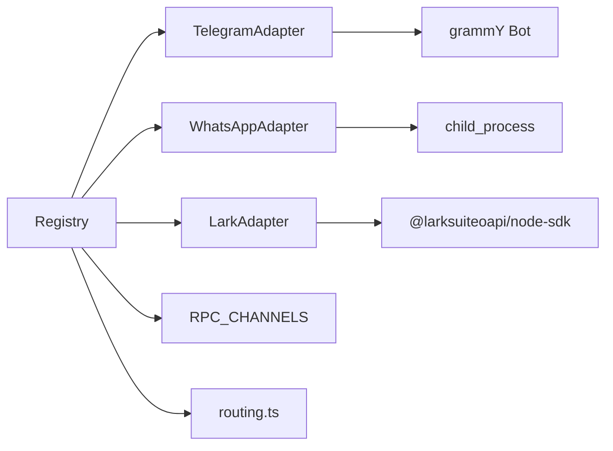

# 消息适配器

<cite>
**本文引用的文件**
- [packages/messaging-gateway/src/types.ts](file://packages/messaging-gateway/src/types.ts)
- [packages/messaging-gateway/src/adapters/telegram/index.ts](file://packages/messaging-gateway/src/adapters/telegram/index.ts)
- [packages/messaging-gateway/src/adapters/telegram/format.ts](file://packages/messaging-gateway/src/adapters/telegram/format.ts)
- [packages/messaging-gateway/src/adapters/whatsapp/index.ts](file://packages/messaging-gateway/src/adapters/whatsapp/index.ts)
- [packages/messaging-gateway/src/adapters/lark/index.ts](file://packages/messaging-gateway/src/adapters/lark/index.ts)
- [packages/messaging-gateway/src/registry.ts](file://packages/messaging-gateway/src/registry.ts)
- [packages/shared/src/protocol/channels.ts](file://packages/shared/src/protocol/channels.ts)
- [packages/shared/src/protocol/routing.ts](file://packages/shared/src/protocol/routing.ts)
- [scripts/build-wa-worker.ts](file://scripts/build-wa-worker.ts)
</cite>

## 目录
1. [简介](#简介)
2. [项目结构](#项目结构)
3. [核心组件](#核心组件)
4. [架构总览](#架构总览)
5. [详细组件分析](#详细组件分析)
6. [依赖关系分析](#依赖关系分析)
7. [性能考量](#性能考量)
8. [故障排查指南](#故障排查指南)
9. [结论](#结论)
10. [附录](#附录)

## 简介
本文件系统化阐述消息适配器体系：统一接口规范、平台抽象层、适配器注册与生命周期、能力声明与错误处理，并深入解析 TelegramAdapter、WhatsAppAdapter 的实现细节与差异。同时提供开发指南、测试方法与调试技巧，帮助开发者快速上手并稳定集成。

## 项目结构
消息适配器位于 messaging-gateway 包内，采用“平台适配器 + 统一类型 + 注册中心”的分层设计：
- 平台适配器：Telegram、WhatsApp（子进程）、Lark
- 统一类型与能力：PlatformAdapter 接口、AdapterCapabilities、消息/按钮模型
- 注册中心：负责工作区级生命周期、凭证管理、平台连接状态与事件广播
- 协议通道：RPC 通道常量与路由表，支撑 UI 与服务端交互

图表来源
- [packages/messaging-gateway/src/types.ts:185-228](file://packages/messaging-gateway/src/types.ts#L185-L228)
- [packages/messaging-gateway/src/adapters/telegram/index.ts:144-184](file://packages/messaging-gateway/src/adapters/telegram/index.ts#L144-L184)
- [packages/messaging-gateway/src/adapters/whatsapp/index.ts:112-134](file://packages/messaging-gateway/src/adapters/whatsapp/index.ts#L112-L134)
- [packages/messaging-gateway/src/adapters/lark/index.ts:196-219](file://packages/messaging-gateway/src/adapters/lark/index.ts#L196-L219)
- [packages/messaging-gateway/src/registry.ts:30-32](file://packages/messaging-gateway/src/registry.ts#L30-L32)
- [packages/shared/src/protocol/channels.ts:412-431](file://packages/shared/src/protocol/channels.ts#L412-L431)
- [packages/shared/src/protocol/routing.ts:430-454](file://packages/shared/src/protocol/routing.ts#L430-L454)

章节来源
- [packages/messaging-gateway/src/types.ts:12-228](file://packages/messaging-gateway/src/types.ts#L12-L228)
- [packages/messaging-gateway/src/registry.ts:1-120](file://packages/messaging-gateway/src/registry.ts#L1-L120)

## 核心组件
- 统一接口 PlatformAdapter：定义初始化、销毁、连接状态、消息/按钮回调注册、发送文本/编辑/按钮/文件等操作，以及可选能力（如清除按钮、运行时设置接受的超群组聊天 ID、创建论坛主题）。
- 能力声明 AdapterCapabilities：统一描述各平台的消息编辑、内联按钮、最大按钮数、最大消息长度、Markdown 支持与 webhook 支持。
- 类型与模型：IncomingMessage、IncomingAttachment、SentMessage、InlineButton、ButtonPress、SendOptions 等，确保跨平台一致性。
- 注册中心 MessagingGatewayRegistry：负责工作区生命周期、平台连接状态、凭证存储、配对码管理、绑定与自动化话题绑定、UI 事件广播。

章节来源
- [packages/messaging-gateway/src/types.ts:68-228](file://packages/messaging-gateway/src/types.ts#L68-L228)
- [packages/messaging-gateway/src/registry.ts:94-119](file://packages/messaging-gateway/src/registry.ts#L94-L119)

## 架构总览
适配器通过注册中心进行统一编排：
- 初始化：根据配置选择平台，构造适配器实例，建立事件监听与发送通道
- 运行期：接收平台事件，转换为统一消息模型，投递到网关；对外发送时按平台能力格式化
- 生命周期：支持断线重连、优雅关闭、销毁清理
- UI 通道：通过 RPC_CHANNELS 与 UI 通信，推送状态、二维码、配对码等事件

图表来源
- [packages/messaging-gateway/src/registry.ts:125-200](file://packages/messaging-gateway/src/registry.ts#L125-L200)
- [packages/messaging-gateway/src/types.ts:185-228](file://packages/messaging-gateway/src/types.ts#L185-L228)
- [packages/shared/src/protocol/channels.ts:412-431](file://packages/shared/src/protocol/channels.ts#L412-L431)

## 详细组件分析

### TelegramAdapter 实现详解
- 设计目标：基于 grammY 的轮询模式，支持文本、图片、文档、语音、视频等附件，内联按钮与回调，Markdown 格式化，超群组配对与论坛主题创建。
- 关键特性
  - 聊天过滤：仅接受私聊或已配对的超群组聊天；/pair 命令在未配对前允许从任意聊天触发，避免“先有鸡还是先有蛋”问题
  - 附件下载：先做大小校验，再通过 Bot API 下载至临时目录，统一通过 localPath 传递给路由器
  - 超时与错误：对 bot.init/deleteWebhook 使用 withTimeout 包装，结构化日志 describeError，便于定位网络/令牌问题
  - 轮询与重连：startPolling + 指数退避重连，区分 409 冲突与其他错误
  - Markdown：当前 Phase 1 以纯文本发送，保留 V2 转义函数以便后续启用
  - 超群组配对：getChatInfo 校验是否为论坛型超群组；setAcceptedSupergroupChatId 运行时更新接受范围
  - 论坛主题：createForumTopic 用于自动化场景按会话创建独立话题
- 处理流程（消息/附件/按钮）
  - 文本消息：解析上下文，构造 IncomingMessage，调用 messageHandler
  - 附件：emitAttachmentMessage → downloadToTemp → 本地路径回传 → messageHandler
  - 回调：answerCallbackQuery → 构造 ButtonPress → buttonHandler

图表来源
- [packages/messaging-gateway/src/adapters/telegram/index.ts:268-432](file://packages/messaging-gateway/src/adapters/telegram/index.ts#L268-L432)
- [packages/messaging-gateway/src/adapters/telegram/index.ts:482-548](file://packages/messaging-gateway/src/adapters/telegram/index.ts#L482-L548)
- [packages/messaging-gateway/src/adapters/telegram/index.ts:556-600](file://packages/messaging-gateway/src/adapters/telegram/index.ts#L556-L600)

章节来源
- [packages/messaging-gateway/src/adapters/telegram/index.ts:144-791](file://packages/messaging-gateway/src/adapters/telegram/index.ts#L144-L791)
- [packages/messaging-gateway/src/adapters/telegram/format.ts:1-23](file://packages/messaging-gateway/src/adapters/telegram/format.ts#L1-L23)

### WhatsAppAdapter 实现详解
- 设计目标：通过子进程运行 Baileys，隔离崩溃风险、兼容不同宿主运行时、支持二维码/手机号配对、自对话模式与响应前缀。
- 子进程与协议
  - 通过 child_process 启动 worker（默认使用 node 可执行路径，Electron 场景注入 ELECTRON_RUN_AS_NODE）
  - 通过 stdout 流式帧解析（parseFrames）接收 WorkerEvent，stderr 记录警告
  - 通过 stdin 编码命令（encodeMessage）发送 WorkerCommand，支持 sendWithResult 超时与挂起队列
- 配对机制
  - 二维码模式：worker 产生 QR 字符串，通过 onEvent 广播 WA_UI_EVENT，UI 扫码后完成配对
  - 手机号模式：请求配对码 requestPairingCode(phoneNumber)，worker 返回 8 位配对码
  - 自对话模式：允许将其他设备发往自对话的消息路由到绑定会话，通过 sent-id 与前缀去重
- 错误与可用性
  - drainPending 在 worker 退出/销毁时清空挂起队列，避免调用方长期阻塞
  - onEvent 暴露 qr/pairing_code/connected/disconnected/unavailable/error 等事件
- 限制与差异
  - 不支持消息编辑、内联按钮；sendTyping 为空操作
  - sendFile 将 Buffer 转 base64 传输，避免资源 URL 泄露

图表来源
- [packages/messaging-gateway/src/adapters/whatsapp/index.ts:135-214](file://packages/messaging-gateway/src/adapters/whatsapp/index.ts#L135-L214)
- [packages/messaging-gateway/src/adapters/whatsapp/index.ts:416-512](file://packages/messaging-gateway/src/adapters/whatsapp/index.ts#L416-L512)
- [scripts/build-wa-worker.ts:1-34](file://scripts/build-wa-worker.ts#L1-L34)

章节来源
- [packages/messaging-gateway/src/adapters/whatsapp/index.ts:112-514](file://packages/messaging-gateway/src/adapters/whatsapp/index.ts#L112-L514)
- [scripts/build-wa-worker.ts:1-34](file://scripts/build-wa-worker.ts#L1-L34)

### LarkAdapter 实现要点
- 设计目标：基于 @larksuiteoapi/node-sdk 的长连接 WebSocket 事件流，支持文本、图片、文件等消息类型，卡片按钮与富文本编辑。
- 关键点
  - 凭证解析：parseLarkCredentials 校验 appId/appSecret/domain
  - 事件分发：EventDispatcher 注册 im.message.receive_v1 与 card.action.trigger
  - 发送策略：根据内容自动选择 text/post/interactive；编辑时保持原始 msg_type
  - 资源下载：通过 SDK 提供的资源接口写入本地临时文件，统一 localPath
  - 按钮上限：LARK_MAX_BUTTONS 控制按钮数量，超限截断并记录告警
- 与 Telegram 的差异
  - 不支持内联按钮（Phase 1），但支持富文本卡片与按钮
  - 不支持 typing 指示
  - 文件与图片上传路径不同，需分别处理

章节来源
- [packages/messaging-gateway/src/adapters/lark/index.ts:196-800](file://packages/messaging-gateway/src/adapters/lark/index.ts#L196-L800)

### BaseAdapter 基类与扩展点
- 基类职责：统一 PlatformAdapter 接口，提供能力声明、连接状态、消息/按钮回调注册、发送 API（文本/编辑/按钮/文件/打字/清理按钮）、可选能力（运行时设置接受的超群组、创建论坛主题、webhook 处理）
- 扩展点
  - setAcceptedSupergroupChatId：Telegram 用于运行时切换接受的超群组
  - createForumTopic：Telegram 用于自动化创建话题
  - handleWebhook：Telegram 用于服务端 webhook（当前 Phase 1 未启用）
  - clearButtons：Telegram 用于清理按钮行（WhatsApp 不支持）

章节来源
- [packages/messaging-gateway/src/types.ts:185-228](file://packages/messaging-gateway/src/types.ts#L185-L228)

### 适配器注册机制与能力声明
- 注册中心职责
  - 工作区初始化：按配置启动网关，尝试连接各平台
  - 平台生命周期：保存凭据、断开、忘记（含清理 WhatsApp 认证状态）
  - 配对与绑定：生成配对码、绑定超群组、自动化话题绑定
  - 运行时状态：维护每个平台的配置/连接/错误信息
- 能力声明
  - AdapterCapabilities：各平台在接口层面声明支持的功能集
  - 默认绑定配置：根据平台调整 responseMode、approvalChannel 等

图表来源
- [packages/messaging-gateway/src/types.ts:185-228](file://packages/messaging-gateway/src/types.ts#L185-L228)
- [packages/messaging-gateway/src/adapters/telegram/index.ts:144-184](file://packages/messaging-gateway/src/adapters/telegram/index.ts#L144-L184)
- [packages/messaging-gateway/src/adapters/whatsapp/index.ts:112-134](file://packages/messaging-gateway/src/adapters/whatsapp/index.ts#L112-L134)
- [packages/messaging-gateway/src/adapters/lark/index.ts:196-219](file://packages/messaging-gateway/src/adapters/lark/index.ts#L196-L219)

章节来源
- [packages/messaging-gateway/src/registry.ts:94-200](file://packages/messaging-gateway/src/registry.ts#L94-L200)
- [packages/messaging-gateway/src/types.ts:68-75](file://packages/messaging-gateway/src/types.ts#L68-L75)

## 依赖关系分析
- 适配器依赖
  - Telegram：grammY Bot、临时文件写入、Markdown 格式化
  - WhatsApp：子进程、编码/解码帧、超时控制、事件广播
  - Lark：@larksuiteoapi/node-sdk、资源下载、卡片构建
- 注册中心依赖
  - 读取/写入工作区配置、凭证管理、配对码管理、TopicRegistry
  - 广播 RPC 事件（WA_UI_EVENT 等）
- 协议通道
  - RPC_CHANNELS 定义 UI↔Server 的通道名，routing.ts 列出允许本地/远程的通道集合

图表来源
- [packages/messaging-gateway/src/registry.ts:30-32](file://packages/messaging-gateway/src/registry.ts#L30-L32)
- [packages/shared/src/protocol/channels.ts:412-431](file://packages/shared/src/protocol/channels.ts#L412-L431)
- [packages/shared/src/protocol/routing.ts:430-454](file://packages/shared/src/protocol/routing.ts#L430-L454)

章节来源
- [packages/shared/src/protocol/channels.ts:412-431](file://packages/shared/src/protocol/channels.ts#L412-L431)
- [packages/shared/src/protocol/routing.ts:430-454](file://packages/shared/src/protocol/routing.ts#L430-L454)

## 性能考量
- Telegram
  - 轮询模式：注意网络延迟与 Telegram API 速率限制；合理设置重连退避
  - 附件下载：先做大小校验，避免不必要的网络往返
- WhatsApp
  - 子进程隔离：避免 Baileys 崩溃影响主进程；发送超时 DEFAULT_SEND_TIMEOUT_MS 防止死锁
  - 事件驱动：stdout 流式帧解析，减少内存占用
- Lark
  - 资源下载：SDK 提供 writeFile/file 形态，优先使用 writeFile 降低内存峰值
  - 按钮上限：避免一次性发送过多按钮导致渲染失败

## 故障排查指南
- Telegram
  - 初始化失败：withTimeout(bot.init) 报错，检查令牌有效性与网络；查看 describeError 结构化日志
  - 删除 webhook：deleteWebhook 失败不影响轮询，但可能造成消息静默丢失
  - 附件过大：MAX_ATTACHMENT_BYTES 快速失败并提示用户
  - 聊天被拒绝：logRejectedChat 输出详细上下文，确认是否已配对超群组
- WhatsApp
  - worker 退出：exit 事件触发 drainPending，调用方收到失败；检查 stderr 日志
  - 发送超时：sendWithResult 超时返回错误，适当提高 sendTimeoutMs
  - 二维码/配对码：通过 onEvent 广播，确认 UI 是否正确接收
- Lark
  - 事件未到达：ws ready/error/reconnecting 日志区分“连接未建立”与“连接已建立但无事件”
  - 编辑过期：捕获 isLarkEditExpiredError 并优雅忽略
  - 资源下载失败：记录 file_key/message_id，检查权限与资源是否存在

章节来源
- [packages/messaging-gateway/src/adapters/telegram/index.ts:444-465](file://packages/messaging-gateway/src/adapters/telegram/index.ts#L444-L465)
- [packages/messaging-gateway/src/adapters/telegram/index.ts:496-520](file://packages/messaging-gateway/src/adapters/telegram/index.ts#L496-L520)
- [packages/messaging-gateway/src/adapters/whatsapp/index.ts:185-203](file://packages/messaging-gateway/src/adapters/whatsapp/index.ts#L185-L203)
- [packages/messaging-gateway/src/adapters/whatsapp/index.ts:353-384](file://packages/messaging-gateway/src/adapters/whatsapp/index.ts#L353-L384)
- [packages/messaging-gateway/src/adapters/lark/index.ts:261-276](file://packages/messaging-gateway/src/adapters/lark/index.ts#L261-L276)
- [packages/messaging-gateway/src/adapters/lark/index.ts:360-395](file://packages/messaging-gateway/src/adapters/lark/index.ts#L360-L395)

## 结论
该适配器体系通过统一接口与能力声明，屏蔽各平台差异，结合注册中心实现工作区级生命周期管理与 UI 事件广播。Telegram 侧重轮询与超群组论坛能力，WhatsApp 通过子进程实现高隔离与配对流程，Lark 强化卡片与富文本交互。建议在生产环境关注超时与重连策略、资源下载与权限校验、以及 UI 通道的事件完整性。

## 附录

### 开发指南
- 新增平台适配器步骤
  - 实现 PlatformAdapter 接口（initialize/destroy/isConnected/onMessage/onButtonPress/send*）
  - 定义 AdapterCapabilities 与 SendOptions 扩展点
  - 在 registry 中引入并注册到工作区初始化流程
  - 对接 RPC 通道（如需 UI 事件），参考 WA_UI_EVENT
- 测试方法
  - 单元测试：覆盖初始化/销毁、消息/按钮回调、错误路径与超时
  - 集成测试：真实平台令牌/凭据，验证配对流程与消息收发
  - 回归测试：断线重连、资源下载、按钮上限、编辑过期等边界条件
- 调试技巧
  - 使用结构化日志 describeError，定位底层错误链
  - Telegram：开启 getWebhookInfo 输出，确认轮询状态
  - WhatsApp：观察 stdout 帧解析与 onEvent 事件序列
  - Lark：区分 ws ready/error/reconnecting 与事件接收情况

章节来源
- [packages/messaging-gateway/src/registry.ts:125-200](file://packages/messaging-gateway/src/registry.ts#L125-L200)
- [packages/shared/src/protocol/channels.ts:412-431](file://packages/shared/src/protocol/channels.ts#L412-L431)