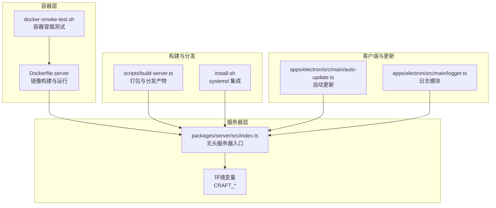
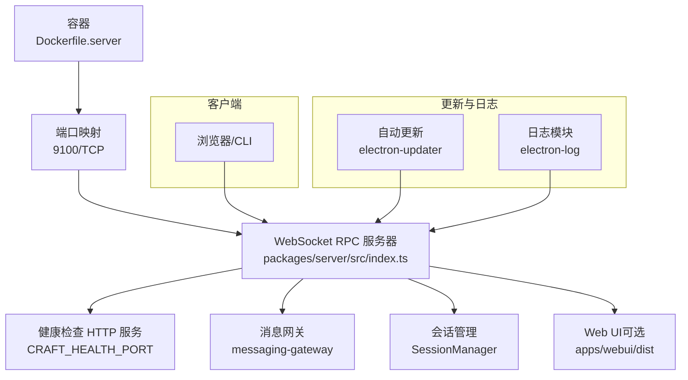
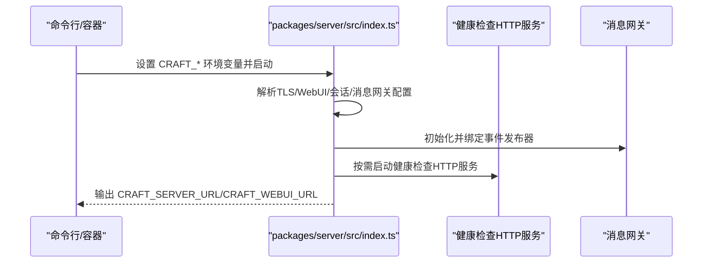
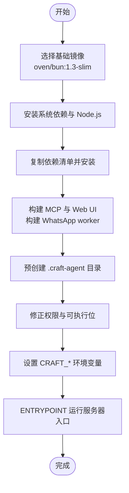
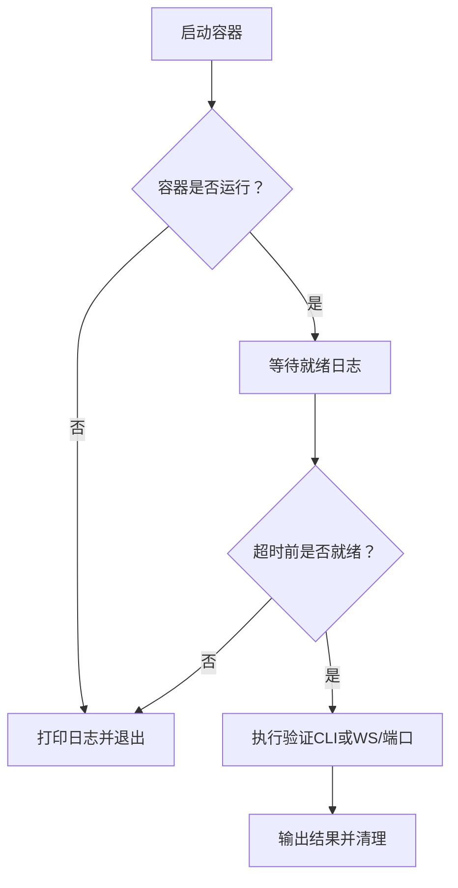
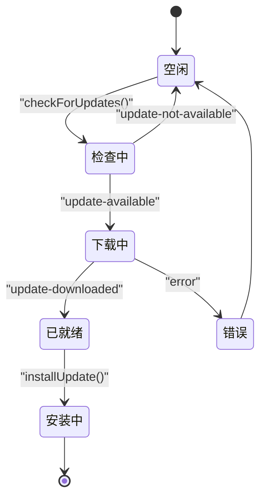
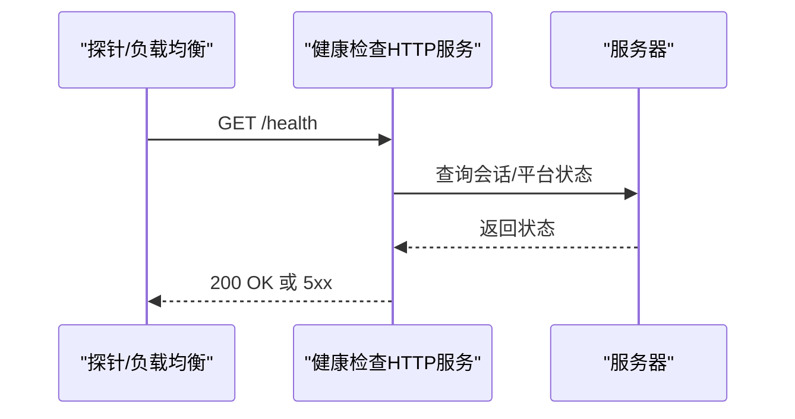
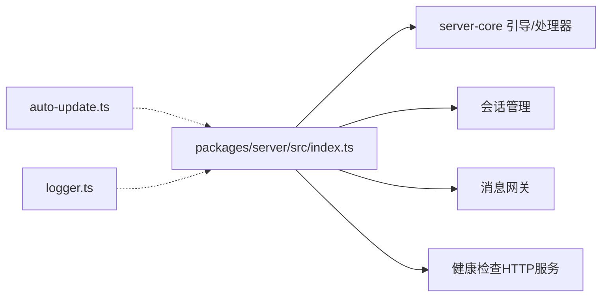

# 远程服务器管理

<cite>
**本文引用的文件**
- [Dockerfile.server](file://Dockerfile.server)
- [scripts/docker-smoke-test.sh](file://scripts/docker-smoke-test.sh)
- [scripts/install-server.sh](file://scripts/install-server.sh)
- [packages/server/src/index.ts](file://packages/server/src/index.ts)
- [apps/electron/src/main/auto-update.ts](file://apps/electron/src/main/auto-update.ts)
- [apps/electron/src/main/logger.ts](file://apps/electron/src/main/logger.ts)
- [scripts/build-server.ts](file://scripts/build-server.ts)
- [apps/electron/resources/config-defaults.json](file://apps/electron/resources/config-defaults.json)
</cite>

## 目录
1. [简介](#简介)
2. [项目结构](#项目结构)
3. [核心组件](#核心组件)
4. [架构总览](#架构总览)
5. [详细组件分析](#详细组件分析)
6. [依赖关系分析](#依赖关系分析)
7. [性能考虑](#性能考虑)
8. [故障排查指南](#故障排查指南)
9. [结论](#结论)
10. [附录](#附录)

## 简介
本文件面向系统管理员与 DevOps 工程师，提供该远程服务器管理项目的完整运维与管理指南。内容覆盖无头服务器部署架构、Docker 容器化配置、环境变量管理、自动更新机制与版本管理、回滚策略、健康检查与监控告警、日志收集、集群与高可用、性能调优与资源限制、以及安全加固最佳实践。

## 项目结构
该项目采用多包工作区（monorepo）组织方式，核心运行时为无头服务器，通过 Bun 启动，支持 WebSocket RPC 与可选 Web UI。服务同时提供 Electron 应用的自动更新能力与专用日志记录模块，便于在生产环境中进行可观测性与问题定位。

图表来源
- [Dockerfile.server:1-120](file://Dockerfile.server#L1-L120)
- [scripts/docker-smoke-test.sh:1-116](file://scripts/docker-smoke-test.sh#L1-L116)
- [packages/server/src/index.ts:1-353](file://packages/server/src/index.ts#L1-L353)
- [scripts/build-server.ts:567-764](file://scripts/build-server.ts#L567-L764)
- [apps/electron/src/main/auto-update.ts:1-438](file://apps/electron/src/main/auto-update.ts#L1-L438)
- [apps/electron/src/main/logger.ts:1-218](file://apps/electron/src/main/logger.ts#L1-L218)

章节来源
- [Dockerfile.server:1-120](file://Dockerfile.server#L1-L120)
- [scripts/docker-smoke-test.sh:1-116](file://scripts/docker-smoke-test.sh#L1-L116)
- [scripts/install-server.sh:1-107](file://scripts/install-server.sh#L1-L107)
- [packages/server/src/index.ts:1-353](file://packages/server/src/index.ts#L1-L353)
- [scripts/build-server.ts:567-764](file://scripts/build-server.ts#L567-L764)
- [apps/electron/src/main/auto-update.ts:1-438](file://apps/electron/src/main/auto-update.ts#L1-L438)
- [apps/electron/src/main/logger.ts:1-218](file://apps/electron/src/main/logger.ts#L1-L218)

## 核心组件
- 无头服务器入口：负责解析环境变量、初始化会话与消息网关、注册 RPC 处理器、启动健康检查 HTTP 服务、绑定 WebSocket RPC 与可选 Web UI。
- Docker 容器镜像：基于 oven/bun:1.3-slim，预装 Node.js（用于 WhatsApp 子进程）、构建 MCP 辅助服务器与 Web UI 资产，暴露 9100 端口，设置非 root 用户运行。
- 自动更新模块：基于 electron-updater，支持多平台下载、进度广播、就地安装与重启；提供“已忽略版本”与缓存检测以提升可靠性。
- 日志模块：统一输出到文件与控制台（调试模式），并提供独立的消息网关日志路径，支持轮转与结构化字段。
- 构建与分发：生成自包含分发目录、systemd 安装脚本、Dockerfile 与 docker-compose 示例，便于快速部署与升级。

章节来源
- [packages/server/src/index.ts:1-353](file://packages/server/src/index.ts#L1-L353)
- [Dockerfile.server:1-120](file://Dockerfile.server#L1-L120)
- [apps/electron/src/main/auto-update.ts:1-438](file://apps/electron/src/main/auto-update.ts#L1-L438)
- [apps/electron/src/main/logger.ts:1-218](file://apps/electron/src/main/logger.ts#L1-L218)
- [scripts/build-server.ts:567-764](file://scripts/build-server.ts#L567-L764)

## 架构总览
下图展示从容器到服务器、再到客户端与更新系统的整体交互：

图表来源
- [Dockerfile.server:106-120](file://Dockerfile.server#L106-L120)
- [packages/server/src/index.ts:298-306](file://packages/server/src/index.ts#L298-L306)
- [apps/electron/src/main/auto-update.ts:1-438](file://apps/electron/src/main/auto-update.ts#L1-L438)
- [apps/electron/src/main/logger.ts:1-218](file://apps/electron/src/main/logger.ts#L1-L218)

## 详细组件分析

### 无头服务器部署与运行
- 入口与环境变量
  - 服务器通过 Bun 执行入口文件，支持多种 CRAFT_* 环境变量进行配置，包括认证令牌、监听地址与端口、TLS 证书与密钥、Web UI 路径与密码、消息网关子进程路径等。
  - 当绑定到非本地地址且未启用 TLS 时，可通过命令行参数允许不安全绑定（仅限受信任网络）。
- 健康检查
  - 可通过设置健康端口启动独立 HTTP 健康检查服务，供外部探针使用。
- Web UI 集成
  - 若启用 Web UI，RPC 服务器端口将同时承载 HTTP 请求处理，WebSocket 升级时校验会话 Cookie。

图表来源
- [packages/server/src/index.ts:98-120](file://packages/server/src/index.ts#L98-L120)
- [packages/server/src/index.ts:298-306](file://packages/server/src/index.ts#L298-L306)
- [packages/server/src/index.ts:307-335](file://packages/server/src/index.ts#L307-L335)

章节来源
- [packages/server/src/index.ts:1-353](file://packages/server/src/index.ts#L1-L353)

### Docker 容器化配置
- 基础镜像与用户
  - 使用 oven/bun:1.3-slim，创建非 root 用户 craftagents，避免 Claude SDK 在 root 下无法运行。
- 系统依赖与 Node.js
  - 安装 ca-certificates、git、ripgrep、curl、gnupg，并通过 NodeSource 安装指定主版本 Node.js（用于 WhatsApp 子进程）。
- 构建步骤
  - 复制依赖清单后执行安装，构建 MCP 辅助服务器与 WhatsApp worker，再构建 Web UI 资产。
- 权限与可执行位
  - 预创建 .craft-agent 目录，对应用树进行最小权限修正，确保任意 --user 可运行。
- 环境变量与入口
  - 默认监听 0.0.0.0:9100，设置 Web UI 与资源根路径，明确 WhatsApp worker 的 Node 可执行路径，最终以 Bun 运行服务器入口。

图表来源
- [Dockerfile.server:26-120](file://Dockerfile.server#L26-L120)

章节来源
- [Dockerfile.server:1-120](file://Dockerfile.server#L1-L120)

### 容器冒烟测试
- 流程
  - 启动容器，等待日志中出现服务器就绪标识，随后执行 --validate-server 或基本连通性检查（WebSocket 握手或端口探测）。
- 关键点
  - 支持超时控制、失败清理、日志采集与退出码处理，便于 CI 集成。

图表来源
- [scripts/docker-smoke-test.sh:38-116](file://scripts/docker-smoke-test.sh#L38-L116)

章节来源
- [scripts/docker-smoke-test.sh:1-116](file://scripts/docker-smoke-test.sh#L1-L116)

### 自动更新机制与版本管理
- 更新源与平台行为
  - 使用 electron-updater，按平台提供下载与安装流程（macOS/Windows/Linux）。
- 状态与事件
  - 提供“检查中/可用/下载中/已就绪/错误/安装中”状态机，广播下载进度与可用信息。
- 缓存与回退
  - 优先读取 electron-updater 内部状态，其次扫描缓存目录中的 update-info.json 与安装包文件，实现“已下载但未安装”的识别与回显。
- 用户交互
  - 支持“已忽略版本”跳过通知，安装前清除忽略记录，确保用户主动升级。

图表来源
- [apps/electron/src/main/auto-update.ts:130-221](file://apps/electron/src/main/auto-update.ts#L130-L221)
- [apps/electron/src/main/auto-update.ts:316-361](file://apps/electron/src/main/auto-update.ts#L316-L361)
- [apps/electron/src/main/auto-update.ts:371-398](file://apps/electron/src/main/auto-update.ts#L371-L398)

章节来源
- [apps/electron/src/main/auto-update.ts:1-438](file://apps/electron/src/main/auto-update.ts#L1-L438)

### 回滚策略
- 服务器侧
  - 通过构建脚本生成自包含分发目录与 systemd 安装脚本，结合压缩归档便于版本切换与回滚。
- 客户端侧
  - electron-updater 在安装过程中执行平台特定替换与重启，若安装失败会回传错误状态，建议保留上一版本以便手动回滚。

章节来源
- [scripts/build-server.ts:708-764](file://scripts/build-server.ts#L708-L764)
- [apps/electron/src/main/auto-update.ts:371-398](file://apps/electron/src/main/auto-update.ts#L371-L398)

### 健康检查、监控告警与日志收集
- 健康检查
  - 服务器可单独启动 HTTP 健康检查服务，供外部探针使用；Web UI 中注入懒加载的健康检查函数。
- 日志
  - 调试模式下输出结构化 JSON 文件与控制台日志；提供独立的消息网关日志文件路径，支持大小轮转。
- 监控告警
  - 结合健康检查端口与日志文件，可接入标准监控系统（如 Prometheus、Grafana、ELK）进行指标与日志采集。

图表来源
- [packages/server/src/index.ts:298-306](file://packages/server/src/index.ts#L298-L306)
- [apps/electron/src/main/logger.ts:84-104](file://apps/electron/src/main/logger.ts#L84-L104)

章节来源
- [packages/server/src/index.ts:298-306](file://packages/server/src/index.ts#L298-L306)
- [apps/electron/src/main/logger.ts:1-218](file://apps/electron/src/main/logger.ts#L1-L218)

### 配置与默认值
- 配置默认文件
  - 包含默认配置项（如通知、主题、输入行为、权限模式等），用于初始化工作空间默认值。
- 环境变量
  - 服务器入口定义了完整的 CRAFT_* 环境变量列表，涵盖认证、TLS、Web UI、消息网关、运行时路径等。

章节来源
- [apps/electron/resources/config-defaults.json:1-24](file://apps/electron/resources/config-defaults.json#L1-L24)
- [packages/server/src/index.ts:8-26](file://packages/server/src/index.ts#L8-L26)

### 部署与分发
- 自包含分发
  - 构建脚本生成包含 Bun 运行时、uv、资源与入口脚本的目录，提供 bin/craft-server 与 start.sh 快速启动。
- systemd 集成
  - 自动生成 install.sh，支持生成 .env、设置 WorkingDirectory、EnvironmentFile、重启策略等，便于生产部署。

章节来源
- [scripts/build-server.ts:567-706](file://scripts/build-server.ts#L567-L706)
- [scripts/build-server.ts:708-764](file://scripts/build-server.ts#L708-L764)

## 依赖关系分析
- 组件耦合
  - 服务器入口依赖 server-core 的引导与 RPC 注册、会话管理、模型刷新服务、消息网关等模块。
  - 自动更新模块与日志模块作为客户端侧能力，与服务器入口解耦。
- 外部依赖
  - Docker 镜像依赖 oven/bun 与 NodeSource 的 Node.js；WhatsApp 子进程依赖 Node.js 运行时。
- 环境变量契约
  - 服务器通过 CRAFT_* 环境变量驱动行为，构建脚本与容器镜像均遵循相同契约，保证一致性。

图表来源
- [packages/server/src/index.ts:33-50](file://packages/server/src/index.ts#L33-L50)
- [apps/electron/src/main/auto-update.ts:1-438](file://apps/electron/src/main/auto-update.ts#L1-L438)
- [apps/electron/src/main/logger.ts:1-218](file://apps/electron/src/main/logger.ts#L1-L218)

章节来源
- [packages/server/src/index.ts:33-50](file://packages/server/src/index.ts#L33-L50)
- [apps/electron/src/main/auto-update.ts:1-438](file://apps/electron/src/main/auto-update.ts#L1-L438)
- [apps/electron/src/main/logger.ts:1-218](file://apps/electron/src/main/logger.ts#L1-L218)

## 性能考虑
- 内存与构建
  - Web UI 构建阶段默认 V8 堆上限，针对低内存主机建议提升堆大小以避免构建失败。
- 运行时优化
  - 使用 Bun 作为运行时，具备较低延迟与内存占用；合理设置会话与消息网关并发，避免阻塞。
- 资源限制
  - 在容器或 systemd 中设置 CPU/内存限额，结合健康检查与日志告警，及时发现异常。

章节来源
- [Dockerfile.server:89-92](file://Dockerfile.server#L89-L92)
- [scripts/build-server.ts:708-764](file://scripts/build-server.ts#L708-L764)

## 故障排查指南
- 容器启动失败
  - 查看容器日志，确认就绪信号是否出现；若未出现，检查环境变量与卷挂载。
- WebSocket 认证失败
  - 确认 CRAFT_SERVER_TOKEN 设置正确，且客户端请求头携带 x-craft-token。
- 不安全绑定警告
  - 绑定到非本地地址必须启用 TLS；如确需不安全绑定，请使用允许参数并评估风险。
- 自动更新失败
  - 检查缓存目录是否存在有效下载文件，查看 electron-updater 日志与错误状态；必要时重新触发检查。
- 日志定位
  - 调试模式下查看主日志文件路径；消息网关日志位于稳定路径，便于跨版本排查。

章节来源
- [scripts/docker-smoke-test.sh:48-78](file://scripts/docker-smoke-test.sh#L48-L78)
- [packages/server/src/index.ts:314-335](file://packages/server/src/index.ts#L314-L335)
- [apps/electron/src/main/auto-update.ts:212-221](file://apps/electron/src/main/auto-update.ts#L212-L221)
- [apps/electron/src/main/logger.ts:208-215](file://apps/electron/src/main/logger.ts#L208-L215)

## 结论
本项目提供了从容器镜像、无头服务器、自动更新到日志与健康检查的完整运维闭环。通过标准化的环境变量、自包含分发与 systemd 集成，可在生产环境中实现快速部署、稳定运行与可控回滚。建议在公网部署时强制启用 TLS，并结合健康检查与日志告警体系，持续保障系统可用性与安全性。

## 附录
- 快速启动
  - 使用安装脚本生成令牌并打印启动命令；或直接使用 Docker 镜像运行。
- 版本与回滚
  - 通过构建脚本生成的归档与 systemd 配置，实现版本切换与回滚。
- 安全加固
  - 强制 TLS、最小权限用户、严格的环境变量校验、日志轮转与审计路径。

章节来源
- [scripts/install-server.sh:68-106](file://scripts/install-server.sh#L68-L106)
- [Dockerfile.server:42-46](file://Dockerfile.server#L42-L46)
- [scripts/build-server.ts:708-764](file://scripts/build-server.ts#L708-L764)